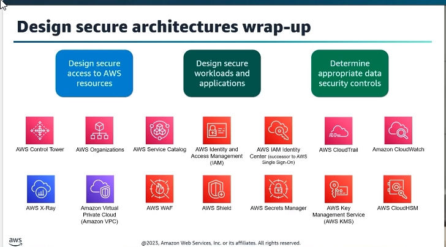
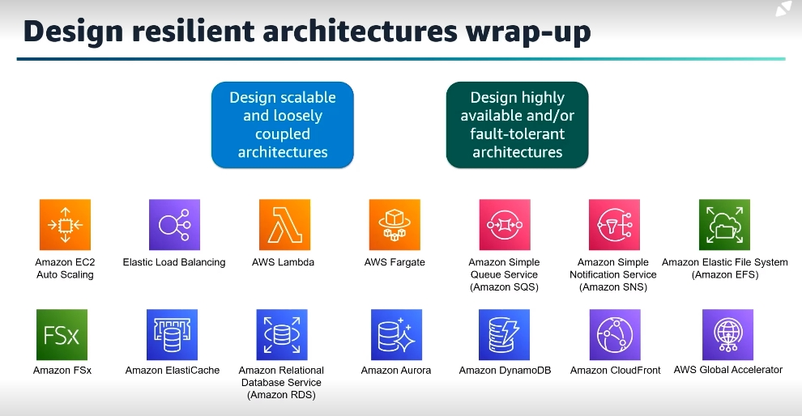
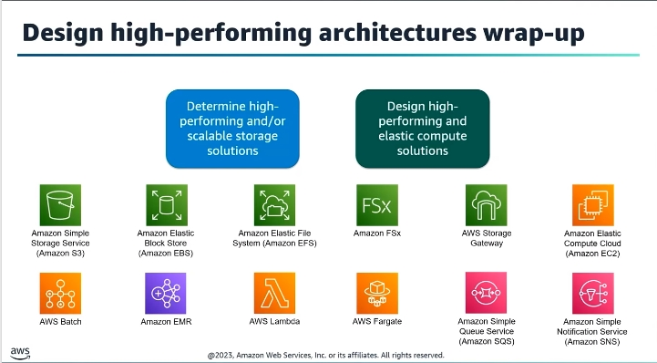
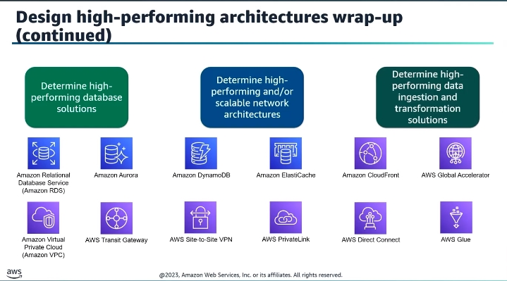
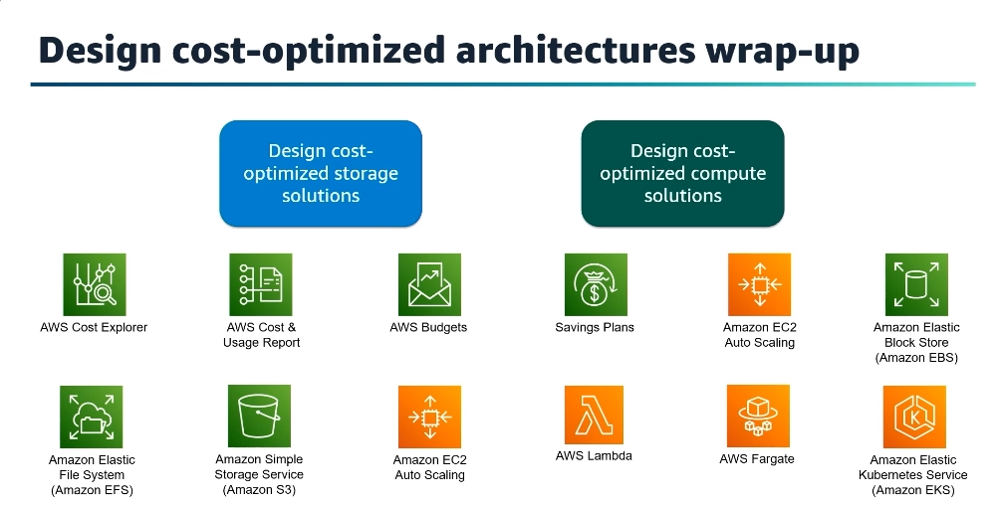
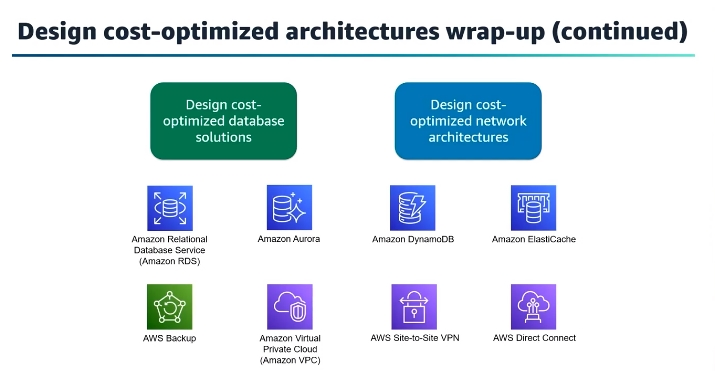

# Domain 1: Design Secure Architectures
- Task Statement 1.1: Design secure access to AWS resources.
- Task Statement 1.2: Design secure workloads and applications.
- Task Statement 1.3: Determine appropriate data security controls.
- Related Services
    - AWS Organizations
    - AWS Control Tower
    - AWS Service Catalog
    - AWS Identity and Access Management
    - AWS IAM Identity Center(AWS Single Sign On)
    - AWS CloudTrial
    - Amazone CloudWatch
    - AWS X-Ray
    - Amazon VPC
    - AWS WAF
    - AWS Shield
    - AWS Secrets Manager
    - AWS Key Management Service
    - AWS CloudHSM
    - 
# Domain 2: Design Resilient Architectures
- Task Statement 2.1: Design scalable and loosely coupled architectures.
- Task Statement 2.2: Design highly available and/or fault-tolerant architectures.
- Related Services
    - Amazon EC2 Auto Scaling
    - Elastic Load Balancing
    - AWS Lambda
    - AWS Fargate
    - Amazon Simple Queue Service
    - Amazon Simple Notification Service
    - Amazon Elastic File System(EFS)
    - Amazon FSx
    - Amazon ElastiCache
    - Amazon Relational Database
    - Amazon Aurora
    - Amazon DynamoDB
    - Amazon CloudFront
    - AWS Global Accelerator
    - 
# Domain 3: Design High-Performing Architectures
- Task Statement 3.1: Determine high-performing and/or scalable storage solutions.
- Task Statement 3.2: Design high-performing and elastic compute solutions.
- Task Statement 3.3: Determine high-performing database solutions.
- Task Statement 3.4: Determine high-performing and/or scalable network
- Task Statement 3.5: Determine high-performing data ingestion and transformation
- Related Services
    - Amazon Simple Storage Service
    - Amazon Elastic Block Store(EBS)
    - Amazon Elastic File System(EFS)
    - Amazon FSx
    - AWS Storage Gateway
    - Amazon EC2
    - AWS Batch
    - Amazon EMR
    - AWS Lambda
    - AWS Fargate
    - Amazon Simple Queue Service
    - Amazon Simple Notification Service  
    - Amazon ElastiCache
    - Amazon Relational Database
    - Amazon Aurora
    - Amazon DynamoDB
    - Amazon CloudFront
    - AWS Global Accelerator
    - Amazon VPC
    - AWS Transit Gateway
    - AWS Site-to-Site VPN
    - AWS PrivateLink
    - AWS Direct Connect
    - AWS Glue
    - 
    - 

# Domain 4: Design Cost-Optimized Architectures
- Task Statement 4.1: Design cost-optimized storage solutions.
- Task Statement 4.2: Design cost-optimized compute solutions.
- Task Statement 4.3: Design cost-optimized database solutions.
- Task Statement 4.4: Design cost-optimized network architectures.
- Related Services
    - AWS Cost Explore
    - AWS Cost & Usage Report
    - AWS Budgets
    - Savings Plans
    - Amazon EC2 Auto Scaling
    - Amazon Simple Storage Service
    - Amazon Elastic Block Store(EBS)
    - Amazon Elastic File System(EFS)
    - AWS Lambda
    - Amazon Elastic Kubernetes Service
    - Amazon ElastiCache
    - Amazon Relational Database
    - Amazon Aurora
    - Amazon DynamoDB
    - AWS Backup
    - Amazon VPC\
    - AWS Site-to-Site VPNs
    - AWS Direct Connect
    - 
    - 

# In-scope AWS services and features
## Management and Governance:
- [AWS Organizations](../aws-service/1-ManagementAndGovernance/1-AWSOrganizations.md)
- [AWS Control Tower](../aws-service/1-ManagementAndGovernance/2-AWSControlTower.md)
- [AWS Service Catalog](../aws-service/1-ManagementAndGovernance/3-AWSServiceCatalog.md)
- [AWS CloudTrail](../aws-service/1-ManagementAndGovernance/4-AWSCloudTrail.md)
- [AWS Config](../aws-service/1-ManagementAndGovernance/5-AWSConfig.md)
- [AWS Systems Manager](../aws-service/1-ManagementAndGovernance/6-AWSSystemsManager.md)
- [AWS Trusted Advisor](../aws-service/1-ManagementAndGovernance/7-AWSTrustedAdvisor.md)
- [AWS License Manager](../aws-service/1-ManagementAndGovernance/8-AWSLicenseManager.md)
- [AWS Auto Scaling](../aws-service/1-ManagementAndGovernance/9-AWSAutoScaling.md)
- [Amazon CloudWatch](../aws-service/1-ManagementAndGovernance/10-AmazonCloudWatch.md)
- [AWS CloudFormation](../aws-service/1-ManagementAndGovernance/11-AWSCloudFormation.md)
- [AWS Well-Architected Tool](../aws-service/1-ManagementAndGovernance/12-AWSWellArchitectedTool.md)
- [AWS Compute Optimizer](../aws-service/1-ManagementAndGovernance/13-AWSComputeOptimizer.md)
- [AWS Proton](../aws-service/1-ManagementAndGovernance/14-AWSProton.md)
- [AWS Health Dashboard](../aws-service/1-ManagementAndGovernance/15-AWSHealth.md)
- [Amazon Managed Grafana](../aws-service/1-ManagementAndGovernance/16-AmazonManagedGrafana.md)
- [Amazon Managed Service for Prometheus](../aws-service/1-ManagementAndGovernance/17-AmazonManagedServiceforPrometheus.md)
- AWS Management Console
- AWS Command Line Interface (AWS CLI)
## Security, Identity, and Compliance:
- [AWS Identity and Access Management (IAM)](../aws-service/2-SecurityIdentityAndCompliance/1-AWSIdentityAndAccessManagement.md)
- [AWS IAM Identity Center (AWS Single Sign-On)](../aws-service/2-SecurityIdentityAndCompliance/2-AWSIAMIdentityCentern.md)
- [Amazon Cognito](../aws-service/2-SecurityIdentityAndCompliance/3-AWSCognito.md)
- [AWS Directory Service](../aws-service/2-SecurityIdentityAndCompliance/4-AWSDirectoryService.md)
- [AWS Certificate Manager (ACM)](../aws-service/2-SecurityIdentityAndCompliance/5-AWSCertificateManager.md)
- [AWS Secrets Manager](../aws-service/2-SecurityIdentityAndCompliance/6-AWSSecretsManager.md)
- [AWS CloudHSM](../aws-service/2-SecurityIdentityAndCompliance/7-AWSCloudHSM.md)
- [AWS Key Management Service (AWS KMS)](../aws-service/2-SecurityIdentityAndCompliance/8-AWSKeyManagementService.md)
- [AWS Network Firewall](../aws-service/2-SecurityIdentityAndCompliance/9-AWSNetworkFirewall.md)
- [AWS WAF](../aws-service/2-SecurityIdentityAndCompliance/10-AWSWAF&AWSFirewallManager&AWSShield.md)
- [AWS Firewall Manager](../aws-service/2-SecurityIdentityAndCompliance/10-AWSWAF&AWSFirewallManager&AWSShield.md)
- [AWS Shield](../aws-service/2-SecurityIdentityAndCompliance/10-AWSWAF&AWSFirewallManager&AWSShield.md)
- [Amazon GuardDuty](../aws-service/2-SecurityIdentityAndCompliance/11-AWSGuardDuty.md)
- [Amazon Inspector](../aws-service/2-SecurityIdentityAndCompliance/12-AmazonInspector.md)
- [AWS Security Hub](../aws-service/2-SecurityIdentityAndCompliance/13-AmazonSecurityHub.md)
- [Amazon Macie](../aws-service/2-SecurityIdentityAndCompliance/14-AmazonMacie.md)
- [AWS Audit Manager](../aws-service/2-SecurityIdentityAndCompliance/15-AWSAuditManager.md)
- [Amazon Detective](../aws-service/2-SecurityIdentityAndCompliance/16-AmazonDetective.md)
- [AWS Artifact](../aws-service/2-SecurityIdentityAndCompliance/17-AWSArtifact.md)
- [AWS Resource Access Manager (AWS RAM)](../aws-service/2-SecurityIdentityAndCompliance/18-AWSResourceAccessManager.md)
## AWS Cost Management:
- [AWS Budgets](../aws-service/3-CostManagement/AWSCostManagementService.md)
- [AWS Cost and Usage Report](../aws-service/3-CostManagement/AWSCostManagementService.md)
- [AWS Cost Explorer](../aws-service/3-CostManagement/AWSCostManagementService.md)
- [Savings Plans](../aws-service/3-CostManagement/AWSCostManagementService.md)
## Networking and Content Delivery:
- [Amazon VPC](../aws-service/4-NetworkingAndContentDelivery/1-AmazonVPC.md)
- [AWS Transit Gateway](../aws-service/4-NetworkingAndContentDelivery/2-AWSTransitGateway.md)
- [AWS PrivateLink](../aws-service/4-NetworkingAndContentDelivery/3-AWSPrivateLink.md)
- [AWS Direct Connect](../aws-service/4-NetworkingAndContentDelivery/4-AWSDirectConnect.md)
- [Elastic Load Balancing (ELB)](../aws-service/4-NetworkingAndContentDelivery/5-AWSElasticLoadBalancing.md)
- [Amazon CloudFront](../aws-service/4-NetworkingAndContentDelivery/6-AmazonCloudFront.md)
- [AWS Global Accelerator](../aws-service/4-NetworkingAndContentDelivery/7-AWSGlobalAccelerator.md)
- [Amazon Route 53](../aws-service/4-NetworkingAndContentDelivery/8-AmazonRoute53.md)
- [AWS Site-to-Site VPN](../aws-service/4-NetworkingAndContentDelivery/9-AWSSite-to-SiteVPN.md)
- [AWS Client VPN](../aws-service/4-NetworkingAndContentDelivery/10-AWSClientVPN.md)
## Compute:
- [Amazon EC2](../aws-service/5-Compute/1-AmazonEC2.md)
- [Amazon EC2 Auto Scaling](../aws-service/5-Compute/2-AmazonEC2AutoScaling.md)
- [AWS Elastic Beanstalk](../aws-service/5-Compute/3-AWSElasticBeanstalk.md)
- [AWS Batch](../aws-service/5-Compute/4-AWSBatch.md)
- [AWS Outposts](../aws-service/5-Compute/5-AWSOutposts.md)
- [AWS Serverless Application Repository](../aws-service/5-Compute/6-AWSServerlessApplicationRepository.md)
- [VMware Cloud on AWS](../aws-service/5-Compute/7-VMwareCloudOnAWS.md)
- [AWS Wavelength](../aws-service/5-Compute/8-AWSWavelength.md)
## Containers:
- [Amazon Elastic Container Service (Amazon ECS)](../aws-service/6-Containers/1-AmazonElasticContainerService.md)
- [Amazon Elastic Container Registry (Amazon ECR)](../aws-service/6-Containers/2-AmazonElasticContainerRegistry.md)
- [Amazon Elastic Kubernetes Service (Amazon EKS)](../aws-service/6-Containers/3-AmazonElasticKubernetesService.md)
- [Amazon ECS Anywhere](../aws-service/6-Containers/4-AmazonElasticContainerServiceAnywhere.md)
- [Amazon EKS Anywhere](../aws-service/6-Containers/5-AmazonElasticKubernetesServiceAnywhere.md)
- [Amazon EKS Distro](../aws-service/6-Containers/6-AmazonElasticKubernetesServiceDistro.md)
## Serverless:
- [AWS Lambda](../aws-service/7-Serverless/1-AWSLambda.md)
- [AWS Fargate](../aws-service/7-Serverless/2-AWSFarget.md)
- [AWS AppSync](../aws-service/7-Serverless/3-AWSAppSync.md)
## Storage:
- [Amazon S3](../aws-service/8-Storage/1-AmazonS3.md)
- [Amazon S3 Glacier](../aws-service/8-Storage/2-AmazonS3Glacier.md)
- [AWS Storage Gateway](../aws-service/8-Storage/3-AWSStorageGateway.md)
- [Amazon Elastic Block Store (Amazon EBS)](../aws-service/8-Storage/4-AmazonElasticBlockStore.md)
- [Amazon Elastic File System (Amazon EFS)](../aws-service/8-Storage/5-AmazonElasticFileSystem.md)
- [Amazon FSx for Windows File Server](../aws-service/8-Storage/6-AmazonFSxForWindowsFileServer.md)
- [Amazon FSx for Lustre](../aws-service/8-Storage/7-AmazonFSxForLustre.md)
- [Amazon FSx for NetApp ONTAP](../aws-service/8-Storage/8-AmazonFSxForNetAppONTAP.md)
- [Amazon FSx for OpenZFS](../aws-service/8-Storage/9-AmazonFSxForOpenZFS.md)
- [AWS Backup](../aws-service/8-Storage/10-AWSBackup.md)
## Database:
- [Amazon Aurora](../aws-service/9-Database/1-AmazonAurora.md)
- [Amazon Aurora Serverless](../aws-service/9-Database/2-AmazonAuroraServerless.md)
- [Amazon RDS](../aws-service/9-Database/3-AmazonRDS.md)
- [Amazon Redshift](../aws-service/9-Database/4-AmazonRedshift.md)
- [Amazon DynamoDB](../aws-service/9-Database/5-AmazonDynamoDB.md)
- [Amazon ElastiCache](../aws-service/9-Database/6-AmazonElastiCache.md)
- [Amazon DocumentDB (with MongoDB compatibility)](../aws-service/9-Database/7-AmazonDocumentDB.md)
- [Amazon Keyspaces (for Apache Cassandra)](../aws-service/9-Database/8-AmazonKeyspaces.md)
- [Amazon Neptune](../aws-service/9-Database/9-AmazonNeptune.md)
- [Amazon Quantum Ledger Database (Amazon QLDB)](../aws-service/9-Database/10-AmazonQuantumLedgerDatabase.md)
## Migration and Transfer:
- [AWS Snow Family](../aws-service/10-MigrationAndTransfer/1-AWSSnowFamily.md)
- [AWS Transfer Family](../aws-service/10-MigrationAndTransfer/2-AWSTransferFamily.md)
- [AWS Database Migration Service (AWS DMS)](../aws-service/10-MigrationAndTransfer/3-AWSDatabaseMigrationService.md)
- [AWS DataSync](../aws-service/10-MigrationAndTransfer/4-AWSDataSync.md)
- [AWS Application Discovery Service](../aws-service/10-MigrationAndTransfer/5-AWSApplicationDiscoveryService.md)
- [AWS Application Migration Service](../aws-service/10-MigrationAndTransfer/6-AWSApplicationMigrationService.md)
- [AWS Migration Hub](../aws-service/10-MigrationAndTransfer/7-AWSMigrationHub.md)
## Analytics:
- [Amazon Athena](../aws-service/11-Analytics/1-AmazonAthena.md)
- [Amazon Kinesis Data Streams](../aws-service/11-Analytics/2-AmazonKinesisDataStreams.md)
- [Amazon Kinesis Data Firehose](../aws-service/11-Analytics/3-AmazonKinesisDataFirehose.md)
- [Amazon Kinesis Data Analytics](../aws-service/11-Analytics/4-AmazonKinesisDataAnalytics.md)
- [Amazon Kinesis Video Streams](../aws-service/11-Analytics/5-AmazonKinesisVideoStreams.md)
- [AWS Lake Formation](../aws-service/11-Analytics/6-AWSLakeFormation.md)
- [Amazon OpenSearch Service](../aws-service/11-Analytics/7-AmazonOpenSearchService.md)
- [Amazon QuickSight](../aws-service/11-Analytics/8-AmazonQuickSight.md)
- [Amazon Redshift](../aws-service/9-Database/4-AmazonRedshift.md)
- [AWS Data Exchange](../aws-service/11-Analytics/9-AWSDataExchange.md)
- [AWS Data Pipeline](../aws-service/11-Analytics/10-AWSDataPipeline.md)
- [Amazon EMR](../aws-service/11-Analytics/11-AmazonEMR.md)
- [AWS Glue](../aws-service/11-Analytics/12-AWSGlue.md)
- [Amazon Managed Streaming for Apache Kafka (Amazon MSK)](../aws-service/11-Analytics/13-AmazonManagedStreamingForApacheKafka.md)
## Application Integration:
- [Amazon Simple Notification Service (Amazon SNS)](../aws-service/12-ApplicationIntegration/1-AmazonSimpleNotificationService.md)
- [Amazon Simple Queue Service (Amazon SQS)](../aws-service/12-ApplicationIntegration/2-AmazonSimpleQueueService.md)
- [AWS Step Functions](../aws-service/12-ApplicationIntegration/3-AWSStepFunctions.md)
- [Amazon EventBridge](../aws-service/12-ApplicationIntegration/4-AmazonEventBridge.md)
- [Amazon AppFlow](../aws-service/12-ApplicationIntegration/5-AmazonAppFlow.md)
- [AWS AppSync](../aws-service/7-Serverless/3-AWSAppSync.md)
- [Amazon MQ](../aws-service/12-ApplicationIntegration/6-AmazonMQ.md)
## Developer Tools:
- [AWS X-Ray](../aws-service/13-DeveloperTools/1-XRray.md)
## Front-End Web and Mobile:
- [Amazon API Gateway](../aws-service/14-FrontEndWebAndMobile/1-AmazonAPIGateway.md)
- [AWS Amplify](../aws-service/14-FrontEndWebAndMobile/2-AWSAmplify.md)
- [AWS Device Farm](../aws-service/14-FrontEndWebAndMobile/3-AWSDeviceFarm.md)
- [Amazon Pinpoint](../aws-service/14-FrontEndWebAndMobile/4-AmazonPinpoint.md)
## Machine Learning:
- [Amazon Comprehend](../aws-service/15-MachineLearning/1-AmazonComprehend.md)
- [Amazon Forecast](../aws-service/15-MachineLearning/2-AmazonForecast.md)
- [Amazon Fraud Detector](../aws-service/15-MachineLearning/3-AmazonFraudDetector.md)
- [Amazon Kendra](../aws-service/15-MachineLearning/4-AmazonKendra.md)
- [Amazon Lex](../aws-service/15-MachineLearning/5-AmazonLex.md)
- [Amazon Polly](../aws-service/15-MachineLearning/6-AmazonPolly.md)
- [Amazon Rekognition](../aws-service/15-MachineLearning/7-AmazonRekognition.md)
- [Amazon SageMaker](../aws-service/15-MachineLearning/8-AmazonSageMaker.md)
- [Amazon Textract](../aws-service/15-MachineLearning/9-AmazonTextract.md)
- [Amazon Transcribe](../aws-service/15-MachineLearning/10-AmazonTranscribe.md)
- [Amazon Translate](../aws-service/15-MachineLearning/11-AmazonTranslate.md)
## Media Services:
- [Amazon Elastic Transcoder](../aws-service/16-MediaServices/1-AmazonElasticTranscoder.md)
- [Amazon Kinesis Video Streams](../aws-service/11-Analytics/5-AmazonKinesisVideoStreams.md)

# Reference
- [AWS Certified Solutions Architect-Associate Exam Guide](./1-AWS-Certified-Solutions-Architect-Associate_Exam-Guide.pdf)
- [AWS Ramp Up Guide Solutions Architect](./2-AWS-Ramp-Up-Guide-Solutions-Architect.pdf)
