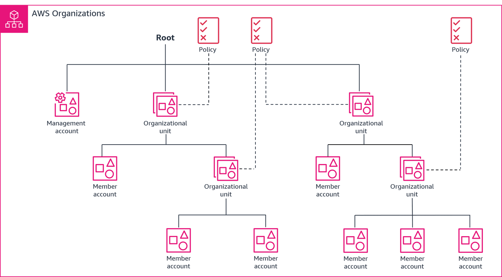

# Overview
+ AWS Organizations is an **account management service** that enables you to consolidate multiple AWS accounts into an organization that you create and centrally manage.
+ AWS Organizations includes **account management and consolidated billing capabilities** that enable you to better meet the budgetary, security, and compliance needs of your business
+ AWS Organizations is offered at **no additional charge**. You are charged only for AWS resources that users and roles in your member accounts use. 
# AWS Organizations terminology and concepts

## **Organization**
+ An entity that you create to consolidate your AWS accounts so that you can administer them as a single unit.
+ An organization has **one management account along with zero or more member accounts**.
+ You can organize the accounts in a **hierarchical, tree-like structure with a root at the top and organizational units nested under the root**.
+ Each account can be **directly in the root**, or **placed in one of the OUs in the hierarchy**.
## **Root**
+ The **parent container** for all the accounts for your organization.
+ If you apply a policy to the root, it applies to all organizational units (OUs) and accounts in the organization.
## **Organizational unit**(OU) 
+ A **container for accounts** within a root
+ When you attach a policy to one of the nodes in the hierarchy, it flows down and affects all the branches (OUs) and leaves (accounts) beneath it.
+ OUs are intended to group accounts that have common overarching security policies and operational needs
+ **An OU can have exactly one parent**, and currently **each account can be a member of exactly one OU**.
+ **Each OU can contain multiple accounts**, and you can move accounts from one OU to another.
+ OUs can be nested up to five levels deep.
+ You can use organizational units (OUs) to **group accounts together** to administer as a single unit. This greatly simplifies the management of your accounts
## **Account**
+ An account in Organizations is a standard AWS account that contains your AWS resources and the identities that can access those resources.
+ There are two types of accounts in an organization: a single account that is designated as the **management account**, and one or more **member accounts**.
+ **A delegated administrator account is a member account** that can manage a service or administrative feature as permitted or assigned by the management account. 
## Policy types
+ Authorization policies
    + Authorization policies help you to centrally manage the security of the AWS accounts in your organization.
    + Service control policies (SCPs) offer central control over **the maximum available permissions** for all of the accounts in your organization.
+ Management policies
    + Management policies enable you to centrally configure and manage AWS services and their features.
    + **Artificial Intelligence (AI) services** opt-out policies enable you to control data collection for AWS AI services for all of your organization's accounts.
    + **Backup policies** help you centrally manage and apply backup plans to the AWS resources across your organization's accounts.
    + **Tag policies** help you standardize the tags attached to the AWS resources in your organization's accounts.
## **Service control policy (SCP)**
+ A policy that **specifies the services and actions that users and roles can use** in the accounts that the SCP affects.
+ SCPs are similar to IAM permissions policies except that they **don't grant any permissions**.
+ Instead, SCPs **specify the maximum permissions** for an organization, organizational unit (OU), or account.
+ When you attach an SCP to your organization root or an OU, the SCP limits permissions for entities in member accounts.
+ SCPs can restrict what users and even administrators can do in affected accounts. 
+ The management account isn't affected by any SCP. You can't limit what users and roles in the management account can do by applying SCPs. SCPs affect only member accounts.
## **Backup policy**
+ A type of policy that helps you standardize and implement a backup strategy for the resources across all of the accounts in your organization.

# Best practices for the management account
+ Use the management account only for tasks that require the management account
+ Use a group email address for the management account's root user
+ Use a complex password for the management account's root user
+ Enable MFA for your root user credentials
+ Add a phone number to the account contact information
+ Review and keep track of who has access
+ Document the processes for using the root user credentials
+ Apply controls to monitor access to the root user credentials
# Best practices for member accounts
+ Use a group email address for all member account root users
+ Use a complex password for member account root user
+ Enable MFA for your root user credentials
+ Add the management account's phone number to the member account contact information
+ Review and keep track of who has access
+ Document the processes for using the root user credentials
+ Use an SCP to restrict what the root user in your member accounts can do
+ Apply controls to monitor access to the root user credentials
+ Limit who has access to the management account.
+ Group workloads based on business purpose, not reporting structure.
+ Use multiple accounts to organize your workloads.
+ Turn on AWS services at the organizational level using the service’s console, API, or AWS CLI operations.
+ Avoid deploying workloads to the organization’s management account.
# Features
+ All features – This feature set is the preferred way to work with AWS Organizations, and it includes Consolidating Billing features.
    + When you create an organization, enabling all features is the default.
    + With all features enabled, you can use the advanced account management features available in AWS Organizations such as integration with supported AWS services and organization management policies.
    + Because enabling all features makes it possible to use SCPs, be sure that your account administrators understand the effects of attaching SCPs to the organization, organizational units, or accounts.
+ Consolidated Billing features – All organizations support this subset of features, which provides basic management tools that you can use to centrally manage the accounts in your organization.
# AWS Account Management
+ AWS Account Management **extends AWS Organizations** to also include **the management of the metadata attached to an AWS account**, such as the alternate contact information.
+ When you **enable trusted access for Account Management**, the Account Management service **grants Organizations and its management account permissions to access the metadata for all of the organization's member accounts**.
+ After you enable trusted access, you can also choose to **designate one of your member accounts as a *delegated admin* account** for AWS Account Management. 
# What are the benefits of Organizations?
+ Provide centralized management across a multi-account environment
+ Optimize costs and identify cost savings
+ Customize your environment by applying policies and controls
+ Add layers of protection through IAM integration and support
    + In addition to the AWS Identity and Access Management (IAM) functionality for users and roles, you have additional granularity to set permissions at an account level with Organizations. You can add another layer of protection to accounts that cannot be superseded by any users in the account.
+ Operate across Regions with global access
+ Secure and audit your environment
+ Share resources across developer teams rapidly and securely
+ Use at no extra charge
+ You can use Organizations to consolidate bills across multiple accounts.
# Questions
+ Which of the following problems does AWS Organizations solve?
    + Reduces the price of AWS services
    + Decreases latency of file transfer between accounts
    + Provides a low-code alternative for AWS Identity and Access Management (IAM)
    + **Includes policies to control access over accounts**
+ What are some benefits of using AWS Organizations? (Select THREE.)
    + **Centralized billing management**
    + High bandwidth connections between accounts
    + **Hierarchal grouping of accounts**
    + Cost optimization console
    + **Centralized security findings from AWS security services**
    + Integration and support for AWS Identity and Access Management (IAM)
# Reference
+ [What is AWS Organizations? - AWS Organizations](https://docs.aws.amazon.com/organizations/latest/userguide/orgs_introduction.html)
+ [Welcome to the AWS Account Management Reference Guide - AWS Account Management](https://docs.aws.amazon.com/accounts/latest/reference/accounts-welcome.html)
+ [AWS Organizations Getting Started](https://explore.skillbuilder.aws/learn/course/17698/aws-organizations-getting-started)
+ [Centrally detect and investigate security findings with AWS Organizations integrations](https://aws.amazon.com/blogs/mt/centrally-detect-and-investigate-security-findings-with-aws-organizations-integrations/)
