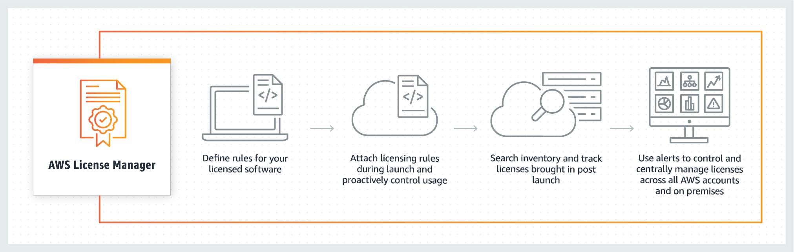

# Overview
+ AWS License Manager is a service that makes it easier for you to **manage your software licenses** from software vendors centrally across AWS and your on-premises environments. 
+ This provides **control and visibility** into the usage of your licenses, enabling you to **limit licensing overages and reduce the risk of non-compliance and misreporting**.
+ With **rule-based controls** on the consumption of licenses, administrators can **set hard or soft limits on new and existing cloud deployments**. Based on these limits, License Manager helps **stop non-compliant server usage** before it happens.
+ License Manager supports tracking any software that is licensed based on virtual cores (vCPUs), physical cores, sockets, or number of machines.
+ With License Manager, a license administrator can **distribute, activate, and track software licenses across accounts and throughout an organization**.
+ You can create licenses in AWS License Manager and **distribute them to end users using an IAM identity or through digitally signed tokens** generated by AWS License Manager.
+ If you are responsible for managing licenses in your organization, you can use License Manager to set up licensing rules, attach them to your launches, and keep track of usage. The users in your organization can then add and remove license-consuming resources without additional work.
# Managed Entitlements
+ With License Manager, a license administrator can distribute, activate, and track software licenses across accounts and throughout an organization.
+ Independent software vendors (ISVs) can use AWS License Manager to manage and distribute software licenses and data to end-users by means of managed entitlements.
# License Manager use cases
+ Self-managed licenses in License Manager – Used to define licensing rules based on the terms of your enterprise agreements which determine how AWS processes commands that consume these licenses.
+ Seller issued licenses in License Manager – Used to manage and distribute software licenses to end-users.
+ Granted licenses in License Manager – Used to govern the use of licenses acquired from the AWS Marketplace, AWS Data Exchange, or directly from a seller who integrated their software with managed entitlements.
+ License type conversions in License Manager – Used to change your license type between AWS provided licensing and the Bring Your Own License model (BYOL) without redeploying your workloads.
+ Inventory search in License Manager – Used to discover and track on-premises applications using AWS Systems Manager Inventory and licensing rules.
+ User-based subscriptions in License Manager – Used to purchase fully compliant Amazon provided licenses for supported software with a per user subscription fee.
+ Linux subscriptions in License Manager – Used to view and manage commercial Linux subscriptions you own and run on AWS.
# Related Services
+ License Manager is integrated with Amazon EC2, allowing you to track licenses for the following resources:
    + Amazon EC2 instances
    + Dedicated Instances
    + Dedicated Hosts
    + Spot Instances and Spot Fleet
    + Managed nodes
+ License Manager is integrated with Amazon RDS, allowing you to monitor your Oracle license usage on Amazon RDS. For more information, see Oracle Licensing in the Amazon RDS User Guide.
+ Using License Manager along with AWS Systems Manager, you can manage licenses on physical or virtual servers hosted outside of AWS.
+ You can use License Manager to track BYOL software obtained from the AWS Marketplace.
+ You can use License Manager with AWS Organizations to manage all of your organizational accounts centrally.
# How it works
+ 
# Reference
[What is AWS License Manager? - AWS License Manager](https://docs.aws.amazon.com/license-manager/latest/userguide/license-manager.html)