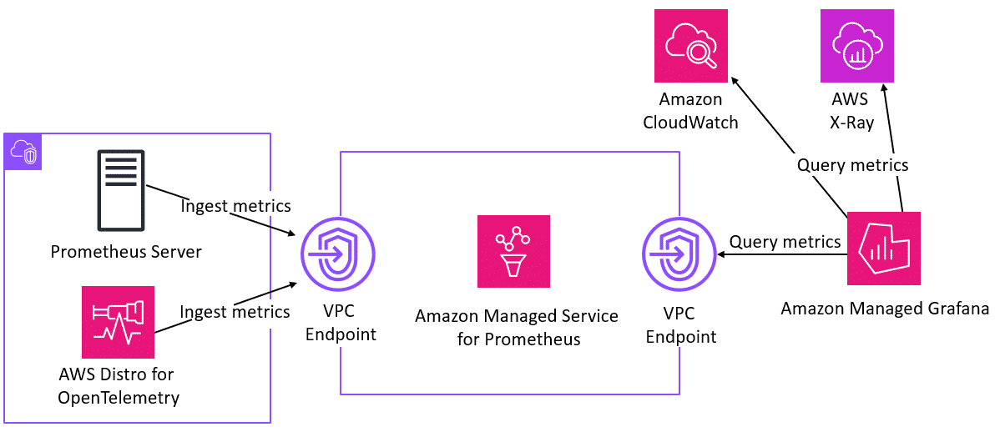

# Overview
+ Amazon Managed Grafana is a fully managed and secure **data visualization service** that you can use to **instantly query, correlate, and visualize operational metrics, logs, and traces from multiple sources**.
+ Amazon Managed Grafana makes it easy to **deploy, operate, and scale Grafana**, a widely deployed data visualization tool that is popular for its extensible data support.
+ With Amazon Managed Grafana, you create logically **isolated Grafana servers called workspaces**. Then, you can **create Grafana dashboards and visualizations** to analyze your metrics, logs, and traces without having to build, package, or deploy any hardware to run your Grafana servers.
+ **Amazon Managed Grafana manages the provisioning, setup, scaling, and maintenance of your logical Grafana servers** so that you don't have to do these tasks yourself.
+ Amazon Managed Grafana also provides **built-in security features** for compliance with corporate governance requirements, including single sign-on, data access control, and audit reporting.
+ Amazon Managed Grafana is **integrated with AWS data sources** that collect operational data, such as **Amazon CloudWatch, Amazon OpenSearch Service, AWS X-Ray, AWS IoT SiteWise, Amazon Timestream, and Amazon Managed Service for Prometheus**. 
+ For user authentication and authorization, Amazon Managed Grafana can integrate with **identity providers (IdPs) that support SAML 2.0 and also can integrate with AWS IAM Identity Center**
# User authentication in Amazon Managed Grafana
+ Users are authenticated to use the Grafana console in an Amazon Managed Grafana workspace by single sign-on using your organization’s identity provider, instead of by using IAM. Each workspace can use one or both of the following authentication methods:
    + User credentials stored in identity providers (IdPs) that support Security Assertion Markup Language 2.0 (SAML 2.0)
    + AWS IAM Identity Center
+ For each of your workspaces, you can use SAML, IAM Identity Center, or both.
## Using SAML with your Amazon Managed Grafana workspace
+ SAML authentication for Amazon Managed Grafana lets you use third-party identity providers to log in, manage access control, search your data, and build visualizations. Amazon Managed Grafana supports identity providers that use the SAML 2.0 standard and have built and tested integration applications with Azure AD, CyberArk, Okta, OneLogin, and Ping Identity.
+ Auth flow
    + To sign in to the Amazon Managed Grafana workspace, a user visits the workspace's Grafana console home page and chooses Log in using SAML.
    + The workspace reads the SAML configuration and redirects the user to the IdP for authentication.
    + The user enters their sign-in credentials in the IdP portal, and if they are a valid user, the IdP issues a SAML assertion and redirects the user back to the Amazon Managed Grafana workspace.
    + Amazon Managed Grafana verifies that the SAML assertion is valid, and the user is signed in and can use the workspace.
## Using AWS IAM Identity Center with your Amazon Managed Grafana workspace
+ Amazon Managed Grafana integrates with AWS IAM Identity Center to provide identity federation for your workforce.
+ Using Amazon Managed Grafana and AWS IAM Identity Center, users are **redirected to their existing company directory** to sign in with their existing credentials.
+ Then, they are seamlessly signed in to their Amazon Managed Grafana workspace.
+ This ensures that security settings such as password policies and two-factor authentication are enforced. Using IAM Identity Center does not impact your existing IAM configuration.
+ If you do not have an existing user directory or prefer not to federate, **IAM Identity Center offers an integrated user directory** that you can use to create users and groups for Amazon Managed Grafana. Amazon Managed Grafana does not support the use of IAM users and roles to assign permissions within an Amazon Managed Grafana workspace.
+ To use IAM Identity Center, you must also **have AWS Organizations activated** for the account. If needed, Amazon Managed Grafana can activate Organizations for you when you create your first workspace that is configured to use IAM Identity Center.
# Necessary permissions
+ To create a workspace that uses an IdP and SAML for authorization, you must be signed on to an IAM principal that has the AWSGrafanaAccountAdministrator policy attached.
+ To create your first workspace that uses AWS IAM Identity Center for authorization, you must be signed on to an IAM principal that has at least the following policies attached:
    + AWSGrafanaAccountAdministrator
    + AWSSSOMemberAccountAdministrator
    + AWSSSODirectoryAdministrator
# What are the benefits of Amazon Managed Grafana?
+ Enjoy the power of Grafana at scale
+ Visualize, analyze, and correlate securely across multiple data sources
+ Secure access to data and dashboards
+ Migrate from self-managed Grafana
+ Access third-party enterprise data source plugins
    + You can upgrade to a **Grafana Enterprise license** and gain access to a variety of their third-party enterprise data source plugins, including AppDynamics, Atlassian Jira, Datadog, Dynatrace, GitLab, Honeycomb, MongoDB, New Relic, Oracle Database, Salesforce, SAP HANA, ServiceNow, VMware Tanzu Observability by Wavefront, and Snowflake.
+ Start with pre-built dashboards
# How is Amazon Managed Grafana used to architect a cloud solution?
+ With Amazon Managed Grafana, you can easily visualize information from **multiple AWS services, AWS accounts, and Regions in a single Grafana dashboard**. 
+ You can use Amazon Managed Grafana to **connect to data sources inside an Amazon Virtual Private Cloud (Amazon VPC) that are not publicly accessible**. With this feature, you can connect Amazon Managed Grafana to OpenSearch Service clusters, Amazon Relational Database Service (Amazon RDS) instances, self-hosted data sources, and other data sensitive workloads that are only privately accessible.
+ 
# basic technical concepts
+ Amazon Managed Grafana workspace
    + A workspace is a logically isolated Grafana server. Once you have created a workspace, you can **integrate it with data sources and then query and visualize metrics from these data sources**. You can create multiple workspaces per Region and per account, so that you can create isolated Grafana workspaces for monitoring your production and development workloads separately.
+ Security and authentication
    + Access to Amazon Managed Grafana is authenticated through IAM Identity Center or your existing identity provider through SAML 2.0. This makes it possible to reuse existing trust relationships between AWS and your corporate user directories.
+ Panels and dashboards
    + A dashboard is a set of one or more panels organized and arranged into one or more rows. 
    + Panels are the basic visualization building blocks in Amazon Managed Grafana, and are visual representations of your queries.
+ Grafana alerts
# typical use cases
+ Unified observability
    + You can use Amazon Managed Grafana to query and correlate metrics, logs, and traces that are collected and stored in different tools. You can view and analyze them in a single visualization or dashboard, which makes it easier to monitor your applications and troubleshoot operational issues. 
+ Container monitoring
    + Using Amazon Managed Grafana, you can query, correlate, and visualize container metrics from Amazon Elastic Kubernetes Service (Amazon EKS), Amazon Elastic Container Service (Amazon ECS), and self-managed Kubernetes running on Amazon Elastic Compute Cloud (Amazon EC2).
+ One dashboard, multiple users
    + Amazon Managed Grafana supports a wide variety of data sources so users of all types can layer operational and business data into a consolidated view. 
+ Troubleshoot operational issues collaboratively
    + Teams and users can view and edit dashboards in real time, track dashboard version changes, and **share dashboards** with related teams and executive stakeholders to ensure that everyone is viewing the same data while troubleshooting operational issues. 
+ IoT monitoring
    + Grafana's extensible data plugin architecture and flexible graphing options make it popular for monitoring IoT and edge device data, such as earthquake sensor battery levels, manufacturing robot metrics, or energy utility status checks
# Reference
+ [What is Amazon Managed Grafana?](https://docs.aws.amazon.com/grafana/latest/userguide/getting-started-with-AMG.html)
+ [Amazon Managed Grafana - Getting Started](https://explore.skillbuilder.aws/learn/course/16374/play/83999/amazon-managed-grafana-getting-started)
