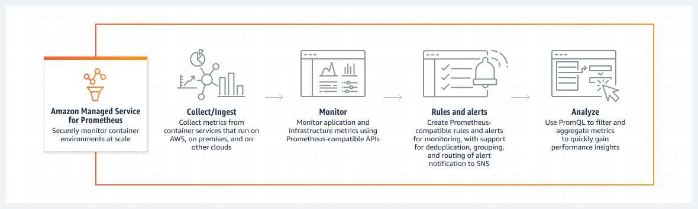
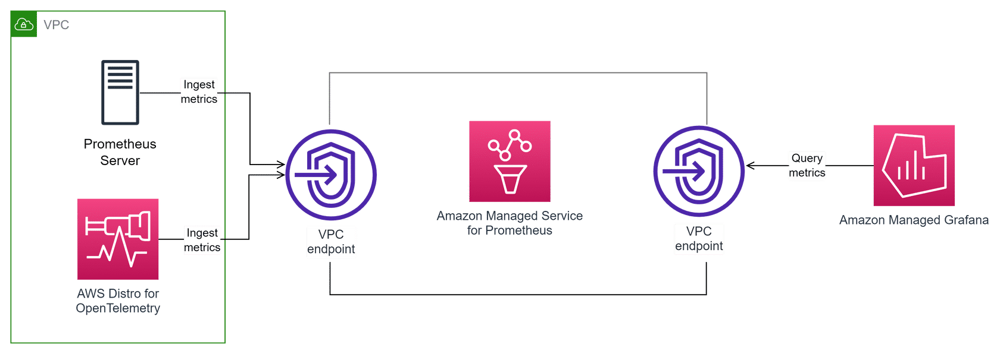

# Overview
+ Amazon Managed Service for Prometheus is a **serverless, Prometheus-compatible monitoring service for container metrics** that makes it easier to securely monitor container environments at scale.
+ With Amazon Managed Service for Prometheus, you can use the same open-source Prometheus data model and query language that you use today to monitor the performance of your containerized workloads, and also enjoy improved scalability, availability, and security without having to manage the underlying infrastructure.
+ Amazon Managed Service for Prometheus **automatically scales the ingestion, storage, and querying of operational metrics as workloads scale up and down**. It integrates with AWS security services to enable fast and secure access to data.
+ Amazon Managed Service for Prometheus is designed to be **highly available using multiple Availability Zone (Multi-AZ) deployments**. Data ingested into a workspace is **replicated across three Availability Zones in the same Region**.
+ Amazon Managed Service for Prometheus works with container clusters that run on **Amazon Elastic Kubernetes Service and self-managed Kubernetes environments**.
+ Amazon Managed Service for Prometheus is integrated with **Amazon Elastic Kubernetes Service (Amazon EKS), Amazon Elastic Container Service (Amazon ECS), and AWS Distro for OpenTelemetry (ADOT)**
+ 
# Ingest Prometheus metrics to the workspace
+ There are two methods of ingesting metrics into your Amazon Managed Service for Prometheus workspace.
+ Using an AWS managed collector – Amazon Managed Service for Prometheus provides a fully-managed, agentless scraper to automatically scrape metrics from your Amazon Elastic Kubernetes Service (Amazon EKS) clusters. Scraping automatically pulls the metrics from Prometheus-compatible endpoints.
+ Using a customer managed collector – You have many options for managing your own collector. Two of the most common collectors to use are installing your own instance of Prometheus, running in agent mode, or using AWS Distro for OpenTelemetry. These are both described in detail in the following sections.
    + One way to ingest metrics is to **use a standalone Prometheus agent** (a Prometheus instance running in agent mode) to scrape metrics from your cluster and forward them to Amazon Managed Service for Prometheus for storage and monitoring. 
    + set up a new Prometheus server in an Amazon EKS cluster, and the new server uses a default configuration to act as an agent to send metrics to Amazon Managed Service for Prometheus
# Query your Prometheus metrics
+ A common way to query your metrics is to use a service such as Grafana to query the metrics.
+ In the Amazon Managed Grafana console, you can add an Amazon Managed Service for Prometheus workspace as a data source by discovering your existing Amazon Managed Service for Prometheus accounts.
+ Amazon Managed Grafana manages the configuration of the authentication credentials that are required to access Amazon Managed Service for Prometheus. 
## Securing your metric queries
+ Using AWS PrivateLink with Amazon Managed Service for Prometheus
# Recording rules and alerting rules
+ Amazon Managed Service for Prometheus supports two types of rules that it evaluates at regular intervals:
+ Recording rules allow you to precompute frequently needed or computationally expensive expressions and save their results as a new set of time series. Querying the precomputed result is often much faster than running the original expression every time it is needed.
+ Alerting rules allow you to define alert conditions based on PromQL and a threshold. When the rule triggers the threshold, a notification is sent to alert manager, which forwards the notification downstream to receivers such as Amazon Simple Notification Service.
+ Within a rules file, rules are contained within rules groups. Rules within a single rules group in a rules file are always evaluated in order from top to bottom. Therefore, in recording rules, the result of one recording rule can be used in the computation of a later recording rule or in an alerting rule in the same rule group. However, because you can't specify the order in which to run separate rules files, you can't use the results from one recording rule to compute a rule in a different rule group or a different rules file.
# Alert Manager
+ When the alerting rules that Amazon Managed Service for Prometheus runs are firing, alert manager handles the alerts that are sent. It deduplicates, groups, and routes the alerts to downstream receivers.
+ Amazon Managed Service for Prometheus **supports only Amazon Simple Notification Service as a receiver**, and can route messages to Amazon SNS topics **in the same account**. You can also use alert manager to silence and inhibit alerts.
+ You can use alert manager's configuration file for the following:
    + Grouping – Grouping collects similar alerts into a single notification. 
        + Alert grouping and the timing for the grouped notifications are configured by a routing tree in the alert manager configuration file. 
    + Inhibition – Inhibition suppresses notifications for certain alerts if certain other alerts are already firing.
    + Silences – Silences mute alerts for a specified time, such as during a maintenance window
# What are the benefits of Amazon Managed Service for Prometheus?
+ Use PromQL
+ Scale as your needs grow
+ Deploy Prometheus with AWS level security
+ Monitor and alert on AWS and on premises containers
+ Pay for what you use# Reference
# Architecture and Use Cases
+ 
# basic technical concepts
+ Workspace
    + A workspace is a logical space dedicated to the storage and querying of Prometheus metrics.
    + A workspace can be authorized to gain precise access control, which makes it more efficient to update, list, describe, or delete the workspace, as well as to ingest metrics and query data.
    + You can have one or more workspaces in each AWS Region in your account.
+ Record and alert
    + With recording rules, you can precompute frequently needed or computationally expensive expressions and save their results as a new set of time series. Querying the result is often much faster than running the original expression every time it is needed.
    + With alerting rules, you can define alert conditions based on PromQL and a threshold. When the rule invokes the threshold, a notification is sent to alert manager. It then forwards the notification downstream to a receiver, such as Amazon SNS.
+ Collector agent
# use cases
+ Workload and application metrics monitoring
+ unified systems monitoring
+ troubleshooting
+ high-cardinality monitoring. 
[What is Amazon Managed Service for Prometheus?](https://docs.aws.amazon.com/prometheus/latest/userguide/what-is-Amazon-Managed-Service-Prometheus.html)
[Getting Started with Amazon Managed Service for Prometheus](https://explore.skillbuilder.aws/learn/course/15619/play/76875/getting-started-with-amazon-managed-service-for-prometheus)
