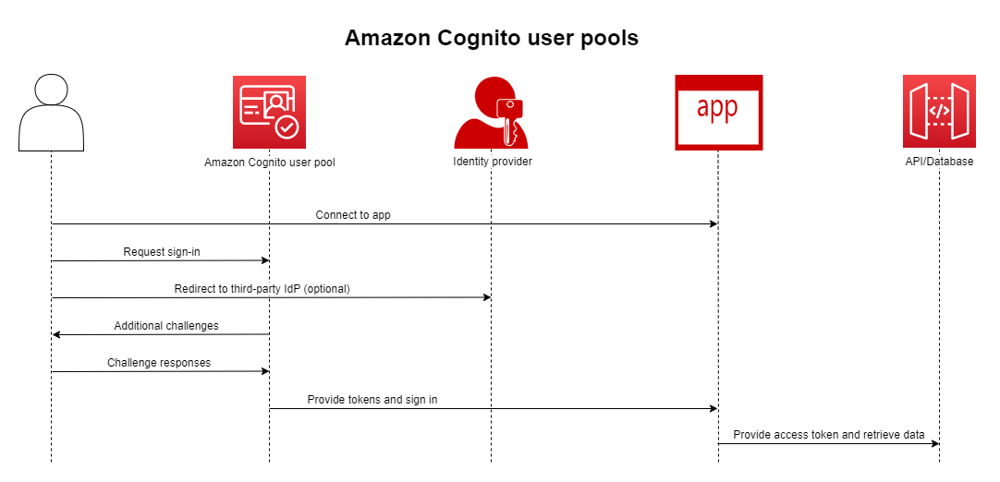
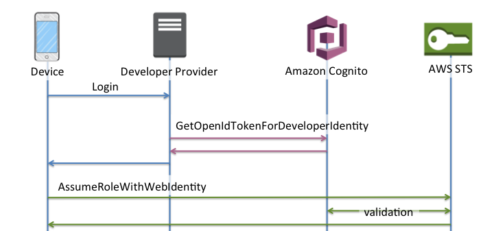

# Overview
+ Amazon Cognito is **an identity platform for web and mobile apps**.
+ It’s **a user directory, an authentication server, and an authorization service for OAuth 2.0 access tokens and AWS credentials**.
+ With Amazon Cognito, you can authenticate and authorize users from the built-in user directory, from your enterprise directory, and from consumer identity providers like Google and Facebook.
# User pools
+ 
+ An Amazon Cognito user pool is a **user directory for web and mobile app authentication and authorization**.
+ From the perspective of your app, an Amazon Cognito user pool is an **OpenID Connect (OIDC) identity provider (IdP)**.
+ A user pool adds layers of additional features for security, identity federation, app integration, and customization of the user experience.
+ Create a user pool when you want to **authenticate and authorize users to your app or API**.
+ User pools are **a user directory with both self-service and administrator-driven user creation, management, and authentication**.
+ Your user pool can be **an independent directory and OIDC identity provider (IdP), and an intermediate service provider (SP) to third-party providers** of workforce and customer identities.
+ Your organization's SAML 2.0 and OIDC IdPs bring workforce identities into Cognito and your app.
+ The public OAuth 2.0 identity stores Amazon, Google, Apple and Facebook bring customer identities.
+ User pools **don’t require integration with an identity pool**. From a user pool, you can **issue authenticated JSON web tokens (JWTs) directly to an app, a web server, or an API**.
+ With a user pool, your users can sign in to your web or mobile app through Amazon Cognito, or federate through a third-party IdP. Federated and local users have a user profile in your user pool.
+ Local users are those who signed up or you created directly in your user pool.
+ You have access to the following features when you authenticate local users.
    + Implement your own web front-end that calls the Amazon Cognito user pools API to authenticate, authorize, and manage your users.
    + Set up multi-factor authentication (MFA) for your users. Amazon Cognito supports time-based one-time password (TOTP) and SMS message MFA.
    + Secure against access from user accounts that are under malicious control.
    + Create your own custom multi-step authentication flows.
    + Look up users in another directory and migrate them to Amazon Cognito.
+ An Amazon Cognito user pool can also fulfill a dual role as a service provider (SP) to your IdPs, and an IdP to your app（
Amazon Cognito 用户池还可以扮演双重角色：作为您的 IdP 的服务提供商 (SP) 和您的应用程序的 IdP）
+ Amazon Cognito is available in multiple AWS Regions worldwide. In each Region, Amazon Cognito is **distributed across multiple Availability Zones.** 
## Features
### Sign-up
+ Amazon Cognito user pools have user-driven, administrator-driven, and programmatic methods to add user profiles to your user pool.
+ sign-up models
    + Your users can enter their information in your app and create a user profile that’s native to your user pool. You can call **API sign-up operations** to register users in your user pool.
    + You can redirect users to a third-party IdP that they can authorize to pass their information to Amazon Cognito. **Amazon Cognito processes OIDC id tokens, OAuth 2.0 userInfo data, and SAML 2.0 assertions into user profiles in your user pool**. You control the attributes that you want Amazon Cognito to receive based on **attribute-mapping rules**.
    + You can skip public or federated sign-up, and create users based on your own data source and schema. **Add users directly in the Amazon Cognito console or API**. **Import users from a CSV file**. Run a just-in-time **AWS Lambda function that looks up your new user** in an existing directory, and populates their user profile from existing data.
### Sign-in
+ Amazon Cognito can be **a standalone user directory and identity provider (IdP) to your app**. Your users can sign in with a UI that’s hosted by Amazon Cognito, or with your own UI through the Amazon Cognito user pools API
+ To sign in users with an external directory, optionally combined with the user directory built in to Amazon Cognito, you can add the following integrations.
    + Sign in and import consumer user data with **OAuth 2.0 social sign-in**. Amazon Cognito supports sign-in with Google, Facebook, Amazon, and Apple through OAuth 2.0.
    + Sign in and import enterprise user data with **SAML and OIDC sign-in**. You can also configure Amazon Cognito to accept claims from any SAML or OpenID Connect (OIDC) identity provider (IdP).
    + Link external user profiles to native user profiles. A linked user can sign in with a third-party user identity and receive access that you assign to a user in the built-in directory.
### Hosted UI
+ When you don’t want to build a user interface, you can present your users with a customized Amazon Cognito hosted UI.
+ The hosted UI is a set of web pages for sign-up, sign-in, multi-factor authentication (MFA), and password reset.
+ You can add the hosted UI to your existing domain, or use a prefix identifier in an AWS subdomain.
### Security
+ Your local users can provide an additional authentication factor with a code from an SMS message, or an app that generates multi-factor authentication (MFA) codes.
+ You can build mechanisms to set up and process MFA in your app, or you can let the hosted UI manage it.
+ Amazon Cognito user pools can bypass MFA when your users sign in from trusted devices.
### Custom user experience
+ At most stages of a user’s sign-up, sign-in, or profile update, you can **customize how Amazon Cognito handles the request**.
+ With **Lambda triggers**, you can modify an ID token or reject a sign-up request based on custom conditions.
+ You can create your own custom authentication flow.
+ You can upload custom CSS and logos to give the hosted UI a familiar look and feel to your users.
### Monitoring and analytics
+ Amazon Cognito user pools log API requests, including requests to the hosted UI, to **AWS CloudTrail**.
+ You can review performance metrics in **Amazon CloudWatch Logs**, push custom logs to CloudWatch with Lambda triggers, and monitor API request volume in the Service Quotas console.
+ You can also log device and session data from your API requests to an **Amazon Pinpoint campaign**. With Amazon Pinpoint, you can send push notifications from your app based on your analysis of user activity.
### Amazon Cognito identity pools integration
+ The other half of Amazon Cognito is identity pools.
+ Identity pools provide credentials that authorize and monitor API requests to AWS services, for example Amazon DynamoDB or Amazon S3, from your users. 
+ You can **build identity-based access policies** that protect your data based on how you classify the users in your user pool.
+ Identity pools can also accept tokens and SAML 2.0 assertions from a variety of identity providers, independently of user pool authentication.
## Authentication with a user pool
+ Your app users can sign in either directly through a user pool, or federate through a third-party identity provider (IdP).
+ The user pool manages the overhead of handling the tokens that are returned from social sign-in through Facebook, Google, Amazon, and Apple, and from OpenID Connect (OIDC) and SAML IdPs.
+ After successful authentication, Amazon Cognito returns user pool tokens to your app.
+ You can use the tokens to grant your users access to your own server-side resources, or to the Amazon API Gateway. Or, you can exchange them for AWS credentials to access other AWS services.
+ User pool token handling and management for your web or mobile app is provided on the **client side through Amazon Cognito SDKs**. Likewise, the Mobile SDK for iOS and the Mobile SDK for Android **automatically refresh your ID and access tokens** if there is a valid (non-expired) refresh token present, and the ID and access tokens have a minimum remaining validity of 5 minutes. 
### User pool authentication flow
+ Amazon Cognito authentication typically requires that you implement two API operations in the following order:
    + InitiateAuth and RespondToAuthChallenge are unauthenticated APIs for use with client-side public app clients.
    + AdminInitiateAuth and AdminRespondToAuthChallenge require IAM credentials and are suited for server-side confidential app clients.
+ 
+ You can use **AWS Lambda triggers to customize the way users authenticate**. These triggers issue and verify their own challenges as part of the authentication flow.
+ You can also use the **admin authentication flow for secure backend servers**. You can use the user migration authentication flow to make user migration possible without the requirement that your users to reset their passwords.
+ Amazon Cognito lockout behavior for failed sign-in attempts
    + After five failed unauthenticated or IAM-authenticated sign-in attempts with a password, Amazon Cognito locks out your user for one second.
    + The lockout duration then doubles after each additional one failed attempt, up to a maximum of approximately 15 minutes.
+ Client-side authentication flow
    + The user enters their username and password into the app.
    + The app calls the **InitiateAuth** operation with the user's username and Secure Remote Password (SRP) details.
        + This API operation returns the authentication parameters.
    + The app calls the **RespondToAuthChallenge** operation. If the call succeeds, Amazon Cognito returns the user's tokens, and the authentication flow is complete.
        + If Amazon Cognito requires another challenge, the call to RespondToAuthChallenge returns no tokens. Instead, the call returns a session.
    + If RespondToAuthChallenge returns a session, the app calls RespondToAuthChallenge again, this time with the session and the challenge response (for example, MFA code).
+ Server-side authentication flow
    + If you don't have a user app, but instead you use a Java, Ruby, or Node.js secure backend or server-side app, you can use the authenticated server-side API for Amazon Cognito user pools.
    + For server-side apps, user pool authentication is similar to authentication for client-side apps, except for the following:
        + The server-side app calls the **AdminInitiateAuth** API operation (instead of InitiateAuth). This operation requires AWS credentials with permissions that include cognito-idp:AdminInitiateAuth and cognito-idp:AdminRespondToAuthChallenge. The operation returns the required authentication parameters.
        + After the server-side app has the authentication parameters, it calls the **AdminRespondToAuthChallenge** API operation (instead of RespondToAuthChallenge). The AdminRespondToAuthChallenge API operation only succeeds when you provide AWS credentials.
    + The AdminInitiateAuth and AdminRespondToAuthChallenge API operations **can't accept username-and-password user credentials for admin sign-in**, unless you explicitly enable them to do so in one of the following ways:
        + Include ALLOW_ADMIN_USER_PASSWORD_AUTH (formerly known as ADMIN_NO_SRP_AUTH) in the ExplicitAuthFlow parameter when you call CreateUserPoolClient or UpdateUserPoolClient.
        + Add ALLOW_ADMIN_USER_PASSWORD_AUTH to the list of Authentication flows for your app client. Configure app clients on the App integration tab in your user pool, under App clients and analytics.
+ Custom authentication flow
    + Amazon Cognito user pools also make it possible to use custom authentication flows, which can help you create a challenge/response-based authentication model using AWS Lambda triggers.
    + The flow starts with a call to the InitiateAuth API operation that indicates the type of authentication to use and provides any initial authentication parameters.
    + If Amazon Cognito responds to the InitiateAuth call with a challenge, the app gathers more input and calls the RespondToAuthChallenge operation. 
### Custom authentication flow and challenges
+ An app can initiate a custom authentication flow by calling InitiateAuth with CUSTOM_AUTH as the Authflow. With a custom authentication flow, three Lambda triggers control challenges and verification of the responses.
+ The DefineAuthChallenge Lambda trigger uses a session array of previous challenges and responses as input. It then generates the next challenge name and Booleans that indicate whether the user is authenticated and can be granted tokens. This Lambda trigger is a state machine that controls the user’s path through the challenges.
+ The CreateAuthChallenge Lambda trigger takes a challenge name as input and generates the challenge and parameters to evaluate the response. When DefineAuthChallenge returns CUSTOM_CHALLENGE as the next challenge, the authentication flow calls CreateAuthChallenge. The CreateAuthChallenge Lambda trigger passes the next type of challenge in the challenge metadata parameter.
+ The VerifyAuthChallengeResponse Lambda function evaluates the response and returns a Boolean to indicate if the response was valid.
## User pool app clients
+ A user pool app client is a configuration within a user pool that interacts with one mobile or web application that authenticates with Amazon Cognito. 
+ App clients can call authenticated and unauthenticated API operations, and read or modify some or all of your users' attributes.
+ Your app must **identify itself to the app client** in operations to register, sign in, and handle forgotten passwords.
+ These API requests must **include self-identification with an app client ID, and authorization with an optional client secret**. 
### App client types
+ Public client
    + A public client runs in a browser or on a mobile device. Because it does not have trusted server-side resources, it does not have a client secret.
+ Confidential client
    + A confidential client has server-side resources that can be trusted with a client secret for unauthenticated API operations. The app might run as a daemon or shell script on your backend server.
+ You can use a confidential client, and a client secret, with a public app
### JSON web tokens
+ Identity (ID) token
    + A verifiable statement that your user is authenticated from your user pool. 
    + The ID token contains identity information, like user attributes, that your app can use to create a user profile and provision resources
+ Access token
    + A verifiable statement of your user's access rights. The access token contains scopes, a feature of OIDC and OAuth 2.0.
+ Refresh token
    + An encrypted statement of initial authentication that your app can present to your user pool when your user's tokens expire.
    + A refresh-token request returns new, unexpired access and ID tokens.
### App client terms
+ Authentication flows
    + The methods that your app client allows for sign-in. Your app can support authentication with username and password, Secure Remote Password (SRP), custom authentication with Lambda triggers, and token refresh. 
+ Attribute read and write permissions
    + Your user pool might have many customers, each with their own app client and IdPs. You can configure your app client to have read and write access to only those user attributes that are relevant to the app
+ Identity providers
    + You can choose some or all of your user pool external identity providers (IdPs) to authenticate your users. Your app client can also authenticate only local users in your user pool. When you add an IdP to your app client, you can generate authorization links to the IdP and display it on your hosted UI sign-in page. You can assign multiple IdPs, but you must assign at least one.
+ Allowed callback URLs
    + A callback URL indicates where the user will be redirected after a successful sign-in. 
+ Allowed sign out URLs
    + A sign-out URL indicates where your user is to be redirected after signing out.
+ OAuth grant types
    + An OAuth grant is a method of authentication that retrieves user-pool tokens.
    + To integrate these OAuth grants in your app, you must add a domain to your user pool.
    + **Authorization code grant**
        + The authorization code grant generates a code that your app can exchange for user pool tokens with the **Token endpoint**. 
        + An authorization code grant is the **most secure grant** that Amazon Cognito offers, because tokens aren't visible in your users' sessions. Instead, your app generates the request that returns tokens and can cache them in protected storage.
    + **Implicit grant**
        + The implicit grant **delivers an access and ID token, but not refresh token**, to your user's **browser session** directly from the **Authorize endpoint**. 
        + An implicit grant removes the requirement for a separate request to the token endpoint, but **isn't compatible with PKCE and doesn't return refresh tokens**. 
    + **Client credentials grant**
        + The client credentials grant is for **machine-to-machine (M2M) communications**. 
        + Authorization-code and implicit grants issue tokens to authenticated human users. 
        + Client credentials **grant scope-based authorization from a non-interactive system to an API**.
        + Your app can request client credentials directly from the token endpoint and receive an access token.   
    + **OpenID Connect scopes**
        + The openid scope declares that you want to retrieve an ID token and a user's unique ID.
        + Amazon Cognito **doesn't return an ID token unless you request the openid scope**. 
            + When openid is the only scope that you request, Amazon Cognito populates the ID token with all user attributes that the current app client can read. 
            + When you request openid with other scopes like phone, email, or profile, the ID token and userInfo return the user's unique ID and the attributes defined by the additional scopes.
        + The phone scope grants access to the phone_number and phone_number_verified claims. This scope can only be requested with the openid scope.
        + The email scope grants access to the email and email_verified claims. This scope can only be requested with the openid scope.
        + The aws.cognito.signin.user.admin scope grants access to Amazon Cognito user pools API operations that require access tokens, such as UpdateUserAttributes and VerifyUserAttribute.
        + The profile scope grants access to all user attributes that are readable by the client. This scope can only be requested with the openid scope.
    + **Custom scopes**
        + A custom scope is one that you define for your own resource server in the Resource Servers.
## Working with user devices in your user pool
+ When you sign in local user pool users with the Amazon Cognito user pools API, you can associate your users’ activity logs from advanced security features with each of their devices and, optionally, **allow your users to skip multi-factor authentication (MFA) if they’re on a trusted device**. 
+ Setting up remembered devices
    + With Amazon Cognito user pools, you can associate each of your users' devices with a **unique device identifier: a device key**.
    + Configure your user pool to remember devices in the Sign-in experience tab of your user pool, under Device tracking. When setting up the remembered devices functionality through the Amazon Cognito console, you have three options: Always, User Opt-In, and No.
        + Don't remember
            + Your user pool doesn't prompt users to remember devices when they sign in.
        + Always remember
            + When your app confirms a user's device, your user pool always remembers the device and doesn't return MFA challenges on future successful device sign-ins.
        + User opt-in
            + When your app confirms a user's device, your user pool doesn't automatically suppress MFA challenges. You must prompt your user to choose whether they want to remember the device.
## Things to know about Amazon Cognito user pools third-party sign-in
+ If you want your users to sign in with federated providers, you **must choose a domain**. 
+ You can't sign in federated users with API operations like InitiateAuth and AdminInitiateAuth. Federated users can only sign in with the Login endpoint or the Authorize endpoint.
+ The Authorize endpoint is a redirection endpoint. If you provide an idp_identifier or identity_provider parameter in your request, it redirects silently to your IdP, bypassing the hosted UI. Otherwise, it redirects to the hosted UI Login endpoint. 
+ When the hosted UI redirects a session to a federated IdP, Amazon Cognito includes the user-agent header Amazon/Cognito in the request.
+ Amazon Cognito derives the username attribute for a federated user profile from a combination of a fixed identifier and the name of your IdP. To generate a user name that matches your custom requirements, create a mapping to the preferred_username attribute. 
+ Amazon Cognito records information about your federated user's identity to an attribute, and a claim in the ID token, called identities.
+ When you update your IdP in an UpdateIdentityProvider API request, your changes can take up to a minute to appear in the hosted UI.
+ Amazon Cognito supports up to 20 HTTP redirects between itself and your IdP.
+ When your user signs in with the hosted UI, their browser stores an encrypted login-session cookie which records the client and provider they signed in with. If they attempt to sign in again with the same parameters, the hosted UI reuses any unexpired existing session, and the user authenticates without providing credentials again. If your user signs in again with a different IdP, including a switch to or from local user pool sign-in, they must provide credentials and generate a new login session.
## Linking federated users to an existing user profile
+ Often, **the same user has a profile with multiple identity providers (IdPs)** that you have connected to your user pool. Amazon Cognito can **link each occurrence of a user to the same user profile in your directory**. This way, one person who has multiple IdP users can **have a consistent experience in your app**.
+ When a federated user signs in to your user pool for the first time, Amazon Cognito **looks for a local profile** that you have linked to their identity. If **no linked profile exists**, your user pool **creates a new profile**. You can create a local profile and link it to your federated user at any time **before their first sign-in**, in an AdminLinkProviderForUser API request or in a Pre sign-up Lambda trigger.
+ After your user signs in and Amazon Cognito detects a linked local profile, your user pool reads your user's claims and compares them to mapping rules for the IdP. Your user pool then **updates the linked local profile with the claims mapped from their sign-in**.
+ Things to know about linking federated users
    + You can link **up to five federated users** to each user profile.
    + You can link federated users to either an existing federated user profile, or to a local user.
    + You can't link providers to user profiles in the AWS Management Console.
    + Your user's ID token contains all of their associated providers in the identities claim.
    + You can set a password for the automatically-created federated user profile in an AdminSetUserPassword API request. 
    + Amazon Cognito populates user attributes to a linked local user profile when the user signs in through their IdP. 
## Customizing user pool workflows with Lambda triggers
+ Amazon Cognito works with **AWS Lambda functions** to **modify the authentication behavior** of your user pool.
+ You can configure your user pool to automatically invoke Lambda functions **before their first sign-up**, **after they complete authentication**, and at several stages in between. 
+ The code in your Lambda functions is your own. Amazon Cognito **sends event data to your function**, waits for the function to process the data, and in most cases anticipates a response event that reflects any changes you want to make to the session.
+ Lambda triggers can **customize the response** that Amazon Cognito delivers to your user after they initiate an action in your user pool. 
+ Pre sign-up Lambda trigger: Shortly before Amazon Cognito signs up a new user, it activates the **pre sign-up AWS Lambda function**
+ Post confirmation Lambda trigger:
    + Amazon Cognito invokes this trigger after a signed-up user confirms their user account.
    + Amazon Cognito invokes this trigger only for user who sign up in your user pool, not for user accounts that you create with your administrator credentials.
+ Pre authentication Lambda trigger
    + Amazon Cognito invokes this trigger when a user attempts to sign in so that you can create custom validation that performs preparatory actions.
+ Post authentication Lambda trigger
    + Because Amazon Cognito invokes this trigger after signing in a user, you can add custom logic after Amazon Cognito authenticates the user.
+ Custom authentication challenge Lambda triggers
    + Define auth challenge
        + Amazon Cognito invokes this trigger to initiate the custom authentication flow.
    + Create auth challenge
        + Amazon Cognito invokes this trigger after Define Auth Challenge to create a custom challenge.
    + Verify auth challenge response
        + Amazon Cognito invokes this trigger to verify if the response from the end user for a custom challenge is valid or not.
    + These Lambda triggers issue and verify their own challenges as part of a user pool custom authentication flow.
+ Pre token generation Lambda trigger
    + Because Amazon Cognito invokes this trigger before token generation, you can **customize identity and access token claims**. 
    + Amazon Cognito sends a single request to your function with data that it would write to both the identity and access token.  
    + To customize both tokens, you must update your function to use the most recent trigger version, and send data for both tokens in the same response.
    + With the pre token generation Lambda trigger, you can **customize the content of an identity (ID) token** from your user pool. 
        + The uses of the pre token generation Lambda trigger with an ID token include the following.
        + Make a change at runtime to the IAM role that your user requests from an identity pool.
        + Add user attributes from an external source.
        + Add or replace existing user attribute values.
        + Suppress disclosure of user attributes that, because of your user's authorized scopes and the read access to attributes that you granted to your app client, would otherwise be passed to your app.
    + With the pre token generation Lambda trigger, you can **customize the content of an access token** from your user pool.
+ Migrate user Lambda trigger
    + When a **user doesn't exist** in the user pool at sign-in with a password, or in the **forgot-password flow**, Amazon Cognito invokes this trigger.
    + After the Lambda function returns successfully, Amazon Cognito **creates the user in the user pool**. 
    + To migrate users from your existing user directory into Amazon Cognito user pools at sign-in, or during the forgot-password flow, use this Lambda trigger.
+ Custom message Lambda trigger
    + Amazon Cognito invokes this trigger before it sends an email or phone verification message or a multi-factor authentication (MFA) code.
    + You can customize the message dynamically with your custom message trigger. 
+ Custom sender Lambda triggers
    + Amazon Cognito user pools provide the Lambda triggers CustomEmailSender and CustomSMSSender to **activate third-party email and SMS notifications**.
    + You can choose **SMS and email providers** to send notifications to users from within your Lambda function code.
    + When Amazon Cognito must send notifications like confirmation codes, verification codes, or temporary passwords to users, the events **activate your configured Lambda functions**.
    + Amazon Cognito sends the code and temporary passwords (secrets) to your activated Lambda functions.
## Using tokens with user pools
+ The **ID token** is a JSON Web Token (JWT) that contains claims about the identity of the authenticated user, such as name, email, and phone_number.
    + You can use this identity information inside your application.
    + The ID token can also be used to authenticate users to your resource servers or server applications. 
+ The user pool **access token** contains claims about the authenticated user, **a list of the user's groups, and a list of scopes**. 
    + The purpose of the access token is to authorize API operations.
    + Your user pool accepts access tokens to authorize user self-service operations. 
+ You can use the **refresh token** to **retrieve new ID and access tokens**.
    + **By default**, the refresh token expires **30 days** after your application user signs into your user pool.
    + When you create an application for your user pool, you can set the application's refresh token expiration to any value between **60 minutes and 10 years**.
+ You can &&revoke a refresh token&& for a user using the AWS API. When you revoke a refresh token, **all access tokens that were previously issued by that refresh token become invalid**. The other refresh tokens issued to the user are not affected.
## Associating an AWS WAF web ACL with a user pool
+ AWS WAF is a web application firewall. With an AWS WAF web access control list (web ACL), you can protect your user pool from unwanted requests to your hosted UI and Amazon Cognito API service endpoints. 
+ A web ACL gives you fine-grained control over all of the HTTPS web requests that your user pool responds to.
+ When you have an AWS WAF web ACL associated with a user pool, Amazon Cognito forwards selected non-confidential headers and contents of requests from your users to AWS WAF. **AWS WAF inspects the contents of the request, compares it to the rules that you specified in your web ACL, and returns a response to Amazon Cognito**.
+ You can associate one web ACL with a user pool.
# Identity pools
+ 
+ An Amazon Cognito identity pool is a **directory of federated identities that you can exchange for AWS credentials**.
+ Identity pools **generate temporary AWS credentials** for the users of your app, whether they’ve signed in or you haven’t identified them yet
+ With AWS Identity and Access Management (IAM) roles and policies, you can **choose the level of permission** that you want to grant to your users.
+ Users can start out as guests and retrieve assets that you keep in AWS services. Then they can sign in with a third-party identity provider to unlock access to assets that you make available to registered members. The third-party identity provider can be a consumer (social) OAuth 2.0 provider like Apple or Google, a custom SAML or OIDC identity provider, or a custom authentication scheme, also called a developer provider, of your own design.
+ Set up an Amazon Cognito identity pool when you want to authorize authenticated or anonymous users to **access your AWS resources**.
+ An identity pool **issues AWS credentials for your app** to serve resources to users.
+ An identity pool is a collection of unique identifiers, or identities, that you assign to your users or guests and authorize to receive temporary AWS credentials. 
+ You can **authenticate users with a trusted identity provider, like a user pool or a SAML 2.0 service**. It can also optionally issue credentials for guest users.
+ Identity pools use both **role-based and attribute-based access control** to manage your users’ authorization to access your AWS resources.
+ Identity pools **don’t** require integration with a user pool. An identity pool can accept authenticated claims directly from both workforce and consumer identity providers.
+ When you **present proof of authentication** to an identity pool in the form of the trusted claims from a **SAML 2.0, OpenID Connect (OIDC), or OAuth 2.0 social identity provider (IdP)**, you **associate your user with an identity in the identity pool**. The token that your identity pool creates for the identity can retrieve temporary session credentials from AWS Security Token Service (AWS STS).
+ To complement authenticated identities, you can also configure an identity pool to authorize AWS access **without IdP authentication**. You can offer your own **custom proof of authentication, or no authentication**. You can grant temporary AWS credentials to any app user who requests them, with **unauthenticated identities**. Identity pools also accept claims and issue credentials based on your own custom schema, with **developer-authenticated identities**.
+ With Amazon Cognito identity pools, you have **two ways to integrate with IAM policies in your AWS account**. You can use these two features together or individually.
    + **Role-based access control**
        + When your user passes claims to your identity pool, Amazon Cognito chooses the IAM role that it requests.
        + To customize the role’s permissions to your needs, you apply IAM policies to each role.
    + **Attributes for access control**
        + Your identity pool **reads attributes from your user’s claims, and maps them to principal tags** in your user’s temporary session.
        + You can then configure your **IAM resource-based policies** to allow or deny access to resources based on IAM principals that carry the session tags from your identity pool.
## Features of Amazon Cognito identity pools
+ Sign requests for AWS services
+ Filter requests with resource-based policies
+ Assign guest access
    + For your users who haven’t signed in yet, configure your identity pool to generate AWS credentials with a narrow scope of access.
+ Assign IAM roles based on user characteristics
    + Assign a single IAM role to all of your authenticated users, or choose the role based on the claims of each user.
+ Accept a variety of identity providers
    + Exchange an OIDC identity or access token, a user pool token, a SAML assertion, or a social-provider OAuth token for AWS credentials.
+ Validate your own identities
    + Perform your own user validation and use your developer AWS credentials to issue credentials for your users.
## Using Amazon Cognito Sync with identity pools
+ Amazon Cognito Sync is an AWS service and client library that makes it possible to sync application-related user data across devices.
+ The client libraries cache data locally so that your app can read and write data regardless of device connectivity status.
+ When the device is online, you can synchronize data.
+ If you set up push sync, you can notify other devices immediately that an update is available.
+ **Amazon Cognito Streams** gives developers control and insight into their data stored in Amazon Cognito.
    + Developers can now configure a Kinesis stream to receive events as data is updated and synchronized.
    + Amazon Cognito can push each dataset change to a Kinesis stream you own in real time.
    + Using Amazon Cognito Streams, you can move all of your Sync data to Kinesis, which can then be streamed to a data warehouse tool such as Amazon Redshift for further analysis. 
+ **Amazon Cognito Events** allows you to execute an AWS Lambda function in response to important events in Amazon Cognito.
    + Amazon Cognito raises the Sync Trigger event when a dataset is synchronized. You can use the Sync Trigger event to take an action when a user updates data. 
## Identity pools concepts (federated identities)
### Identity pools (federated identities) authentication flow
#### External provider authflow
+ Basic (classic) authflow
    + GetId
    + GetOpenIdToken
    + AssumeRoleWithWebIdentity
    + 
    + GetOpenIdToken returns a new OAuth 2.0 token that is issued by your identity pool. You can then use the new token in an AssumeRoleWithWebIdentity request to retrieve AWS API credentials. The basic workflow **gives you more granular control** over the credentials that you distribute to your users.
    + The **GetCredentialsForIdentity** request of the enhanced authflow requests a role based on the contents of an access token. 
    + The **AssumeRoleWithWebIdentity** request in the classic workflow grants your app a greater ability to request credentials for any AWS Identity and Access Management role that you have configured with a sufficient trust policy.
+ Enhanced (simplified) authflow
    + GetId
    + GetCredentialsForIdentity
    + 
    + The **GetCredentialsForIdentity** request of the enhanced authflow requests a role based on the contents of an access token
    + The enhanced workflow simplifies credential retrieval by performing GetOpenIdToken and AssumeRoleWithWebIdentity in the background for you
#### Developer authenticated identities authflow
+ Basic authflow
    + Login via Developer Provider (code outside of Amazon Cognito)
    + Validate the user login (code outside of Amazon Cognito)
    + GetOpenIdTokenForDeveloperIdentity
    + AssumeRoleWithWebIdentity
    + 
+ Enhanced authflow
    + Login via Developer Provider (code outside of Amazon Cognito)
    + Validate the user login (code outside of Amazon Cognito)
    + GetOpenIdTokenForDeveloperIdentity
    + GetCredentialsForIdentity
    + 
## IAM roles
+ While creating an identity pool, you're prompted to update the IAM roles that your users assume.
+ IAM roles work like this: When a user logs in to your app, Amazon Cognito generates temporary AWS credentials for the user. 
+ These temporary credentials are **associated with a specific IAM role**.
+ With the IAM role, you can define a set of permissions to access your AWS resources
+ You can specify **default IAM roles** for authenticated and unauthenticated users. In addition, you can **define rules to choose the role for each user based on claims in the user's ID token**.
## Using attributes for access control
+ Attributes for access control is the Amazon Cognito identity pools implementation of attribute-based access control (ABAC). 
+ You can use IAM policies to control access to AWS resources through Amazon Cognito identity pools based on user attributes
+ You can choose default mappings or create your own custom mappings in Amazon Cognito identity pools. The default mappings allow you to write IAM policies based on a fixed set of user attributes. 
# An Amazon Cognito user pool and identity pool used together
+ Your app user signs in through a user pool and receives OAuth 2.0 tokens.
+ Your app exchanges a user pool token with an identity pool for temporary AWS credentials that you can use with AWS APIs and the AWS Command Line Interface (AWS CLI).
+ Your app assigns the credentials session to your user, and delivers authorized access to AWS services like Amazon S3 and Amazon DynamoDB.
# Common Amazon Cognito scenarios
+ Authenticate with a user pool
+ Access your server-side resources with a user pool
    + After a successful user pool sign-in, your web or mobile app will receive user pool tokens from Amazon Cognito. You can use those tokens to control access to your server-side resources. 
+ Access resources with API Gateway and Lambda with a user pool
    + You can enable your users to access your API through API Gateway. API Gateway validates the tokens from a successful user pool authentication, and uses them to grant your users access to resources including Lambda functions, or your own API.
    + You can use groups in a user pool to control permissions with API Gateway by mapping group membership to IAM roles. The groups that a user is a member of are included in the ID token provided by a user pool when your app user signs in.
    + You can submit your user pool tokens with a request to API Gateway for verification by an Amazon Cognito authorizer Lambda function.
+ Access AWS services with a user pool and an identity pool
    + After a successful user pool authentication, your app will receive user pool tokens from Amazon Cognito. You can exchange them for temporary access to other AWS services with an identity pool
    + 
+ Authenticate with a third party and access AWS services with an identity pool
    + You can enable your users access to AWS services through an identity pool.
    + An identity pool requires an IdP token from a user that's authenticated by a third-party identity provider (or nothing if it's an anonymous guest). 
    + In exchange, the identity pool grants temporary AWS credentials that you can use to access other AWS services. 
    + 
+ Access AWS AppSync resources with Amazon Cognito
    + You can grant your users access to **AWS AppSync resources** with **tokens from a successful Amazon Cognito user pool authentication**.
    + You can also sign requests to the AWS AppSync GraphQL API with the **IAM credentials that you receive from an identity pool**.
    + 
# Authorization with Amazon Verified Permissions
+ Amazon Verified Permissions is **an authorization service** for the applications that you build.
+ When you add an Amazon Cognito user pool as an identity source, your app can **pass user pool access or identity (ID) tokens** to Verified Permissions for an allow or deny decision. 
+ Verified Permissions considers your user's properties and request context **based on policies** that you write in Cedar Policy Language. 
+ The request context can include an identifier for the document, image, or other resource they requested, and the action that your user wants to take on the resource.
+ Your app can provide your user's identity or access token to Verified Permissions in an IsAuthorizedWithToken API request. The IsAuthorizedWithToken API also accepts your user's requested Action on the Resource that they want to access, and additional custom Context that can contribute to a granular access decision.
+ A Verified Permissions policy is **like an IAM policy in AWS**. It declares **a principal, resource, and action**. Verified Permissions responds to your request with Allow if it matches an allowed action and doesn't match an explicit deny action; otherwise, it responds with Deny.
+ 
# Multi-tenant application best practices
+ You can use Amazon Cognito user pools to secure small multi-tenant applications where the number of tenants and expected volume match the related Amazon Cognito service quota.
## User-pool-based multi-tenancy
+ With this design, you can create a user pool for each tenant in your application.
+ Using this approach, you can set up hosted UI for each tenant independently and redirect users to their tenant-specific instance of your application.
+ This approach provides maximum isolation for each tenant.
+ You can use user-pool-based multi-tenancy in the following scenarios:
    + Your application has different configurations for each tenant. For example, data residency requirements, password policy, and MFA configurations can be different for each tenant.
    + Your application has complex user-to-tenant role mapping. For example, a single user could be a “Student” in tenant A, and the same user could also be a “Teacher” in tenant B.
    + Your application uses the default Amazon Cognito hosted UI as the primary way for local users to authenticate. A local user exists exclusively in your user pool directory without federation through an external IdP.
    + Your application has a silo multi-tenant application where each tenant gets a full instance of your application infrastructure for their usage.
+ The **development and operation effort to use this approach is high**. 
## App-client-based multi-tenancy
+ With application client-based multi-tenancy, you can **map the same user to multiple tenants** without the need to recreate a user’s profile.
+ You can create an application client for each tenant and make the tenant external IdP the only identity provider that this application client can use.
+ You can use app-client-based multi-tenancy in the following scenarios:
    + Your application has the same configurations across all tenants. For example, data residency and password policy are the same across all tenants.
    + Your application has a one-to-many mapping between the user and tenants. For example, a single user might have access to multiple tenants using the same profile.
    + You have a federation-only multi-tenant application where tenants always use an external IdP to sign in to your application.
    + You have a B2B multi-tenant application, and tenant backend services use a client-credentials grant to access your services. In this case, you can create an application client for each tenant and share the client-id and secret with the tenant backend service for machine-to-machine authentication.
+ To use this approach, development effort is high. 
## Group-based multi-tenancy
+ With group-based multi-tenancy, you can associate an Amazon Cognito user pool group with a tenant. That way, you can use additional functionality through role-based access control (RBAC)
## Custom-attribute-based multi-tenancy
+ With custom-attribute-based multi-tenancy, you can store tenant identification data like tenant_id as a custom attribute in a user’s profile.
+ You then handle all multi-tenancy logic in your application and backend services.
+ With this approach, you can use a unified sign-up and sign-in experience for all users.
+ To identify the user’s tenant in your application, you can check this **custom attribute**.
## Multi-tenancy security recommendations
+ **Use only a verified email address to authorize user access** to a tenant based on domain match. Do not trust email addresses and phone numbers unless your app verifies them, or the external IdP gives a proof of verification.
+ Use **immutable, or read-only, attributes** for the user profile attributes that identify tenants. 
+ Use **1:1 mapping between external IdP and application client** to prevent unauthorized cross-tenant access. 
+ When you implement tenant-matching and authorization logic in your application, restrict users so that they can't modify the criteria that authorize user access to the tenants.
# Reference
[Amazon Cognito](https://docs.aws.amazon.com/cognito/latest/developerguide/what-is-amazon-cognito.html)

