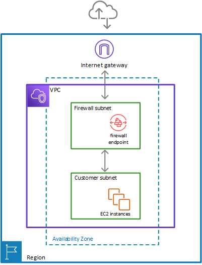

# Overview
+ AWS Network Firewall is a **stateful, managed, network firewall and intrusion detection and prevention service for your virtual private cloud (VPC)** that you created in Amazon Virtual Private Cloud (Amazon VPC).
+ With Network Firewall, you can filter traffic at the perimeter of your VPC. This includes filtering traffic **going to and coming from an internet gateway, NAT gateway, or over VPN or AWS Direct Connect**.
+ Network Firewall uses the open source intrusion prevention system (IPS), **Suricata**, for stateful inspection
+ With AWS Network Firewall, you can create firewall rules that provide fine-grained control over network traffic and easily deploy firewall security across your VPCs.
# How AWS Network Firewall works
+ 
+ 
# AWS Network FirewallAWS resources
+ **Firewall** – Provides traffic filtering logic for the subnets in a VPC.
+ **FirewallPolicy**
    + Defines **a reusable set of stateless and stateful rule groups**, along with some policy-level behavior settings. 
    + The firewall policy provides the network traffic filtering behavior for a firewall.
    + You can use a single firewall policy in multiple firewalls. 
+ **RuleGroup**
    + Defines a set of rules to match against VPC traffic, and the actions to take when Network Firewall finds a match.
    + Network Firewall uses stateless and stateful rule group types, each with its own Amazon Resource Name (ARN).
# AWS Network Firewall concepts
+ **Virtual private cloud (VPC)** – A virtual network dedicated to your AWS account.
+ **Internet gateway** – A gateway that you attach to your VPC to enable communication between resources in your VPC and the internet.
+ **Subnet** – A range of IP addresses in your VPC. 
+ **Firewall subnet**  
    + A subnet that you've designated for exclusive use by Network Firewall for a firewall endpoint.
    + **A firewall endpoint can't filter traffic coming into or going out of the subnet in which it resides, so don't use your firewall subnets for anything other than Network Firewall**
    + You install the firewall endpoints on a per-Availability Zone basis in your VPC.
    + For each Availability Zone where you want an endpoint, you choose a subnet to host it. 
+ **Route table** – A set of rules, called routes, that are used to determine where network traffic is directed. You **modify your VPC route tables in Amazon VPC to direct traffic through your firewalls for filtering**.
+ **Network Firewall firewall** – An AWS resource that **provides traffic filtering logic** for the subnets in a VPC.
+ **Network Firewall firewall policy** – An AWS resource that **defines rules and other settings for a firewall to use** to filter incoming and outgoing traffic in a VPC.
+ **Network Firewall rule group** – An AWS resource that defines **a set of rules** to match against VPC traffic, and **the actions to take** when Network Firewall finds a match.
    + **Stateless rules** – Criteria for inspecting a single network traffic packet, without the context of the other packets in the traffic flow, the direction of flow, or any other information that's not provided by the packet itself.
    + **Stateful rules** – Criteria for inspecting network traffic packets in the context of their traffic flow.
# Firewalls 
+ An AWS Network Firewall **firewall connects a firewall policy**, which defines network traffic monitoring and filtering behavior, **to the VPC that you want to protect**.
+ The firewall **configuration** includes specifications for the **Availability Zones and subnets where the firewall endpoints are placed**.
+ A firewall has the following top-level settings 
    + **Name** – The identifier for the firewall. You assign a unique name to every firewall. You **can't change the name** of a firewall after you create it.
    + **Description** – Optional additional information about the firewall.
    + **VPC** – The VPC that's associated with the firewall. This is **the VPC that the firewall provides protection for**.
    + **Subnets** – The **subnets to use for your firewall endpoints**. You can specify up to **one subnet for each Availability Zone** that your VPC spans.
    + **Firewall policy** – The firewall policy that's associated with the firewall. The firewall policy provides the monitoring and protection behavior for the firewall. 
    + **Logging** – The type and location of the logs that Network Firewall provides for the firewall's stateful rules engine.
    + **Tags** – Zero or more key-value tag pairs.
    + **Delete protection** – A Boolean setting that is enabled when you create a firewall, and **protects against accidental deletion of the firewall**. The setting isn't shown in the console because the firewall deletion process disables this protection. Through the API, you must explicitly disable delete protection before you can delete the firewall.
# Firewall policies
+ An AWS Network Firewall *firewall policy* defines the * monitoring and protection behavior for a firewall**.
+ The details of the behavior are defined in the rule groups that you add to your policy, and in some **policy default settings**.
+ A firewall policy has the following top-level settings. 
    + **Name** – The identifier for the firewall policy. You assign a unique name to every firewall policy. You** can't change the name of a firewall policy** after you create it.
    + **Description** – Optional additional information about the firewall policy.
    + **Stateless rule groups** – **Zero or more collections of stateless rules**, with priority settings that define their processing order within the policy. 
    + **Stateless default actions** – Define how Network Firewall **handles a packet or UDP packet fragment** that doesn't match any of the rules in the stateless rule groups. Network Firewall silently drops packet fragments for other protocols. The options for the firewall policy's default settings are the same as for stateless rules. 
    + **Stateful engine options** – The structure that **holds stateful rule order settings**. Note that you can only configure RuleOrder settings when you first create the policy. **RuleOrder can't be edited later**.
    + **Stateful rule groups** – Zero or more collections of stateful rules, provided in Suricata compatible format.
    + **Stateful default actions** – Define how Network Firewall handles a packet that doesn't match any of the rules in the stateful rule groups. 
    + **Tags** – Zero or more key-value tag pairs.
+ Stateless default actions in your firewall policy 
    + **Pass** – Discontinue all inspection of the packet and permit it to go to its intended destination.
    + **Drop** – Discontinue all inspection of the packet and block it from going to its intended destination.+
     **Forward to stateful rules** – Discontinue stateless inspection of the packet and forward it to the stateful rule engine for inspection.
+ Stateful default actions in your firewall policy 
    + **Standard rules and Suricata compatible strings**
    + **Pass**
    + **Drop** 
    + **Alert**
+ *The domain list rule group 
    + **Allow** – Indicates that the domain name list is to be used as an allow list for all traffic that matches the specified protocols.
    + **Deny** – Indicates that the domain name list is to be used as a deny list for traffic that matches the specified protocols. 
# **​​​​​​​Rule group**
+ An AWS Network Firewall *rule group* is **a reusable set of criteria for inspecting and handling network traffic**.
+ You add one or more rule groups to a firewall policy as part of policy configuration. 
+ Network Firewall rule groups are either **stateless or stateful**.
+ **Stateless rule groups evaluate packets in isolation**, **while stateful rule groups evaluate them in the context of their traffic flow**.
+ You can create and manage the following categories of rule groups in Network Firewall: 
    + **Stateless** – Defines standard, 5-tuple criteria for examining a packet on its own, with no additional context.
    + **Stateful** – Defines criteria for examining a packet in the context of traffic flow and of other traffic that's related to the packet.
+ Every rule group has the following top-level settings: 
    + **Type** – Whether the rule group is stateless or stateful.
    + **Name** – Identifier for the rule group. You assign a unique name to every rule group. You **can't change** the name of a rule group after you create it.
    + **Description** – Optional additional information about the rule group.
    + **Capacity** – Limit on the processing requirements for the rule group. You can't change this setting after you create the rule group. 
    + **Rules** – Set of packet inspection criteria used in the rule group. **Rules in a rule group are either stateless or stateful, depending on the rule group type**.
    + **Tags** – Zero or more key-value tag pairs.
# Reference
[What is AWS Network Firewall? - AWS Network Firewall](https://docs.aws.amazon.com/network-firewall/latest/developerguide/what-is-aws-network-firewall.html)
