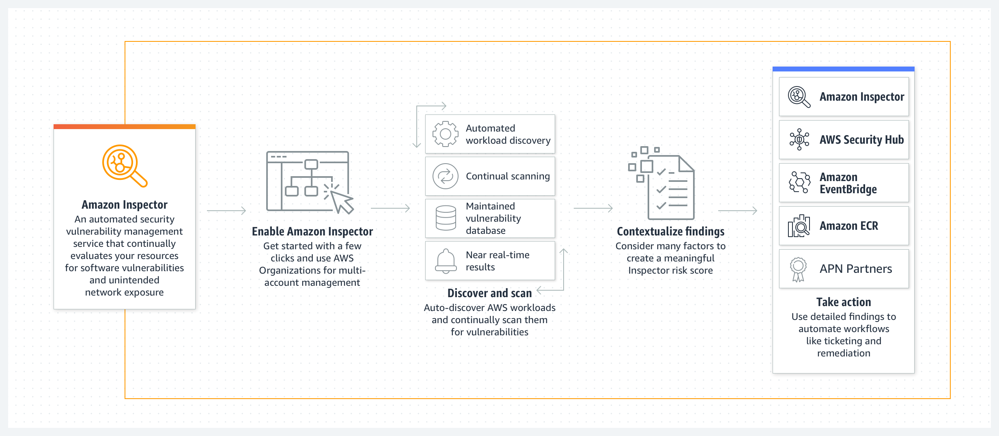

# Overview
+ Amazon Inspector is a vulnerability management service that **continuously scans your AWS workloads for vulnerabilities**.
+ Amazon Inspector automatically discovers and scans **Amazon EC2 instances and container images residing in Amazon Elastic Container Registry** (Amazon ECR) and **AWS Lambda functions in your AWS environment** for **software vulnerabilities and unintended network exposure**.
+ When a software vulnerability or network issue is discovered, Amazon Inspector creates a **finding**. A finding describes the **vulnerability, identifies the affected resource, rates the severity of the vulnerability, and provides remediation guidance**. 
# Features of Amazon Inspector
+ **Centrally manage multiple Amazon Inspector accounts**
    + If your AWS environment has multiple accounts, you can centrally manage your environment through a single account by using **AWS Organizations** and designating an account as the **delegated administrator account** for Amazon Inspector.
+ **Continuously scan your environment for vulnerabilities and network exposure**
    + With Amazon Inspector you **do not need to manually schedule** or configure assessment scans
    + Amazon Inspector **continues to assess** your environment throughout the lifecycle of your resources by automatically scanning resources **whenever you make changes** to them.
+ **Assess vulnerabilities accurately with the Amazon Inspector Risk score**
    + As Amazon Inspector collects information about your environment through scans, it provides **severity scores** specifically tailored to your environment. 
+ **Identify high-impact findings with the Amazon Inspector dashboard**
    + The **risk-based remediation panel** in the Amazon Inspector dashboard presents the findings that affect the largest number of instances and images.
    + This panel makes it easier to **identify the findings with the greatest impact** on your environment, see findings details, and view suggested solutions.
+ **Manage your findings using customizable views**
+ **Monitor and process findings with other services and systems**
    + ​​​​​​​AWS EventBridge
    + AWS Security Hub
# How it works
+ 
# What problems does Amazon Inspector solve?
+ Automate discovery and continual scanning that delivers near real-time vulnerability scanning.
+ Consolidate vulnerability management solutions into one fully managed service.
+ Provide a highly accurate risk score for each finding to efficiently prioritize remediation.
+ Integrate with AWS Security Hub and Amazon EventBridge to automate workflows, ticket routing, and remediation.
# Using Amazon Inspector
+ Install the AWS Agent in your Amazon EC2 instances
+ Run an assessment for your assessment target
+ Review your findings and remediate security issues
# Understanding findings
+ In Amazon Inspector, **a finding is a detailed report about a potential vulnerability** that affects one of your resources.
+ Amazon Inspector generates a finding whenever it detects a potential vulnerability for an **Amazon EC2 instance** or a potential software vulnerability in a **container image within an Amazon ECR repository**.
+ A finding can be assigned one of the following states: 
    + **Active** - The finding is identified by Amazon Inspector and has not yet been remediated. Active findings are subject to suppression rules and, if applicable, the status is changed to **Suppressed**.
    + **Suppressed** - The finding meets one or more criteria of one or more suppression rules. Suppressed findings are **hidden from most views**, with the exception of the **Suppressed findings** list.
    + **Closed** - After a vulnerability is remediated, Amazon Inspector automatically detects it and changes the state of the finding to closed. Closed findings are deleted after 30 days if there are no other changes.
+ finding types 
    + **Package vulnerability**
        + Package vulnerability findings identify software packages in your environment that are exposed to common vulnerabilities and exposures (CVEs)
        + Package vulnerability findings are generated for **both Amazon EC2 instances and ECR container images**.
    + **Network reachability**
        + Network reachability findings indicate that there are allowed network paths to Amazon EC2 instances in your environment.
        + Network reachability findings are **only generated for Amazon EC2 resources**.
# Scanning resources
+ Amazon Inspector initiates **scans of EC2 instances** in the following situations: 
    + As soon as the EC2 instance is discovered by Amazon Inspector
    + When you launch a new instance
    + When you install new software on an existing instance
    + When Amazon Inspector adds a new common vulnerabilities and exceptions (CVE) item to its database
+ Amazon Inspector **scans container images stored in Amazon ECR** for software vulnerabilities to generate **Package Vulnerability** findings. 
    + Enhanced scanning gives you a choice between **continuous scanning or on-push scanning at the repository level**.
    + Continuous scanning includes on-push scans and automated rescans.
    + On-push scanning scans only when you push an image.
    + For both options you can refine the scanning scope through inclusion filters.
# Managing multiple accounts with AWS Organizations
+ With Amazon Inspector you can manage multiple accounts that are associated through [AWS Organizations](https://docs.aws.amazon.com/organizations/latest/userguide/orgs_introduction.html).
+ To manage multiple Amazon Inspector accounts, the Organizations management account designates an account within the organization as **the delegated administrator account** for Amazon Inspector.
+ The delegated administrator manages Amazon Inspector for the organization and is granted **special permissions to perform tasks on behalf of your organization**.
+ These tasks include **enabling or disabling scans for member accounts**, **viewing aggregated finding data** from the entire organization, and the **creation and management of suppression rules**.
+ A delegated administrator is **Regional**.
+ An organization can have **only one delegated administrator**.
+ Changing a delegated administrator does not disable Amazon Inspector for member accounts.
# Amazon Inspector integrations
+ **Amazon ECR**
    + You can use Amazon Inspector to scan container images residing in your Amazon ECR repositories for vulnerable operating system packages and programming language packages.
+ **AWS Security Hub**
    + Enabling Security Hub with Amazon Inspector automatically allows Amazon Inspector findings data to be ingested by Security Hub.
# What are the benefits of Amazon Inspector?
+ Automated discovery and continual scanning
+ Highly contextualized risk score for prioritization
+ Single pane of glass for all vulnerabilities
+ Automated vulnerability management workflows
# Reference
+ [What is Amazon Inspector? - Amazon Inspector](https://docs.aws.amazon.com/inspector/latest/user/what-is-inspector.html)
+ [Amazon Inspector - Getting Started](https://explore.skillbuilder.aws/learn/course/16685/play/85081/amazon-inspector-getting-started)
+ [Introduction to Amazon Inspector](https://explore.skillbuilder.aws/learn/course/185/play/25436/introduction-to-amazon-inspector)