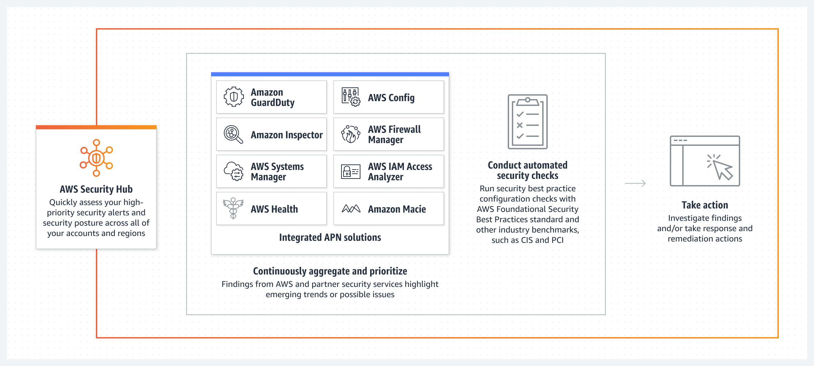

# Overview
+ AWS Security Hub provides you with a **comprehensive view of your security state in AWS** and helps you check your environment against security industry standards and best practices.
+ Security Hub collects security data from **across AWS accounts, services, and supported third-party partner products** and helps you analyze your security trends and **identify the highest priority security issues**.
# Benefits of AWS Security Hub
+ Security Hub **reduces the effort to collect and prioritize security findings** across accounts from integrated AWS services and AWS partner products.
+ Security Hub **automatically runs continuous, account-level configuration and security checks** based on AWS best practices and industry standards. 
+ Security Hub **consolidates your security findings** across accounts and provider products and displays results on the Security Hub console.
+ Security Hub supports **integration with Amazon EventBridge**. To **automate** remediation of specific findings, you can define custom actions to take when a finding is received. 
+ 
# How Security Hub works
+ When you enable Security Hub, it begins to **consume, aggregate, organize, and prioritize findings from AWS services** that you have enabled
+ Security Hub also **generates its own findings by running continuous, automated security checks** based on AWS best practices and supported industry standards.
+ Security Hub then **correlates and consolidates findings across providers** to help you to prioritize the most significant findings.
+ You can also create *insights* in Security Hub. 
    + An insight is a collection of findings that are grouped together when you apply a **Group by** filter.
    + Insights help you identify common security issues that may require remediation action.
    + Security Hub includes several managed insights, or you can create your own custom insights.
# Terminology and concepts
## **Account**
+ An account can invite other accounts to enable Security Hub and become associated with that account in Security Hub.
+ If the invitations are accepted, the account becomes an **administrator account**, and the **added accounts are member accounts**.
+ Administrator accounts can view findings in their member accounts.
+ If you are enrolled in AWS Organizations, then your organization designates a Security Hub administrator account for the organization.
+ The Security Hub administrator account can enable other organization accounts as member accounts
+ An account **cannot** be an administrator account and a member account at the same time.
+ A member account can **only be associated with one administrator account**. 
+ This administrator account should be an account that is responsible for security tools. The same account should also be the **aggregator account for AWS Config**.
## **Aggregation Region**
+ For finding aggregation, the aggregation Region is the Region from which you view and manage findings.
+ Findings are **aggregated to the aggregation Region from the linked Regions**. Updates to findings are replicated across Regions.
+ In the aggregation Region, **the Findings and Insights pages include findings from the linked Regions**.
## **Linked Region**
+ For finding aggregation, a linked Region is a region that aggregates findings to the aggregation Region.
+ In a linked Region, the **Findings** and **Insights** pages **contain findings only from that Region**.
## **Archived finding**
+ A finding that has a `RecordState` set to `ARCHIVED`.
+ Archiving a finding indicates that the finding provider believes that the finding is no longer relevant. 
## **AWS Security Finding Format (ASFF)**
+ A standardized **format for the contents of findings** that Security Hub aggregates or generates.
## **Custom action**
+ A Security Hub mechanism for **sending selected findings to EventBridge**.
+ A custom action is created in Security Hub.
+ It is then linked to an EventBridge rule.
+ The rule defines a specific action to take when a finding is received that is associated with the custom action ID.
## **Delegated administrator account (Organizations)**
+ In Organizations, the **delegated administrator account** for a service is able to manage the use of a service for the organization.
+ In Security Hub, the Security Hub **administrator account is also the delegated administrator account** for Security Hub.
## **Finding**
+ The observable record of a security check or security-related detection.
## **Finding ingestion**
+ The import of findings into Security Hub from other AWS services and from third-party partner providers.
+ Finding ingestion events include both **new findings and updates to existing findings**.
## **Insight**
+ A collection of related findings defined by an **aggregation statement and optional filters**.
## **Control**
+ A control is a **security check against a specific resource**.
+ From Security Hub, you can view the control details. The control details include the control status and the findings generated for each control
## **Rule**
+ A set of automated criteria that is used to **assess whether a control is being adhered to**. 
## **Security check**
+ A specific point-in-time evaluation of a rule against a single resource resulting in a passed, failed, warning, or not available state.
+ **Running a security check produces a finding**.
## **Security standard**
+ Security standards provide **a set of related controls** to determine compliance with regulatory frameworks, industry best practices, or company policies.
+ A published statement on a topic specifying the characteristics, usually measurable and in the form of controls, that must be satisfied or achieved for compliance.
## **Workflow status**
+ The status of an investigation into a finding. Tracked using the `Workflow.Status` attribute.
+ The workflow status is initially `NEW`.
+ If you notified the resource owner to take action on the finding, you can set the workflow status to `NOTIFIED`.
+ If the finding is not an issue, and does not require any action, set the workflow status to `SUPPRESSED`.
+ After you review and remediate a finding, set the workflow status to `RESOLVED`.
# Enabling and configuring AWS Config
+ AWS Security Hub **uses service-linked AWS Config rules** to perform most of its security checks for controls.
+ To support these controls, **AWS Config must be enabled on all accounts** – both the master account and member accounts – **in each Region** where Security Hub is enabled.
# Setting up AWS Security Hub
+ You can set up Security Hub and manage accounts separately in each Region
+ All accounts also must enable AWS Config, which is needed for the security checks against security controls
.+ After you attach the required policy to the IAM identity, you use that identity to enable Security Hub. You can enable Security Hub from the AWS Management Console or the API.
+ When you enable Security Hub, it is assigned a service-linked role named `AWSServiceRoleForSecurityHub`.
# Benefits of Security Hub
+ Continuous monitoring
+ Security finding aggregation
+ Initiate automated responses
+ Security posture
# What problems does Security Hub solve?
+ Automated, continuous security best practice checks
+ Consolidated findings across AWS services and AWS Partner integrations
+ A single, standardized data format for all of your findings
+ Security standards aligned to regulatory and industry compliance frameworks
+ Automated response, remediation, and enrichment actions
+ Multi-account and AWS Organizations support
+ Cross-Region aggregation of findings
# What are typical use cases for Security Hub?
+ Reduce risk with automated, continuous security checks
+ Consolidate findings across AWS services and partner integrations
+ Automate response and remediation
# Reference
+ [What is AWS Security Hub? - AWS Security Hub](https://docs.aws.amazon.com/securityhub/latest/userguide/what-is-securityhub.html)
+ [Getting Started with AWS Security Hub](https://explore.skillbuilder.aws/learn/course/14697/play/82065/getting-started-with-aws-security-hub)