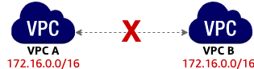
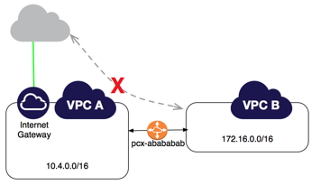
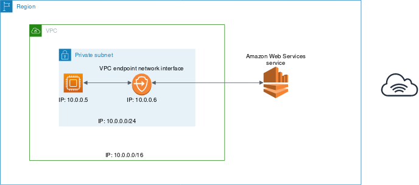
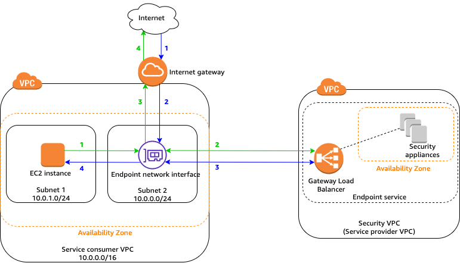

# Overview
+ Amazon Virtual Private Cloud (Amazon VPC) enables you to launch AWS resources into a virtual network that you've defined.
+ Amazon VPC is the networking layer for Amazon EC2.
+ **Virtual private cloud (VPC)** — A virtual network dedicated to your AWS account.
+ **Subnet** — A range of IP addresses in your VPC.
+ **Route table** — A set of rules, called routes, that are used to determine where network traffic is directed.
+ **Internet gateway** — A gateway that you attach to your VPC to enable communication between resources in your VPC and the internet.
+ **VPC endpoint** — Enables you to privately connect your VPC to supported AWS services and VPC endpoint services **powered by PrivateLink** without requiring an internet gateway, NAT device, VPN connection, or AWS Direct Connect connection. 
    + Instances in your VPC do not require public IP addresses to communicate with resources in the service.
    + Traffic between your VPC and the other service does not leave the Amazon network.
+ **CIDR block** —Classless Inter-Domain Routing. An internet protocol address allocation and route aggregation methodology.
# VPCs
+ A *virtual private cloud* (VPC) is a virtual network dedicated to your AWS account. It is **logically isolated** from other virtual networks in the AWS Cloud. 
+ You can **specify an IP address range** for the VPC, **add subnets, associate security groups, and configure route tables**.
+ If your account was created after 2013-12-04, it comes with **a *default VPC* that has a *default subnet* in each Availability Zone**.
+ Your default VPC includes an internet gateway, and each **default subnet is a public subnet**. 
+ When you create a VPC, you **must specify a range of IPv4 addresses** for the VPC in the form of a Classless Inter-Domain Routing (CIDR) block; for example, `10.0.0.0/16`. This is the **primary CIDR block** for your VPC.
+ A VPC **spans all of the Availability Zones** in the Region. After creating a VPC, you can add **one or more subnets in each Availability Zone**. You can optionally add subnets in a **Local Zone**
+ Amazon VPC supports IPv4 and IPv6 addressing, and has different CIDR block size quotas for each. By default, all VPCs and subnets **must have IPv4 CIDR blocks**—you can't change this behavior. You can **optionally associate an IPv6 CIDR block** with your VPC.
+ You can **associate secondary IPv4 CIDR blocks** with your VPC.
+ The allowed block size is between a **`/28` netmask and `/16` netmask**.
+ **The first four IP addresses and the last IP address** in each subnet CIDR block **are not available** for you to use, and cannot be assigned to an instance.
+ You **cannot increase or decrease the size** of an existing CIDR block.
+ The CIDR block for IPv6 is a fixed prefix length of `/56`. 
+ **VPC sharing** allows **multiple AWS accounts** to create their application resources, such as Amazon EC2 instances, Amazon Relational Database Service (RDS) databases, Amazon Redshift clusters, and AWS Lambda functions, into shared, centrally-managed virtual private clouds (VPCs) 
+ Owners can share subnets only with other accounts or organizational units that are **in the same organization** from AWS Organizations.
+ Owners **cannot share subnets** that are in a default VPC.
+ You can host VPC resources, such as subnets, in **multiple locations** world-wide. These locations are composed of **Regions, Availability Zones, Local Zones, and Wavelength Zones**
+ To maintain redundancy and fault tolerance, create at least two subnets configured in two Availability Zones.
+ For AWS to configure your VPC appropriately, AWS reserves five IP addresses in each subnet. the first four and the last one
+ A route table contains a set of rules, called routes, that determine where network traffic from your subnet or gateway is directed.
+ Amazon VPCs live entirely within the AWS Cloud.
+ An Amazon VPC lives in one Region.
+ A subnet can only live in one Availability Zone.
+ Some AWS resources must be launched into an Amazon VPC.
+ Internet gateways let your VPC resources reach the internet.
+ Route tables control the routing of traffic coming into, going out of, and moving within your Amazon VPC.
+ VPC flow logs capture information about IP traffic going to and from network interfaces in your Amazon VPC. They're a great tool for identifying problems with your network's traffic, including from undesired activity or even just to identify security rules that are creating unnecessary blocks in the flow of your desired traffic.
## Default Amazon VPC
+ Each default Amazon VPC creates a public subnet within each Availability Zone within the supported Region. 
+ Each public subnet is configured with a default route for all inbound and outbound traffic that routes IP traffic to the general internet. 
+ AWS sets up the configuration that allows all traffic, so there is no privacy and isolation by default.
+ Only one default Amazon VPC per Region is permitted.
+ Each default comes with one Amazon VPC Classless Inter-Domain Routing (CIDR) range, which is a given range of IP addresses.
+ The default Amazon VPC is initially configured with a /16 IPv4 CIDR block, a /20 default subnet for the Regions' Availability Zones, an internet gateway, a default route to the internet gateway, a default security group, a default network ACL, and a default Dynamic Host Configuration Protocol (DHCP) option set. 
+ Network ACLs are attached at the subnet level, and by default, a network ACL is created for a default Amazon VPC and is associated with all subnets in your default Amazon VPC. 
## Custom Amazon VPC
+ Unlike a default Amazon VPC, each component of a custom Amazon VPC must be explicitly defined when you create it; nothing is allowed in or out without explicit configuration. 
+ AWS supports extending your AWS environment by establishing a secure connection between an Amazon VPC and an on-premises network using:
    + AWS Direct Connect
    + AWS Site-to-Site Virtual Private Network (VPN)
    + AWS Client VPN
# CIDR 
+ CIDR notation is a compressed way of representing a range of IP addresses. Specifying a range determines how many IP addresses are available to you.
+ It begins with a starting IP address and is separated by a forward slash (the / character) followed by a number. The number at the end specifies how many of the bits of the IP address are fixed
+ The higher the number after the /, the smaller the number of IP addresses in your network.he higher the number after the /, the smaller the number of IP addresses in your network.
+ In AWS, the smallest IP range you can have is /28, which provides 16 IP addresses. The largest IP range you can have is a /16, which provides 65,536 IP addresses. Subnets
+ A **subnet is a range of IP addresses** in your VPC. 
+ Use a **public subnet** for resources that must be **connected to the internet**, and a **private subnet** for resources that **won't be** connected to the internet .
+ When you create a subnet, you **specify the CIDR block for the subnet**, which is a subset of the VPC CIDR block. Each subnet must **reside entirely within one Availability Zone** and cannot span zones.
+ You can also **optionally assign an IPv6 CIDR block** to your VPC, and assign IPv6 CIDR blocks to your subnets.
+ If a subnet's traffic is **routed to an internet gateway**, the subnet is known as a **public subnet**.
+ If a subnet **doesn't have a route to the internet gateway**, the subnet is known as a **private subnet**.
+ If a subnet doesn't have a route to the internet gateway, but **has its traffic routed to a virtual private gateway for a Site-to-Site VPN connection**, the subnet is known as a **VPN-only subnet**. 
+ A subnet's IPv6 CIDR block is a fixed prefix length of `/64`
# Route tables
+ A *route table* contains **a set of rules, called routes**, that are used to **determine where network traffic from your VPC is directed**. 
+ You can explicitly associate a subnet with a particular route table.
+ Otherwise, the subnet is implicitly associated with the main route table.
+ Each route in a route table specifies the range of IP addresses where you want the traffic to go (the destination) and the gateway, network interface, or connection through which to send the traffic (the target).
+ **Main route table**—The route table that **automatically comes with your VPC**. It controls the routing for all subnets that are not explicitly associated with any other route table.
    + When you create a VPC, AWS creates a route table called the main route table.
    + AWS assumes that when you create a new VPC with subnets, you want traffic to flow between them. Therefore, the default configuration of the main route table is to allow traffic between all subnets in the local network. 
    + The main route table is used implicitly by subnets that do not have an explicit route table association. 

+ **Custom route table**—A route table that you create for your VPC.
    + Although you should not have identical entries in route tables that apply to the same resource, the CIDR blocks can overlap. When the CIDR blocks for route table entries overlap, the more specific (smaller range) CIDR block takes priority.

+ Your VPC has an **implicit router**, and you use route tables to control where network traffic is directed.
+ **Each subnet in your VPC must be associated with a route table**, which controls the routing for the subnet (subnet route table).
+ You can explicitly associate a subnet with a particular route table. Otherwise, the subnet is implicitly associated with the main route table.
+ Every route table contains a local route for communication within the VPC. 
# network access control list
+ Think of a network access control list (network ACL) as a virtual firewall at the subnet level.
+ ACL lets you control what kind of traffic is allowed to enter or leave your subnet.
+ The default network ACL shown in the preceding table, allows all traffic in and out of the subnet.
+ Network ACLs are considered stateless, so you need to include both the inbound and outbound ports used for the protocol. If you don’t include the outbound range, your server would respond but the traffic would never leave the subnet.
+ Network ACLs are a great way to limit broad ranges of IP addresses from getting access to or from a subnet. 
# security group
+ The next layer of security is for your EC2 instances. Here, you can create a virtual firewall called a security group. The default configuration of a security group blocks all inbound traffic and allows all outbound traffic.
+ By default, a security group only allows outbound traffic. To allow inbound traffic, you must create inbound rules.
+ Well, security groups are stateful. That means that they will remember if a connection is originally initiated by the EC2 instance or from the outside, and temporarily allow traffic to respond without modifying the inbound rules.
+ If you want your EC2 instance to accept traffic from the internet, you must open up inbound ports.
+ However, security groups are not capable of explicitly blocking traffic. If you need to block a certain IP address or a block of IP addresses, you will require assistance from network ACLs.
+ Network ACLs explicitly specify what traffic is or isn't allowed. Security group rules only specify what traffic is allowed, while all other traffic is blocked.
+ A difference between security groups and network ACLs is that security groups recognize AWS resources. So for an Amazon EC2 instance, the instance ID could be added to the security group rule for that instance to allow traffic from the instance. Customers can also add rules for other security groups, or add a rule for the security group themselves.  

# Internet gateway
+ An internet gateway is a **horizontally scaled, redundant, and highly available** VPC component that allows **communication between your VPC and the internet**.
+ An internet gateway serves two purposes: 
    + to provide a target in your VPC route tables for **internet-routable traffic**,
    + to **perform network address translation (NAT)** for instances that have been assigned public IPv4 addresses. 
+ To enable access to or from the internet for instances in a subnet in a VPC, you must do the following. 
    + **Create an internet gateway** and attach it to your VPC.
    + **Add a route** to your subnet's route table that directs internet-bound traffic to the internet gateway. 
        + In your public subnet's route table, you can specify a route for the internet gateway to all destinations not explicitly known to the route table (**`0.0.0.0/0` for IPv4 or `::/0` for IPv6**)
    + Ensure that instances in your subnet have a **globally unique IP address** (public IPv4 address, Elastic IP address, or IPv6 address).
    + Ensure that your network **access control lists and security group rules** allow the relevant traffic to flow to and from your instance.
# Carrier gateways
+ A carrier gateway serves two purposes: 
    + It allows inbound traffic from a carrier network in a specific location
    + it allows outbound traffic to the carrier network and the internet
+ A carrier gateway supports IPv4 traffic.
+ Carrier gateways are **only available for VPCs that contain subnets in a Wavelength Zone**.
+ The carrier gateway provides **connectivity between your Wavelength Zone and the telecommunication carrier**, and devices on the telecommunication carrier network.
+ The carrier gateway **performs NAT** of the Wavelength instances' IP addresses to the Carrier IP addresses from a pool that is assigned to the network border group.
+ The carrier gateway NAT function is similar to how an internet gateway functions in a Region.
# Network address translation (NAT) device
+ to allow an instance in your VPC to **initiate outbound connections to the internet but prevent unsolicited inbound connections from the internet**, you can use a **network address translation (NAT) device**.
+ You can configure the NAT device with an Elastic IP address and connect it to the internet through an internet gateway.
+ This makes it possible for an **instance in a private subnet to connect to the internet through the NAT device**, routing traffic from the instance to the internet gateway and any responses to the instance.
+ The NAT device replaces the source IPv4 address of the instances with the address of the NAT device. When sending response traffic to the instances, the NAT device translates the addresses back to the original source IPv4 addresses.
+ You can use **a managed NAT device** offered by AWS, called a **NAT gateway**, or you can create your own **NAT device on an EC2 instance**, called a *NAT instance*. 
+ We recommend that you use **NAT gateways because they provide better availability and bandwidth** and require less effort on your part to administer.
+ NAT devices are **not supported for IPv6 traffic**—use an egress-only internet gateway instead. 
## NAT gateways
+ A NAT gateway is a Network Address Translation (NAT) service.
+ When you create a NAT gateway, you specify one of the following connectivity types: 
    + **Public** – (Default) Instances in private subnets can **connect to the internet** through a **public NAT gateway**, but cannot receive unsolicited inbound connections from the internet. 
    + **Private** – Instances in private subnets can **connect to other VPCs or your on-premises network** through a **private NAT gateway**.  You can route traffic from the NAT gateway through **a transit gateway or a virtual private gateway**.
+ Each NAT gateway is created in a **specific Availability Zone** and implemented with redundancy in that zone. 
+ To create an **Availability Zone-independent** architecture, **create a NAT gateway in each Availability Zone** and configure your routing to ensure that **resources use the NAT gateway in the same Availability Zone**.
## NAT instances
+ NATSG security group
+ 
| Inbound | Source | Protocol | Port range | Comments |
|----|----|----|----|----| 
| `10.0.1.0/24` | TCP | 80 | Allow inbound HTTP traffic from servers in the private subnet  |
| `10.0.1.0/24` | TCP | 443 | Allow inbound HTTPS traffic from servers in the private subnet  |
| Public IP address range of your home network  | TCP | 22 | Allow inbound SSH access to the NAT instance from your home network (over the internet gateway) |
+ 
| Outbound | Destination | Protocol | Port range | Comments| 
|----|----|----|----|----| 
| `0.0.0.0/0` | TCP | 80 | Allow outbound HTTP access to the internet |  
| `0.0.0.0/0` | TCP | 443 | Allow outbound HTTPS access to the internet | 
+ Disable source/destination checks
## Compare NAT gateways and NAT instances
+ The following is a high-level summary of the differences between NAT gateways and NAT instances. We recommend that you use NAT gateways because they provide better availability and bandwidth and require less effort on your part to administer.
    | Attribute | NAT gateway | NAT instance|
    |----|----|----|
    | Availability | Highly available. NAT gateways in each Availability Zone are implemented with redundancy. Create a NAT gateway in each Availability Zone to ensure zone-independent architecture. | Use a script to manage failover between instances.BandwidthScale up to 45 Gbps.Depends on the bandwidth of the instance type. |
    | Maintenance | Managed by AWS. You do not need to perform any maintenance. | Managed by you, for example, by installing software updates or operating system patches on the instance. |
    | Performance | Software is optimized for handling NAT traffic. | A generic AMI that's configured to perform NAT. |
    | Cost | Charged depending on the number of NAT gateways you use, duration of usage, and amount of data that you send through the NAT gateways. | Charged depending on the number of NAT instances that you use, duration of usage, and instance type and size. |
    | Type and size | Uniform offering; you don’t need to decide on the type or size. | Choose a suitable instance type and size, according to your predicted workload. |
    | Public IP addresses | Choose the Elastic IP address to associate with a public NAT gateway at creation. | Use an Elastic IP address or a public IP address with a NAT instance. You can change the public IP address at any time by associating a new Elastic IP address with the instance. |
    | Private IP addressesAutomatically selected from the subnet's IP address range when you create the gateway. | Assign a specific private IP address from the subnet's IP address range when you launch the instance. |
    | Security groups | You cannot associate security groups with NAT gateways. You can associate them with the resources behind the NAT gateway to control inbound and outbound traffic. | Associate with your NAT instance and the resources behind your NAT instance to control inbound and outbound traffic. |
    | Network ACLs | Use a network ACL to control the traffic to and from the subnet in which your NAT gateway resides. | Use a network ACL to control the traffic to and from the subnet in which your NAT instance resides. |
    | Flow logs | Use flow logs to capture the traffic. | Use flow logs to capture the traffic. | 
    | Port forwarding | Not supported. | Manually customize the configuration to support port forwarding. |
    | Bastion servers | Not supported. | Use as a bastion server. |
    | Traffic metrics | View [CloudWatch metrics for the NAT gateway](https://docs.aws.amazon.com/vpc/latest/userguide/vpc-nat-gateway-cloudwatch.html). | View CloudWatch metrics for the instance. |
    | Timeout behavior | When a connection times out, a NAT gateway returns an RST packet to any resources behind the NAT gateway that attempt to continue the connection (it does not send a FIN packet). | When a connection times out, a NAT instance sends a FIN packet to resources behind the NAT instance to close the connection. |
    | IP fragmentation | Supports forwarding of IP fragmented packets for the UDP protocol. Does not support fragmentation for the TCP and ICMP protocols. | Fragmented packets for these protocols will get dropped. Supports reassembly of IP fragmented packets for the UDP, TCP, and ICMP protocols. |
# Egress-only internet gateways
+ An egress-only internet gateway is a horizontally scaled, redundant, and highly available VPC component that **allows outbound communication over IPv6 from instances** in your VPC to the internet, and **prevents the internet from initiating an IPv6 connection with your instances**. 
+ To do this, create an egress-only internet gateway in your VPC, and then add a route to your route table that points **all IPv6 traffic (`::/0`) or a specific range of IPv6 address to the egress-only internet gateway**.
+ An egress-only internet gateway is **stateful**: it forwards traffic from the instances in the subnet to the internet or other AWS services, and then sends the response back to the instances.
+ You **cannot associate a security group** with an egress-only internet gateway. You can use security groups for your instances.
+ You can use a network ACL to control the traffic to and from the subnet for which the egress-only internet gateway routes traffic.
# Transit gateway
+ You can also create a *transit gateway* and use it to **interconnect your VPCs and on-premises networks**. 

# VPN
+ You can optionally connect your VPC to your own corporate data center using an IPsec AWS Site-to-Site VPN connection, making the AWSCloud an extension of your data center.
+ A Site-to-Site VPN connection consists of **two VPN tunnels** between **a virtual private gateway or transit gateway on the AWS side**, and **a customer gateway device located in your data center**.
+ A customer gateway device is a physical device or software appliance that you configure on your side of the Site-to-Site VPN connection.
# *VPC peering*
+ You can create a *VPC peering connection* between two VPCs that enables you to **route traffic between them privately**.
 + The two VPCs **cannot have a CIDR block that overlaps**
+ Instances in either VPC can communicate with each other **as if they are within the same network**.
+ You can create a VPC peering connection **between your own VPCs, with a VPC in another AWS account, or with a VPC in a different AWS Region**.
+ AWS uses the existing infrastructure of a VPC to create a VPC peering connection; it is neither a gateway nor a VPN connection, and does not rely on a separate piece of physical hardware. There is **no single point of failure** for communication or a bandwidth bottleneck.
+ A VPC peering connection is a **one to one relationship between two VPCs**. 
+ You can create multiple VPC peering connections for each VPC that you own, but **transitive peering relationships are not supported**. 
+ You cannot have more than one VPC peering connection between the same two VPCs at the same time.
## Unsupported VPC peering
+ Overlapping CIDR blocks
+ 
+ Transitive peering
+ 
+ Edge to edge routing through a VPN connection or an AWS Direct Connect connection
+ 
+ Edge to edge routing through an internet gateway
+ 
+ Edge to edge routing through a VPC gateway endpoint
+ 
# AWS PrivateLink and VPC endpoints
+ AWS PrivateLink establishes private connectivity between virtual private clouds (VPC) and services hosted on AWS or on-premises, without exposing traffic between your VPC and the service to the internet.

# DHCP options
+ After you create a set of DHCP options, you can't modify them. If you need your VPC to use a different set of DHCP options, you must create it and then associate it with your VPC.
+ You can have multiple sets of DHCP options, but you **can associate only one set of DHCP options with a VPC at a time**.
# DNS support 
+ Domain Name System (DNS) is a standard by which names used on the internet are resolved to their corresponding IP addresses.
# Elastic IP addresses
+ An *Elastic IP address* is a **static, public IPv4 address** designed for dynamic cloud computing.
+ You can associate an Elastic IP address with **any instance or network interface in any VPC** in your account.
+ With an Elastic IP address, you can mask the failure of an instance by rapidly **remapping the address to another instance** in your VPC. The advantage of associating the Elastic IP address with the network interface instead of directly with the instance is that you can **move all the attributes of the network interface from one instance to another in a single step**.
+ To use an Elastic IP address, you first **allocate it for use in your account**. Then, you can associate it with an instance or network interface in your VPC. Your Elastic IP address remains allocated to your AWS account until you **explicitly release** it.
+ a small hourly charge when they **aren't associated** with a running instance, or when they are associated with a stopped instance or an unattached network interface. 
# ClassicLink
+ ClassicLink allows you to **link an EC2-Classic instance to a VPC in your account**, within the same Region.
+ This allows you to **associate the VPC security groups with the EC2-Classic instance**, enabling **communication** between your EC2-Classic instance and instances in your VPC **using private IPv4 addresses**. 
# VPC Flow Logs
+ VPC Flow Logs is a feature that enables you to **capture information about the IP traffic going to and from network interfaces in your VPC**.
+ Flow log data can be published to Amazon CloudWatch Logs or Amazon S3. After you've created a flow log, you can retrieve and view its data in the chosen destination.
# AWS Network Firewall
+ You can filter network traffic at the perimeter of your VPC using AWS Network Firewall. Network Firewall is a **stateful, managed, network firewall** and **intrusion detection and prevention service**. 
# Route 53 Resolver DNS Firewall
+ With DNS Firewall, you define domain name filtering rules in rule groups that you associate with your VPCs.
+ You can specify lists of domain names to allow or block, and you can customize the responses for the DNS queries that you block. 
# Traffic Mirroring
+ Traffic Mirroring is an Amazon VPC feature that you can use to copy network traffic from an elastic network interface of Amazon EC2 instances. You can then send the traffic to out-of-band security and monitoring appliances for: 
    + Content inspection
    + Threat monitoring
    + Troubleshooting
+ The security and monitoring appliances can be deployed as individual instances, or as a fleet of instances behind a Network Load Balancer with **a UDP listener**. Traffic Mirroring supports filters and packet truncation, so that you only extract the traffic of interest to monitor by using monitoring tools of your choice.
+ The following are the **key concepts** for Traffic Mirroring: 
    + **Target** — The destination for mirrored traffic.
    + **Filter** — A set of rules that defines the traffic that is copied in a traffic mirror session.
    + **Session** — An entity that describes Traffic Mirroring from a source to a target using filters.
+ The traffic mirror source and the traffic mirror target (monitoring appliance) can be in the same VPC. Or they can be in a different VPC connected via intra-Region VPC peering or a transit gateway.
+ Traffic Mirroring offers the following benefits: 
    + **Simplified operation** — Mirror any range of your VPC traffic without having to manage packet forwarding agents on your EC2 instances.
    + **Enhanced security** — Capture packets at the elastic network interface, which cannot be disabled or tampered with from a user space
    + **Increased monitoring options** — Send your mirrored traffic to any security device.
# Reachability Analyzer
+ VPC Reachability Analyzer is a configuration analysis tool that enables you to **perform connectivity testing** between a source resource and a destination resource in your virtual private clouds (VPCs).
+ VPC Reachability Analyzer **analyzes the path** between a source and destination by building a model of the network configuration, and then checking for reachability based on the configuration. It **does not send packets** or analyze the data plane.
+ To use Reachability Analyzer, you **specify the path for the traffic from a source to a destination**. For example, you could specify an internet gateway as the source, an EC2 instance as the destination, 22 as the destination port, and TCP as the protocol.
+ The source and destination resources must be **owned by the same AWS account.**
+ The source and destination resources must be **in the same Region**.
+ The source and destination resources must be **in the same VPC or in VPCs that are connected through a VPC peering connection**.
# VPC with public and private subnets and AWS Site-to-Site VPN access
+ The configuration for this scenario includes a virtual private cloud (VPC) with a public subnet and a private subnet, and a virtual private gateway to enable communication with your own network over an IPsec VPN tunnel. 
+ 
+ The configuration for this scenario includes the following: 
    + A virtual private cloud (VPC) with a size /16 IPv4 CIDR (example: 10.0.0.0/16). This provides 65,536 private IPv4 addresses.
    + A **public subnet** with a size /24 IPv4 CIDR (example: 10.0.0.0/24). This provides 256 private IPv4 addresses. A public subnet is a subnet that's associated with a route table that has a route to an internet gateway.
    + A **VPN-only subnet** with a size /24 IPv4 CIDR (example: 10.0.1.0/24). This provides 256 private IPv4 addresses.
    + An **internet gateway**. This connects the VPC to the internet and to other AWS products.
    + A **Site-to-Site VPN** connection between your VPC and your network. The Site-to-Site VPN connection consists of a virtual private gateway located on the Amazon side of the Site-to-Site VPN connection and a customer gateway located on your side of the Site-to-Site VPN connection.
    + **Instances with private IPv4 addresses** in the subnet range (examples: 10.0.0.5 and 10.0.1.5), which enables the instances to communicate with each other and other instances in the VPC.
    + **Instances in the public subnet with Elastic IP addresses** (example: 198.51.100.1), which are public IPv4 addresses that enable them to be reached from the internet. The instances can have public IPv4 addresses assigned at launch instead of Elastic IP addresses. Instances in the VPN-only subnet are back-end servers that don't need to accept incoming traffic from the internet, but can send and receive traffic from your network.
    + **A custom route table** associated with the public subnet. This route table contains an entry that enables instances in the subnet to communicate with other instances in the VPC, and an entry that enables instances in the subnet to communicate directly with the internet.
    + **The main route table** associated with the VPN-only subnet. The route table contains an entry that enables instances in the subnet to communicate with other instances in the VPC, and an entry that enables instances in the subnet to communicate directly with your network. 
+ The web servers in the public subnet have the following addresses.
    | Server | IPv4 address | Elastic IP address | IPv6 address |
    |----|----|----|----|
    | 1 | 10.0.0.5 | 198.51.100.1| 2001:db8:1234:1a00::1a | 
    | 2 | 10.0.0.6 | 198.51.100.2| 2001:db8:1234:1a00::2b | 
    | 3 | 10.0.0.7 | 198.51.100.3| 2001:db8:1234:1a00::3c | 
+ The database servers in the private subnet have the following addresses.
    | Server| IPv4address| IPv6address | 
    |----|----|----|
    | 1 | 10.0.1.5 | 2001:db8:1234:1a01::1a | 
    | 2 | 10.0.1.6 | 2001:db8:1234:1a01::2b | 
    | 3 | 10.0.1.7 | 2001:db8:1234:1a01::3c | 
+ Main route table
    | Destination | Target |
    |----|----|
    | 10.0.0.0/16 | local  | 
    | 2001:db8:1234:1a00::/56 | local | 
    | 0.0.0.0/0  | *vgw-id* | 
+  Custom route table 
    | Destination | Target |
    |----|----| 
    | 10.0.0.0/16 | local | 
    | 2001:db8:1234:1a00::/56 | local | 
    | 0.0.0.0/0 | *igw-id* | 
    | ::/0 | *igw-id* | 

+ IPv6-specific rules for web server security group 
    + Inbound
        | Source | Protocol | Port Range | Comments | 
        |----|----|----|----|
        | 0.0.0.0/0 | TCP | 80 | Allow inbound HTTP access to the web servers from any IPv4 address. |  
        | 0.0.0.0/0 | TCP | 443 | Allow inbound HTTPS access to the web servers from any IPv4 address. |  
        | Your network's public IP address range | SSH | 22 | Allow inbound SSH access to Linux instances from your network (over the internet gateway). |  
        | Your network's public IP address range | TCP | 3389 | Allow inbound RDP access to Windows instances from your network (over the internet gateway). |  
    + Outbound
        | Source | Protocol | Port Range | Comments | 
        |----|----|----|----| 
        | The ID of your DBServerSG security group | TCP | 1433 | Allow outbound Microsoft SQL Server access to the database servers assigned to DBServerSG. |  
        | The ID of your DBServerSG security group | TCP | 3306 | Allow outbound MySQL access to the database servers assigned to DBServerSG. |  
        | 0.0.0.0/0 | TCP | 80 | Allow outbound HTTP access to the internet. |  
        | 0.0.0.0/0 | TCP | 443 | Allow outbound HTTPS access to the internet
+ IPv6-specific rules for the web server security group
    + Inbound
        | Source | Protocol | Port Range | Comments | 
        |----|----|----|----|
        | ::/0 | TCP | 80 | Allow inbound HTTP access to the web servers from any IPv6 address. |  
        | ::/0 | TCP | 443 | Allow inbound HTTPS access to the web servers from any IPv6 address. |  
        | IPv6 address range of your network | TCP | 22 | (Linux instances) Allow inbound SSH access over IPv6 from your network. |  
        | IPv6 address range of your network | TCP | 3389 | (Windows instances) Allow inbound RDP access over IPv6 from your network | 
    + Outbound
        | Source | Protocol | Port Range | Comments | 
        |----|----|----|----|
        | ::/0 | TCP | HTTP | Allow outbound HTTP access to any IPv6 address. | 
        | ::/0 | TCP | HTTPS | Allow outbound HTTPS access to any IPv6 address. | 

+ rules for the DB Server security group
    + Inbound
        | Source | Protocol | Port Range | Comments | 
        |----|----|----|----|
        | The ID of your WebServerSG security group | TCP | 1433 | Allow inbound Microsoft SQL Server access from the web servers associated with the WebServerSG security group. |  
        | The ID of your WebServerSG security group | TCP | 3306 | Allow inbound MySQL Server access from the web servers associated with the WebServerSG security group. |  
        | Your network's IPv4 address range | TCP | 22 | Allow inbound SSH traffic to Linux instances from your network (over the virtual private gateway). |  
        | Your network's IPv4 address range | TCP | 3389 | Allow inbound RDP traffic to Windows instances from your network (over the virtual private gateway). |  
    + Outbound
        | Source | Protocol | Port Range | Comments | 
        | 0.0.0.0/0 | TCP | 80 | Allow outbound IPv4 HTTP access to the internet (for example, for software updates) over the virtual private gateway. |  
        | 0.0.0.0/0 | TCP | 443 | Allow outbound IPv4 HTTPS access to the internet (for example, for software updates) over the virtual private gateway. | 
+ (Optional) The default security group for a VPC has rules that automatically allow assigned instances to communicate with each other. To allow that type of communication for a custom security group, you must add the following rules:
    + Inbound
        | Source | Protocol | Port Range | Comments | 
        |----|----|----|----|
        | The ID of the security group | All | All | Allow inbound traffic from other instances assigned to this security group. | 
    + Outbound
        | Source | Protocol | Port Range | Comments | 
        | The ID of the security group | All | All | Allow outbound traffic to other instances assigned to this security group. | 
+ ipv4 network ACL rules for  web server(public subnet) 
    + Inbound Rule 
        |  | Source IP | Protocol | Port | Allow/Deny | Comments | 
        |----|----|----|----|----|----|
        | 100 | 0.0.0.0/0 | TCP | 80 | ALLOW | Allows inbound HTTP traffic to the web servers from any IPv4 address. |  
        | 110 | 0.0.0.0/0 | TCP | 443 | ALLOW | Allows inbound HTTPS traffic to the web servers from any IPv4 address.  |  
        | 120 | Public IPv4 address range of your home network | TCP | 22 | ALLOW | Allows inbound SSH traffic to the web servers from your home network (over the internet gateway). |  
        | 130 | Public IPv4 address range of your home network | TCP | 3389 | ALLOW | Allows inbound RDP traffic to the web servers from your home network (over the internet gateway). |  
        | 140 | 0.0.0.0/0 | TCP | 32768-65535 | ALLOW | Allows inbound return traffic from hosts on the internet that are responding to requests originating in the subnet. |   
        | * | 0.0.0.0/0 | all | all | DENY | Denies all inbound IPv4 traffic not already handled by a preceding rule (not modifiable). | 
    + Outbound Rule 
        |  | Dest IP | Protocol | Port | Allow/Deny | Comments | 
        |----|----|----|----|----|----|
        | 100 | 0.0.0.0/0 | TCP | 80 | ALLOW | Allows outbound HTTP traffic from the subnet to the internet. |  
        | 110 | 0.0.0.0/0 | TCP | 443 | ALLOW | Allows outbound HTTPS traffic from the subnet to the internet. |  
        | 120 | 10.0.1.0/24| TCP | 1433 | ALLOW | Allows outbound MS SQL access to database servers in the VPN-only subnet. This port number is an example only. Other examples include 3306 for MySQL/Aurora access, 5432 for PostgreSQL access, 5439 for Amazon Redshift access, and 1521 for Oracle access.  | 
        | 140 | 0.0.0.0/0 | TCP  | 32768-65535  | ALLOW  | Allows outbound IPv4 responses to clients on the internet (for example, serving webpages to people visiting the web servers in the subnet). 
        | * | 0.0.0.0/0 | all | all | DENY | Denies all outbound traffic not already handled by a preceding rule (not modifiable). | 
+ ipv4 network ACL rules for  db server(private subnet)
    + Inbound Rule 
        |  | Source IP | Protocol | Port | Allow/Deny | Comments | 
        |----|----|----|----|----|----|
        | 100 | 10.0.0.0/24 | TCP | 1433 | ALLOW | Allows web servers in the public subnet to read and write to MS SQL servers in the VPN-only subnet. 
        | 120 | Private IPv4 address range of your home network | TCP | 22 | ALLOW | Allows inbound SSH traffic from the home network (over the virtual private gateway). |  
        | 130 | Private IPv4 address range of your home network | TCP | 3389 | ALLOW | Allows inbound RDP traffic from the home network (over the virtual private gateway). |  
        | 140 | Private IP address range of your home network | TCP | 32768-65535 | ALLOW  | Allows inbound return traffic from clients in the home network (over the virtual private gateway). | 
        | * | 0.0.0.0/0  | all  | all  | DENY  | Denies all inbound traffic not already handled by a preceding rule (not modifiable). | 
    + Outbound Rule 
        |  | Dest IP | Protocol | Port | Allow/Deny | Comments | 
        |----|----|----|----|----|----|
        | 100  | Private IP address range of your home network  | All  | All  | ALLOW | Allows all outbound traffic from the subnet to your home network (over the virtual private gateway). This rule also covers rule 120. However, you can make this rule more restrictive by using a specific protocol type and port number. If you make this rule more restrictive, you must include rule 120 in your network ACL to ensure that outbound responses are not blocked.  | 
        | 110 | 10.0.0.0/24  | TCP  | 32768-65535 | ALLOW | Allows outbound responses to the web servers in the public subnet.| 
        | 120 | Private IP address range of your home network | TCP  | 32768-65535 | ALLOW | Allows outbound responses to clients in the home network (over the virtual private gateway).| 
        | * | 0.0.0.0/0| all | all  | DENY | Denies all outbound traffic not already handled by a preceding rule (not modifiable).| 
+ ipv6 network ACL rules for web server(public subnet)
    + Inbound Rule 
        |  | Source IP | Protocol | Port | Allow/Deny | Comments | 
        |----|----|----|----|----|----|
        | 150 | ::/0 | TCP | 80 | ALLOW | Allows inbound HTTP traffic from any IPv6 address. | 
        | 160 | ::/0 | TCP | 443 | ALLOW | Allows inbound HTTPS traffic from any IPv6 address. |  
        | 170 | IPv6 address range of your home network | TCP | 22 | ALLOW | Allows inbound SSH traffic over IPv6 from your home network (over the internet gateway). |  
        | 180 | IPv6 address range of your home network | TCP | 3389 | ALLOW | Allows inbound RDP traffic over IPv6 from your home network (over the internet gateway). |  
        | 190 | ::/0 | TCP | 1024-65535 | ALLOW | Allows inbound return traffic from hosts on the internet that are responding to requests originating in the subnet. | 
        | * | ::/0 | all | all | DENY | Denies all inbound IPv6 traffic not already handled by a preceding rule (not modifiable). | 
    + Outbound Rule 
        |  | Dest IP | Protocol | Port | Allow/Deny | Comments | 
        |----|----|----|----|----|----|
        | 150 | ::/0 | TCP | 80 | ALLOW | Allows outbound HTTP traffic from the subnet to the internet. |  
        | 160 | ::/0| TCP | 443 | ALLOW | Allows outbound HTTPS traffic from the subnet to the internet. | 
        | 170 | 2001:db8:1234:1a01::/64| TCP | 1433 | ALLOW | Allows outbound MS SQL access to database servers in the private subnet. | 
        | 190 | ::/0 | TCP| 32768-65535| ALLOW | Allows outbound responses to clients on the internet (for example, serving webpages to people visiting the web servers in the subnet). |  
        | * | ::/0 | all | all | DENY | Denies all outbound IPv6 traffic not already handled by a preceding rule (not modifiable). | 
+ ipv6 network ACL rules for  db server(private subnet)
    + Inbound Rule 
        |  | Source IP | Protocol | Port | Allow/Deny | Comments | 
        |----|----|----|----|----|----|
        | 150 | 2001:db8:1234:1a00::/64 | TCP  | 1433  | ALLOW | Allows web servers in the public subnet to read and write to MS SQL servers in the private subnet. | 
        | * | ::/0 | all | all | DENY | Denies all inbound IPv6 traffic not already handled by a preceding rule (not modifiable). | 
    + Outbound Rule 
        |  | Dest IP | Protocol | Port | Allow/Deny | Comments | 
        |----|----|----|----|----|----|
        | 130 | 2001:db8:1234:1a00::/64 | TCP  | 32768-65535 | ALLOW | Allows outbound responses to the public subnet (for example, responses to web servers in the public subnet that are communicating with DB servers in the private subnet). |  
        | * | ::/0 | all | all | DENY | Denies all outbound IPv6 traffic not already handled by a preceding rule (not modifiable). | 

# AWS PrivateLink and VPC endpoints
+ AWS PrivateLink is a **highly available, scalable** technology that enables you to **privately connect your VPC to supported AWS services**, services hosted by other AWS accounts (VPC endpoint services), and supported AWS Marketplace partner services.
+ You **do not** need to use an internet gateway, NAT device, public IP address, AWS Direct Connect connection, or AWS Site-to-Site VPN connection to communicate with the service.
+ Traffic between your VPC and the service **does not leave the Amazon network** and is **not exposed to the public internet**.
## VPC endpoints concepts
+ **VPC endpoint** — The entry point in your VPC that enables you to connect privately to a service. The following are the different types of VPC endpoints. You create the type of VPC endpoint required by the supported service. 
+ [**Gateway** endpoint](https://docs.aws.amazon.com/vpc/latest/privatelink/vpce-gateway.html)
+ [**Interface** endpoint](https://docs.aws.amazon.com/vpc/latest/privatelink/vpce-interface.html)
+ [**Gateway Load Balancer** endpoint](https://docs.aws.amazon.com/vpc/latest/privatelink/vpce-gateway-load-balancer.html)
+ **Endpoint service** — Your own application or service in your VPC. Other AWS principals can create an endpoint from their VPC to your endpoint service.
## VPC endpoints
+ A VPC endpoint enables private connections between your VPC and supported AWS services and VPC endpoint services powered by AWS PrivateLink.
+ VPC endpoints are virtual devices. They are horizontally scaled, redundant, and highly available VPC components. 
+ An **[interface endpoint](https://docs.aws.amazon.com/vpc/latest/privatelink/vpce-interface.html)** is an **elastic network interface with a private IP address** from the IP address range of your subnet. It serves as an entry point for traffic destined to a supported AWS service or a VPC endpoint service. Interface endpoints are **powered by AWS PrivateLink**.
    + ​​​​​​​An interface VPC endpoint (interface endpoint) allows you to **connect to services powered by AWS PrivateLink**.
    + You can **specify more than one subnet in different Availability Zones** (as supported by the service) to help ensure that your interface endpoint is resilient to Availability Zone failures.
+ A **[Gateway Load Balancer endpoint](https://docs.aws.amazon.com/vpc/latest/privatelink/vpce-gateway-load-balancer.html)** is an **elastic network interface with a private IP address** from the IP address range of your subnet. Gateway Load Balancer endpoints are **powered by AWS PrivateLink**. This type of endpoint serves as an entry point to intercept traffic and route it to a service that you've configured using [Gateway Load Balancers](https://docs.aws.amazon.com/elasticloadbalancing/latest/gateway/introduction.html)
    + ​​​​​​​​​​​​​​For each Gateway Load Balancer endpoint, you can choose **only one Availability Zone (subnet)** in your VPC.
    + To keep traffic within the same Availability Zone, we recommend that you **create a Gateway Load Balancer endpoint in each Availability Zone** that you will send traffic to.
    + Endpoints are supported **within the same Region** only. You cannot create an endpoint between a VPC and a service in a different Region.
+ A **[gateway endpoint](https://docs.aws.amazon.com/vpc/latest/privatelink/vpce-gateway.html)** is for the following supported AWS services:
    + Amazon S3
    + DynamoDB
    + Endpoints are supported within the same Region only. You cannot create an endpoint between a VPC and a service in a different Region.
## VPC endpoint policies
+ A VPC endpoint policy is an IAM resource policy that you **attach to an endpoint** when you create or modify the endpoint.
+ An endpoint policy **does not override or replace** IAM user policies or service-specific policies (such as S3 bucket policies).
+ It is a separate policy for **controlling access from the endpoint to the specified service**.
+ You cannot attach more than one policy to an endpoint. However, you can modify the policy at any time. 
## **VPC endpoint services**
+  VPC endpoint services for interface endpoints 

+  VPC endpoint services for Gateway Load Balancer endpoints+  

# Elastic Load Balancing (ELB) 
+ Elastic Load Balancing (ELB) automatically distributes incoming application traffic across multiple targets, such as Amazon EC2 instances, containers, IP addresses, AWS Lambda functions, and virtual appliances. It can handle the varying load of your application traffic in a single Availability Zone or across multiple Availability Zones. 
+ All elastic load balancers offers high availability, automatic scaling, and robust security necessary to make your applications fault-tolerant. 
+ Classic Load Balancers are not recommended for use unless you have legacy services or applications that need the Classic Load Balancer.  It is recommended to choose the Application Load Balancer over the Classic Load Balancer whenever possible. 
+ The Application Load Balancer is known as a layer 7 load balancer from the Open Systems Interconnection (OSI) model. 
    + Application Load Balancers can be internet-facing or internal; the difference is that internet facing Application Load Balancers will have public IP addresses and internal Application Load Balancers will have private IP addresses. 
+ Network Load Balancers have advantages over Application Load Balancers because a Network Load Balancer does not need to worry about the upper layer protocol and it is much faster.
    + Network Load Balancers can allocate static IP addresses, they are easier to integrate with security and firewall products. Network Load Balancers also support routing requests on multiple applications on a single Amazon EC2 instance and supports the use of containerized applications.  
    + Application Load Balancers are great for high end layer 7 protocol support, and Network Load Balancers support all other protocols and can handle millions of requests. 
+ Gateway Load Balancers let you deploy, scale, and manage virtual appliances, such as firewalls, intrusion detection and prevention systems, and deep packet inspection systems.
    + A Gateway Load Balancer operates at the third layer of the Open Systems Interconnection (OSI) model, the network layer.
    + It listens for all IP packets across all ports and forwards traffic to the target group that's specified in the listener rule. 
    + It maintains stickiness of flows to a specific target appliance using 5-tuple (for TCP/UDP flows) or 3-tuple (for non-TCP/UDP flows). 
    + The Gateway Load Balancer and its registered virtual appliance instances exchange application traffic using the GENEVE protocol on port 6081. It supports a maximum transmission unit (MTU) size of 8,500 bytes. 
# Reference
+ [VPC](https://docs.aws.amazon.com/vpc/latest/userguide/what-is-amazon-vpc.html)
+ [VPC Peering](https://docs.aws.amazon.com/vpc/latest/peering/what-is-vpc-peering.html)
+ [Trasffic Mirroring](https://docs.aws.amazon.com/vpc/latest/mirroring/what-is-traffic-mirroring.html)
+ [Reachability Analyzer](https://docs.aws.amazon.com/vpc/latest/reachability/what-is-reachability-analyzer.html)
