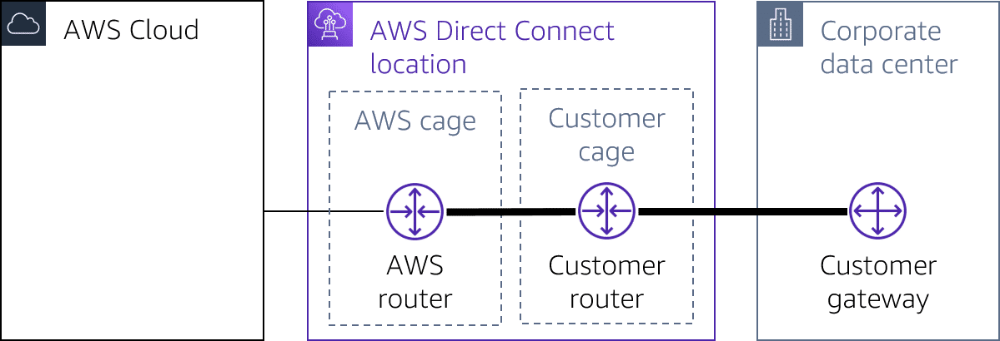

# Overview
+ AWS Direct Connect links your internal network to an AWS Direct Connect location over a standard Ethernet fiber-optic cable.
+ One end of the cable is connected to your router, the other to an AWS Direct Connect router.
+ With this connection, you can create *virtual interfaces* directly to public AWS services (for example, to Amazon S3) or to Amazon VPC, bypassing internet service providers in your network path.
    
+ An AWS Direct Connect location **provides access to AWS in the Region with which it is associated**.
+ Direct Connect provides a private, reliable connection to AWS from your physical facility, such as a data center or office.
+ When choosing to implement a Direct Connect connection, you should first consider bandwidth, connection type, protocol configurations, and other network configuration specifications.
+ First, note that Direct Connect only supports 802.1Q encapsulation. All equipment that will be part of the physical connection linking your location with AWS must support 802.1Q encapsulation.
+ Next, one of the first and possibly most influential decisions you will make is the form you want your connection to take. AWS provides its customers with three choices. A dedicated connection collocated at a Direct Connect location. Contracting with a Direct Connect Partner. Connecting directly to a Direct Connect node.
    + Option one, collocating at a Direct Connect location AWS has partnered with companies around the world to offer physical uplinks to AWS through the Direct Connect service. Typically, you select a Direct Connect location best suited for your needs by talking with the Direct Connect Partners near you. When you have selected the Direct Connect location you want to use, you deploy a router and supporting equipment to that location. The equipment you deploy will be the physical connection between your on-premises location and the AWS router at the Direct Connect location. You are responsible for three things. The deployed equipment, the circuit that will connect your on-premises location to the deployed equipment, and the connection from the deployed equipment to the AWS router.
    + The second option is to contract with a Direct Connect Partner who already has equipment at the Direct Connect location. If you choose this option, the Direct Connect Partner will provide you with the necessary equipment at the Direct Connect location that will connect to the AWS router. In most cases, you will need to provide the physical connection between your on-premises location and the Direct Connect Partner equipment. But the Direct Connect Partner will configure and maintain the physical equipment at the Direct Connect location.
    + The third and final option is to reach an agreement with AWS to make a direct physical connection from your on-premises location to a Direct Connect node. When you do this, you are responsible for all the equipment from the node to your location. Speak with your AWS representative for more information if you are interested in this option. For this scenario, we will use contracting with a Direct Connect Partner.
+ AWS supports three types of Ethernet connections. one gigabit per second, 10 gigabits per second, and 100 gigabits per second.
    + Regardless of the speed of your connection, they must all be single-mode fiber. 
    + Each one gigabit connection will require a 1,310-nanometer 1000BASE-LX transceiver.
    + Each 10-gigabit connection will require a 1,310-nanometer 10-gigabit BASE-LR transceiver.
    + Each 100-gigabit connection will require a 100-gigabit BASE-LR4 transceiver.
+ Next, for this scenario, we will use a single 10-gigabit connection. The router that will connect to the AWS router must support Border Gateway Protocol, or BGP, and Border Gateway Protocol MD5 authentication.
+ BGP requires an Autonomous System Number, or ASN. ASNs can be public or private. Private ASNs can be self-determined. Public ASNs must be purchased and registered. Your choice of private or public ASN will determine which type of virtual interface you can use later. Private virtual interfaces require a private ASN and public virtual interfaces require a public ASN.
+ Direct Connect supports IPv4 and IPv6. You will need to choose which IP protocol your connection requires. IPv4, IPv6, or both. 
+ Direct Connect virtual interfaces support a default Ethernet frame size of 1522 bytes and a jumbo Ethernet frame size of 9023 bytes. Ensure that all the equipment you will use to connect your on-premises location to your AWS environment supports the Ethernet frame size you want to implement. 
+ Next, it's time to create a standalone connection by logging in to the console using your account. Go to the Direct Connect dashboard and begin to configure the Direct Connect connection. When you have configured your connection, AWS will provide you with a Letter of Authorization and Connecting Facility Assignment, or LOA-CFA. You will share your LOA-CFA with your Direct Connect Partner, showing them that AWS has authorized the completion of the last physical step for your Direct Connect connection.
+ After they receive the LOA-CFA, your Direct Connect Partner will physically complete the connection between your router and the AWS router with a cross connect. The next step in the process is to configure the virtual interface for your Direct Connect connection. AWS supports three types of virtual interfaces. Private, public, and transit.
+ The next step in the process is to configure the virtual interface for your Direct Connect connection. AWS supports three types of virtual interfaces. Private, public, and transit.
+ The choices you made earlier for a public or private BGP and ASN will determine which of the three interfaces are available to you at this time. Choosing a private virtual interface lets you connect to all virtual private cloud, or VPC, resources within the private IP space in your AWS environment. Connect a single private virtual interface to multiple VPCs through private gateways within an AWS Region by associating it with your Direct Connect gateway.
+ Choosing a public virtual interface lets you route traffic to all VPC resources with a public IP address or that are connected to an AWS public endpoint. If you connect a public virtual interface to a Direct Connect location, you can connect to all public global AWS IP addresses and access AWS global IP route tables.
+ Choosing a transit virtual interface lets you connect your Direct Connect connection to AWS Transit Gateway. Then you can use the power of the AWS Transit Gateway and the AWS Transit Gateway Network Manager to manage the traffic moving between your AWS environment and your physical location. A transit virtual interface supports connecting three transit gateways to your Direct Connect gateway. Each connected transit gateway can connect to multiple VPCs within the same Region, even if they belong to different accounts
+ Direct Connect offers physical connections of 1, 10, and 100 Gbps to support your private connectivity needs to the cloud. Direct Connect supports the Link Aggregation Control Protocol (LACP), facilitating multiple dedicated physical connections to be grouped into link aggregation groups (LAGs). When you group connections into LAGs, you can stream the multiple connections as a single, managed connection. 
    + All connections in the LAG must use the same bandwidth.
    + You can have a maximum of two 100-Gbps connections in a LAG, or four connections with a port speed less than 100 Gbps. Each connection in the LAG counts toward your overall connection limit for the Region.
    + All connections in the LAG must terminate at the same Direct Connect endpoint.
+ Direct Connect has two billing elements: port hours and outbound data transfer. Port hour pricing is determined by connection type (dedicated connection or hosted connection) and capacity. Data transfer out over Direct Connect is charged per GB. 
+ Co-locating
 
+ Contracting with a Partner
+ 
# AWS Direct Connect components
+ **Connections**
    + Create a *connection* in an AWS Direct Connect location to** establish a network connection from your premises to an AWS Region**.
+ **Virtual interfaces**
    + Create a *virtual interface* to enable access to AWS services.+ A public virtual interface enables access to public services, such as Amazon S3.+ A private virtual interface enables access to your VPC. 
# Reference
[AWS Direct Connect](https://docs.aws.amazon.com/directconnect/latest/UserGuide/Welcome.html)
