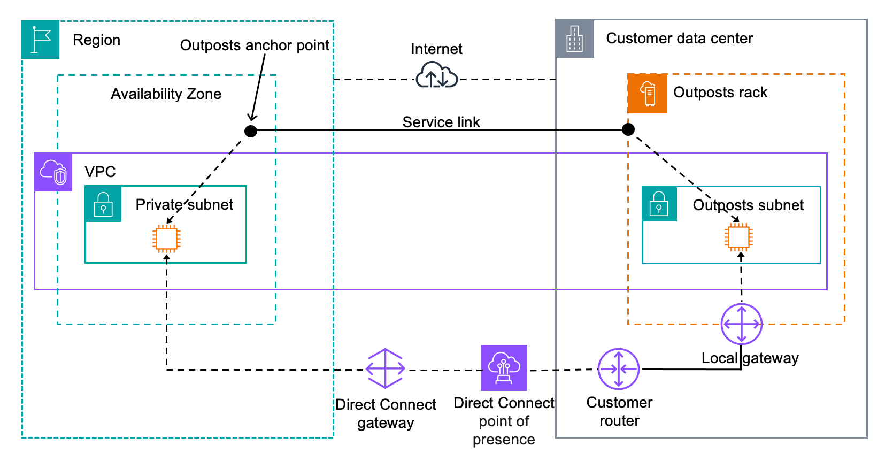
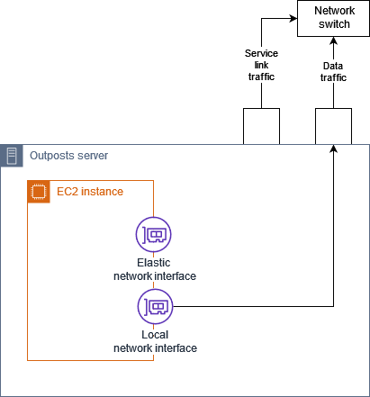

# AWS Outposts
+ AWS Outposts is a fully managed service that **extends** AWS infrastructure, services, APIs, and tools **to customer premises**.
+ By providing local access to AWS managed infrastructure, AWS Outposts **enables customers to build and run applications on premises using the same programming interfaces as in AWS Regions**, while using local compute and storage resources for **lower latency and local data processing needs**.
+ An Outpost is **a pool of AWS compute and storage capacity deployed at a customer site**.
+ AWS operates, monitors, and manages this capacity as part of an AWS Region.
+ You can create subnets on your Outpost and specify them when you create AWS resources such as **EC2 instances, EBS volumes, ECS clusters, and RDS instances**.
+ Instances in Outpost subnets communicate with other instances in the AWS Region using private IP addresses, all within the same VPC.
# Key concepts
+ Outpost site – The customer-managed physical buildings where AWS will install your Outpost. A site must meet the facility, networking, and power requirements for your Outpost.
+ Outpost capacity – Compute and storage resources available on the Outpost. You can view and manage the capacity for your Outpost from the AWS Outposts console.
+ Outpost equipment – Physical hardware that provides access to the AWS Outposts service. The hardware includes racks, servers, switches, and cabling owned and managed by AWS.
+ Outposts racks – An Outpost form factor that is an industry-standard 42U rack. Outpost racks include rack-mountable servers, switches, a network patch panel, a power shelf and blank panels.
+ Outposts servers – An Outpost form factor that is an industry-standard 1U or 2U server, which can be installed in a standard EIA-310D 19 compliant 4 post rack. Outpost servers provide local compute and networking services to sites that have limited space or smaller capacity requirements.
+ Service link – Network route that enables communication between your Outpost and its associated AWS Region. Each Outpost is an extension of an Availability Zone and its associated Region.
+ Local gateway – A logical interconnect virtual router that enables communication between an Outpost rack and your on-premises network.
+ Local network interface – A network interface that enables communication from an Outpost server and your on-premises network.
# AWS resources on Outposts
    | Resource type	| Racks	| Servers |
    | --- | --- | --- |
    | Amazon EC2 instances | Yes | Yes |
    | Amazon ECS clusters | Yes | Yes | 
    | Amazon EKS nodes | Yes | No | 
    | Amazon ElastiCache nodes (Redis cluster, Memcached cluster) |  Yes | No | 
    | Amazon EMR clusters | Yes | No | 
    | Amazon RDS DB instances | Yes | No | 
    | App Mesh Envoy proxy | Yes | Yes |
    | Application Load Balancers | Yes | No | 
    | Amazon VPC subnets | Yes | Yes |
    | Amazon Route 53 | Yes | No | 
    | Amazon EBS volumes | Yes | No | 
    | Amazon S3 buckets | Yes | No | 
    | AWS IoT Greengrass | Yes | Yes |
    | Amazon SageMaker Edge Manager | Yes | Yes |
# How AWS Outposts works
+ AWS Outposts is **designed to operate with a constant and consistent connection between your Outpost and an AWS Region**. 
+ To achieve this connection to the Region, and to the local workloads in your on-premises environment, you must **connect your Outpost to your on-premises network**. 
+ Your on-premises network must provide wide area network (WAN) access back to the Region and to the internet. It must also provide LAN or WAN access to the local network where your on-premises workloads or applications reside.
# Network components
+ AWS Outposts extends an Amazon VPC from an AWS Region to an Outpost with the VPC components that are accessible in the Region, including internet gateways, virtual private gateways, Amazon VPC Transit Gateways, and VPC endpoints.
+ An Outpost is homed to an Availability Zone in the Region and is an extension of that Availability Zone that you can use for resiliency.
+ The following diagram shows the network components for your Outpost.
    + An AWS Region and an on-premises network
    + A VPC with multiple subnets in the Region
    + An Outpost in the on-premises network
    + Connectivity between the Outpost and local network provided by either a local gateway (racks) or a local network interface (servers)

# VPCs and subnets
+ A virtual private cloud (VPC) spans all Availability Zones in its AWS Region. You can extend any VPC in the Region to your Outpost by **adding an Outpost subnet**.
+ To add an Outpost subnet to a VPC, **specify the Amazon Resource Name (ARN) of the Outpost** when you create the subnet.
+ Outposts **support multiple subnets**. You can specify the EC2 instance subnet when you launch the EC2 instance in your Outpost
+ You **cannot specify the underlying hardware** where the instance is deployed, because the Outpost is a pool of AWS compute and storage capacity.
+ Each Outpost can **support multiple VPCs** that can have one or more Outpost subnets.
+ You create Outpost subnets from the VPC CIDR range of the VPC where you created the Outpost. You can use the Outpost address ranges for resources, such as EC2 instances that reside in the Outpost subnet.
# Routing
+ By default, every Outpost subnet inherits the main route table from its VPC. You can create a custom route table and associate it with an Outpost subnet.
+ The route tables for Outpost subnets **work as they do for Availability Zone subnets**. You can specify IP addresses, internet gateways, local gateways, virtual private gateways, and peering connections as destinations
+ Outpost subnet route tables can include the following destinations:
    + VPC CIDR range – AWS defines this at installation. This is the local route and applies to all VPC routing, including traffic between Outpost instances in the same VPC.
    + AWS Region destinations – This includes prefix lists for Amazon Simple Storage Service (Amazon S3), Amazon DynamoDB gateway endpoint, AWS Transit Gateways, virtual private gateways, internet gateways, and VPC peering.
    + Intra-VPC communication across Outposts with local gateway – You can establish communication between subnets **in the same VPC across different Outposts** with local gateways using direct VPC routing.
# DNS
+ For network interfaces connected to a VPC, EC2 instances in Outposts subnets can use the Amazon Route 53 DNS Service to resolve domain names to IP addresses.
# Service link
+ The service link is a connection from your Outpost back to your chosen AWS Region or Outposts home Region.
+ The service link is an encrypted set of VPN connections that are used whenever the Outpost communicates with your chosen home Region. 
+ The service link VLAN enables communication **between the Outpost and the AWS Region for both management of the Outpost and intra-VPC traffic between the AWS Region and Outpost**.
+ To set up the service link connectivity, you or AWS must configure the service link physical, virtual LAN (VLAN), and network layer connectivity with your local network devices during the Outpost provisioning.
+ The service link is used for the following traffic:
    + Customer VPC traffic between the Outpost and any associated VPCs.
    + Outposts management traffic, such as resource management, resource monitoring and firmware and software updates.
# Local gateways
+ Outpost racks include a local gateway to **provide connectivity to your on-premises network**.
+ If you have an Outpost rack, you can include a local gateway as target where the destination is your on-premises network.
+ Local gateways are **only available for Outpost racks** and can only be used in VPC and subnet route tables that are associated with an Outpost rack.
+ **Each Outpost supports a single local gateway**. A local gateway has the following components:
    + Route tables – You use to create local gateway route tables.
    + CoIP pools – (Optional) You can use IP address ranges that you own to facilitate communication between the on-premises network and instances in your VPC.
    + Virtual interfaces (VIFs) – AWS creates one VIF for each LAG and adds both VIFs to a VIF group. The local gateway route table must have a default route to the two VIFs for local network connectivity.
    + VIF group associations – AWS adds the VIFs it creates to a VIF group. VIF groups are logical groupings of VIFs.
    + VPC associations – You use to create VPC associations with your VPCs and the local gateway route table. VPC route tables associated with subnets that reside on an Outpost can use the local gateway as a route target.
+ When AWS provisions your Outpost rack, we create some components and you are responsible for creating others.
    + AWS responsibilities
        + Delivers the hardware.
        + Creates the local gateway.
        +Creates the virtual interfaces (VIFs) and a VIF group.
    + Your responsibilities
        + Create the local gateway route table.
        + Associate a VPC with the local gateway route table.
        + Associate a VIF group with the local gateway route table.
+ The instances in your Outpost subnet can use one of the following options for communication with your on-premises network through the local gateway:
    + Private IP addresses – The local gateway uses the private IP addresses of instances in your Outpost subnet to facilitate communication with your on-premises network. This is the default.
    + Customer-owned IP addresses – The local gateway performs network address translation (NAT) for the customer-owned IP addresses that you assign to the instances in the Outpost subnet. This option supports overlapping CIDR ranges and other network topologies.

# Local network interfaces
+  **Outpost servers** include a local network interface to **provide connectivity to your on-premises network**.
+ A local network interface is **available only for Outposts servers** running on an Outpost subnet. You cannot use a local network interface from an EC2 instance on an Outpost rack or in the AWS Region.
+ The local network interface is **meant only for on-premises locations**
+ A local network interface **runs directly on your local area network**.
+ With this type of local connectivity, you **don't need routers or gateways to communicate with your on-premises equipment**. Local network interfaces are named similarly to network interfaces or elastic network interfaces. We distinguish between the two interfaces by always using local when we refer to local network interfaces.
+ After you enable local network interfaces on an Outpost subnet, you can configure the EC2 instances in the Outpost subnet to include a local network interface in addition to the elastic network interface. The local network interface connects to the on-premises network while the network interface connects to the VPC. The following diagram shows an EC2 instance on an Outposts server with both an elastic network interface and a local network interface.

# Reference
+ [AWS Outposts racks ](https://docs.aws.amazon.com/outposts/latest/userguide/what-is-outposts.html)
+ [AWS Outposts servers](https://docs.aws.amazon.com/outposts/latest/server-userguide/what-is-outposts.html)