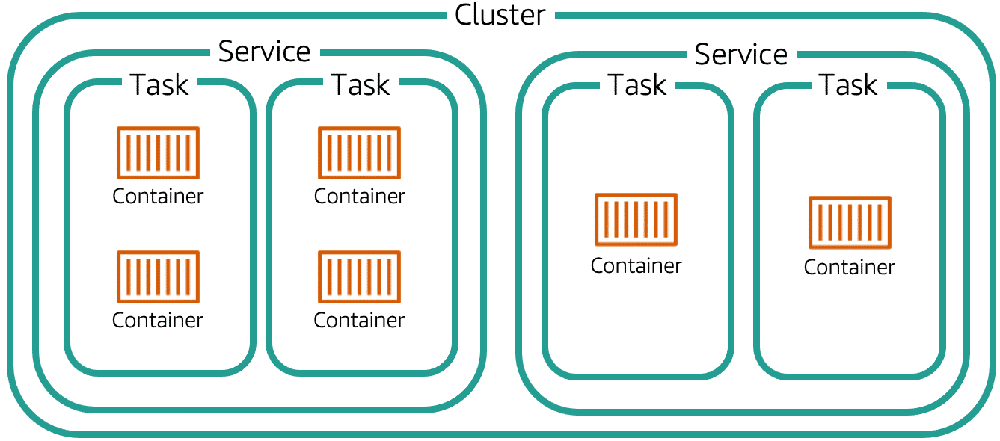
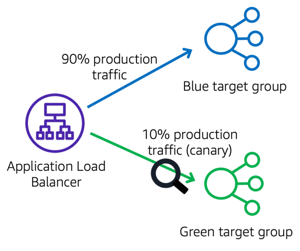
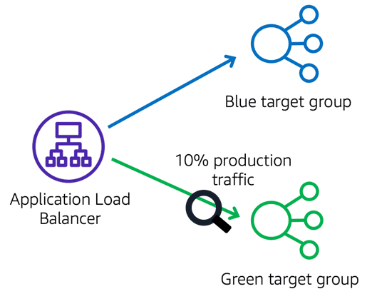
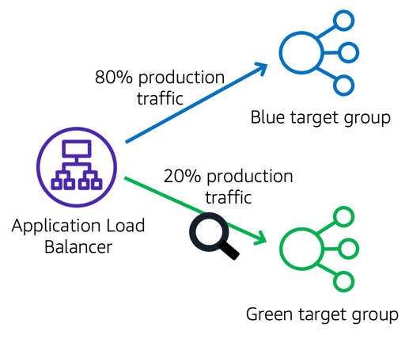
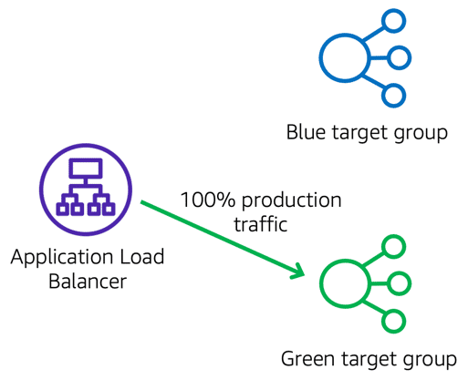
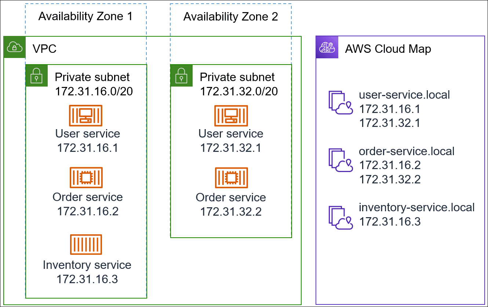
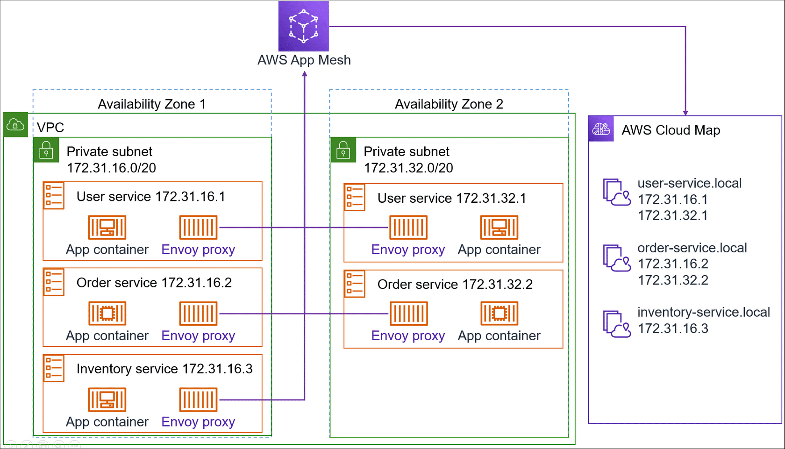

# Overview
+ Amazon ECS is a **regional service** that simplifies **running containers** in a highly available manner **across multiple Availability Zones within a Region**. 
+ Amazon ECS enables you to launch and stop your container-based applications by using simple API calls
+ You can create Amazon ECS clusters within a new or existing VPC. After a cluster is up and running, you can create task definitions that define which container images run across your clusters. Your task definitions are used to run tasks or create services. Container images are stored in and pulled from container registries

# Features of Amazon ECS

## Containers and images
+ To deploy applications on Amazon ECS, your **application components must be architected to run in containers**. A container is a standardized unit of software development that **contains everything that your software application needs to run,** including relevant code, runtime, system tools, and system libraries. Containers are created from a read-only template called an *image*.
+ Images are typically built from a Dockerfile, which is a plaintext file that specifies all of the components that are included in the container. After being built, these images are stored in a *registry* where they then can be downloaded and run on your cluster. 
## Task definitions
+ To prepare your application to run on Amazon ECS, you must create a *task definition*.
+ The task definition is a text file (in **JSON** format) that describes one or more containers (up to a maximum of ten) that form your application.
+ The task definition can be thought of as a blueprint for your application. It specifies various parameters for your application. 
## Tasks and scheduling
+ A *task* is the instantiation of a task definition within a cluster. After you have created a task definition for your application within Amazon ECS, you can specify the number of tasks to run on your cluster.
+ The Amazon ECS task scheduler is responsible for placing tasks within your cluster. There are several different scheduling options available.
## Clusters
+ An Amazon ECS *cluster* is a **logical grouping of tasks or services.** You can register one or more Amazon EC2 instances (also referred to as *container instances*) with your cluster to run tasks, Or, you can use the serverless infrastructure that Fargate provides to run tasks. 
## Container agent
+ The *container agent* runs on each container instance within an Amazon ECS cluster. The agent sends information about the resource's current running tasks and resource utilization to Amazon ECS. It starts and stops tasks whenever it receives a request from Amazon ECS.
# application infrastructure
## Compute infrastructure 
+ Fargate is a serverless compute engine you can use for your Amazon ECS containers. You might want to use Fargate or Fargate Spot for the following reasons:
    + Fargate has few management requirements and handles security, patches, and updates. 
    + Fargate can scale to a greater degree of precision to prevent paying for unneeded capacity.
    + With Fargate, you only pay for the time your containers are running.
+ When running ECS containers on Amazon EC2 instances, you pay only for the underlying compute services, the EC2 instances. Though you take on the overhead of managing these instances, you might be able to realize cost savings using Reserved Instances and Spot Instances. Consider Amazon EC2 for the following use cases:
    + Long-running and computationally demanding workloads
    + Workloads with predictable utilization
    + Workloads not supported by Fargate
+ With Amazon ECS Anywhere you can also run container workloads on your own infrastructure. You get the same cluster management, workload scheduling, and monitoring on premises as you do in the cloud.
    + Use cases: 
    + Your workloads must reside in your data centers for compliance requirements.
    + You require low latency access to resources in your on-premises environment
    + You have already made investments into on-premises infrastructure.
## Network infrastructure
+ VPC
    + Amazon ECS offers three networking modes. Note that the AWS Fargate compute infrastructure only supports the awsvpc networking mode.  
    + awsvpc mode (Fargate and Amazon EC2): With the awsvpc network mode, Amazon ECS creates and manages an elastic network interface for each task. And each task receives its own private IP address within the virtual private cloud (VPC). This network interface is separate from the underlying host's network interface.
    + Host mode (Amazon EC2 only): Using host mode, the networking of the container is tied directly to the underlying host that's running the container.
    + Bridge mode (Amazon EC2 only): With bridge mode, you're using a virtual network bridge to create a layer between the host and the networking of the container. This way, you can create port mappings that remap a host port to a container port.  
+ Subnets
    + When planning your subnets, note which services will run in the private and public subnets. Be aware of which subnets you will need to connect to different gateways to allow inbound and outbound traffic.
+ Elastic Load Balancing
    + Application Load Balancer: The Application Load Balancer operates at the application layer (L7) and routes HTTP and HTTPS traffic using host-based or path-based rules. You will need to configure two listeners to access two separate ports for HTTP (port 80) and HTTPS (port 443).
    + Network Load Balancer: The Network Load Balancer operates at the network layer (L4) and routes TCP/TLS traffic.
+ VPC Endpoints and Gateways 
    + Some of your services might require you to allow traffic to and from your VPC. 
    + A VPC endpoint permits private connections between your VPC and supported Amazon Web Services (AWS) services. Traffic between your VPC and the other service doesn't leave the Amazon network.
    + You can use a NAT gateway so that instances in a private subnet can connect to services outside your VPC but external services cannot initiate a connection with those instances.
    + Front-end services require an internet gateway, which routes external traffic from the internet to a public subnet.
## Pipeline infrastructure
+ AWS CloudFormation
+ AWS Cloud Development Kit (AWS CDK) is a software development framework that defines your cloud application resources using a declarative model and familiar programming languages.
+ AWS Copilot is a command line interface (CLI) for launching and managing containerized applications, automating deployment pipelines, and deploying application infrastructure using service patterns.
    + AWS Copilot is also a good option for organizations that are looking for a unified solution that can:
        + Build container images
        + Create environments
        + Provision infrastructure
        + Deploy containerized applications
        + Monitor running services
        + AWS Copilot only deploys to clusters backed by Fargate, and is not the right tool for applications requiring an Amazon EC2 cluster infrastructure.
    +  A pipeline built in AWS Copilot will automatically build your service code when you push to a GitHub, Bitbucket, or CodeCommit repository. AWS Copilot then uses this pipeline to deploy to your environments and run automated testing.
+ AWS Proton is a fully managed delivery service for containerized applications. It includes tools for infrastructure provisioning, code deployments, monitoring, and updates.
    + With AWS Proton, you can create infrastructure templates and then make them available to others in your organization. A centralized infrastructure team can use AWS Proton to create a stack that defines everything needed to provision, deploy, and monitor a service. This includes compute, networking, code pipeline, security, and monitoring. Developers can then access these published AWS Proton stacks to automate infrastructure provisioning and quickly deploy their application code.
    + Templates – Parameterized infrastructure as code and CI/CD pipeline templates that you deploy to create your environment and service infrastructures
    + Environment templates – Templates to create shared resources in which services can run, such as a VPC, cluster infrastructure, or load balancers
    + Service templates – Templates to create workloads running in an environment, such as an Amazon EC2 web service or a Fargate backend service
    + Service instance – An instantiation of a service inside of a deployed environment
    + AWS Proton is a good tool for organizations that want to control costs and enforce compliance by providing preconfigured infrastructure templates. Because you can distribute a library of templates to AWS Proton and vend them out to developers, AWS Proton is also useful in organizations that require a variety of infrastructure configurations.
+ AWS App2Container (A2C) is a command-line tool for converting .NET and Java applications into containerized applications.
# Clusters
+ An Amazon ECS cluster is **a logical grouping of tasks or services**.
+ Your tasks and services are run on infrastructure that is registered to a cluster.
+ The infrastructure capacity can be provided by **AWS Fargate**, which is serverless infrastructure that AWS manages, **Amazon EC2 instances** that you manage, or an **on-premise server or virtual machine (VM)** that you manage remotely.
+ you can create **multiple clusters** in an account to keep your resources separate
+ Clusters are **Region-specific**
+ A cluster may contain a mix of both Auto Scaling group capacity providers and Fargate capacity providers, however when specifying a capacity provider strategy they may only contain one or the other but not both.
+ For tasks using the EC2 launch type, clusters can contain multiple different container instance types, but **each container instance may only be registered to one cluster at a time.**
+ Custom IAM policies may be created to **allow or restrict user access to specific clusters**.
## Capacity providers
+ A *capacity provider* is **associated with a cluster** and is **used in a capacity provider strategy** to **determine the infrastructure** that a task runs on.
+ Amazon ECS capacity providers are used to **manage the infrastructure** the tasks in your clusters use.
+ Each cluster can have **one or more capacity providers** and an **optional default capacity provider strategy**.
+ The capacity provider strategy determines **how the tasks are spread across the cluster's capacity providers**.
+ When you run a standalone task or create a service, you may either use the cluster's default capacity provider strategy or specify a capacity provider strategy that overrides the cluster's default strategy.
+ A service using an Auto Scaling group capacity provider can't be updated to use a Fargate capacity provider and vice versa.
+ In a capacity provider strategy, **only one capacity provider can have a base value defined**. If no base value is specified, the default value of `0` is used.
+ A cluster may contain a mix of both Auto Scaling group capacity providers and Fargate capacity providers, however **a capacity provider strategy may only contain one or the other but not both**.
+ When you specify a capacity provider strategy, **the number of capacity providers** that can be specified is **limited to six**.
## Amazon ECS clusters in Local Zones, Wavelength Zones, and AWS Outposts
+ Amazon ECS supports workloads that take advantage of Local Zones, Wavelength Zones and AWS Outposts when low latency or local data processing requirements are needed. 
+ Local Zones have their own connections to the internet and support AWS Direct Connect, so resources created in a Local Zone can serve local users with low-latency communications.
+ *AWS Wavelength* allows developers to build applications that deliver ultra-low latencies to mobile devices and end users. 
+ Amazon ECS on AWS Outposts is ideal for low-latency workloads that need to be run in close proximity to on-premises data and application. 
# Task definitions
+ A task definition is required to run Docker containers in Amazon ECS.
+ You can define multiple containers in a task definition. 
+ The following are some of the parameters you can specify in a task definition: 
    + The Docker image to use with each container in your task
    + How much CPU and memory to use with each task or each container within a task
    + The launch type to use, which determines the infrastructure on which your tasks are hosted
    + The Docker networking mode to use for the containers in your task
    + The logging configuration to use for your tasks
    + Whether the task should continue to run if the container finishes or fails
    + The command the container should run when it is started
    + Any data volumes that should be used with the containers in the task
    + The IAM role that your tasks should use
## Application architecture
+ How you architect your application on Amazon ECS depends on several factors, with the **launch type** you are using being a key differentiator. 
+ Fargate launch type 
    + the main question is when should you put multiple containers into the same task definition versus deploying containers separately in multiple task definitions.
    + When the following conditions are required, we recommend that you deploy your containers in a single task definition:
        + Your containers share a common lifecycle (that is, they are launched and terminated together). 
        + Your containers must run on the same underlying host (that is, one container references the other on a localhost port).
        + You require that your containers share resources.
        + Your containers share data volumes.
    + Otherwise, you should define your containers in separate tasks definitions so that you can scale, provision, and deprovision them separately.
+ EC2 launch type 
    + think about what processes need to run together and how to scale each component.
## Task definition parameters
+ Task definitions are split into separate parts: the task family, the IAM task role, the network mode, container definitions, volumes, task placement constraints, and launch types.
+ The **family and container definitions** are required in a task definition, while task role, network mode, volumes, task placement constraints, and launch type are optional.
## Using data volumes in tasks
+ Amazon EFS volumes — Provides simple, scalable, and persistent file storage for use with your Amazon ECS tasks. With Amazon EFS, storage capacity is elastic, growing and shrinking automatically as you add and remove files. Your applications can have the storage they need, when they need it. Amazon EFS volumes are supported for tasks hosted on Fargate or Amazon EC2 instances. 
+ Amazon FSx for Windows File Server volumes — Provides fully managed Microsoft Windows file servers, that are backed by a fully native Windows file system. When using Amazon FSx for Windows File Server together with Amazon ECS, you can provision your Windows tasks with persistent, distributed, shared, static file storage.
+ Docker volumes — A Docker-managed volume that is created under `/var/lib/docker/volumes` on the host Amazon EC2 instance. Docker volume drivers (also referred to as plugins) are used to integrate the volumes with external storage systems, such as Amazon EBS. The built-in `local` volume driver or a third-party volume driver can be used. Docker volumes are **only supported when running tasks on Amazon EC2 instances**. Windows containers only support the use of the `local` driver. To use Docker volumes, specify a `dockerVolumeConfiguration` in your task definition.
+ Bind mounts — A file or directory on the host, such as an Amazon EC2 instance or AWS Fargate, is mounted into a container. Bind mount host volumes are supported for **tasks hosted on Fargate or Amazon EC2 instances**. 
## Managing container swap space
+ Amazon ECS enables you to control the usage of swap memory space on your Linux container instances at the **container level**. 
+ **latency-critical containers can have swap disabled**, whereas containers with high transient memory demands can have swap turned on to **reduce the chances of out-of-memory errors** when the container is under load.
+ Swap space must be **enabled and allocated** on the container instance for the containers to use.
+ The swap space container definition parameters are only supported for task definitions using the **EC2 launch type**.
+ This feature is only supported for **Linux** containers.
+ If the `maxSwap` and `swappiness` container definition parameters are omitted from a task definition, each container will have a default `swappiness` value of `60` and the total swap usage will be limited to two times the memory reservation of the container.
## Amazon ECS task networking
+ The networking behavior of Amazon ECS tasks hosted on Amazon EC2 instances is dependent on the *network mode* defined in the task definition. 
+ `awsvpc` — The task is allocated its own elastic network interface (ENI) and a primary private IPv4 address. This gives the task the same networking properties as Amazon EC2 instances.
+ `bridge` — The task utilizes Docker's built-in virtual network which runs inside each Amazon EC2 instance hosting the task.
+ `host` — The task bypasses Docker's built-in virtual network and maps container ports directly to the ENI of the Amazon EC2 instance hosting the task. As a result, you can't run multiple instantiations of the same task on a single Amazon EC2 instance when port mappings are used.
+ `none` — The task has no external network connectivity.
+ Amazon ECS recommends using the `awsvpc` network mode unless you have a specific need to use a different network mode
## Private registry authentication for tasks
+ Private registry authentication for tasks using **AWS Secrets Manager** enables you to store your credentials securely and then reference them in your container definition.
+ This allows your tasks to **use images from private repositories**.
+ This feature is supported by tasks using both the **Fargate or EC2** launch types.
## Specifying sensitive data
+ Amazon ECS enables you to inject sensitive data into your containers by storing your sensitive data in either **AWS Secrets Manager secrets or AWS Systems Manager Parameter Store** parameters and then referencing them in your container definition.
+ Secrets can be exposed to a container in the following ways: 
    + To inject sensitive data into your containers as **environment variables**, use the `secrets` container definition parameter.
    + To reference sensitive information in the **log configuration** of a container, use the `secretOptions` container definition parameter.
# AWS Fargate
+ AWS Fargate is a technology that you can use with Amazon ECS to **run containers without having to manage servers or clusters of Amazon EC2 instances.**
+ With AWS Fargate, you no longer have to provision, configure, or scale clusters of virtual machines to run containers.
+ When you run your tasks and services with the Fargate launch type: 
    + package your application in containers,
    + specify the CPU and memory requirements,
    + define networking and IAM policies,
    + and launch the application.
+ Each Fargate task has its own **isolation boundary** and does not share the underlying kernel, CPU resources, memory resources, or elastic network interface with another task.
+ Amazon ECS task definitions for Fargate require that the **network mode is set to `awsvpc`**.
+ There is an optional **task execution IAM role** that you can specify with Fargate to allow your Fargate tasks to **make API calls to Amazon ECR**.
+ Amazon ECS capacity providers enable you to use both **Fargate and Fargate Spot** capacity with your Amazon ECS tasks.
# Amazon ECS container agent
+ The Amazon ECS container agent allows **container instances to connect to your cluster**.
+ The Amazon ECS container agent is included in the Amazon ECS-optimized AMIs, but you can also install it on any Amazon EC2 instance that supports the Amazon ECS specification.
+ The Amazon ECS container agent supports a number of **configuration options**, most of which should be **set through environment variables**. 
+ By default, the Amazon ECS container agent automatically **cleans up stopped tasks and Docker images** that are not being used by any tasks on your container instances.
+ The Amazon ECS container agent provides an API operation for gathering details about the container instance on which the agent is running and the associated tasks running on that instance. 
+ curl -s http://localhost:51678/v1/metadata | python -mjson.tool+ curl http://localhost:51678/v1/tasks+ curl http://localhost:51678/v1/tasks?dockerid=79c796ed2a7f
+ You can configure your Amazon ECS container instances to use an **HTTP proxy for both the Amazon ECS container agent and the Docker daemon**. This is useful if your container instances do not have external network access through an Amazon VPC internet gateway, NAT gateway, or instance.
# Scheduling Amazon ECS tasks
+ The service scheduler is ideally suited for long running stateless services and applications.
+ The service scheduler ensures that the scheduling strategy you specify is followed and reschedules tasks when a task fails 
+ There are two service scheduler strategies available: 
    + `REPLICA`—The replica scheduling strategy **places and maintains the desired number of tasks across your cluster**. By default, the service scheduler spreads tasks **across Availability Zones.** You can use task placement strategies and constraints to customize task placement decisions. 
    + `DAEMON`—The daemon scheduling strategy deploys **exactly one task on each active container instance** that meets all of the task placement constraints that you specify in your cluster. The service scheduler evaluates the task placement constraints for running tasks and will stop tasks that do not meet the placement constraints. When using this strategy, there is no need to specify a desired number of tasks, a task placement strategy, or use Service Auto Scaling policies.
+ Amazon ECS allows you to **create your own schedulers** that meet the needs of your business, or to leverage third party schedulers
+ Task lifecycle：

## Amazon ECS task placement
+ A *task placement strategy* is an **algorithm for selecting instances for task placement or tasks for termination**. You can apply **task placement strategies** and constraints to customize how Amazon ECS **places and terminates tasks**. 
    + `binpack`--Tasks are placed on container instances so as to **leave the least amount of unused CPU or memory**. This strategy **minimizes the number of container instances** in use. When this strategy is used and a scale-in action is taken, Amazon ECS will terminate tasks based on the amount of resources that will be left on the container instance after the task is terminated. The container instance that will **have the most available resources left** after task termination will have that **task terminated**.
    + `random`--Tasks are placed randomly.
    + `spread`--Tasks are placed **evenly based on the specified value**. Accepted values are `instanceId` (or `host`, which has the same effect), or any platform or custom attribute that is applied to a container instance, such as `attribute:ecs.availability-zone`. Service tasks are spread based on the tasks from that service. Standalone tasks are spread based on the tasks from the same task group. When this strategy is used and a scale-in action is taken, Amazon ECS will select tasks to terminate that maintains a balance across Availability Zones. Within an Availability Zone, tasks will be selected at random.
+ A *task placement constraint* is a **rule that is considered during task placement.**
    + `distinctInstance`--Place **each task on a different container instance**. This task placement constraint can be specified when either running a task or creating a new service.
    + `memberOf`--Place tasks on container instances that **satisfy an expression**. 
+ Task placement strategies and constraints are **not supported for tasks using the Fargate launch type**. By default, Fargate tasks are spread across Availability Zones
+ When Amazon ECS places tasks, it uses the following process to select container instances: 
    + Identify the instances that satisfy the CPU, memory, and port requirements in the task definition.
    + Identify the instances that satisfy the task placement constraints.
    + Identify the instances that satisfy the task placement strategies.
    + Select the instances for task placement.
+ Cluster queries are expressions that enable you to group objects, you can customize Amazon ECS to place tasks on container instances based on group
## Scheduled tasks
+ Amazon ECS supports creating scheduled tasks.
+ Scheduled tasks use **Amazon EventBridge rules** to run tasks either **on a schedule** or in a **response to an EventBridge event**.
# Amazon ECS services
+ An Amazon ECS service allows you to run and maintain a specified number of instances of a task definition simultaneously in an Amazon ECS cluster.
+ In addition to maintaining the desired number of tasks in your service, you can optionally run your service behind a load balancer.
## Amazon ECS Deployment types
+ An Amazon ECS deployment type determines the deployment strategy that your service uses.
+ There are three deployment types: rolling update, blue/green, and external.
+ When the *rolling update* (`ECS`) deployment type is used for your service, when a new service deployment is started the Amazon ECS service scheduler **replaces the currently running tasks with new tasks**. The **number of tasks that Amazon ECS adds or removes** from the service during a rolling update is controlled by the **deployment configuration**. 
    + The `minimumHealthyPercent` represents the **lower limit on the number of tasks that should be running** for a service during a deployment or when a container instance is draining, as a percent of the desired number of tasks for the service.
    + The `maximumPercent` represents the **upper limit on the number of tasks that should be running** for a service during a deployment or when a container instance is draining, as a percent of the desired number of tasks for a service
+ The *blue/green* deployment type uses the blue/green deployment model controlled by CodeDeploy. This deployment type enables you to verify a new deployment of a service before sending production traffic to it.
    + **Canary** — Traffic is shifted in **two increments**. 
        + 1. When you begin, all production traffic is going to the blue target group.

        
        + 2. CodeDeploy shifts 10 percent of your traffic, the canary deployment, to the green target group. It waits 15 minutes while tests verify the canary traffic.

        
        + 3. CodeDeploy shifts the remaining 90 percent of your traffic to the green target group.

        
    + **Linear** — Traffic is shifted in **equal increments** with an equal number of minutes between each increment. 
        + 1. When you begin, all production traffic is going to the blue target group.

        
        + 2. CodeDeploy shifts 10 percent of your traffic to the green target group. It then waits three minutes while tests verify traffic to the green target group.

        
        + 3. CodeDeploy shifts another 10 percent of your traffic to the green target group. It then waits three minutes while tests verify traffic to the green target group.

        
        + 4. CodeDeploy continues increasing production traffic to the green target group by increments of 10 percent, waiting three minutes between each increase, until all traffic is routed to the green target group.

        
    + **All-at-once** — All traffic is shifted from the original task set to the updated task set all at once.
+ The *external* deployment type enables you to use any **third-party deployment controller** for full control over the deployment process for an Amazon ECS service. The details for your service are managed by either the **service management API actions or the task set management API actions**
## Service load balancing
+ Amazon ECS services hosted on **Amazon EC2 instances** support the **Application** Load Balancer, **Network** Load Balancer, and **Classic** Load Balancer load balancer types.
+ Amazon ECS services hosted on AWS Fargate support **Application** Load Balancer and **Network** Load Balancer only. 
+ Application Load Balancers offer several features that make them attractive for use with Amazon ECS services: 
    + Each service can **serve traffic from multiple load balancers** and expose multiple load balanced ports by specifying multiple target groups.
    + They are supported by tasks hosted on **both Fargate and EC2 instances**.
    + Application Load Balancers allow containers to use **dynamic host port mapping** (so that multiple tasks from the same service are allowed per container instance).
    + Application Load Balancers support **path-based routing and priority rules** (so that multiple services can use the same listener port on a single Application Load Balancer).
+ recommend that you use Application Load Balancers for your Amazon ECS services 
+ It is **not possible to update the load balancing configuration** of an existing service.
## Service Auto Scaling
+ *Automatic scaling* is the ability to increase or decrease the desired count of tasks in your Amazon ECS service automatically.
+ Amazon ECS leverages the Application Auto Scaling service to provide this functionality. 
+ Amazon ECS **publishes CloudWatch metrics** with your service’s average CPU and memory usage
+ Amazon ECS Service Auto Scaling supports the following types of automatic scaling: 
    + [Target Tracking Scaling Policies](https://docs.aws.amazon.com/AmazonECS/latest/developerguide/service-autoscaling-targettracking.html)—Increase or decrease the number of tasks that your service runs based on a target value for a specific metric. 
    + [Step Scaling Policies](https://docs.aws.amazon.com/AmazonECS/latest/developerguide/service-autoscaling-stepscaling.html)—Increase or decrease the number of tasks that your service runs based on a set of scaling adjustments, known as step adjustments, that vary based on the size of the alarm breach.
    + [Scheduled Scaling](https://docs.aws.amazon.com/autoscaling/application/userguide/application-auto-scaling-scheduled-scaling.html)—Increase or decrease the number of tasks that your service runs based on the date and time.
## Service discovery
+ Your Amazon ECS service can optionally be configured to use Amazon ECS Service Discovery. 
+ Service discovery uses AWS Cloud Map API actions to manage HTTP and DNS namespaces for your Amazon ECS services.
+ Service discovery consists of the following components: 
    + **Service discovery namespace：**A logical group of service discovery services that share the same domain name, such as `example.com`.
    + **Service discovery service：** Exists within the service discovery namespace and consists of the service name and DNS configuration for the namespace.
    + **Service discovery instance**: Exists within the service discovery service and consists of the attributes associated with each Amazon ECS service in the service directory.
    + **Amazon ECS health checks**: Amazon ECS performs periodic container-level health checks. 
# AWS Cloud Map
+ You can use the AWS Cloud Map service discovery integration with Amazon ECS.
+ Amazon ECS syncs the list of launched tasks to AWS Cloud Map.
+ AWS Cloud Map maintains a **Domain Name System (DNS) hostname that resolves to the internal IP addresses** of one or more tasks from that particular service.
+ Other services in the VPC can use this DNS hostname to send traffic directly to another container using its internal IP address.

+ Advantages:
    + Simplicity: No extra components are required between containers. Traffic travels directly from one container to the other container with low latency.
    + Compatibility: This configuration allows customers to bring their own load balancers.
    + Cost: This configuration can save money for internal-only services
+ Disadvantages:
    + This configuration requires client-side load balancing (in the absence of Elastic Load Balancing).
    + This configuration is only suitable when using the awsvpc network mode, where each task has its own unique IP address.
    + Your application needs to handle retries and have logic to ignore bad backends. DNS records have a time-to-live (TTL) period that controls how long they are cached for. It takes time for the DNS record to be updated and for the cache to expire. During that time, your application might resolve the DNS record to an address for a container that's no longer there.
# Service mesh
+ A service mesh helps you manage a large number of services and have better control of how traffic gets routed among services.
+ In a service mesh, applications don't directly interact with each other, but they don’t use a centralized load balancer either.
+ Instead, each copy of your task is accompanied by a **proxy sidecar**. Communication is routed through these proxies as a separate infrastructure layer. 

+ In this example, each task has an Envoy proxy sidecar. The sidecar is responsible for proxying all inbound and outbound traffic for the task.
+ The App Mesh control plane uses AWS Cloud Map to get the list of available services and the IP addresses of specific tasks.
+ Then App Mesh delivers the configuration to the Envoy proxy sidecar. The Envoy proxy also conducts health checks against each target to ensure that they're available.
+ Advantages:
    + Managed communication: A mesh combines the features of service discovery with the ease of a managed load balancer. 
    + Performance: There's only one instance-to-instance network jump, between one
    + Envoy proxy and another Envoy proxy, reducing latency and network overhead.
    + Efficiency: Applications don't implement as much load balancing logic within their code because the Envoy proxy sidecar handles that load balancing.
    + Reliability: The Envoy proxy can be configured to detect failures and retry failed requests.
    + Security: AppMesh supports Mutual Transport Layer Security (mTLS) to encrypt traffic in transit, and ensure that your applications are communicating to a verified destination.
    + Observability: AppMesh integrates with AWS X-Ray to manage your Envoy microservices.
+ Disadvantages:
    + You are responsible for deploying and managing the Envoy proxy sidecar, and for maintaining and updating the proxy when needed.
    + The Envoy proxy uses some of the CPU and memory that you allocate to the Amazon ECS task.
# Amazon ECS deployment circuit breaker
+ Breaking code changes and service configurations can cause your deployments to fail. It is important to discover these failures quickly and remediate them as fast as possible. To accomplish this, you can configure your services to use the Amazon ECS deployment circuit breaker to **automatically roll back failed deployments**. 
+ The Amazon ECS circuit breaker evaluates task launches until the deployment creates one of the following conditions:
    + Any one task reaches a RUNNING state and passes its health checks. At this point, the circuit breaker stops evaluating task launches.
    + The number of failed task launches reaches the failure threshold. At this point, the Amazon ECS circuit breaker moves the deployment into a FAILED state.
+  The failure threshold is one half of the desired task count with the following exceptions:
    + The minimum threshold is 10.
    + The maximum threshold is 200.
# Default CloudWatch metrics
+ Metrics are sent to CloudWatch by default when you are using Amazon ECS. 
+ Amazon ECS services running on Fargate are enabled for CloudWatch CPU and memory utilization metrics automatically. The Fargate container agent (which is the **Amazon ECS agent**, running on the underlying host) sends metrics to CloudWatch.
+ The Amazon ECS container agent sends metrics from container instances to CloudWatch. The container agent is included in the Amazon ECS optimized Amazon Machine Image (AMI), or it can be installed manually.
    + The following metrics are available by default at the **cluster level**:
        + CPU Utilization
        + Memory Utilization
        + CPU Reservation
        + Memory Reservation
        + GPU Reservation
    + If **Container Insights** is enabled, you can collect utilization metrics at the **task level** as well. You will learn more about these metrics in this lesson. 
## AWSLogs driver to CloudWatch Logs
+ You can set up the AWSLogs driver in your task definitions. This way, CloudWatch can gather information including CPU usage, memory usage, application stdout and stderr, healthcheck status, and container exit code.
+ You can configure the containers in your tasks to send application-level log information to CloudWatch Logs.
+ When using Fargate, the awslogs driver is available by default and easily configured. All you need to do is tell the agent where in CloudWatch to log to by adding the required logConfiguration parameters to your task definition. 
+ For tasks using the EC2 launch type, you need to set the correct permissions  to send logs to CloudWatch Logs, and configure the task to use the awslogs log driver.
## VPC Flow Logs
+ With VPC Flow Logs, you can capture information about the network traffic between network interfaces in your VPC. Flow log data can be published to CloudWatch Logs or Amazon S3. After you've created a flow log, you can retrieve and view its data in the chosen destination
+ By using VPC Flow Logs, you can collect logs at a granular level from the Elastic Network Interface (ENI), all the way up to the VPC level.
    + You can collect flow logs at the VPC level.
    + You can collect flow logs at the subnet level.
    + You can collect flow logs at the Elastic Network Interface (ENI) level.
# Reference
+ [Amazon ECS](https://docs.aws.amazon.com/AmazonECS/latest/developerguide/Welcome.html)
+ [Getting Started with Amazon Elastic Container Service](https://explore.skillbuilder.aws/learn/course/13597/play/60846/getting-started-with-amazon-elastic-container-service-v010100)
+ [Building Enterprise Architectures in Amazon ECS](https://explore.skillbuilder.aws/learn/course/8933/play/42603/building-enterprise-architectures-in-amazon-ecs)
+ [Managing the Application Lifecycle in Amazon ECS](https://explore.skillbuilder.aws/learn/course/9232/play/37935/managing-the-application-lifecycle-in-amazon-ecs)
+ [Managing Applications at Scale with Amazon ECS](https://explore.skillbuilder.aws/learn/course/10468/play/37554/managing-applications-at-scale-with-amazon-ecs)
+ [Observe, Troubleshoot, and Optimize Workloads Running on Amazon ECS](https://explore.skillbuilder.aws/learn/course/10467/play/37537/observe-troubleshoot-and-optimize-workloads-running-on-amazon-ecs)

