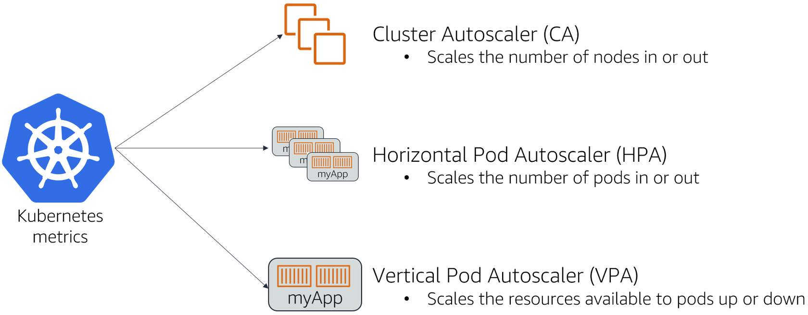

# Amazon Elastic Kubernetes Service (Amazon EKS)
+ Amazon Elastic Kubernetes Service (Amazon EKS) is a managed service that you can use to run Kubernetes on AWS without needing to install, operate, and maintain your own Kubernetes control plane or nodes.
+ Kubernetes is an open-source system for automating the deployment, scaling, and management of **containerized applications**. 
+ Getting started with Amazon EKS is easy: 
    + Create an Amazon EKS cluster in the AWS Management Console or with the AWS CLI or one of the AWS SDKs.
    + Launch managed or self-managed Amazon EC2 nodes, or deploy your workloads to AWS Fargate.
    + When your cluster is ready, you can configure your favorite Kubernetes tools, such as `kubectl`, to communicate with your cluster.
    + Deploy and manage workloads on your Amazon EKS cluster the same way that you would with any other Kubernetes environment. You can also view information about your workloads using the AWS Management Console.

# Features of Amazon EKS
+ Secure networking and authentication
    + Amazon EKS integrates your Kubernetes workloads with AWS networking and security services. It also integrates with AWS Identity and Access Management (IAM) to provide authentication for your Kubernetes clusters.
+ Easy cluster scaling
    + Amazon EKS enables you to scale your Kubernetes clusters up and down easily based on the demand of your workloads. Amazon EKS supports horizontal Pod autoscaling based on CPU or custom metrics, and cluster autoscaling based on the demand of the entire workload.
+ Managed Kubernetes experience
    + You can make changes to your Kubernetes clusters using eksctl, AWS Management Console, AWS Command Line Interface (AWS CLI), the API, kubectl, and Terraform.
+ High availability
    + Amazon EKS provides high availability for your control plane across multiple Availability Zones.
+ Integration with AWS services
    + Amazon EKS integrates with other AWS services, providing a comprehensive platform for deploying and managing your containerized applications. You can also more easily troubleshoot your Kubernetes workloads with various observability tools.
# Amazon EKS architecture
## Control plane
+ Amazon EKS ensures every cluster has its own unique Kubernetes control plane. This design keeps each cluster's infrastructure separate, with no overlaps between clusters or AWS accounts.
+ Distributed components
    + The control plane positions at least two API server instances and three etcd instances across three AWS Availability Zones within an AWS Region.
+ Optimal performance
    Amazon EKS actively monitors and adjusts control plane instances to maintain peak performance.
+ Resilience
    If a control plane instance falters, Amazon EKS quickly replaces it, using different Availability Zone if needed.
+ Consistent uptime
    By running clusters across multiple Availability Zones, a reliable API server endpoint availability Service Level Agreement (SLA) is achieved.
## Compute
+ In addition to the control plane, an Amazon EKS cluster has a set of worker machines called nodes. Selecting the appropriate Amazon EKS cluster node type is crucial for meeting your specific requirements and optimizing resource utilization.
+ Amazon EKS offers the following primary node types:
    + AWS Fargate
        + Fargate is a serverless compute engine for containers that eliminates the need to manage the underlying instances. With Fargate, you specify your application's resource needs, and AWS automatically provisions, scales, and maintains the infrastructure. This option is ideal for users who prioritize ease-of-use and want to concentrate on application development and deployment rather than managing infrastructure.
    + Karpenter
        + Karpenter is a flexible, high-performance Kubernetes cluster autoscaler that helps improve application availability and cluster efficiency. Karpenter launches right-sized compute resources in response to changing application load. This option can provision just-in-time compute resources that meet the requirements of your workload.
    + Managed node groups
        + Managed node groups are a blend of automation and customization for managing a collection of Amazon EC2 instances within an Amazon EKS cluster. AWS takes care of tasks like patching, updating, and scaling nodes, easing operational aspects. In parallel, custom kubelet arguments are supported, opening up possibilities for advanced CPU and memory management policies. Moreover, they enhance security via AWS Identity and Access Management (IAM) roles for service accounts, while curbing the need for separate permissions per cluster.
    + Self-managed nodes
        + Self-managed nodes offer full control over your Amazon EC2 instances within an Amazon EKS cluster. You are in charge of managing, scaling, and maintaining the nodes, giving you total control over the underlying infrastructure. This option is suitable for users who need granular control and customization of their nodes and are ready to invest time in managing and maintaining their infrastructure.
# Kubernetes objects
+ Cluster: A set of worker machines, called nodes, that run containerized applications. Every cluster has at least one worker node. A cluster also has a control plane that runs services that manage the cluster.
+ Node: Kubernetes runs your workload by grouping containers into pods and assigning those pods to run on nodes. A node can be a virtual or physical machine, depending on the cluster. Each node is managed by the control plane and contains the services necessary to run pods.
+ Pod: A group of one or more containers. Pods are defined by a PodSpec file, a specification for how to run the containers. Pods are the basic building block within Kubernetes for deployment, scaling, and replication.
+ Ephemeral volume: Applications in a pod have access to shared volumes to facilitate data sharing in the pod and persistence of data across container restarts. When a pod ceases to exist, Kubernetes destroys ephemeral volumes.
+ Service: In Kubernetes, a service is a logical collection of pods and a means to access them. The service is continually updated with the set of pods available, eliminating the need for pods to track other pods.
+ Namespace: A virtual cluster that is backed by the same physical cluster. Physical clusters can have resources with the same name as long as they are in different namespaces. Namespaces are especially useful when you have multiple teams or projects using the same cluster.
+ ReplicaSet: Ensures that a specific number of pod replicas are running at any given time.
+ Deployment: Owns and manages ReplicaSets or individual pods. You describe a desired state in the deployment. The deployment then changes the actual state of the cluster to the desired state at a controlled rate.
+ ConfigMap: A ConfigMap is an API object that stores nonconfidential data as key-value pairs used by other Kubernetes objects, such as pods. 
+ Secrets: All confidential data, such as AWS credentials, should be stored as Kubernetes secrets.
+ Control plane: Control plane nodes manage the worker nodes and the pods in the cluster.
+ Data plane: Worker nodes host the pods that are the components of the application workload.
# Whose API am I using?
+ Amazon EKS manages the Kubernetes control plane with the Amazon EKS API
+ Asking yourself the question, "Is this object directly controlled by Amazon EKS?" simplifies the next step to take. If the answer is yes, then use the Amazon EKS API to manage that object. For all other objects, use the Kubernetes API. 
+ You use the Amazon EKS API for anything that Amazon EKS manages
    + Create a cluster.
    + Delete a managed node group.
    + Get the Fargate profile of the cluster.
+ Use the Kubernetes API for managing Kubernetes objects such as pods, deployments, and namespaces.
    + Get a list of pods in the default namespace.
    + Get a list of namespaces.
    + Create a deployment in the default namespace.
# Deployment options
+ Amazon EKS in the cloud
+ Amazon EKS on Outposts
+ Amazon EKS Anywhere
+ Amazon EKS Distro
# Amazon EKS clusters
+ An Amazon EKS cluster consists of two primary components:
    + The Amazon EKS control plane
    + Amazon EKS nodes that are registered with the control plane
+ The Amazon EKS control plane consists of control plane nodes that run the Kubernetes software, such as etcd and the Kubernetes API server. The control plane runs in an account managed by AWS, and the Kubernetes API is exposed via the Amazon EKS endpoint associated with your cluster. Each Amazon EKS cluster control plane is single-tenant and unique, and runs on its own set of Amazon EC2 instances.
+ All of the data stored by the etcd nodes and associated Amazon EBS volumes is **encrypted using AWS KMS**.
+ The cluster control plane is provisioned **across multiple Availability Zones and fronted by an Elastic Load Balancing Network Load Balancer**.
## Cluster insights
+ Amazon EKS cluster insights provide recommendations to help you follow Amazon EKS and Kubernetes best practices.
+ Every Amazon EKS cluster undergoes automatic, recurring checks against an Amazon EKS curated list of insights.
+ These insight checks are fully managed by Amazon EKS and offer recommendations on how to address any findings.
## Amazon EKS cluster endpoint access control
+ When you create a new cluster, Amazon EKS creates an endpoint for the managed Kubernetes API server that you use to communicate with your cluster (using Kubernetes management tools such as kubectl). **By default, this API server endpoint is public to the internet**, and access to the API server is secured using a combination of AWS Identity and Access Management (IAM) and native Kubernetes Role Based Access Control (RBAC).
+ You can **enable private access to the Kubernetes API server** so that all communication between your nodes and the API server **stays within your VPC**. You can **limit the IP addresses** that can access your API server from the internet, or completely disable internet access to the API server. 
+ When you enable endpoint private access for your cluster, Amazon EKS **creates a Route 53 private hosted zone on your behalf and associates it with your cluster's VPC**. This private hosted zone is **managed by Amazon EKS**, and it **doesn't appear** in your account's Route 53 resources
## Autoscaling

+ Autoscaling is a function that automatically scales your resources out and in to meet changing demands. This is a major Kubernetes function that would otherwise require extensive human resources to perform manually.
+ Cluster Autoscaler
    + The Kubernetes Cluster Autoscaler automatically adjusts the number of nodes in your cluster when pods fail to launch. 
    + Karpenter is a node lifecycle management solution. It observes incoming pods and launches the right instances for the situation. Instance selection decisions are intent-based and driven by the specification of incoming pods, including resource requests and scheduling constraints. 
    + When deployed, Karpenter will:
        + Launch nodes for unscheduled pods.
        + Replace existing nodes to improve resource utilization.
        + Terminate nodes if outdated or no longer needed.
        + Drain nodes gracefully before preemption.
+ Horizontal Pod Autoscaler
    + The Horizontal Pod Autoscaler (HPA) is a Kubernetes component that automatically scales your service in or out based on CPU utilization or other metrics that you define through the Kubernetes metrics server.
+ Vertical Pod Autoscaler
    + The Kubernetes Vertical Pod Autoscaler (VPA) automatically adjusts the CPU and memory reservations for your pods to help rightsize your applications. This adjustment can improve cluster resource utilization and free up CPU and memory for other pods.
# Amazon EKS nodes
+ A Kubernetes node is a machine that runs containerized applications. Each node has the following components:
    + Container runtime – Software that's responsible for running the containers.
    + kubelet – Makes sure that containers are healthy and running within their associated Pod.
    + kube-proxy – Maintains network rules that allow communication to your Pods.
## Managed node groups
+ Amazon EKS managed node groups **automate the provisioning and lifecycle management of nodes** (Amazon EC2 instances) for Amazon EKS Kubernetes clusters.
+ With Amazon EKS managed node groups, you don't need to separately provision or register the Amazon EC2 instances that provide compute capacity to run your Kubernetes applications. You can create, automatically update, or terminate nodes for your cluster with a single operation. Node updates and terminations automatically drain nodes to ensure that your applications stay available.
+ Every managed node is provisioned as part of an Amazon EC2 Auto Scaling group that's managed for you by Amazon EKS. 
+ Each node group runs across multiple Availability Zones that you define.
+ You can use a custom launch template for a greater level of flexibility and customization when deploying managed nodes. 
+ Amazon EKS managed node groups can be launched in both public and private subnets. 
+ When deploying a managed node group in private subnets, you must ensure that it can access Amazon ECR for pulling container images. You can do this by **connecting a NAT gateway to the route table of the subnet** or by **adding the following AWS PrivateLink VPC endpoints**:
    + Amazon ECR API endpoint interface – com.amazonaws.region-code.ecr.api
    + Amazon ECR Docker registry API endpoint interface – com.amazonaws.region-code.ecr.dkr
    + Amazon S3 gateway endpoint – com.amazonaws.region-code.s3
+ Managed node groups can't be deployed on AWS Outposts or in AWS Wavelength or AWS Local Zones
+ You can create multiple managed node groups within a single cluster.
## Self-managed nodes
+ A cluster can contain several node groups. Each node group contains one or more nodes that are deployed in an Amazon EC2 Auto Scaling group. 
+ All instances in a node group must use the Amazon EKS node IAM role.
+ Amazon EKS provides specialized Amazon Machine Images (AMIs) that are called **Amazon EKS optimized AMIs**. 
    + The AMIs are configured to work with Amazon EKS.
    + Their components include containerd, kubelet, and the AWS IAM Authenticator.
    + The AMIs also contain a specialized bootstrap script that allows it to **discover and connect to your cluster's control plane automatically**.
+ When a new Amazon EKS optimized AMI is released, consider replacing the nodes in your self-managed node group with the new AMI.
## AWS Fargate
+ You can control which Pods start on Fargate and how they run with **Fargate profiles**.
+ Fargate profiles are **defined as part of your Amazon EKS cluster**.
+ Amazon EKS integrates Kubernetes with Fargate by **using controllers that are built by AWS using the upstream, extensible model provided by Kubernetes**.
    + These controllers **run as part of the Amazon EKS managed Kubernetes control plane** and are **responsible for scheduling native Kubernetes Pods onto Fargate**. 
### Fargate profile
+ Before you schedule Pods on Fargate in your cluster, you must define at least one Fargate profile that specifies which Pods use Fargate when launched.
+ As an administrator, you can use a Fargate profile to declare which Pods run on Fargate.
+ Fargate profile components
    + Pod execution role
    + Subnets
    + Selectors： The selectors to match for Pods to use this Fargate profile.
        + Namespace – You must specify a namespace for a selector. The selector only matches Pods that are created in this namespace. However, you can create multiple selectors to target multiple namespaces.
        + Labels – You can optionally specify Kubernetes labels to match for the selector. The selector only matches Pods that have all of the labels that are specified in the selector.
# Storage
+ Amazon EBS CSI driver
+ Amazon EFS CSI driver
+ Amazon FSx for Lustre CSI driver
+ Amazon FSx for NetApp ONTAP CSI driver
+ Amazon FSx for OpenZFS CSI driver
+ Amazon File Cache CSI driver
+ Mountpoint for Amazon S3 CSI driver
+ CSI snapshot controller
# Managing communication in Amazon EKS
+ Interpod communication between containers
+ Communication between pods on the same node or pods on different nodes
+ Ingress connections from outside the cluster
# Differences between EKS, EKS-A, and EKS-Distro:
## Deployment model
+ EKS is **a fully managed Kubernetes service** that is designed to run on AWS infrastructure. EKS provides users with a turnkey solution for running Kubernetes in the cloud, and it eliminates the need for users to manage the underlying infrastructure.
+ EKS-A, on the other hand, is a **hybrid offering** that enables users to run EKS-managed Kubernetes clusters on-premises or in other cloud environments. EKS-A enables users to take advantage of the **EKS-managed control plane while running worker nodes in their own data centers or in other cloud environments**.
+ EKS-Distro is an open-source Kubernetes distribution that can be **run on any infrastructure**, including on-premises or in other cloud environments. EKS-Distro provides users with a consistent, secure, and scalable Kubernetes experience that is compatible with EKS.
## Control plane management
+ In EKS, the Kubernetes control plane is **fully managed by AWS**, and users do not have access to the underlying infrastructure. This means that AWS is responsible for managing the Kubernetes API server, etcd, and other control plane components.
+ In EKS-A, the Kubernetes control plane is **also managed by AWS**, but users **have more control over the worker nodes**. Users can run worker nodes on their own infrastructure or in other cloud environments, while still using the EKS-managed control plane.
+ In EKS-Distro, **users have complete control over the Kubernetes control plane** and can run it on any infrastructure. This gives users more control over the underlying infrastructure, but also requires more management and maintenance on their part.
# Reference
+ [Amazon EKS](https://docs.aws.amazon.com/eks/latest/userguide/what-is-eks.html)
+ [Amazon EKS Primer](https://explore.skillbuilder.aws/learn/course/57/amazon-eks-primer)
+ [Amazon Elastic Kubernetes Service (Amazon EKS) - Troubleshooting](https://explore.skillbuilder.aws/learn/course/11276/amazon-elastic-kubernetes-service-amazon-eks-troubleshooting)