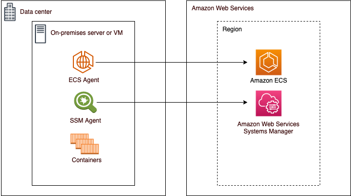

# Overview
+ Amazon ECS Anywhere provides support for **registering an external instance such as an on-premises server or virtual machine (VM)**, to your Amazon ECS cluster.
+ External instances are optimized for running applications that **generate outbound traffic or process data**. 
+ If your application requires **inbound traffic**, the lack of Elastic Load Balancing support makes running these workloads **less efficient**.
+ Amazon ECS added a new **EXTERNAL launch type** that you can use to create services or run tasks on your external instances.

# Reference 
[Amazon ECS Anywhere](https://docs.aws.amazon.com/AmazonECS/latest/developerguide/ecs-anywhere.html)