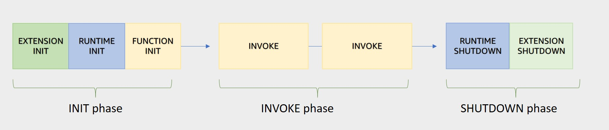

# Serverless Overview
+ With serverless applications, there are never instances, operating systems, or servers to manage.
+ AWS handles everything required to run and scale your application.
+ By building serverless applications, your developers can focus on the code that makes your business unique. 
# Lambda Overview
+ AWS Lambda is an event-driven, serverless compute service that lets you run code without provisioning or managing servers.
+ Lambda runs your code on a high-availability compute infrastructure and performs all of the administration of the compute resources, including server and operating system maintenance, capacity provisioning and automatic scaling, code monitoring and logging.
+ With Lambda, you can run code for virtually any type of application or backend service.
+ You can invoke your Lambda functions using the Lambda API, or Lambda can run your functions in response to events from other AWS services. 
+ you cannot log in to compute instances or customize the operating system on provided runtimes
+ Some benefits of using Lambda include the following:
    + You can run code without provisioning or maintaining servers.
    + It initiates functions for you in response to events.
    + It scales automatically.
    + It provides built-in code monitoring and logging via Amazon CloudWatch.
# Event-driven architectures
+ An event-driven architecture uses events to initiate actions and communication between decoupled services.
+ When an event occurs, the information is published for other services to consume it.
+ In event-driven architectures, events are the primary mechanism for sharing information across services.
+ AWS Lambda is an example of an event-driven architecture.
+ Most AWS services generate events and act as an event source for Lambda.
+ Lambda runs custom code (functions) in response to events.
+ Lambda functions are designed to process these events and, once invoked, may initiate other actions or subsequent events.
# Lambda concepts
+ A **function** is a resource that you can invoke to **run your code** in Lambda. 
+ A **trigger** is a resource or configuration that **invokes** a Lambda function
+ An **event is a JSON-formatted document** that contains data for a Lambda function to process.
+ An **execution environment** provides **a secure and isolated runtime environment** for your Lambda function. An execution environment manages the processes and resources that are required to run the function.
+ You **deploy** your Lambda function code using a *deployment package*. Lambda supports two types of deployment packages: 
    + A .zip file archive that contains your function code and its dependencies. Lambda provides the operating system and runtime for your function.
    + A container image: You add your function code and dependencies to the image. You must also include the operating system and a Lambda runtime.
+ The **runtime** provides a **language-specific environment** that runs in an execution environment. 
+ A Lambda *layer* is a .zip file archive that can contain additional code or other content.  
    + Layers provide **a convenient way to package libraries and other dependencies** that you can use with your Lambda functions.
    + Using layers **reduces the size of uploaded deployment archives** and makes it faster to deploy your code.
    + You can include up to five layers per function.
    + Functions deployed as a container image do not use layers. 
+ **Lambda extensions** enable you to augment your functions.  
    + An **internal** extension runs in the runtime process and **shares the same lifecycle** as the runtime.
    + An external extension runs **as a separate process** in the execution environment. The external extension is initialized before the function is invoked, **runs in parallel** with the function's runtime, and continues to run after the function invocation is complete.
+ **Concurrency** is the **number of requests** that your function is serving at any given time.
+ When you invoke or view a function, you can include a *qualifier* to specify a version or alias. 
+ **A *version* is an immutable snapshot** of a function's code and configuration that has a numerical qualifier. For example, `my-function:1`.
+ **An *alias* is a pointer to a version** that you can update to map to a different version, or split traffic between two versions. 
# Lambda features
+ Authoring specifics vary between runtimes, but all runtimes share a common **programming model** that **defines the interface between your code and the runtime code.** You tell the runtime **which method to run by defining a handler in the function configuration**, and the runtime runs that method
+ Lambda manages the infrastructure that runs your code, and **scales automatically** in response to incoming requests.
+ Use **concurrency settings** to ensure that your production applications are highly available and highly responsive.  
+ To prevent a function from using too much concurrency, and to reserve a portion of your account's available concurrency for a function, use *reserved concurrency*
    + **Other functions can't prevent your function from scaling:** When a function has reserved concurrency, **no other function can use that concurrency**.
    + **Your function can't scale out of control:** Reserved concurrency also **limits the maximum concurrency for the function**, and applies to the function as a whole, including versions and aliases.
+ To enable functions to **scale without fluctuations in latency**, use *provisioned concurrency*. For functions that take a long time to initialize, or that require extremely low latency for all invocations, **provisioned concurrency** enables you to pre-initialize instances of your function and **keep them running at all times**.
+ When you invoke a function, you can choose to invoke it **synchronously or asynchronously**. 
+ For asynchronous invocations, Lambda handles retries if the function returns an error or is throttled.
+ To process items from a stream or queue, you can create an *event source mapping*. 
    + An event source mapping is a resource in Lambda that reads items from an Amazon Simple Queue Service (Amazon SQS) queue, an Amazon Kinesis stream, or an Amazon DynamoDB stream, and **sends the items to your function in batches**.
    + **Each event** that your function processes can contain **hundreds or thousands of items**.
    + Event source mappings maintain a local queue of unprocessed items and handle retries if the function returns an error or is throttled.
+ A destination is an AWS resource that **receives invocation records** for a function.
# AWS Lambda permissions
+ With Lambda functions, there are two sides that define the necessary scope of permissions – permission to invoke the function, and permission of the Lambda function itself to act upon other services.
+ Permissions to invoke the function are controlled using an IAM resource-based policy. An IAM execution role defines the permissions that control what the function is allowed to do when interacting with other AWS services. 
+ Resource policies grant permissions to invoke the function, whereas the execution role strictly controls what the function can to do within the other AWS service.

+ AWS Lambda execution role 
    + A Lambda function's execution role is an AWS Identity and Access Management (IAM) role that **grants the function permission to access AWS services and resources**.
    + You provide this role when you create a function, and **Lambda assumes the role when your function is invoked**. 
+ Resource-based policies
    + Resource-based policies let you **grant usage permission to other AWS accounts** on a per-resource basis.
    + You also use a resource-based policy to **allow an AWS service to invoke your function on your behalf**.
+ Identity-based IAM policies
    + You can use identity-based policies in AWS Identity and Access Management (IAM) to **grant users in your account access to Lambda**.
    + You can also **grant users in another account** permission to assume a role in your account and access your Lambda resources.
+ permissions boundaries 
    + The permissions boundary limits the scope of the execution role is that the application's template creates for each of its functions, and any roles that you add to the template.
    + You can add permissions to a function's execution role in the template, but that permission is only effective if it's also allowed by the permissions boundary. 
    + To access other resources or API actions, you or an administrator must **expand the permissions boundary** to include those resources.
# Managing AWS Lambda functions
+ environment variables 
    + To keep secrets out of your function code, store them in the function's configuration and read them from the execution environment during initialization.
    + Use environment variables to make your function code portable by removing connection strings, passwords, and endpoints for external resources.
    + Lambda stores environment variables securely by encrypting them at rest.
+ [Versions and aliases](https://docs.aws.amazon.com/lambda/latest/dg/configuration-versions.html) are secondary resources that you can create to manage function deployment and invocation. 
+ Use [layers](https://docs.aws.amazon.com/lambda/latest/dg/configuration-layers.html) to manage your function's dependencies independently and keep your deployment package small.
+ To establish a private connection between your VPC and Lambda, create an **interface VPC endpoints**. Interface endpoints are powered by AWS PrivateLink, which enables you to privately access Lambda APIs without an internet gateway, NAT device, VPN connection, or AWS Direct Connect connection. Traffic between your VPC and Lambda **does not leave the AWS network**.
+ You can configure a function to **mount an Amazon Elastic File System** (Amazon EFS) file system to a local directory. With Amazon EFS, your function code can **access and modify shared resources** safely and at high concurrency.
+ Code signing for AWS Lambda helps to ensure that only trusted code runs in your Lambda functions. 
# Invoking AWS Lambda functions
+ Synchronous invocation
    + When you invoke a function synchronously, Lambda runs the function and **waits for a response**. 
    + When you invoke a function directly, you can check the response for errors and retry. The AWS CLI and AWS SDK also automatically retry on client timeouts, throttling, and service errors.
    + With this model, there are no built-in retries. You must manage your retry strategy within your application code.
    + The following AWS services invoke Lambda synchronously:
        + Amazon API Gateway
        + Amazon Cognito
        + AWS CloudFormation
        + Amazon Alexa
        + Amazon Lex
        + Amazon CloudFront
+ Asynchronous invocation 
    + When you invoke a function asynchronously, you **don't wait for a response** from the function code. You hand off the event to Lambda and Lambda handles the rest. 
    + For asynchronous invocation, Lambda **places the event in a queue** and returns a success response without additional information. 
    + Lambda manages the function's asynchronous event queue and attempts to **retry on errors**. 
    + You can also configure Lambda to send an invocation record to another service. Lambda supports the following [destinations](https://docs.aws.amazon.com/lambda/latest/dg/invocation-async.html#invocation-async-destinations) for asynchronous invocation. 
        + **Amazon SQS** – A standard SQS queue.
        + **Amazon SNS** – An SNS topic.
        + **AWS Lambda** – A Lambda function.
        + **Amazon EventBridge** – An EventBridge event bus. 
    + The invocation record contains details about the request and response in JSON format. You can configure separate destinations for events that are processed successfully, and events that fail all processing attempts. Alternatively, you can configure an SQS queue or SNS topic as a [dead-letter queue](https://docs.aws.amazon.com/lambda/latest/dg/invocation-async.html#dlq) for discarded events. For dead-letter queues, Lambda only sends the content of the event, without details about the response.
    + Built in retries – retries twice
    + The following AWS services invoke Lambda asynchronously: 
        + Amazon SNS 
        + Amazon S3
        + Amazon EventBridge 
+ event source mappings(Polling invocation): 
    + This invocation model is designed to integrate with AWS streaming and queuing based services with no code or server management. Lambda will poll (or watch) these services, retrieve any matching events, and invoke your functions. This invocation model supports the following services:
        + Amazon Kinesis
        + Amazon SQS
        + Amazon DynamoDB Streams
    + With this type of integration, AWS will manage the poller on your behalf and perform synchronous invocations of your function. 
    + With this model, the retry behavior varies depending on the event source and its configuration.
    + The configuration of services as event triggers is known as event source mapping. This process occurs when you configure event sources to launch your Lambda functions and then grant theses sources IAM permissions to access the Lambda function. 
    + Lambda provides event source mappings for the following services. 
        + [Amazon DynamoDB](https://docs.aws.amazon.com/lambda/latest/dg/with-ddb.html)
        + [Amazon Kinesis](https://docs.aws.amazon.com/lambda/latest/dg/with-kinesis.html)
        + [Amazon MQ](https://docs.aws.amazon.com/lambda/latest/dg/with-mq.html)
        + [Amazon Managed Streaming for Apache Kafka](https://docs.aws.amazon.com/lambda/latest/dg/with-msk.html)
        + [self-managed Apache Kafka](https://docs.aws.amazon.com/lambda/latest/dg/with-kafka.html#kafka-smaa)
        + [Amazon Simple Queue Service](https://docs.aws.amazon.com/lambda/latest/dg/with-sqs.html)
    + For streams, an event source mapping creates an iterator for each shard in the stream and processes items in each shard in order
    + Lambda also supports in-order processing for [FIFO (first-in, first-out) queues](https://docs.aws.amazon.com/lambda/latest/dg/with-sqs.html), scaling up to the number of active message groups. 
# AWS Lambda applications
+ An AWS Lambda application is **a combination of Lambda functions, event sources, and other resources** that work together to perform tasks. 
+ The **AWS Serverless Application Repository** provides **a collection of Lambda applications** that you can deploy in your account with a few clicks. 
+ With continuous delivery, every change that you push to your source control repository triggers a pipeline that builds and deploys your application automatically. 
# Execution environment
+ Lambda invokes your function in an execution environment, which provides a secure and isolated runtime environment.
+ The execution environment manages the resources required to run your function. 
+ The function's runtime communicates with Lambda using the [Runtime API](https://docs.aws.amazon.com/lambda/latest/dg/runtimes-api.html). Extensions communicate with Lambda using the [Extensions API](https://docs.aws.amazon.com/lambda/latest/dg/runtimes-extensions-api.html).

+ + The execution environment also provides lifecycle support for the function's runtime and any external extensions associated with your function. 
+ When you create your Lambda function, you specify configuration information, such as the amount of available memory and the maximum invocation time allowed for your function. Lambda uses this information to set up the execution environment.
+ When you write your function code, do not assume that Lambda automatically reuses the execution environment for subsequent function invocations. Other factors may require Lambda to create a new execution environment, which can lead to unexpected results. Always test to optimize the functions and adjust the settings to meet your needs.
+ The lifecycle of the execution environment includes the following phases:

    
    + `**Init**`:In this phase, Lambda creates or unfreezes an execution environment with the configured resources, downloads the code for the function and all layers, initializes any extensions, initializes the runtime, and then runs the function’s initialization code (the code outside the main handler).
        + The Init phase happens either during the first invocation, or before function invocations if you have enabled provisioned concurrency.
        + The Init phase is split into three sub-phases: 
            + Start all extensions (`Extension init`)
            + Bootstrap the runtime (`Runtime init`)
            + Run the function's static code (`Function init`)
    + `**Invoke**`: In this phase, Lambda invokes the function handler. After the function runs to completion, Lambda prepares to handle another function invocation.
    + `**Shutdown:**`This phase is triggered if the Lambda function does not receive any invocations for a period of time.
        + In the Shutdown phase, Lambda shuts down the runtime, alerts the extensions to let them stop cleanly, and then removes the environment.
        + Lambda sends a shutdown event to each extension, which tells the extension that the environment is about to be shut down.
# Configuring Your Lambda Functions
+ You can allocate up to 10 GB of memory to a Lambda function.
+ The AWS Lambda timeout value dictates how long a function can run before Lambda terminates the Lambda function. At the time of this publication, the maximum timeout for a Lambda function is 900 seconds.
+ You can use an open-source tool called Lambda Power Tuning to find the best configuration for a function. The tool helps you to visualize and fine-tune the memory and power configurations of Lambda functions. The tool runs in your own AWS account—powered by AWS Step Functions—and supports three optimization strategies: cost, speed, and balanced. It's language-agnostic so that you can optimize any Lambda functions in any of your languages. 

## Concurrency and scaling
+ Concurrency is the third major configuration that affects your function's performance and its ability to scale on demand.
+ Concurrency is the number of invocations your function runs at any given moment.
+ When your function is invoked, Lambda launches an instance of the function to process the event. When the function code finishes running, it can handle another request. If the function is invoked again while the first request is still being processed, another instance is allocated.
+ Having more than one invocation running at the same time is the function's concurrency.
+ Concurrency can be compared to the seating limit in a restaurant. If there are 100 total seats and 40 are in use and 20 are reserved, only 40 seats are available (40+20+40=100 seats) for people arriving without a reservation.
## Concurrency types
+ Unreserved concurrency
    + The amount of concurrency that is not allocated to any specific set of functions. The minimum is 100 unreserved concurrency. This allows functions that do not have any provisioned concurrency to still be able to run. 
+ Reserved concurrency
    + Guarantees the maximum number of concurrent instances for the function. When a function has reserved concurrency, no other function can use that concurrency. No charge is incurred for configuring reserved concurrency for a function.
+ Provisioned concurrency
    + Initializes a requested number of runtime environments so that they are prepared to respond immediately to your function's invocations. This option is used when you need high performance and low latency. 
    + You pay for the amount of provisioned concurrency that you configure and for the period of time that you have it configured. 
## How concurrency bursts are managed
+ A burst is when there is a sudden increase in the number of instances needed to fulfill the requested number of running functions. An example is an increase in orders on a website during a limited time sale. The burst concurrency quota is not per function. It applies to all of your functions in the Region. 
+ The burst quotas differ by region:
    + 3000 – US West (Oregon), US East (N. Virginia), Europe (Ireland)
    + 1000 – Asia Pacific (Tokyo), Europe (Frankfurt), US East (Ohio)
    + 500 – Other Regions
+ After the initial burst, your functions' concurrency can scale by an additional 500 instances each minute. This continues until there are enough instances to serve all requests, or until a concurrency limit is reached.
+ When you get a burst of requests, Lambda will immediately increase concurrency up to the "Immediate Concurrency Increase" level for the AWS Region where your Lambda function is running. Then, it will add 500 more invocations each minute, until it either has enough to process the burst, or hits the function or account concurrency limit.
+ 
# Reduce risk using versions and aliases  
+ One potential challenge to serverless deployments is that when the function is deployed, it becomes live immediately.
+ This means that a function can potentially go live without testing it, which puts your working applications at risk.
+ This risk is especially true if you move toward an automated CI/CD pipeline and need to easily promote new code or roll back if there's a problem.
+ To mitigate this risk, you can version your Lambda functions and add aliases to ensure safe deployments.
+ Versioning
    + You can use versions to manage the deployment of your functions
    + When you create a Lambda function, only one version exists, which is identified by $LATEST at the end of the Amazon Resource Name (ARN).
+ Publish
    + Publish makes a snapshot copy of $LATEST. 
    + Enable versioning to create immutable snapshots of your function every time you publish it. 
        + Publish as many versions as you need. 
        + Each version results in a new sequential version number. 
        + Add the version number to the function ARN to reference it.
        + The snapshot becomes the new version and is immutable.
+ Aliases
    + A Lambda alias is like a pointer to a specific function version.
    + You can access the function version using the alias ARN.
    + Each alias has a unique ARN. An alias can point only to a function version, not to another alias.
    + You can update an alias to point to a new version of the function. 

# Integrate with AWS CodeDeploy
+ Lambda is integrated with AWS CodeDeploy for automated rollout with traffic shifting. CodeDeploy supports multiple traffic shifting methods, in addition to alarms and hooks. CodeDeploy supports the following traffic-shifting patterns:
    + Canary – Traffic is shifted in two increments. If the first increment is successful, the second is completed based on the time specified in the deployment. 
    + Linear – With linear traffic shifting, traffic is slowly shifted in a predetermined percentage every X minutes based on how you have it configured. 
    + All-at-once – Shifts all traffic from the original Lambda function to the updated Lambda function version at once.
+ Additionally, it supports the following testing options:
    + Alarms – These instruct CloudWatch to monitor the deployment and trigger an alarm if any errors occurred during rollout. Any alarms would automatically roll back your deployment. 
    + Hooks – Give you the option to run pre-traffic and post-traffic test functions that run sanity checks before traffic-shifting starts to the new version and after traffic-shifting completes. 

# Monitoring
+ Lambda automatically monitors Lambda functions on your behalf and reports metrics through Amazon CloudWatch.
+ Lambda automatically integrates with CloudWatch Logs and pushes all logs from your code to a **CloudWatch Logs group** associated with a Lambda function, which is named **/aws/lambda/`<function name>`**.
+ **AWS Trusted Advisor** inspects your AWS environment and makes recommendations on ways you can save money, improve system availability and performance, and help close security gaps.
+ Amazon CloudWatch Lambda Insights
+ Lambda Insights dashboard
+ Monitoring Lambda functions using AWS X-Ray
    + You can use AWS X-Ray to visualize the components of your application, identify performance bottlenecks, and troubleshoot requests that resulted in an error. Your Lambda functions send trace data to X-Ray, and X-Ray processes the data to generate a service map and searchable trace summaries. AWS X-Ray records how the Lambda functions are running. Use it to identify the call flow of your Lambda function and the performance of every API call within your application.
+ AWS CloudTrail helps audit your application by recording all the API actions made against the application. These logs can be exported to the analysis tool of your choice for additional analysis. 
    + CloudTrail logging provides the following options:
    + The default Lambda CloudTrail logging is for control plane (management) events.
    + Optional logging: CloudTrail also logs data events. You can turn on data event logging so that you log an event every time Lambda functions are invoked.
+ Dead-letter queues help you capture application errors that must receive a response, such as an ecommerce application that processes orders. If an order fails, you cannot ignore that order error. You move that error into the dead-letter queue and manually look at the queue and fix the problems.
    + Use dead-letter queues to analyze failures for follow-up or code corrections.
    + Dead-letter queues are available for asynchronous and non-stream polling events.
    + A dead-letter queue can be an Amazon Simple Notification Service (Amazon SNS) topic or an Amazon Simple Queue Service (Amazon SQS) queue.
# Security
+ Encryption in transit: Lambda API endpoints only support secure connections over HTTPS. 
+ Encryption at rest: You can use environment variables to store secrets securely for use with Lambda functions. Lambda always encrypts environment variables at rest. 
# AWS Serverless Application Model
+ The AWS Serverless Application Model (AWS SAM) is an open-source framework that you can use to build **serverless application** on AWS. It provides shorthand syntax to express functions, APIs, databases, and event source mappings.
+ A **serverless application** is a combination of Lambda functions, event sources, and other resources that work together to perform tasks.
+ You use the AWS SAM specification to define your serverless application.
+ AWS SAM templates are an extension of AWS CloudFormation templates, with some additional components that make them easier to work with.
+ A serverless application can include one or more **nested applications**. You can deploy a nested application as a stand-alone artifact or as a component of a larger application.
+ When you provide AWS SAM with simplified instructions for your environment, it transforms that information into the fully detailed CloudFormation template that you can use to build your stack.
+ All CloudFormation options are still available within AWS SAM.
+ The service streamlines the configuration of commonly used serverless application resources.
+ With just a few lines per resource, you can define the application you want and model it using YAML. You provide AWS SAM with simplified instructions for your environment and during deployment AWS SAM transforms and expands the AWS SAM syntax into AWS CloudFormation syntax (a fully detailed CloudFormation template)
+ AWS SAM CLI launches a Docker container that you can interact with to test and debug your Lambda functions.
+ With AWS SAM CLI for testing, you can do the following:
    + Invoke functions and run automated tests locally.
    + Generate sample event source payloads.
    + Run API Gateway locally.
    + Debug code.
    + Review Lambda function logs.
    + Validate AWS SAM templates.
# AWS Serverless Application Repository
+ The AWS Serverless Application Repository makes it easy for developers and enterprises to quickly find, deploy, and publish serverless applications in the AWS Cloud.
+ With the AWS Serverless Application Repository, you can:
    + Publishing Applications – Configure and upload applications to make them available to other developers, and publish new versions of applications. 
    + Deploying Applications – Browse for applications and view information about them, including source code and readme files. Also install, configure, and deploy applications of your choosing. 
# Performance optimization Cold and warm starts
+ A cold start occurs when a new execution environment is required to run a Lambda function. 
+ When the Lambda service receives a request to run a function, the service first prepares an execution environment. During this step, the service downloads the code for the function, then creates the execution environment with the specified memory, runtime, and configuration. Once complete, Lambda runs any initialization code outside of the event handler before finally running the handler code. 
+ In a warm start, the Lambda service retains the environment instead of destroying it immediately. This allows the function to run again within the same execution environment. This saves time by not needing to initialize the environment. 

+ Best practice: Minimize cold start times
+ If a function has not been used for some time, if more concurrent invocations are required, or if you update a function, new environments are created.  Creation of these environments can introduce latency for the invocations that are routed to a new environment. 
+ After optimizing your function, another way to minimize cold starts is to use provisioned concurrency.
    + If you need predictable function start times for your workload, provisioned concurrency ensures the lowest possible latency.
    + This feature keeps your functions initialized and warm, and ready to respond in double-digit milliseconds at the scale you provision.
    + Unlike with on-demand Lambda, this means that all setup activities happen before invocation, including running the initialization code.
+ Best practice: Write functions to take advantage of warm starts
    + Store and reference dependencies locally.
    + Limit re-initialization of variables.
    + Add code to check for and reuse existing connections.
    + Use tmp space as transient cache.
    + Check that background processes have completed.
# Accessing resources in a VPC
+ Enabling your Lambda function to access resources inside your virtual private cloud (VPC) requires additional VPC-specific configuration information, such as VPC subnet IDs and security group IDs. 
+ This functionality allows Lambda to access resources in the VPC. It does not change how the function is secured. You also need an execution role with permissions to create, describe, and delete elastic network interfaces.
+ Lambda provides a permissions policy for this purpose named "AWSLambdaVPCAccessExecutionRole"

# Lambda and AWS PrivateLink
+ To establish a private connection between your VPC and Lambda, create an interface VPC endpoint for lambda:  com.amazonaws.region.lambda.
+ Interface endpoints are powered by AWS PrivateLink, which enables you to privately access Lambda APIs without an internet gateway, NAT device, VPN connection, or AWS Direct Connect connection. 
+ Instances in your VPC don't need public IP addresses to communicate with Lambda APIs. Traffic between your VPC and Lambda does not leave the AWS network. 
# code design best practices.
+ Separate business logic
+ Write modular functions
+ Treat functions as stateless
+ Only include what you need
# Best practices for writing code
+ Include logging statements
+ Use return coding
+ Provide environment variables
+ Add secret and reference data
+ Avoid recursive code
+ Gather metrics with Amazon CloudWatch
+ Reuse execution context
# Considerations for choosing Fargate or Lambda for serverless compute
+ AWS Fargate
    + Lift and shift with minimal rework
    + Longer-running processes or larger deployment packages
    + Predictable, consistent workload
    + Need more than 3 GB of memory
    + Application with a non-HTTP/S listener
    + Run side cars with your service (agents only supported as side cars)
    + Container image portability with Docker runtime
+ AWS Lambda
    + Tasks that run less than 15 minutes
    + Spiky, unpredictable workloads
    + Unknown demand
    + Lighter-weight, application-focused stateless computing
    + Simplified IT automation
    + Real-time data processing
   +  Reduced complexity for development and operations

# migration patterns 
+ leapfrog: As the name suggests, with the leapfrog pattern, you bypass interim steps and go straight from an on-premises legacy architecture to a serverless cloud architecture.
+ Organic
    + With the organic pattern, you move on-premises applications to the cloud in more of a lift-and-shift model. In this model, existing applications are kept intact, either running on Amazon Elastic Compute Cloud (Amazon EC2) instances or with some limited rewrites to container services such as Amazon Elastic Kubernetes Service (Amazon EKS), Amazon Elastic Container Service (Amazon ECS), or AWS Fargate.
    + Developers experiment with Lambda in low-risk internal scenarios such as log processing or cron jobs. As you gain more experience, you might use serverless components for tasks such as data transformations and parallelization of processes.
+ strangler: With the strangler pattern, an organization incrementally and systematically decomposes monolithic applications by creating APIs and building event-driven components that gradually replace components of the legacy application.
# database for serverless
+ It's critical to separate and model your data stores into transactional compared to query needs.
+ Use the concepts expressed in the CQRS pattern to choose a data store designed for the type of work the database needs to do.
+ Amazon Simple Storage Service (Amazon S3)
    + Data lakes
    + Economical state store
    + Claim-check pattern
    + Filter data retrieved by Lambda (S3 Select)
+ Amazon DynamoDB
    + Key-value data store with millisecond response time
    + Capture changes with Amazon DynamoDB Streams and index to other data stores
+ Amazon ElastiCache for Redis
    + Well suited for things like real-time leaderboards
    + In-memory data store with sub-millisecond read and write latency
+ Amazon Quantum Ledger Database (Amazon QLDB)
    + Model state changes in a cryptographically provable manner
    + Distributed ledger
+ Amazon Aurora
    + High-volume, high-throughput, and highly parallelized transactional data
    + MySQL+ and Postgres-compatible relational database built for faster performance at lower costs
    + Aurora Serverless automatically starts up, scales, and shuts down based on traffic
+ Amazon Relational Database Service (Amazon RDS)
    + Run familiar database engines with less administration

# The best practices for serverless applications include:
+ Don’t reinvent the wheel.
+ Stay current.
+ Prefer idempotent, stateless functions.
+ Don’t just port your code. 
+ Keep events inside AWS services for as long as possible.
+ Verify the limits of all of the services involved.

# Scaling Serverless Architectures
+ Scaling best practices:
    + Separate your application and database.
    + Take advantage of the AWS Global Cloud Infrastructure.
    + Identify and avoid heavy lifting.
    + Monitor for percentile.
    + Refactor as you go.

# Scaling Considerations for Serverless Services
+ Timeouts
+ Retry behaviors
+ Throughput
+ Payload size

# Scaling considerations for Amazon SQS
+ When Amazon SQS is used as a Lambda event source, the Lambda service manages polling the queue on your behalf, but you still control other configuration options that affect how your application performs.
+ You set the batch size, concurrency limit, and timeout for your Lambda functions. 
+ You set the visibility timeout, max receive count, and redrive policy on the queue, and configure its dead-letter queue. 
+ Lambda defaults to using five parallel processes to get messages off the queue. These five parallel processes mean Lambda is invoking five concurrent instances of your Lambda function. To avoid your Lambda function getting throttled right out of the gate, make sure that the reserved concurrency on the function is at least five.
+ If the Lambda service detects an increase in queue size, it will automatically increase how many batches it gets from the queue, each time. That means it will increase the number of concurrent Lambda functions it invokes.
+ Lambda will continue to add additional processes every minute until the queue has slowed down, or it reaches maximum concurrency. Maximum concurrency is 1,000, unless the account or function limit is lower.

# Lambda Power Tuning
+ AWS Lambda Power Tuning is an open-source project that runs your Lambda function at multiple memory configurations and provides feedback across execution time, and cost, to help you make the best choice.
+ Under the hood, an AWS Step Functions state machine invokes the function you’ve specified at different memory settings from 128 MB to 3 GB and captures both duration and cost values.
+ Speed will suggest fastest regardless of cost. Balanced will choose a compromise according to "balancedWeight". balancedWeight is a number between 0 and 1.  0 is speed strategy, 1 is cost strategy.

# Lambda execution environment reuse
+ If your code retrieves any externalized configuration or dependencies, make sure they are stored and referenced locally after initial execution. For example, if your function retrieves information from an external source like a relational database or AWS Systems Manager Parameter Store, it should be kept outside of the function handler. By doing so, the lookup occurs when the function is initially run. Subsequent warm invocations will not need to perform the lookup.
+ You should also limit the re-initialization of variables or objects on every invocation. Any declarations in your Lambda function code (outside the handler code) remain initialized when a function is invoked.
+ Add logic to your code to check whether a connection already exists before creating one. If one exists, just reuse it.
+ Add code to check whether the local cache has the data that you stored previously. Each execution context provides additional disk space in the /tmp directory that remains in a reused environment.
+ And finally, make sure any background processes (or callbacks in the case of Node.js) are complete before the code exits.

# Scaling serverless databases
+ Amazon DynamoDB is often recommended for serverless architectures, given its horizontal scalability and very low latency. You can choose on-demand or provisioned mode, depending on how predictable your capacity needs are.
+ When you choose on-demand mode, your tables automatically scale read and write throughput based on each prior peak. On-demand capacity instantly handles up to double the previous traffic peak on a table and will then use the latest peak as the baseline from which it can instantly double capacity for the next peak.
+ If you get a new peak that is more than double the previous, DynamoDB will still give you more capacity, but your requests could get throttled if you exceed double your previous peak within 30 minutes.
+ Provisioned throughput is the maximum amount of capacity the table can consume. If you exceed this in a table or index, requests will get throttled. Throttled requests will return an error, and the AWS SDK has built in support for retries and exponential backoff.
+ You can use auto scaling with provisioned capacity to define lower and upper capacity limits and target a utilization percentage within the range. DynamoDB auto scaling will work to maintain the target utilization as the workload increases or decreases. You can set the target between 20 and 90 percent. With auto scaling, a table will increase its read and write capacity to handle sudden increases in traffic without getting throttled.
+ On-demand is a really great fit for serverless applications because you don’t have to worry about provisioning any capacity. You pay a set amount for each read and write. This simplifies evaluating the cost of a transaction, because the cost is directly reflected in the reads and writes performed by that transaction.
+ Provisioned capacity may be the better choice if you have a very consistent, predictable workload. With provisioned capacity you are paying a set rate for the amount of read and write capacity you have provisioned.
+ If your application is really read heavy and requires even lower latency than DynamoDB offers, you can add Amazon DynamoDB Accelerator, called DAX. DAX is an in-memory cache. Things like real-time bidding, social gaming, and trading applications are good candidates for using DAX.
+ You can put DAX in front of your DynamoDB table, and AWS Lambda will read from and write to DAX, and DAX will read and write from DynamoDB as needed. DAX has to be installed in a VPC. Previously this meant a higher cold-start latency for Lambda, so the benefit of the cache was offset.
+ But with recent updates to Lambda that eliminate the VPC penalty, DAX is definitely worth a look if you have read-heavy workloads with the need for speed.

# Serverless scaling with traditional relational databases
+ You can initialize connections inside your function, (outside the handler), to make them available for as long as the execution environment is alive. But there’s no point initializing more than one connection, because that environment will never execute more than one Lambda function at a time.
+ So, as a starting point, you might initialize a single connection outside of the handler, and then check for that connection as each new invocation of that function is executed.
+ A separate challenge is that you can’t explicitly close connections when an environment gets recycled, because there is no hook to let you indicate destruction of a Lambda environment.
+ You can use the database Time to Live as a fallback to clean up connections, but this can still lead to session leakages.
+ Because you have no control over the lifecycle of the execution environments, you could have connections sitting idle. And because you can’t share environments with two different Lambda functions, you can’t reuse idle connections across functions.
+ You can use Lambda concurrency limits at the function level to limit the number of potential connections that Lambda would attempt to create.
+ The best practice is to implement an external mechanism for managing the connections. 
    + For example, your database engine may have a proxy program that will manage the incoming connection requests and use a persistent database connection that can be shared across functions.
+ You could also use a method called Dynamic Content Management. This method uses an Amazon DynamoDB table to track connections allowed and connections in use and manipulates the count with a helper function packaged as a Lambda layer.

# Scaling considerations for Kinesis Data Streams
+ Amazon Kinesis Data Streams are designed to handle very high volumes of data. 
+ Stream processing is dependent on the number of shards on the stream. AWS Lambda gets records in a batch (one per shard) and invokes one instance of your function per shard.
+ If Lambda can’t process one message in the shard, that whole shard is blocked until you either force that message to complete or the retention period expires for the data in the shard. 
+  As noted earlier in the course, you want your function to include code that catches exceptions, and records them elsewhere (like Amazon CloudWatch logs), and then returns a "success" back to the Lambda service, so that the rest of the messages can be processed.
+ Customize failure handling with: 
    + Bisect on function error
    + Maximum record age in seconds 
    + Maximum retry attempts
    + Destination on failure
+ Kinesis Data streams can take in up to 1 MB of data or 1,000 records per second, per shard from a producer. When you look at the volume of data you expect to produce, this will drive how many shards you need.
+ Lambda uses a GetRecords API call to get data off the stream. "GetRecords" requests can only be made at five transactions per second, per shard.
+ Each request can return a maximum of 2 MB of data. You can have up to five standard consumers on a stream, but all of them have to share the polling capacity and the data capacity.
    + So, if you have five standard consumers, each one can poll each shard only once per second (verses five times) and each one is getting 1/5 of the data bandwidth. So, latency goes up, and throughput goes down.
+ Enhanced fan-out consumers subscribe to the stream. Once they are subscribed, data from the shard is pushed out to the consumer using an HTTP/2 request that can run for up to 5 minutes. Data will keep getting pushed out to the consumer as it comes in.
    + This reduces the latency such that the delivery rate is more like 50 to 70 ms. Additionally, enhanced fan-out increases throughput. Any consumers that are using enhanced fan-out get their own pipe, so they’re getting the full 2 MB per shard.
    + There is an additional cost to using enhanced fan-out, so consider what your traffic will look like, and whether the latency of a standard consumer is acceptable. Generally speaking, if you have three consumers or less, and latency isn’t critical, you probably want to use a standard stream to minimize the cost.
+ Similarly to the discussion about Amazon Simple Queue Service (Amazon SQS) queues, you need to find the right balance between the type of stream, number of shards, batch size, and retention timeout.

# Scaling considerations for Step Functions
+ Most of the guidance around scaling with AWS Step Functions thus far has focused on how Step Functions helps you manage scaling.
+ As noted in the Event-driven Architectures module, it’s a best practice to use wait states and callbacks to reduce costs when you are waiting on other tasks to finish.
+ You also want to use timeouts within Step Functions to avoid stuck executions. 
+ If your payload has the potential to grow beyond the limit for input or output data size, use Amazon Simple Storge Service (Amazon S3) to store the data and pass the ARN of the S3 bucket.

# Scaling considerations for Amazon SNS
+ Notification Service (Amazon SNS) were highlighted earlier in the course. SNS can give you asynchronous connections and parallel execution of functions, or nested applications within your larger application.
+ Use the pipelines to model your own SNS fanouts. By default, 200 filter policies per account, per AWS Region can be applied to a topic.
+ AWS Event Fork Pipeline applications available in the Serverless Application Repository let you deploy pre-built applications that use SNS to execute common tasks in parallel.

# Testing for Peak Load
+ Best practices for testing load
    + Use authentic data and access patterns.
    + Address issues at each integration point end to end, and iterate.
    + Remember the business drivers, and make trade-offs that support them.
    + Know your "error budget," and validate your failure management mechanisms.
+ Testing tips
    + Watch service limits. Service limits are in place to protect customers from unauthorized use of services. Limits that are not properly monitored might result in a degradation or throttling of service and additional cost. Many limits are soft limits. You can request limit increases.
    + Use all of the monitoring tools available to you while testing and when you go into production. Managed services have built-in logging and metrics that you can monitor and alarm on in Amazon CloudWatch.
    + Don’t try to mock services you can’t control. Perform your integration and load tests using the services in an AWS environment that will be the same as the production environment.
    + When using DynamoDB, make sure that you’ve set the capacity to handle the load that you are testing. Use on-demand mode or auto scaling to accommodate the performance testing cycle.

# Reference
+ [AWS Lambda](https://docs.aws.amazon.com/lambda/latest/dg/welcome.html)
+ [what is serverlessrepo](https://docs.aws.amazon.com/serverlessrepo/latest/devguide/what-is-serverlessrepo.html)
+ [what is sam](https://docs.aws.amazon.com/serverless-application-model/latest/developerguide/what-is-sam.html)
+ [AWS Lambda Foundations](https://explore.skillbuilder.aws/learn/course/99/aws-lambda-foundations)
+ [Architecting Serverless Applications](https://explore.skillbuilder.aws/learn/course/12716/architecting-serverless-applications)
+ [Scaling Serverless Architectures](https://explore.skillbuilder.aws/learn/course/12713/scaling-serverless-architectures)
+ [Designing Event-Driven Architectures](https://explore.skillbuilder.aws/learn/course/12715/designing-event-driven-architectures)
+ [Deploying Serverless Applications](https://explore.skillbuilder.aws/learn/course/12836/deploying-serverless-applications)
+ [Security and Observability for Serverless Applications](https://explore.skillbuilder.aws/learn/course/12714/security-and-observability-for-serverless-applications)