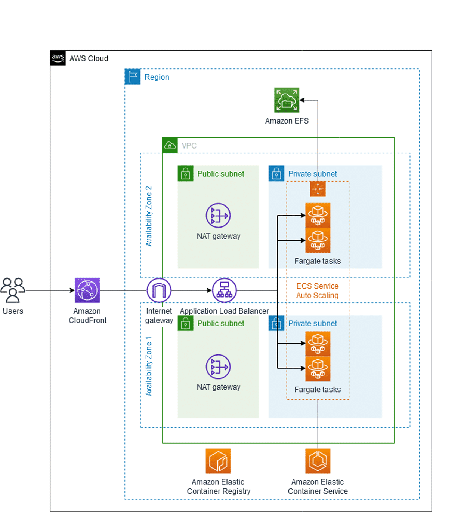

# Overview
+ AWS Fargate is a technology that you can use with Amazon ECS to **run containers without having to manage servers or clusters of Amazon EC2 instances**.
+ With Fargate, you no longer have to provision, configure, or scale clusters of virtual machines to run containers
+ AWS Fargate is a serverless, pay-as-you-go compute engine that lets you focus on building applications without managing servers.
+ When you run your Amazon ECS tasks and services with the Fargate launch type or a Fargate capacity provider, you package your application in containers, specify the Operating System, CPU and memory requirements, define networking and IAM policies, and launch the application.
+ Each Fargate task has its own **isolation boundary** and does not share the underlying kernel, CPU resources, memory resources, or elastic network interface with another task. 
+ Fargate is a serverless compute engine for containers that **works with both Amazon Elastic Container Service (Amazon ECS) and Amazon Elastic Kubernetes Service (Amazon EKS)**.
# Components
+ Clusters
    + An Amazon ECS cluster is a logical grouping of tasks or services. You can use clusters to isolate your applications. When your tasks are run on Fargate, your cluster resources are also managed by Fargate.
+ Task definitions
    + A task definition is a text file that describes one or more containers that form your application. It's in JSON format. You can use it to describe up to a maximum of ten containers. The task definition functions as a blueprint for your application. It specifies the various parameters for your application.
    + Your entire application stack doesn't need to be on a single task definition. In fact, we recommend spanning your application across multiple task definitions. You can do this by combining related containers into their own task definitions, each representing a single component.
+ Tasks
    + A task is the instantiation of a task definition within a cluster. After you create a task definition for your application within Amazon ECS, you can specify the number of tasks to run on your cluster. You can run a standalone task, or you can run a task as part of a service.
+ Services
    + You can use an Amazon ECS service to run and maintain your desired number of tasks simultaneously in an Amazon ECS cluster. How it works is that, if any of your tasks fail or stop for any reason, the Amazon ECS service scheduler launches another instance based on your task definition. It does this to replace it and thereby maintain your desired number of tasks in the service.
# Benefits of AWS Fargate
+ Manage your applications, not infrastructure
+ Monitor your applications to gain metrics and insights
+ Improve security through isolation
+ Optimize for cost
# How is deploying Amazon ECS on Fargate different than with Amazon Elastic Compute Cloud (Amazon EC2)?
+ While Amazon ECS workloads on Amazon EC2 can use networking modes such as awsvpc, bridge, host, or none, Amazon ECS using **Fargate is optimized for use with awsvpc**.
+ You will have to specify **an exact count for vCPU and memory at the Amazon ECS service level** rather than the Amazon EC2 host level.
# How is Fargate used to architect a cloud solution?

# Reference
+ [AWS Fargate](https://docs.aws.amazon.com/AmazonECS/latest/userguide/what-is-fargate.html)
+ [Getting Started with AWS Fargate](https://explore.skillbuilder.aws/learn/course/13380/getting-started-with-aws-fargate)
+ [Deep Dive on AWS Fargate: Building Serverless Containers at Scale](https://explore.skillbuilder.aws/learn/course/103/deep-dive-on-aws-fargate-building-serverless-containers-at-scale)