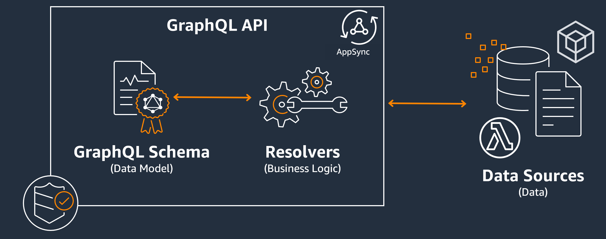

# Overview
+ AWS AppSync enables developers to connect their applications and services to data and events with secure, serverless and high-performing GraphQL and Pub/Sub APIs.
+ You can do the following with AWS AppSync:
    + Access data from one or more data sources from a single GraphQL API endpoint.
    + Combine multiple source GraphQL APIs into a single, merged GraphQL API.
    + Publish real-time data updates to your applications.
    + Leverage built-in security, monitoring, logging, and tracing, with optional caching for low latency.
    + Only pay for API requests and any real-time messages that are delivered.
# GraphQL and AWS AppSync architecture
+ GraphQL is a query and manipulation language for APIs.
+ GraphQL provides a flexible and intuitive syntax to describe data requirements and interactions.
+ It enables developers to ask for exactly what is needed and get back predictable results.
+ It also makes it possible to access many sources in a single request, reducing the number of network calls and bandwidth requirements, therefore saving battery life and CPU cycles consumed by applications.
+ GraphQL is an alternative to REST. 
# Why Use GraphQL over REST?
+ While REST is currently the industry standard for building web APIs, there are several recurring drawbacks to RESTful implementations that have been identified:
    + **Data requests**: Using RESTful APIs, you would typically request the data you need through endpoints. The problem arises when you have data that may not be so neatly packaged. The data you need may be sitting behind multiple layers of abstraction, and the only way to fetch the data is by using multiple endpoints, which means **making multiple requests to extract all of the data**.
    + **Overfetching and underfetching**: To add to the problems of multiple requests, the data from each endpoint is strictly defined, meaning you will return whatever data was defined for that API, even if you didn't technically want it.
    + Slow development iterations: slower product iterations due to the need for API modifications
    + Performance at scale: Due to these compounding issues, there are many areas where scalability will be impacted. **Performance on the application side may be impacted because your requests will return too much data or too little** (resulting in more requests).
+ GraphQL's selling point is to overcome the drawbacks of REST. Here are some of the key solutions GraphQL offers to developers:
    + Single endpoints: GraphQL uses a single endpoint to query data. 
    + Fetching: GraphQL solves the perennial issues of over- and under-fetching by simply defining the data you need. GraphQL lets you shape the data to fit your needs so you only receive what you asked for.
    + Abstraction: GraphQL APIs contain a few components and systems that describe the data using a language-agnostic standard.
    + Rapid iterations: Because of the standardization of data, changes on one end of development may not be required on the other.
# Components of a GraphQL API
## Schemas 
+ A standard GraphQL API is composed of **a single schema** that handles the shape of the data that will be queried.
+ The GraphQL schema is the foundation of a GraphQL API. It serves as **the blueprint** that defines the shape of your data. It's also a contract between your client and server that defines how your data will be retrieved and/or modified.
+ GraphQL schemas are written in the **Schema Definition Language (SDL)**. 
+ SDL is composed of **types and fields** with an established structure
## data sources
+ Your schema is linked to one or more of your **data sources** like a database or Lambda function.

+ As you can see in the infographic, the GraphQL schema contains all of the information clients need to request data. This means everything can be processed in a single request rather than multiple requests as is the case with REST. 
+ When requests are processed, a resolver (explained in the next section) executes its code to process the data from the relevant data source. When the response is returned, the subgraph tied to the data source will be populated with the data in the schema.
## Resolvers
+ In between the two sits **one or more resolvers** that handle the business logic for your requests. 

# Real-time data
+ AWS AppSync allows you to utilize **subscriptions** to implement **live application updates, push notifications**, etc.
+ When clients invoke the GraphQL subscription operations, a secure WebSocket connection is automatically established and maintained by AWS AppSync.
+ Applications can then distribute data in real-time from a data source to subscribers while AWS AppSync continually manages the application's connection and scaling requirements
+ Subscriptions in AWS AppSync are **invoked as a response to a mutation**. This means that you can make any data source in AWS AppSync real time by **specifying a GraphQL schema directive** on a mutation.
+ The AWS Amplify client libraries automatically handle subscription connection management. The libraries use pure WebSockets as the network protocol between the client and service
+ Subscriptions are triggered from mutations and the mutation selection set is sent to subscribers.

# Using AWS WAF to protect your APIs
+ AWS WAF is a web application firewall that helps protect web applications and APIs from attacks.
+ You can use AWS WAF to protect your AppSync API from common web exploits, such as SQL injection and cross-site scripting (XSS) attacks.

# Reference
+ [AWS AppSync](https://docs.aws.amazon.com/appsync/latest/devguide/what-is-appsync.html)