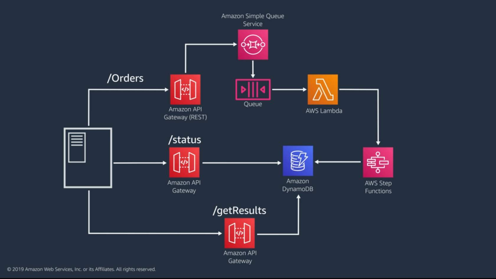

# concept of event-driven applications
+ Event-driven code is executed in response to an event, such as a change in state or an endpoint request. In event-driven architectures, state and code are decoupled, and integration between components is typically done with messaging to create asynchronous connections. 
+ AWS Lambda is a serverless compute service that is well suited to event-driven architectures. AWS Lambda is event driven by nature. 
# Patterns for Communicating Status Updates
+ Client polling
    + Client polling is a common way to **get status information on a long-running transaction**. 
    + Client polling provides a solution with minimal rework but does have potential for latency between polling.
    + The identifier returned to API Gateway from the queue is included in the API response to the client. (/Orders). 
    + The client can then use that ID to hit a different endpoint (/status) to find out if the work has been completed.
    + The Step Functions workflow tracks the status of the process, and when it’s finished, updates the DynamoDB table with the order data and a status of 
    + When the client gets a job status response of complete from the /status endpoint, the client requests the transaction results from the results endpoint
    
+ Webhooks with Amazon Simple Notification Service (Amazon SNS)
    + With trusted clients, you can use Amazon SNS to set up an HTTP subscriber that notifies the client using the webhook. An added benefit to using Amazon SNS with HTTP subscribers is that it can model retry behaviors and exponential backoffs until the webhook succeeds.
    + If you have an internal service, you can use trusted webhooks to provide results data to the client without the need for polling.
+ WebSockets with AWS AppSync
    + The last option you can use is WebSockets with AWS AppSync. WebSocket APIs are an open standard used to create a persistent connection between the client and the backing service, permitting bidirectional communication. You can provide the status for the client using WebSockets with GraphQL subscriptions to listen for updates through AWS AppSync. 
    + WebSockets with AWS AppSync lets clients receive status updates as they occur and is a good option when data drives the user interface.