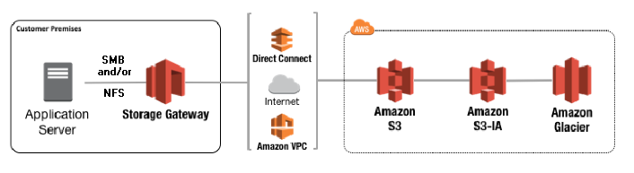
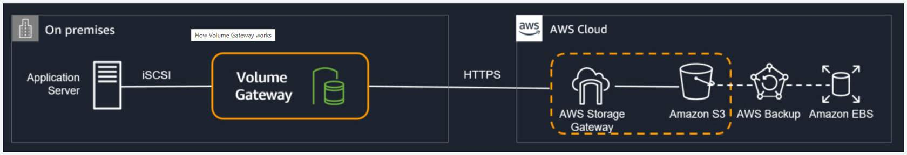
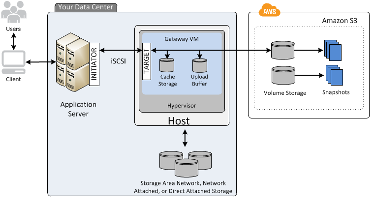

# Overview
+ AWS Storage Gateway connects an **on-premises software appliance with cloud-based storage** to provide seamless integration with data security features between your on-premises IT environment and the AWS storage infrastructure.
+ AWS Storage Gateway offers **file-based file gateways** (Amazon S3 File and Amazon FSx File), **volume-based** (Cached and Stored), and **tape-based** storage solutions
# Required prerequisites
+ **Configure Microsoft Active Directory (AD)**.
+ Ensure that there is sufficient network bandwidth between the gateway and AWS. **A minimum of 100 Mbps** is required to successfully download, activate, and update the gateway.
+ Configure your private networking, **VPN, or AWS Direct Connect** between your Amazon Virtual Private Cloud (Amazon VPC) and the on-premises environment where you are deploying your gateway, You must also **have on-premises access to FSx for Windows File Server**.
+ Make sure your gateway can resolve the name of your Active Directory Domain Controller. You can use DHCP in your Active Directory domain to handle resolution, or specify a DNS server manually from the Network Configuration settings menu in the gateway local console.
+ Hardware requirements for on-premises VMs 
    + Four virtual processors assigned to the VM
    + 16 GiB of reserved RAM for file gateways
    + 80 GiB of disk space for installation of VM image and system data
+ Storage requirements 
    +  In addition to 80 GiB of disk space for the VM, you also need additional disks for your gateway.
# Architecture

+ On-premises environments that benefit from cloud storage
    + Windows or Linux file server or user workstation
    + Backup server
    + Storage area network (SAN) system or network-attached storage (NAS) device that must be expanded
+ Standard protocols
    + With standard storage protocols, your on-premises environment can access cloud storage much like local storage is accessed. These include the following:
    + Network file system (NFS)
    + Server message block (SMB)
    + Internet Small Computer Systems Interface (iSCSI)
    +  iSCSI virtual tape library (VTL)
    +  With its protocol conversion and device emulation, you can do the following:
        + Access block data on volumes managed by Storage Gateway on top of Amazon S3.
        + Store files as native S3 objects or in fully managed cloud file shares with Amazon FSx for Windows File Server.
        + Keep virtual tape backups online in a virtual tape library backed by S3 or move the backups to a tape archive tier on S3 Glacier Flexible Retrieval and S3 Glacier Deep Archive.
+ Storage Gateway appliance
    + The appliance connects to the Storage Gateway service securely over the internet.
    + It deploys on premises, connected with a local cache, providing low-latency access to frequently accessed data. 
    + Deployment options include VMware, Microsoft Hyper-V, Kernel-based Virtual Machine (KVM), a hardware appliance, and Amazon Elastic Compute Cloud (Amazon EC2).
+ Secure and optimized uploads
    + Connect to AWS over the internet using HTTPS.
    + You can also use AWS Direct Connect for an even more secure and private connection.
    + You can use AWS Virtual Private Network (AWS VPN) services for a private and dedicated network connection from your premises to the AWS Cloud.
+ Storage Gateway service
    + Storage Gateway is an AWS managed service that provides hybrid cloud solutions.
    + It integrates your on-premises environments with AWS storage.
    + Gateway types include Amazon S3 File Gateway, Amazon FSx File Gateway, Tape Gateway, and Volume Gateway.
+ Storage
    + With Storage Gateway, you can connect to and use key cloud storage services such as Amazon S3, S3 Glacier Flexible Retrieval, S3 Glacier Deep Archive, Amazon FSx for Windows File Server, Amazon EBS, and AWS Backup.
+ Security, management, and monitoring
    + Storage Gateway integrates with other AWS services for security, management, and monitoring.
    + This includes services such as AWS KMS, IAM, CloudTrail, and CloudWatch.
# common features
+ Standard storage protocols: Storage Gateway uses standard storage protocols—namely, NFS, SMB, iSCSI, or iSCSI VTL—to connect your local production or backup applications to AWS Cloud storage. With its protocol conversion and device emulation, you can do the following:
    + Access block data on volumes managed by Storage Gateway on top of Amazon S3.
    + Store files as native S3 objects or in fully managed cloud file shares with Amazon FSx for Windows File Server.
    + Keep virtual tape backups online in a virtual tape library backed by S3 or move the backups to a tape archive tier on S3 Glacier Flexible Retrieval and S3 Glacier Deep Archive.
+ Low-latency access to your data
    + The Storage Gateway appliance provides your applications with low-latency access to data by maintaining either a full-volume copy of your stored volumes or a volume cache for your cached volumes.
+ Optimized data transfers
    + Storage Gateway uses optimization such as multi-part management, automatic buffering, and delta transfers. Data compression is applied for block and virtual tape data. The data transfers are optimized to reduce cost and the amount of data that is transferred in and out of AWS.
+ Security and compliance
    + Storage Gateway supports security features, access control, and security compliance certifications. 
    + Data is encrypted at transit and at rest. Your data at rest is encrypted by default using Amazon S3 server-side encryption (**S3-SSE**).
    + Alternatively, Storage Gateway integrates with AWS KMS, so you can choose to encrypt your data using your own encryption keys. By integrating with IAM, you manage and secure access to your data.
+ High availability on VMware
    + Storage Gateway provides high availability on VMware through a set of health checks integrated with VMware vSphere High Availability (VMware HA). With this integration, Storage Gateway deployed in a VMware environment on premises or in VMware Cloud on AWS will automatically recover from most service interruptions in under 60 seconds. This protects storage workloads against hardware, hypervisor, or network failures; storage errors; or software errors, such as connection timeouts and file share or volume unavailability.
# Solution deploys as a stateless gateway appliance
+ Deployment options for the Storage Gateway appliance include on premises (as a VM appliance or a hardware appliance) or in AWS Cloud (as an EC2 instance).
    + Download, deploy, and activate the AWS Storage Gateway VM image on any of the supported host platforms.
    + Create an Amazon EC2 instance to deploy your gateway in the AWS Cloud for cached volume. Stored volumes are only available on premises and therefore require an on-premises VM host or hardware appliance platform.
    + Order, deploy, and activate a Storage Gateway hardware appliance.
+ The Storage Gateway deployment consists of two components: a cloud component and an on-premises component referred to as the gateway appliance.
    + The gateway appliance you are using depends on the storage solution you require and where you will be deploying the gateway appliance.
    + The gateway appliance will need to be hosted, use a local cache, and securely connect back to AWS Storage Gateway on the cloud for native data storage in AWS.
# Network and firewall requirements
+ Your gateway requires access to the internet, local networks, Domain Name Service (DNS) servers, firewalls, routers, and so on.
# Amazon S3 File Gateway
+ S3 File Gateway is a file-based storage solution offered by Storage Gateway. It provides a seamless way to connect to the AWS Cloud to store and retrieve application data files and back up images as durable objects in Amazon S3 cloud storage.
+ Amazon S3 File Gateway supports a **file interface** into Amazon Simple Storage Service (Amazon S3) and combines a service and a virtual software appliance.
+ By using this combination, you can **store and retrieve objects in Amazon S3 using industry-standard file protocols** such as Network File System (NFS) and Server Message Block (SMB).
+ The software appliance, or gateway, is **deployed into your on-premises environment as a virtual machine** (VM) running on VMware ESXi, Microsoft Hyper-V, or Linux Kernel-based Virtual Machine (KVM) hypervisor.
+ The gateway provides access to objects in S3 **as files or file share mount points**.
+ S3 File Gateway provides native file access to Amazon S3 for backups, archives, and ingest for data lakes.
+ S3 File Gateway presents a file-based interface to Amazon S3, which appears as a network file share. With it, you can store files that support your latency-sensitive applications and workloads requiring local caching and file protocol access. S3 File Gateway moves your file data into an object format, which is highly durable and cost efficient.
+ S3 File Gateway supports data lakes, backups, and machine learning (ML) workflows. You can store file data as objects in Amazon S3 cloud storage using file protocols such as NFS and SMB. Objects written through S3 File Gateway can be directly accessed in Amazon S3.
+ How to use a file gateway: 
    + **downloading a VM image for the file gateway**.
    + You then **activate the file gateway** from the AWS Management Console or through the Storage Gateway API. You can also create a file gateway using an Amazon EC2 image.
    + After the file gateway is activated, you **create and configure your file share** and **associate that share with your Amazon Simple Storage Service (Amazon S3) bucket**. 
+ Doing this makes the share accessible by clients using either the Network File System (NFS) or Server Message Block (SMB) protocol.
+ Files written to a file share become objects in Amazon S3, with the path as the key.
+ There is a one-to-one mapping between files and objects, and the gateway asynchronously updates the objects in Amazon S3 as you change the files.
+ Existing objects in the Amazon S3 bucket appear as files in the file system, and the key becomes the path
+ Objects are encrypted with **Amazon S3–server-side encryption keys** (SSE-S3). All data transfer is done through HTTPS.
+ The service optimizes data transfer between the gateway and AWS using **multipart parallel uploads or byte-range downloads**, to better use the available bandwidth.
+ **Local cache** is maintained to provide low latency access to the recently accessed data and reduce data egress charges. 

+  File gateway converts files to S3 objects when uploading files to Amazon S3.
+ Common file operations change file metadata, which results in the **deletion of the current S3 object and the creation of a new S3 object**. 
## Primary use cases
+ Backing up data to the cloud
    + Transform your on-premises user and group file shares to a hybrid cloud architecture for simplified management and cost reduction. You can use S3 File Gateway to do the following:
        + Back up on-premises file data as objects in Amazon S3 (including Microsoft SQL Server and Oracle databases and logs).
        + Optimize storage cost using lifecycle policies to change an object's storage tier, or delete old objects or object versions.
        + Use data generated by on-premises applications to support hybrid cloud workflows and processing of data by AWS services such as ML or big data analytics.
    + Features:
        + NFS and SMB protocol support with the ability to mount shares directly on database and application servers
        + Files stored durably in Amazon S3, with the ability to lifecycle to any Amazon S3 storage class
        + Local cache for accessing recent backups
        + Windows access control list (ACL) support to control access to backup files
        + Bandwidth-optimization with only changes transferred
    + Benefits:
        + Reduce on-premises storage for backups.
        + Integrate with SAP, SQL Server, Oracle, Hadoop Distributed File System (HDFS), and other applications.
        + Restore backups on premises or in the cloud on Amazon EC2 or Amazon Relational Database Service (Amazon RDS).
        + Protect data with Amazon S3 Versioning, S3 Object Lock, and S3 Replication.
+ Archiving long-term, retention-based data
    + There is an ever-growing amount of data, and S3 File Gateway provides an efficient way of archiving this long-term retention-based data to AWS. This means that you can move away from aging, costly, and complex on-premises storage infrastructure to take advantage of greater cost savings and operational efficiency.
    + Features:
        + NFS and SMB protocols, with support for mount shares directly on client systems
        + Files stored durably in Amazon S3, with the ability to lifecycle to any Amazon S3 storage class
        + Local cache for low-latency access to recently accessed files
        + Windows ACL support to control access to archive files
        + Bandwidth-optimized, where only changes are transferred
    + Benefits:
        + Optimize cost across Amazon S3 storage classes.
        + Reduce on-premises capacity with easy to scale up and down cloud storage.
        + Protect data with Amazon S3 versioning, S3 Object Lock, and S3 Replication.
+ Building data lakes
    + Using S3 File Gateway, you can ingest and centralize data into the highly available, scalable Amazon S3 storage service to build data lakes and centralize data processing capabilities. By doing so, you can then obtain greater value out of your aggregated data.
    + Features:
        + Generate data in the cloud or ingest from on premises. 
        + Reduce latency to data with fully managed gateway cache. 
        + Use up to 64 TB of cache per gateway, and set up automatic cache refresh at 5-minute intervals.
        + Use the option to access files using the Amazon S3 application programming interface (API).
    + Benefits:
        + Access cloud storage from any on-premises location. 
        + Process data in the cloud and refresh gateway cache for up-to-date results.
        + Store data cost-effectively and centrally in the cloud.
## Files as native S3 objects
+ When files are transferred to Amazon S3, they can be managed as native S3 objects.
+ You can access your data directly in Amazon S3. You can implement storage management capabilities, such as versioning, lifecycle management, and cross-Region replication.
+ S3 File Gateway also publishes audit logs for SMB file share user operations to CloudWatch.

## Cache refresh
+ To keep file shares current as the content of the S3 buckets change, for each file share, you can refresh the inventory of objects that your gateway is aware of.
+ A cache refresh will find objects in the S3 bucket that were added, removed, or replaced since the gateway last listed the bucket's contents and cached the results.
+ It will then refresh the metadata and cached inventory in the gateway appliance.
+ You can configure Storage Gateway for automated cache refresh based on a timer value between 5 minutes and 30 days.

## Creating a file gateway
+ creating a gateway
+ Choosing a gateway type
+ Choosing a host platform and downloading the VM
+ Choosing a service endpoint
+ Connecting to the gateway: To connect to your gateway, first get the IP address or activation key of your gateway VM. 
+ Activating the gateway
+ Configuring local disks
+ Configuring Amazon CloudWatch logging
+ Creating a file share
+ Using your file share
## Managing your file gateway
+ After your file gateway is activated and running, you can add additional file shares and grant access to Amazon S3 buckets. Buckets that you can grant access to include buckets in a **different Amazon Web Services account** than your file share.
+ When you create a file share, your file gateway requires access to upload files into your Amazon S3 bucket. To grant this access, your file gateway **assumes an AWS Identity and Access Management (IAM) role that is associated with an IAM policy that grants this access**.In addition, your S3 bucket must have **an access policy that allows the IAM role to access** the S3 bucket.
## Planning and Designing an Amazon S3 File Gateway Deployment
+ You can deploy the Storage Gateway hybrid storage solution as on-premises hardware or as a virtual appliance. It offers Server Message Block (SMB) or Network File System (NFS) access to data on Amazon Simple Storage Service (Amazon S3) with local caching.
+ To deploy the solution, you must create the file gateway and then add a file share to it.
+ Creating the S3 File Gateway
    + To create the hybrid storage solution and use it, you first need to host the gateway appliance. Then, you securely connect it to the Storage Gateway service in your account. 
+ Deploying the gateway appliance
    + Based on your on-premises infrastructure needs, the gateway appliance can be deployed either on premises or in the cloud on AWS.
    + on-premises: Choose from virtual or physical appliance options to deploy your on-premises gateway appliance:
        + Download a VM appliance from the console and deploy it on one of the following:
            + VMware ESXi Hypervisor
            + Integrates with VMware HA
            + Microsoft Hyper-V
            + Linux Kernel-based Virtual Machine (KVM)
        + Purchase a hardware appliance. A hardware appliance is a physical, standalone appliance with validated server configuration for on-premises deployments. It comes preloaded with Storage Gateway software and provides all the required CPU, memory, network, and SSD cache resources for creating and configuring S3 File Gateway.
    + on aws: You can choose to deploy your S3 File Gateway appliance in the cloud instead of on premises. 
        + Deploy it as an Amazon Machine Image (AMI) in Amazon Elastic Compute Cloud (Amazon EC2). Storage Gateway provides an AMI that contains the gateway VM image.
        + Deploying a gateway on Amazon EC2 can be useful if you don't have an existing on-premises footprint and for learning how to set up and operate a Storage Gateway solution.
+ Connectivity between gateway appliance and service
    + When Storage Gateway is deployed, it must communicate back to the Storage Gateway service for both management and data movement.
    + Public endpoint – Storage Gateway connects to a public endpoint over the internet.
    + Virtual private cloud (VPC) endpoint – Storage Gateway connects to Storage Gateway VPC endpoints over a private connection to AWS [AWS Direct Connect or AWS Virtual Private Network (AWS VPN)].
    + Federal Information Processing Standards (FIPS) 140-2 compliant endpoints – Storage Gateway connects to a public endpoint over the internet. This endpoint complies with FIPS standards, to further protect sensitive information for regulated workloads in AWS GovCloud (US) Regions.
    + You have two options when specifying how your deployed gateway appliance will be identified in the connection and securely associated with your AWS account.
        + You can provide an IP address that is either public or accessible from within your current network.
        + You can generate an activation key using the gateway's local console and use that instead of the IP address.
+ Configure local disks
    + When you deploy the VM for the Storage Gateway appliance on premises, you allocate a local disk as the cache of the S3 File Gateway. You also need to configure your Storage Gateway to use this disk as cache.
    + When deciding on the size of the cache storage, remember that a larger local cache means that more data is readily available on premises, decreasing the cost of retrieving the data from Amazon S3. Generally, you should allocate at least 20 percent of your existing file store size as cache storage. As your application changes, you can increase the gateway's cache storage capacity by adding new disks in your host. 
    + This cache will be used by all the file shares on the S3 File Gateway appliance. The maximum supported size of the local cache for a gateway running on a VM is 64 TiB. You can configure one or more local drives for your cache, up to the maximum capacity. When adding cache to an existing gateway, create new disks in your host. Do not change the size of previously allocated disks.
+ Adding file shares to the gateway appliance
    + After you create and activate the S3 File Gateway, you can create file shares that can be mounted on your Linux or Windows servers.
    + Each file share is associated with a unique S3 bucket or a unique prefix on the same bucket.
    + It is accessed by a specified protocol, SMB for Windows and NFS for Linux.
## S3 File Gateway: Reads
+ When the client reads data from the gateway appliance, it uses the Network File System (NFS) or Server Message Block (SMB) protocols.
+ For read requests from the client, first check to see if the data is in the cache. If the data is not in the cache, it's fetched from the S3 bucket using byte-range gets to better use available bandwidth. 
+ The AWS Storage Gateway service retrieves the data from Amazon S3 and sends it to the gateway appliance. The gateway appliance receives the data, stores it in the local cache, and provides it to the client.

## S3 File Gateway: Writes
+ When the client writes data to the gateway appliance, using either the NFS or SMB protocols, the gateway stores the data locally. The data is compressed asynchronously, and changed data is uploaded securely. Changes to the files asynchronously update the objects in the S3 bucket using optimized data transfers (such as multipart parallel uploads).

## Multi-writer best practices
+ 1. Configure your S3 bucket so that only one file share can write to it.
+ 2. If you want to write to the same Amazon S3 bucket from multiple file shares, you must prevent the file shares from trying to write to the same objects simultaneously. To do this, you configure a separate, unique object prefix for each file share.

## Before you set up your Amazon S3 File Gateway (S3 File Gateway), you must meet the following prerequisites:
+ Configure Microsoft Active Directory (AD) and create an Active Directory service account with the requisite permissions. For more information, see Active Directory service account permission requirements.
+ Ensure that there is sufficient network bandwidth between the gateway and AWS. A minimum of 100 Mbps is required to successfully download, activate, and update the gateway.
+ Configure your private networking, VPN, or AWS Direct Connect between your Amazon Virtual Private Cloud (Amazon VPC) and the on-premises environment where you are deploying your gateway.
+ Make sure your gateway can resolve the name of your Active Directory Domain Controller. You can use DHCP in your Active Directory domain to handle resolution, or specify a DNS server manually from the Network Configuration settings menu in the gateway local console.

## Access to the file share
+ NFS file shares: 
    + By default, any client on your network can mount to your file share. You can configure your NFS file share with administrative controls such as the following:
    + Limit access to specific NFS clients or networks by IP address.
    + Permit read-only or read-write access.
    + Activate user permission squashing.
+ SMB file shares: 
    + You can set the security level for your gateway by doing the following:
    + Limiting access for Active Directory users only or providing authenticated guest access to users
    + Setting file share visibility for your file share to one of the following:
        + Read-only
        + Read-write
    + Controlling file or directory access by Portable Operating System Interface (POSIX) or, for fine grained permissions, using Windows access control lists (ACLs)
        + If you configure guest access authentication, POSIX is used for permissions.

## Metrics and CloudWatch alarms
+ You can set alarms to notify you of changes in workloads. Alarms can be based on a single metric or a combination of metrics. You can add alarms to CloudWatch dashboards and monitor them visually. An alarm can invoke an action when it changes state, based on an evaluation period, repetitions, and data points to evaluate.
+ For each activated gateway, we recommend that you create the following CloudWatch alarms:
+ High IO wait: IoWaitpercent >= 20 for 3 datapoints in 15 minutes
+ Cache percent dirty: CachePercentDirty > 80 for 4 datapoints within 20 minutes
+ Availability notifications: AvailabilityNotifications >= 1 for 1 datapoints within 5 minutes
+ Health notifications: HealthNotifications >= 1 for 1 datapoints within 5 minutes
# Amazon FSx File Gateway
+ FSx File Gateway provides native file access to Amazon FSx for on-premises group file shares and home directories.
+ FSx File Gateway optimizes on-premises access to Windows file shares on Amazon FSx, helping you access FSx for Windows File Server data with low latency and conserving shared bandwidth. A local cache of frequently used data that you can access is stored, providing faster performance and reduced data transfer traffic. FSx File Gateway stores your data natively as files rather than as objects.
+ FSx File Gateway is a solution for replacing on-premises NAS, such as end-user home directories and departmental or group servers, with cloud storage. It faciliatates user or team file shares and file-based application migration shares in Amazon FSx for Windows File Server, using the SMB protocol. Files written through FSx File Gateway can be directly accessed in FSx for Windows File Server.
+ Amazon FSx File Gateway (FSx File) is a new file gateway type that provides low latency, and efficient access to in-cloud **Amazon FSx** for **Windows File Server file shares from your on-premises facility**.
## Benefits of using Amazon FSx File Gateway
+ Helps eliminate on-premises file servers and consolidates all their data in AWS to take advantage of the scale and economics of cloud storage.
+ Provides options that you can use for all your file workloads, including those that require on-premises access to cloud data.
+ Applications that need to stay on premises can now experience the same low latency and high performance that they have in AWS, without taxing your networks or impacting the latencies experienced by your most demanding applications.
## How Amazon FSx File Gateway works
+ FSx File Gateway provides a local point of presence through a cache that stores data for low-latency access on premises to your files stored on FSx for Windows File Server in the cloud. The Storage Gateway consists of the in-cloud service and an on-premises Storage Gateway appliance.
+ After the gateway is attached and authenticated, you can connect on-premises clients to file shares on FSx File Gateway that correspond to your FSx for Windows File Server file systems in the cloud. After your file shares are connected, you can read and write files locally while using all features available on FSx for Windows File Server in AWS. 
+ The local cache is kept in sync with the in-cloud Amazon FSx file system automatically at the desired automated cache refresh interval. Automated cache refresh intervals can be set between 5 minutes and 30 days, to sync the Amazon FSx file system and the FSx File Gateway.
## How to create FSx File Gateway 
+ download and deploy the FSx File VMware virtual appliance or an AWS Storage Gateway Hardware Appliance into your on-premises environment
+ activate the FSx File from the Storage Gateway console or through the Storage Gateway API. You can also create an FSx File using an Amazon Elastic Compute Cloud (Amazon EC2) image.
+ use the Storage Gateway console to join it to your **Microsoft Active Directory** domain.
+ use the Storage Gateway console to attach the gateway to an existing FSx for Windows File Server.
+ FSx for Windows File Server makes all the shares on the server available as shares on your Amazon FSx File Gateway. 
+ FSx File maps local file shares and their contents to file shares stored remotely in FSx for Windows File Server.
+ There is a 1:1 correspondence between the remote and locally visible files and their shares.
## Configuring gateway local disks
+ The local cache of the gateway appliance on premises has two major components.
+ **The gateway appliance root disk**, which requires a **minimum of 80 GiB** of storage, should run on a solid state drive (SSD) when possible. This disk stores the underlying operating system on which you deploy the gateway appliance and the file metadata index cache.
+ In addition to the gateway appliance root disk, the gateway requires local disk cache storage. The cache store acts as the on-premises durable store for frequently accessed data and is required for FSx File Gateway.
    + Cache storage provides **low-latency access to your data**. As your application requests data, the gateway first checks the cache storage for the data before downloading the data from AWS. The local cache for FSx File Gateway is **scalable up to 64 TB per gateway** and is transparent to your users.
    + FSx File Gateway maps local file shares and their contents to file shares stored remotely in the cloud on the FSx for Windows File Server. There is a 1:1 correspondence between the remote and locally visible files and their shares.
## Deploying the solution
+ The FSx File Gateway hybrid storage solution can be deployed as an on-premises appliance (using a VM), a physical hardware appliance, or as an Amazon EC2 compute instance in AWS. 
+ It has native support for Windows file system features and for the industry-standard SMB protocol to access file storage data on FSx for Windows File Server with local caching.
+ Based on your on-premises infrastructure needs, the gateway appliance can be deployed either on premises or in the cloud on AWS.
    + Choose from virtual or physical appliance options to deploy your on-premises gateway appliance:
        + Download a VM appliance from the console and deploy it on one of the following:
            + VMware ESXi Hypervisor
            + Integrates with VMware HA
            + Microsoft Hyper-V
            + Linux Kernel-based Virtual Machine (KVM)
        + Purchase a hardware appliance.
    + You can choose to deploy your FSx File Gateway appliance in the cloud instead of on premises.
        + Deploy it as an Amazon Machine Image (AMI) in Amazon EC2. Storage Gateway provides an AMI that contains the gateway VM image. 
## Connectivity between the gateway appliance and service
+ When the Storage Gateway is deployed on premises, it must be able to communicate back to the Storage Gateway service in AWS.
+ Additionally, FSx File Gateway requires private connectivity between your on-premises network and your FSx for Windows File Server file systems, using either **Site-to-Site VPN or AWS Direct Connect**.
## Connection types
+ There are two types of connections needed for FSx File Gateway: **a data plane connection and a control plane connection**.
+ The **control plane** provides a connection **over HTTPS** between the on-premises gateway appliance and the FSx File Gateway service. The FSx File Gateway service endpoint can either be a **publicly accessible or VPC-hosted endpoint**.
    + We **recommend that you create a VPC endpoint** for Storage Gateway and activate the gateway in the VPC. Doing so creates **a private connection** between your VPC and Storage Gateway.
+ The **data plane** provides **a private connection** that uses either **AWS Direct Connect or Site-to-Site VPN** between the on-premises FSx File Gateway appliance and the FSx for Windows File Server file system. This is where the data transfer activity between on premises and the AWS Cloud occurs.
+ Based on this architecture, you can **deploy multiple FSx File Gateways in multiple offices or remote sites**. Each FSx File Gateway can support **up to five FSx for Windows File Server file systems** and stores **up to 64 TB of cache**. 
+ Amazon FSx File Gateway has no limit on the number of file shares, and supports up to 500 active clients per gateway. T
# Tape Gateway
+ Tape Gateway – A tape gateway provides **cloud-backed virtual tape storage**.
+ Tape Gateway replaces physical tape infrastructure using Amazon S3 archive tiers for long-term retention.
+ Tape Gateway is a cloud-based VTL. It presents your backup application with a VTL interface, consisting of a media changer and tape drives. 
+ Your backup application can read data from or write data to virtual tapes by mounting them to virtual tape drives using the virtual media changer. 
+ Virtual tapes are available for immediate access and are backed by Amazon S3. You can also archive tapes. Archived tapes are stored in Amazon S3 Glacier or Amazon S3 Glacier Deep Archive.
+ The tape gateway is **deployed into your on-premises environment as a VM** running on VMware ESXi, KVM, or Microsoft Hyper-V hypervisor.
+ You can run AWS Storage Gateway either **on-premises as a VM appliance, as a hardware appliance, or in AWS as an Amazon EC2 instance**.
+ AWS Storage Gateway supports ***write once, read many (WORM) and tape retention lock**on virtual tapes

## Tape Gateway components
+ **Virtual tape** – A virtual tape is like a physical tape cartridge. However, virtual tape data is stored in the Amazon Web Services Cloud.   
    + Each gateway can contain up to **1,500 tapes or up to 1 PiB of total tape data**at a time. 
    + Each tape can store between 100 gibibytes (GiB) and 5 tebibytes (TiB) in size.
    + You only pay for the amount of data stored on each tape, and not for the size of the tape. 
+ **Virtual tape library (VTL)** – A VTL is **like a physical tape library** available on-premises with robotic arms and tape drives. Your VTL includes the collection of stored virtual tapes. Each tape gateway comes with one VTL. A VTL consists of the following two key components:
    + Tape drive – A VTL tape drive is comparable to a physical tape drive that can perform I/O and seek operations on a tape. Each VTL comes with a set of 1 to 10 tape drives, which are available to your backup application as iSCSI devices.
    + Media changer – A VTL media changer is comparable to a robot that moves tapes around in a physical tape library's storage slots and tape drives. Each VTL comes with one media changer, which is available to your backup application as an iSCSI device.
+ **Virtual tape shelf**
    + Archiving a virtual tape is comparable to having an offsite tape-holding facility. Tapes that do not need instant retrieval from Amazon S3 can be exported from VTL and moved to a virtual tape shelf (VTS) for **low-cost storage for data archiving, backup, and long-term data retention**.
    + The VTS is backed by **S3 Glacier Flexible Retrieval or S3 Glacier Deep Archive**. When you need them, you can retrieve tapes from the archive back to your gateway's VTL.
    + Key tasks that are performed from the VTS are the following:
        + Archiving tapes – Your backup software ejects a tape and the gateway moves the tape to the VTS archive for long-term storage. The archive is located in the AWS Region in which you activated the gateway.
        + Retrieving tapes – To read an archived tape, you must first retrieve it to your Tape Gateway from the VTS by using either the Storage Gateway console or the Storage Gateway API.
+ **Tape pool**
    + A tape pool defines the archive storage class that you want tapes to be archived into when they are ejected to the VTS.
    + Storage Gateway provides two standard tape pools:
        + Glacier pool – When your backup software ejects the tape, it is automatically archived in S3 Glacier Flexible Retrieval. You use S3 Glacier Flexible Retrieval for more active archives where you can retrieve the tapes typically within 3 – 5 hours.   
        + Deep Archive pool – When your backup software ejects the tape, the tape is automatically archived in S3 Glacier Deep Archive. You use S3 Glacier Deep Archive for long-term data retention and digital preservation where data is accessed once or twice a year. You can retrieve tapes archived in S3 Glacier Deep Archive typically within 12 hours.
+ **Archive** – Archive is analogous to an offsite tape holding facility. You can archive tapes from your gateway's VTL to the archive. If needed, you can retrieve tapes from the archive back to your gateway's VTL.
## Creating a tape gateway​​​​​​​
+ creating a gateway
+ Creating a Custom Tape Pool 
+ Choosing a Tape Pool Type 
    + **Glacier Pool**—archives the tape in GLACIER. 
    + **Deep Archive Pool**—archives the tape in DEEP_ARCHIVE. 
+ Using Tape Retention Lock
+ Creating Tapes
## Managing your tape gateway
+ ​​​​​​​You can add tapes in your tape gateway when you need them.
+ The tape gateway **automatically creates new virtual tapes** to maintain the minimum number of available tapes that you configure. 
+ You can archive your tapes to **Amazon S3 Glacier or DEEP_ARCHIVE**. 
+ When your backup software ejects a tape, it is automatically archived in the pool that you chose when you created the tape.
+ Move your tapes from GLACIER to DEEP_ARCHIVE for long-term data retention and digital preservation at a very low cost.
+ To access data stored on an archived virtual tape, you must first **retrieve the tape** that you want to your tape gateway
+ If you have multiple tape gateways in an AWS Region, you can **retrieve a tape to only one gateway**.
+ You **disable a tape gateway** if the tape gateway has failed and you want to recover the tapes from the failed gateway to another gateway. 
+ You can only disable a gateway on the Storage Gateway console **if the gateway is no longer connected to AWS**
## How Tape Gateway works
+ Tape Gateway is deployed into your on-premises environment as a VM, a physical gateway hardware appliance, an offline device using AWS Snowball Edge, or in the AWS Cloud using an Amazon EC2 instance.
+ Once deployed and activated, Tape Gateway works with your existing backup application as a VTL, which consists of a virtual media changer and virtual tape drives.
+ Tape Gateway supports all leading backup applications and caches your virtual tapes on premises for low-latency data access. Your backup application communicates with the VTL devices on the gateway appliance using the **iSCSI protocol**.
## Deploying the solution
 + The Tape Gateway hybrid storage solution can be deployed as **an on-premises appliance (using a VM), a physical hardware appliance, or as an Amazon EC2 instance in AWS**.  
    + The gateway appliance provides an Internet Small Computer System Interface (iSCSI) virtual tape library (VTL) mount target to your applications, caches the data locally, and manages the secure transfer of the data to Amazon Web Services (AWS).
+ Deploying the gateway appliance
    + Based on your on-premises infrastructure needs, the gateway appliance can be deployed either on premises or in the cloud on AWS.
    + Choose from virtual or physical appliance options to deploy your on-premises gateway appliance:
        + Download a virtual machine (VM) appliance from the console and deploy it on one of the following:
            + VMware ESXi Hypervisor
            + Integrates with VMware vSphere High Availability (HA)
            + Microsoft Hyper-V
            + Linux Kernel-based Virtual Machine (KVM)
        + Order an AWS Snowball Edge storage-optimized device with Tape Gateway. Use this option, to migrate data stored in your tape archive, when network bandwidth is limited in your environment. You copy your tape data to the device and then send it back to AWS. With Tape Gateway on Snowball, your data is migrated to AWS offline.
        + Purchase a hardware appliance. A hardware appliance is a physical, standalone appliance with validated server configuration for on-premises deployments. It comes preloaded with Storage Gateway software and provides all the required central processing unit (CPU), memory, network, and solid state drive (SSD) cache resources for creating and configuring Tape Gateway.
    + You can choose to deploy your tape gateway appliance in the cloud instead of on premises.
        + Deploy as an Amazon Machine Image (AMI) in Amazon EC2. Storage Gateway provides an AMI that contains the gateway VM image. 
# Volume Gateway
+ Volume Gateway – A volume gateway provides **cloud-backed storage volumes** that you can mount as Internet Small Computer System Interface (iSCSI) devices from your on-premises application servers.
+ Volume Gateway provides **block storage volumes** with snapshots, AWS Backup integration, and cloud recovery.
+ Your block storage data is stored in AWS **in an Amazon S3 service bucket instead of a customer bucket**. You can manage your data that is stored in Amazon S3 through the creation of Amazon EBS snapshots, by using the Storage Gateway service's native snapshot scheduler or AWS Backup.
+ Volume Gateway provides an **iSCSI target**, with which you can create block storage volumes and **mount them as iSCSI devices from your on-premises or EC2 application servers**. The Volume Gateway runs in either a **cached or stored mode**.
    + In the cached mode, your primary data is written to Amazon S3, while retaining your frequently accessed data locally in a cache for low-latency access.
    + In the stored mode, your primary data is stored locally and your entire dataset is available for low-latency access while asynchronously backed up to AWS.
    + In either mode, you can take point-in-time copies of your volumes, which are stored as Amazon EBS snapshots in AWS. 

+ **Cached volumes** – You **store your data in Amazon Simple Storage Service** (Amazon S3) and **retain a copy of frequently accessed data subsets locally**.  
    + The Volume Gateway cached mode is deployed into your **on-premises or AWS Cloud environment** as a VM running on VMware ESXi, KVM, Microsoft Hyper-V hypervisor, Amazon EC2, or a physical gateway hardware appliance.
    + With cached volume, you can use Amazon Simple Storage Service (Amazon S3) as your primary data storage. Frequently accessed data is cached on premises for local use while all of the data is stored in Amazon S3 as its primary location.
    + Cached volumes can range from **1 GiB to 32 TiB** in size and must be rounded to the nearest GiB.
    + Each gateway configured for cached volumes can support up to **32 volumes** for a total maximum storage volume of **1,024 TiB (1 PiB)**
    + You can take **incremental backups**, called *snapshots*, of your storage volumes in Amazon S3. These point-in-time snapshots are also stored in Amazon S3 as **Amazon EBS snapshots**. 
    + All gateway data and snapshot data for cached volumes is stored in Amazon S3 and **encrypted at rest using server-side encryption (SSE)**
 
    
    + After you install the Storage Gateway software appliance—the VM—on a host in your data center and activate it, you use the AWS Management Console to **provision storage volumes backed by Amazon S3**.
    + You then **mount these storage volumes** to your on-premises application servers as iSCSI devices.
    + You also allocate disks on-premises for the VM. These on-premises disks serve the following purposes: 
        + **Disks for use by the gateway as cache storage** – As your applications write data to the storage volumes in AWS, the gateway first stores the data on the on-premises disks used for cache storage. Then the gateway uploads the data to Amazon S3. 
        + **Disks for use by the gateway as the upload buffer** – To prepare for upload to Amazon S3, your gateway also stores incoming data in a staging area, referred to as an *upload buffer.*
+ **Stored volumes** – If you need **low-latency access to your entire dataset**, first configure your on-premises gateway to **store all your data locally**. Then **asynchronously back up** point-in-time snapshots of this data to Amazon S3.  
    + If you need low-latency access to your entire dataset, first configure your on-premises gateway to store all your data locally. Then asynchronously back up point-in-time snapshots of this data to Amazon S3. This configuration provides durable and inexpensive offsite backups that you can recover to your local data center or Amazon EC2. 
    + Using the stored volume, all of your primary data is stored locally and backed up asynchronously to Amazon S3. This ensures that the volume is durably backed up to AWS.
    + Stored mode is only available with **on-premises host platform options**.
    + Stored volumes can range from **1 GiB to 16 TiB** in size and must be rounded to the nearest GiB. Each gateway configured for stored volumes can support up to **32 volumes** and a total volume storage of **512 TiB (0.5 PiB)**.

    
    ​​​​​​​+ After you install the AWS Storage Gateway software appliance—the VM—on a host in your data center and activated it, you can **create gateway storage volumes**.
    + When activated, you can create gateway storage volumes.
    + These volumes are then **mapped to on-premises direct-attached storage (DAS) or SAN disks**.
    + Start with either new disks or disks already holding data and **mount these storage volumes to your on-premises application servers as iSCSI devices**.
    + Using the iSCSI protocol, clients (called initiators) send Small Computer System Interface (SCSI) commands to storage devices (called targets) on remote servers.
    + As your on-premises applications write data to and read data from a gateway's storage volume, this data is stored and retrieved from the volume's assigned disk.

## Creating a volume gateway
+ creating a gateway
+ Creating a  volume
+ Using your volume
## Managing Your Volume Gateway
+ **Resizing a volume is not supported**. To change the size of a volume, create a snapshot of the volume, and then create a new cached volume from the snapshot. 
+ As your application needs grow, you can add more volumes to your gateway.
+ You can create a new volume from any existing cached volume in the same AWS Region.
+ After you delete a volume, you can't get it back.
+ As your data and performance needs grow, you might want to **move your volumes to a different volume gateway**. To do so, you can **detach and attach** a volume by using the Storage Gateway console or API.
+ To prepare data for upload to Amazon S3, your gateway also stores incoming data in a staging area, referred to as an upload buffer. You can use on-premises DAS or SAN disks for working storage. Your gateway uploads data from the upload buffer over an encrypted Secure Sockets Layer (SSL) connection to the Storage Gateway running in the AWS Cloud. Storage Gateway then stores the data encrypted in Amazon S3 as Amazon EBS snapshots.
+ Depending on the storage solution you deploy, the gateway requires the following additional storage.
    + Cache storage
        + The cache store acts as the on-premises durable store for data that is pending upload to Amazon S3 from the upload buffer and is required for a cached Volume Gateway. 
        + When your application performs I/O on a volume, the gateway saves the data to the cache storage for low-latency access. As your application requests data from a volume, the gateway first checks the cache storage for the data before downloading the data from AWS. 
    + Upload buffer
        + The upload buffer provides a staging area for the data before the gateway uploads the data to Amazon S3. Your gateway uploads this buffer data over an encrypted SSL connection to AWS. 
        + Both cached volume and storage volume gateway deployments require upload buffer storage.
    + Volume Gateway uses a local cache store to store the data locally in its native format. Data is then compressed and encrypted as it is moved to the upload buffer. From there, it is transferred over the wire to AWS and managed by the Storage Gateway service.
+ Volume resizing for the gateway is not supported. To decrease the storage capacity, you will need to create a new gateway and migrate your data to the new gateway. To increase storage capacity, you add new disks to the gateway instead of expanding disks previously allocated.
+ You pay only for what you use with Storage Gateway. You are charged based on the amount of data transferred out of AWS, the type and amount of storage you use, and the requests you make.
## Planning and Designing a Volume Gateway Deployment
+ Creating the Volume Gateway
    + To create the hybrid storage solution and use it, you will first deploy the gateway appliance. After it is created, then you securely connect it to the Storage Gateway service in your AWS account.
    + cached volume
    + stored volume
+ Deploying the gateway appliance
    + on-premises
        + Choose from virtual or physical appliance options to deploy your on-premises gateway appliance:
        + Download a virtual machine (VM) appliance from the console and deploy it on one of the following:
        + Purchase a hardware appliance. A hardware appliance is a physical, standalone appliance with validated server configuration for on-premises deployments. It comes preloaded with Storage Gateway software and provides all the required central processing unit (CPU), memory, network, and solid state drive (SSD) cache resources for creating and configuring Volume Gateway. 
    + on aws
        + You can choose to deploy your gateway appliance in the cloud instead of on premises.
        + Deploy as an Amazon Machine Image (AMI) in Amazon EC2. Storage Gateway provides an AMI that contains the gateway VM image.
        + Cached volume supports this option. Stored volume is only available for on-premises host platform options.
        + Deploying a gateway on Amazon EC2 can be useful for learning how to set up and operate a Storage Gateway solution.
+ Gateway appliance sizing
    + Determine the number of total volumes and capacity you need to support:
        + Each Volume Gateway, cached mode, supports up to 32, 32 TiB cached volumes.
        + Each Volume Gateway, stored mode, supports up to 32, 16 TiB stored volumes.
    + Estimate your application and workload volume. The minimum requirement is to allocate at least one local disk for each of the following:
        + Cache storage – a minimum of 150 GiB (cached volume)
        + Upload buffer storage – a minimum of 150 GiB (cached and stored volume)
        + Best practice for increased performance is to allocate multiple local disks for cache storage with at least 150 GiB each.
    + Deploy additional gateway appliances to increase overall throughput (if required).
+ Connectivity between gateway appliance and service
    + When Storage Gateway is deployed, it must communicate back to the Storage Gateway service for both management and data movement.
    + Public endpoint – Storage Gateway connects to a public endpoint over the internet.
    + Virtual private cloud (VPC) endpoint – Storage Gateway connects to Storage Gateway VPC endpoints over a private connection to AWS [AWS Direct Connect or AWS Virtual Private Network (AWS VPN)].
    + Federal Information Processing Standards (FIPS) 140-2 compliant endpoints – Storage Gateway connects to a public endpoint over the internet. This endpoint complies with FIPS standards, to further protect sensitive information for regulated workloads in AWS GovCloud (US) Regions.
+ Adding volumes to the gateway appliance
    + After you create and activate the gateway appliance, on premises or on AWS, you can then create gateway storage volumes.
    + For a cached volume, use the AWS Management Console to provision storage volumes backed by Amazon S3. You can also provision storage volumes programmatically using the Storage Gateway application programming interface (API) or the AWS Software Development Kit (SDK) libraries. Then mount these storage volumes to your on-premises application servers as iSCSI devices.
    + For a stored volume, map them to on-premises direct-attached storage (DAS) or storage area network (SAN) disks. You can start with either new disks or disks already holding data. You can then mount these storage volumes to your on-premises application servers as iSCSI devices

## Working with iSCSI initiators
+ The iSCSI protocol is an IP-based storage networking standard for linking data storage facilities.
+ It provides block-level access to storage devices by carrying Small Computer System Interface (SCSI) commands over a Transmission Control Protocol/Internet Protocol (TCP/IP) network using the default port 3260.
+ iSCSI is used to facilitate data transfers over intranets and to manage storage over long distances.
+ With this protocol, applications (called initiators) can send SCSI commands to storage devices (called targets) on remote servers.
+ iSCSI initiator
    + The initiator is the client component of an iSCSI network. The initiator sends requests to the iSCSI target. Initiators can be implemented in software or hardware. Storage Gateway only supports software initiators.
+ iSCSI target
    + The target is the server component of the iSCSI network that receives and responds to requests from initiators. Each of your volumes is exposed as an iSCSI target. Connect only one iSCSI initiator to each iSCSI target.

## Volume recovery point
+ Storage Gateway provides recovery points for each volume in a cached volume gateway architecture. 
+ A volume recovery point is a point in time in which all data of the volume is consistent and from which you can create a snapshot or clone a volume.
+ To clone a cached volume, choose Clone from last volume recovery point in the Configure volume dialog, and then select the volume to use as the source.
+ Recovery options
    + Volumn clone
        + Instant clones offer rapid recovery of data to a gateway on premises. Cloning from an existing volume is faster and more cost effective than creating an Amazon EBS snapshot. Cloning does a byte-to-byte copy of your data from the source volume to the new volume, using the most recent recovery point from the source volume.
        + You can create a new volume from any existing cached volume in the same AWS Region. The new volume is created from the most recent recovery point of the selected volume.    
    + Snapshots represent a point-in-time copy of the volume at the time the snapshot is requested. Data written to the volume by your application prior to taking the snapshot, but not yet uploaded to AWS, will be included in the snapshot.
        + Snapshots are assigned an ID and are visible in the AWS Management Console and AWS Command Line Interface (AWS CLI) immediately, but initially are in a Pending status. When all data written to the volume prior to the snapshot request has been uploaded from the gateway into Amazon Elastic Block Store (Amazon EBS), the status will change to Available. At this point, you can use the snapshot as the base for a volume.

## Best practices
+ Cost: Volume storage is billed for only the amount of data stored on the volume, not the size of the volume you create. For the purposes of optimizing storage and costs, it's a best practice to delete older volumes and snapshots that are no longer needed. Deleting a volume does not automatically delete the associated snapshots.
+ Performance:
    + Optimize iSCSI settings: You can optimize iSCSI settings on your iSCSI initiator to achieve higher I/O performance. We recommend choosing 256 KiB for MaxReceiveDataSegmentLength and FirstBurstLength, and 1 MiB for MaxBurstLength.
    + Back gateway virtual disks with separate physical disks: When you provision gateway disks, it is strongly recommended that you don't provision local disks for the upload buffer and cache storage that use the same underlying physical storage disk.
    + Change the volume configuration: If you find that adding more volumes to a gateway reduces the throughput to the gateway, consider adding the volumes to a separate gateway. In particular, if a volume is used for a high-throughput application, consider creating a separate gateway for the high-throughput application.

## Security
+ Volume Gateway extends data protection to your volume data using data encryption in transit and at rest, Challenge-Handshake Authentication Protocol (CHAP) authentication, the option for enabling Federal Information Processing Standards (FIPS), numerous protocol options to meet your networking needs, and secure durable storage in Amazon S3.
+ CHAP authentication is an iSCSI protocol that supports authentication between targets and initiators.
+ AWS Storage Gateway supports authentication between your gateway and iSCSI initiators by using CHAP. CHAP provides protection against man-in-the-middle and playback attacks by periodically verifying the identity of an iSCSI initiator as authenticated to access a storage volume target. 

## Metrics and CloudWatch alarms
+ For each activated gateway, it is recommended to create the following CloudWatch alarms:
+ High IO wait: IoWaitPercent >= 20 for 3 datapoints in 15 minutes
+ Cache percent dirty: CachePercentDirty > 80 for 4 datapoints within 20 minutes
+ Availability notifications: AvailabilityNotifications >= 1 for 1 datapoints within 5 minutes
+ Health notifications: HealthNotifications >= 1 for 1 datapoints within 5 minutes

## CloudTrail 
+ Storage Gateway API calls can be logged with CloudTrail. CloudTrail captures all API calls for Storage Gateway as events.

# AWS Storage Gateway Hardware Appliance​​​​​​​
+ The AWS Storage Gateway Hardware Appliance is a **physical hardware appliance** with the **Storage Gateway software preinstalled** on a validated server configuration.
+ The hardware appliance is a high-performance 1U server that you can deploy in your data center, or **on-premises inside your corporate firewall**
+ The AWS Storage Gateway Hardware Appliance can be **ordered directly from the AWS Storage Gateway console**
# Activating a gateway in a virtual private cloud
+ Using the Amazon VPC service, you can create **a private connection** between your on-premises software appliance and cloud-based storage infrastructure. You can then use the software appliance to transfer data to AWS storage **without** your gateway communicating with AWS storage services **over the public internet**.
+ To use a gateway with a Storage Gateway VPC endpoint in your VPC, do the following: 
    + Use the VPC console to **create a VPC endpoint** for Storage Gateway and get the VPC endpoint ID.
    + If you are activating a file gateway, create a **VPC endpoint for Amazon S3**.
    + If you are activating a file gateway, **set up a HTTP proxy** and configure it in the file gateway VM local console
    + **Use the VPC endpoint ID to activate the gateway**.
# Moving your data to a new gateway
+ You can **move data between gateways** as your data and performance needs grow, or if you receive an AWS notification to migrate your gateway.
## Replacing a file gateway with a new file gateway
+ Stop any applications that are writing to the existing file gateway.
+ Save the configuration information about your existing file gateway and file shares.
+ Stop the existing file gateway.
+ Create a new file gateway and mount the file shares.
+ Confirm that the new file gateway is working correctly.
+ Delete the old gateway.
## Moving stored volumes to a new stored volume gateway
+ Stop any applications that are writing to the old stored volume gateway.
+ Create a snapshot of your volume, and then wait for the snapshot to complete
+ Stop the old stored volume gateway
+ Detach the storage disks associated with your stored volumes from the gateway VM. This excludes the root disk of the VM.
+ Activate a new stored volume gateway with a new hypervisor VM image
+ Attach the physical storage disks that you detached from the old stored volume gateway VM in step 5.
+ To preserve existing data on the disk, use the following steps to create stored volumes
+ (Optional) In the **Configure CHAP authentication** wizard that appears, enter the **Initiator name**, **Initiator secret**, and **Target secret**, and then choose **Save**.
+ Start the application that writes to your stored volume.
+ When you have confirmed that your new stored volume gateway is working correctly, you can delete the old stored volume gateway.
+ Delete the old gateway VM.
## **Moving cached volumes to a new cached volume gateway virtual machine**
+ Stop any applications that are writing to the old cached volume gateway.
+ Unmount or disconnect iSCSI volumes from any clients that are using them. 
+ Create a snapshot of your volume, and then wait for the snapshot to complete
+ Stop the old cached volume gateway
+ Detach all disks, including the root disk, cache disks, and upload buffer disks, from the old gateway VM.
+ Create a new storage gateway hypervisor VM instance, but don't activate it as a gateway.
+ Your new storage gateway hypervisor VM instance should use the same network configuration as the old VM. 
+ Start the new VM.
+ Attach the disks that you detached from the old cached volume gateway VM in step 5, to the new cached volume gateway. Attach them in the same order to the new gateway VM as they are on the old gateway VM.
+ Initiate the gateway migration process by connecting to the new VM with a URL that uses the following format: http://`your-VM-IP-address`/migrate?gatewayId=`your-gateway-ID`
+ Detach the old gateway's root disk, whose volume ID you noted in step 5.
+ Start the gateway.
+ Your volumes should now be available to your applications at the new gateway VM's IP address.
+ Confirm that your volumes are available, and delete the old gateway VM.
## Moving virtual tapes to a new tape gateway
+ Use your backup application to back up all your data onto a virtual tape. Wait for the backup to finish successfully.
+ Use your backup application to eject your tape.
+ Using your backup application, verify that there are no active backup jobs going to the existing tape gateway before you stop it.+
 Stop the existing tape gateway
+ Create a new tape gateway.
+ Create new tapes
+ Use your backup application to start a backup job, and back up your data to the new tape.
+ If your tape is archived and you need to restore data from it, retrieve it to the new tape gateway. The tape will be in read-only mode.+ Delete the old tape gateway
# Maintaining Your Gateway
+ **File gateways** require at least **one disk to use as a cache**.
+ Volume gateways: 
    + **Stored gateways** require at least **one disk to use as an upload buffer.**
    + **Cached gateways** require at least **two disks**. One to use as a **cache**, and one to use as an **upload buffer**.
+ **Tape gateways** require at least **two disks**. One to use as a **cache**, and one to use as an **upload buffer**.
+ We strongly recommend that you allocate at least **150 GiB of upload buffer**.You can configure **up to 2 TiB of upload buffer** capacity for each gateway.
+ Generally speaking, you size the cache storage at **1.1 times the upload buffer size**
+ You can **limit (or throttle) the upload throughput** from the gateway to AWS or the **download throughput** from your AWS to your gatewy.
# Reference
+ [What is AWS Storage Gateway? + AWS Storage Gateway](https://docs.aws.amazon.com/storagegateway/latest/userguide/WhatIsStorageGateway.html)
+ [What is Amazon S3 File Gateway + AWS Storage Gateway](https://docs.aws.amazon.com/filegateway/latest/files3/what-is-file-s3.html)
+ [What is Amazon FSx File Gateway? + AWS Storage Gateway](https://docs.aws.amazon.com/filegateway/latest/filefsxw/what-is-file-fsxw.html)
+ [AWS Hybrid Storage Services Getting Started](https://explore.skillbuilder.aws/learn/course/16661/aws-hybrid-storage-services-getting-started)
+ [AWS Storage Gateway Deep Dive: Volume Gateway](https://explore.skillbuilder.aws/learn/course/12441/aws-storage-gateway-deep-dive-volume-gateway)
+ [AWS Storage Gateway Deep Dive: Amazon S3 File Gateway](https://explore.skillbuilder.aws/learn/course/12445/aws-storage-gateway-deep-dive-amazon-s3-file-gateway)
+ [AWS Storage Gateway Deep Dive: Tape Gateway](https://explore.skillbuilder.aws/learn/course/12449/aws-storage-gateway-deep-dive-tape-gateway)
+ [AWS Storage Gateway Deep Dive: Amazon FSx File Gateway](https://explore.skillbuilder.aws/learn/course/12921/aws-storage-gateway-deep-dive-amazon-fsx-file-gateway)