# Overview
+ Amazon Elastic Block Store (Amazon EBS) provides **block level storage volumes** for use with EC2 instances+ EBS volumes that are attached to an instance are exposed as storage volumes that **persist independently from the life of the instance**
+ We recommend Amazon EBS for data that must be **quickly accessible and requires long-term persistence**. 
+ EBS volumes are particularly well-suited for use as the **primary storage for file systems, databases**, or for any applications that require **fine granular updates and access to raw, unformatted, block-level storage**.
# Features of Amazon EBS
+ You create an EBS volume in **a specific Availability Zone**, and then attach it to an instance in that same Availability Zone.
+ To make a volume available outside of the Availability Zone, you can **create a snapshot** and restore that snapshot to a new volume anywhere in that Region.
+ Amazon EBS provides the following volume types: **General Purpose SSD, Provisioned IOPS SSD, Throughput Optimized HDD, and Cold HDD**. 
+ You can create your EBS volumes as encrypted volumes
+ You can create point-in-time snapshots of EBS volumes, which are persisted to Amazon S3
# Benefits of using EBS volumes
+ Data **availability**
    + When you create an EBS volume, it is **automatically replicated within its Availability Zone** to prevent data loss due to failure of any single hardware component.
    + If you attach **multiple volumes** to a device that you have named, you can stripe data across the volumes for **increased I/O and throughput** performance.
    + You can attach **`io1` and `io2` EBS volumes to up to 16 Nitro-based instances**. **Amazon EBS Multi-Attach** enables you to attach a single Provisioned IOPS SSD (`io1` or `io2`) volume to multiple instances that are in the same Availability Zone.
+ Data **persistence**
    + An EBS volume is off-instance storage that can persist independently from the life of an instance. 
    + whether a volume is deleted or persisted depends on the DeleteOnTermination flag
+ Data **encryption**
    + Amazon EBS encryption uses AWS Key Management Service (AWS KMS) master keys when creating encrypted volumes and any snapshots created from your encrypted volumes.
+ Amazon EBS provides the ability to **create snapshots**(backups) of any EBS volume 
+ **Flexibility**: EBS volumes support **live configuration changes** while in production. You can modify volume type, volume size, and IOPS capacity **without service interruptions**. 
# Amazon EBS [volume](https://so.csdn.net/so/search?q=volume&spm=1001.2101.3001.7020) types
+ **General Purpose SSD volumes** (`gp2` and `gp3`) balance price and performance for a wide variety of transactional workloads. These volumes are ideal for use cases such as **boot volumes, medium-size single instance databases, and development and test environments**.
+ **Provisioned IOPS SSD** volumes (`io1` and `io2`) are designed to meet the needs of **I/O-intensive workloads** that are sensitive to storage performance and consistency.
+ **Throughput Optimized HDD** volumes (`st1`) provide low-cost magnetic storage that defines performance in terms of **throughput** rather than IOPS. These volumes are ideal for **large, sequential workloads** such as Amazon EMR, ETL, data warehouses, and log processing.
+ **Cold HDD volumes** (`sc1`) provide low-cost magnetic storage that defines performance in terms of **throughput** rather than IOPS. These volumes are ideal for **large, sequential, cold-data workloads**. If you require **infrequent access** to your data and are looking to save costs, these volumes provides inexpensive block storage.
# Solid state drives (SSD)

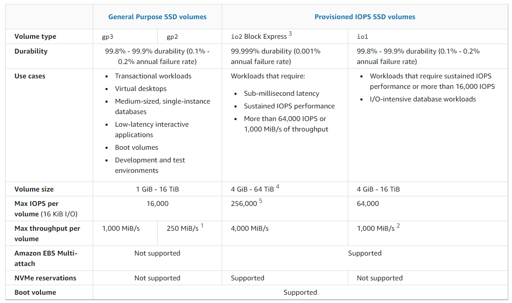
# Hard disk drives (HDD)

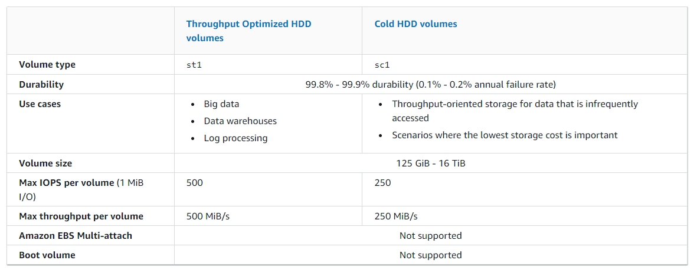
# General Purpose SSD volumes (gp3)
+ These volumes deliver a consistent baseline rate of **3,000 IOPS and 125 MiB/s**, included with the price of storage. You can provision additional **IOPS (up to 16,000) and throughput (up to 1,000 MiB/s)** for an additional cost.
+ The maximum ratio of provisioned IOPS to provisioned volume size is **500 IOPS per GiB**. The maximum ratio of provisioned throughput to provisioned IOPS is **.25 MiB/s per IOPS**. 
+ 32 GiB or larger: 500 IOPS/GiB x 32 GiB = 16,000 IOPS
+ 8 GiB or larger and 4,000 IOPS or higher: 4,000 IOPS x 0.25 MiB/s/IOPS = 1,000 MiB/s
+  A `gp3` volume can range in size from **1 GiB to 16 TiB**.
# General Purpose SSD volumes (gp2)
+ These volumes deliver single-digit millisecond latencies and the ability to **burst to 3,000 IOPS** for extended periods of time.
+ Between a minimum of **100 IOPS (at 33.33 GiB and below) and a maximum of 16,000 IOPS (at 5,334 GiB and above)**, baseline performance scales linearly at **3 IOPS per GiB** of volume size. For example, a 100 GiB `gp2` volume has a baseline performance of 300 IOPS.
+ A `gp2` volume can range in size from **1 GiB to 16 TiB**.
+ The **performance of `gp2` volumes is tied to volume size**, which determines the baseline performance level of the volume and how quickly it accumulates I/O credits; larger volumes have higher baseline performance levels and accumulate I/O credits faster. 
+ Each volume receives an **initial I/O credit balance of 5.4 million I/O credits**, which is enough to sustain the maximum burst performance of **3,000 IOPS for at least 30 minutes**.
+ The **maximum I/O credit balance** for a volume is equal to the initial credit balance (5.4 million I/O credits).
+ Burst duration = (Credit balance) /((Burst IOPS) + 3(Volume size in GiB))+ 
 
    | Volume size (GiB) | Baseline performance (IOPS) | Burst duration when driving sustained 3,000 IOPS (second) | Seconds to fill empty credit balance when driving no IO |
    | --- | --- | --- | --- |
    | 1 | 100 | 1,802 | 54,000 | 
    | 100 | 300 | 2,000 | 18,000 | 
    | 250 | 750 | 2,400 | 7,200 |  
    | 334 (Min. size for max throughput) | 1,002 | 2,703 | 5,389 |  
    | 500 | 1,500 | 3,600 | 3,600 | 
    | 750 | 2,250 | 7,200 | 2,400 | 
    | 1,000 | 3,000 | N/A* | N/A* |  
    | 5,334 (Min. size for max IOPS) | 16,000 | N/A* | N/A* |  
    | 16,384 (16 TiB, max volume size) | 16,000 | N/A* | N/A* | 
+ Throughput in MiB/s = ((Volume size in GiB) × (IOPS per GiB) × (I/O size in KiB))
# Provisioned IOPS SSD volumes
+ Provisioned IOPS SSD volumes can range in size from **4 GiB to 16 TiB** and you can provision from **100 IOPS up to 64,000 IOPS** per volume.
+ You can achieve up to **64,000 IOPS only on [Instances built on the Nitro System](https://docs.aws.amazon.com/AWSEC2/latest/UserGuide/instance-types.html#ec2-nitro-instances)**. On other instance families you can achieve performance up to **32,000 IOPS**. 
+ The maximum ratio of provisioned IOPS to requested volume size (in GiB) is **50:1 for `io1` volumes, and 500:1 for `io2` volumes**.
    + `io1` volume 1,280 GiB in size or greater (50 × 1,280 GiB = 64,000 IOPS)
    + `io2` volume 128 GiB in size or greater (500 × 128 GiB = 64,000 IOPS)
+ **`io2` Block Express** volumes is the **next generation** of Amazon EBS storage server architecture
+ With `io2` Block Express volumes, you can provision volumes with: 
    + Sub-millisecond average latency
    + Storage capacity up to **64 TiB**(65,536 GiB)
    + Provisioned IOPS up to **256,000, with an IOPS:GiB ratio of 1,000:1.** Maximum IOPS can be provisioned with volumes 256 GiB in size and larger (1,000 IOPS x 256 GiB = 256,000 IOPS).
    + Volume throughput up to **4,000 MiB/s**.
# Throughput Optimized HDD volumes
+ **Volume size determines the baseline throughput** of your volume, which is the rate at which the volume accumulates throughput credits.
+ **Volume size also determines the burst throughput** of your volume, which is the rate at which you can spend credits when they are available. 

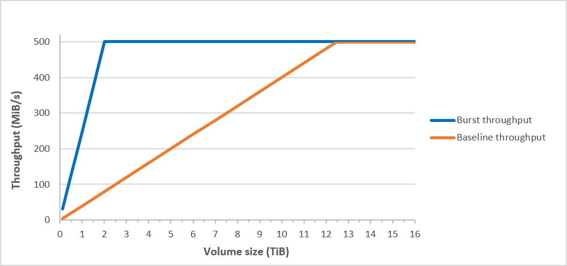

# Cold HDD volumes
+ **Volume size determines the baseline throughput** of your volume, which is the rate at which the volume accumulates throughput credits.
+ **Volume size also determines the burst throughput** of your volume, which is the rate at which you can spend credits when they are available. 

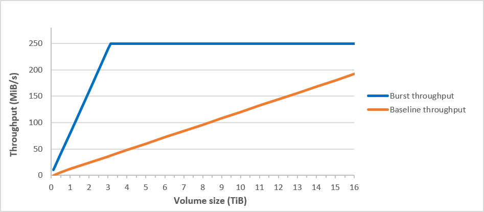

# Amazon EBS Multi-Attach
+ Multi-Attach enabled volumes can be attached to up to **16 Linux instances built on the [Nitro System](https://docs.aws.amazon.com/AWSEC2/latest/UserGuide/instance-types.html#ec2-nitro-instances)** that are **in the same Availability Zone**. 
+ Using Multi-Attach with a standard file system can result in data corruption or loss, so this not safe for production workloads. You can use a **clustered file system** to ensure data resiliency and reliability for production workload
+ Multi-Attach enabled volumes **do not support I/O fencing**.
+ Multi-Attach enabled volumes **can't be created as boot volumes**.
+ You can **enable Multi-Attach** for `io1` and `io2` volumes **during creation**. 
    + You can also **enable Multi-Attach for `io2` volumes after they have been created**.
    + You **can not enable/disable Multi-Attach for `io1` volumes after they have been created**.
+ Multi-Attach enabled volumes are deleted on instance termination if the **last attached instance** is terminated and if that instance is configured to **delete the volume on termination**.
# Amazon EBS snapshots
+ You can back up the data on your Amazon EBS volumes to Amazon S3 by taking **point-in-time snapshots**.
+ Snapshots are**incremental** backups
+ When you create an EBS volume based on a snapshot,The replicated volume **loads data in the background** so that you can **begin using it immediately**
+ **Multi-volume snapshots** allow you to take exact point-in-time, data coordinated, and crash-consistent snapshots across multiple EBS volumes attached to an EC2 instance.
+ A snapshot is **constrained to the AWS Region where it was created**. After you create a snapshot of an EBS volume, you can use it to create new volumes in the same Region.
+ You can also **copy snapshots across Regions**, making it possible to use multiple Regions for geographical expansion, data center migration, and disaster recovery. 
+ EBS snapshots fully support EBS encryption. 
+ Snapshots of encrypted volumes are automatically encrypted.
+ Volumes that you create from encrypted snapshots are automatically encrypted.
+ Volumes that you create from an unencrypted snapshot that you own or have access to can be encrypted on-the-fly.
+ When you copy an unencrypted snapshot that you own, you can encrypt it during the copy process.
+ When you copy an encrypted snapshot that you own or have access to, you can reencrypt it with a different key during the copy process.
+ The first snapshot you take of an encrypted volume that has been created from an unencrypted snapshot is always a full snapshot.
+ The first snapshot you take of a reencrypted volume, which has a different CMK compared to the source snapshot, is always a full snapshot.
+ By default, snapshots of EBS volumes on an Outpost are stored in Amazon S3 in the Region of the Outpost. You can also use Amazon EBS local snapshots on Outposts to store snapshots of volumes on an Outpost locally in Amazon S3 on the Outpost itself.
## Create Amazon EBS snapshots
+ Relations among multiple snapshots of the same volume 

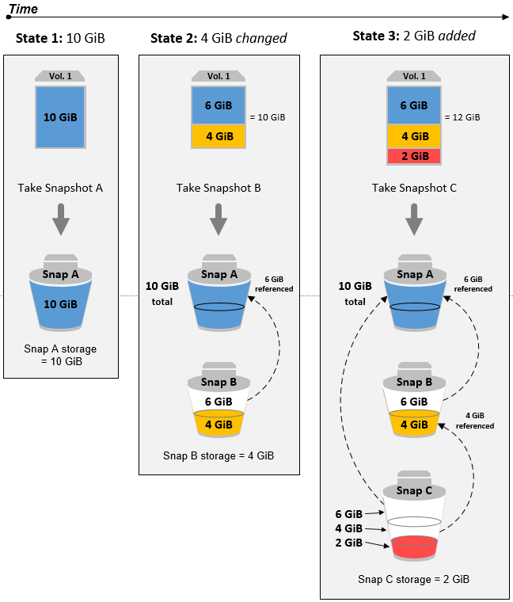
+ Relations among incremental snapshots of different volumes

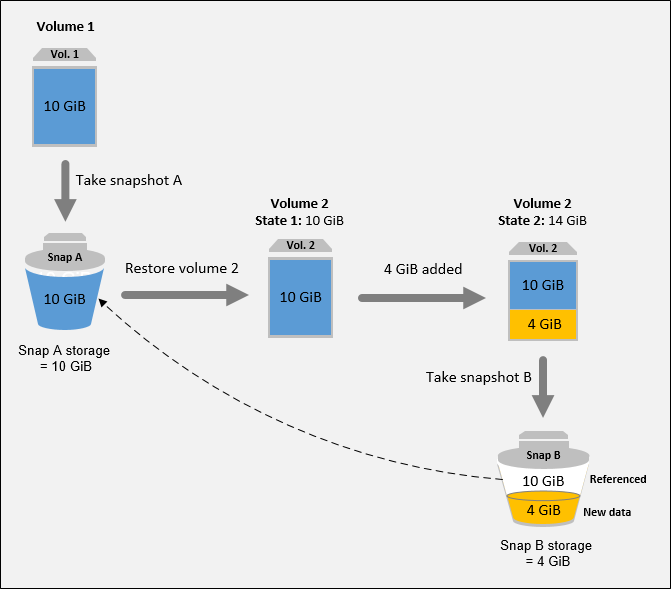
## Delete an Amazon EBS snapshot
+ To delete multi-volume snapshots, **retrieve all of the snapshots** for your multi-volume snapshot set using the tag you applied to the set when you created the snapshots. Then, **delete the snapshots individually**.
+ Deleting a snapshot with some of its data referenced by another snapshot

# Amazon Data Lifecycle Manager
+ You can use Amazon Data Lifecycle Manager to **automate** the creation, retention, and deletion of EBS snapshots and EBS-backed AMIs.
+ An Amazon Data Lifecycle Manager policy (described later) targets an instance or volume for backup **using a single tag**.
+ You can create up to **100 lifecycle policies per Region**.
+ You can add up to 45 tags per resource.
## Lifecycle policies
+ **Policy type**—Defines the **type of resources** that the policy can manage. Amazon Data Lifecycle Manager supports two types of lifecycle policies: 
    + **Snapshot lifecycle policy**—Used to automate the lifecycle of EBS snapshots. 
    + **EBS-backed AMI lifecycle policy**—Used to automate the lifecycle of EBS-backed AMIs.+ **Cross-account copy event policy**—Used to automate the copying of snapshots across accounts. This policy type should be **used in conjunction with an EBS snapshot policy** that shares snapshots across accounts.
+ **Resource type**—Defines **the type of resources** that are targeted by the policy. 
+ Use `VOLUME` to create snapshots of individual volumes, or use `INSTANCE` to create multi-volume snapshots of all of the volumes that are attached to an instance. 
+ **AMI lifecycle policies can target instances only**.
+ **Snapshot lifecycle policies can target instances or volumes**. 
+ **Target tags**—Specifies **the tags** that must be assigned to an EBS volume or an Amazon EC2 instance for it to be **targeted by the policy**.
+ **Schedules**—The start times and intervals for creating snapshots or AMIs. 
+ **Retention**—Specifies **how snapshots** or AMIs are to be **retained**.
## Policy schedules
+ Policy schedules define **when** snapshots or AMIs are created by the policy. 
+ Policies can have **up to four schedules**—one mandatory schedule, and up to three optional schedules.
+ Adding multiple schedules to a single policy lets you **create snapshots or AMIs at different frequencies** using the same policy
+ If multiple schedules are initiated at the same time, Amazon Data Lifecycle Manager creates only one snapshot or AMI and applies the retention settings of the schedule that has the **highest retention period**. 
# Amazon EBS data services
## Amazon EBS Elastic Volumes
+ With Amazon EBS Elastic Volumes, you can **increase the volume size, change the volume type, or adjust the performance** of your EBS volumes.
+ If your instance supports Elastic Volumes, you can do so **without detaching the volume or restarting the instance**. 
+ Linux AMIs require a GUID partition table (GPT) and GRUB 2 for boot volumes that are 2 TiB (2,048 GiB) or larger. 
+ You **can't decrease the size** of an EBS volume. 
+ If you cannot use Elastic Volumes but you need to modify the root (boot) volume, you must **stop the instance, modify the volume, and then restart the instance**.
+ Elastic Volumes are supported on the following instances: 
    + All **[current-generation instances](https://docs.aws.amazon.com/AWSEC2/latest/UserGuide/instance-types.html#AvailableInstanceTypes)**
    + The following previous-generation instances: C1, C3, CC2, CR1, G2, I2, M1, M3, and R3
+ After you increase the size of an EBS volume, you must **use file system–specific commands to extend the file system** to the larger size.
## Amazon EBS encryption
+ Amazon EBS encryption uses **AWS KMS keys** when creating encrypted volumes and snapshots.
+ How EBS encryption works when the snapshot is encrypted 
    + Amazon EC2 sends a [GenerateDataKeyWithoutPlaintext](https://docs.aws.amazon.com/kms/latest/APIReference/API_GenerateDataKeyWithoutPlaintext.html) request to AWS KMS, **specifying the KMS key** that you chose for volume encryption.
    + AWS KMS **generates a new data key, encrypts it under the KMS key** that you chose for volume encryption, and sends the encrypted data key to Amazon EBS to be **stored with the volume metadata**.
    + When you attach the encrypted volume to an instance, Amazon EC2 sends a [CreateGrant](https://docs.aws.amazon.com/kms/latest/APIReference/API_CreateGrant.html) request to AWS KMS so that it can decrypt the data key.
    + AWS KMS **decrypts the encrypted data key** and sends the decrypted data key to Amazon EC2.
    + Amazon EC2 **uses the plaintext data key in hypervisor memory to encrypt disk I/O** to the volume. The plaintext data key **persists in memory as long as the volume is attached to the instance**.
+ Your data key never appears on disk in plaintext.
+ When you **create a new, empty EBS volume**, you can encrypt it by enabling encryption for the specific volume creation operation.
+ Although there is **no direct way to encrypt an existing unencrypted volume or snapshot**, you can encrypt them by creating either a volume or a snapshot.
+ Restore an unencrypted volume (encryption by default not enabled) 
    + Without encryption by default enabled, a volume restored from an unencrypted snapshot is unencrypted by default. However, you can encrypt the resulting volume by setting the `Encrypted` parameter and, optionally, the `KmsKeyId` parameter.
    
    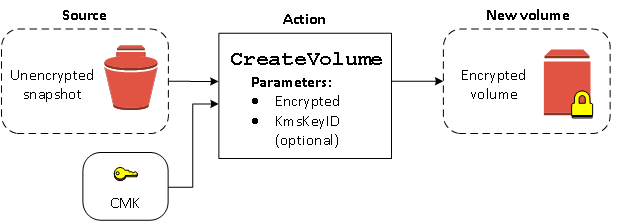
+ Restore an unencrypted volume (encryption by default enabled) 
    + When you have enabled encryption by default, encryption is mandatory for volumes restored from unencrypted snapshots, and no encryption parameters are required for your default KMS key to be used.+ 
    
    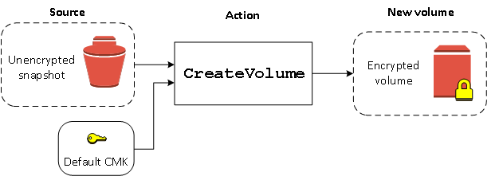

+ Copy an unencrypted snapshot (encryption by default not enabled) 
    + Without encryption by default enabled, a copy of an unencrypted snapshot is unencrypted by default. However, you can encrypt the resulting snapshot by setting the `Encrypted` parameter and, optionally, the `KmsKeyId` parameter.
    
    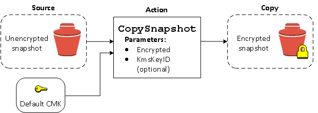
+ Copy an unencrypted snapshot (encryption by default enabled) 
    + When you have enabled encryption by default, encryption is mandatory for copies of unencrypted snapshots, and no encryption parameters are required if your default KMS key is used. 
    
    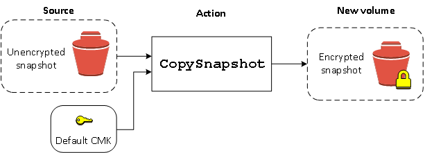 
+ Re-encrypt an encrypted volume 
    + When the `CreateVolume` action operates on an encrypted snapshot, you have the option of re-encrypting it with a different KMS key. 
    
    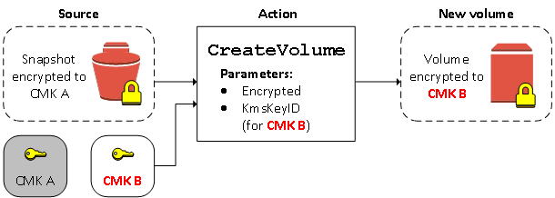
+ Re-encrypt an encrypted snapshot 
    + The ability to encrypt a snapshot during copying allows you to apply a new symmetric KMS key to an already-encrypted snapshot that you own.+ 

    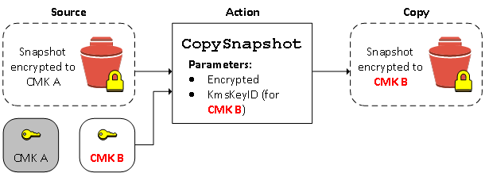
## Amazon EBS fast snapshot restore
+ Amazon EBS fast snapshot restore enables you to create a volume from a snapshot that is **fully initialized at creation**. 
+ Fast snapshot restore must be explicitly enabled on a **per-snapshot basis**. 
+ You can enable **up to 50** snapshots for fast snapshot restore per Region.
# Amazon EBS–optimized instances
+ EBS–optimized instances deliver **dedicated bandwidth** to Amazon EBS.
## RAID configuration
+ With Amazon EBS, you can use any of the standard **RAID configurations** that you can use with a traditional bare metal server, as long as that particular RAID configuration is supported by the operating system for your instance. This is because all RAID is accomplished at the software level.
+ Amazon EBS volume data is **replicated across multiple servers in an Availability Zone** to prevent the loss of data from the failure of any single component. 
+ Creating a RAID 0 array allows you to achieve a **higher level of performance for a file system** than you can provision on a single Amazon EBS volume.
+ Use RAID 0 when **I/O performance is of the utmost importance**.
+ The resulting size of a RAID 0 array is **the sum of the sizes** of the volumes within it, and **the bandwidth is the sum** of the available bandwidth of the volumes within it.
+ To create a consistent set of snapshots for your RAID array, use **Multi-volume snapshots**
# General pricing structure
+ Your costs are calculated based on the provisioned amounts.
+ Pricing rates are quoted per GB per month (GB-month) for volumes, IOPS per month (IOPS-month) for provisioned IOPS, and MB/s per month (MB/s-month) for provisioned throughput. 
+ Provisioned volume size
    + For volume size, your provisioned volume size is used to calculate your costs. 
    + Provisioned volume size is used to calculate costs for all EBS volume types. 
    + For example, a volume provisioned as 100 GB for 30 days would be charged at 100 GB times the per GB-month rate.
        + ((Provisioned GB volume size) * (price per GB-month)) / (1 month)
+ For provisioned IOPS, your provisioned IOPS amount in excess of the baseline or included IOPS is used to calculate your costs. If the volume type includes a tiered pricing structure, further calculations per usage tier are performed. 
    + Provisioned IOPS is used to calculate costs for gp3, io1, and io2 EBS volume types. 
    + Tiered pricing is used to calculate costs for io2 EBS volume types.
    + The amount of IOPS you can provision is subject to a ratio of IOPS-to-volume size. The ratio is the number of IOPS available for every GB of provisioned volume size. Applying the ratios to reach the same IOPS performance goal impacts the minimum size of the volume for each volume type.
        + gp3 volumes have a 500:1 ratio.
        + io1 volumes have a 50:1 ratio.
        + io2 volumes have a 500:1 ratio.
    + For example, gp3 volumes include 3,000 provisioned IOPS. If you provision 8,000 IOPS, your cost is based on the 5,000 IOPS that are in excess of the 3,000 IOPS base amount. 
        + (((Provisioned IOPS amount) + (base IOPS amount)) * (price per IOPS-month)) / (1 month)
    + To achieve 8,000 IOPS, you would need a minimum gp3 volume size of 16 GB. 
        + (Desired IOPS) / (volume type ratio per provisioned GB) = (minimum provisioned volume size)
        + (8,000 IOPS) / (500:1 ratio) = (minimum 16 GB provisioned volume)
+ Provisioned throughput
    + For provisioned throughput, the provisioned throughput amount in excess of the baseline or included throughput amount is used to calculate your costs. 
    + Provisioned throughput is used to calculate costs for gp3 EBS volume types.
    + For example, gp3 volumes include 125 MB/s of provisioned throughput. If you provision 500 MB/s throughput, your costs are based on the 375 MB/s in excess of the 125 MB/s base throughput amount. 
        + (((Provisioned MB/s throughput) + (base MB/s throughput)) * (price per MB/s-month)) / (1 month)
+ General Purpose SSD gp2 volumes
    + Volume storage for General Purpose SSD gp2 volumes is charged by the amount you provision in GB per month until you release the storage. Provisioned storage for gp2 volumes will be billed in per-second increments, with a minimum of 60 seconds. I/O is included in the price of the volumes, so you pay only for each GB of storage you provision. 
    + Performance for gp2 volumes is scaled by adjusting the provisioned volume size. gp2 volumes do not support separate provisioned IOPS or provisioned throughput options.
    + Pricing example:
    + Scenario: You provision a 2,000 GB gp2 volume for 12 hours (43,200 seconds) in a 30-day month and the price is $0.10 per GB-month for the AWS Region you select. 
    + Your costs are calculated for the volume size using the formula for hours.
    + ((Rate per GB-month) * (volume size) * (time period)) / (time period units per month)
    + ($0.10 per GB-month * 2,000 GB * 12 hours) / (720 hours per month) = $3.33 for the volume
+ General Purpose SSD gp3 volumes
    + Volume storage for General Purpose SSD gp3 volumes is charged by the amount you provision in GB per month until you release the storage. All gp3 volumes include a free baseline performance of 3,000 provisioned IOPS and 125 provisioned MB/s throughput. 
    + Additional IOPS and throughput can be provisioned independently from the volume size; they are charged by the amount you provision in IOPS per month and MB/s per month until you release the IOPS or throughput. 
    + Provisioned storage, provisioned IOPS, and provisioned throughput for gp3 volumes are billed in per-second increments, with a minimum of 60 seconds.
    + Pricing example:
    + Scenario: You provision a 2,000 GB gp3 volume for 12 hours (43,200 seconds) in a 30-day month and the price is $0.08 per GB-month for the AWS Region you select. Additionally, you provision 10,000 IOPS at $0.005 per provisioned IOPS-month and provision 500 MB/s at $0.06 per provisioned MB/s-month.
    + Your costs are calculated for the volume size, the provisioned IOPS, and the provisioned throughput using the formula for hours.
    + ((Calculate the volume pricing for time period) + (provisioned IOPS pricing for time period) + (provisioned throughput pricing for time period)) / (time period units per month)
    + ((Rate per GB-month) * (volume size) * (time period)) +
    + ((rate per IOPS-month) * ((provisioned IOPS) + (base IOPS)) * (time period)) +
    + ((rate per MB/s-month) * ((provisioned MB/s) + (base MB/s)) * (time period)) /
    + (time period units per month)
    + (($0.08 per GB-month * 2,000 GB * 12 hours) + ($0.005 * (10,000 IOPS + 3,000 IOPS) * 12 hours) + ($0.06 * (500 MB/s + 125 MB/s) * 12 hours)) / (720 hours per month) = $3.63 for the volume
+ Provisioned IOPS SSD io1 volumes
    + Volume storage for Provisioned IOPS SSD io1 volumes is charged by the amount you provision in GB per month until you release the storage. 
    + With Provisioned IOPS SSD io1 volumes, you are also charged by the amount you provision in IOPS per month. With Provisioned IOPS SSD io1 volumes, no baseline IOPS is provided. You are charged for your total provisioned IOPS amount.
    + Provisioned storage and provisioned IOPS for io1 volumes are billed in per-second increments, with a minimum of 60 seconds.
    + Pricing example:
    + Scenario: You provision a 2,000 GB io1 volume for 12 hours (43,200 seconds) in a 30-day month and the price is $0.125 per GB-month for the AWS Region you select. Additionally, you provision 1,000 IOPS at $0.065 per provisioned IOPS-month.
    + Your costs are calculated for the volume size, the provisioned IOPS, and the provisioned throughput using the formula for hours.
    + ((Calculate the volume pricing for time period) + (provisioned IOPS pricing for time period) / (time period units per month)
    + (((Rate per GB-month) * (volume size) * (time period)) +
    + ((rate per IOPS-month) * (provisioned IOPS) * (time period))) /
    + (time period units per month)
    + (($0.125 per GB-month * 2,000 GB * 12 hours) + ($0.065 * 1,000 IOPS * 12 hours))  / (720 hours per month) = ($3,000 + $780) / (720 hour per month) = $5.25 for the volume
+ Provisioned IOPS SSD io2 volumes
    + Volume storage for Provisioned IOPS SSD io2 volumes is charged by the amount you provision in GB per month until you release the storage. 
    + With Provisioned IOPS SSD io2 volumes, you are also charged by the amount you provision in IOPS per month. The provisioned IOPS charges for io2 volumes are tiered. Therefore, as you provision higher IOPS on a single volume, the effective provisioned IOPS charges decrease, making it more economical to scale IOPS on a single volume.
    + io2 and io2 Block Express provisioned IOPS tiers:
        + Tier 1 – Up to 32,000 IOPS
        + Tier 2 – 32,001 IOPS to 64,000 IOPS
        + Tier 3 – Over 64,000 IOPS
        + Tier 3 applies only to io2 Block Express volumes attached to EC2 instances that are supported by io2 Block Express.
    + Provisioned storage and provisioned IOPS for io1 and io2 volumes are billed in per-second increments, with a minimum of 60 seconds.
    + Pricing examples:
    + Scenario 1: You provision a 2,000 GB io2 volume for 12 hours (43,200 seconds) in a 30-day month and the price is $0.125 per GB-month for the AWS Region + you select. Additionally, you provision 1,000 IOPS at $0.065 per provisioned IOPS-month for the first 32,000 IOPS.
        + Your costs are calculated for the volume size, the provisioned IOPS, and the provisioned throughput using the formula for hours.
        + ((Calculate the volume pricing for time period) + (provisioned IOPS pricing for time period) / (time period units per month)
        + (((Rate per GB-month) * (volume size) * (time period)) +
        + ((rate per IOPS-month) * (provisioned IOPS) * (time period))) /
        + (time period units per month)
        + (($0.125 per GB-month * 2,000 GB * 12 hours) + ($0.065 * 1,000 IOPS * 12 hours))  / (720 hours per month) = ($3,000 + $780) / (720 hour per month) = $5.25 for the volume
    + Scenario 2: You provision a 2,000 GB io2 volume for 12 hours (43,200 seconds) in a 30-day month and the price is $0.125 per GB-month for the AWS Region you select. Additionally, you provision 60,000 IOPS for 12 hours. Your rate is $0.065 per provisioned IOPS-month for the first 32,000 IOPS and $0.046 for the 28,000 IOPS.
        + Your costs are calculated for the volume size, the provisioned IOPS, and the provisioned throughput using the formula for hours.
        + ((Calculate the volume pricing for time period) + (tier 1 provisioned IOPS pricing for time period) + (tier 2 provisioned IOPS pricing for time period)) / (time period units per month)
        + (((Rate per GB-month) * (volume size) * (time period)) +
        + ((tier 1 rate per IOPS-month) * (provisioned IOPS) * (time period)) +
        + ((tier 2 rate per IOPS-month) * (provisioned IOPS) * (time period))) /
        + (time period units per month)
        + (($0.125 per GB-month * 2,000 GB * 12 hours) + ($0.065 * 32,000 IOPS * 12 hours) + ($0.046 * 28,000 IOPS * 12 hours))  / (720 hours per month) = ($3,000 + $24,960 + $15,456) / (720 hour per month) = $60.30 for the volume

+ Throughput Optimized HDD st1 volumes
    + Volume storage for Throughput Optimized HDD (st1) volumes is charged by the amount you provision in GB per month until you release the storage. Provisioned storage for st1 volumes are billed in per-second increments with a minimum of 60 seconds. I/O is included in the price of the volumes, so you pay only for each GB of storage you provision.
    + Performance for st1 volumes is scaled by increasing or decreasing the provisioned volume size. st1 volumes do not support separate provisioned IOPS or provisioned throughput options.
    + Pricing example:
    + Scenario: You provision a 2,000 GB st1 volume for 12 hours (43,200 seconds) in a 30-day month and the price is $0.045 per GB-month for the AWS Region you select. 
    + Your costs are calculated for the volume size using the formula for hours.
    + ((Rate per GB-month) * (volume size) * (time period)) / (time period units per month)
    + ($0.045 per GB-month * 2,000 GB * 12 hours) / (720 hours per month) = $1.50 for the volume
+ Cold HDD sc1 volumes
    + Volume storage for Cold HDD (sc1) volumes is charged by the amount you provision in GB per month until you release the storage. Provisioned storage for sc1 volumes will be billed in per-second increments, with a minimum of 60 seconds. I/O is included in the price of the volumes, so you pay only for each GB of storage you provision.
    + Performance for sc1 volumes is scaled by increasing or decreasing the provisioned volume size. sc1 volumes do not support separate provisioned IOPS or provisioned throughput options.
    + Pricing example:
    + Scenario: You provision a 2,000 GB st1 volume for 12 hours (43,200 seconds) in a 30-day month and the price is $0.015 per GB-month for the AWS Region you select. 
    + Your costs are calculated for the volume size using the formula for hours.
    + ((Rate per GB-month) * (volume size) * (time period)) / (time period units per month)
    + ($0.015 per GB-month * 2,000 GB * 12 hours) / (720 hours per month) = $0.50 for the volume

# EBS Volume Type Pricing Comparisons
+ gp2 – With gp2 volumes, you increase the provisioned volume capacity to increase sustained IOPS and throughput performance. 
    + For every 3 IOPS required, you must provision 1 GB of storage. For example, to reach 900 sustained IOPS the minimum provisioned capacity is 300 GB.
    + No option is available to separately provision IOPS for gp2 volumes.
    + Your costs are based on the provisioned volume capacity.
+ gp3 – With gp3 volumes, you provision your volume capacity and can provision IOPS and throughput separately.
    + gp3 volumes include 3,000 IOPS and 125 MB/s throughput.
    + Provisioned IOPS uses a 500:1 IOPS ratio for each GB of provisioned capacity. For example, to reach 5,000 sustained IOPS, the minimum provisioned capacity is 10 GB.
    + Your costs are based on the provisioned volume capacity plus the provisioned IOPS above 3,000 IOPS and provisioned throughput above 125 MB/s.
+ io1 – With io1 volumes, you provision both your volume capacity and IOPS separately.
    + io1 volumes do not include a baseline of provisioned IOPS.
    + Provisioned IOPS uses a 50:1 IOPS ratio for each GB of provisioned capacity. For example, to reach 5,000 sustained IOPS, the minimum provisioned capacity is 100 GB.
    + Your costs are based on the provisioned volume capacity plus the provisioned IOPS.
    + Provisioned IOPS are charged at a flat rate up to the maximum of 64,000 IOPS.
+ io2 – With io2 volumes, you provision both your volume capacity and IOPS separately.
    + io2 volumes do not include a baseline of provisioned IOPS.
    + Provisioned IOPS uses a 500:1 IOPS ratio for each GB of provisioned capacity. For example, to reach 50,000 sustained IOPS, the minimum provisioned capacity is 100 GB.
    + Your costs are based on the provisioned volume capacity plus the provisioned IOPS.
    + Provisioned IOPS are charged using a tiered structure. Tier 1 is up to 32,000 IOPS. Tier 2 is 32,001 to 64,000 IOPS, and Tier 3 is over 64,000 IOPS. 
# Choose an EBS Volume

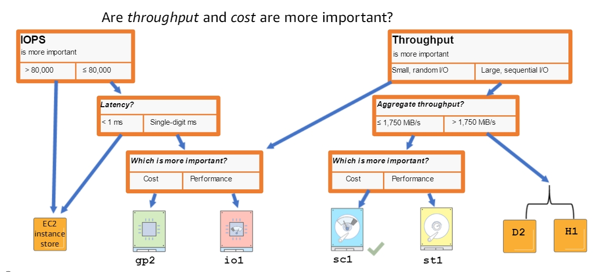
# Reference
+ [Amazon EBS](https://docs.aws.amazon.com/AWSEC2/latest/UserGuide/AmazonEBS.html)
+ [Amazon Elastic Block Store (Amazon EBS) Primer](https://explore.skillbuilder.aws/learn/course/1644/amazon-elastic-block-store-amazon-ebs-primer)
+ [Deep Dive: Amazon Elastic Block Store (Amazon EBS) Cost Optimization](https://explore.skillbuilder.aws/learn/course/10143/deep-dive-amazon-elastic-block-store-amazon-ebs-cost-optimization)
+ [Deep Dive into Amazon Elastic Block Store (EBS)](https://explore.skillbuilder.aws/learn/course/139/deep-dive-into-amazon-elastic-block-store-ebs)
