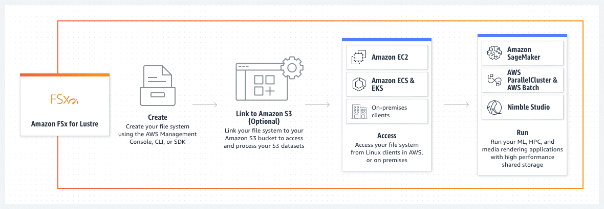
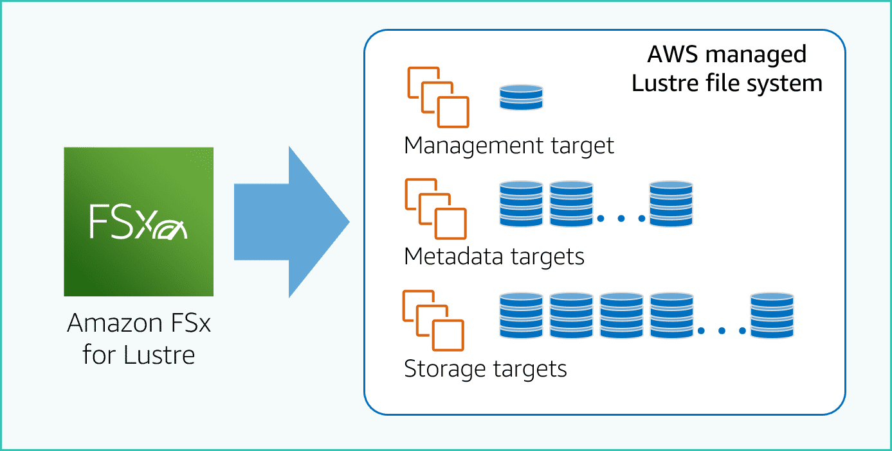
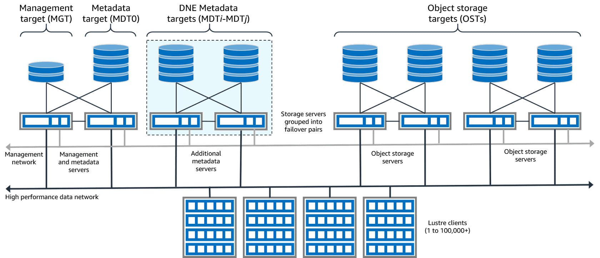
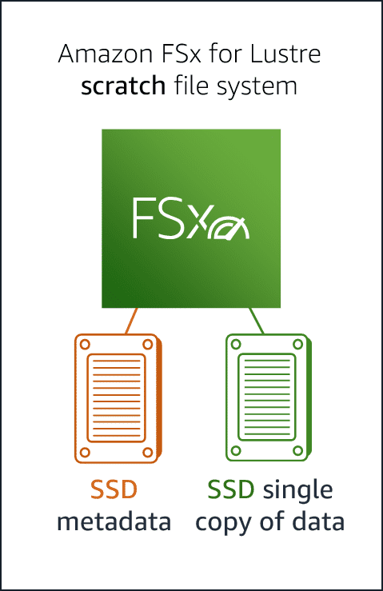
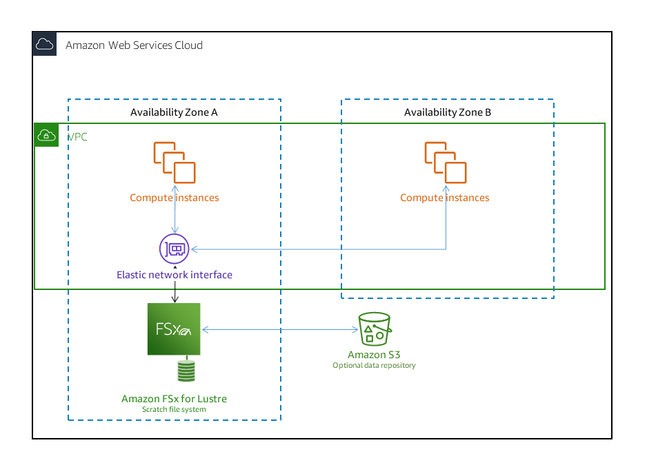
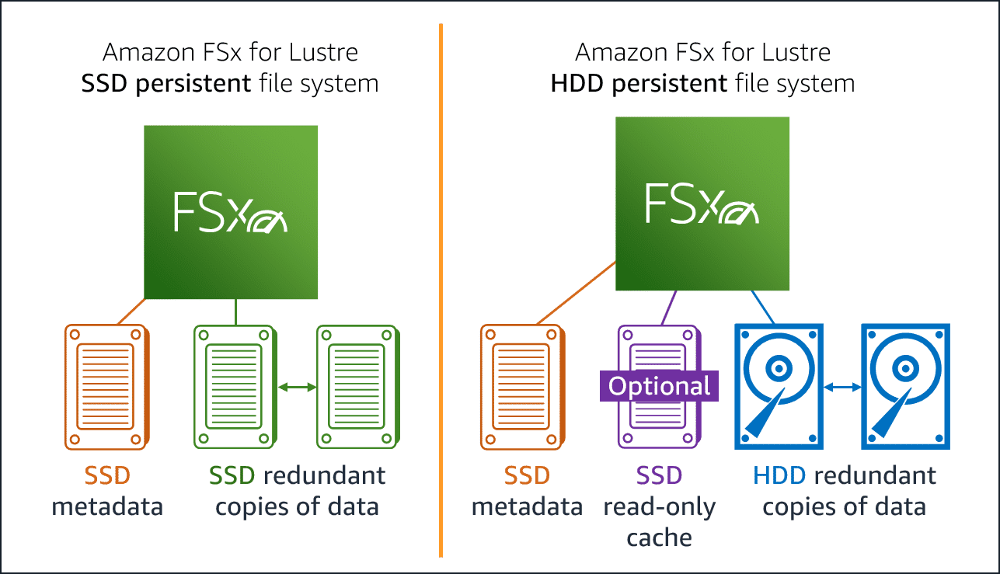
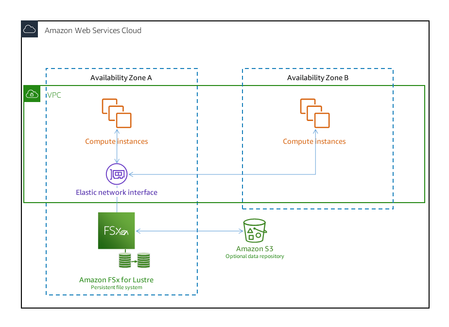
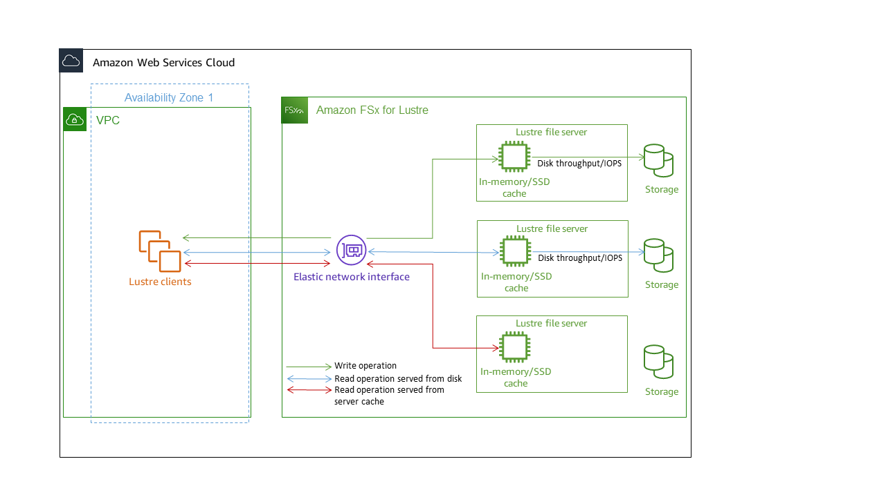

# Overview

+ FSx for Lustre is an implementation of the Lustre file system that provides **shared access to files from a large number of hosts in the AWS Cloud**. With FSx for Lustre mounted, your Amazon EC2 instances and Amazon EKS containers see your FSx for Lustre file system as a native drive.
+ FSx for Lustre makes it easy and cost-effective to launch and run the popular, **high-performance Lustre file system**.
+ You use Lustre for workloads where **speed matters**, such as **machine learning, high performance computing (HPC), video processing, and financial modeling**.
+ The open-source Lustre file system is designed for applications that require **fast storage**—where you want your storage to keep up with your compute.
+  It provides **sub-millisecond latencies, up to hundreds of GBps of throughput, and up to millions of IOPS**.
+ As a **fully managed service**, Amazon FSx makes it easier for you to use Lustre for workloads where storage speed matters. FSx for Lustre eliminates the traditional complexity of setting up and managing Lustre file systems, enabling you to spin up and run a battle-tested high-performance file system in minutes. It also provides multiple deployment options so you can optimize cost for your needs.
+ FSx for Lustre is **POSIX-compliant**, so you can use your current Linux-based applications without having to make any changes.
+ FSx for Lustre provides **a native file system interface** and works as any file system does with your **Linux operating system**. 
+ It also provides **read-after-write consistency and supports file locking**.
+ FSx for Lustre **runs in a single Availability Zone within an AWS Region**, which increases performance and reduces latency.
+ To optimize compute performance and minimize latency, **run your compute instances in the same Availability Zone as your FSx for Lustre file system**
+ FSx for Lustre provides high-performance file access for **Linux-based workloads**. 
# Lustre file system architecture
+ Lustre is based on a client-server architecture consisting of three classes of servers. 
    + The **management server** provides configuration information or file system registries. 
    + **Metadata servers** record file system namespaces or inodes. The metadata servers also maintain the file system index.
    + **Object storage servers** record file content in distributed binary objects. 
        + A single file is composed of one or more objects.
        + The data for that file is organized in stripes across the objects. 
        + Objects are distributed across the available storage targets.

# Multiple deployment options
+ FSx for Lustre provides a high performance, parallel file system that **stores data across multiple network file servers** to maximize performance and reduce bottlenecks. 
    + These servers have multiple disks.
    + To spread load, Amazon FSx **shards file system data into smaller chunks and spreads them across disks and servers using a process called striping**
+ It's a **best practice to link a highly durable long-term data repository residing on Amazon S3 with your FSx** for Lustre high-performance file system.
+ Amazon FSx for Lustre offers a choice of **scratch and persistent file systems** to accommodate different data processing needs.
    + Both deployment options support solid state drive (SSD) storage.
    + However, hard disk drive (HDD) storage is supported only in one of the persistent deployment types.
+ **Scratch file systems** are ideal for **temporary storage and shorter-term processing of data**. Data **is not replicated and does not persist** if a file server fails.
    
    
    + Scratch file systems **provide high burst throughput of up to six times the baseline throughput** of 200 MBps per TiB of storage capacity. 
    + Use scratch file systems when you need **cost-optimized storage for short-term, processing-heavy workloads**.

    
    + On a scratch file system, **file servers aren't replaced if they fail and data isn't replicated**. If a file server or a storage disk becomes unavailable on a scratch file system, files stored on other servers are still accessible. If clients try to access data that is on the unavailable server or disk, clients experience an immediate I/O error.
+ **Persistent file systems** are ideal for **longer-term storage and throughput-focused workloads**. In persistent file systems, **data is replicated**, and file servers are replaced if they fail.

    
    + The file servers are highly available, and data is **automatically replicated within the same Availability Zone** in which the file system is located.
    + The **data volumes** attached to the file servers are **replicated independently from the file servers** to which they are attached.
    + Amazon FSx continuously monitors persistent file systems for hardware failures, and automatically replaces infrastructure components in the event of a failure.
    + On a persistent file system, if a file server becomes unavailable, it's replaced automatically within minutes of failure. During that time, client requests for data on that server transparently retry and eventually succeed after the file server is replaced.
    + Data on persistent file systems is replicated on disks, and any failed disks are **automatically replaced transparently**.
    + Use persistent file systems for **longer-term storage and for throughput-focused workloads** that run for extended periods or indefinitely, and that might be sensitive to disruptions in availability.

    
# Multiple storage options
+ Amazon FSx for Lustre offers a choice of **solid state drive (SSD) and hard disk drive (HDD) storage types** that are optimized for different data processing requirements:
    + **SSD storage options** – For **low-latency, IOPS-intensive workloads** that typically have **small, random file operations**, choose one of the SSD storage options.
    + **HDD storage options** – For **throughput-intensive workloads** that typically have **large, sequential file operations**, choose one of the HDD storage options.
+ If you are provisioning a file system with the **HDD storage option**, you can **optionally provision a read-only SSD cache** that is sized to **20 percent of your HDD storage capacity**. This provides **sub-millisecond latencies and higher IOPS for frequently accessed files**.
+ Both SSD-based and HDD-based file systems are provisioned with **SSD-based metadata servers**. As a result, **all metadata operations**, which represent the majority of file system operations, are delivered with **sub-millisecond latencies**.
# FSx for Lustre and data repositories
+ You can link FSx for Lustre file systems to data repositories on **Amazon S3 or to on-premises data stores**.
## FSx for Lustre S3 data repository integration
+ If you use Amazon S3 as a data repository, your **S3 buckets reside in the same AWS Region**.
+ FSx for Lustre integrates with Amazon S3, making it easier for you to process cloud datasets using the Lustre high-performance file system.
+ When linked to an Amazon S3 bucket, an FSx for Lustre file system **transparently presents S3 objects as files**. Amazon FSx imports listings of all existing files in your S3 bucket at file system creation.
+ Amazon FSx **can also import** listings of files added to the data repository **after the file system is created**. You can set the import preferences to match your workflow needs.
+ The file system also makes it possible for you to **write file system data back to S3**.
+ **Data repository tasks** simplify the transfer of data and metadata between your FSx for Lustre file system and its durable data repository on Amazon S3. 
+ You can **configure FSx for Lustre to automatically update metadata** in the file system as objects are added to, changed in, or deleted from your S3 bucket.
+ The **import policy** specifies how you want FSx for Lustre to update your file system as the contents change in the linked S3 bucket. A data repository association can have one of the following import policies:
    + **New** – FSx for Lustre automatically updates file and directory metadata only when new objects are added to the linked S3 data repository.
    + **Changed** – FSx for Lustre automatically updates file and directory metadata only when an existing object in the data repository is changed.
    + **Deleted** – FSx for Lustre automatically updates file and directory metadata only when an object in the data repository is deleted.
    + **Any combination of New, Changed, and Deleted** – FSx for Lustre automatically updates file and directory metadata when any of the specified actions occur in the S3 data repository. For example, you can specify that the file system is updated when an object is added to (New) or removed from (Deleted) the S3 repository, but not updated when an object is changed.
    + **No policy configured** – FSx for Lustre doesn't update file and directory metadata on the file system when objects are added to, changed in, or deleted from the S3 data repository. If you don't configure an import policy, **automatic import is disabled for the data repository association**. You can still manually import metadata changes by using an import data repository task, as described in Using data repository tasks to import changes.
+ Automatic import will not synchronize the following S3 actions with your linked FSx for Lustre file system:
    + Deleting an object using S3 object lifecycle expirations
    + Permanently deleting the current object version in a versioning-enabled bucket
    + Undeleting an object in a versioning-enabled bucket
+ Prerequisites: The following conditions are required for FSx for Lustre to automatically import new, changed, or deleted files from the linked S3 bucket:
    + The file system and its linked S3 bucket are located in the same AWS Region.
    + The S3 bucket doesn't have a misconfigured Lifecycle state.
    + Your account has the permissions required to configure and receive event notifications on the linked S3 bucket.
+ FSx for Lustre supports importing the following changes to files and directories that occur in the linked S3 bucket:
    + Changes to file contents.
    + Changes to file or directory metadata.
    + Changes to symlink target or metadata.
    + Deletions of files and directories. If you delete an object in the linked S3 bucket which corresponds to a directory in the file system (that is, an object with a key name that ends with a slash), FSx for Lustre deletes the corresponding directory on the file system only if it is empty.
## FSx for Lustre and on-premises data repositories
+ With Amazon FSx for Lustre, you can burst your data processing workloads from on-premises into the AWS Cloud by **importing data using AWS Direct Connect or AWS VPN**.
# Exporting changes to the data repository
+ You can export changes to data and POSIX metadata changes from your FSx for Lustre file system to a linked data repository.
+ To export changes from the file system, use one of the following methods.
    + Configure your file system to **automatically export** new, changed, or deleted files to your linked data repository.
    + Use an **on-demand export data repository task**.
+ Automatic export and export data repository tasks cannot run at the same time.
# Data repository tasks
+ By using **import and export data repository tasks**, you can manage the transfer of data and metadata between your FSx for Lustre file system and any of its durable data repositories on Amazon S3.
+ Data repository tasks maintain the file system's Portable Operating System Interface (POSIX) metadata, including ownership, permissions, and timestamps. Because the tasks maintain this metadata, you can implement and maintain access controls between your FSx for Lustre file system and its linked data repositories.
+ There are three types of data repository tasks:
    + **Export data repository tasks** export from your Lustre file system to a linked S3 bucket.
    + **Import data repository tasks** import from a linked S3 bucket to your Lustre file system.
    + **Release data repository tasks** release files exported to a linked S3 bucket from your Lustre file system.
        + Release data repository tasks release file data from your FSx for Lustre file system to **free up space for new files**.
        + Releasing a file **retains the file listing and metadata, but removes the local copy of that file's contents**.
        + If a user or application accesses a released file, the data is **automatically and transparently loaded back onto your file system from your linked Amazon S3 bucket**.
# Accessing FSx for Lustre file systems
+ You can mix and match the compute instance types and Linux Amazon Machine Images (AMIs) that are connected to a single FSx for Lustre file system.
+ Amazon FSx for Lustre file systems are accessible from compute workloads running on **Amazon Elastic Compute Cloud (Amazon EC2) instances, on Amazon Elastic Container Service (Amazon ECS) Docker containers, and containers running on Amazon Elastic Kubernetes Service (Amazon EKS)**.
    + **Amazon EC2** – You access your file system from your Amazon EC2 compute instances using the open-source Lustre client. Amazon EC2 instances can access your file system **from other Availability Zones within the same Amazon Virtual Private Cloud** (Amazon VPC), provided your networking configuration provides for access across subnets within the VPC. After your Amazon FSx for Lustre file system is mounted, you can work with its files and directories just as you do using a local file system.
        + To mount your Amazon FSx for Lustre file system from your Amazon EC2 instance, first **install the Lustre client**.
    + **Amazon EKS** – You access Amazon FSx for Lustre from containers running on Amazon EKS using the **open-source FSx for Lustre CSI driver**, as described in Amazon EKS User Guide. Your containers running on Amazon EKS can use high-performance persistent volumes (PVs) backed by Amazon FSx for Lustre.
    + **Amazon ECS** – You access Amazon FSx for Lustre from Amazon ECS Docker containers on Amazon EC2 instances.
+ Using FSx for Lustre, you can burst your compute-intensive workloads from on-premises into the AWS Cloud by importing data over AWS Direct Connect or AWS Virtual Private Network. You can **access your Amazon FSx file system from on-premises, copy data into your file system as-needed, and run compute-intensive workloads on in-cloud instances**.
# How FSx for Lustre file systems work
+ Each FSx for Lustre file system consists of the **file servers** that the clients communicate with, and **a set of disks attached to each file server** that store your data.
+ Each file server employs **a fast, in-memory cache to enhance performance for the most frequently accessed data**.
+ HDD-based file systems can also be provisioned with an SSD-based read cache to further enhance performance for the most frequently accessed data.
+ When a client accesses data that's stored in the in-memory or SSD cache, the file server doesn't need to read it from disk, which reduces latency and increases the total amount of throughput you can drive.

# Integrations with AWS services
+ Amazon FSx for Lustre integrates with **Amazon SageMaker as an input data source**.   
    + When using SageMaker with FSx for Lustre, your machine learning training jobs are accelerated by eliminating the initial download step from Amazon S3. Additionally, your total cost of ownership (TCO) is reduced by avoiding the repetitive download of common objects for iterative jobs on the same dataset as you save on S3 requests costs. 
+ FSx for Lustre integrates with **AWS Batch using EC2 Launch Templates**.
    + AWS Batch enables you to run batch computing workloads on the AWS Cloud, including high performance computing (HPC), machine learning (ML), and other asynchronous workloads.
     AWS Batch automatically and dynamically sizes instances based on job resource requirements.
+ FSx for Lustre integrates with **AWS ParallelCluster**.
    + AWS ParallelCluster is an AWS-supported open-source **cluster management tool used to deploy and manage HPC clusters**. It can automatically create FSx for Lustre file systems or use existing file systems during the cluster creation process.
# Migrating to Amazon FSx for Lustre using AWS DataSync
+ You can use AWS DataSync to transfer data between FSx for Lustre file systems.
+ DataSync is a data transfer service that simplifies, automates, and accelerates moving and replicating data between self-managed storage systems and AWS storage services over the internet or AWS Direct Connect.
+ DataSync can transfer your file system data and metadata, such as ownership, timestamps, and access permissions
+ Transferring files from a source to a destination using DataSync involves the following basic steps:
    + Download and deploy an agent in your environment and activate it (not required if transferring between AWS services).
    + Create a source and destination location.
    + Create a task.
    + Run the task to transfer files from the source to the destination.
# FSx for Lustre persistent file system backup
+ With FSx for Lustre, you can create automatic daily backups and manual backups of **persistent file systems that are not linked to an Amazon S3** durable data repositor
+ FSx for Lustre backups are **file-system consistent, highly durable, and incremental**. 
# Security and compliance
+ FSx for Lustre file systems support encryption at rest and in transit.
+ Amazon FSx automatically encrypts file system data at rest using **keys managed in AWS Key Management Service (AWS KMS)**.
+ Data in transit is also automatically encrypted on file systems in certain AWS Regions when accessed from supported Amazon EC2 instances.
+ An Amazon FSx file system is accessible through an elastic network interface that resides in the virtual private cloud (VPC) based on the Amazon VPC service that you associate with your file system. You access your Amazon FSx file system through its DNS name, which maps to the file system's network interface. Only resources within the associated VPC, or a peered VPC, can access your file system's network interface.
+ To further control network traffic going through your file system's network interface within your VPC, you use security groups to limit access to your file systems. A **security group** acts as a virtual firewall to control the traffic for its associated resources. 
+ Another option for securing access to the file system within your VPC is to establish **network access control lists (network ACLs)**. Network ACLs are separate from security groups, but have similar functionality to add an additional layer of security to the resources in your VPC. 
+ You can improve the security posture of your VPC by **configuring Amazon FSx to use an interface VPC endpoint**. Interface VPC endpoints are powered by AWS PrivateLink, a technology that enables you to privately access Amazon FSx APIs without an internet gateway, NAT device, VPN connection, or AWS Direct Connect connection. 
# Pricing for Amazon FSx for Lustre
+ With Amazon FSx for Lustre, there are no upfront hardware or software costs. You pay for only the resources used, with no minimum commitments, setup costs, or additional fees.
+ For scratch FSx for Lustre file systems, you pay for your use of a file system based on the configured storage capacity measured in gigabyte-months (GB-months).
+ For persistent FSx for Lustre file systems, you pay for your use of a file system based on the configured storage capacity measured in gigabyte-months (GB-months). In addition, you have three tiers of SSD-based performance and four tiers of HDD-based performance to choose from.
Backup pricing is based on the actual backed up data volume.
# FSx for Lustre features and benefits
+ Massively scalable performance
+ Seamless access to your data repositories
+ Simple and fully managed
+ Native file system interface
+ Cost-optimized for compute-intensive workloads
+ Secure and compliant
# Reference
+ [Amazon FSx for Lustre](https://docs.aws.amazon.com/fsx/latest/LustreGuide/what-is.html)
+ [Amazon FSx for Lustre Primer](https://explore.skillbuilder.aws/learn/course/90/Amazon%2520FSx%2520for%2520Lustre%2520Primer)
