# Overview

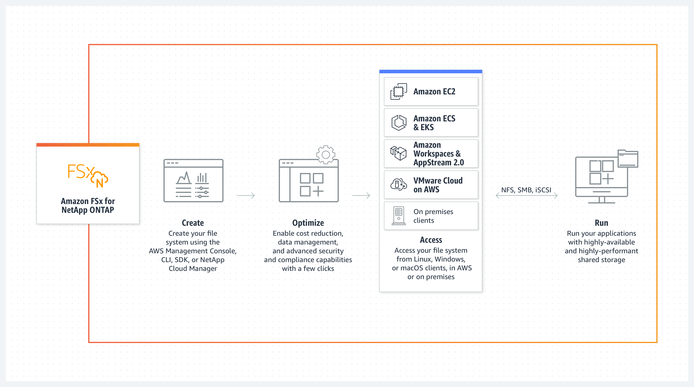
+ Amazon FSx for NetApp ONTAP is a fully managed service that provides **highly reliable, scalable, high-performing, and feature-rich file storage** built on NetApp's popular ONTAP file system.
+ At its most basic level, **ONTAP is a storage-management platform**. It creates a virtualization layer between clients accessing and storing data and the individual block-level devices on which the data is ultimately stored. 
+ FSx for ONTAP combines the familiar features, performance, capabilities, and API operations of NetApp file systems with the agility, scalability, and simplicity of a fully managed AWS service.
+ FSx for ONTAP provides **feature-rich, fast, and flexible shared file storage** that’s broadly accessible from **Linux, Windows, and macOS compute instances running in AWS or on premises**.
+ FSx for ONTAP offers high-performance **solid state drive (SSD) storage with submillisecond latencies**.
+ With FSx for ONTAP, you can achieve SSD levels of performance for your workload while paying for SSD storage for only a small fraction of your data.
+ **Managing your data with FSx for ONTAP is easier** because you can snapshot, clone, and replicate your files with the click of a button. In addition, FSx for ONTAP automatically tiers your data to lower-cost, elastic storage, lessening the need for you to provision or manage capacity.
+ FSx for ONTAP also provides **highly available and durable storage with fully managed backups and support for cross-Region disaster recovery**. To make it easier to protect and secure your data, FSx for ONTAP supports **popular data security and antivirus applications**.
+ As a fully managed service, FSx for ONTAP makes it easier to launch and scale reliable, high-performing, and secure shared file storage in the cloud. With FSx for ONTAP, you no longer have to worry about:
    + Setting up and provisioning file servers and storage volumes
    + Replicating data
    + Installing and patching file server software
    + Detecting and addressing hardware failures
    + Managing failover and failback
    + Manually performing backups
+ FSx for ONTAP also provides **rich integration with other AWS services**, such as **AWS Identity and Access Management (IAM), Amazon WorkSpaces, AWS Key Management Service (AWS KMS), and AWS CloudTrail**.

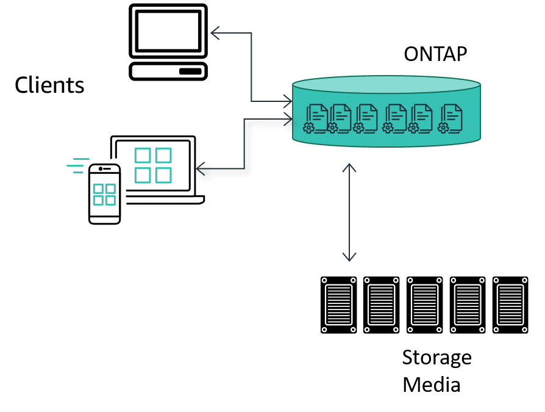

+ FSx for ONTAP **delivers both block storage and file storage service options**. The block storage option is available to attach to your different types of compute services using the iSCSI protocol client. You can attach from compute clients within the AWS Cloud and from your on-premises clients
    + FSx for ONTAP provides **shared block storage** support over the Internet Small Computer Systems Interface (**iSCSI**) protocol. You can activate iSCSI storage by provisioning logical unit numbers (LUNs) and mapping them to iSCSI initiator groups (igroups), exposing block storage to your Linux and Windows hosts. 
# Features of FSx for ONTAP
+ Support for **petabyte-scale datasets** in a single namespace
+ Up to **tens of gigabytes per second (GBps) of throughput** per file system
+ Multi-protocol access to data using the **Network File System (NFS), Server Message Block (SMB), and Internet Small Computer Systems Interface (iSCSI) protocols**
+ Highly available and durable **Multi-AZ and Single-AZ deployment options**
+ **Automatic data-tiering that reduces storage costs** by automatically transitioning infrequently accessed data to a lower-cost storage tier based on your access patterns
+ Data compression, deduplication, and compaction to reduce your storage consumption
+ Support for NetApp's SnapMirror replication feature
+ Support for NetApp's on-premises caching solutions: NetApp Global File Cache and FlexCache
+ Support for access and management using native AWS or NetApp tools and API operations
    + AWS Management Console, AWS Command Line Interface (AWS CLI), and SDKs
    + NetApp ONTAP CLI, REST API, and BlueXP
+ Support for the following data protection and security features:
    + Encryption of file system data and backups at rest using AWS KMS keys
    + Encryption of data in transit using SMB Kerberos session keys
    + On-demand antivirus scanning
    + Authentication and authorization using **Microsoft Active Directory**
    + File access auditing
    + NetApp's SnapLock feature with support for both Compliance and Enterprise volumes
# Security and data protection
+ Amazon FSx provides multiple levels of security and compliance to facilitate protecting your data.
+ It automatically **encrypts data at rest in file systems and backups using keys that you manage in AWS Key Management Service (AWS KMS)**.
+ You can also **encrypt data in transit using Kerberos** for NFS and SMB clients.
+ Amazon FSx also provides the following levels of access control:
    + At the file system level, Amazon FSx provides access control by using **Amazon Virtual Private Cloud (Amazon VPC) security groups**.
    + At the API level, Amazon FSx provides access control by using **AWS Identity and Access Management (IAM) access policies**.
    + To provide access control at the file and folder level, Amazon FSx supports **Unix permissions, NFS access control lists (ACLs), and NTFS ACLs**. When you join Amazon FSx to an **Active Directory**, users who are accessing file systems can authenticate using their Active Directory credentials.
+ Amazon FSx integrates with AWS CloudTrail to monitor and log your Amazon FSx API calls.
+ Additionally, Amazon FSx protects your data with highly durable file system backups. Amazon FSx performs automatic daily backups, and you can take additional backups at any point.
+ You can improve the security posture of your VPC by configuring Amazon FSx to use **an interface VPC endpoint**. 
+ You can use **NetApp ONTAP's Vscan feature** to run supported **third-party antivirus software**.
+ Roles and users in Amazon FSx for NetApp ONTAP
# Pricing for FSx for ONTAP
+ SSD storage capacity (per gigabtye-month, or GB-month)
+ SSD IOPS that you provision above three IOPS/GB (per IOPS-month)
+ Throughput capacity (per megabytes per second [MBps]-month)
+ Capacity pool storage consumption (per GB-month)
+ Capacity pool requests (per read and write)
+ Backup storage consumption (per GB-month)
# Components
## FSx for ONTAP file systems
+ A file system is the primary FSx for ONTAP resource, analogous to an on-premises NetApp ONTAP cluster. You specify the **solid state drive (SSD) storage capacity and throughput capacity** for your file system, and choose an Amazon Virtual Private Cloud (VPC) where your file system is created. 
+ Your file system can have **one to six high-availability (HA) pairs** depending on its configuration.
    + **An HA pair is made up of two file servers in an active-standby configuration**. File systems with a single HA pair are called scale-up file systems.
     File systems with **multiple HA pairs are called scale-out file systems**. 
## Storage virtual machines
+ A storage virtual machine (SVM) is an **isolated file server** with its **own administrative and data access endpoints for administering and accessing data**.
+ When you access data in your FSx for ONTAP file system, your clients and workstations interface with an SVM using the SVM's endpoint IP address.
+ You can join SVMs to a **Microsoft Active Directory** for file access authentication and authorization. 

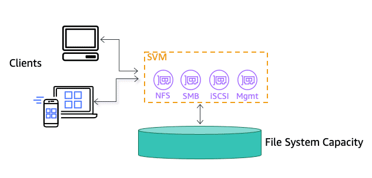
## Volumes
+ An FSx for ONTAP volume is **a data container for files, directories, and iSCSI LUNs**. 
+ Volumes are created **within, and accessed through, an SVM**.
+ You can create up to **500 volumes per file system**.
+ FSx for ONTAP volumes are **virtual resources** that you use for **organizing and grouping your data**.
+ Volumes are **logical containers**, and data stored in them consumes physical capacity on your file system.
+ Volumes are **hosted on SVMs**.
+ When you create a volume, you **set its size**, which determines the amount of physical data that you can store in it, regardless of which storage tier it is on.
+ You also set the volume type as **RW (the volume is read-writable) or DP (the volume is read-only and can be used as the destination of a NetApp SnapMirror or SnapVault relationship)**.
+ Volumes are thin provisioned, meaning that they only consume storage capacity for the data stored in them. For example, you can create three 10 TiB volumes on a file system configured with 10 TiB of free storage capacity, as long as the total amount of storage in the three volumes doesn't exceed 10 TiB at any time. Only a volume's used capacity counts toward your storage capacity consumption

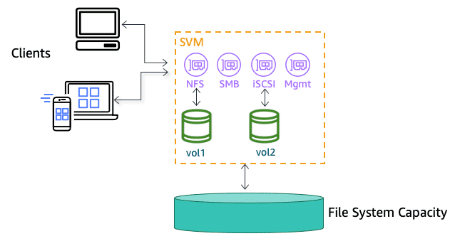
## Storage tiers
+ An FSx for ONTAP file system has two storage tiers: **primary storage and capacity pool storage**.
+ **Primary storage** is provisioned, scalable, high-performance SSD storage that’s purpose-built for the **active portion of your data set**.
+ **Capacity pool storage** is a fully elastic storage tier that can **scale to petabytes in size and is cost optimized for infrequently accessed data**.
+ Data that you write to your volumes consumes capacity on your storage tiers.
+ Data tiering
    + Data tiering is the process by which Amazon FSx for NetApp ONTAP **automatically transitions file system data between the SSD and the capacity pool storage tiers**. 
    + Each volume has a tiering policy that determines whether a volume uses your file system’s capacity pool storage tier, and how.
    + A volume's size determines how much total data you can store in it, while the volume's tiering policy determines which storage tier the data resides on.
## Tiering policies
+ You determine how to use your FSx for ONTAP file system’s storage tiers by choosing the **tiering policy for each of the file system's volumes**. You choose the data tiering policy when you create a volume, and you can modify it at any time with the Amazon FSx console, the AWS CLI, the API, or using NetApp management tools.
+ You can choose from one of the following policies that determine which data, if any, is tiered to the capacity pool storage.
    + **Auto** – This policy moves **all cold data—user data and snapshots**—to the capacity pool tier.
        + The cooling rate of data is determined by the policy's cooling period, which by default is 31 days, and is configurable to values between 2–183 days.
        + When the underlying cold data blocks are read randomly (as in typical file access), they are made hot and written to the primary storage tier. When cold data blocks are read sequentially (for example, by an antivirus scan), they remain cold and remain on the capacity pool storage tier. This is the default policy when creating a volume using the Amazon FSx console.
    + **Snapshot Only** – This policy moves **only snapshot data** to the capacity pool storage tier.
        + The rate at which snapshots are tiered to the capacity pool is determined by the policy's cooling period, which by default is set to 2 days, and is configurable to values between 2–183 days.
        + When cold snapshot data are read, they are made hot and written to the primary storage tier. This is the default policy when creating a volume using the AWS CLI, Amazon FSx API, or the NetApp ONTAP CLI.
    + **All** – This policy marks **all user data and snapshot data as cold, and stores it in the capacity pool tier**.
        + When data blocks are read, they remain cold and are not written to the primary storage tier.
        + When data is written to a volume with the All tiering policy, it is still initially written to the SSD storage tier, and is tiered to the capacity pool by a background process. Note that file metadata always remains on the SSD tier.
    + **None** – This policy keeps **all of your volume’s data on the primary storage tier**, and prevents it from being moved to capacity pool storage.
        + If you set a volume to this policy after it used any other policy, existing data in the volume that was in capacity pool storage is moved to SSD storage by a background process as long as your SSD utilization is below 90%.
        + This background process can be sped up by intentionally reading data or by modifying your volume's cloud retrieval policy. For more information, see Cloud retrieval policies.
+ As a best practice, when migrating data that you plan to store long-term in capacity pool storage, we **recommend that you use the Auto tiering policy** on your volume.
## Cloud retrieval policies
+ A volume's cloud retrieval policy sets the conditions that specify **when data that's read from the capacity pool tier is allowed to be promoted to the SSD tier**.
+ When the cloud retrieval policy is set to anything other than Default, **this policy overrides the retrieval behavior of your volume’s tiering policy**.
+ A volume can have one of the following cloud retrieval policies:
    + **Default** – This policy retrieves tiered data **based on the volume's underlying tiering policy**. This is the default cloud retrieval policy for all volumes.
    + **Never** – This policy **never retrieves tiered data, regardless of whether the reads are sequential or random**.
        + This is similar to setting the tiering policy of your volume to All, except that you can use it with other policies–Auto, Snapshot-only–to tier data according to the minimum cooling period instead of immediately.
    + **On-read** – This policy retrieves tiered data for all **client-driven data reads**. This policy **has no effect when using the All tiering policy**.
    + **Promote** – This policy **marks all of a volume’s data that's in the capacity pool for retrieval to the SSD tier**. The data is marked the next time the daily background tiering scanner runs. This policy is beneficial for applications that have cyclical workloads that run infrequently, but require SSD tier performance when they do run. This policy **has no effect when using the All tiering policy**.
## Storage efficiency
+ ONTAP allows for increased storage efficiency over other shared file storage offerings. It does so through the automated application of **deduplication, thin provisioning, compaction, and compression of your stored data**.
+ **Deduplication** is the process of **removing redundantly stored data** within a file system. This process can most easily be understood at the file level.
    + ONTAP not only supports deduplication **at the level of individual files**.
    + It also supports deduplication at the **individual block level**. 
+ **Thin provisioning** is the process of **dynamically allocating storage capacity** to users, volumes, and files systems as data is actually stored.
    + The underlying storage capacity is **not pre-allocated**.
    + Instead, capacity is **allocated as data is actually stored** on your volumes.
+ **Compression** is a process ONTAP uses to reduce the total amount of storage capacity required for your data. Data compression uses algorithmic methods for storing long strings of binary data as shorter strings of 1s and 0s.  
+ **Compaction works with compression** to take the resulting binary strings and fit them together in the most efficient way possible to lay out on the underlying storage media.
+ Storage efficiency features can reduce the footprint of your data in SSD storage, capacity pool storage, and backups. 
+ The typical storage capacity savings for general purpose file sharing workloads without sacrificing performance is **65% from compression, deduplication, and compaction, on both the SSD and capacity pool storage tiers**.
# Accessing data stored on FSx for ONTAP file systems
+ You can access your Amazon FSx file systems using a variety of supported clients and methods in both the AWS Cloud and on premises environments.
+ Each SVM has four endpoints that are used to access data or to manage the SVM using the NetApp ONTAP CLI or REST API:
    + Nfs – For connecting using the Network File System (NFS) protocol
    + Smb – For connecting using the Service Message Block (SMB) protocol (If your SVM is joined to an Active Directory, or you're using a workgroup.)
    + Iscsi – For connecting using the Internet Small Computer Systems Interface (iSCSI) protocol (for scale-out file systems only).
    + Management – For managing SVMs using the NetApp ONTAP CLI or API, or NetApp BlueXP
## Supported clients
+ You can access your data on FSx for ONTAP volumes from **multiple Linux, Windows, or macOS clients simultaneously over the NFS (v3, v4, v4.1, v4.2) and SMB protocols**. You can also access data using the **iSCSI (block) protocol**
+ The following AWS compute instances are supported for use with FSx for ONTAP:
    + Amazon Elastic Compute Cloud (**Amazon EC2**) instances running Linux with NFS or SMB support, Microsoft Windows, and MacOS. 
    + Amazon Elastic Container Service (**Amazon ECS**) Docker containers on Amazon EC2 Windows and Linux instances. 
    + Amazon Elastic Kubernetes Service （**Amazon EKS**）
    + Red Hat OpenShift Service on AWS (ROSA)
    + **Amazon WorkSpaces instances**.
    + Amazon **AppStream 2.0** instances.
    + AWS **Lambda **
    + **Virtual machines (VMs) running in VMware Cloud** on AWS environments.
+ Once mounted, FSx for ONTAP file systems appear as a local directory or drive letter over NFS and SMB, providing fully managed, shared network file storage that can be simultaneously accessed by up to thousands of clients.
+ iSCSI LUNS are accessible as block devices when mounted over iSCSI.
# Availability and durability
+ Amazon FSx for NetApp ONTAP uses two deployment types, **Single-AZ and Multi-AZ**, that offer different levels of availability and durability. 
## Single-AZ deployment type
+ When you create a Single-AZ file system, Amazon FSx automatically provisions **one to six pairs of file servers in an active-standby configuration**, with each file server in each pair located in separate fault domains within a single Availability Zone in the AWS Region.
+ During planned file system maintenance or an unplanned service disruption of any active file server, Amazon FSx **automatically and independently fails over that high-availability (HA) pair to the standby file server**, typically within a few seconds.
+ During a failover, you **continue to have access** to your data without manual intervention.
+ To ensure high availability, Amazon FSx **continuously monitors for hardware failures**, and automatically replaces infrastructure components in the event of a failure.
+ To achieve high durability, Amazon FSx automatically **replicates your data within an Availability Zone** to protect it from component failure.
+ In addition, you have the option to configure **automatic daily backups** of your file system data. These backups are stored across multiple Availability Zones to provide multi-AZ resiliency for all backup data.

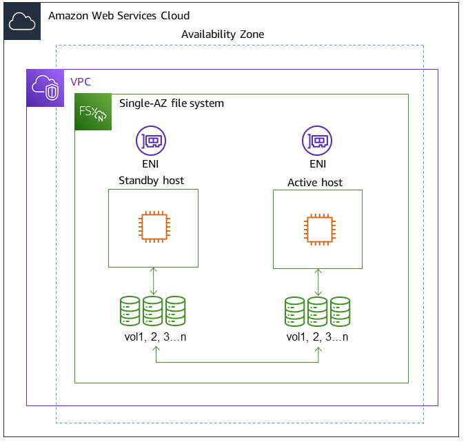
## Multi-AZ deployment type
+ Multi-AZ file systems support all the availability and durability features of Single-AZ file systems.
+ In addition, they are designed to **provide continuous availability to data even when an Availability Zone is unavailable**.
+ Multi-AZ deployments have **a single HA pair of file servers, the standby file server is deployed in a different Availability Zone from the active file server in the same AWS Region**.
+ Any changes written to your file system are **synchronously replicated across Availability Zones to the standby**.
+ Multi-AZ file systems are designed for use cases such as **business-critical production workloads** that require high availability to shared ONTAP file data and need storage with built-in replication across Availability Zones.

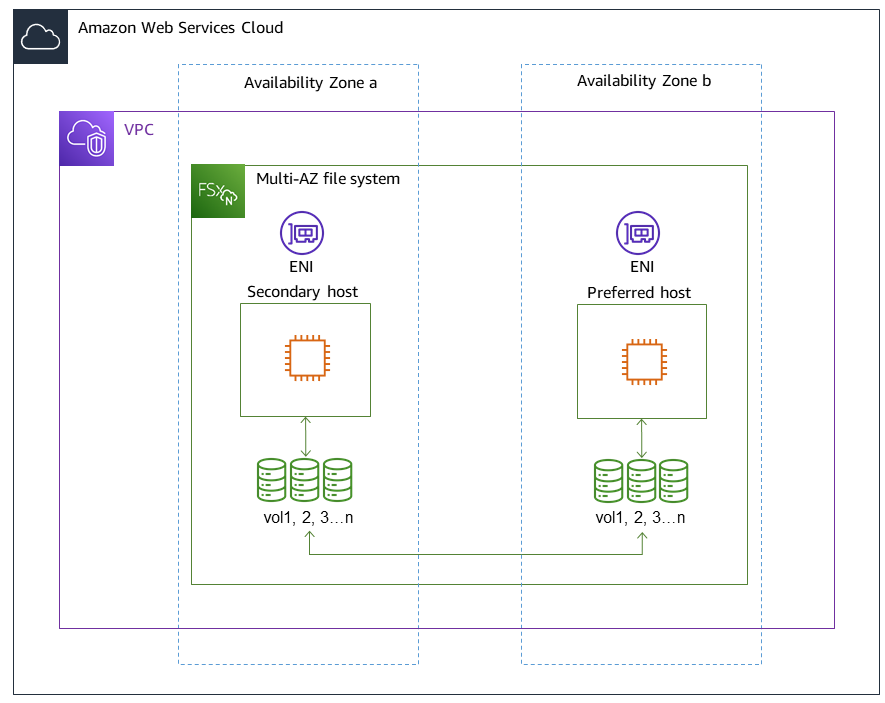
## Failover process for FSx for ONTAP
+ Single-AZ and Multi-AZ file systems automatically fail over a given HA pair from the preferred or active file server to the standby file server if any of the following conditions occur:
+ The preferred or active file server becomes unavailable
+ The file system's throughput capacity is changed
+ The preferred or active file server undergoes planned maintenance
+ An Availability Zone outage occurs (Multi-AZ file systems only)
# Protecting your data
+ Beyond automatically replicating your file system's data to ensure high durability, Amazon FSx provides you with the following options to further protect the data stored on your file systems:
+ **Native Amazon FSx backups** support your backup retention and compliance needs within Amazon FSx. You can also use **AWS Backup** to centrally manage, automate, and protect your backups across AWS services in the cloud.
+ **Snapshots** enable your users to easily undo file changes and compare file versions by restoring files to previous versions.
+ **Replication of your Amazon FSx file system to a second file system** to provide data protection and recovery. Replication, when enabled, occurs on an automatic, scheduled basis.
+ **SnapLock** can protect your files by transitioning them to a **write once, read many (WORM) state**, which prevents modification or deletion for a specified retention period.
# Working with Microsoft Active Directory in FSx for ONTAP
+ Amazon FSx works with Microsoft Active Directory (AD) to integrate with your existing environments.
+ Active Directory is the Microsoft directory service that's used to store information about objects on the network, and to help administrators and users to find and use this information. These objects typically include shared resources, such as file servers and network user and computer accounts.
+ You can optionally **join your FSx for ONTAP storage virtual machines (SVMs)** to your AD domain to provide **user authentication and file- and folder-level access control**. + Server message block (SMB) clients can then use their existing user identities in AD to authenticate themselves and access SVM volumes.
+ Your users can use their existing identities to control access to individual files and folders.
+ In addition, you can migrate your existing files and folders and their security access control list (ACL) configurations to Amazon FSx without any modifications.
+ When you join Amazon FSx for NetApp ONTAP to an AD, **you join the file system's SVMs to the AD independently**. This means that you can have a file system with some SVMs that are joined to an AD, and other SVMs that are not.
+ After an SVM is joined to an AD, you can update the following AD configuration properties:
    + DNS server IP addresses
    + Self-managed AD service account username and password
# Amazon FSx for NetApp ONTAP performance
+ File system performance is measured by its **latency, throughput, and I/O operations per second (IOPS)**.
+ Amazon FSx for NetApp ONTAP provides **sub-millisecond file operation latencies with solid state drive (SSD) storage**, and **tens of milliseconds of latency for capacity pool storage**. Above that, Amazon FSx has two layers of read caching on each file server—NVMe (non-volatile memory express) drives and in-memory—to provide even lower latencies when you access your most frequently-read data.
+ Each Amazon FSx file system provides up to **tens of GB/s of throughput and millions of IOPS**. The specific amount of throughput and IOPS that your workload can drive on your file system depends on the total throughput capacity and storage capacity configuration of your file system, along with the nature of your workload, including the size of the active working set.
+ To understand the Amazon FSx for NetApp ONTAP performance model in detail, you can examine the architectural components of an Amazon FSx file system. Your client compute instances, whether they exist in AWS or on-premises, access your file system through one or multiple elastic network interfaces (ENI). These network interfaces reside in the Amazon VPC that you associate with your file system. Behind each file system ENI is an NetApp ONTAP file server that is serving data over the network to the clients accessing the file system. Amazon FSx provides a fast in-memory cache and NVMe cache on each file server to enhance performance for the most frequently accessed data. Attached to each file server are the SSD disks hosting your file system data.

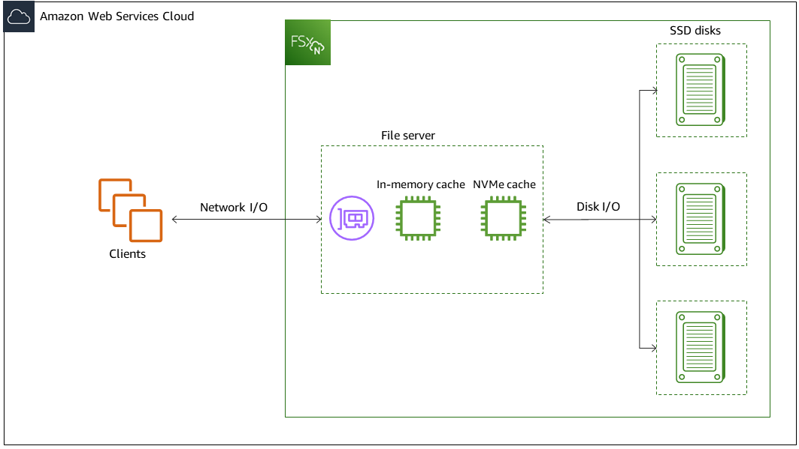
+ Corresponding with these architectural **components–network interface, in-memory cache, NVMe cache, and storage volumes–are the primary performance characteristics** of an Amazon FSx for NetApp ONTAP file system that determine the overall throughput and IOPS performance.
    + **Network I/O performance**: throughput/IOPS of requests between the clients and the file server (in aggregate)
    + **In-memory and NVMe cache size on the file server**: size of active working set that can be accommodated for caching
    + **Disk I/O performance**: throughput/IOPS of requests between the file server and the storage disks
# NetApp Snapshots
+ A NetApp Snapshot is a **point-in-time file system image**, rather than a direct copy of any data blocks. It is essentially **a collection of metadata pointers to the data blocks of a given volume or file system**, rather than a copy of those data blocks.

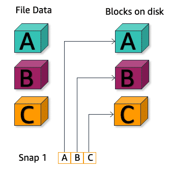
+ What makes this useful is that the **underlying data blocks a NetApp Snapshot points to are not overwritten while that Snapshot exists**. When a file or data block is changed, the overwritten data is preserved, and the new data is simply written to free capacity from the available storage pool. 

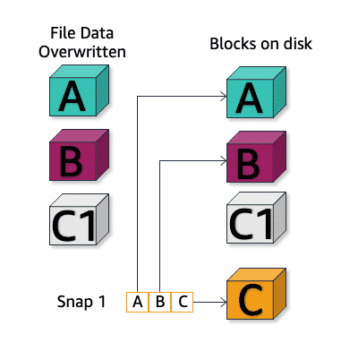
+ With a NetApp Snapshot, you can **quickly restore a file, directory, or entire volume to the point-in-time at which the Snapshot was taken**. The volume's metadata is simply updated to point back to the original data blocks, rather than to the data that came in after the Snapshot was taken
# FlexClone volumes
+ FlexClones **rely on the technology behind NetApp Snapshots** to provide functionality similar to **deduplication, but at the volume level**.
+ As discussed earlier, with deduplication, **blocks and files that have been saved in multiple locations can all refer to a common storage location**.
+ FlexClones are volume copies created from a Snapshot that are quick to provision and that take up no additional underlying storage capacity. They will **point to same data that the Snapshot points to**.

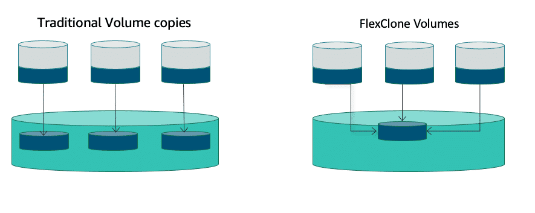
# SnapMirror
+ Another feature facilitated by ONTAP is **SnapMirror data replication**.
+ SnapMirror **replicates data at high speeds over local area networks (LANs) and wide area networks (WANs) between different ONTAP implementations (on premises, hybrid, or cloud native)**. 
+ Similar to the other storage efficiencies that ONTAP facilitates, SnapMirror is designed to ensure that a working copy of your data, with the minimum number of data blocks necessary, is **transferred to a second ONTAP implementation**
+ You can transport data between NetApp storage systems to **support both backup and disaster recovery** with the same target volume and I/O streaming.
+ It allows for both** asynchronous and synchronous replication**, which means that you can safeguard your most critical workloads with zero data loss when a recovery point of 0 is desired.
## SnapVault
+ As noted earlier, one difference between an Amazon EBS snapshot and a NetApp Snapshot is that the latter are **not primarily a backup solution**. 
+ However, with the **ONTAP SnapVault** functionality, you can create **backup copies of your primary data to secondary locations**, similar to AWS native snapshots.
+ With SnapVault, data stored on one or more ONTAP systems can be backed up to a central, secondary system quickly and efficiently as read-only Snapshot copies.
+ In the event of data loss or corruption on a system, the backed-up data can be restored from the SnapVault secondary system with less downtime than is often associated with conventional restore operations.
# FlexCache and Global File Cache
+ The last benefit of using the ONTAP managed storage that we will discuss is its unique **cache management capabilities** that **increase the responsiveness and performance of widely distributed and diverse storage architectures**.

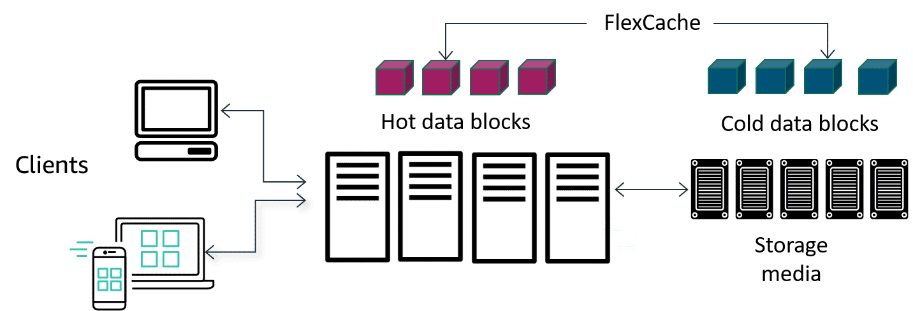
+ **ONTAP FlexCache** is the ONTAP capability to **cache only the actively-read data blocks in the compute layer closest to the client request**.
+ With **Global File Cache enabled**, ONTAP managed volumes in the cloud can also have their contents intelligently cached in any local offices where ONTAP is deployed. 
    + Additionally, the technology uses compression, streaming, and delta differencing to move the data between the cloud and on-premises locations efficiently and with minimal costs.
# Use cases for FSx for ONTAP
+ User shares and home directories
+ Data protection and replication
+ Enterprise applications
+ Latency-sensitive cloud applications
+ Cloud bursting
+ Modern application development
# Migrating data into FSx for ONTAP

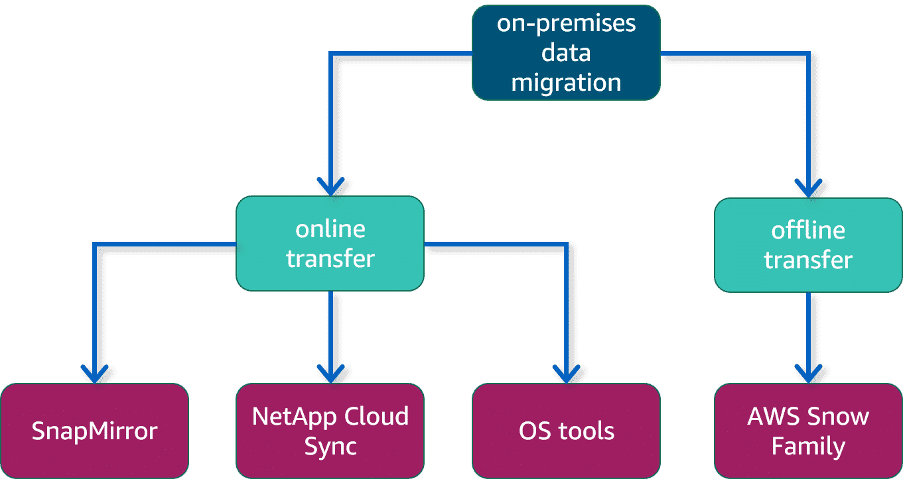
+ SnapMirror is a native ONTAP feature and is fully supported by FSx for ONTAP. SnapMirror employs block-level replication between two ONTAP file systems, replicating data from a specified source volume to a destination volume.
+ NetApp Cloud Sync is part of NetApp Cloud Manager, a cloud-based graphical user interface (GUI) that you can use in addition to the AWS Management Console to manage your FSx for ONTAP file system. Cloud Sync uses NetApp Data Broker to create a sync relationship between a source and a target volume.
+ Client operating system tools include applications such Robocopy and rsync that are native CLI tools available in Windows and in Linux and macOS respectively. Both solutions require a host that has both the source and destination volumes mounted, with the Windows, Linux, or macOS host running the Robocopy or rsync commands respectively.

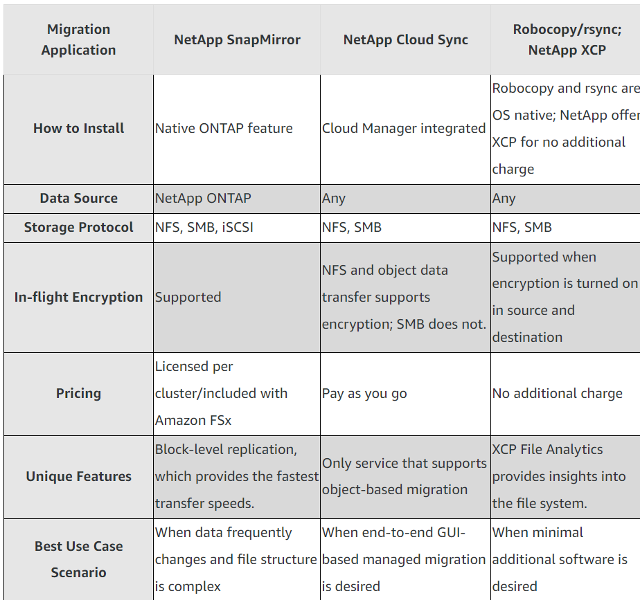
# Reference
+ [Amazon FSx for NetApp ONTAP](https://docs.aws.amazon.com/fsx/latest/ONTAPGuide/what-is-fsx-ontap.html)
+ [Amazon FSx for NetApp ONTAP Primer](https://explore.skillbuilder.aws/learn/course/12238/amazon-fsx-for-netapp-ontap-primer)
