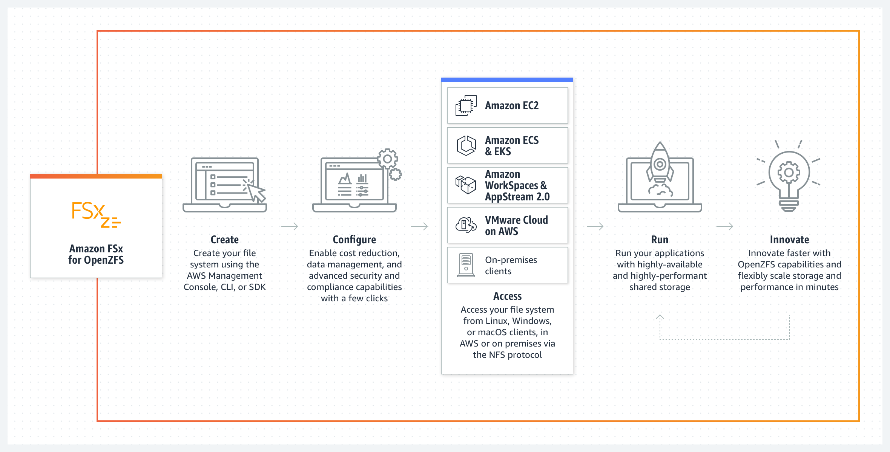
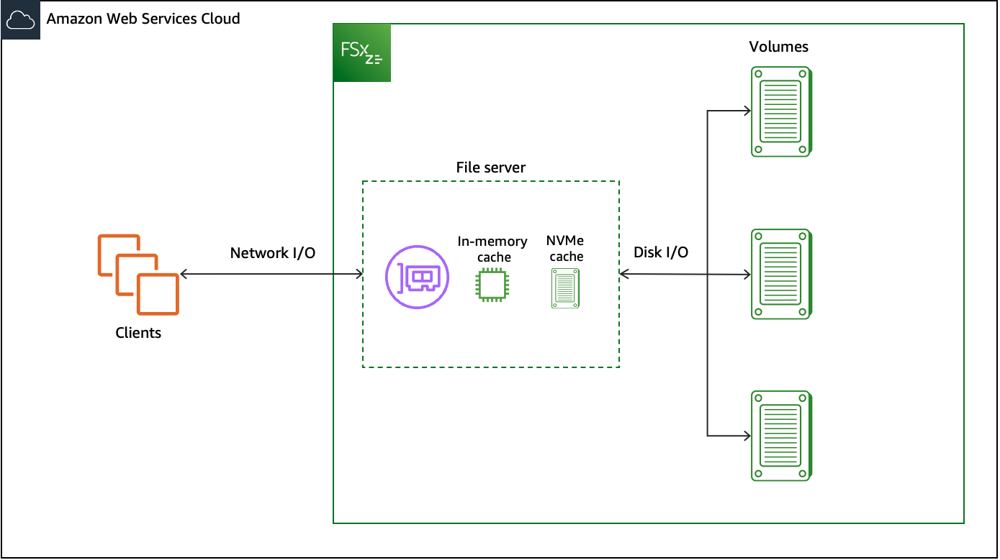
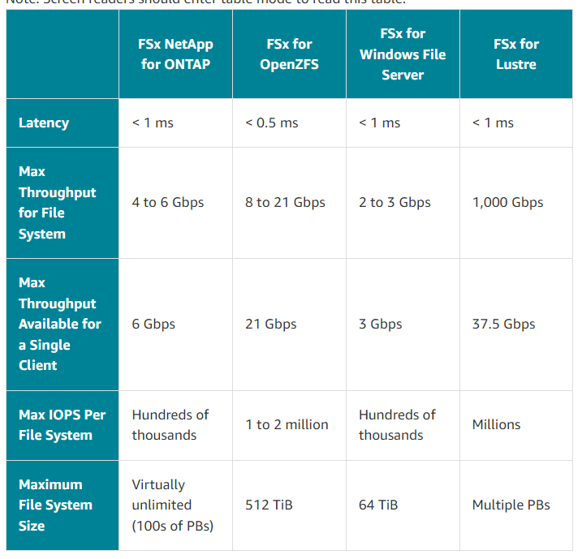

# Overview

+ Amazon FSx for OpenZFS is a fully managed file storage service that makes it easy to move data to AWS from **on-premises ZFS or other Linux-based file servers**.
+ You can do this without changing your application code or how you manage data. It offers highly reliable, scalable, performance, and feature-rich file storage built on the open-source OpenZFS file system. It combines these capabilities with the agility, scalability, and simplicity of a fully managed AWS service.
+ Amazon FSx for OpenZFS file systems are **broadly accessible from Linux, Windows, and macOS compute instances and containers using the industry-standard NFS protocol (v3, v4.0, v4.1, v4.2)**.
+ Powered by the latest AWS compute, disk, and networking technologies, including AWS Scalable Reliable Datagram networking and the AWS Nitro system, Amazon FSx for OpenZFS delivers up to **2 million IOPS with latencies of hundreds of microseconds**.
+ With complete support for OpenZFS features like instant point-in-time snapshots and data cloning, FSx for OpenZFS makes it easy for you to replace your on-premises file servers with AWS storage that provides familiar file system capabilities and eliminates the need to perform lengthy qualifications and change or re-architect existing applications or tools.
+ What's more, by combining the power of OpenZFS data management capabilities with the high performance and cost efficiency of the latest AWS technologies, FSx for OpenZFS enables you to build and run high-performance, data-intensive applications.
+ As a fully managed service, FSx for OpenZFS makes it easy to launch, run, and scale fully managed file systems on AWS that replace the file servers you run on premises while helping to provide better agility and lower costs.
+ With Amazon FSx for OpenZFS, you no longer have to worry about setting up and provisioning file servers and storage volumes, replicating data, installing and patching file server software, detecting and addressing hardware failures, or manually performing backups.
+ FSx for OpenZFS also provides rich integration with other AWS services, such as AWS Identity and Access Management IAM, AWS Key Management Service (AWS KMS), Amazon CloudWatch, and AWS CloudTrail.
# Features of Amazon FSx for OpenZFS
+ Support for access from Linux, Windows, and macOS compute instances and containers, including those running on AWS or on-premises, via the industry-standard NFS protocol (v3, v4.0, v4.1, and v4.2).
+ Millions of IOPS with latencies of a few hundred microseconds, and up to **21 GB/s of throughput for frequently accessed data from in-memory or NVMe cache**. Up to **350,000 IOPS and up to 10 GB/s of read/write throughput (up to 21 GB/s compressed) for data accessed from SSD disks**. 
+ Powerful OpenZFS data management capabilities including data compression, near instant point-in-time snapshots, and data cloning, designed for use with the Amazon FSx API.
+ Two levels of availability and durability, with Single-AZ and Multi-AZ file systems.
+ Support for multiple volumes per file system, thin provisioning, and user and group quotas for cost-efficient shared file systems across multiple users and applications.
+ Support for the following data protection and security features:
    + Built-in, fully managed file system backups stored on S3, with support for cross-region backup copies.
    + Near-instant point-in-time OpenZFS snapshots stored locally on each file system.
    + Automatic encryption of file system data and backups at rest using KMS keys.
    + Automatic encryption in-transit when accessed from supported EC2 instances.
# Components
+ A **file system** is the primary resource in Amazon FSx. You specify the solid state drive (SSD) storage capacity, throughput capacity, and IOPS capacity for your file system. Then, choose an Amazon VPC in which your file system is created.
+ An Amazon FSx for OpenZFS file system can contain **one or more volumes**, which are isolated data containers for files and directories. Your file system **includes a root volume by default**.
+ A **snapshot** is a read-only copy of an OpenZFS volume at a point in time. Snapshots can be created quickly and initially consume no additional space.
+ A **clone** is a writable volume with the same initial contents as a snapshot, from which the clone is created.
# How can I scale my file system?
+ **Storage capacity** is how much data you can store.
+ **Disk input/output operations per second (IOPS)** is the rate at which you can read and write individual chunks of data to your file systems disks.
+ **Throughput capacity** is the overall speed that you can read or write data to your file systems disk. (This dimension also determines network performance, processing power, and memory cache size for your file system.)
# What configuration options should you consider?
+ **VPC and subnet**
    + The file system will live on **a specific subnet** of your VPC.
    + To maximize performance, launch your EC2 instances **in the same subnet** as your file system.
    + You can also access your file system from **a different VPC by using VPC peering or transit gateways**.
    + Access your file system from on premises using **AWS Direct Connect or AWS VPN**.
+ **Throughput capacity**
    + Throughput capacity is the primary factor that determines the speed at which the file server hosting the file system can serve file data.
    + When you modify your file system's throughput capacity, behind the scenes, Amazon FSx switches out the file system's file server. 
+ **Provisioned IOPS**
    + You can specify how many IOPS your file system can deliver from disk. 
    + The IOPS configuration affects infrequently accessed data that is read from the backend disks and data that is not present in the in-memory cache.
    + If you select **Automatic provisioned SSD IOPS**, Amazon FSx will provision **3 IOPS per gigabyte** of storage capacity up to the maximum (which you can modify).
+ **Snapshots**
    + A snapshot is a read-only image of an Amazon FSx for OpenZFS volume at a point in time.
    + Snapshots offer protection against accidental deletion or modification of files in your volumes. Snapshots do not consume any extra capacity initially.
+ **Volumes**
    + Volumes are isolated data containers for files and directories.
    + Every Amazon FSx for OpenZFS file system has one (and only one) root volume from the file system creation time.
    + All other volumes created on a file system are children of the root volume.
+ NFS exports
    + Data on your file system volumes is exported using the NFS protocol.
    + You can then go ahead and configure all of the standard settings supported by NFS (versions 3, 4, 4.1, and 4.2)
# Security and data protection
+ Amazon FSx provides multiple levels of security and compliance to help ensure that your data is protected.
+ It automatically **encrypts data at rest in file systems** and backups using keys that you manage in AWS Key Management Service (AWS KMS).
+ Encryption of data in transit is automatically enabled when you access an Amazon FSx file system from Amazon EC2 instances that support this feature.
+ Amazon FSx provides access control at the file system level using **Amazon Virtual Private Cloud (Amazon VPC) security groups**, and at the API level using **AWS Identity and Access Management (IAM) access policies**.
+ To provide access control at the file and folder level, Amazon FSx supports **Unix permissions**.
+ Amazon FSx integrates with **AWS CloudTrail** to monitor and log your Amazon FSx API calls so that you can see actions taken by users on your Amazon FSx resources.
+ Additionally, Amazon FSx protects your data with **highly durable file system backups**. Amazon FSx performs automatic daily backups, and you can take additional backups at any point.
+ You can improve the security posture of your VPC by configuring Amazon FSx to use an **interface VPC endpoint**.
# Availability and durability
+ FSx for OpenZFS offers two levels of availability and durability for file systems: **Single-AZ and Multi-AZ**.
+ Single-AZ file systems ensure self-healing recovery within a single Availability Zone (AZ) by automatically detecting and addressing component failures.
+ Multi-AZ file systems provide high availability and failover support across multiple Availability Zones by provisioning and maintaining a standby file server in a separate AZ within an AWS Region.
# Pricing for FSx for OpenZFS
+ With Amazon FSx, there are no upfront hardware or software costs. You pay for only the resources used, with no minimum commitments, setup costs, or additional fees
# Accessing data
+ You can access your Amazon FSx file systems using a variety of supported clients in the AWS Cloud and on premise environments.
+ You can access the data on your Amazon FSx for OpenZFS file systems using a wide variety of compute instances and operating systems using the **Network File System (NFS) protocol (v3, v4.0, v4.1, and v4.2), including Amazon Elastic Compute Cloud (Amazon EC2) instances running Linux, (including Amazon Linux, Amazon Linux 2), Microsoft Windows, and MacOS**.
+ You can also access data on your FSx for OpenZFS file systems using other AWS services, including **Amazon Elastic Container Service and Amazon Elastic Kubernetes Service**.
+ Once mounted, FSx for OpenZFS file systems appear as **a local directory or drive letter over NFS**, providing fully managed, shared network file storage that can be simultaneously accessed by up to thousands of clients.
# How FSx for OpenZFS file systems work
+ Each FSx for OpenZFS file system consists of **the file server that clients communicate with and a set of disks attached to that file server**.
+ Each file server employs a **fast, in-memory cache** to enhance performance for the most frequently accessed data.
+ In addition to the in-memory cache, **Single-AZ 2 file systems also provide an additional NVMe cache** for storing a larger quantity of frequently accessed data.
+ FSx for OpenZFS utilizes the Adaptive Replacement Cache (ARC) and L2ARC that are built into the OpenZFS file system, which improves the portion of data access driven from the in-memory and NVMe caches.
+ When a client accesses data that's stored in the in-memory or NVMe caches, the file server doesn't need to read it from disk, and the data is served directly to the requesting client as network I/O.
+ When a client accesses data that is not in either of these caches, it is read from disk as disk I/O and then served to the client as network I/O; data read from disk is also subject to the IOPS and bandwidth limits of the underlying disks.
+ FSx for OpenZFS file systems can serve network I/O about **three times faster than disk I/O**, which means that clients can drive greater throughput and IOPS with lower latencies for frequently accessed data in cache. The following diagram illustrates how data is accessed from an FSx for OpenZFS file system, with the NVMe cache applying only to Single-AZ 2 file systems.
# Migrating to Amazon FSx for OpenZFS
+ **AWS DataSync** – is an online data transfer service designed to simplify, automate, and accelerate copying large amounts of data to and from AWS storage services.
    + Basic steps for migrating files using DataSync
    + Transferring files from a source to a destination using DataSync involves the following basic steps:
    + Download and deploy an agent in your environment and activate it (not required if transferring between AWS services).
    + Create a source and destination location.
    + Create a task.
    + Run the task to transfer files from the source to the destination.
+ **rsync** – Remote sync is an open source utility for efficiently transferring and synchronizing files commonly available on most Linux or other Unix-based operating systems.
    + With rsync, you can replicate data between any source and destination, but **at least one must be locally accessible to the client instance**.
+ **Robocopy** – Robust File Copy is a command line directory and file replication command set for Microsoft Windows.
    + Robocopy is designed to replicate data between **two locations that are locally accessible on the same host**.
    + To use Robocopy to migrate data to your FSx for OpenZFS file system, you need to **mount the source file system and the destination OpenZFS volume on the same Windows-based EC2 client instance**.
# Working with backups
+ With FSx for OpenZFS, backups are file-system-consistent, highly durable, and incremental. To ensure high durability, Amazon FSx stores backups in Amazon Simple Storage Service (Amazon S3).
+ Amazon FSx backups are **incremental**, whether they are generated using the automatic daily backup or the user-initiated backup feature.
+ **AWS Backup** is a simple and cost-effective way to protect your data by backing up your Amazon FSx for OpenZFS file systems. 
+ A snapshot is a read-only image of an FSx for OpenZFS volume at a point in time.  
    + Snapshots offer protection against accidental deletion or modification of files in your volumes.
    + With snapshots, your users can easily view and restore individual folders and files from an earlier snapshot.
    + Doing this enables users to easily undo changes and compare file versions.

# aws fsx compare

# Reference
+ [Amazon FSx for OpenZFS](https://docs.aws.amazon.com/fsx/latest/OpenZFSGuide/what-is-fsx.html)
+ [Build with Amazon FSx for OpenZFS](https://explore.skillbuilder.aws/learn/course/12846/build-with-amazon-fsx-for-openzfs)
