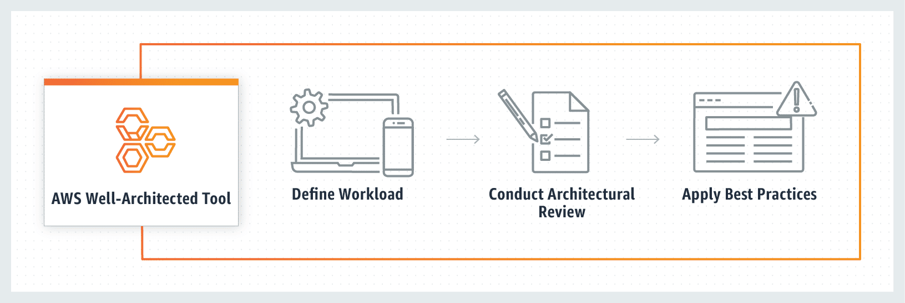
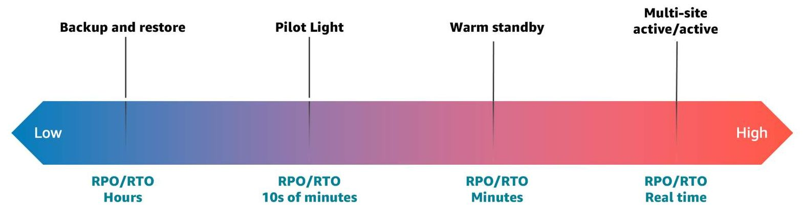

# AWS well-architected framework
## six general design principles
+ Stop guessing your capacity needs: **reliability pillar**.
+ Test systems at production scale.
+ Automate to make architectural experimentation easier: **reliability pillar**.
+ Allow for evolutionary architecture: **operational excellence**
+ Drive architecture, using data
+ Improve through game days: **operational excellence**
## The six pillars
+ The **operational excellence** pillar focuses on running and monitoring systems and continually improving processes and procedures. Key topics include **automating changes, responding to events, and defining standards to manage daily operations**.
    + There are five design principles in the operational excellence pillar. 
    + perform operations as code
    + make frequent small reversible changes
    + refine operations procedures frequently
    + anticipate failure
    + learn from all operational failures.
+ The **reliability pillar** focuses on workloads performing their intended functions and how to **recover quickly from failure to meet demands**. Key topics include **distributed system design, recovery planning, and adapting to changing requirements**.
    + The first part is availability and resiliency
    + The second part is disaster recovery
    + The five design principles in the reliability pillar are:
        + automatically recover from failure
        + test recovery procedures
        + scale horizontally to increase aggregate workload availability
        + stop guessing capacity
        + manage change in automation.
+ The **performance efficiency pillar** focuses on structured and streamlined allocation of IT and computing resources. Key topics include **selecting resource types and sizes optimized for workload requirements, monitoring performance, and maintaining efficiency as business needs evolve**.
    + The five design principles here are:
    + democratize advanced technologies,
    + go global in minutes,
    + use serverless architecture,
    + experiment more often,
    + and consider mechanical sympathy.
+ The **cost optimization pillar** focuses on avoiding unnecessary costs. Key topics include **understanding spending over time and controlling fund allocation, selecting resources of the right type and quantity, and scaling to meet business needs without overspending**.
    + The five design principles here are,
    + implement cloud financial management,
    + adopt a consumption model,
    + measure overall efficiency, 
    + stop spending money on undifferentiated heavy lifting,
    + analyze and attribute expenditure
+ The **sustainability pillar** focuses on **minimizing the environmental impacts of running cloud workloads**. Key topics include a shared responsibility model for sustainability, **understanding impact, and maximizing utilization to minimize required resources and reduce downstream impacts**. 
    + It consists of six design principles:
    + Understand your impact;
    + establish sustainability goals;
    + maximize utilization; 
    + anticipate and adopt new, 
    + more efficient hardware and software offerings; 
    + use managed services; 
    + reduce the downstream impact of your cloud workloads. 
+ The **security pillar** focuses on protecting information and systems. Key topics include **confidentiality and integrity of data, managing user permissions, and establishing controls to detect security events**.
    + there are seven design principles.
    + Implement a strong identity foundation.
    + Enable traceability.
    + Apply security at all layers.
    + Automate security best practices.
    + Protect data in transit and at rest.
    + Keep people away from data.
    + And prepare for security events. 
## AWS Well-Architected Tool
+ The AWS Well-Architected Tool provides a consistent approach for reviewing your architecture against AWS best practices and gives advice on how to architect in the cloud
+ The Well-Architected Tool enables you to review your workload architectures by answering a set of questions across those six pillars of the Well-Architected Framework.
+ Benefits
    + Get architectural guidance.
    + Review your workloads consistently.
    + Identify and implement improvements.
    + Customize your review.

# Designing database solutions for operational excellence
+ CloudWatch Logs
+ CloudWatch Dashboard
+ CloudWatch Alarms
+ Amazon RDS Performance Insights
# Designing database solutions for reliability
## Resiliency
+ AWS Regions and Availability Zones
+ **Multi-AZ**
    + With some AWS database services, such as **Amazon RDS**, you can deploy a Multi-AZ database. When you do, your primary database will be synchronously copied into another Availability Zone within the same Region.
+ **Read replicas**
    + Another example of reliability in database architecture is built-in replication functionality to create a database instance called a read replica. Read replicas are a great way to scale horizontally for high availability in read-heavy workloads. Read replicas are copied asynchronously from your primary database. 
+ **Cross-Region replicas**
    + With Amazon RDS, you can create a **MariaDB, Aurora MqSQL, MySQL, Oracle, or PostgreSQL** read replica in a different Region from the source database instance. Creating a cross-Region read replica isn't supported for SQL Server on Amazon RDS. This ensures high availability
+ **Global tables**
    + A global table is a collection of one or more replica tables, all owned by a single AWS account
+ **Maintenance windows**
    + By default, AWS will schedule maintenance of your databases at predetermined times.
## Disaster recovery
+ Backup and restore
    + A suitable approach for mitigating against data loss or corruption, this approach can also be used to mitigate against a Regional disaster by replicating data to other AWS Regions, or to mitigate lack of redundancy for workloads deployed to a single Availability Zone
    + Lower-priority use cases
    + Restore data after event
    + Cost $
    + Solutions
        + DynamoDB backup
        + Amazon RDS snapshot
        + Aurora DB snapshot
        + Amazon Redshift snapshot
        + Amazon Neptune snapshot
+ Pilot light
    + With the pilot light approach, you replicate your data from one Region to another and provision a copy of your core workload infrastructure.
    + Less stringent
    + Core services
    + Cost $$
    + Solutions
        + Amazon RDS read replicas
        + Aurora global tables
        + DynamoDB global tables
+ Warm standby
    + The warm standby approach involves ensuring that there is a scaled-down but fully functional copy of your production environment in another Region
    + More stringent
    + Business-critical services
    + Cost $$$
    + Solutions:
        + **All the AWS services covered under backup and restore and pilot light** are also used in warm standby for data backup, data replication, active/standby traffic routing, and deployment of infrastructure including Amazon Elastic Compute Cloud (Amazon EC2) instances. 
+ Multi-site active/active
    + You can run your workload simultaneously in multiple Regions as part of a multi-site active/active or hot standby active/passive strategy.
    + Zero downtime
    + Mission-critical services
    + Cost $$$$
    + Solutions:
        + **All the AWS services covered under backup and restore, pilot light, and warm standby** are also used for multi-site active/active for point-in-time data backup, data replication, active/active traffic routing, and deployment and scaling of infrastructure, including EC2 instances.

# Designing database solutions for performance efficiency
+ Understand data characteristics
    + Determine if your workload requires transactions, how it interacts with data, and what its performance demands are. Use this data to select the best-performing database approach for your workload.
+ Evaluate specific database offerings
+ Collect and record database performance metrics
+ Choose data storage based on access patterns
+ Optimize data storage based on access patterns
# Designing database solutions for cost optimization
+ AWS Auto Scaling
    + AWS Auto Scaling works with **Aurora and DynamoDB**
+ **Read replicas**
    + Using read replicas with auto scaling in Aurora is a great way to control costs.
# Designing database solutions for sustainability
+ Minimize data movement across networks
    + The database services such as **Amazon RDS and Aurora provide cross-Region replicas** to reduce latency while maximizing the energy required for technology hardware. **DynamoDB offers global tables**, which provide users fast application performance with multi-active replication to AWS Regions worldwide.
+ Reduce and reuse required resources
    + Implement ways to reduce CPU and network utilization
    + One example of this is using connection pooling to reuse and reduce required resource. 
    + With services such as **Amazon RDS Proxy**, applications can pool and share connections established with the database, improving database efficiency and application scalability.
# Designing database solutions for security
+ AWS Identity and Access Management
+ Data protection - enforcing encryption
    + Encryption at Rest
    + Encryption in Transit
# Understanding your data
## data types
+ **Structured data** is often organized to support transactional and analytical applications. Structured data is **most commonly stored in relational databases but can also be stored in nonrelational databases**. 
+ **Semi-structured data** can be just as predictable and organized as structured data. The difference is that semi-structured data is **flexible and can be updated without the requirement to change the schema for every single record in a table**. Semi-structured data allows a user to capture any data in any structure as data evolves and changes over time. Semi-structured data is **often stored in nonrelational stores**.
+ **Unstructured data** is not organized in any distinguishable or predefined manner. Common stores for unstructured data are **nonrelational key-value databases**. Unstructured data is full of irrelevant information, which means data needs to first be processed to perform any kind of meaningful analysis.
## database support
+ A **relational database** is built to store **structured data** in tables using a defined schema.
    + Amazon Relational Database Service (Amazon RDS)
    + Amazon Aurora
+ **Key-value databases** are a type of nonrelational database that store **unstructured data** in the form of key-value pairs.
    + Amazon DynamoDB
+ **Document** stores are a type of nonrelational database that store **semi-structured and unstructured data in the form of files**. 
    + Amazon DocumentDB
+ **In-memory data stores** can be used for **both structured and semi-structured data sources**.
    + Amazon ElastiCache
    + Amazon MemoryDB
+ **Graph databases** are purpose-built to store any type of data: **structured, semi-structured, or unstructured**. 
    + Amazon Neptune
+ **Ledger databases** can be used for both **structured and semi-structured** data sources.
    + Amazon Quantum Ledger Database (Amazon QLDB)
+ **Wide-column databases** can be used for  **structured data** sources.
    + Amazon Redshift
+ **Time-series databases** can be used for **structured data** sources.
    + Amazon Timestream
# Migrating from Microsoft SQL Server to Amazon RDS
+ DMS
# Migrating from Oracle to Amazon RDS
+ 
# Reference 
+ [Introduction to Building with AWS Databases](https://explore.skillbuilder.aws/learn/course/13585/play/92429/introduction-to-building-with-aws-databases)