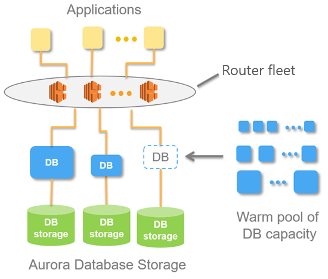

# Using Amazon Aurora Serverless v1 
+ An *Aurora Serverless DB cluster* is a DB cluster that **scales compute capacity up and down based on your application's needs**.
+ Aurora Serverless v1 provides a relatively simple, cost-effective option for infrequent, intermittent, or unpredictable workloads. 
+ The cluster volume for an Aurora Serverless v1 cluster is always encrypted. You can choose the encryption key, but you can't disable encryption. 
+ By using Aurora Serverless v1, you can create a database endpoint **without specifying the DB instance class size**. You specify only the **minimum and maximum range** for the Aurora Serverless v1 DB cluster's capacity.
+ The Aurora Serverless v1 database endpoint makes up **a router fleet** that supports continuous connections and distributes the workload among resources.

+ Currently, Aurora Serverless v1 tries to find a scaling point for 5 minutes (300 seconds). If Aurora Serverless can't find a scaling point within 5 minutes, the autoscaling operation times out.
+ If the DB instance for an Aurora Serverless v1 DB cluster becomes unavailable or the Availability Zone (AZ) it is in fails, Aurora **recreates the DB instance in a different AZ**
+ Aurora Serverless v1 is available in **certain AWS Regions and for specific Aurora MySQL and Aurora PostgreSQL versions** only.
+ Aurora Serverless v1 provides the following advantages: 
    + **Simpler than provisioned** – Aurora Serverless v1 removes much of the complexity of managing DB instances and capacity.
    + **Scalable** – Aurora Serverless v1 seamlessly scales compute and memory capacity as needed, with no disruption to client connections.
    + **Cost-effective** – When you use Aurora Serverless v1, you pay only for the database resources that you consume, on a per-second basis.
    + **Highly available storage** – Aurora Serverless v1 uses the same fault-tolerant, distributed storage system with six-way replication as Aurora to protect against data loss.
+ Aurora Serverless v1 is designed for the following use cases: 
    + Infrequently used applications
    + New applications
    + Variable workloads
    + Unpredictable workloads
    + Development and test databases
    + Multi-tenant applications 
# Using Amazon Aurora Serverless v2
+ Aurora Serverless v2 is an on-demand, autoscaling configuration for Amazon Aurora. 
+ Aurora Serverless v2 helps to automate the processes of monitoring the workload and adjusting the capacity for your databases.
+ **Capacity is adjusted automatically** based on application demand.
+ You're charged only for the resources that your DB clusters consume. Thus, Aurora Serverless v2 can help you to stay within budget and avoid paying for computer resources that you don't use.
+ This type of automation is especially valuable for multitenant databases, distributed databases, development and test systems, and other environments with highly variable and unpredictable workloads.
## Aurora Serverless v2 use cases
+ Variable workloads
+ Multi-tenant applications 
+ New applications
+ Mixed-use applications
+ Capacity planning
+ Development and testing 
## Advantages of Aurora Serverless v2
+ Aurora Serverless v2 is intended for variable or "spiky" workloads. 
+ Simpler capacity management than provisioned
+ Faster and easier scaling during periods of high activity
+ Cost-effective during periods of low activity
+ Greater feature parity with provisioned
    + In particular, with Aurora Serverless v2 you can take advantage of the following features from provisioned clusters:
    + **Reader DB instances** – Aurora Serverless v2 can take advantage of reader DB instances to scale horizontally. When a cluster contains one or more reader DB instances, the cluster can fail over immediately in case of problems with the writer DB instance. This is a capability that isn't available with Aurora Serverless v1.
    + **Multi-AZ clusters** – You can distribute the Aurora Serverless v2 DB instances of a cluster across multiple Availability Zones (AZs). Setting up a Multi-AZ cluster helps to ensure business continuity even in the rare case of issues that affect an entire AZ. This is a capability that isn't available with Aurora Serverless v1.
    + **Global databases** – You can use Aurora Serverless v2 in combination with Aurora global databases to create additional read-only copies of your cluster in other AWS Regions for disaster recovery purposes.
    + **RDS Proxy** – You can use Amazon RDS Proxy to allow your applications to pool and share database connections to improve their ability to scale.
+ Faster, more granular, less disruptive scaling than Aurora Serverless v1

# Reference
+ [Using Aurora Serverless v2](https://docs.aws.amazon.com/AmazonRDS/latest/AuroraUserGuide/aurora-serverless-v2.html)
+ [Using Amazon Aurora Serverless v1](https://docs.aws.amazon.com/AmazonRDS/latest/AuroraUserGuide/aurora-serverless.html)

