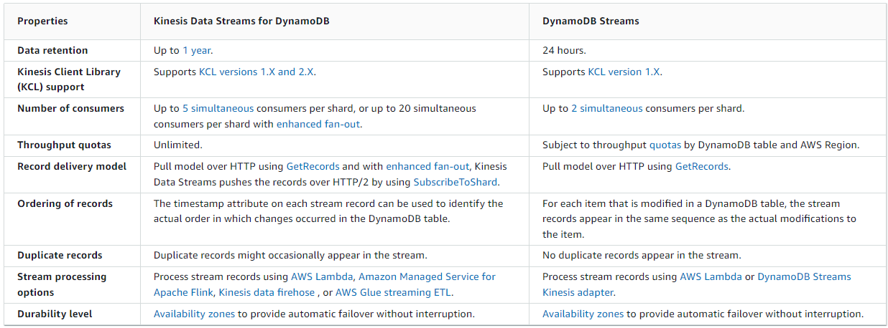
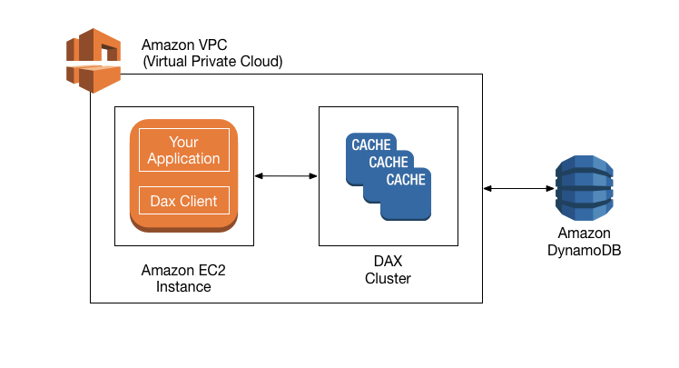

# Overview
+ Amazon DynamoDB is a **fully managed NoSQL database** service that provides fast and predictable performance with seamless scalability.
+ DynamoDB lets you **offload the administrative burdens** of operating and scaling a distributed database so that you **don't have to worry about hardware provisioning**, setup and configuration, replication, software patching, or cluster scaling.
+ DynamoDB also offers **encryption at rest**, which eliminates the operational burden and complexity involved in protecting sensitive data.
+ With DynamoDB, you can create database tables that can **store and retrieve any amount of data and serve any level of request traffic**.
+ You can **scale up or scale down your tables' throughput capacity** without downtime or performance degradation. 
+ You can create **on-demand backups and enable point-in-time recovery** for your Amazon DynamoDB tables.
+ With point-in-time recovery, you can restore a table to any point in time during the last 35 days.
+ DynamoDB allows you to **delete expired items from tables automatically** to help you reduce storage usage and the cost of storing data that is no longer relevant.
+ DynamoDB automatically **spreads** the data and traffic for your tables **over a sufficient number of servers** to handle your throughput and storage requirements, while maintaining consistent and fast performance. 
+ All of your data is stored on solid-state disks (SSDs) and is **automatically replicated across multiple Availability Zones** in an AWS Region, providing built-in high availability and data durability. 
+ DynamoDB is a **NoSQL database and is schemaless**. This means that, other than the primary key attributes, you don't have to define any attributes or data types when you create tables.
# Core Components of Amazon DynamoDB
+ In DynamoDB, **tables, items, and attributes** are the core components that you work with.
+ A *table* is a collection of *items*, and each item is a collection of *attributes*. 
+ DynamoDB uses **primary keys to uniquely identify each item** in a table and secondary indexes to provide more querying flexibility.
+ Similar to other database systems, DynamoDB **stores data in tables**. A *table* is a collection of data.
+ Each table contains zero or more items. **An item is a group of attributes** that is uniquely identifiable among all of the other items.
+ Each item is composed of one or more attributes. **An attribute is a fundamental data element**, something that does not need to be broken down any further. 
## Table
+ To create the table, you must provide the following information: **table name, primary key, Throughput settings** (for provisioned tables)
+ The `UpdateTable` operation allows you to do one of the following: 
    + Modify a table's provisioned throughput settings (for provisioned mode tables).
    + Change the table's read/write capacity mode.
    + Manipulate global secondary indexes on the table 
    + Enable or disable DynamoDB Streams on the table
+ You can remove an unused table with the `DeleteTable` operation. Deleting a table is an **unrecoverable** operation
### **Managing Capacity**
+ When you update a table **from provisioned to on-demand mode**, you **don't** need to specify how much read and write throughput you expect your application to perform.
+ when you update a table **from on-demand to provisioned** mode: 
    + If you're using the **AWS Management Console**, the console estimates initial provisioned capacity values based on the consumed read and write capacity of your table and global secondary indexes over the past 30 minutes. To override these recommended values, choose `Override recommended values`.
    + If you're using the AWS CLI or AWS SDK, choose the right provisioned capacity settings of your table and global secondary indexes by **using Amazon CloudWatch** to look at your historical consumption (`ConsumedWriteCapacityUnits` and `ConsumedReadCapacityUnits` metrics) to determine the new throughput settings.
### Managing Auto Scaling
+ When you update a table **from provisioned to on-demand** mode: 
    + If you're using the **console**, all of your auto scaling settings (if any) will be **deleted**.
    + If you're using the **AWS CLI or AWS SDK**, all of your auto scaling settings will be **preserved**. These settings can be applied when you update your table to provisioned billing mode again.
+ When you update a table **from on-demand to provisioned** mode: 
    + If you're using the console, DynamoDB recommends enabling auto scaling with the following defaults: 
        + Target utilization: 70%
        + Minimum provisioned capacity: 5 units
        + Maximum provisioned capacity: The Region maximum
    + If you're using the AWS CLI or SDK, your previous auto scaling settings (if any) are preserved.
### Global Tables: Multi-Region Replication with DynamoDB
+ Amazon DynamoDB global tables provide a fully managed solution for **deploying a multiregion, multi-active database**, without having to build and maintain your own replication solution. 
+ DynamoDB global tables are ideal for massively scaled applications with globally dispersed users.
+  DynamoDB would automatically replicate data changes among those tables so that changes to in one Region would seamlessly propagate to the other Regions.
# Primary Key
+ The primary key uniquely identifies each item in the table, so that no two items can have the same key.
+ DynamoDB supports two different kinds of primary keys: 
    + **Partition key** – A simple primary key, composed of one attribute known as the *partition key*.
    + **Partition key and sort key** – Referred to as a *composite primary key*, this type of key is composed of two attributes. The first attribute is the *partition key*, and the second attribute is the *sort key*.
+ DynamoDB uses **the partition key value** as input to an internal hash function. The output from the hash function **determines the partition** (physical storage internal to DynamoDB) **in which the item will be stored**.
+ All items with the same partition key value are stored together, in sorted order by sort key value. in ascending order by sort key
# Secondary Indexes
+ A *secondary index* lets you **query the data in the table using an alternate key**, in addition to queries against the primary key.
+ **Global secondary index** – An index with a partition key and sort key that can be **different from those on the table**. 
    + A global secondary index is **stored in its own partition space** away from the base table and **scales separately** from the base table.
+ **Local secondary index** – An index that has the **same partition key as the table**, but a different sort key. 
    + A local secondary index is "local" in the sense that **every partition of a local secondary index is scoped to a base table partition** that has the same partition key value.
+ Each table in DynamoDB has a quota of **20 global secondary indexes** (default quota) and **5 local secondary indexes** per table.
+ Every index belongs to a table, which is called the *base table* for the index.
+ DynamoDB **maintains indexes automatically**. When you add, update, or delete an item in the base table, DynamoDB adds, updates, or deletes the corresponding item in any indexes that belong to that table.
+ When you create an index, you **specify which attributes** will be copied, or *projected*, from the base table to the index.
    | Characteristic | Global Secondary Index | Local Secondary Index |
    | --- | --- | --- |
    | **Key Schema** | The primary key of a global secondary index can be either simple (partition key) or composite (partition key and sort key). | The primary key of a local secondary index must be composite (partition key and sort key). |
    | **Key Attributes** | The index partition key and sort key (if present) can be any base table attributes of type string, number, or binary. | The partition key of the index is the same attribute as the partition key of the base table. The sort key can be any base table attribute of type string, number, or binary. |
    | **Size Restrictions Per Partition Key Value** | There are no size restrictions for global secondary indexes. | For each partition key value, the total size of all indexed items must be 10 GB or less. |
    | **Online Index Operations** | Global secondary indexes can be created at the same time that you create a table. You can also add a new global secondary index to an existing table, or delete an existing global secondary index. | Local secondary indexes **are created at the same time that you create a table**. You **cannot add a local secondary index to an existing table**, **nor can you delete** any local secondary indexes that currently exist. |
    | **Queries and Partitions** | A global secondary index lets you query over the entire table, across all partitions. | A local secondary index lets you **query over a single partition**, as specified by the partition key value in the query. |
    | **Read Consistency** | Queries on global secondary indexes support eventual consistency only. | When you query a local secondary index, you can choose either eventual consistency or strong consistency. |
    | **Provisioned Throughput Consumption** | Every global secondary index has its own provisioned throughput settings for read and write activity. Queries or scans on a global secondary index consume capacity units from the index, not from the base table. The same holds true for global secondary index updates due to table writes. | Queries or scans on a local secondary index consume read capacity units from the base table. When you write to a table, its local secondary indexes are also updated; these updates consume write capacity units from the base table. |
    | **Projected Attributes** | With global secondary index queries or scans, you can only request the attributes that are projected into the index. DynamoDB **does not fetch any attributes from the table**. | If you query or scan a local secondary index, you can request attributes that are not projected in to the index. DynamoDB automatically fetches those attributes from the table. |
# DynamoDB Streams
+ DynamoDB supports streaming of item-level change data capture records in near-real time. 
+ DynamoDB offers two streaming models for change data capture: **Kinesis Data Streams for DynamoDB and DynamoDB Streams**.
## Streaming Options for Change Data Capture

## Kinesis Data Streams with DynamoDB
+ Kinesis Data Streams for DynamoDB captures **item-level modifications** in any DynamoDB table and replicates them to a Kinesis data stream of your choice.
+ Your applications can access the Kinesis data stream and view the item-level changes in **near-real time**.
+ Kinesis Data Streams enables you to take advantage of **longer data retention time**, enhanced fan-out capability to more than two simultaneous consumer applications, and **additional audit and security** transparency.
+ Whenever items are created, updated, or deleted in the table, DynamoDB sends a data record to Kinesis
+ The stream records stored in your Kinesis data stream is **encrypted at rest**. 
+ For each item that is modified in a DynamoDB table, the Kinesis data stream records may **appear in a different sequence** than the actual modifications to the item.
+ Stream records may **appear more than once** in the Kinesis data stream.
+ You can use **the timestamp attribute `ApproximateCreationDateTime`** on each record to **identify the actual order** in which item modifications occurred, and **to identify duplicate records** in the stream.
## DynamoDB Streams
+ DynamoDB Streams is an optional feature that **captures data modification events** in DynamoDB tables.
+ The data about these events appear in the stream in near-real time, and **in the order that the events occurred**.
+ Each stream record **appears exactly once** in the stream.
+ Each event is represented by a *stream record*
+  If you enable a stream on a table, DynamoDB Streams writes a stream record whenever one of the following events occurs: 
    + A **new item is added** to the table: The stream captures an image of the entire item, including all of its attributes.
    + An **item is updated**: The stream captures the "before" and "after" image of any attributes that were modified in the item.
    + An **item is deleted** from the table: The stream captures an image of the entire item before it was deleted.
+ Stream records have a lifetime of **24 hours**; after that, they are automatically removed from the stream.
# Data Types
+ **Scalar Types** – A scalar type can represent exactly one value. The scalar types are **number, string, binary, Boolean, and null**.
+ **Document Types** – A document type can represent a complex structure with nested attributes, such as you would find in a JSON document. The document types are list and map.
+ **Set Types** – A set type can represent multiple scalar values. The set types are string set, number set, and binary set.
# Read Consistency
+ **Eventually Consistent Reads**: When you read data from a DynamoDB table, the response might not reflect the results of a recently completed write operation. The response might include some stale data. If you repeat your read request after a short time, the response should return the latest data.
+ **Strongly Consistent Reads**: When you request a strongly consistent read, DynamoDB returns a response with the most up-to-date data, reflecting the updates from all prior write operations that were successful. However, this consistency comes with some disadvantages: 
    + A strongly consistent read might not be available if there is a network delay or outage. In this case, DynamoDB may return a server error (HTTP 500).
    + Strongly consistent reads may have higher latency than eventually consistent reads.
    + Strongly consistent reads are **not supported on global secondary indexes**.
    + Strongly consistent reads **use more throughput capacity** than eventually consistent reads.
+ You can request **strongly consistent `Query` or `Scan` actions on a table or a local secondary** index. However, **global secondary indexes support only eventual consistency**.
+ You can **add a global secondary index to an existing table**, using the `UpdateTable` action and specifying `GlobalSecondaryIndexUpdates`.
# Read/Write Capacity Mode
+ The read/write capacity mode controls **how you are charged** for read and write throughput and **how you manage capacity**. 
+ Amazon DynamoDB has two read/write capacity modes for processing reads and writes on your tables: 
    + On-demand
    + Provisioned (default, free-tier eligible)
+ **Local** secondary indexes **inherit** the read/write capacity mode from the base table. 
+ You can switch between read/write capacity modes once every 24 hours. 
## On-Demand Mode
+  DynamoDB on-demand offers **pay-per-request pricing for read and write requests** so that you pay only for what you use.
+ Amazon DynamoDB on-demand is a flexible billing option capable of **serving thousands of requests per second** without capacity planning. 
+ On-demand mode is a good option if any of the following are true: 
    + You create new tables with unknown workloads.
    + You have unpredictable application traffic.
    + You prefer the ease of paying for only what you use.
+ DynamoDB charges you for the reads and writes that your application performs on your tables in terms of **read request units and write request units**.
+ One *read request unit* represents **one strongly consistent read request, or two eventually consistent read requests**, for an item up to **4 KB in size**. 
+ Two read request units represent **one transactional read for items up to 4 KB**.
+ **One write request unit** represents one write for an **item up to 1 KB** in size.
+ **Transactional write** requests require **2 write request units** to perform one write for items up to 1 KB.
+ DynamoDB tables using on-demand capacity mode **automatically adapt to your application’s traffic volume**. On-demand capacity mode instantly accommodates up to **double the previous peak traffic** on a table. 
## Provisioned Mode
+ If you choose provisioned mode, you specify **the number of reads and writes per second** that you require for your application.
+ You can use auto scaling to adjust your table’s provisioned capacity automatically in response to traffic changes.
+ Provisioned mode is a good option if any of the following are true: 
    + You have **predictable** application traffic.
    + You run applications whose traffic is **consistent or ramps gradually**.
    + You can **forecast capacity requirements** to control costs.
+ For provisioned mode tables, you specify throughput capacity in terms of **read capacity units (RCUs) and write capacity units (WCUs)**
+ One **read capacity unit** represents **one strongly consistent read** per second, or **two eventually consistent reads** per second, for an item up to **4 KB** in size.
+ **Transactional read** requests require **two read capacity units** to perform one read per second for items up to 4 KB.
+ One *write capacity unit* represents one write per second for an item up to 1 KB in size. 
+ Transactional write requests require 2 write capacity units to perform one write per second for items up to 1 KB
+ *Provisioned throughput* is the **maximum amount of capacity** that an application can consume from a table or index.
+ If your application exceeds your provisioned throughput capacity on a table or index, it is subject to **request throttling**.Throttling prevents your application from consuming too many capacity units.
+ When a request is throttled, it fails with an HTTP 400 code (`Bad Request`) and a `ProvisionedThroughputExceededException`. The AWS SDKs have **built-in support for retrying throttled requests**
+ Capacity Unit Consumption for Reads 
    + `GetItem`—take the item size and **round it up to the next 4 KB** boundary.
    + `BatchGetItem`— DynamoDB processes each item in the batch as an **individual `GetItem` request**, so DynamoDB first **rounds up the size of each item to the next 4 KB boundary, and then calculates the total size**. 
    + `Query`—Reads multiple items that have the same partition key value. All items returned are treated as a single read operation, where DynamoDB **computes the total size of all items and then rounds up to the next 4 KB boundary**.
    + If you perform a read operation on **an item that does not exist**, DynamoDB still **consumes provisioned read throughput**: 
+ Capacity Unit Consumption for Writes 
    + PutItem—take the item size(the larger one before and after PutItem) and **round it up to the next 1 KB** boundary.
    + UpdateItem—take the whole item size(the larger one before and after UpdateItem) and **round it up to the next 1 KB** boundary.
    + DeleteItem—take the item size and **round it up to the next 1 KB** boundary.
    + BatchWriteItem—Writes up to 25 items to one or more tables. DynamoDB processes each item in the batch as an **individual** `PutItem` or `DeleteItem` request (updates are not supported). So DynamoDB **first rounds up the size of each item to the next 1 KB boundary, and then calculates the total size**.
    + `PutItem`, `UpdateItem`, and `DeleteItem` allow *conditional writes*, where you specify an expression that must evaluate to true in order for the operation to succeed. If the **expression evaluates to false**, DynamoDB **still consumes write capacity units** from the table
### DynamoDB Auto Scaling
+ DynamoDB auto scaling actively manages throughput capacity for **tables and global secondary indexes**.
+ With auto scaling, you define **a range (upper and lower limits) for read and write capacity units**.
+ You also define a **target utilization percentage** within that range.
+ DynamoDB auto scaling seeks to **maintain your target utilization**, even as your application workload increases or decreases.
+ With DynamoDB auto scaling, a table or a global secondary index can increase its provisioned read and write capacity to **handle sudden increases in traffic**, **without request throttling**. 
### Reserved Capacity
+ As a DynamoDB customer, you can purchase *reserved capacity* in advance
+ With reserved capacity, you pay a one-time upfront fee and commit to a minimum provisioned usage level over a period of time. 
+ Reserved capacity is **not available in on-demand mode**.
# Partitions and Data Distribution
+ Amazon DynamoDB stores data in partitions.
+ A *partition* is an **allocation of storage** for a table, backed by solid state drives (SSDs) and **automatically replicated across multiple Availability Zones** within an AWS Region. 
+ Global secondary indexes in DynamoDB are also composed of partitions. The **data in a global secondary index is stored separately from the data in its base table**, but index partitions behave in much the same way as table partitions.
+ To write an item to the table, DynamoDB uses the value of the partition key as input to an internal hash function. The output value from the hash function determines the partition in which the item will be stored.
+ To read an item from the table, you must specify the partition key value for the item. DynamoDB uses this value as input to its hash function, yielding the partition in which the item can be found.
# Reading Data
+ `ExecuteStatement` – Retrieves **a single or multiple items from a table** using the PartiQL (a SQL compatible query language). DynamoDB also provides
+ `BatchExecuteStatement-` retrieve **multiple items from diffrent tables** in a single operation.
+ `GetItem` – Retrieves a single item from a table. This is the **most efficient way to read a single item** because it provides direct access to the physical location of the item. 
+ `BatchGetItem` operation, allowing you to perform **up to 100 `GetItem` calls in a single operation**
+ `Query` – Retrieves all of the items that have a specific partition key. Within those items, you can apply a condition to the sort key and retrieve only a subset of the data. `Query` provides **quick, efficient access to the partitions** where the data is stored. 
+ `Scan` – Retrieves all of the items in the specified table. (This operation **should not be used with large tables** because it can consume large amounts of system resources.)
# On-Demand Backup and Restore for DynamoDB
+ You can use the DynamoDB on-demand backup capability to create **full backups of your tables for long-term retention and archival** for regulatory compliance needs. 
+ Backup and restore actions run with **zero impact on table performance or availability**.
+ All on-demand backups are cataloged, discoverable, and retained until explicitly deleted.
+ Backups are preserved regardless of table deletion.
+ Backup requests are processed instantaneously and become available for restore within minutes.
+ You can also **restore your DynamoDB table data across AWS Regions** such that the restored table is created in a different Region from where the backup resides
# Point-in-Time Recovery for DynamoDB
+ Point-in-time recovery helps protect your DynamoDB tables from accidental write or delete operations.
+ For `EarliestRestorableDateTime`, you can restore your table to any point in time during the last 35 days. The retention period is a fixed 35 days (5 calendar weeks) and can't be modified. 
+ When you restore using point-in-time recovery, DynamoDB restores your table data to the state based on the selected date and time (`day:hour:minute:second`) to a **new table**.
+ You can also restore your DynamoDB table data **across AWS Regions** such that the restored table is created in a different Region from where the source table resides.
# In-Memory Acceleration with DynamoDB Accelerator (DAX) 
+ DAX provides access to eventually consistent data from DynamoDB tables, with **microsecond** latency
+ DAX is ideal for the following types of applications: 
    + Applications that require the fastest possible response time for reads. 
    + Applications that read a small number of items more frequently than others.
    + Applications that are read-intensive, but are also cost-sensitive. 
    + Applications that require repeated reads against a large set of data. 
+ DAX is *not* ideal for the following types of applications: 
    + Applications that require strongly consistent reads (or that cannot tolerate eventually consistent reads).
    + Applications that do not require microsecond response times for reads, or that do not need to offload repeated read activity from underlying tables
    .+ Applications that are write-intensive, or that do not perform much read activity.
    + Applications that are already using a different caching solution with DynamoDB, and are using their own client-side logic for working with that caching solution.

+ At runtime, the DAX client directs all of your application's DynamoDB API requests to the DAX cluster. If DAX can process one of these API requests directly, it does so. Otherwise, it passes the request through to DynamoDB.
+ DAX can respond to the following API calls: 
    + `GetItem`
    + `BatchGetItem`
    + `Query`
    + `Scan`
+ `​​​​​​DAX assigns a timestamp to every item that it writes to the item cache. An item expires if it has remained in the cache for longer than the TTL setting
# Reference
+ [Amazon DynamoDB](https://docs.aws.amazon.com/amazondynamodb/latest/developerguide/Introduction.html)
+ [Amazon DynamoDB Service Primer](https://explore.skillbuilder.aws/learn/course/324/amazon-dynamodb-service-primer)
+ [Amazon DynamoDB for Serverless Architectures](https://explore.skillbuilder.aws/learn/course/67/amazon-dynamodb-for-serverless-architectures)
