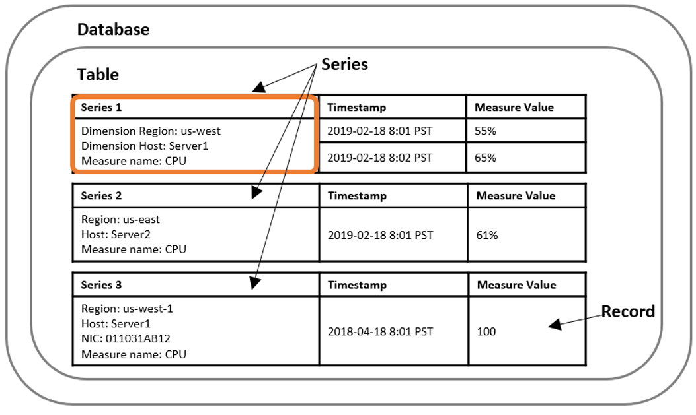
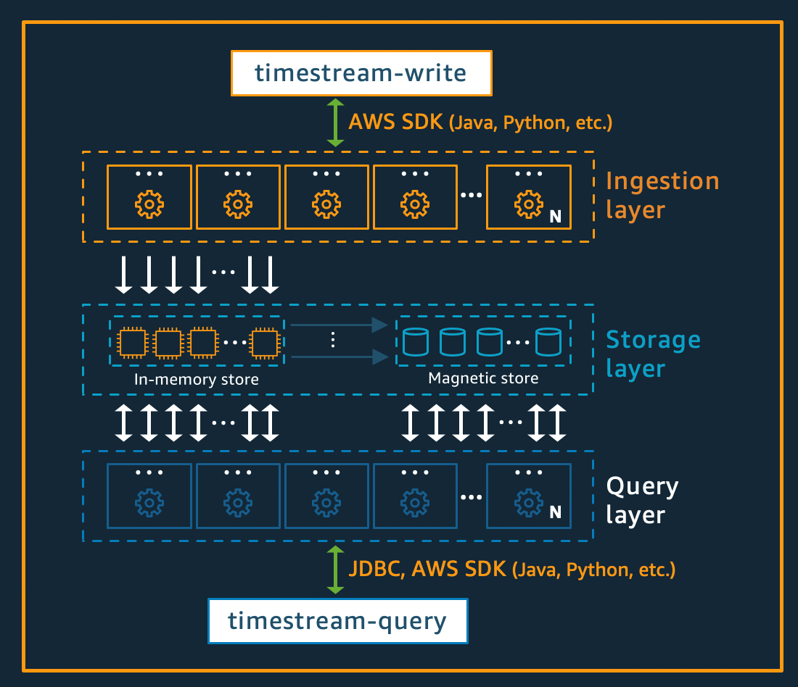
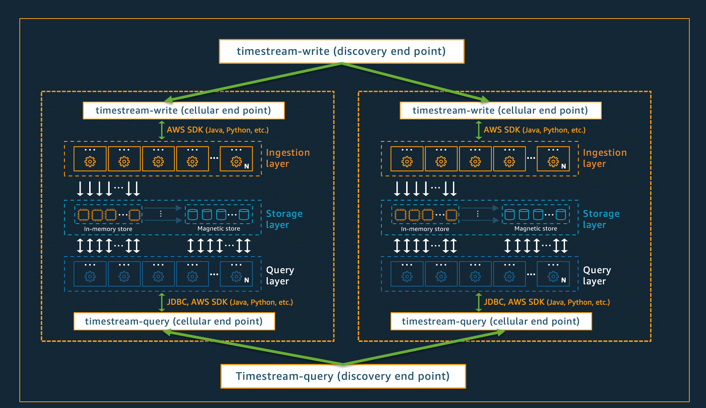

# Overview
# Overview
+ Amazon Timestream is a fast, scalable, fully managed, purpose-built **time series database** that makes it easy to store and analyze **trillions of time series data points per day**.
+ Timestream saves you time and cost in managing the lifecycle of time series data by **keeping recent data in memory and moving historical data to a cost optimized storage tier** based upon user defined policies.
+ Timestream's purpose-built query engine lets you **access and analyze recent and historical data together**, without having to specify its location.
+ Amazon Timestream has built-in** time series analytics functions**, helping you identify trends and patterns in your data in near real-time.
+ Timestream is **serverless and automatically scales up or down** to adjust capacity and performance.
+ Timestream also integrates with commonly used services for **data collection, visualization, and machine learning**.
    + You can send data to Amazon Timestream using **AWS IoT Core, Amazon Kinesis, Amazon MSK, and open source Telegraf**.
    + You can visualize data using **Amazon QuickSight, Grafana, and business intelligence tools through JDBC**.
    + You can also use **Amazon SageMaker** with Timestream for machine learning.
# Timestream key benefits
+ **Serverless with auto-scaling** - With Amazon Timestream, there are no servers to manage and no capacity to provision. 
+ **Data lifecycle management** - Amazon Timestream simplifies the complex process of data lifecycle management. It offers **storage tiering**, with a memory store for recent data and a magnetic store for historical data. Amazon Timestream automates the transfer of data from the memory store to the magnetic store based upon user configurable policies.
+ **Simplified data access** - With Amazon Timestream, you no longer need to use disparate tools to access recent and historical data. Amazon Timestream's purpose-built query engine transparently accesses and combines data across storage tiers without you having to specify the data location.
+ **Purpose-built for time series** - You can quickly analyze time series data using SQL, with built-in time series functions for smoothing, approximation, and interpolation. Timestream also supports advanced aggregates, window functions, and complex data types such as arrays and rows.
+ **Always encrypted** - Amazon Timestream ensures that your time series data is always encrypted, whether at rest or in transit. Amazon Timestream also enables you to specify an **AWS KMS customer managed key (CMK)** for encrypting data in the magnetic store.
+ **High availability** - Amazon Timestream ensures high availability of your write and read requests by **automatically replicating data and allocating resources across at least 3 different Availability Zones within a single AWS Region**. 
+ **Durability** - Amazon Timestream ensures durability of your data by **automatically replicating your memory and magnetic store data across different Availability Zones within a single AWS Region**. All of your data is written to disk before acknowledging your write request as complete.
# Timestream use cases
+ Monitoring metrics to improve the performance and availability of your applications.
+ Storage and analysis of industrial telemetry to streamline equipment management and maintenance.
+ Tracking user interaction with an application over time.
+ Storage and analysis of IoT sensor data.
# Amazon Timestream concepts
+ **Time series** - **A sequence of one or more data points** (or records) recorded over a time interval. 
+ **Record** - **A single data point** in a time series.
+ **Dimension** - **An attribute** that describes the meta-data of a time series. 
    + A dimension consists of a dimension name and a dimension value.
    + Consider the following examples: when considering an AWS Region as a dimension, the dimension name is "region" and the dimension value is "us-east-1"
+ **Measure** - The *actual value being measured by the record*.
    + Examples are the stock price, the CPU or memory utilization, and the temperature or humidity reading. Measures consist of **measure names and measure values**. 
    + Consider the following examples: For a stock price, the measure name is "stock price" and the measure value is the actual stock price at a point in time.
    + Measures can be modeled in Timestream as **multi-measure or single-measure records**.
+ **Timestamp** - Indicates** when a measure was collected** for a given record. Timestream supports timestamps with nanosecond granularity.
+ **Table** - A container for a set of related time series.
+ **Database** - A top level container for tables.
+ A database contains 0 or more tables. Each table contains 0 or more time series. Each time series consists of a sequence of records over a given time interval at a specified granularity. Each time series can be described using its meta-data or dimensions, its data or measures, and its timestamps.

# Architecture
+ Amazon Timestream has been designed from the ground up to **collect, store, and process time series data at scale**. Its serverless architecture supports fully decoupled data ingestion, storage, and query processing systems that can **scale independently**. 

## Write architecture
+ When writing time-series data, Amazon Timestream routes writes for a table, partition, to a fault-tolerant memory store instance that processes high throughput data writes. 
+ The memory store in turn achieves durability in a separate storage system that replicates the data across three Availability Zones (AZs)
+ In near real-time, other in-memory storage nodes sync to the data in order to serve queries. The reader replica nodes span AZs as well, to ensure high read availability.
+ Timestream supports writing data directly into the magnetic store, for applications generating lower throughput late-arriving data.
+ Whether data is written to the memory or magnetic store, Timestream automatically indexes and partitions data before writing it to storage. A single Timestream table may have hundreds, thousands, or even millions of partitions.
## Storage architecture
+ When data is stored in Timestream, data is **organized in time order** as well as across time based on context attributes written with the data.
+ **Having a partitioning scheme** that divides "space" in addition to time is important for massively scaling a time series system. 
+ Timestream is designed to **automatically manage the lifecycle of time series data**.
+ Timestream offers two data stores—**an in-memory store and a cost-effective magnetic store**. 
## Query architecture
+ Timestream queries are expressed in a **SQL grammar** that has extensions for time series-specific support (time series-specific data types and functions)
+ Queries are run by **a dedicated fleet of workers** where the number of workers enlisted to run a given query is determined by query complexity and data size
+ Performance for complex queries over large datasets is achieved through **massive parallelism**, both on the query runtime fleet and the storage fleets of the system
+ The ability to **analyze massive amounts of data quickly and efficiently** is one of the greatest strengths of Timestream.
## Cellular architecture
+ To ensure that Timestream can offer virtually infinite scale for your applications, while simultaneously ensuring 99.99% availability, the system is also designed using a **cellular architecture**.

# Using batch load in Timestream
+ With batch load for Amazon Timestream, you can **ingest CSV files stored in Amazon S3 into Timestream in batches**.
+ **Batch load task** – The task that defines your source data and destination in Amazon Timestream. You specify additional configuration such as the data model when you create the batch load task. You can create batch load tasks through the AWS Management Console, the AWS CLI, and the AWS SDKs.
+ **Import destination** – The destination database and table in Timestream.
+ **Data source** – The source CSV file that is stored in an S3 bucket. For information about preparing the data file, see Preparing a batch load data file.
+ **Batch load error report** – A report that stores information about the errors of a batch load task. You define the S3 location for batch load error reports as part of a batch load task.
+ **Data model mapping** – A batch load mapping for time, dimensions, and measures that is from a data source in an S3 location to a target Timestream table.
# Using scheduled queries in Timestream
+ The scheduled query feature in Amazon Timestream is a fully managed, serverless, and scalable solution for calculating and storing aggregates, rollups, and other forms of **preprocessed data** typically used for operational dashboards, business reports, ad-hoc analytics, and other applications
+ With scheduled queries, you define the real-time analytics queries that compute aggregates, rollups, and other operations on the data—and Amazon Timestream periodically and **automatically runs these queries and reliably writes the query results into a separate table**. The data is typically calculated and updated into these tables within a few minutes.
+ You can then point your dashboards and reports to **query the tables that contain aggregated data** instead of querying the considerably larger source tables. 
# Using UNLOAD to export query results to S3 from Timestream
+ Amazon Timestream now enables you to **export your query results to Amazon S3** in a cost-effective and secure way using the UNLOAD statement.
+ Using the UNLOAD statement, you can now export time series data to selected S3 buckets in either Apache Parquet or Comma Separated Values (CSV) format, which provides flexibility to store, combine, and analyze your time series data with other services. 
# Working with AWS Backup
+ Through integration with AWS Backup, you can use a fully managed, policy-driven centralized data protection solution to create immutable backups and centrally manage data protection of your application data spanning Timestream and other AWS services supported by AWS Backup.
+ To use the functionality, you must opt-in to allow AWS Backup to protect your Timestream resources. Opt-in choices apply to the specific account and AWS Region, so you might have to opt in to multiple Regions using the same account. 
+ Data Protection functionality available through AWS Backup includes the following.
    + **Scheduled backups**—You can set up regularly scheduled backups of your Timestream tables using backup plans.
    + **Cross-account and cross-Region copying**—You can automatically copy your backups to another backup vault in a different AWS Region or account, which allows you to support your data protection requirements.
    + **Cold storage tiering**—You can configure your backups to implement life cycle rules to delete or transition backups to colder storage. This can help you optimize your backup costs.
    + **Tags—You** can automatically tag your backups for billing and cost allocation purposes.
    + **Encryption—Your** backup data is stored in the AWS Backup vault. This allows you to encrypt and secure your backups by using an AWS KMS key that is independent from your Timestream table encryption key.
    + **Secure backups using the WORM model**—You can use AWS Backup Vault Lock to enable a write-once-read-many (WORM) setting for your backups.
# Customer-defined partition keys
+ Amazon Timestream customer-defined partition keys is a feature in Timestream that enables customers to **define their own partition keys for their tables**.
+ Partitioning is a technique used to **distribute data across multiple physical storage units**, allowing for faster and more efficient data retrieval.
+ With customer-defined partition keys, customers can create a partitioning schema that **better aligns with their query patterns and use cases**.
# How much does Timestream cost?
+ **Writes**: The amount of data written from your applications (rounded to the nearest kilobyte) into a table.
+ **Queries**: The amount of data scanned by the Timestream serverless distributed query engine while computing query results (rounded to the nearest megabyte, with a 10 MB minimum).
+ **Memory store**: The amount of data stored in the memory store of each table.
+ **Magnetic store**: The amount of data stored in the magnetic store of each table.
# What are typical use cases for Timestream?
+ IoT applications
+ DevOps applications
+ Analytics applications
# Reference
+ [Amazon Timestream](https://docs.aws.amazon.com/timestream/latest/developerguide/what-is-timestream.html)
+ [Getting Started with Amazon Timestream](https://explore.skillbuilder.aws/learn/course/14501/play/66136/getting-started-with-amazon-timestream)