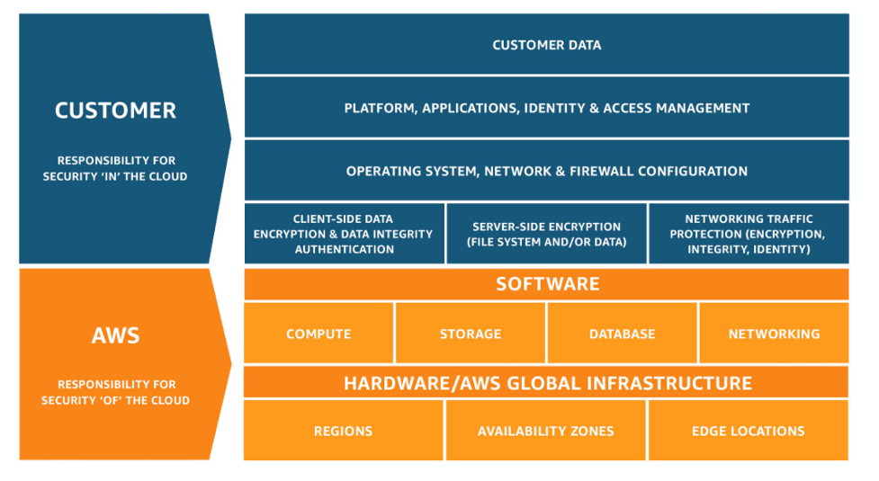

# Overview
+ AWS Well-Architected Tool (AWS WA Tool) is a service in the cloud that provides a **consistent process for measuring your architecture using AWS best practices**.
+ AWS WA Tool helps you throughout the product lifecycle by: 
+ Assisting with documenting the decisions that you make 
+ **Providing recommendations for improving your workload** based on best practices
+ Guiding you in making your workloads **more reliable, secure, efficient, and cost-effective**
+ ​​​The framework is based on five pillars: **operational excellence, security, reliability, performance efficiency, and cost optimization**.
# Concepts
+ A **workload** identifies **a set of components** that deliver business value. 
+ **Milestones** **mark key changes** in your architecture as it evolves throughout the product lifecycle — design, testing, go live, and production.
+ **Lenses** provide a way for you to consistently measure your architectures against best practices and identify areas for improvement.
+ **High risk issues (HRIs)** are architectural and operational choices that AWS has found might result in significant negative impact to a business.
+ **Medium risk issues (MRIs)** are architectural and operational choices that AWS has found might negatively impact business, but to a lesser extent than HRIs.
# AWS lenses
+ AWS **Well-Architected Framework Lens**, which is applied to all workloads, provide a way for you to consistently measure your architectures against best practices and identify areas for improvement.
+ The **AWS Serverless Application Lens** provides a set of additional questions that enable you to understand how a specific serverless application workload aligns with cloud best practices
+ The **AWS SaaS Lens** provides a set of additional questions for you to consider for your software as a service (SaaS) applications.
+ The **AWS Foundational Technical Review (FTR) Lens** provides a set of specific questions for independent software vendors (ISVs) to perform a workload self-assessment before requesting a Foundational Technical Review in the AWS Partner Network (APN).
# Getting started with AWS Well-Architected Tool
+ Provisioning an IAM user
+ Defining a workload
+ Documenting a workload
+ Saving a milestone
# AWS Well-Architected Framework
+ The AWS Well-Architected Framework helps you **understand the pros and cons of decisions you make while building systems on AWS**.
+ Using the Framework helps you **learn architectural best practices** for designing and operating secure, reliable, efficient, cost-effective, and sustainable workloads in the AWS Cloud.
+ The AWS Well-Architected Framework documents **a set of foundational questions** that allow you to **understand if a specific architecture aligns well with cloud best practices**.
+ The AWS Well-Architected Framework is based on six pillars 
    + **operational excellence:** The ability to support **development and run workloads effectively**, gain insight into their operations, and to continuously improve supporting processes and procedures to deliver business value.
    + **security:** The security pillar describes how to take advantage of cloud technologies **to protect data, systems, and assets** in a way that can improve your security posture.
    + **reliability:** The reliability pillar encompasses the ability of a workload to **perform its intended function correctly and consistently** when it’s expected to.
    + **performance efficiency:** The ability to **use computing resources efficiently** to meet system requirements, and to maintain that efficiency as demand changes and technologies evolve.
    + **cost optimization:** The ability to run systems to deliver business value **at the lowest price point**.
    + **sustainability:** The ability to continually **improve sustainability impacts** by reducing energy consumption and increasing efficiency across all components of a workload by **maximizing the benefits from the provisioned resources and minimizing the total resources required.**
# General Design Principles
+ Stop guessing your capacity needs
+ Test systems at production scale
+ Automate to make architectural experimentation easier
+ Allow for evolutionary architectures
+ Drive architectures using data
+ Improve through game days
# Operational Excellence
+ The Operational Excellence pillar includes the ability to support development and run workloads effectively, gain insight into their operations, and to continuously improve supporting processes and procedures to deliver business value.
## **Design Principles**
+ **Perform operations as code**
+ **Make frequent, small, reversible changes**
+ **Refine operations procedures frequently**: As you use operations procedures, look for opportunities to improve them. 
+ **Anticipate failure**: Perform “pre-mortem” exercises to identify potential sources of failure so that they can be removed or mitigated. 
+ **Learn from all operational failures**
## **Organization**
+ You need to understand your **organization’s priorities, your organizational structure, and how your organization supports your team members**, so that they can support your business outcomes.
+ **Organization Priorities**
    + Your teams need to have a shared understanding of your entire workload, their role in it, and shared business goals to set the priorities that will enable business success.
    + **Evaluate external customer needs**
    + **Evaluate internal customer needs**
    + **Evaluate governance requirements**
    + **Evaluate external compliance requirements**
    + **Evaluate threat landscape**
    + Evaluate threats to the business (for example, business risk and liabilities, and information security threats) and maintain this information in a risk registry.
    + **Evaluate tradeoffs**
    + **Manage benefits and risks**
    + Evaluate the impact of risks, and tradeoffs between competing interests or alternative approaches.
+ **Operating Model**
    + Your teams must understand their part in achieving business outcomes. Teams need to understand their roles in the success of other teams, the role of other teams in their success, and have shared goals.
    + Understanding responsibility, ownership, how decisions are made, and who has authority to make decisions will help focus efforts and maximize the benefits from your teams.
    + **Resources have identified owners**
    + **Processes and procedures have identified owners**
    + **Operations activities have identified owners responsible for their performance**
    + **Team members know what they are responsible for**
    + **Mechanisms exist to identify responsibility and ownership**
    + **Mechanisms exist to request additions, changes, and exceptions**
    + **Responsibilities between teams are predefined or negotiated**
+ **Organizational Culture**
    + Provide timely, clear, and actionable communications of known risks and planned events so that team members can take timely and appropriate action. 
    + **Executive Sponsorship**
    + **Team members are empowered to take action when outcomes are at risk**
    + **Escalation is encouraged**
    + **Communications are timely, clear, and actionable**
    + **Experimentation is encouraged**
    + **Team members are enabled and encouraged to maintain and grow their skill sets**
    + **Resource teams appropriately**
    + **Diverse opinions are encouraged and sought within and across teams**
+ OPS 1:  How do you determine what your priorities are?
    + Everyone needs to understand their part in enabling business success. Have shared goals in order to set priorities for resources. This will maximize the benefits of your efforts.
+ OPS 2:  How do you structure your organization to support your business outcomes?
    + Your teams must understand their part in achieving business outcomes. Teams need to understand their roles in the success of other teams, the role of other teams in their success, and have shared goals. Understanding responsibility, ownership, how decisions are made, and who has authority to make decisions will help focus efforts and maximize the benefits from your teams.
+ OPS 3:  How does your organizational culture support your business outcomes?
    + Provide support for your team members so that they can be more effective in taking action and supporting your business outcome.
## **Prepare**
+ To prepare for operational excellence, you have to **understand your workloads and their expected behaviors**.
+ You will then be able to design them to provide insight to their status and build the procedures to support them.
+ **Design Telemetry**
    + Design your workload so that it provides the information necessary for you to understand its internal state (for example, metrics, logs, events, and traces) across all components in support of observability and investigating issues.
    + Iterate to develop the telemetry necessary to monitor the health of your workload, identify when outcomes are at risk, and enable effective responses.
    + **Implement application telemetry**
    + **Use centralized and structured logging**
    + **Implement and configure workload telemetry**
    + **Implement user activity telemetry**
    + **Implement dependency telemetry**
    + **Implement transaction traceability**
+ **Design for Operations**
    + Adopt approaches that improve the flow of changes into production and that enable refactoring, fast feedback on quality, and bug fixing. 
    + **Use version control**
    + **Test and validate changes**
    + **Use configuration management systems**
    + **Use build and deployment management systems**
    + **Perform patch management**
    + **Share design standards**
    + **Implement practices to improve code quality**
    + **Use multiple environments**
    + **Make frequent, small, reversible changes**
    + **Fully automate integration and deployment**
+ **Mitigate Deployment Risks**
    + Adopt approaches that provide fast feedback on quality and enable rapid recovery from changes that do not have desired outcomes.
    + **Plan for unsuccessful changes**
    + **Test and validate changes**
    + **Use configuration management systems**
    + **Test using limited deployments**
    + **Deploy using parallel environments**
    + **Deploy frequent, small, reversible changes**
    + **Fully automate integration and deployment**
    + **Automate testing and rollback**
+ **Operational Readiness and Change Management**
    + Evaluate the operational readiness of your workload, processes, procedures, and personnel to understand the operational risks related to your workload.
    + You should use a consistent process (including manual or automated checklists) to know **when you are ready to go live** with your workload or a change.
     + **Ensure personnel capability**
    + **Ensure consistent review of operational readiness**
    + **Manage the flow of changes in your environments**
    + **Use metadata to identify your resources**
    + **Use runbooks to perform procedures**
    + **Use playbooks to identify issues**
    + **Make informed decisions to deploy systems and changes**
+ OPS 4:  How do you design your workload so that you can understand its state?
    + Design your workload so that it provides the information necessary across all components (for example, metrics, logs, and traces) for you to understand its internal state. This enables you to provide effective responses when appropriate.
+ OPS 5:  How do you reduce defects, ease remediation, and improve flow into production?
    + Adopt approaches that improve flow of changes into production, that enable refactoring, fast feedback on quality, and bug fixing. These accelerate beneficial changes entering production, limit issues deployed, and enable rapid identification and remediation of issues introduced through deployment activities.
+ OPS 6:  How do you mitigate deployment risks?
    + Adopt approaches that provide fast feedback on quality and enable rapid recovery from changes that do not have desired outcomes. Using these practices mitigates the impact of issues introduced through the deployment of changes.
+ OPS 7:  How do you know that you are ready to support a workload?
    + Evaluate the operational readiness of your workload, processes and procedures, and personnel to understand the operational risks related to your workload.
## **Operate**
+ Successful operation of a workload is **measured by the achievement of business and customer outcomes**.
+ By understanding the health of your workload and operations, you can **identify when organizational and business outcomes may become at risk**, or are at risk, and respond appropriately.
+ Define expected outcomes, determine **how success will be measured**, and **identify metrics** that will be used in those calculations to determine if your workload and operations are successful.
+ **Understanding Workload Health**
    + Define, capture, and analyze **workload metrics** to gain visibility to workload events so that you can take appropriate action.
    + **Identify key performance indicators**
    + **Define workload metrics**
    + **Collect and analyze workload metrics**
    + **Establish workload metrics baselines**
    + **Learn expected patterns of activity for workload**
    + **Alert when workload outcomes are at risk**
    + **Alert when workload anomalies are detected**
    + **Validate the achievement of outcomes and the effectiveness of KPIs and metrics**
+ **Understanding Operational Health**
    + Define, capture, and analyze **operations metrics** to gain visibility to workload events so that you can take appropriate action.
    + **Identify key performance indicators**
    + **Define operations metrics**
    + **Collect and analyze operations metrics**
    + **Establish operations metrics baselines**
    + **Learn expected patterns of activity for operations**
    + **Alert when operations outcomes are at risk**
    + **Alert when operations anomalies are detected**
    + **Validate the achievement of outcomes and the effectiveness of KPIs and metrics**
+ **Responding to Events**
    + You should use your existing runbooks and playbooks to deliver consistent results when you respond to alerts
    + AWS simplifies your event response by providing tools supporting all aspects of your workload and operations as code
    + **Use processes for event, incident, and problem management**
    + **Have a process per alert**
    + **Prioritize operational events based on business impact**
    + **Define escalation paths**
    + **Enable push notifications**
    + **Communicate status through dashboards**
    + **Automate responses to events**
    + Communicate the operational status of workloads through dashboards and notifications that are tailored to the target audience (for example, customer, business, developers, operations) so that they may take appropriate action, so that their expectations are managed, and so that they are informed when normal operations resume
+ OPS 8:  How do you understand the health of your workload?
    + **Define, capture, and analyze workload metrics** to gain visibility to workload events so that you can take appropriate action.
+ OPS 9:  How do you understand the health of your operations?
    + **Define, capture, and analyze operations metrics** to gain visibility to operations events so that you can take appropriate action.
+ OPS 10:  How do you manage workload and operations events?
    + Prepare and validate procedures for responding to events to minimize their disruption to your workload.
## **Evolve**
+ You must learn, share, and continuously improve to sustain operational excellence
+ **Have a process for continuous improvement:** Dedicate work cycles to making continuous incremental improvements.
+ **Perform post-incident analysis:** Perform post-incident analysis of all customer impacting events. Identify the contributing factors and preventative action to limit or prevent recurrence.
+ **Implement feedback loops**
+ **Perform Knowledge Management**
+ **Define drivers for improvement**
+ **Validate insights**
+ **Perform operations metrics reviews**
+ **Document and share lessons learned**
+ **Allocate time to make improvements**
+ Communicate contributing factors with affected communities as appropriate.
+ Regularly evaluate and prioritize opportunities for improvement (for example, feature requests, issue remediation, and compliance requirements), including both the workload and operations procedures.
+ OPS 11:  How do you evolve operations?
    + Dedicate time and resources for continuous incremental improvement to evolve the effectiveness and efficiency of your operations.
# Security
+ The Security pillar encompasses the ability to protect data, systems, and assets to take advantage of cloud technologies to improve your security.
+ The security pillar describes **how to take advantage of cloud technologies to protect data, systems, and assets** in a way that can improve your security posture. 
## Design Principles
+ **Implement a strong identity foundation**
    + Implement the principle of **least privilege and enforce separation of duties** with appropriate authorization for each interaction with your AWS resources.
    + **Centralize identity management**, and aim to eliminate reliance on long-term static credentials.
+ **Enable traceability**
    + Monitor, alert, and audit actions and changes to your environment in real time.
    + Integrate log and metric collection with systems to **automatically investigate and take action.**
+ **Apply security at all layers**
+ **Automate security best practices**
    + Create secure architectures, including the implementation of controls that are **defined and managed as code in version-controlled templates**.
+ **Protect data in transit and at rest**
    + Classify your data into sensitivity levels and use mechanisms, such as encryption, tokenization, and access control where appropriate.
+ **Keep people away from data**
+ **Prepare for security events**
## **Security Foundations**
+ **Shared Responsibility**
    + Security and Compliance is a **shared responsibility** between AWS and the customer. 
    + **AWS responsibility “Security of the Cloud”** – AWS is responsible for protecting the infrastructure that runs all of the services offered in the AWS Cloud. This infrastructure is composed of the hardware, software, networking, and facilities that run AWS Cloud services.
    + **Customer responsibility “Security in the Cloud”** – Customer responsibility will be determined by the AWS Cloud services that a customer selects. This determines the amount of configuration work the customer must perform as part of their security responsibilities.+  

+ **AWS Response to Abuse and Compromise**
    + **AWS works with you to detect and address suspicious and malicious activities** from your AWS resources. 
    + Unexpected or suspicious behaviors from your resources can indicate that your AWS resources have been compromised, which signals potential risks to your business.
    + AWS detects abuse activities in your resources using mechanisms, such as: 
        + AWS internal event monitoring
        + External security intelligence against AWS network address space
        + Internet abuse complaints against AWS resources
        + AWS is committed to working with AWS customers to prevent, detect, and mitigate abuse, and to defend against future recurrences.
+ **Governance**
    + Security governance, as a subset of the overall approach, is meant to **support business objectives by defining policies and control objectives to help manage risk**.
    + Achieve risk management by following a **layered approach to security control objectives**–each layer builds upon the previous one. 
+ **Operating Your Workloads Securely**
    + Operating workloads securely covers the whole lifecycle of a workload from design, to build, to run, and to ongoing improvement.
    + **Automation** allows consistency and repeatability of processes. 
    + **Identify and prioritize risks using a threat model**
    + **Identify and validate control objectives**
    + **Keep up to date with security threats**
    + **Keep up to date with security recommendations**
    + **Evaluate and implement new security services and features regularly**
    + **Automate testing and validation of security controls in pipelines**
+ **AWS Account Management and Separation**
    + We recommend that you **organize workloads in separate accounts and group accounts** based on function, compliance requirements, or a common set of controls rather than mirroring your organization’s reporting structure
    + Separate workloads using accounts
    + **Secure AWS account**
    + **Manage accounts centrally**
    + **Set controls centrally**
    + **Configure services and resources centrally**
+ SEC 1:  How do you securely operate your workload?
    + To operate your workload securely, you must apply overarching best practices to every area of security
    + Take requirements and processes that you have defined in operational excellence at an organizational and workload level, and apply them to all areas.
    + Staying up to date with recommendations from AWS, industry sources, and threat intelligence helps you evolve your threat model and control objectives.
    + Automating security processes, testing, and validation allow you to scale your security operations.
## **Identity and Access Management**
+ To use AWS services, you must **grant your users and applications access to resources** in your AWS accounts.
+ Identity and access management are key parts of an information security program, ensuring that **only authorized and authenticated users and components are able to access your resources**, and only in a manner that you intend.
+ Identity Management 
    + two types of identities 
    + **Human Identities**
    + **Machine Identities**
    + **Rely on a centralized identity provider**
    + **Leverage user groups and attributes**
    + **Use strong sign-in mechanisms:** Enforce minimum password length, and educate your users to avoid common or reused passwords. Enforce multi-factor authentication (MFA) 
    + **Use temporary credentials**: Require identities to dynamically acquire temporary credentials. 
    + **Audit and rotate credentials periodically**
    + **Store and use secrets securely**
+ **Permissions Management**
    + Manage permissions to **control access to human and machine identities** that require access to AWS and your workloads.
    + Permissions control **who can access what, and under what conditions**
    .+ Set permissions to specific human and machine identities to grant access to specific service actions on specific resources.
    + ways to grant access to different types of resources 
        + **Identity-based policies** in IAM are managed or inline, and attach to IAM identities, including users, groups, or roles.
        + **Resource-based policies** are attached to a resource
        + **Permissions boundaries** use a managed policy to set the maximum permissions that an administrator can set.
        + **Attribute-based access control (ABAC)** enables you to grant permissions based on attributes.
        + **Organizations service control policies** (SCP) define the maximum permissions for account members of an organization or organizational unit (OU)
        + **Session policies** assume a role or a federated user.
    + **Define permission guardrails for your organization**
    + **Grant least privilege access**
    + **Analyze public and cross account access**
    + **Share resources securely**
    + **Reduce permissions continuously**
    + **Establish emergency access process**
## **Detection**
+ Detection consists of two parts: detection of **unexpected or unwanted configuration changes**, and the **detection of unexpected behavior**.
+ Detection enables you to identify a potential security misconfiguration, threat, or unexpected behavior. 
+ You can use detective controls to identify a potential security threat or incident.
+ In AWS, you can implement detective controls by processing logs, events, and monitoring that allows for auditing, automated analysis, and alarming. 
+ **Configure**
    + **Configure service and application logging**
    + **Analyze logs, findings, and metrics centrally**
+ **​​​​​​​Investigate**
    + **​​​​​​​Implement actionable security events**
    + **Automate response to events**
+ SEC 4:  How do you detect and investigate security events?
    + Capture and analyze events from logs and metrics to gain visibility. Take action on security events and potential threats to help secure your workload.
## **Infrastructure Protection**
+ Infrastructure protection is a key part of an information security program. It ensures that systems and services within your workload are protected against unintended and unauthorized access, and potential vulnerabilities.
+ **Multiple layers of defense** are advisable in any type of environment
+ **Protecting Networks**
    + **​​​​​​​​​​​​​​Create network layers**: Components such as EC2 instances, RDS database clusters, and Lambda functions that share reachability requirements can be segmented into layers formed by subnets. 
    + **Control traffic at all layers**: When architecting your network topology, you should examine the connectivity requirements of each component. 
    + **Implement inspection and protection:** Inspect and filter your traffic at each layer
    + **Automate network protection:** Automate protection mechanisms to provide a self-defending network based on threat intelligence and anomaly detection.
+ **Protecting Compute**
    + Compute resources include EC2 instances, containers, AWS Lambda functions, database services, IoT devices, and more.
    + Each of these compute resource types require different approaches to secure them. 
    + **Perform vulnerability management:** Frequently scan and patch for vulnerabilities in your code, dependencies, and in your infrastructure to help protect against new threats.
    + **Reduce attack surface:** Reduce your exposure to unintended access by hardening operating systems and minimizing the components, libraries, and externally consumable services in use.
    + **Enable people to perform actions at a distance:** Removing the ability for interactive access reduces the risk of human error, and the potential for manual configuration or management. For example, use a change management workflow to manage EC2 instances using tools such as AWS Systems Manager instead of allowing direct access, or via a bastion host. 
    + **Implement managed services:** Implement services that manage resources, such as Amazon RDS, AWS Lambda, and Amazon ECS, to reduce your security maintenance tasks as part of the shared responsibility model.
    + **Validate software integrity**
    + **Automate compute protection**
## **Data Protection**
+ **Data Classification**
    + Classification provides a way to **categorize data, based on criticality and sensitivity** in order to help you determine appropriate protection and retention controls.
    + **Identify the data within your workload**
    + **Define data protection controls:** By using [resource tags](https://docs.aws.amazon.com/whitepapers/latest/tagging-best-practices/welcome.html), separate AWS accounts per sensitivity
    + **Define data lifecycle management**
    + **Automate identification and classification**
+ **​​​​​​​​​​​​​​Protecting Data at Rest**
    + **​​​​​​​Implement secure key management**
    + **Enforce encryption at rest**
    + **Enforce access control**
    + **Audit the use of encryption keys**
    + **Use mechanisms to keep people away from data**
    + **Automate data at rest protection**
+ **​​​​​​​​​​​​​​Protecting Data in Transit**
    + **​​​​​​​Implement secure key and certificate management**
    + **Enforce encryption in transit**
    + **Authenticate network communications**
    + **Automate detection of unintended data access**
+ AWS provides multiple means for **encrypting data at rest and in transit**. We build features into our services that make it easier to encrypt your data.
+ In AWS, the following practices facilitate protection of data: 
    + As an AWS customer **you maintain full control over your data**.
    + AWS makes it easier for you to **encrypt your data and manage keys**, including regular key rotation, which can be easily automated by AWS or maintained by you.
    + **Detailed logging** that contains important content, such as file access and changes, is available.
    + AWS has designed **storage systems** for exceptional resiliency. 
    + **Versioning** can protect against accidental overwrites, deletes, and similar harm.
    + AWS never initiates the movement of data between Regions. 
## **Incident Response**
+ In AWS, the following practices facilitate effective incident response:
+ **Detailed logging** is available that contains important content, such as file access and changes.
+ Events can be **automatically** processed and trigger tools that automate responses through the use of AWS APIs.
+ You can **pre-provision** tooling and a “clean room” using AWS CloudFormation. This allows you to carry out forensics in a safe, isolated environment.
+ Ensure that you have a way to quickly grant access for your security team, and automate the isolation of instances as well as the capturing of data and state for forensics.
+ In AWS, there are a number of different approaches you can use when addressing incident response. The following section describes how to use these approaches: 
    + **Educate** your security operations and incident response staff about cloud technologies and how your organization intends to use them.
    + **Prepare** your incident response team to detect and respond to incidents in the cloud, enable detective capabilities, and ensure appropriate access to the necessary tools and cloud services. Additionally, prepare the necessary runbooks, both manual and automated, to ensure reliable and consistent responses. Work with other teams to establish expected baseline operations, and use that knowledge to identify deviations from those normal operations.
    + **Simulate** both expected and unexpected security events within your cloud environment to understand the effectiveness of your preparation.
    + **Iterate** on the outcome of your simulation to improve the scale of your response posture, reduce time to value, and further reduce risk.
# Reliability
+ The Reliability pillar encompasses the ability of a workload to perform its intended function correctly and consistently when it’s expected to.
+ This includes the ability to operate and test the workload through its total lifecycle.
+ **Resiliency** is the ability of a workload to **recover from infrastructure or service disruptions, dynamically acquire computing resources to meet demand, and mitigate disruptions**, such as misconfigurations or transient network issues.
+ **Availability** is the percentage of time that a workload is available for use.
+ Disaster Recovery (DR) Objectives 
    + **Recovery Time Objective (RTO)** Defined by the organization. RTO is the maximum acceptable delay between the interruption of service and restoration of service. This determines what is considered an acceptable time window when service is unavailable.
    + **Recovery Point Objective (RPO)** Defined by the organization. RPO is the maximum acceptable amount of time since the last data recovery point. This determines what is considered an acceptable loss of data between the last recovery point and the interruption of service.+  
    + 
## Design Principles
+ **Automatically recover from failure**
+ **Test recovery procedures**
+ **Scale horizontally to increase aggregate workload availability**
+ **Stop guessing capacity**
+ **Manage change in automation**
## Foundations
+ REL 1:  How do you manage service quotas and constraints?
    - For cloud-based workload architectures, there are service quotas (which are also referred to as service limits). These quotas exist to prevent accidentally provisioning more resources than you need and to limit request rates on API operations so as to protect services from abuse. There are also resource constraints, for example, the rate that you can push bits down a fiber-optic cable, or the amount of storage on a physical disk.
+ REL 2:  How do you plan your network topology?
    + Use highly available network connectivity for your workload public endpoints
    + Provision redundant connectivity between private networks in the cloud and on-premises environments
    + Ensure IP subnet allocation accounts for expansion and availability
    + Prefer hub-and-spoke topologies over many-to-many mesh
    + Enforce non-overlapping private IP address ranges in all private address spaces where they are connected
## Workload Architecture
+ A reliable workload starts with upfront design decisions for both software and infrastructure.
+ Your architecture choices will impact your workload behavior across all five Well-Architected pillars.
+ **Design Your Workload Service Architecture**
    + ​​​​Build highly scalable and reliable workloads using a service-oriented architecture (SOA) or a microservices architecture.
    + Service-oriented architecture (SOA) is the practice of making software components reusable via service interfaces.
    + Microservices architecture goes further to make components smaller and simpler.
+ **Design interactions in a distributed system to prevent failures**
    + Distributed systems rely on communications networks to interconnect components, such as servers or services.
    + Your workload must operate reliably despite data loss or latency in these networks.
    + Components of the distributed system must operate in a way that **does not negatively impact other components or the workload**.
    + These best practices prevent failures and improve mean time between failures (MTBF).
+ **Design interactions in a distributed system to mitigate or withstand failures**
    + Implement graceful degradation to transform applicable hard dependencies into soft dependencies
    + Throttle requests
    + Control and limit retry calls
    + Fail fast and limit queues
    + Set client timeouts
    + Make services stateless where possible
    + Implement emergency levers
## Change Management
+ Changes to your workload or its environment must be anticipated and accommodated to achieve reliable operation of the workload
+ **Monitor Workload Resources**
    + Logs and metrics are powerful tools to gain insight into the health of your workload.
    + You can configure your workload to monitor logs and metrics and send notifications when thresholds are crossed or significant events occur.
    + Monitoring enables your workload to recognize when low-performance thresholds are crossed or failures occur, so it can recover automatically in response.
    + Monitoring at AWS consists of four distinct phases: 
        + Generation — Monitor all components for the workload
        + Aggregation — Define and calculate metrics
        + Real-time processing and alarming — Send notifications and automate responses
        + Storage and Analytics
+ **Design your Workload to Adapt to Changes in Demand**
    + Use automation when obtaining or scaling resources
    + Obtain resources upon detection of impairment to a workload
    + Obtain resources upon detection that more resources are needed for a workload
    + Load test your workload
+ **Implement Change**
    + ​​​​​Controlled changes are necessary to deploy new functionality and to ensure that the workloads and the operating environment are running known, properly patched software.
    + Use runbooks for standard activities such as deployment
    + Integrate functional testing as part of your deployment
    + Integrate resiliency testing as part of your deployment
    + Deploy using immutable infrastructure
    + Deploy changes with automation
## **​​​​​​​​​​​​​Failure Management​**
+ Reliability requires that your workload be aware of failures as they occur and take action to avoid impact on availability.
+ **Back up Data**
    + Back up data, applications, and configuration to meet your requirements for recovery time objectives (RTO) and recovery point objectives (RPO).
    + ​​​​​​​​​​​​​​Identify and back up all data that needs to be backed up, or reproduce the data from sources+ Secure and encrypt backup+ Perform data backup automatically+ Perform periodic recovery of the data to verify backup integrity and processes
+ **Use Fault Isolation to Protect Your Workload**
    + ​​​​​​​Deploy the workload to multiple locations
    + Automate recovery for components constrained to a single location
    + Use bulkhead architectures to limit scope of impact
+ **Design your Workload to Withstand Component Failures**
    + Monitor all components of the workload to detect failures
    + Failover to healthy resources
    + Automate healing on all layers
    + Use static stability to prevent bimodal behavior
    + Send notifications when events impact availability
+ **Test Reliability**
    + After you have designed your workload to be resilient to the stresses of production, testing is the only way to ensure that it will operate as designed, and deliver the resiliency you expect.
    + Use playbooks to investigate failures
    + Perform post-incident analysis
    + Test functional requirements
    + Test scaling and performance requirements
    + Test resiliency using chaos engineering
    + Conduct game days regularly
+ **Plan for Disaster Recovery (DR)**
    + Having backups and redundant workload components in place is the start of your DR strategy.
    + Define recovery objectives for downtime and data loss
    + Use defined recovery strategies to meet the recovery objectives
    + Test disaster recovery implementation to validate the implementation
    + Manage configuration drift at the DR site or region
    + Automate recovery
# Performance Efficiency
+ The Performance Efficiency pillar includes the ability to **use computing resources efficiently to meet system requirements**, and to maintain that efficiency as demand changes and technologies evolve.
## Design Principles
+ Democratize advanced technologies
+ Go global in minute
s+ Use serverless architectures
+ Experiment more often
+ Consider mechanical sympathy
## **Selection**
+ **Performance Architecture Selection**
    + Often, **multiple approaches are required** to get optimal performance across a workload.
    + Well-architected systems **use multiple solutions and enable different features to improve performance**.
+ **Compute Architecture Selection**
    + The optimal compute choice for a particular workload can vary **based on application design, usage patterns, and configuration settings**.
    + Architectures may use different compute choices for various components and enable different features to improve performance.
    + Evaluate the available compute options 
        + ​​​​​​​instances
        + containers
        + functions
    + Understand the available compute configuration options
    + ​​​​​​​​​​​​​​Collect compute-related metrics
    + Determine the required configuration by right-sizing
    + Use the available elasticity of resources
    + Re-evaluate compute needs based on metrics
+ **Storage Architecture Selection**
    + The optimal storage solution for a particular system varies based on the kind of access method (block, file, or object), patterns of access (random or sequential), throughput required, frequency of access (online, offline, archival), frequency of update (WORM, dynamic), and availability and durability constraints.
    + Well-architected systems **use multiple storage solutions** and enable different features to improve performance.
    + From a **latency perspective**, if your data is only **accessed by one instance, then you should use block storage, such as Amazon EBS**. Distributed file systems such as Amazon EFS generally have a small latency overhead for each file operation, so they **should be used where multiple instances need access**.
    + Amazon S3 has features than can reduce latency and increase throughput. You can use cross-region replication (CRR) to provide lower-latency data access to different geographic regions.
    + From a **throughput perspective**, Amazon EFS supports highly parallelized workloads (for example, using concurrent operations from multiple threads and multiple EC2 instances), which enables high levels of aggregate throughput and operations per second. For Amazon EFS, use a benchmark or load test to select the appropriate performance mode.
    + In AWS, storage is available in three forms: object, block, and file: 
        + **Object Storage** provides **a scalable, durable platform** to make data accessible from any internet location for user-generated content, active archive, serverless computing, Big Data storage or backup and recovery. Amazon Simple Storage Service (Amazon S3) is an object storage service that offers industry-leading scalability, data availability, security, and performance. Amazon S3 is designed for 99.999999999% (11 9's) of durability, and stores data for millions of applications for companies all around the world.
        + **Block Storage** provides highly available, consistent, **low-latency block storage** for each virtual host and is analogous to direct-attached storage (DAS) or a Storage Area Network (SAN). Amazon Elastic Block Store (Amazon EBS) is designed for workloads that require persistent storage accessible by EC2 instances that helps you tune applications with the right storage capacity, performance and cost.
        + **File Storage** provides access to a shared file system across multiple systems. File storage solutions like Amazon Elastic File System (EFS) are ideal for use cases, such as large content repositories, development environments, media stores, or user home directories. 
    + Best practice 
        + Understand storage characteristics and requirements
        + Evaluate available configuration options
        + Make decisions based on access patterns and metrics
+ **Database Architecture Selection**
    + **Understand data characteristics**
        + Relational databases store data with predefined schemas and relationships between them.
        + Key-value databases are optimized for common access patterns, typically to store and retrieve large volumes of data. High-traffic web apps, e-commerce systems, and gaming applications are typical use-cases for key-value databases. 
        + In-memory databases are used for applications that require real-time access to data. 
        + A document database is designed to store semi structured data as JSON-like documents. 
        + A wide column store is a type of NoSQL database.
        + Graph databases are for applications that must navigate and query millions of relationships between highly connected graph datasets with millisecond latency at large scale. 
        + Time-series databases efficiently collect, synthesize, and derive insights from data that changes over time. 
        + Ledger databases provide a centralized and trusted authority to maintain a scalable, immutable, and cryptographically verifiable record of transactions for every application.
    + Evaluate the available options
    + Collect and record database performance metrics
    + Choose data storage based on access patterns
    + Optimize data storage based on access patterns and metrics
+ **Network Architecture Selection**
    + The optimal network solution for a workload varies based on latency, throughput requirements, jitter, and bandwidth.
    + Physical constraints, such as user or on-premises resources, determine location options. 
    + **Understand how networking impacts performance**
    + **Evaluate available networking features**
    + **​​​​​​​​​​​​​​AWS Global Accelerator** is a service that improves global application availability and performance using the AWS global network.
    + **Amazon S3 content acceleration** is a feature that lets external users benefit from the networking optimizations of CloudFront to upload data to Amazon S3. 
    + **Newer EC2 instances** can leverage **enhanced networking**
    + Amazon Elastic Network Adapters (ENA) provide further optimization by delivering 20 Gbps of network capacity for your instances within a single placement group.
    + Amazon **EBS optimized instances** use an optimized configuration stack and provide additional, dedicated capacity for Amazon EBS I/O
    + **Latency-based routing (LBR) for Amazon Route 53** helps you improve your workload’s performance for a global audience.
    + **Amazon VPC endpoints** provide reliable connectivity to AWS services (for example, Amazon S3) without requiring an internet gateway or a Network Address Translation (NAT) instance
    + **Choose appropriately sized dedicated connectivity or VPN for hybrid workloads**
    + **Leverage load-balancing and encryption offloading**
    + **Choose network protocols to optimize network traffic**
    + **Choose location based on network requirements**
    + **Optimize network configuration based on metrics**
## **Review**
+ You must continually evaluate and consider changes to your workload components to ensure you are meeting its performance and cost objectives.
+ To adopt a data-driven approach to architecture you should implement a performance review process that considerers the following: 
    + **Infrastructure as code**
    + **Deployment pipeline**
    + **Well-defined metrics**
    + **Performance test automatically**
    + **Load generation**
    + **Performance visibility**
    + **Visualization**
+ Evolve Your Workload to Take Advantage of New Releases 
    + **Stay up-to-date on new resources and services**
    + **Define a process to improve workload performance**
    + **Evolve workload performance over time**
## **Monitoring**
+ After you implement your architecture you must **monitor its performance** so that you can remediate any issues before they impact your customers.
+ Monitoring metrics should be used to **raise alarms** when thresholds are breached.
+ **Record performance-related metrics**
+ **Analyze metrics when events or incidents occur**
+ **Establish Key Performance Indicators (KPIs) to measure workload performance**
+ **Use monitoring to generate alarm-based notifications**
+ **Review metrics at regular intervals**
+ **Monitor and alarm proactively**
## **Tradeoffs**
+ When you architect solutions, think about trade-offs to ensure an optimal approach.
+ Depending on your situation, you could **trade consistency, durability, and space for time or latency, to deliver higher performance**.
+ Trade-offs can increase the complexity of your architecture and require load testing to ensure that a measurable benefit is obtained.
+ **Understand the areas where performance is most critical**
+ **Learn about design patterns and services**
+ **Identify how trade-offs impact customers and efficiency**
+ **Measure the impact of performance improvements**
+ **Use various performance-related strategies**
# Cost Optimization
+ The Cost Optimization pillar includes the ability to run systems to deliver business value at the lowest price point.
+ Cost optimization is a **continual process of refinement and improvement** over the span of a workload’s lifecycle. 
## Design Principles
+ **Implement cloud financial management:** To achieve financial success and accelerate business value realization in the cloud, you must invest in Cloud Financial Management.
+ **Adopt a consumption model**: Pay only for the computing resources you consume, and increase or decrease usage depending on business requirements. 
+ **Measure overall efficiency**: Measure the business output of the workload and the costs associated with delivery. Use this data to understand the gains you make from increasing output, increasing functionality, and reducing cost
+ **Stop spending money on undifferentiated heavy lifting**
+ **Analyze and attribute expenditure**: The cloud makes it easier to accurately identify the cost and usage of workloads, which then allows transparent attribution of IT costs to revenue streams and individual workload owners.
## Practice Cloud Financial Management
+ Cloud Financial Management (CFM) enables organizations to realize business value and financial success as they optimize their cost and usage and scale on AWS.
+ **Establish a cost optimization function:** This function is responsible for establishing and maintaining a culture of cost awareness
+ **Establish a partnership between finance and technology:** Technology teams innovate faster in the cloud due to shortened approval, procurement, and infrastructure deployment cycles.
+ **Establish cloud budgets and forecasts:** Customers use the cloud for efficiency, speed and agility, which creates a highly variable amount of cost and usage.
+ **Implement cost awareness in your organizational processes**: Cost awareness must be implemented in new and existing organizational processes.
+ **Create a cost aware culture:** Implement changes or programs across your organization to create a cost aware culture.
+ **Quantify business value from cost optimization**
## Expenditure and usage awareness
+ Understanding your organization’s costs and drivers is critical for managing your cost and usage effectively, and identifying cost-reduction opportunities.
+ **Governance**: In order to manage your costs in the cloud, you must manage your usage through the governance areas
+ **Monitor Cost and Usage**: Enable teams to take action on their cost and usage through detailed visibility into the workload. 
+ **Decommission Resources**
    + Track resources over their lifetime
    + Implement a decommissioning process
    + Decommission resources automatically
## Cost effective resources
+ Using the appropriate services, resources, and configurations for your workloads is key to cost savings.
+ Evaluate Cost When Selecting Services+ Select the Correct Resource Type, Size, and Number
+ Select the Best Pricing Model+ Plan for Data Transfer
## Manage demand and supply resources
+ In AWS, you can use a number of different approaches for managing demand and supplying resources. The following sections describe how to use these approaches: 
    + Analyze the workload: Know the requirements of the workload
    + Manage demand     
    + **Throttling:** If the source of the demand has retry capability, then you can implement throttling. 
    + **Buffer based:** Similar to throttling, a buffer defers request processing, allowing applications that run at different rates to communicate effectively
+ Demand-based supply 
    + Leverage the elasticity of the cloud to supply resources to meet changing demand.
    + Elastic Load Balancing (ELB) helps you to scale by distributing demand across multiple resources.
    + Auto Scaling helps you adjust your capacity to maintain steady, predictable performance at the lowest possible cost. 
+ Time-based supply 
    + A time-based approach aligns resource capacity to demand that is predictable or well-defined by time
## Optimize over time
+ In AWS, you optimize over time by reviewing new services and implementing them in your workload.
+ As AWS releases new services and features, it is a best practice to review your existing architectural decisions to ensure that they remain cost effective
# Sustainability
+ The Sustainability pillar focuses on environmental impacts, especially energy consumption and efficiency, since they are important levers for architects to inform direct action to reduce resource usage. 
+ When building cloud workloads, the practice of sustainability is **understanding the impacts of the services used, quantifying impacts through the entire workload lifecycle, and applying design principles and best practices to reduce these impacts**. 
## The shared responsibility model
+ AWS is responsible for optimizing the sustainability of the cloud – delivering efficient, shared infrastructure, water stewardship, and sourcing renewable power.
+ Customers are responsible for sustainability in the cloud – optimizing workloads and resource utilization, and minimizing the total resources required to be deployed for your workloads.
## Design principles
+ **Understand your impact:** Measure the impact of your cloud workload and model the future impact of your workload.
+ **Establish sustainability goals:** For each cloud workload, establish long-term sustainability goals such as reducing the compute and storage resources required per transaction. 
+ **Maximize utilization:** Right-size workloads and implement efficient design to ensure high utilization and maximize the energy efficiency of the underlying hardware. 
+ **Anticipate and adopt new, more efficient hardware and software offerings:** Support the upstream improvements your partners and suppliers make to help you reduce the impact of your cloud workloads. 
+ **Use managed services:** Sharing services across a broad customer base helps maximize resource utilization, which reduces the amount of infrastructure needed to support cloud workloads.
+ **Reduce the downstream impact of your cloud workloads:** Reduce the amount of energy or resources required to use your services
## Improvement process
+ **Identify targets for improvement:** Review your workloads against best practices for sustainability that are identified in this document, and identify targets for improvement.+ **Evaluate specific improvements:** Evaluate specific changes for potential improvement, projected cost, and business risk.
+ **Prioritize and plan improvements:** Prioritize changes that offer the largest improvements at the least cost and risk, and establish a plan for testing and implementation.
+ **Test and validate improvements:**: Implement changes in testing environments to validate their potential for improvement.
+ **Deploy changes to production:** Implement changes across production environments.
+ **Measure results and replicate successes:** Look for opportunities to replicate successes across workloads, and revert changes with unacceptable outcomes.
## Region selection
+ Choose Regions where you will implement your workloads **based on both your business requirements and sustainability goals**.
## User behavior patterns
+ The way **users consume your workloads** and other resources can help you identify improvements to meet sustainability goals.
+ Scale infrastructure to continually match user load and **ensure that only the minimum resources** required to support users are deployed.
+ Align SLAs with sustainability goals
+ Eliminate creation and maintenance of unused assets+ Optimize geographic placement of workloads for user locations+ Optimize team member resources for activities performed
## Software and architecture patterns
+ Implement patterns for **performing load smoothing** and **maintaining consistent high utilization of deployed resources** to minimize the resources consumed. 
+ Optimize software and architecture for asynchronous and scheduled jobs
+ Remove or refactor workload components with low or no use
+ Optimize areas of code that consume the most time or resources
+ Optimize impact on customer devices and equipment+ Use software patterns and architectures that best support data access and storage patterns
## Data patterns
+ Implement data management practices to reduce the provisioned storage required to support your workload, and the resources required to use it.
+ Implement a data classification policy
+ Use technologies that support data access and storage patterns
+ Use lifecycle policies to delete unnecessary data
+ Minimize over-provisioning in block storage+ Remove unneeded or redundant data+ Use shared file systems or object storage to access common data
+ Minimize data movement across networks
+ Back up data only when difficult to recreate
## Hardware patterns
+ Look for opportunities to reduce workload sustainability impacts by making changes to your hardware management practices.
+ **Minimize the amount** of hardware needed to provision and deploy, and select the most efficient hardware for your individual workload.
+ Use the minimum amount of hardware to meet your needs
+ Use instance types with the least impact
+ Use managed services
+ Optimize your use of GPUs
## Development and deployment process
+ Look for opportunities to reduce your sustainability impact by making changes to your development, test, and deployment practices.
+ Adopt methods that can rapidly introduce sustainability improvements
+ Keep your workload up to date
+ Increase utilization of build environments
+ Use managed device farms for testing

# Reference
+ [AWS Well-Architected Framework - AWS Well-Architected Framework](https://docs.aws.amazon.com/wellarchitected/latest/framework/welcome.html)
+ [Operational Excellence Pillar - AWS Well-Architected Framework - Operational Excellence Pillar](https://docs.aws.amazon.com/wellarchitected/latest/operational-excellence-pillar/welcome.html)
+ [Security Pillar - AWS Well-Architected Framework - Security Pillar](https://docs.aws.amazon.com/wellarchitected/latest/security-pillar/welcome.html)
+ [Reliability Pillar - AWS Well-Architected Framework - Reliability Pillar](https://docs.aws.amazon.com/wellarchitected/latest/reliability-pillar/welcome.html)
+ [Performance Efficiency Pillar - AWS Well-Architected Framework - Performance Efficiency Pillar](https://docs.aws.amazon.com/wellarchitected/latest/performance-efficiency-pillar/welcome.html)
+ [Cost Optimization Pillar - AWS Well-Architected Framework - Cost Optimization Pillar](https://docs.aws.amazon.com/wellarchitected/latest/cost-optimization-pillar/welcome.html)
+ [Sustainability Pillar - AWS Well-Architected Framework - Sustainability Pillar](https://docs.aws.amazon.com/wellarchitected/latest/sustainability-pillar/sustainability-pillar.html)
+ [What is AWS Well-Architected Tool? - AWS Well-Architected Tool](https://docs.aws.amazon.com/wellarchitected/latest/userguide/intro.html)
+ [IoT Lens – AWS Well-Architected](https://docs.aws.amazon.com/wellarchitected/latest/iot-lens/abstract-and-introduction.html?did=wp_card&trk=wp_card)
+ [Government Lens – AWS Well-Architected](https://docs.aws.amazon.com/wellarchitected/latest/government-lens/government-lens.html?did=wp_card&trk=wp_card)
+ [Machine Learning Lens – AWS Well-Architected](https://docs.aws.amazon.com/wellarchitected/latest/machine-learning-lens/machine-learning-lens.html)
+ [SaaS Lens – AWS Well-Architected](https://docs.aws.amazon.com/wellarchitected/latest/saas-lens/saas-lens.html?did=wp_card&trk=wp_card)
+ [Data Analytics Lens – AWS Well-Architected](https://docs.aws.amazon.com/wellarchitected/latest/analytics-lens/analytics-lens.html?did=wp_card&trk=wp_card)
+ [Healthcare Industry Lens – AWS Well-Architected](https://docs.aws.amazon.com/wellarchitected/latest/healthcare-industry-lens/healthcare-industry-lens.html?did=wp_card&trk=wp_card)
+ [Container Build Lens – AWS Well-Architected](https://docs.aws.amazon.com/wellarchitected/latest/container-build-lens/container-build-lens.html?did=wp_card&trk=wp_card)
+ [Serverless Applications Lens – AWS Well-Architected](https://docs.aws.amazon.com/wellarchitected/latest/serverless-applications-lens/welcome.html?did=wp_card&trk=wp_card)
+ [Hybrid Networking Lens – AWS Well-Architected](https://docs.aws.amazon.com/wellarchitected/latest/hybrid-networking-lens/hybrid-networking-lens.html?did=wp_card&trk=wp_card)
+ [Games Industry Lens – AWS Well-Architected](https://docs.aws.amazon.com/wellarchitected/latest/games-industry-lens/games-industry-lens.html?did=wp_card&trk=wp_card)
+ [SAP Lens – AWS Well-Architected](https://docs.aws.amazon.com/wellarchitected/latest/sap-lens/sap-lens.html?did=wp_card&trk=wp_card)
+ [Streaming Media Lens – AWS Well-Architected](https://docs.aws.amazon.com/wellarchitected/latest/streaming-media-lens/streaming-media-lens.html?did=wp_card&trk=wp_card)
+ [IoT Lens Checklist – AWS Well-Architected](https://docs.aws.amazon.com/wellarchitected/latest/iot-lens-checklist/overview.html?did=wp_card&trk=wp_card)
+ [Financial Services Industry Lens – AWS Well-Architected](https://docs.aws.amazon.com/wellarchitected/latest/financial-services-industry-lens/welcome.html?did=wp_card&trk=wp_card)
+ [HPC Lens – AWS Well-Architected](https://docs.aws.amazon.com/wellarchitected/latest/high-performance-computing-lens/welcome.html?did=wp_card&trk=wp_card)
+ [DevOps Guidance](https://docs.aws.amazon.com/wellarchitected/latest/devops-guidance/devops-guidance.html?did=wp_card&trk=wp_card)
+ [Reducing the Scope of Impact with Cell-Based Architecture](https://docs.aws.amazon.com/wellarchitected/latest/reducing-scope-of-impact-with-cell-based-architecture/reducing-scope-of-impact-with-cell-based-architecture.html?did=wp_card&trk=wp_card)
+ [Operational Readiness Reviews (ORR)](https://docs.aws.amazon.com/wellarchitected/latest/operational-readiness-reviews/wa-operational-readiness-reviews.html?did=wp_card&trk=wp_card)
+ [Disaster Recovery of Workloads on AWS: Recovery in the Cloud](https://docs.aws.amazon.com/whitepapers/latest/disaster-recovery-workloads-on-aws/disaster-recovery-workloads-on-aws.html?did=wp_card&trk=wp_card)
+ [Management and Governance Cloud Environment Guide](https://docs.aws.amazon.com/wellarchitected/latest/management-and-governance-guide/management-and-governance-cloud-environment-guide.html?did=wp_card&trk=wp_card)