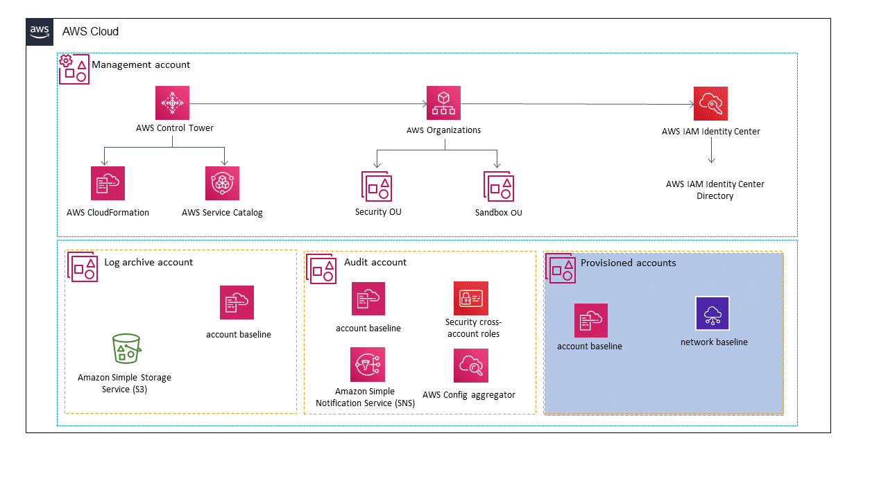
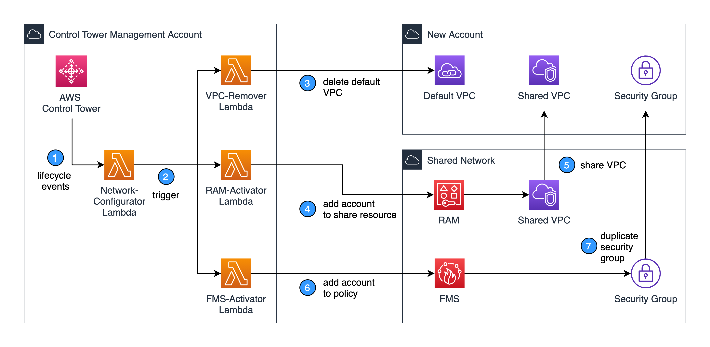

# Overview
+ AWS Control Tower offers **a straightforward way to set up and govern an AWS multi-account environment**, following prescriptive best practices.
+ AWS Control Tower orchestrates the capabilities of several other AWS services, including **AWS Organizations, AWS Service Catalog, and AWS Single Sign-on**, to **build a landing zone** in less than an hour. Resources are set up and managed on your behalf.
+ With AWS Control Tower, you can more easily **adhere to corporate standards, meet regulatory requirements, and follow best practices**.
+ You can adopt AWS Control Tower as your **primary way to provision accounts and infrastructure**. 
+ In short, AWS Control Tower offers the easiest way to set up and govern a secure, compliant, multi-account AWS environment based on best practices established by working with thousands of enterprises.
+ AWS Control Tower enables end users on your distributed teams to **provision new AWS accounts quickly, by means of configurable account templates in Account Factory**. 
+ AWS Control Tower provides a straightforward way to set up and govern a secure, multi-account AWS environment, called a landing zone. It uses AWS Organizations to create your landing zone. 
+ 
# Features
## **Landing zone**
+ A landing zone is a **well-architected, multi-account environment** that's based on security and compliance best practices.
+ It is the **enterprise-wide container** that holds all of your organizational units (OUs), accounts, users, and other resources that you want to be subject to compliance regulation.
+ A landing zone can scale to fit the needs of an enterprise of any size.
## **Guardrails**
+ A guardrail is a high-level rule that provides **ongoing governance for your overall AWS environment**.
+ It's expressed in plain language.
+ Three kinds of controls exist: **preventive, detective, and proactive**.
    + In AWS Control Tower preventive controls are implemented with **Service Control Policies (SCPs)**.
    + Detective controls are implemented with **AWS Config rules**.
    + Proactive controls are implemented with **AWS CloudFormation hooks**.
+ Preventive guardrails **prevent actions from occurring**.
+ Detective guardrails **detect specific events** when they occur and **log the action** in CloudTrail. 
+ Proactive controls check whether resources are compliant with your company policies and objectives, before the resources are provisioned in your accounts. 
    + Proactive controls monitor resources that would be deployed in your accounts by means of AWS CloudFormation templates.
+ Three categories of guidance apply to the two kinds of guardrails: **mandatory, strongly recommended, or elective**.
+ A control (also known as a guardrail) is a high-level rule that provides ongoing governance for your overall AWS Control Tower environment. Each control enforces a single rule. Preventive controls are implemented with SCPs. Detective controls are implemented with AWS Config rules. Proactive controls are implemented with AWS CloudFormation hooks. 
## **Account Factory**
+ Account Factory **automates the provisioning of new accounts** in your organization.
+ An Account Factory is a **configurable account template** that helps to **standardize the provisioning of new accounts with pre-approved account configurations**.
+ AWS Control Tower offers a built-in Account Factory that helps automate the account provisioning workflow in your organization. 
## **Dashboard**
+ The dashboard offers continuous oversight of your landing zone to your team of central cloud administrators.
# Structure of an AWS Control Tower Landing Zone
+ **Root** – The parent that contains all other OUs in your landing zone.
+ **Security OU** – This **OU contains the Log Archive and Audit accounts**. These accounts often are referred to as shared accounts. You can choose customized names for these shared accounts when you launch your landing zone. However, they cannot be renamed later.
+ **Sandbox OU** – The Sandbox OU is created when you launch your landing zone, if you enable it. This and other registered OUs **contain the enrolled accounts** that your users work with to perform their AWS workloads.
+ **AWS SSO directory** – This directory **houses your AWS SSO users**. It **defines the scope of permissions** for each AWS SSO user.
+ **AWS SSO users** – These are the identities that your users can assume to perform their AWS workloads in your landing zone.
# What happens when you set up a landing zone
+ When you set up a landing zone, AWS Control Tower performs the following actions in your management account on your behalf:
+ Creates two AWS Organizations organizational units (OUs): Security, and Sandbox (optional), contained within the organizational root structure.
+ Creates two shared accounts in the Security OU: the Log Archive account and the Audit account.
+ Creates a cloud-native directory in AWS SSO, with preconfigured groups and single sign-on access.
+ Applies 20 mandatory, preventive guardrails to enforce policies.
+ Applies two mandatory, detective guardrails to detect configuration violations.
+ Preventive guardrails are not applied to the management account.
+ Except for the management account, guardrails are applied to the organization as a whole.
# How AWS Control Tower Works With StackSets
+ AWS Control Tower uses AWS CloudFormation StackSets to set up resources in your accounts.
+ Each stack set has StackInstances that correspond to accounts, and to AWS Regions per account.
+ AWS Control Tower deploys **one stack set instance per account and Region**.
# What does AWS Control Tower do automatically?
+ Turns on CloudTrail and AWS Config and facilitates centralized login to an Amazon S3 bucket, which is located in a log archive account
+ Preconfigures Amazon SNS topics that other services can subscribe to
+ Provides federated access to accounts using IAM Identity Center
+ Turns on guardrails to protect the resources that AWS Control Tower deploys and detects non-compliance across multiple accounts
+ Supports lifecycle events so that you can configure any additional custom automations as part of new account creation
# What are typical use cases for AWS Control Tower?
+ Multiple teams and multiple workloads for each team
+ Streamlined business processes
+ Consolidated billing
+ Isolation and security
+ Simplified data residency controls
# What are some more recommendations?
+ After AWS Control Tower sets up the first, required OU for you—the Security OU—you should create some additional OUs in your landing zone.
+ We recommend that you use AWS Control Tower to create at least one additional OU, called the Sandbox OU. This OU is for your software development environments.
+ Infrastructure OU to contain your shared services and networking accounts
+ Workloads OU to contain your production workloads
# Customizing account configuration with AWS Control Tower lifecycle events
+ 
+ New AWS account provisioning triggers the AWS Control Tower CreateManagedAccount lifecycle event, which invokes the Network-Configurator Lambda function.
+ Network-Configurator Lambda function triggers three separate Lambda functions in the management account.
+ VPC-Remover Lambda function assumes an IAM role into the new account and deletes the default VPC. The default VPC is deleted only in the AWS Regions where AWS Control Tower is not yet available.
+ RAM-Activator Lambda function adds the new account ID as a member of the shared network account’s resource share.
+ Resource Access Manager in the shared network account shares the VPC to the new account automatically.
+ FMS-Activator Lambda function adds the new account ID into the primary security group policy in the shared network account.
+ Firewall Manager creates the security group on each VPC in the new account automatically.
# Integrating existing AWS CloudTrail configurations when launching AWS Control Tower
+ If you’re already using organization trails and want to install AWS Control Tower, you must disable the trusted access for CloudTrail to pass the AWS Control Tower pre-install checks.
+ It’s important to have at least one active trail in the accounts to avoid any interruptions to event-based workflows powered by Amazon EventBridge. Therefore, you could set up a temporary multi-Region trail across all the accounts before you disable trusted access for CloudTrail.
+ Prepare your environment
+ Setup temporary multi-Region trails
+ Disable organization trails
+ Install AWS Control Tower
+ Enroll existing accounts and delete duplicate trails
# Reference
+ [What Is AWS Control Tower? - AWS Control Tower](https://docs.aws.amazon.com/controltower/latest/userguide/what-is-control-tower.html)
+ [Getting Started with AWS Control Tower](https://explore.skillbuilder.aws/learn/course/14823/play/69250/getting-started-with-aws-control-tower)
