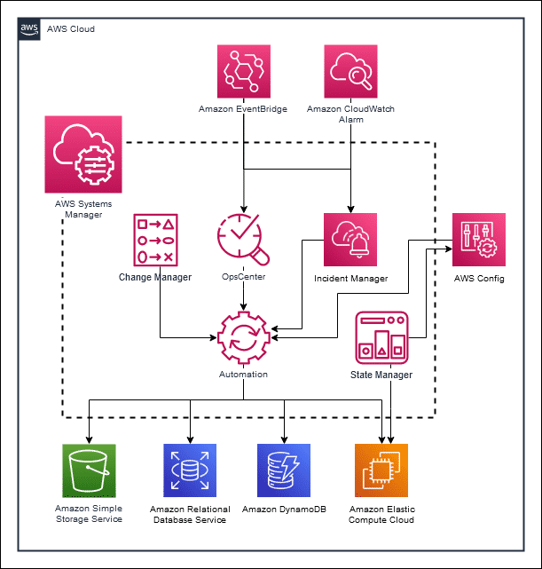

# Overview
+ AWS Systems Manager is an AWS service that you can use to **view and control your infrastructure on AWS**.
+ Systems Manager is a secure end-to-end management solution for hybrid cloud environments. It **simplifies resource and application management** and shortens the time taken to detect and resolve operational problems.
+ Using the Systems Manager console, you can **view operational data from multiple AWS services and automate operational tasks across your AWS resources**.
+ Systems Manager helps you maintain security and compliance by scanning your *managed nodes* and reporting on (or taking corrective action on) any policy violations it detects.
+ A managed node is any machine configured for Systems Manager.
+ Systems Manager supports Amazon Elastic Compute Cloud (**Amazon EC2**) instances, **edge devices, and on-premises servers and virtual machines (VMs)**, including VMs in other cloud environments.
+ For operating systems, Systems Manager supports **Windows Server, macOS, Raspberry Pi OS (formerly Raspbian), and multiple distributions of Linux**.
+ Systems Manager **gathers data from services such as AWS Config, EventBridge, AWS CloudTrail, and more**.
+ Using **AWS Config, coupled with Systems Manager and AWS Audit Manager**, you can establish compliance rules, monitor and enforce them, and then produce consolidated, detailed reports for your auditors.
# What does Systems Manager do?
+ Using the Systems Manager console, you can view operational data from multiple AWS services and automate operational tasks across your AWS resources, such as the following service instances:
    + Amazon Elastic Compute Cloud (Amazon EC2)
    + Amazon Relational Database Service (Amazon RDS)
    + Amazon Elastic Container Service (Amazon ECS)
    + Amazon Elastic Kubernetes Service (Amazon EKS)
+ 
+ Using Systems Manager, you can **centralize operational data from multiple AWS services and automate tasks across your AWS resources**.
+ You can **create logical groups of resources** such as applications, different layers of an application stack, or production environments in conjunction with development environments.
+ With Systems Manager, you can select a resource group and **view** its recent API activity, resource configuration changes, related notifications, operational alerts, software inventory, and patch compliance status.
+ You can also **take action on each resource group** depending on your operational needs.
+ Systems Manager provides a central place to **view and manage your AWS resources**, so you can have complete visibility and control over your operations. 
# What problem does Systems Manager solve?
+ If you use multiple services, trying to manage each of them individually is challenging and time consuming. Systems Manager provides you with **a centralized and consistent way to gather operational insights and carry out routine management tasks**. 
# What are the capabilities of Systems Manager?
+ **Group AWS resources**
    + Group AWS resources by any purpose or activity that you choose, such as application, environment, AWS Region, project, campaign, business unit, or software lifecycle
+ **Centralized administration**
    + Centrally define the configuration options and policies for your managed instances. View, investigate, and resolve operational work items related to AWS resources.
+ **Automation**
    + Automate or schedule various maintenance and deployment tasks. Use and create runbook-style Systems Manager (SSM) documents that define the actions to perform on your managed instances.
+ **Managed service integration**–
    + Run a command, with rate and error controls, that targets an entire fleet of managed instances. Or securely connect to a managed instance without having to open an inbound port or manage Secure Shell (SSH) keys.
+ **Data privacy**
    + Separate your secrets and configuration data from your code by using parameters, with or without encryption, and then reference those parameters from other AWS services.
+ **Metadata collection**
    + Perform automated inventory by collecting metadata about your EC2 and on-premises managed instances. Metadata can include information about applications, network configurations, and more.
+ **Consolidate inventory**
    + View consolidated inventory data from multiple Regions and AWS accounts that you manage.
+ **Compliance reporting**
     + See which resources in your account are out of compliance and take corrective action from a centralized dashboard. View active summaries of metrics and alarms for your AWS resources.
# **Capabilities in Systems Manager**
+ Systems Manager is comprised of individual *[capabilities](https://docs.aws.amazon.com/systems-manager/latest/userguide/features.html)*, which are grouped into five categories:  
## **Operations Management**
+ 
+ Helps you manage your AWS resources.
+ **Incident Manager** is an incident management console that helps users mitigate and recover from incidents affecting their AWS hosted applications.
+ **Explorer** displays an aggregated view of operations data (OpsData) for your AWS accounts and across AWS Regions.
+ **OpsCenter** provides a central location where operations engineers and IT professionals can view, investigate, and resolve operational work items (OpsItems) related to AWS resources
+ **Amazon CloudWatch Dashboards** are customizable pages in the CloudWatch console that you can use to monitor your resources in a single view, even those resources that are spread across different regions. 
## **Change Management**
+ Helps you take action on or change your AWS resources in a safe and auditable manner.
+ **Change Manager** is an enterprise change management framework for requesting, approving, implementing, and reporting on operational changes to your application configuration and infrastructure.
+ Use **Automation** to automate common maintenance and deployment tasks. You can use Automation to create and update Amazon Machine Images (AMIs), apply driver and agent updates, reset passwords on Windows Server instance.
+ **Change Calendar** helps you set up date and time ranges when actions you specify (for example, in Systems Manager Automation runbooks) can or can't be performed in your AWS account.
+ Use **Maintenance Windows** to set up recurring schedules for managed instances to run administrative tasks such as installing patches and updates without interrupting business-critical operations.
## **Application Management**
+ Helps you manage your applications running in AWS.
+ **Application Manager** helps you investigate and remediate issues with your AWS resources in the context of your applications.
+ A **resource group**is a collection of AWS resources that are all in the same AWS Region, and that match criteria provided in a query.
+ **AppConfig** helps you create, manage, and deploy application configurations. 
    + AppConfig supports controlled deployments to applications of any size.
    + You can use AppConfig with applications hosted on Amazon EC2 instances, AWS Lambda containers, mobile applications, or edge devices
+ **Parameter Store** provides secure, hierarchical storage for configuration data and secrets management. 
## **Node Management**
+ 
+ Helps you manage your EC2 instances, your on-premises servers and virtual machines (VMs) in your hybrid environment, and other types of AWS resources (nodes).
+ Use **Compliance** to scan your fleet of managed nodes for patch compliance and configuration inconsistencies.
+ **Fleet Manager** is a unified user interface (UI) experience that helps you remotely manage your nodes.
+ **Inventory** automates the process of collecting software inventory from your managed nodes. 
+ Use **Session Manager** to manage your edge devices and Amazon Elastic Compute Cloud (Amazon EC2) instances through an interactive one-click browser-based shell or through the AWS CLI.
    - With Session Manager, you can establish secure connections to your EC2 instances, edge devices, and on-premises servers and VMs. Session Manager provides secure and auditable node management without the need to open inbound ports, maintain bastion hosts, or manage SSH keys.
+ Use **Run Command** to remotely and securely manage the configuration of your managed nodes at scale. 
    - You can automate common administrative tasks and perform one-time configuration changes at scale. Administrators use Run Command to install or bootstrap applications, build a deployment pipeline, and capture log files when an instance is removed from an Auto Scaling group.
+ **Automation simplifies common maintenance and deployment tasks of EC2 instances and other AWS resources**. Automation can simplify common IT tasks such as changing the state of one or more nodes (using an approval automation) and managing node states according to a schedule.
+ Use **State Manager** to automate the process of keeping your managed nodes in a defined state.
+ Use **Patch Manager** to automate the process of patching your managed nodes with both security related and other types of updates. 
+ Use **Distributor** to create and deploy packages to managed nodes. 
+ **Hybrid Activations**: To set up servers and VMs in your hybrid environment as managed instances, create a managed instance activation.
# SSM Agent
+ AWS Systems Manager Agent (SSM Agent) is **Amazon software that runs on Amazon Elastic Compute Cloud (Amazon EC2) instances**, edge devices, and on-premises servers and virtual machines (VMs).
+ SSM Agent makes it possible for Systems Manager to update, manage, and configure these resources.
+ The agent **processes requests from the Systems Manager service** in the AWS Cloud, and then runs them as specified in the request.
+ SSM Agent then sends status and execution information back to the Systems Manager service by using the Amazon Message Delivery Service 
+ SSM Agent **must be installed on each instance you want to use with AWS Systems Manager**.
# What are the benefits of Systems Manager?
+ Shorten the time to detect problems
+ Take advantage of automation
+ Improve visibility and control
+ Manage hybrid environments
+ Maintain security and compliance
# basic technical concepts
+ **Managed nodes**
    + A managed node is any machine configured for Systems Manager. You can configure EC2 instances, edge devices, and on-premises servers and VMs, including VMs in other cloud environments, as managed nodes.
+ **OpsCenter OpsItems**
    + Operations engineers and IT professionals use Systems Manager OpsCenter to view, investigate, and remediate OpsItems that affect the performance and health of their AWS resources. To help you diagnose issues, each OpsItem includes contextually relevant information such as the name and ID of the AWS resource that generated the OpsItem, alarm or event details, alarm history, and an alarm timeline graph.
+ **Patch baselines**
    + Patch baselines include rules for auto-approving patches based on OS, product, classification, and severity, in addition to a list of explicitly approved and rejected patches.AWS provides predefined patch baselines for each OS supported by Patch Manager. However, you can create your own custom patch baselines that include approval rules specific to your environment.
+ **State Manager associations**
    + A State Manager association is a secure and scalable configuration that automates the process of keeping your managed nodes and other AWS resources in a state that you define. The configuration defines the state that you want to maintain on your instances or other AWS resources.
+ **Systems Manager Agent (SSM Agent)**
    + The SSM Agent is AWS software that runs on EC2 instances, edge devices, and on-premises servers and VMs. The agent can also be run on systems in a hybrid cloud environment. SSM Agent makes it possible for Systems Manager to update, manage, and configure these resources.
+ **Systems Manager documents**
    + Within Systems Manager, you can interact with various types of documents, such as Command documents, Automation runbooks, Session documents, and others. Systems Manager includes more than 450 preconfigured documents that you can use to perform actions on your managed instances and AWS resources or to run Python and PowerShell scripts. 
+ **Systems Manager parameters**
    + You can store data such as passwords, database strings, Amazon Machine Image (AMI) IDs, and license codes as parameter values in the Parameter Store. You can store values as plaintext or encrypted data. You can reference Systems Manager parameters in your scripts, commands, SSM documents, and configuration and automation workflows.
# Reference
+ [What is AWS Systems Manager? - AWS Systems Manager](https://docs.aws.amazon.com/systems-manager/latest/userguide/what-is-systems-manager.html)
+ [Getting Started with AWS Systems Manager](https://explore.skillbuilder.aws/learn/course/13045/play/53059/getting-started-with-aws-systems-manager)
+ [Introduction to Amazon EC2 Systems Manager](https://explore.skillbuilder.aws/learn/course/241/play/25408/introduction-to-amazon-ec2-systems-manager)
