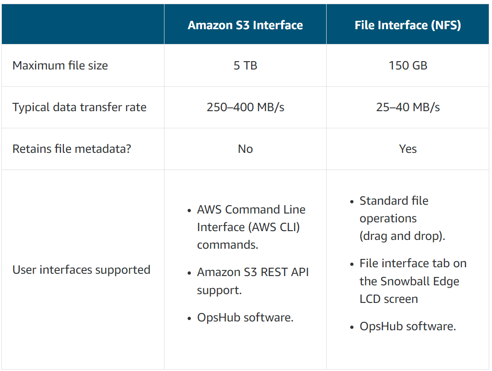
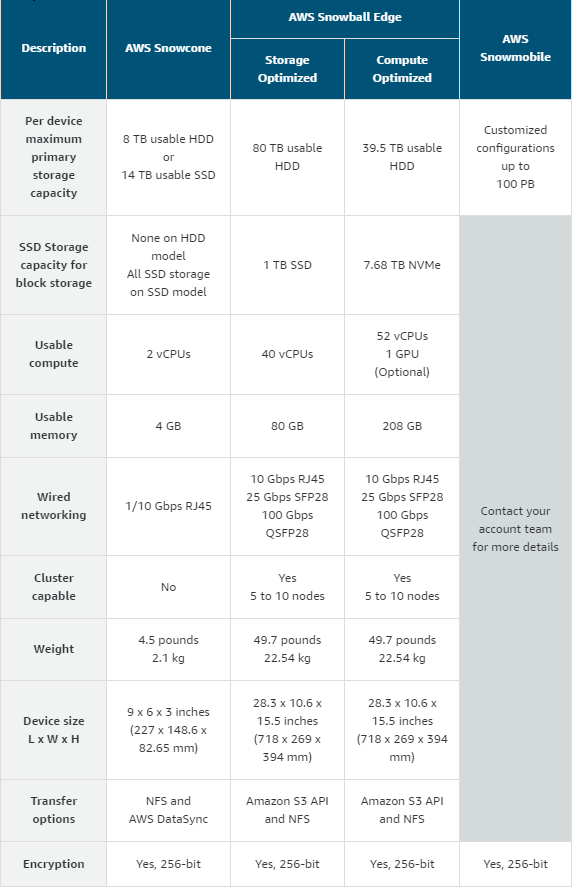

# AWS Snow Family options overview
+ AWS Snowcone, **a small, rugged, portable**, secure edge computing, storage, and data transfer device.
+ AWS Snowball Edge, **a rugged petabyte-scale** data transport device with onboard storage and compute capabilities.
+ AWS Snowmobile, **a large truck** to migrate or transport exabyte-scale datasets into and out of the AWS Cloud. 
# AWS Snowcone
+ AWS Snowcone is a **portable, rugged, and secure device for edge computing and data transfer**.
+ You can use Snowcone to **collect, process, and move data to AWS**, either **offline by shipping the device to AWS, or online by using AWS DataSync**.
+ With **two CPUs and 8 TB of storage**, Snowcone can **run edge computing workloads** that use Amazon Elastic Compute Cloud (Amazon EC2) instances, and **store data securely**.
+ The Snowcone device is **small**(227 mm x 148.6 mm x 82.65 mm), so it can be placed next to machinery in a factory to collect, format, and transport data back to AWS for storage and analysis.
+ Snowcone supports a file interface with **NFS** support. 
+ Snowcone is designed for data migration needs up to **dozens of terabytes**. It can be used in **space-constrained environments** where Snowball Edge devices don't fit.
+ AWS Snowcone is **low power, portable, lightweight, and vibration resistant**, so you can use it in a wide variety of remote and austere locations.
+ AWS Snowcone is a **region-specific service**, so make sure that the service is available in your region before you plan the job. 
+ The ruggedized enclosure makes Snowcone a robust option that works well in harsh, challenging environments, such as **mining, forestry, healthcare, automotive, industrial, and remote locations**.
## Use Cases
+ For **edge computing applications**, to collect data, process the data to gain immediate insight, and then transfer the data online to AWS.
+ To **transfer data** that is continuously generated by sensors or machines **online to AWS** in a factory or at other edge locations.
+ To distribute media, scientific, or other content **from AWS storage services to your partners and customers**.
+ To **aggregate content** by transferring media, scientific, or other content **from your edge locations to AWS**.
+ For **one-time data migration scenarios** where your data is ready to be transferred, where Snowcone offers a simple, quick, and low-cost way to transfer up to 8 TB of data into AWS by shipping the device back to AWS.
## How AWS Snowcone Works
+ Create the job – you **request one or more Snowcone devices** in the AWS Management Console **based on how much data you need to transfer** and the compute performance required.
+ A device is prepared for your job – The **Amazon Simple Storage Service (Amazon S3) buckets, data, and Amazon Elastic Compute Cloud (Amazon EC2) AMIs** that you choose are **automatically configured, encrypted, and pre-installed** on your devices. The **AWS DataSync agent** is also pre-installed before your devices are shipped to you.
+ A device is shipped to you by your region's carrier
+ Get a Snowcone power supply
+ Receive the device
+ Get your credentials and download the AWS OpsHub or Snowball Edge client for Snow family application
+ Position the hardware
+ Power on the device
+ Get the IP address for the device 
+ Use AWS OpsHub to unlock the device 
+ Use the device 
+ Don't unplug the Ethernet or power supply cables
+ Prepare the device for its return trip 
+ Your region's carrier returns the device to AWS
## Data Transfer
+ AWS DataSync is an **online** data transfer service that **simplifies, automates, and accelerates copying large amounts of data to and from** AWS storage services **over the internet or AWS Direct Connect**.
+ For **offline** data import jobs, you connect the Snowcone device to your **on-premises network** and copy data from on-premises storage devices to Snowcone through the **NFS file interface**.
## Job Storage
+ For **Import** Job Storage——Internally, Snowcone contains **8 TiB of disk storage** that can be used with the internal **NFS service** or local Amazon EC2 instances through a local Amazon EBS volume presentation. You can use **8 TB for NFS storage volume and 150 GB for (sbg1) Amazon EBS storage volume**.
+ For **Compute** Job Storage——If the job type is **local compute**, you might create a total of **8 TiB local (sbg1) Amazon EBS volumes** and attach them to Amazon EC2 instances. This allows local EC2 instances to access more local capacity than the root volume alone. 
    + Note that this is local storage only, so data written to the EBS volumes is **lost** when the device is returned to AWS because it **can't be imported into Amazon S3**.
    + The NFS server is not available for compute jobs. If you need to import or export data to or from the AWS Cloud, don't choose the local compute job type when you place your order.
## Import to Amazon S3 job Key job type characteristics
+ You must specify at least one S3 bucket when creating the Snowcone job.
+ The **8 TB or 14 TB of storage** is **formatted as an NFS share**. The NFS share includes directories for your S3 buckets that you specify when creating your job.
+ The **NFS data is imported into the corresponding S3 bucket** when returned to AWS.
+ NFS client is preloaded on the Snowcone device. NFS client does not consume vCPU and memory resources available for your use. 
+ Adding Amazon Elastic Compute Cloud (Amazon EC2) Amazon Machine Images (AMIs) is optional.
+ Limited Amazon Elastic Block Store (Amazon EBS) storage space is available for use with your EC2 compute instances on the Snowcone device.
+ **No data is imported into AWS from any EBS volumes on the Snowcone device** when returned.
+ The DataSync agent is preloaded as an Amazon EC2 AMI on Snowcone to enable online data transfer. It can transfer data between the device and **Amazon S3 buckets, Amazon Elastic File System (Amazon EFS), and Amazon FSx for Windows File Server**.
## Local compute and storage only Key job type characteristics
+ With a local compute and storage only job, AWS **does not import any data** when you return your Snowcone to AWS. 
+ You must specify at least one S3 bucket when creating the Snowcone job, even though it is not used as part of the local compute and storage only job.
+ The 8 TB or 14 TB of storage is **formatted as block storage for use as EBS volumes**. The EBS volumes are used for your EC2 compute instances on the Snowcone device.
+ No storage space is formatted as an NFS data store on the Snowcone device. The **NFS client is not preloaded** on the Snowcone device, and the Transfer Data card does not appear in AWS OpsHub.
+ You must **specify at least one Amazon EC2 AMI** when creating the Snowcone job. Specifying additional Amazon EC2 AMIs is optional.
+ **No data is imported into AWS** from any EBS volumes on the Snowcone device when it is returned to AWS.
+ The **DataSync agent is preloaded as an Amazon EC2 AMI on Snowcone to enable online data transfer**. 
## Using AWS Services on AWS Snowcone
+ Using Amazon EC2 Compute Instances
+ Using AWS DataSync to Transfer Files——It can transfer data between the device and Amazon S3 buckets, Amazon EFS, and Amazon FSx for Windows File Server.
+ Using NFS for Offline Data Transfer——transfer data offline to Amazon S3 
## Performance
The following table outlines how your network's transfer rate impacts how long it takes to fill an AWS Snowcone with data.
| Rate (MB/s) | 8 TB Transfer Time | 4 TB Transfer Time |
| --- | --- | --- |
| 100 | 21.17 hours | 10.59 hours |
| 60 | 36.57 hours | 18.29 hours | 
| 30 | 68.57 hours | 34.29 hours |
| 10 | 210.29 hours | 105.15 hours |
## Determine data transfer size
+ The default limit means that you can have only one Snowcone device at a time for an import to Amazon S3 job. Each Snowcone device requires a separate job. 
    + If you are planning a large data transfer project, work with your account team to obtain approval for multiple Snowcone devices at a time, and coordinate delivery schedules.
+ Each Snowcone device contains limited usable storage capacity. If you require a larger capacity device, consider using a Snowball Edge device for your data migration workflow. 
    + **8 TB HDD model**
    + **14 TB SSD model**
+ Suppose that you have 11 TB of NAS data to transfer to your Amazon S3 bucket. You plan to use Snowcone devices for the transfer.
    + Initial number of estimated devices: 11 TB/8 TB = 2 Snowcone HDD devices or 1 Snowcone SSD device.
## Managing AWS services on your device using AWS OpsHub
+ Amazon EC2 instances – Use Amazon EC2 instances to run software installed on a virtual server without sending it to the AWS Cloud for processing.
+ AWS DataSync (DataSync) – Transfer a large number of files between your on-premises storage and other AWS Cloud locations, such as file systems or Amazon S3.
+ Network File System (NFS) – Use file shares to move data to your device. You can ship the device to AWS to transfer your data on the AWS Cloud or use DataSync to transfer data to other AWS Cloud locations.
## Virtual network interfaces
+ Snowcone devices take advantage of **virtual network interfaces (NICs) based on Virtual Extensible LAN (VXLAN) network identifiers (VNIs)**.
+ VNIs are used to **attach a public IP address to your EC2 instances** when launched on your Snowcone.
+ You can create your VNIs in advance or create a new VNI when you launch an instance. 
+ You can use two different methods to assign an IP address: Dynamic Host Configuration Protocol (DHCP) or manually using a static IP address.
# AWS Snowball 
+ The AWS Snowball service uses physical storage devices to transfer large amounts of data between **Amazon Simple Storage Service (Amazon S3)** and your onsite data storage location at faster-than-internet speeds. 
+ **80 TB and 50 TB** models are available in US Regions; 50 TB model available in all other AWS Regions.
+ **In the process of being deprecated**: The first-generation 80 TB Snowball device is no longer available. Use the **Snowball Edge storage optimized devices** for all data transfer jobs.
# AWS Snowball Edge
+ AWS Snowball Edge is a type of Snowball device with **on-board storage and compute power** for select AWS capabilities. 
+ Snowball Edge can do **local processing and edge-computing workloads** in addition to **transferring data** between your local environment and the AWS Cloud.
+ Snowball Edge devices have three options for device configurations—**Storage Optimized, Compute Optimized, and Compute Optimized with GPU**.
+ AWS Snowball Edge is a **region-specific** service.
+ A **cluster job** is a special kind of job **for local storage and compute only**.
+ Clusters have **5–10 AWS Snowball Edge devices**, called *nodes*. 
+ A cluster offers **increased durability and storage capacity**.
+ Clusters must be either compute-optimized or storage-optimized. A cluster **can't be made of a combination** of compute-optimized nodes and storage-optimized nodes.
+ Using the **Amazon S3 Adapter** for Snowball, you can programmatically **transfer data to and from** a Snowball Edge **with Amazon S3 API actions**. 
## Snowball Edge Device Options
+ **Snowball Edge Storage Optimized (for data transfer)** – This Snowball Edge device option has a **100 TB** (80 TB usable) storage capacity.
+ **Snowball Edge Storage Optimized (with EC2 compute functionality)** – This Snowball Edge device option has **up to 80 TB of usable storage space, 24 vCPUs, and 32 GiB of memory for compute functionality**. It also comes with 1 TB of additional SSD storage space for block volumes attached to Amazon EC2 AMIs.
+ **Snowball Edge Compute Optimized** – This Snowball Edge device option has the most compute functionality, with** 52 vCPUs, 208 GiB of memory, and 42 TB** (39.5 usable) plus 7.68 TB of dedicated NVMe SSD for compute instances for block storage volumes for EC2 compute instances, and 42 TB of HDD capacity for either object storage or block storage volumes.
+ **Snowball Edge Compute Optimized with GPU** – This Snowball Edge device option is identical to the Compute Optimized option, except for an **installed GPU**, equivalent to the one available in the P3 Amazon EC2 instance type. It has a storage capacity of 42 TB (39.5 TB of HDD storage that can be used for a combination of Amazon S3 compatible object storage and Amazon EBS compatible block storage volumes) plus 7.68 TB of dedicated NVMe SSD for compute instances.
## AWS Snowball Edge Jobs
+ Importing Jobs into Amazon S3 – The transfer of 80 TB or less of your local data copied onto a single device, and then moved into Amazon S3.  
    + With an import job, your data is copied to the AWS Snowball Edge device with the built-in **Amazon S3 Adapter** for Snowball or **NFS mount point**. 
    + The import job type is **also capable of local storage and compute functionality.** This functionality uses the file interface or Amazon S3 Adapter for Snowball to read and write data, and triggers Lambda functions based off of Amazon S3 PUT object API actions running locally on the AWS Snowball Edge device.
+ Exporting Jobs from Amazon S3 – The transfer of any amount of data (located in Amazon S3), copied onto any number of Snowball Edge devices, and then moved one AWS Snowball Edge device at a time into your on-premises data destination. 
    + Your data source for an export job is **one or more Amazon S3 buckets**. 
    + The export job type is **also capable of local storage and compute functionality**. This functionality uses the file interface or Amazon S3 Adapter for Snowball to read and write data, and triggers Lambda functions based off of Amazon S3 PUT object API actions running locally on the AWS Snowball Edge device.
+ Local Compute and Storage Only Jobs – These jobs involve one AWS Snowball Edge device, or multiple devices used in a cluster. 
    + Local compute and storage jobs enable you to use Amazon S3 and AWS Lambda powered by AWS IoT Greengrass locally, without an internet connection.
    + You **can't** export data from Amazon S3 onto the device or import data into Amazon S3 when the device is returned.
    + one Lambda function can be associated with one bucket when the job is created.
## Choosing an AWS Region for your Snowball Edge Job
+ **Local compute and storage only Snowball Edge job type** - Does not support import or export from Amazon S3, so the location of your Amazon S3 buckets is not a consideration. To reduce shipping costs, select the AWS Region **closest to the location where you want to use the Snowball Edge device**.
+ **Export from Amazon S3 Snowball Edge job type** - Select the **same AWS Region as the source Amazon S3 buckets**. If your data is replicated to multiple AWS Regions, select the AWS Region with the Amazon S3 buckets closest to the location where you want to use the Snowball Edge device to reduce costs.
+ **Import to Amazon S3 Snowball Edge job type** - Select **the same AWS Region as the destination Amazon S3 buckets**. If the Amazon S3 buckets are in multiple AWS Regions, select the AWS Region closest to the location where you want to use the Snowball Edge device to reduce costs. Your data is imported into the Amazon S3 bucket in the selected AWS Region.
## Storage compatible with Amazon S3
+ The primary storage on a Snowball Edge is **based on Amazon S3 object storage**. Data is stored on the Snowball Edge in an Amazon S3 compatible format. 
+ Applications can work with Snowball Edge as an Amazon S3 compatible endpoint accessed through the Amazon S3 Software Developers Kit (SDK) or AWS Command Line Interface (AWS CLI).
+ High-speed data transfers can use the Amazon S3 Adapter to reach data transfer speeds up to **750 megabytes per second** (MBps). 
## Block storage
+ You can run block storage on both Snowball Edge Compute Optimized and Snowball Edge Storage Optimized devices. 
+ Amazon EBS volume sizes are available from 1 GB to 10 TB based on your use case requirements.
## NFS endpoint 
+ Applications can work with Snowball Edge as a network file system (NFS) mount point. For file-based workloads, you can use the file interface to read and write data to a Snowball Edge device by using the NFS mount point.
## Clustered Snowball Edge notes
+ The option for the Snowball Edge cluster is **supported only for the local compute and storage type**. 
+ No available option is provided to directly import or export from the AWS Cloud as part of the job. 
+ If you require import or export from the AWS Cloud in addition to clustering, additional separate Snowball Edge jobs are required. You can also use AWS DataSync with an external DataSync client to transfer to the AWS Cloud.
## Speeding Up Data Transfer
+ Perform multiple write operations at one time 
+ Transfer small files in batches 
+ Don't perform other operations on files during transfer 
+ Reduce local network use 
+ Eliminate unnecessary hops 
## AWS Snow Family Use Case Differences
| Use case | Snowball Edge | AWS Snowcone | 
| --- | --- | --- |
| Import data into Amazon S3 | ✓ | ✓ |
| Export from Amazon S3 | ✓ |  | 
| Durable local storage | ✓ |  |
| Local compute with AWS Lambda | ✓ | ✓ |
| Local compute instances | ✓ | ✓ |
| Durable Amazon S3 storage in a cluster of devices | ✓ | |
| Use with AWS IoT Greengrass (IoT) | ✓ | ✓ |
| Transfer files through NFS with a GUI | ✓ | ✓ |
| GPU workloads | ✓ | |
## data transfrer
+ When you transfer data to a Snowball Edge device, you do so through the **Snowball Edge client**, which is **installed on a physical workstation that hosts the data that you want to transfer**. Because the workstation is a potential bottleneck for transferring data, AWS highly recommends that your workstation be a powerful computer, able to meet high demands in terms of processing, memory, and networking.
+ you get faster performance out of **batching small files together**. To improve performance while transferring a large number of small files, (files less than 1 MB) you can use batching.
+ As a best practice for large data transfers involving multiple jobs, separate your data into a number of smaller, manageable data transfer segments
+ The standard Snowball Edge device is shipped with **Amazon S3 and Network File System (NFS) capabilities**. As a general rule, the NFS file interface should only be used when the volume of data to be transferred is low, or if the data transfer client cannot use Amazon S3. 

## AWS Snowball Edge Integration with Other AWS Services
+ Amazon EC2
+ Amazon EKS
+ Amazon EBS
+ AWS Lambda Powered by AWS IoT Greengrass
    + Snowball Edge devices can run Lambda functions that are **initiated when data is put in an S3 bucket**. Lambda on a Snowball Edge device is powered by AWS IoT Greengrass.
    + Before you can use AWS IoT Greengrass with Snowball Edge as a core device, you must **associate an AWS IoT Greengrass service role** with your account.
+ AWS CloudTrail
+ AWS Key Management Service
+ AWS Data Migration Service
    + AWS DMS can use Snowball Edge as a transport mechanism to migrate large databases more quickly than by other methods to the AWS Cloud. 
# AWS Snowmobile
+ AWS Snowmobile moves **up to 100 PB of data in a 45-foot long ruggedized shipping container pulled by a semitrailer truck**. Snowmobile is ideal for multi-petabyte or exabyte-scale data migrations. 
+ A Snowmobile arrives at the customer site and appears as a network-attached data store for secure, high-speed data transfer. After data is transferred to Snowmobile, it is driven back to an AWS Region, and the data is uploaded into Amazon S3.
+ Snowmobile is tamper-resistant, waterproof, and temperature controlled. It is made up of multiple layers of logical and physical security. For example, security includes encryption, fire suppression, dedicated security personnel, GPS tracking, alarm monitoring, 24/7 video surveillance, and an escort security vehicle during transit.
# AWS Snow Family comparison

# Reference
+ [AWS Snowcone](https://docs.aws.amazon.com/snowball/latest/snowcone-guide/snowcone-what-is-snowcone.html)
+ [AWS Snowball Edge](https://docs.aws.amazon.com/snowball/latest/developer-guide/whatisedge.html)
+ [AWS Snowcone Planning and Logistics](https://explore.skillbuilder.aws/learn/course/143/aws-snowcone-planning-and-logistics)
+ [AWS Snowcone Primer](https://explore.skillbuilder.aws/learn/course/158/aws-snowcone-primer)
+ [Using AWS Snowcone](https://explore.skillbuilder.aws/learn/course/136/play/54922/using-aws-snowcone)
