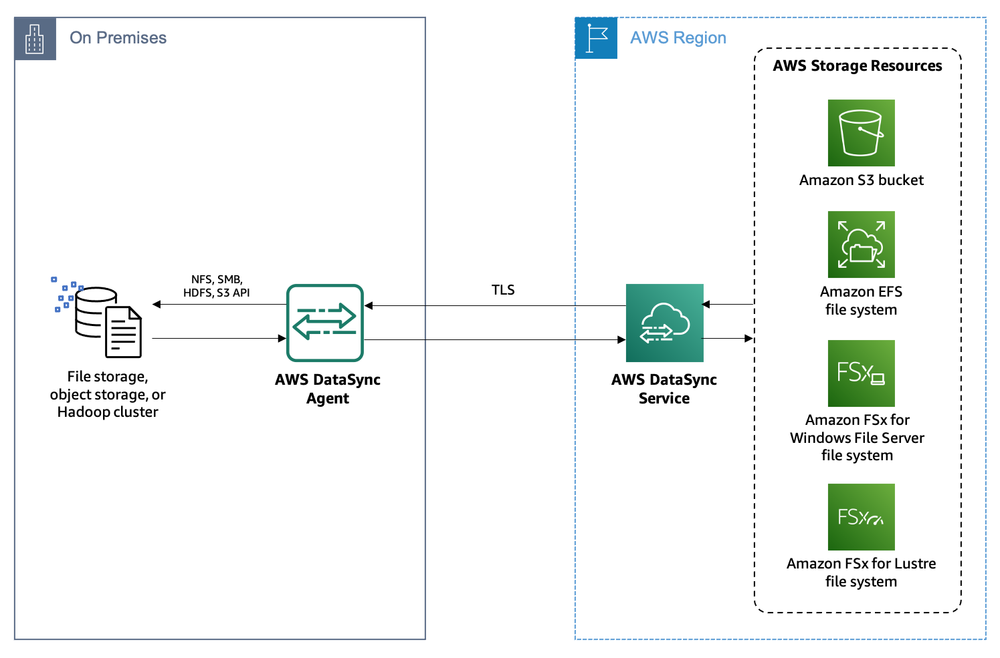
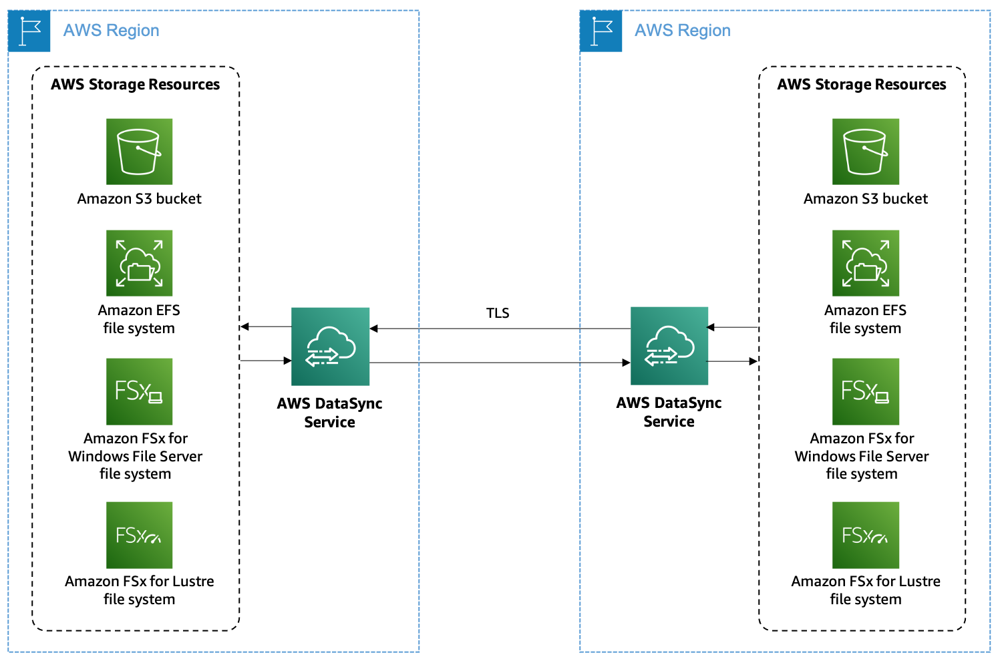

# Overview
+ AWS DataSync is an online data transfer service that simplifies, automates, and accelerates moving data **between on-premises storage systems and AWS storage services**, and also **between AWS storage services**.
+ On-premises storage transfers
    + Network File System (NFS)
    + Server Message Block (SMB)
    + Hadoop Distributed File Systems (HDFS)
    + Object storage
+ AWS storage transfers
    + Amazon S3
    + Amazon EFS
    + Amazon FSx for Windows File Server
    + Amazon FSx for Lustre
    + Amazon FSx for OpenZFS
    + Amazon FSx for NetApp ONTAP
+ Other cloud storage transfers
    + Google Cloud Storage
    + Microsoft Azure Blob Storage
    + Microsoft Azure Files
    + Wasabi Cloud Storage
    + DigitalOcean Spaces
    + Oracle Cloud Infrastructure Object Storage
    + Cloudflare R2 Storage
    + Backblaze B2 Cloud Storage
    + NAVER Cloud Object Storage
    + Alibaba Cloud Object Storage Service
    + IBM Cloud Object Storage
    + Seagate Lyve Cloud
    + Edge storage transfers
+ DataSync works with the following edge storage services and devices:
    + Amazon S3 compatible storage on AWS Snowball Edge
    + AWS Snowcone
# Use cases
+ **Data migration** – Move active datasets rapidly over the network into Amazon S3, Amazon EFS, FSx for Windows File Server, or FSx for Lustre. DataSync includes automatic encryption and data integrity validation to help make sure that your data arrives securely, intact, and ready to use.
+ **Archiving cold data** – Move cold data stored in on-premises storage directly to durable and secure long-term storage classes such as S3 Glacier Flexible Retrieval or S3 Glacier Deep Archive. Doing so can free up on-premises storage capacity and shut down legacy systems.
+ **Data protection** – Move data into any Amazon S3 storage class, choosing the most cost-effective storage class for your needs. You can also send data to Amazon EFS, FSx for Windows File Server, or FSx for Lustre for a standby file system.
+ **Data movement for timely in-cloud processing** – Move data in to or out of AWS for processing when working with systems that generate data on-premises.
# Benefits
+ Simplify and automate data movement
+ Transfer data securely+ Move data faster
+ Reduce operational costs
# AWS DataSync architecture
+ Data transfer between self-managed storage and AWS

+ Data transfer between AWS storage services

# Components
+ **Agent** – A virtual machine (VM) that's used to read data from or write data to a self-managed location. An agent isn't required when transferring between AWS storage services in the same AWS account.
+ **Location** – Any source or destination location that's used in the data transfer, such as, Amazon S3, Amazon EFS, Amazon FSx for Windows File Server, Amazon FSx for Lustre, Network File System (NFS), Server Message Block (SMB), Hadoop Distributed File System (HDFS), or self-managed object storage.
+ **Task** – A source location and a destination location, and a configuration that defines how data is transferred. A task always transfers data from the source to the destination. The configuration can include options such as task schedule, bandwidth limit, and so on. A task is the complete definition of a data transfer.
+ **Task execution** – An individual run of a task, which includes information such as the start time, end time, bytes written, and status.
# How DataSync transfers files
+ When a task starts, it goes through different phases: **LAUNCHING**, **PREPARING**, **TRANSFERRING**, and **VERIFYING**. 
+ In the **LAUNCHING** phase, DataSync initializes the task execution. 
+ In the **PREPARING** phase, DataSync examines the source and destination file systems to determine which files to sync.
+ After the scanning is done and the differences are calculated, DataSync transitions to the **TRANSFERRING** phase. At this point, DataSync starts transferring files and metadata from the source file system to the destination.
+ After the **TRANSFERRING** phase is done, DataSync verifies consistency between the source and destination file systems. This is the **VERIFYING** phase. 
+ AWS DataSync locally calculates the **checksum of every file** in the source file system and the destination and compares them.
+ Additionally, DataSync compares the **metadata of every file** in the source and destination and compares them
# Using AWS DataSync in a virtual private cloud
+ You can deploy AWS DataSync in your virtual private cloud (VPC) based on the Amazon VPC service by using **VPC endpoints**.
+ With this feature, the connection between an agent and the DataSync service **doesn't cross the public internet** and doesn't require public IP addresses.
+ These connection restrictions **increase the security** of your data by keeping network traffic within your VPC
# Reference
+ [AWS DataSync](https://docs.aws.amazon.com/datasync/latest/userguide/what-is-datasync.html)
+ [AWS DataSync Primer](https://explore.skillbuilder.aws/learn/course/102/play/46447/aws-datasync-primer)
