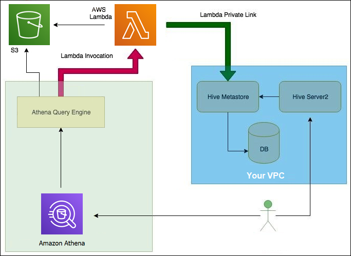

# Overview
+ Amazon Athena is an interactive query service that makes it easy to **analyze data directly in Amazon Simple Storage Service (Amazon S3) using standard SQL**
+ Athena is **serverless**, so there is no infrastructure to set up or manage, and you pay only for the queries you run.
+ Athena **scales automatically**—running queries in parallel—so results are fast, even with large datasets and complex queries.
+ Athena helps you **analyze unstructured, semi-structured, and structured data stored in Amazon S3**. Examples include CSV, JSON, or columnar data formats such as Apache Parquet and Apache ORC. You can use Athena to run **ad-hoc queries using ANSI SQL**, **without the need to aggregate or load the data into Athena**.
+ Athena integrates with **Amazon QuickSight** for easy data visualization. You can use Athena to generate reports or to explore data with business intelligence tools or SQL clients connected with a **JDBC or an ODBC driver**. 
# Components
+ In Athena, **tables and databases are containers** for the **metadata definitions** that define a schema for underlying source data.
+ For **each dataset, a table needs to exist** in Athena. 
+ Before querying data, a table must be registered in Athena. The registration occurs when you either create tables **automatically or manually**.
+ Regardless of how the tables are created, **the tables creation process registers the dataset with Athena**.
+ The metadata in the table tells Athena **where the data is located in Amazon S3**, and specifies **the structure of the data**, for example, column names, data types, and the name of the table.
+ Databases are a logical grouping of tables, and also hold only metadata and schema information for a dataset.
+ After you create a table, you can use SQL SELECT statements to query it, including getting specific file locations for your source data. Your query results are stored in Amazon S3 in the query result location that you specify.
# Connecting to Data Sources
+ The tables and databases that you work with in Athena to **run queries are based on metadata**.
+ Metadata is data about the **underlying data in your dataset**.
+ **How that metadata describes your dataset is called the schema**.
+ For example, a table name, the column names in the table, and the data type of each column are schema, saved as metadata, that describe an underlying dataset.
+ In Athena, we call a system for organizing metadata a *data catalog* or a *metastore*. The combination of a dataset and the data catalog that describes it is called a *data source*.
+ Athena natively supports the **AWS Glue Data Catalog**. The AWS Glue Data Catalog is a data catalog built on top of other datasets and data sources such as **Amazon S3, Amazon Redshift, and Amazon DynamoDB**. 
# Integration with AWS Glue
+ AWS Glue is a fully managed ETL (extract, transform, and load) AWS service. One of its key abilities is to analyze and categorize data. You can use **AWS Glue crawlers** to **automatically infer database and table schema from your data in Amazon S3 and store the associated metadata in the AWS Glue Data Catalog**.
+ Athena uses the **AWS Glue Data Catalog to store and retrieve table metadata** for the Amazon S3 data in your Amazon Web Services account. The table metadata lets the Athena query engine know how to find, read, and process the data that you want to query.
# Using External Hive Metastore
+ You can use the Amazon Athena data connector **for external Hive metastore** to query data sets in Amazon S3 that use an Apache Hive metastore.
+ **No migration** of metadata to the AWS Glue Data Catalog is necessary.
+ In the Athena management console, you configure **a Lambda function** to communicate with the Hive metastore that is in your private VPC and then connect it to the metastore. 

# Using Amazon Athena Federated Query
+ If you have data in sources other than Amazon S3, you can use Athena Federated Query to query the data in place or build pipelines that extract data from multiple data sources and store them in Amazon S3. 
+ With Athena Federated Query, you can run SQL queries **across data stored in relational, non-relational, object, and custom data sources**.
+ Athena uses **data source connectors that run on AWS Lambda** to run federated queries. A data source connector is a **piece of code that can translate between your target data source and Athena**. 
+ Preparing to create federated queries is a two-part process: **deploying a Lambda function data source connector, and connecting the Lambda function to a data source**.+ After you have configured one or more data connectors and deployed them to your account, you can use them in your Athena queries.
# Athena Compression Support
+ Athena supports a variety of compression formats for reading and writing data, including reading from a table that uses multiple compression formats. For example, Athena can successfully read the data in a table that uses Parquet file format when some Parquet files are compressed with Snappy and other Parquet files are compressed with GZIP. The same principle applies for ORC, Textfile, and JSON storage formats.
+ Athena supports the following compression formats: 
    + BZIP2 – Format that uses the Burrows-Wheeler algorithm.
    + DEFLATE – Compression algorithm based on LZSS and Huffman coding. Deflate is relevant only for the Avro file format.
    + GZIP – Compression algorithm based on Deflate. GZIP is the default write compression format for files in the Parquet and Textfile storage formats.
    + LZ4 – This member of the Lempel-Ziv 77 (LZ7) family also focuses on **compression and decompression speed rather than maximum compression of data**. LZ4 has the following framing formats:   
        + LZ4 Raw/Unframed – An unframed, standard implementation of the LZ4 block compression format.
        + LZ4 Framed – The usual framing implementation of LZ4. 
        + LZ4 Hadoop-Compatible – The Apache Hadoop implementation of LZ4. This implementation wraps LZ4 compression with the BlockCompressorStream.java class.
    + LZO – Format that uses the Lempel–Ziv–Oberhumer algorithm, which focuses on **high compression and decompression speed rather than the maximum compression of data**. LZO has two implementations: 
        + Standard LZO
        + LZO Hadoop-Compatible – This implementation wraps the LZO algorithm with the BlockCompressorStream.java class.
    + SNAPPY – Compression algorithm that is part of the Lempel-Ziv 77 (LZ7) family. Snappy focuses on **high compression and decompression speed rather than the maximum compression of data**.
        + Some implementations of Snappy allow for framing. Framing enables decompression of streaming or file data that cannot be entirely maintained in memory. The following framing implementations are relevant for Athena: 
        + Snappy Raw/Unframed – The standard implementation of the Snappy format that does not use framing.
        + Snappy-Framed – The framing implementation of the Snappy format.
        + Snappy Hadoop-Compatible – The framing implementation of Snappy that the Apache Hadoop Project uses. 
+ ZLIB – Based on Deflate, ZLIB is the default write compression format for files in the ORC data storage format. 
# SerDe Reference
+ A SerDe (**Serializer/Deserializer**) is a way in which Athena interacts with data in various formats.
+ Athena supports several SerDe libraries for parsing data from different data formats, such as CSV, JSON, Parquet, and ORC. Athena does not support custom SerDes.

# Running SQL Queries
+ Amazon Athena **automatically stores query results and metadata information** for each query that runs in a *query result location* that you can specify in Amazon S3.
+ Each query that runs is known as a *query execution*. The query execution has a unique identifier known as the **query ID or query execution ID**.
# Working with Views
+ You can create a view from a `SELECT` query and then reference this view in future queries.
+ A view in Amazon Athena is **a logical, not a physical table.**
+ The query that defines a view **runs each time the view is referenced in a query**.
+ You may want to create views to: 
    + *Query a subset of data*.
    + *Combine multiple tables in one query*. 
    + *Hide the complexity of existing base queries and simplify queries run by users*. 
    + *Experiment with optimization techniques and create optimized queries*. 
    + *Hide the underlying table and column names, and minimize maintenance problems* if those names change.
# Querying with Prepared Statements
+ You can use the Athena parameterized query feature to prepare statements for repeated execution of the **same query with different query parameters**.
+ A prepared statement **contains parameter placeholders** whose values are supplied at execution time.
+ Prepared statements enable Athena queries to take parameters directly and help to **prevent SQL injection attacks**.
# Querying JSON    
+ Choose the right SerDe, a native JSON SerDe, `org.apache.hive.hcatalog.data.JsonSerDe`, or an OpenX SerDe, `org.openx.data.jsonserde.JsonSerDe`. 
+ Make sure that each JSON-encoded record is represented on a separate line, not pretty-printed.
+ Generate your JSON-encoded data in case-insensitive columns.
+ Provide an option to ignore malformed records+ Convert fields in source data that have an undetermined schema to JSON-encoded strings in Athena.
# Reference
[Amazon Athena](https://docs.aws.amazon.com/athena/latest/ug/what-is.html)

