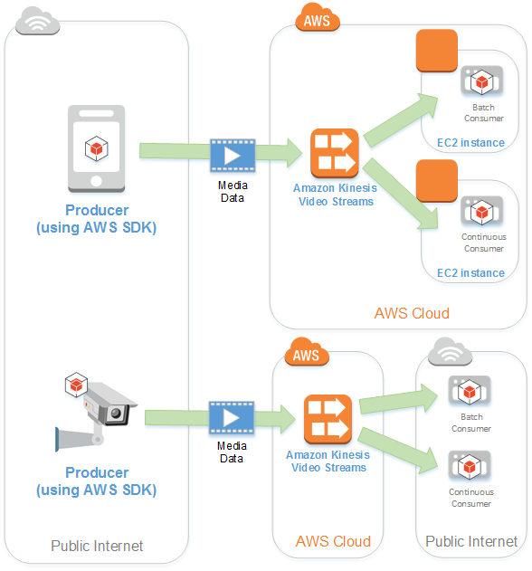

# Overview
+ Amazon Kinesis Video Streams is a fully managed AWS service that you can use to **stream live video from devices to the AWS Cloud**, or **build applications for real-time video processing or batch-oriented video analytics**.
+ Kinesis Video Streams isn't just storage for video data. You can use it to **watch your video streams in real time** as they are received in the cloud. 
+ You can use Kinesis Video Streams to **capture massive amounts of live video data from millions of sources**, including smartphones, security cameras, webcams, cameras embedded in cars, drones, and other sources. You can also send non-video time-serialized data such as audio data, thermal imagery, depth data, RADAR data, and more. 
+ You can also configure your Kinesis video stream to **durably store media data for the specified retention period**. 
+ Benefits of using Kinesis Video Streams include the following: 
    + **Connect and stream from millions of devices**
    + **Durably store, encrypt, and index data**
    + **Focus on managing applications instead of infrastructure** – Kinesis Video Streams is serverless, so there is no infrastructure to set up or manage. 
    + **Build real-time and batch applications on data streams**
    + **Stream data more securely**– Kinesis Video Streams encrypts all data as it flows through the service and when it persists the data.
    + **Pay as you go**
# Architecture

+  **Producer** – Any source that puts data into a Kinesis video stream. 
+ **Kinesis Video Streams Producer libraries** – A set of easy-to-use software and libraries that you can install and configure on your devices.
+ **Kinesis video stream** – A resource that enables you to transport live video data, optionally store it, and make the data available for consumption both in real time and on a batch or ad hoc basis.
+ **Consumer** – Gets data, such as fragments and frames, from a Kinesis video stream to view, process, or analyze it.  
    + Generally these consumers are called Kinesis Video Streams applications.
    + Multiple independent applications can consume a Kinesis video stream in parallel.
+ **Kinesis Video Stream Parser Library** – Enables Kinesis Video Streams applications to reliably get media from Kinesis video streams in a low-latency manner
# Amazon Kinesis Video Streams with WebRTC
+ WebRTC is an open technology specification for **enabling real-time communication**(RTC) across **browsers and mobile applications** via simple APIs.
+ Amazon Kinesis Video Streams provides a standards-compliant WebRTC implementation as a fully managed capability.
+ You can use Amazon Kinesis Video Streams with WebRTC to **securely live stream media or perform two-way audio or video interaction between any camera IoT device and WebRTC-compliant mobile or web players**. 
+ Using Kinesis Video Streams with WebRTC, you can easily build applications for live peer-to-peer media streaming, or **real-time audio or video interactivity** between **camera IoT devices, web browsers, and mobile devices** for a variety of use cases. 
+ Such applications can help parents keep an eye on their baby’s room, enable homeowners to use a video doorbell to check who’s at the door
## Concepts
+ **Signaling channel**
    + Signaling messages are **metadata** that two applications exchange with each other **to establish peer-to-peer connectivity**.
    + A resource that **enables applications to discover, set up, control, and terminate a peer-to-peer connection** by exchanging signaling messages.
    + A signaling channel enables applications to connect with each other in a **one-to-few model**, using the concept of one master connecting to multiple viewers. 
+ **Up to 10 applications** can then connect to that signaling channel by assuming the viewer responsibility by invoking the `ConnectAsViewer` API
+ **Peer**
    + Any device or application (for example, a mobile or web application, webcam, home security camera, baby monitor, etc.) that is configured for real-time, two-way streaming through a Kinesis Video Streams with WebRTC.
+ **Master**
    + **A peer that initiates the connection** and is connected to the signaling channel with the ability to **discover and exchange media with any of the signaling channel's connected viewers.**
+ **Viewer**
    + A peer that is connected to the signaling channel with the ability to discover and exchange media only with the signaling channel's master.
# Reference
+ [ Amazon Kinesis Video Streams](https://docs.aws.amazon.com/kinesisvideostreams/latest/dg/what-is-kinesis-video.html)
+ [Amazon Kinesis Video Streams with WebRTC](https://docs.aws.amazon.com/kinesisvideostreams-webrtc-dg/latest/devguide/what-is-kvswebrtc.html)
