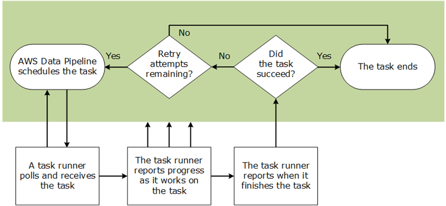

# Overview
+ AWS Data Pipeline is a web service that you can use to **automate the movement and transformation of data**.
+ With AWS Data Pipeline, you can define **data-driven workflows**, so that tasks can be dependent on the successful completion of previous tasks.+ You define the parameters of your data transformations and AWS Data Pipeline enforces the logic that you've set up.
# Components
+ **A pipeline definition** specifies the business logic of your data management.
+ **A pipeline** schedules and runs tasks by creating Amazon EC2 instances to perform the defined work activities. 
+ **Task Runner**polls for tasks and then performs those tasks.
# Related Services
+ AWS Data Pipeline works with the following services to store data. 
    + Amazon DynamoDB 
    + Amazon RDS 
    + Amazon Redshift 
    + Amazon S3 
+ AWS Data Pipeline works with the following compute services to transform data. 
    + Amazon EC2
    + Amazon EMR
# Concepts
## Pipeline Definition
+ A pipeline definition is **how you communicate your business logic to AWS Data Pipeline**. It contains the following information: 
    + Names, locations, and formats of your data sources
    + Activities that transform the data
    + The schedule for those activities
    + Resources that run your activities and preconditions
    + Preconditions that must be satisfied before the activities can be scheduled
    + Ways to alert you with status updates as pipeline execution proceeds
+ From your pipeline definition, AWS Data Pipeline **determines the tasks, schedules them, and assigns them to task runners**.
## Pipeline Components, Instances, and Attempts
+ **Pipeline Components**
    + Pipeline components **represent the business logic of the pipeline** and are represented by the different sections of a pipeline definition.
    + Pipeline components **specify the data sources, activities, schedule, and preconditions of the workflow**.
    + Relationships among components are defined by **reference**.
    + Pipeline components **define the rules of data management**.
+ **Instances**
    + When AWS Data Pipeline runs a pipeline, it compiles the pipeline components to create a set of actionable instances.
    + Each instance contains all the information for performing a specific task.
    + The complete set of instances is the to-do list of the pipeline.
    + AWS Data Pipeline hands the instances out to task runners to process.
+ **Attempts**
    + To provide robust data management, AWS Data Pipeline **retries a failed operation**.
    + It continues to do so until the task reaches the maximum number of allowed retry attempts.
    + Attempt objects **track** the various attempts, results, and failure reasons if applicable.
    + Essentially, it is the instance with a counter. 
## Task Runners
+ A task runner is an application that **polls AWS Data Pipeline for tasks and then performs those tasks**.
+ There are two ways you can use Task Runner to process your pipeline: 
    + AWS Data Pipeline installs Task Runner for you on resources that are launched and managed by the AWS Data Pipeline web service.
    + You install Task Runner on a computational resource that you manage, such as a long-running EC2 instance, or an on-premises server.

## Data node
+ In AWS Data Pipeline, a data node defines the location and type of data that a pipeline activity uses as input or output. AWS Data Pipeline supports the following types of data nodes:
    + DynamoDBDataNode
        + A DynamoDB table that contains data for HiveActivity or EmrActivity to use.
    + SqlDataNode
        + An SQL table and database query that represent data for a pipeline activity to use.
    + RedshiftDataNode
        + An Amazon Redshift table that contains data for RedshiftCopyActivity to use.
    + S3DataNode
        + An Amazon S3 location that contains one or more files for a pipeline activity to use.
## Databases
+ JdbcDatabase
+ RdsDatabase: An Amazon RDS database.
+ RedshiftDatabase: An Amazon Redshift database.
## Activities
+ In AWS Data Pipeline, an activity is a pipeline component that **defines the work to perform**.
+ AWS Data Pipeline provides several **pre-packaged activities** that accommodate common scenarios, such as moving data from one location to another, running Hive queries, and so on.
+ AWS Data Pipeline supports the following types of activities: 
    + CopyActivity: Copies data from one location to another.
    + EmrActivity: Runs an Amazon EMR cluster.
    + HiveActivity: Runs a Hive query on an Amazon EMR cluster.
    + HiveCopyActivity: Runs a Hive query on an Amazon EMR cluster with support for advanced data filtering and support for S3DataNode and DynamoDBDataNode.
    + PigActivity: Runs a Pig script on an Amazon EMR cluster.
    + RedshiftCopyActivity: Copies data to and from Amazon Redshift tables.
    + ShellCommandActivity: Runs a custom UNIX/Linux shell command as an activity.
    + SqlActivity: Runs a SQL query on a database.
## Precondition
+ In AWS Data Pipeline, a precondition is a pipeline component containing conditional statements that **must be true before an activity can run**.
+ System-Managed Preconditions 
    + DynamoDBDataExists: Checks whether data exists in a specific DynamoDB table.
    + DynamoDBTableExists: Checks whether a DynamoDB table exists.
    + S3KeyExists: Checks whether an Amazon S3 key exists.
    + S3PrefixNotEmpty: Checks whether an Amazon S3 prefix is empty.
+ User-Managed Preconditions 
    + Exists: Checks whether a data node exists.
    + ShellCommandPrecondition: Runs a custom Unix/Linux shell command as a precondition.
## Resource
+ In AWS Data Pipeline, a resource is **the computational resource that performs the work** that a pipeline activity specifies. AWS Data Pipeline supports the following types of resources:
    + Ec2Resource: An EC2 instance that performs the work defined by a pipeline activity.
    + EmrCluster: An Amazon EMR cluster that performs the work defined by a pipeline activity, such as EmrActivity.
## Actions
+ AWS Data Pipeline actions are **steps that a pipeline component takes when certain events occur**, such as success, failure, or late activities
+ AWS Data Pipeline supports the following actions: 
    + SnsAlarm: An action that sends an SNS notification to a topic based on `onSuccess`, `OnFail`, and `onLateAction` events.
    + Terminate: An action that** triggers the cancellation of a pending or unfinished activity**, resource, or data node.+ You **cannot **terminate actions that include `onSuccess`, `OnFail`, or `onLateAction`.
# Reference
[AWS Data Pipeline](https://docs.aws.amazon.com/datapipeline/latest/DeveloperGuide/what-is-datapipeline.html)
