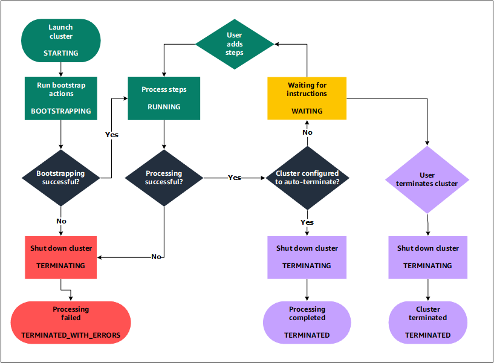

# Overview
+ Amazon EMR (previously called Amazon Elastic MapReduce) is a **managed cluster platform that simplifies running big data frameworks**, such as Apache Hadoop and Apache Spark, on AWS to process and analyze vast amounts of data.
+ Amazon EMR also lets you **transform and move large amounts of data into and out of other AWS data stores and databases**, such as Amazon Simple Storage Service (Amazon S3) and Amazon DynamoDB.
# Understanding clusters and nodes
+ The central component of Amazon EMR is the **cluster**.
+ A cluster is a collection of Amazon Elastic Compute Cloud (Amazon EC2) instances.
+ Each instance in the cluster is called a **node**.
+ Each node has a role within the cluster, referred to as the **node type**. 
+ **Master node**: A node that **manages the cluster** by running software components to **coordinate the distribution of data and tasks among other nodes for processing**. The master node tracks the status of tasks and monitors the health of the cluster. Every cluster has a master node, and it's possible to create a single-node cluster with only the master node.
+ **Core node**: A node with software components that **run tasks and store data in the Hadoop Distributed File System (HDFS) on your cluster**. Multi-node clusters have at least one core node.
+ **Task node**: A node with software components that **only runs tasks** and does not store data in HDFS. Task nodes are optional.
+ **cluster lifecycle**
    + Amazon EMR **first provisions EC2 instances** in the cluster for each instance according to your specifications. During this phase, the cluster state is **`STARTING`**.
    + Amazon EMR **runs bootstrap actions** that you specify on each instance. You can use bootstrap actions to install custom applications and perform customizations that you require. During this phase, the cluster state is **`BOOTSTRAPPING`**.
    + Amazon EMR installs the native applications that you specify when you create the cluster, such as Hive, Hadoop, Spark, and so on.
    + After bootstrap actions are successfully completed and native applications are installed, the cluster state is **`RUNNING`**. At this point, you can connect to cluster instances, and the cluster sequentially runs any steps that you specified when you created the cluster.+ After steps run successfully, the cluster goes into a **`WAITING`** state. 
    + If a cluster is configured to auto-terminate after the last step is complete, it goes into a `TERMINATING` state and then into the `TERMINATED` state.
    + If the cluster is configured to wait, you must manually shut it down when you no longer need it. 

# Amazon EMR architecture
## Storage
+ **Hadoop Distributed File System (HDFS)** is a distributed, scalable file system for Hadoop. 
    + HDFS distributes **the data it stores across instances** in the cluster, storing multiple copies of data on different instances to ensure that **no data is lost if an individual instance fails**.
    + HDFS is **ephemeral storage** that is reclaimed when you terminate a cluster.
    + HDFS is useful for caching intermediate results during MapReduce processing or for workloads that have significant random I/O. 
+ **EMR File System (EMRFS)**, Amazon EMR **extends Hadoop to add the ability to directly access data stored in Amazon S3** as if it were a file system like HDFS. You can use either HDFS or Amazon S3 as the file system in your cluster. Most often, Amazon S3 is used to store input and output data and intermediate results are stored in HDFS.
+ **The local file system refers to a locally connected disk**. 
    + When you create a Hadoop cluster, each node is created from an Amazon EC2 instance that comes with a preconfigured block of pre-attached disk storage called an **instance store**.
    + Data on instance store volumes **persists only during the lifecycle of its Amazon EC2 instance**.
## Cluster resource management
+ The resource management layer is **responsible for managing cluster resources and scheduling the jobs** for processing data.
+ By default, Amazon EMR uses **YARN**(Yet Another Resource Negotiator), which is a component introduced in Apache Hadoop 2.0 to centrally manage cluster resources for multiple data-processing frameworks.
+ However, there are **other frameworks and applications that are offered** in Amazon EMR that do not use YARN as a resource manager. 
## Data processing frameworks
+ The data processing framework layer is the engine used to process and analyze data.
+ **Hadoop MapReduce** is an open-source programming model for distributed computing.+ **Spark** is a cluster framework and programming model for processing big data workloads.
## Applications and programs
+ Amazon EMR supports many applications, such as **Hive, Pig, and the Spark Streaming library** to provide capabilities such as using higher-level languages to create processing workloads, leveraging machine learning algorithms, making stream processing applications, and building data warehouses.
# Workflow

# Deployment options
+ AMAZON EMR SERVERLESS
+ AMAZON EMR ON AMAZON EC2
+ AMAZON EMR ON EKS
+ AMAZON EMR ON AWS OUTPOSTS
# Amazon EMR Studio
+ Amazon EMR Studio is a **web-based integrated development environment (IDE)** for fully managed **Jupyter notebooks** that run on Amazon EMR clusters.
+ You can set up an Amazon EMR Studio for your team to develop, visualize, and debug applications written in R, Python, Scala, and PySpark.
+ Amazon EMR Studio is integrated with AWS Identity and Access Management (IAM) and AWS SSO so users can log in using their corporate credentials.
+ You can create an EMR Studio **at no cost**. Applicable **charges for Amazon S3 storage and for Amazon EMR clusters** apply when you use EMR Studio. 
# Amazon EMR on EKS
+ Amazon EMR on EKS provides a deployment option for Amazon EMR that allows you to run open-source big data frameworks **on Amazon Elastic Kubernetes Service (Amazon EKS)**. With this deployment option, you can focus on running analytics workloads while Amazon EMR on EKS builds, configures, and manages containers for open-source applications. 
# Amazon EMR Serverless
## core concepts
+ APPLICATION
    + You can create one or more applications that use open-source analytics frameworks by specifying the framework that you want to use (for example, Apache Spark or Apache Hive), the Amazon EMR release version, and the name of your application.
+ JOB
    + A job is a request submitted to an Amazon EMR Serverless application that runs asynchronously and is tracked through completion. You can run multiple jobs concurrently in an application. Jobs are run in a single Availability Zone to avoid cross-AZ network communication. If there is an Availability Zone failure, jobs are retried in a healthy AZ.
+ WORKERS
    + Amazon EMR Serverless applications use workers internally to run jobs. Depending on the open-source framework, it uses a default number of vCPU, memory, and local storage per worker. You can override these defaults for your application.
+ PRE-INITIALIZED WORKERS
    + With Amazon EMR Serverless, you can pre-initialize workers when your applications start up, so that those workers are warmed up and ready to process requests immediately when a job is submitted to the application. This optional setting is useful when you need a sub-second response to start processing requests.
## use cases
+ Apache Spark ETL jobs
+ Large-scale SQL queries using Hive
+ Interactive analysis using Jupyter notebooks with EMR studio
+ Ad-hoc analysis using Presto
+ Building real-time streaming data pipelines
+ Running AI/ML workloads on Amazon EMR
# Reference
+ [Amazon EMR](https://docs.aws.amazon.com/emr/latest/ManagementGuide/emr-what-is-emr.html)
+ [Amazon EMR on EKS](https://docs.aws.amazon.com/emr/latest/EMR-on-EKS-DevelopmentGuide/emr-eks.html)
+ [Amazon EMR Getting Started](https://explore.skillbuilder.aws/learn/course/8827/play/92687/amazon-emr-getting-started)