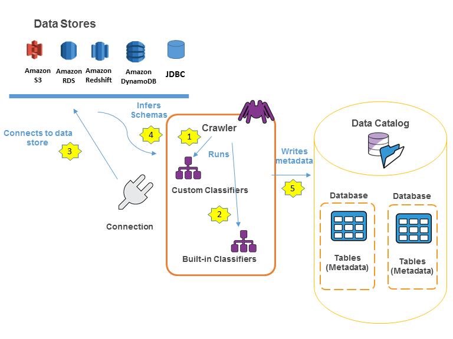
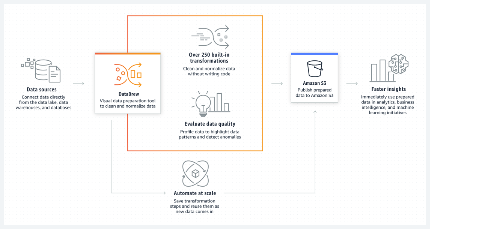

# Overview
+ AWS Glue is a fully **managed ETL (extract, transform, and load) service** that makes it **simple and cost-effective to categorize your data, clean it, enrich it, and move it reliably** between various data stores and data streams.
+ AWS Glue consists of **a central metadata repository** known as the **AWS Glue Data Catalog**, an **ETL engine** that automatically generates Python or Scala code, and **a flexible scheduler** that handles dependency resolution, job monitoring, and retries.
+ AWS Glue is **serverless**, so there’s no infrastructure to set up or manage.
+ AWS Glue is designed to work with **semi-structured data**. 
# When Should Use AWS Glue
+ You can use AWS Glue to **organize, cleanse, validate, and format data for storage in a data warehouse or data lake**.
+ You can use AWS Glue when you **run serverless queries against your Amazon S3 data lake**. 
+ AWS Glue can **catalog** your Amazon Simple Storage Service (Amazon S3) data, making it available for querying with Amazon Athena and Amazon Redshift Spectrum.
+ With crawlers, your **metadata stays in sync** with the underlying data.
+ Athena and Redshift Spectrum can directly query your Amazon S3 data lake using the AWS Glue Data Catalog. 
+ You can **create event-driven ETL pipelines** with AWS Glue. You can run your ETL jobs as soon as new data becomes available in Amazon S3 by **invoking your AWS Glue ETL jobs from an AWS Lambda function**. You can also register this new dataset in the AWS Glue Data Catalog as part of your ETL jobs.
+ You can use AWS Glue to understand your data assets. You can store your data using various AWS services and still maintain a unified view of your data using the AWS Glue Data Catalog.
# Architecture

+ You define *jobs* in AWS Glue to accomplish the work that's required to extract, transform, and load (ETL) data from a data source to a data target. You typically perform the following actions: 
    + For data store sources, you **define a *crawler* to populate your AWS Glue Data Catalog with metadata table definitions**. You point your crawler at a data store, and the crawler creates table definitions in the Data Catalog.
    + For streaming sources, you **manually define Data Catalog tables** and specify data stream properties.
    + In addition to table definitions, the AWS Glue Data Catalog contains other metadata that is required to define ETL jobs. You use this metadata when you define a job to transform your data.
    + AWS Glue can **generate a script to transform your data**. Or, you can **provide the script** in the AWS Glue console or API.
    + You can run your job on demand, or you can set it up to start when a specified *trigger* occurs. The trigger can be a **time-based schedule or an event**.
+ AWS Glue supports the following **data sources**: 
    + Data stores 
        + Amazon S3
        + Amazon Relational Database Service (Amazon RDS)
        + Third-party JDBC-accessible databases
        + Amazon DynamoDB
        + MongoDB and Amazon DocumentDB (with MongoDB compatibility)
    + Data streams 
        + Amazon Kinesis Data Streams
        + Apache Kafka
+ AWS Glue supports the following **data targets**: 
    + Amazon S3
    + Amazon Relational Database Service (Amazon RDS)
    + Third-party JDBC-accessible databases
    + MongoDB and Amazon DocumentDB (with MongoDB compatibility)
+ **AWS Glue Data Catalog**
    + The persistent metadata store in AWS Glue. It contains **table definitions, job definitions, and other control information** to manage your AWS Glue environment.+ Each AWS account has **one AWS Glue Data Catalog per region**.
+ **Classifier**
    + Determines the **schema of your data**. AWS Glue provides classifiers for common file types, such as CSV, JSON, AVRO, XML, and others. It also provides classifiers for common relational database management systems using a JDBC connection. You can write your own classifier by using a grok pattern or by specifying a row tag in an XML document.
+ **Connection**
    + A Data Catalog object that contains the properties that are required to connect to a particular data store.
+ **Crawler**
    + A program that **connects to a data store (source or target), progresses through a prioritized list of classifiers to determine the schema for your data**, and then creates metadata tables in the AWS Glue Data Catalog.
+ **Database**
    + A set of associated Data Catalog table definitions organized into a logical group.
+ **Data store, data source, data target**
    + A *data store* is a **repository for persistently storing your data**. Examples include Amazon S3 buckets and relational databases.
    + A *data source* is a data store that is used as input to a process or transform.+ A *data target* is a data store that a process or transform writes to.
+ **Development endpoint**
    + An environment that you can use to develop and test your AWS Glue ETL scripts.
+ Dynamic Frame 
    + **A distributed table that supports nested data** such as structures and arrays.
    + Each record is self-describing, designed for schema flexibility with semi-structured data.
    + Each record contains both data and the schema that describes that data.
    + You can use both dynamic frames and Apache Spark DataFrames in your ETL scripts, and convert between them.
    + Dynamic frames provide a set of advanced transformations for data cleaning and ETL.
+ **Job**
    + The business logic that is required to perform ETL work.
    + It is composed of a transformation script, data sources, and data targets.
    + Job runs are initiated by triggers that can be scheduled or triggered by events.
    + When you start a job, AWS Glue **runs a script that extracts data from sources, transforms the data, and loads it into targets**.
+ **Notebook server**
    + **A web-based environment that you can use to run your PySpark statements**. PySpark is a Python dialect for ETL programming.
    + You can set up a notebook server on a development endpoint to run PySpark statements with AWS Glue extensions.
+ **Script**
    + Code that extracts data from sources, transforms it, and loads it into targets. AWS Glue generates PySpark or Scala scripts.
+ **Table**
    + **The metadata definition that represents your data**. 
    + A table in the AWS Glue Data Catalog consists of the names of columns, data type definitions, partition information, and other metadata about a base dataset.
    + The schema of your data is represented in your AWS Glue table definition. The actual data remains in its original data store, whether it be in a file or a relational database table. 
+ **Transform**
    + The code logic that is used to manipulate your data into a different format.
+ **Trigger**
    + Initiates an ETL job. Triggers can be defined based on a scheduled time or an event.
+ **Worker**
    + With AWS Glue, you only pay for the time your ETL job takes to run. There are no resources to manage, no upfront costs, and you are not charged for startup or shutdown time.
    + You are charged an hourly rate based on the number of **Data Processing Units** (or DPUs) used to run your ETL job.
    + A single Data Processing Unit (DPU) is also referred to as a *worker*.
    + AWS Glue comes with three worker types to help you select the configuration that meets your job latency and cost requirements. Workers come in Standard, G.1X, and G.2X configurations.
## Populating the AWS Glue Data Catalog

+ **Workflow**
    + A crawler runs any custom *classifiers* that you choose to infer the format and schema of your data. You provide the code for custom classifiers, and they run in the order that you specify.
    + The first custom classifier to successfully recognize the structure of your data is used to create a schema. Custom classifiers lower in the list are skipped.
    + If no custom classifier matches your data's schema, built-in classifiers try to recognize your data's schema. An example of a built-in classifier is one that recognizes JSON.
    + The crawler connects to the data store. Some data stores require connection properties for crawler access.
    + The inferred schema is created for your data.
    + The crawler writes metadata to the Data Catalog. A table definition contains metadata about the data in your data store. The table is written to a database, which is a container of tables in the Data Catalog. Attributes of a table include classification, which is a label created by the classifier that inferred the table schema.
+ **Databases** are used to organize metadata tables in the AWS Glue.
    + When you define a table in the AWS Glue Data Catalog, you add it to a database. A table can be in only one database.
+ **An AWS Glue connection** is a Data Catalog object that **stores connection information for a particular data store**. 
    + JDBC 
    + Amazon Redshift
    + Amazon Relational Database Service (Amazon RDS)
    + Amazon DocumentDB
    + DynamoDB
    + Kafka
    + Amazon Kinesis
    + MongoDB
    + Network (designates a connection to a data source within an Amazon Virtual Private Cloud environment (Amazon VPC))
    + Amazon S3
    + With AWS Glue Studio, you can also **create connections for custom connectors** or connectors you purchase from AWS Marketplace. 
+ **Crawlers** 
    + Crawlers can crawl the following file-based and table-based data stores.
    + Access type that crawler uses Data storesNative client
        + Amazon Simple Storage Service (Amazon S3) 
        + Amazon DynamoDB 
        + JDBC 
        + Amazon Redshift 
        + Within Amazon Relational Database Service (Amazon RDS) or external to     Amazon RDS:
            + Amazon Aurora 
            + MariaDB 
            + Microsoft SQL Server 
            + MySQL 
            + Oracle 
            + PostgreSQL 
            + MongoDB client
            + MongoDB 
            + Amazon DocumentDB (with MongoDB compatibility) 
# data integration engine
+ AWS GLUE FOR APACHE SPARK
    + Apache Spark is an open-source distributed framework that makes it possible to write transformations for batch and streaming data in Python and Scala. With Spark SQL, developers can write SQL-like queries on big data. Apache Spark also provides ML libraries that run in distributed platforms.
+ AWS GLUE FOR PYTHON
    + AWS Glue for Python gives analytics users a Python shell environment to run their Python scripts with the latest Python version.
+ AWS GLUE FOR RAY
    + Ray (ray.io) is a new open-source compute framework that helps you scale Python workloads. AWS Glue for Ray facilitates the distributed processing of Python code over multi-node clusters. Users can create and run Ray jobs without trying to learn any big-data framework. 
# AWS Glue Studio
+ AWS Glue Studio is a **new graphical interface** that makes it easy to create, run, and monitor extract, transform, and load (ETL) jobs in AWS Glue.
+ AWS Glue Studio is designed **not only for tabular data, but also for semi-structured data**, which is difficult to render in spreadsheet-like data preparation interfaces
+ AWS Glue Studio provides a visual interface that makes it easy to: 
    + Pull data from an Amazon S3, Amazon Kinesis, or JDBC source.
    + Configure a transformation that joins, samples, or transforms the data.
    + Specify a target location for the transformed data.
    + View the schema or a sample of the dataset at each point in the job.
    + Run, monitor, and manage the jobs created in AWS Glue Studio.
+ When using AWS Glue Studio, you are **charged for data previews**.
## basic technical concepts
+ 
# AWS Glue DataBrew
+ AWS Glue DataBrew is **a visual data preparation tool** that enables users to clean and normalize data without writing any code. 
+ With the intuitive DataBrew interface, you can interactively discover, visualize, clean, and transform raw data. 
## Architecture
+ **Connection**
    + An AWS Glue connection is an object in the Data Catalog that **holds information such as login credentials, URI strings, VPC details, and more for a specific data store**.
    + AWS Glue components, such as crawlers, jobs, and development endpoints, **use these connections to access particular data stores**.
    + Connections can be used for **source and target data stores**, and the same connection can be used multiple times by various crawlers or ETL jobs.
+ **Crawler**
    + An AWS Glue crawler can **connect to various sources, identify their schema, and categorize them into data formats**.
    + They can also **create metadata tables in the Data Catalog** by using built-in data classifiers.
+ **Datastore, data source, data target**
    + A data store refers to physical storage where data is meant to persist permanently.
    + An example of data stores in AWS would be Amazon S3 buckets and relational databases like Amazon Relational Database Service (Amazon RDS) for MySQL. 
    + These can serve as the input for processing or transformation.
    + A data target refers to a data store where a process or transformation is output-written.
+ **AWS Glue interactive sessions**
    + With AWS Glue interactive sessions, users can **build and test data preparation needed for analytics applications**.
    + These sessions provide self-managed notebooks, which help developers write one-time queries or transformations that can be used to prepare data for ML.
    + AWS Glue interactive sessions offer notebook editors, which can be deployed locally or remotely. Doing it this way can assist developers with quick development and testing time.
    + AWS Glue integrates with AWS Glue Studio and Amazon SageMaker Studio for notebook management.
+ **DynamicFrame**
    + A DynamicFrame is a distributed table that facilitates the storage of nested data, such as structures and arrays.
    + It does this by cleaning and reorganizing semi-structured datasets like JSON, Avro, and Apache logs.
    + With DynamicFrame, there is no need for an upfront schema.
    + The schema can be inferred without interruption so that transformations occur in a single pass.
    + It is not difficult to handle unexpected changes because it tracks new fields and inconsistent changes in data types with choices, automatically marking and separating error records.
+ **Job**
    + The business logic necessary to carry out ETL work consists of a transformation script, data sources, and data targets.
    + After the user has completed authoring the transformation, it can be initiated through job-based triggers, which can be scheduled or based on events.
+ **File formats**
    + **Apache Parquet format** is a type of file format that structures data in a columnar format, rather than a row-based format like a CSV or Microsoft Excel file. Apache Parquet format is optimal for analytical engines like Athena or Amazon Redshift Spectrum to query over.
    + AWS Glue now supports **Apache Hudi, Apache Iceberg, and Delta Lake**, which gives transactional capabilities to the data lake on Amazon S3.
+ **Table**
    + **The metadata that represents user data** is known as the table definition. 
    + Regardless of whether your data is stored in an Amazon S3 file, an Amazon RDS table, or elsewhere, a table defines the schema of that data.
    + The table in the Data Catalog consists of information such as column names, data type definitions, partition details, and other metadata about the base dataset.
    + The schema of your data is reflected in the AWS Glue table definition, while the actual data stays in its original data store (whether that be a file or a relational database table).
    + The AWS Glue tables, which are cataloged in Data Catalog, can be used as sources or targets while creating an ETL job.
+ **Transform**
    + Transform is the code logic that is used to manipulate data into a different format and translate that into business logic.
+ **AWS Glue triggers**
    + A trigger, which initiates or starts an ETL job, can be defined based on a scheduled time or an event.

+ To use DataBrew, you create a project and connect to your data. 
## Core concepts and terms
+ **Project**
    + The interactive **data preparation workspace** in DataBrew is called a *project*.
    + Using a data project, you manage a collection of related items: **data, transformations, and scheduled processes**.
    + As part of creating a project, you **choose or create a dataset** to work on.
    + **Next, you create a recipe**, which is a set of instructions or steps that you want DataBrew to act on.
    + These actions transform your raw data into a form that is ready to be consumed by your data pipeline.
+ **Dataset**
    + Dataset simply means a set of data—rows or records that are divided into columns or fields. 
    + For DataBrew, a *dataset* is a **read-only connection to your data**. 
+ **Profiling**
    + DataBrew validates data by running a series of evaluations to identify trends and spot any irregularities by accessing data directly from the data lake, data warehouses, and databases.
+ **Recipe**
    + In DataBrew, a *recipe* is **a set of instructions or steps** for data that you want DataBrew to act on.
    + A recipe can contain many steps, and each step can contain many actions.
    + DataBrew stores the instructions about the data transformation, but it doesn't store any of your actual data. You can download and reuse recipes in other projects.
    + You can also publish multiple versions of a recipe.
+ **Job**
    + DataBrew **takes on the job of transforming your data by running the instructions** that you set up when you made a recipe.
    + The process of running these instructions is called a *job.*
    + A job can **put your data recipes into action according to a preset schedule**.
+ **Data lineage**
    + DataBrew **tracks your data** in a visual interface to determine its origin, called a *data lineage*.
    + This view shows you **how the data flows through different entities** from where it originally came.
    + You can see its origin, other entities it was influenced by, what happened to it over time, and where it was stored.
+ **Data profile**
    + When you profile your data, DataBrew creates a report called a *data profile*.
    + This summary **tells you about the existing shape of your data**, including the context of the content, the structure of the data, and its relationships.
    + You can make a data profile for any dataset by running a data profile job.
+ **Data quality**
    + A data-quality process can help **ensure the accuracy** of your data. You establish a set of guidelines, known as a ruleset, and enforce the data to identify and correct the faulty data. 
+ **File type**
    + DataBrew supports specific file types and formats, including comma-separated values (CSV), Microsoft Excel workbook, JSON documents and JSON lines, Apache Optimized Row Columnar (ORC), and Apache Parquet format.
+ **Transform**
    + Transform is the set of instructions or algorithms used to transform your data into a different format.
# Reference
+ [AWS Glue](https://docs.aws.amazon.com/glue/latest/dg/what-is-glue.html)
+ [AWS Glue Studio](https://docs.aws.amazon.com/glue/latest/ug/what-is-glue-studio.html)
+ [AWS Glue DataBrew](https://docs.aws.amazon.com/databrew/latest/dg/what-is.html)
