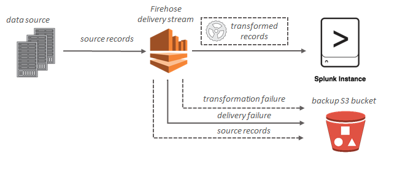

# Overview
+ Amazon Kinesis Data Firehose is a fully managed service for **delivering real-time streaming data** to destinations such as **Amazon Simple Storage Service (Amazon S3), Amazon Redshift, Amazon OpenSearch Service, Splunk, and any custom HTTP endpoint or HTTP endpoints owned by supported third-party service providers**, including Datadog, Dynatrace, LogicMonitor, MongoDB, New Relic, and Sumo Logic. 
+ With Kinesis Data Firehose, you **don't need to write applications or manage resources**. You configure your data producers to send data to Kinesis Data Firehose, and it **automatically delivers the data to the destination** that you specified.
+ You can also configure Kinesis Data Firehose to transform your data before delivering it.
# Key Concepts
+ **Kinesis Data Firehose delivery stream**
    + The underlying entity of Kinesis Data Firehose.
    + You use Kinesis Data Firehose by creating a Kinesis Data Firehose delivery stream and then sending data to it. 
+ **record**
    + The data of interest that your data producer sends to a Kinesis Data Firehose delivery stream.
    + A record can be as large as 1,000 KB.
+ **data producer**
    + Producers send records to Kinesis Data Firehose delivery streams.
    + For example, a web server that sends log data to a delivery stream is a data producer.
    + You can also configure your Kinesis Data Firehose delivery stream to automatically read data from an existing Kinesis data stream, and load it into destinations. 
+ **buffer size and buffer interval**
    + Kinesis Data Firehose buffers incoming streaming data to a certain size or for a certain period of time before delivering it to destinations. 
    + **Buffer Size** is in MBs and **Buffer Interval** is in seconds.
# Data Flow
+ For Amazon S3 destinations, streaming data is delivered to your S3 bucket. If data transformation is enabled, you can optionally back up source data to another Amazon S3 bucket.

+ For Amazon Redshift destinations, streaming data is delivered to your S3 bucket first. Kinesis Data Firehose then issues an Amazon Redshift **COPY** command to load data from your S3 bucket to your Amazon Redshift cluster. If data transformation is enabled, you can optionally back up source data to another Amazon S3 bucket.

+  For OpenSearch Service destinations, streaming data is delivered to your OpenSearch Service cluster, and it can optionally be backed up to your S3 bucket concurrently.

+ For Splunk destinations, streaming data is delivered to Splunk, and it can optionally be backed up to your S3 bucket concurrently. 

# Sending Data to an Amazon Kinesis Data Firehose Delivery Stream
+ Configure **Amazon Kinesis Data Streams** to send information to a Kinesis Data Firehose delivery stream.
+ **Amazon Kinesis agent** is a standalone Java software application that offers an easy way to collect and send data to Kinesis Data Firehose. The agent continuously monitors a set of files and sends new data to your Kinesis Data Firehose delivery stream. 
+ Writing to Kinesis Data Firehose Using the **AWS SDK**
+ create a **CloudWatch Logs subscription** that sends **log events** to Kinesis Data Firehose
+ configure **Amazon CloudWatch** to send events to a Kinesis Data Firehose delivery stream by adding a target to a CloudWatch Events rule
+ configure **AWS IoT** to send information to a Amazon Kinesis Data Firehose delivery stream by adding an action
# Dynamic Partitioning
+ Dynamic partitioning enables you to continuously partition streaming data in Kinesis Data Firehose by using keys within data (for example, `customer_id` or `transaction_id`) and then deliver the data grouped by these keys into corresponding Amazon Simple Storage Service (Amazon S3) prefixes. 
+ Partitioning your data minimizes the amount of data scanned, optimizes performance, and reduces costs of your analytics queries on Amazon S3.
#  Record Format Conversion
+ Amazon Kinesis Data Firehose **can convert the format of your input data from JSON to** Apache Parquet or Apache ORC before storing the data in Amazon S3.
+ If you want to **convert an input format other than JSON**, such as comma-separated values (CSV) or structured text, you can **use AWS Lambda to transform it to JSON first**.
+ Kinesis Data Firehose requires the following three elements to convert the format of your record data: 
    + **A deserializer to read the JSON of your input data** – You can choose one of two types of deserializers:Apache Hive JSON SerDe or OpenX JSON SerDe.
    + **A schema to determine how to interpret that data** – Use AWS Glue to create a schema in the AWS Glue Data Catalog.
    + **A serializer to convert the data to the target columnar storage format (Parquet or ORC)** – You can choose one of two types of serializers: ORC SerDe or Parquet SerDe
# Reference
[What Is Amazon Kinesis Data Firehose? - Amazon Kinesis Data Firehose](https://docs.aws.amazon.com/firehose/latest/dev/what-is-this-service.html)
