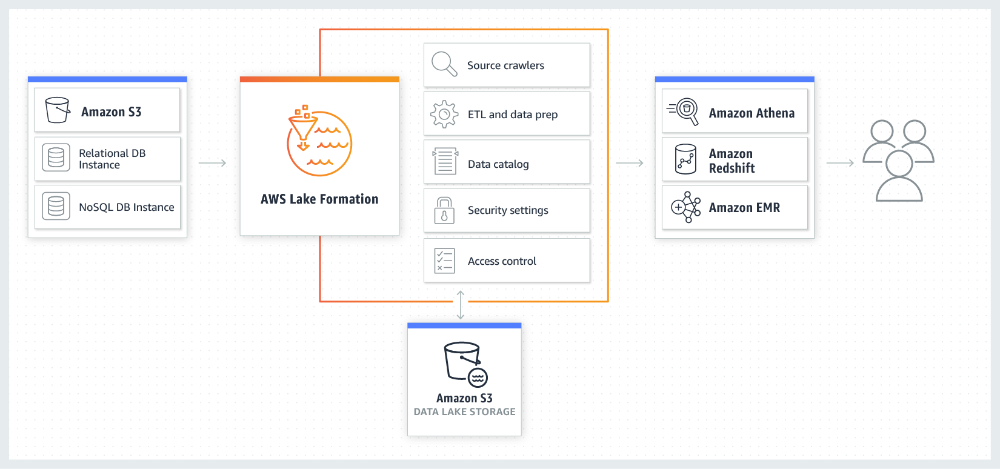

# Overview
+ AWS Lake Formation is a fully managed service that makes it easier for you to build, secure, and manage data lakes. 
+ Lake Formation **simplifies and automates many of the complex manual steps** that are usually required to create data lakes.
+ These steps include **collecting, cleansing, moving, and cataloging data**, and securely **making that data available for analytics** and machine learning.
+ Lake Formation provides its own permissions model that augments the AWS Identity and Access Management (IAM) permissions model. This centrally defined permissions model **enables fine-grained access to data stored in data lakes** through a simple grant/revoke mechanism.
+ Lake Formation permissions are enforced at the **table and column level** across the full portfolio of AWS analytics and machine learning services.
# How It Works
+ Lake Formation helps you do the following, either directly or through other AWS services: 
    + **Register the Amazon Simple Storage Service** (Amazon S3) buckets and paths where your data lake will reside.
    + Orchestrate data flows that ingest, cleanse, transform, and organize the raw data.
    + **Create and manage a Data Catalog** containing metadata about data sources and data in the data lake.
    + **Define granular data access policies** to the metadata and data through a grant/revoke permissions model.

+ Lake Formation **manages AWS Glue crawlers, AWS Glue ETL jobs, the Data Catalog, security settings, and access control**. After the data is securely stored in the data lake, users can access the data through their choice of analytics services, including Amazon Athena, Amazon Redshift, and Amazon EMR.
# Components
+ **Data Lake** 
    + The *data lake* is your persistent data that is stored in Amazon S3 and managed by Lake Formation using a Data Catalog. A data lake typically stores the following: 
        + + Structured and unstructured data
        + Raw data and transformed data
        + For an Amazon S3 path to be within a data lake, it must be *registered* with Lake Formation.
+ **Data Access** 
    + Lake Formation provides secure and granular access to data through a new grant/revoke permissions model that augments AWS Identity and Access Management (IAM) policies.
+ **Blueprint** 
    + A *blueprint* is a **data management template** that enables you to **easily ingest data into a data lake**.
    + Lake Formation provides several blueprints, each for a predefined source type, such as a relational database or AWS CloudTrail logs.
    + From a blueprint, you can create a workflow.
    + Blueprints take the data source, data target, and schedule as input to configure the workflow.
+ **Workflow**
    + A *workflow* is a **container for a set of related AWS Glue jobs, crawlers, and triggers**.
    + Workflows **consist of AWS Glue crawlers, jobs, and triggers** that are generated to orchestrate the loading and update of data.
    + You create the workflow in Lake Formation, and it executes in the AWS Glue service.
    + Lake Formation can track the status of a workflow as a single entity.
    + When you define a workflow, you **select the blueprint** upon which it is based. You can then run workflows **on demand or on a schedule**.
+ **Data Catalog** 
    + The *Data Catalog* is your **persistent metadata store**.
    + It is a managed service that lets you store, annotate, and share metadata in the AWS Cloud
+ **Underlying Data** 
    + *Underlying data* refers to **the source data** or data within the data lakes that Data Catalog tables point to.
+ **Principal** 
    + A *principal* is an AWS Identity and Access Management **(IAM) user or role or an Active Directory user**.
+ **Data Lake Administrator**
    + A *data lake administrator* is a principal who can grant any principal (including self) any permission on any Data Catalog resource or data location.
+ The following are the general steps to create and use a data lake: 
    + Register an Amazon Simple Storage Service (Amazon S3) path as a data lake.
    + Grant Lake Formation permissions to write to the Data Catalog and to Amazon S3 locations in the data lake.
    + Create a database to organize the metadata tables in the Data Catalog.
    + Use a blueprint to create a workflow. Run the workflow to ingest data from a data source.
    + Set up your Lake Formation permissions to allow others to manage data in the Data Catalog and the data lake.
    + Set up Amazon Athena to query the data that you imported into your Amazon S3 data lake.
    + For some data store types, set up Amazon Redshift Spectrum to query the data that you imported into your Amazon S3 data lake.
# Reference
[What Is AWS Lake Formation? - AWS Lake Formation](https://docs.aws.amazon.com/lake-formation/latest/dg/what-is-lake-formation.html)
