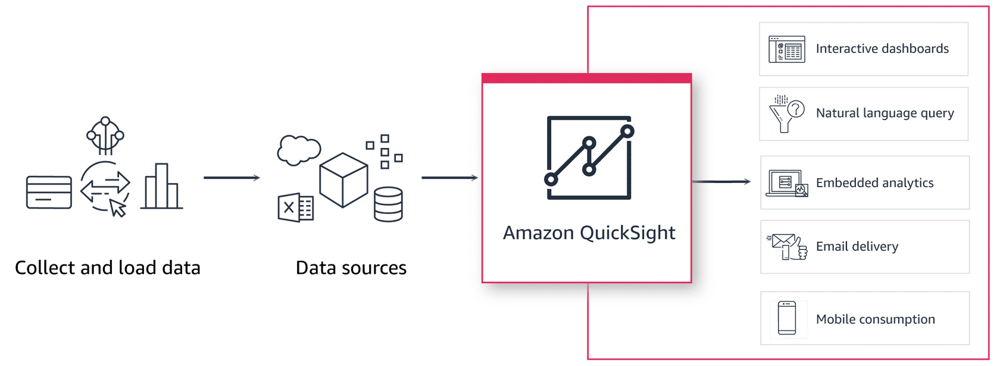

# Overview
+ Amazon QuickSight is a **cloud-scale business intelligence (BI) service** that you can use to **deliver easy-to-understand insights** to the people who you work with, wherever they are.
+ Amazon QuickSight **connects to your data in the cloud and combines data from many different sources**. In a single data dashboard, QuickSight can include AWS data, third-party data, big data, spreadsheet data, SaaS data, B2B data, and more.
+ As a fully managed cloud-based service, Amazon QuickSight provides **enterprise-grade security, global availability, and built-in redundancy**. 

# Featrues
+ **Collect and load data**: QuickSight supports direct data connections and uploads from a variety of sources, such as clickstreams, sales orders, IoT, financial data, and more.
+ Data sources: QuickSight supports a variety of data sources that you can use to provide data for analyses. Seamlessly connect to data in the cloud, in SaaS applications, and on premises, or upload files. 
+ QuickSight is a scalable, embeddable, ML- powered BI service that you can use to deliver insights. The QuickSight visual interface provides you with an interactive means of exploring and interpreting information.
+ interactive dashboards: QuickSight is designed to help all employees in an organization build visualizations, perform one-time analysis, and quickly get business insights from their data. Users can interact with dashboards to find answers quickly.
+ Natural language query: With QuickSight Q, anyone in your organization can ask business questions using natural language. They receive accurate answers with relevant visualizations that help them gain insights from the data.
+ embedded analytics: With QuickSight, you can quickly embed interactive dashboards, visuals, a Q bar, and full authoring sessions into your applications. There is no need to build your own analytics capabilities. You can integrate functionality into your application pages by setting defaults and handling errors to match your application's user experience.
+ email delivery: You can schedule highly formatted PDF reports and data exports to be delivered to your users. Reports and exports honor row-level security, so each user can receive different slices of data. Users can also set up alerts to be delivered through email, based on data passing a user-defined threshold.
+ mobile consumption: By using QuickSight mobile for iOS and Android, you can securely get insights from your data while on the go. You can browse, bookmark, and interact with all your dashboards in a convenient, and optimized mobile experience.
# Worlflow
+ When you create an analysis, the typical workflow looks like this: 
    + Create a new analysis.
    + Add new or existing datasets.
    + Choose fields to create the first chart. QuickSight automatically suggests the best visualization.
    + Add more charts, tables, or insights to the analysis. Resize and rearrange them on one or more sheets. Use extended features to add variables, custom controls, colors, additional pages (called sheets), and more.
    + Publish the analysis as a dashboard to share it with other people.

# Terminology
+ **A QuickSight data source** is an asset that holds metadata about an underlying connection to the data source. QuickSight supports several data source types. 
+ **Data preparation** is the process of transforming data for use in an analysis. This includes making changes like the following: 
    + **Filtering out data** so that you can focus on what's important to you.
    + **Renaming fields** to make them easier to read.
    + **Changing data types** so that they are more useful.
    + **Adding calculated fields** to enhance analysis.
    + **Creating SQL queries** to refine data.
+ **A QuickSight dataset is** an enriched model for visualization. It includes calculations and metadata created from an underlying data source. 
    + Datasets can either be cached in SPICE, or you can query the data source directly. SPICE is a purpose-built, in-memory, columnar database built for performance. 
+ **SPICE** is the *Super-fast, Parallel, In-memory Calculation Engine* in QuickSight. 
    + SPICE is engineered to **rapidly perform advanced calculations and serve data**.
    + By using SPICE, you save time because you **don't need to retrieve the data every time** that you change an analysis or update a visual.
+ A **data analysis** is **the basic workspace for creating data visualizations**, which are graphical representations of your data. 
    + Each analysis **contains a collection of visualizations** that you arrange and customize.
+ **A theme** is a collection of settings you can apply to multiple analyses and dashboards. QuickSight includes some built-in themes, and you can add your own by using the theme editor. 
+ A **data visualization**, also known as a *visual*, is a **graphical representation of data**. 
    + There are many types of visualizations, including diagrams, charts, graphs, and tables.
    + You can also **take control and choose your own visuals**.
    + You can enhance your analytics by applying filters, changing colors, adding parameter controls, custom click actions, and more.
+ **Machine learning (ML) Insights** propose narrative add-ons that are based on an evaluation of your data. You can choose one from the list, for example forecasting or anomaly (outlier) detection. 
+ A **sheet** is a page that **displays a set of visualizations and insights**.  
    + You can **add more sheets**, and make them work separately or together in your analysis.
+ A **dashboard** is the **published version of an analysis**. 
    + You can **share** with other users of Amazon QuickSight for reporting purposes.
    + You specify **who has access and what they can do** with the dashboard.
# QuickSight user roles
+ The QuickSight admin role can perform both **administrative tasks and the BI development tasks available to the author and reader roles**. A QuickSight account can have one or more users with the admin role assigned.
    + The admin role can perform the following actions:
    + Manage QuickSight settings and subscriptions.
    + Manage users, connections, and storage.
    + Create an allow list of domains for dashboard embedding.
    + Configure single sign-on (SSO).
    + Manage AWS resource access, which relates to the AWS data and services that you can access in QuickSight.
    + Converted any user to a different role.
+ The QuickSight author role is typically used for data analysts, BI engineers, BI managers, and business analysts.
    + The author role can perform the following actions: 
    + Create datasets.
    + Create and develop analyses. 
    + Share analyses and dashboards.
    + Publish dashboards to users.
    + In addition, the author role can perform all the actions available to the reader role
+ The QuickSight reader role is for business users to consume the reports and dashboards. This can include your internal or external users.
    + The reader role can perform the following actions:
    + Access QuickSight dashboards through the QuickSight console or embedded applications.
    + Receive email alerts.
    + Use interactive controls on dashboards to interact with data.
    + Ask questions, save bookmarks, and configure alerts.
# What are typical use cases for QuickSight?
+ Interactive dashboards
+ Serverless BI
+ Analytic insights
+ Embedded visual analytics
+ Operational reporting
# Reference
+ [Amazon QuickSight](https://docs.aws.amazon.com/quicksight/latest/user/welcome.html)
+ [Amazon QuickSight - Getting Started](https://explore.skillbuilder.aws/learn/course/14908/play/81567/amazon-quicksight-getting-started)