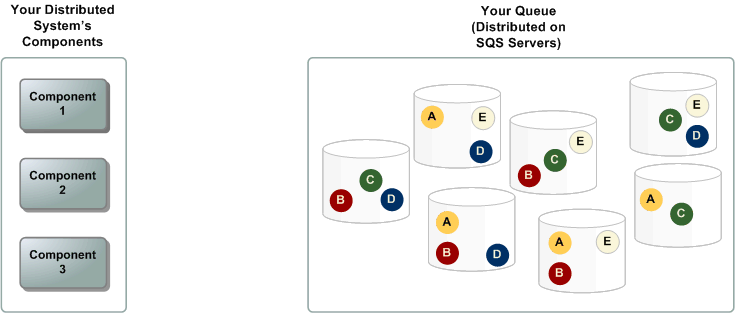

# Overview
+ Amazon Simple Queue Service (Amazon SQS) is a **fully managed message queuing service** that makes it easy to decouple and scale microservices, distributed systems, and serverless applications.
+ Amazon SQS **moves data between distributed application components** and helps you decouple these components.
+ Amazon Simple Queue Service (Amazon SQS) offers a **secure, durable, and available hosted queue** that lets you integrate and decouple distributed software systems and components.
# Queue types
+  Amazon SQS supports both standard and FIFO queues
+ **Unlimited Throughput** – Standard queues support a nearly unlimited number of API calls per second, per API action (`SendMessage`, `ReceiveMessage`, or `DeleteMessage`). 
+ **At-Least-Once Delivery** – A message is delivered at least once, but occasionally more than one copy of a message is delivered. 
+ **Best-Effort Ordering** – Occasionally, messages are delivered in an order different from which they were sent.
+ **High Throughput** – If you use batching, FIFO queues support up to 3,000 messages per second, per API method (`SendMessageBatch`, `ReceiveMessage`, or `DeleteMessageBatch`). The 3000 messages per second represent 300 API calls, each with a batch of 10 messages. To request a quota increase, submit a support request. Without batching, FIFO queues support up to 300 API calls per second, per API method (`SendMessage`, `ReceiveMessage`, or `DeleteMessage`). 
+ **Exactly-Once Processing** – A message is delivered once and remains available until a consumer processes and deletes it. Duplicates aren't introduced into the queue. 
+ **First-In-First-Out Delivery** – The order in which messages are sent and received is strictly preserved.  
+ Send data between applications when the throughput is important, for example:
    + Decouple live user requests from intensive background work: let users upload media while resizing or encoding it. 
    + Allocate tasks to multiple worker nodes: process a high number of credit card validation requests. 
    + Batch messages for future processing: schedule multiple entries to be added to a database. 
+ Send data between applications when the order of events is important, for example:
    + Make sure that user-entered commands are run in the right order. 
    + Display the correct product price by sending price modifications in the right order. 
    + Prevent a student from enrolling in a course before registering for an account. 
# Queue Configuration
+ **Visibility timeout** – The length of time that a message received from a queue (by one consumer) won't be visible to the other message consumers. 
    + The range is from **0 seconds to 12 hours**.
    + The default value is 30 seconds.
+ **Message retention period** – The amount of time that Amazon SQS retains messages that remain in the queue.  
    + The range is from **1 minute to 14 days**.
    + The default value is 4 days.
+ **Delivery delay** – The amount of time that Amazon SQS will delay before delivering a message that is added to the queue.  
    + The range is from **0 seconds to 15 minutes**.
    + The default value is 0 seconds.
+ **Maximum message size** – The maximum message size for this queue. 
    + The range is from **1 KB to 256 KB**.
    + The default value is 256 KB.
+ **Receive message wait time** – The maximum amount of time that Amazon SQS waits for messages to become available after the queue gets a receive request. 
    + The range is from **0 to 20 seconds**.
    + The default value is **0 seconds, which sets short polling**.
    + Any **non-zero value sets long polling**.
+ **Enable content-based deduplication** – Amazon SQS can automatically create deduplication IDs based on the body of the message 
    + For a FIFO queue, choose **Enable content-based deduplication** to enable content-based deduplication. The default setting is disabled.
+ **Enable high throughput FIFO** – Use to enable high throughput for messages in the queue. 
    + Choosing this option changes the related options (**Deduplication scope** and **FIFO throughput limit**) to the required settings for enabling high throughput for FIFO queues. 
+ **Redrive allow policy**: defines which source queues can use this queue as the dead-letter queue.  
    + **Allow all** (the default)
    + **By queue:** specify a list of up to 10 source queues by the Amazon Resource Name (ARN)
    + **Deny all**
+ **Amazon SQS managed SSE (SSE-SQS)** is managed server-side encryption that uses SQS-owned encryption keys to protect sensitive data sent over message queues. 
    + SSE-SQS **protects data at rest** using 256-bit Advanced Encryption Standard (AES-256) encryption.
    + SSE encrypts messages as soon as Amazon SQS receives them.
    + Amazon SQS stores messages in encrypted form and decrypts them only when sending them to an authorized consumer.
+ **SSE-KMS:** To protect the data in a queue's messages, you can enable server-side encryption (SSE) for a queue. Amazon SQS integrates with the Amazon Web Services Key Management Service (Amazon Web Services KMS) to manage customer master keys (CMKs) for server-side encryption (SSE) 
    + The CMK that you assign to your queue must have a key policy that includes permissions for all principals that are authorized to use the queue. 
+ A **dead-letter queue** is a queue that one or more source queues can use **for messages that are not consumed successfully.**
+ The dead-letter queue of a FIFO queue must also be a FIFO queue.
+ Similarly, the dead-letter queue of a standard queue must also be a standard queue.
+ **Subscribing a queue to a topic:** You can **subscribe one or more Amazon SQS queues to an Amazon Simple Notification Service (Amazon SNS) topic**. 
    + When you publish a message to a topic, Amazon SNS sends the message to each of the subscribed queues.
    + Amazon SQS manages the subscription and any necessary permissions.
    + When you subscribe an Amazon SQS queue to an SNS topic, Amazon SNS uses HTTPS to forward messages to Amazon SQS. 
+ **Config a lambda trigger**: You can use an **AWS Lambda function to process messages** in an Amazon SQS queue. 
    + Lambda **polls the queue and invokes your Lambda function synchronously** with an event that contains queue messages.
    + You can specify another queue to act as a *dead-letter queue* for messages that your Lambda function can't process.
    + A Lambda function can process items from multiple queues (using one Lambda event source for each queue). You can use the same queue with multiple Lambda functions.
# Basic Amazon SQS architecture
+ There are three main parts in a distributed messaging system: the components of your distributed system, your queue (distributed on Amazon SQS servers), and the messages in the queue.

+ In the above scenario, your system has several *producers* (components that send messages to the queue) and *consumers* (components that receive messages from the queue). The queue (which holds messages A through E) redundantly stores the messages across multiple Amazon SQS servers.
+ The following scenario describes the lifecycle of an Amazon SQS message in a queue, from creation to deletion. 

[amazon_sqs_lifecycle](./images/amazon_sqs_lifecycle.png)
+ A producer (component 1) sends message A to a queue, and the message is distributed across the Amazon SQS servers redundantly. 
+ When a consumer (component 2) is ready to process messages, it consumes messages from the queue, and message A is returned. While message A is being processed, it remains in the queue and isn't returned to subsequent receive requests for the duration of the visibility timeout. 
+ The consumer (component 2) deletes message A from the queue to prevent the message from being received and processed again when the visibility timeout expires. 
# Standard queues
+ Amazon SQS offers **standard as the default queue type**.
+ Standard queues support **a nearly unlimited number of API calls per second**, per API action (`SendMessage`, `ReceiveMessage`, or `DeleteMessage`).
+ Standard queues support **at-least-once message delivery.** However, occasionally (because of the highly distributed architecture that allows nearly unlimited throughput), more than one copy of a message might be delivered out of order.
+ Standard queues provide best-effort ordering which ensures that messages are generally delivered in the same order as they're sent.
+ You can use standard message queues in many scenarios, as long as your application can process messages that **arrive more than once and out of order**
# First-In-First-Out (FIFO) queue
+ FIFO queues have all the capabilities of the standard queue.
+ *FIFO (First-In-First-Out)* queues are designed to enhance messaging between applications when the **order of operations and events is critical, or where duplicates can't be tolerated.**
+ FIFO queues also provide **exactly-once processing** but have a limited number of transactions per second (TPS). 
+ The most important features of this queue type are FIFO (First-In-First-Out) delivery and *exactly-once processing*: 
    + The order in which messages are sent and received is strictly preserved and a message is delivered once and remains available until a consumer processes and deletes it.
    + Duplicates aren't introduced into the queue.
+ FIFO queues support **message groups** that allow multiple ordered message groups within a single queue. There is **no quota to the number of message groups** within a FIFO queue.
+ **Message deduplication ID**
    + The token used for deduplication of sent messages.
    + If a message with a particular message deduplication ID is sent successfully, any messages sent with the same message deduplication ID are accepted successfully but aren't delivered during the **5-minute deduplication interval.**
    + Message deduplication **applies to an entire queue**, not to individual message groups.
    + Amazon SQS continues to **keep track of the message deduplication ID even after the message is received and deleted**.
+ **Message group ID**
    + The tag that specifies that a message belongs to a specific message group.
    + Messages that belong to the **same message group are always processed one by one, in a strict order** relative to the message group
    + however, messages that belong to different message groups might be processed out of order
+ **Receive request attempt ID**
    + The token used for deduplication of `ReceiveMessage` calls.
+ **Sequence number**
    + The large, non-consecutive number that Amazon SQS assigns to each message.
## FIFO delivery logic
+ **Sending messages**
    + In FIFO queues, messages are **ordered based on message group ID**. If multiple hosts (or different threads on the same host) send messages with the same message group ID to a FIFO queue, Amazon SQS stores the messages in the order in which they arrive for processing. 
    + FIFO queue logic applies only per message group ID. Each message group ID represents a distinct ordered message group within an Amazon SQS queue. **For each message group ID, all messages are sent and received in strict order.**
+ **​​​​​​​Receiving messages**
    + You **can't** request to receive messages with a specific message group ID.
    + When receiving messages from a FIFO queue with multiple message group IDs, Amazon SQS first attempts to return as many messages with the same message group ID as possible. This allows other consumers to process messages with a different message group ID.
    + It is possible to receive up to 10 messages in a single call using the `MaxNumberOfMessages` request parameter of the `[ReceiveMessage]` action. These messages retain their FIFO order and can have the same message group ID. Thus, if there are fewer than 10 messages available with the same message group ID, you might receive messages from another message group ID, in the same batch of 10 messages, but still in FIFO order.
+ **Retrying multiple times**
    + If the producer detects a failed `SendMessage` action, it can **retry sending as many times as necessary,** using the same message deduplication ID. Assuming that the producer receives at least one acknowledgement before the deduplication interval expires, multiple retries neither affect the ordering of messages nor introduce duplicates.+ If the consumer detects a failed `ReceiveMessage` action, it can **retry as many times as necessary, using the same receive request attempt ID**. Assuming that the consumer receives at least one acknowledgement before the visibility timeout expires, multiple retries don't affect the ordering of messages.+ When you receive a message with a message group ID, **no more messages for the same message group ID are returned unless you delete the message or it becomes visible.**
+ **Exactly-once processing​​​​​​​​​​​​​​**
    + Unlike standard queues, FIFO queues don't introduce duplicate messages.
    + If you retry the `SendMessage` action **within the 5-minute deduplication interval**, Amazon SQS doesn't introduce any duplicates into the queue.
    + To configure deduplication, you must do one of the following: 
        + Enable content-based deduplication.
        + Explicitly provide the message deduplication ID (or view the sequence number) for the message. 
    + If you use batching, FIFO queues support up to 3,000 messages per second, per API method (`SendMessageBatch`, `ReceiveMessage`, or `DeleteMessageBatch`). The 3000 messages per second represent 300 API calls, each with a batch of 10 messages.
    + Without batching, FIFO queues support up to 300 API calls per second, per API method
    + FIFO queues don't support per-message delays, only per-queue delays.
    + To increase the number of requests in high throughput for FIFO queues, you can **increase the number of message groups you use.** Each message group supports 300 requests per second.
    + **Deduplication scope** – Specifies whether deduplication occurs at the queue or message group level.
    + **FIFO throughput limit** – Specifies whether the throughput quota on messages in the FIFO queue is set at the queue or message group level.
    + Enabling high throughput for FIFO queues sets the related options as follows: 
        + **Deduplication scope** is set to **Message group**, the required setting for using high throughput for FIFO queues.
        + **FIFO throughput limit** is set to **Per message group ID**, the required setting for using high throughput for FIFO queues.
# Amazon SQS queue and message identifiers
+**Queue name and URL**
    + When you create a new queue, you must **specify a queue name unique for your AWS account and region.**
    + The following is the queue URL for a queue named `MyQueue` owned by a user with the AWS account number `123456789012`. 
        + `https://sqs.us-east-2.amazonaws.com/123456789012/MyQueue`
+ **Message ID**
    + `​​​​​​​​​​​​​​`Each message receives a system-assigned *message ID* that Amazon SQS returns to you in the `SendMessage` response.
+ **Receipt handle**
    + Every time you receive a message from a queue, you receive a *receipt handle* for that message.
    + This handle is associated with the action of receiving the message, not with the message itself.
    + **To delete the message or to change the message visibility, you must provide the receipt handle (not the message ID)**. 
    + Thus, you must always receive a message before you can delete it 
# Amazon SQS message attributes
+ You can use message attributes to attach custom metadata to Amazon SQS messages for your applications.
+ You can use message system attributes to store metadata for other AWS services, such as AWS X-Ray.
+ Amazon SQS lets you include structured metadata (such as timestamps, geospatial data, signatures, and identifiers) with messages using *message attributes*.
+ Each message can have **up to 10 attributes**.
+ Message attributes are optional and separate from the message body (however, they are sent alongside it).
+ Your consumer can use message attributes to handle a message in a particular way without having to process the message body first. + Message system attributes are structured exactly like message attributes, with the following exceptions: 
    + Currently, the only supported message system attribute is `AWSTraceHeader`
    + The size of a message system attribute doesn't count towards the total size of a message.
# Amazon SQS short and long polling
+ With *short polling*, the ReceiveMessage request queries only a subset of the servers (based on a weighted random distribution) to find messages that are available to include in the response. Amazon SQS **sends the response right away**, even if the query found no messages.
+ With *long polling*, the ReceiveMessage request queries all of the servers for messages. Amazon SQS sends a response after it collects at least one available message, up to the maximum number of messages specified in the request. Amazon SQS sends an **empty response only if the polling wait time expires.**
+ ​​​​​When the wait time for the `ReceiveMessage` API action is greater than 0, *long polling* is in effect
 The maximum long polling wait time is 20 seconds.
+ Long polling helps reduce the cost of using Amazon SQS by eliminating the number of empty responses
# Amazon SQS dead-letter queues
+ Amazon SQS supports *dead-letter queues* (DLQ), which other queues (*source queues*) can target for messages that can't be processed (consumed) successfully. 
+ The **redrive policy** specifies the **source queue, the dead-letter queue, and the conditions** under which Amazon SQS moves messages from the former to the latter if the consumer of the source queue fails to process a message a specified number of times
+ The `maxReceiveCount` is the number of times a consumer tries receiving a message from a queue without deleting it before being moved to the dead-letter queue.
+ The main task of a dead-letter queue is to **handle the lifecycle of unconsumed messages**.
+ Standard queues keep processing messages until the expiration of the retention period. Instead of trying to process failing messages until they expire, it is better to move them to a dead-letter queue after a few processing attempts.
+ FIFO queues provide exactly-once processing by consuming messages in sequence from a message group. Thus, although the consumer can continue to retrieve ordered messages from another message group, **the first message group remains unavailable until the message blocking the queue is processed successfully.**
+ When should I use a dead-letter queue? 
    + Do use dead-letter queues with standard queues. 
    + Do use dead-letter queues to decrease the number of messages and to reduce the possibility of exposing your system to *poison-pill messages*
# Amazon SQS delay queues 
+ Delay queues let you postpone the delivery of new messages to a queue for a number of seconds, for example, when your consumer application needs additional time to process messages.
+ If you create a delay queue, any messages that you send to the queue remain invisible to consumers for the duration of the delay period.
+ The default (minimum) delay for a queue is 0 seconds. The maximum is 15 minutes. 
+ To **set delay seconds on individual messages**, rather than on an entire queue, use message timers to allow Amazon SQS to use the message timer's `DelaySeconds` value instead of the delay queue's `DelaySeconds` value.
# Amazon SQS temporary queues
+ You can use the Temporary Queue Client to create high-throughput, cost-effective, application-managed temporary queues.
+ The client maps multiple *temporary queues*—application-managed queues created on demand for a particular process—onto a single Amazon SQS queue automatically.
+ The most common use case for temporary queues is the *request-response* messaging pattern, where a requester creates a *temporary queue* for receiving each response message.
# Amazon SQS message timers
+ Message timers let you specify an initial invisibility period for a message added to a queue.
+ For example, if you send a message with a 45-second timer, the message isn't visible to consumers for its first 45 seconds in the queue.
+ The default (minimum) delay for a message is 0 seconds. The maximum is 15 minutes.
+ FIFO queues don't support timers on individual messages.
+ To set a delay period on *an entire queue*, rather than on individual messages, use delay queues.
+ A message timer setting for an individual message overrides any `DelaySeconds` value on an Amazon SQS delay queue.
# Reference
+ [Amazon Simple Queue Service](https://docs.aws.amazon.com/AWSSimpleQueueService/latest/SQSDeveloperGuide/welcome.html)
