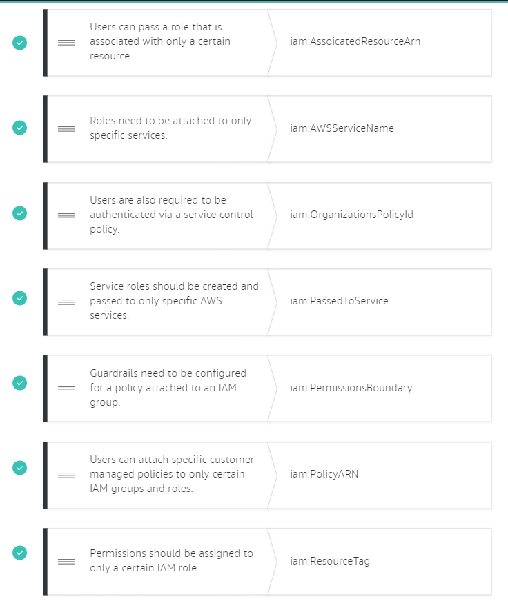
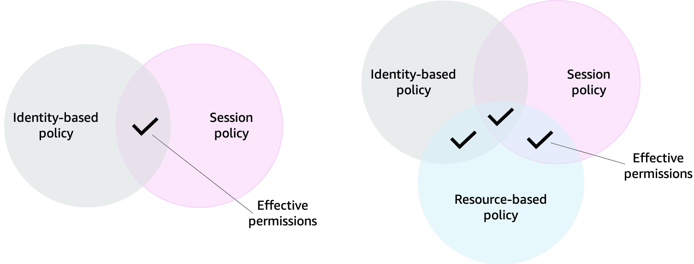
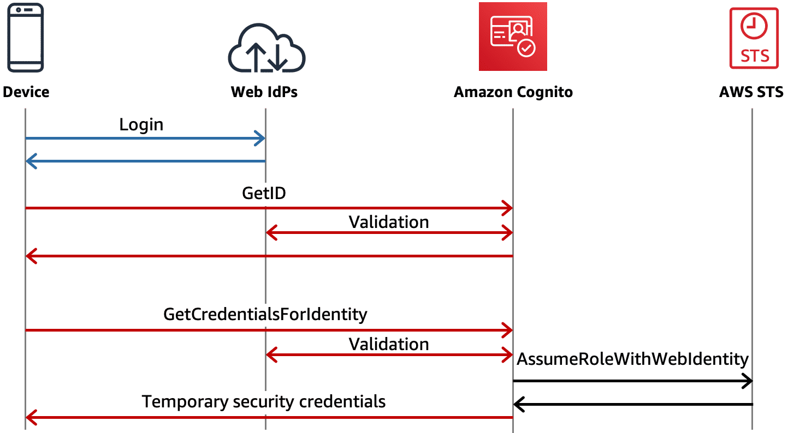

# Overview
+ AWS Identity and Access Management (IAM) is a web service that helps you **securely control access to AWS resources**.
+ You use IAM to control **who is authenticated (signed in) and authorized (has permissions) to use resources**.
+ When you first create an AWS account, you begin with a single sign-in identity that has complete access to all AWS services and resources in the account. This identity is called the **AWS account root user** and is accessed by signing in with the email address and password that you used to create the account.
+ We strongly recommend that you **do not use the root user** for your everyday tasks, even the administrative ones.
# What is IAM?
+ AWS Identity and Access Management (IAM) is a web service that helps you securely control access to AWS resources. 
+ With IAM, you can centrally manage permissions that control which AWS resources users can access. You use IAM to control who is authenticated (signed in) and authorized (has permissions) to use resources.
# Authentication and authorization
+ Authentication
    + When you create your AWS account, you use the combination of an email address and a password to verify your identity. 
    + If a user types in the correct email address and password, the system assumes the user is allowed to enter and grants them access.
    + This is the process of authentication. Authentication ensures that the user is who they say they are. 
+ Authorization
    + After you’re authenticated and in your AWS account, you might be curious about what actions you can take. This is where authorization comes in.
    + Authorization is the process of giving users permission to access AWS resources and services. 
    + Authorization determines whether a user can perform certain actions, such as read, edit, delete, or create resources. Authorization answers the question, “What actions can you perform?” 
## IAM features
+ IAM is **global** and not specific to any one Region.
+ IAM is **integrated with many AWS services** by default.
+ **Granular permissions**: You can grant different permissions to different people for different resources.
+ **Shared access to your AWS account**: You can grant other identities permission to administer and use resources in your AWS account without having to share your password and key.
+ **IAM supports MFA**. You can add MFA to your account and to individual users for extra security.
+ IAM supports **identity federation**, which allows users with passwords elsewhere—like your corporate network or internet identity provider—to get temporary access to your AWS account
+ Any AWS customer can use IAM; the service is offered at **no additional charge**.
+ **Identity information for assurance**
    + If you use AWS CloudTrail, you receive log records that include information about those who made requests for resources in your account. That information is based on IAM identities.
+ **PCI DSS Compliance**
+ Eventually Consistent
+ Secure access to AWS resources for applications that run on Amazon EC2
# concepts and terminology
## IAM **Resources**
+ The **user, group, role, policy, and identity provider objects** that are stored in IAM. As with other AWS services, you can add, edit, and remove resources from IAM.
+ 
## IAM **Identities**
+ The IAM resource objects that are used to identify and group.
+ **You can attach a policy to an IAM identity**.
+ These **include users, groups, and roles**.
## IAM Entities 
+ The IAM resource objects that AWS uses for **authentication**.
+ These include **IAM users and roles**.
## Principals 
+ **A person or application** that uses the AWS account root user, an IAM user, or an IAM role to sign in and make requests to AWS.
+ Principals include **federated users and assumed roles**.
+ The principal is **authenticated as the AWS account root user or an IAM entity** to make requests to AWS
## Request
+ When a principal tries to use the AWS Management Console, the AWS API, or the AWS CLI, that principal sends a *request* to AWS. The request includes the following information: 
+ **Actions or operations** – The actions or operations that the principal wants to perform. This can be an action in the AWS Management Console, or an operation in the AWS CLI or AWS API.
+ **Resources** – The AWS resource object upon which the actions or operations are performed.
+ **Principal** – The person or application that used an entity (user or role) to send the request. Information about the principal includes the policies that are associated with the entity that the principal used to sign in.
+ **Environment data** – Information about the IP address, user agent, SSL enabled status, or the time of day.
+ **Resource data** – Data related to the resource that is being requested. This can include information such as a DynamoDB table name or a tag on an Amazon EC2 instance.
+ AWS gathers the request information into a *request context*, which is used to evaluate and authorize the request.
## Authentication
+ A principal must be authenticated (signed in to AWS) using their credentials to send a request to AWS.
+ To authenticate from the console as a root user, you must **sign in with your email address and password**. 
+ To authenticate from the API or AWS CLI, you must **provide your access key and secret key**.
## Authorization
+ You must also be authorized (allowed) to complete your request.
+ During authorization, AWS uses values from the request context to **check for policies** that apply to the request. It then **uses the policies to determine** whether to allow or deny the request.
+ To provide your users with permissions to access the AWS resources in their own account, you need only **identity-based policies**.
+ **Resource-based policies are popular for granting [cross-account access](https://docs.aws.amazon.com/IAM/latest/UserGuide/access_permissions-required.html#UserPermissionsAcrossAccounts).**
+  If a single permissions policy includes a denied action, AWS denies the entire request and stops evaluating. This is called an **explicit deny**.
+ AWS authorizes your request only if **every part of your request is allowed** by the applicable permissions policies
## Actions or operations
+ After your request has been **authenticated and authorized**, AWS approves the actions or operations in your request. 
+ To allow a principal to perform an operation, you must include the necessary actions in a policy that applies to the principal or the affected resource.
## Resources
+ After AWS approves the operations in your request, they can be performed on the related resources within your account.
# IAM Identities
## **Root user credentials**
+ the email address and password that you provided when creating the account+ When you use your root user credentials, you have **complete, unrestricted access to all resources in your AWS account**, including access to your billing information and the ability to change your password
## IAM users
+ Instead of sharing your root user credentials with others, you can create individual IAM users within your account
+ IAM users are not separate accounts; they are **users within your account**. 
+ Each user can have **its own password** for access to the AWS Management Console.
+ You can also **create an individual access key for each user** so that the user can **make programmatic requests** to work with resources in your account.
+ We recommend that you create an IAM user for yourself and then assign yourself administrative permissions for your account.
+ A user in AWS consists of a **name and credentials**.
+ user credentials 
    + [Console password](https://docs.aws.amazon.com/IAM/latest/UserGuide/id_credentials_passwords.html): A password that the user can type to sign in to interactive sessions such as the AWS Management Console. 
    + [Access keys](https://docs.aws.amazon.com/IAM/latest/UserGuide/id_credentials_access-keys.html): A combination of an access key ID and a secret access key.
        + You can have a **maximum of two access keys**.
        + Access keys are **long-term credentials** for an IAM user or the AWS account root user.
        + When you create an access key pair, save the access key ID and secret access key in a secure location.
        + The secret access key is **available only at the time you create it.** If you lose your secret access key, you must delete the access key and create a new one.
    + [SSH keys for use with CodeCommit](https://docs.aws.amazon.com/IAM/latest/UserGuide/id_credentials_ssh-keys.html): An SSH public key in the OpenSSH format that can be used to authenticate with CodeCommit.
    + [Server certificates](https://docs.aws.amazon.com/IAM/latest/UserGuide/id_credentials_server-certs.html): SSL/TLS certificates that you can use to authenticate with some AWS services. 
+ As a best practice, **use temporary security credentials (IAM roles) instead of access keys**, and disable any AWS account root user access keys.
+ Each IAM user is **associated with one and only one** AWS account.
+ For increased security, we recommend that you configure **multi-factor authentication (MFA)** to help protect your AWS resources.
+ You can generate and download a **credential report** that lists all users in your account and the status of their various credentials, including passwords, access keys, and MFA devices
+ You can generate a credential report as often as once **every four hours**.
+ An IAM user represents a person or service that interacts with AWS. 
+ When you create a user, that user can sign in to gain access to the AWS resources inside your account.
+ IAM user credentials
    + An IAM user consists of a name and a set of credentials. When you create a user, you can provide them with the following types of access:
        + Access to the AWS Management Console
        + Programmatic access to the AWS CLI and AWS API
    + To access the console, provide the user with a user name and password. 
    + For programmatic access, AWS generates a set of access keys that can be used with the AWS CLI and AWS API. 
    + IAM user credentials are considered permanent, which means that they stay with the user until there’s a forced rotation by admins.
## IAM User Group
+ An IAM [user group](https://docs.aws.amazon.com/IAM/latest/UserGuide/id_groups.html) is a **collection of IAM users**. You can use user groups to specify permissions for a collection of users, which can make those permissions easier to manage for those users. 
+ Any user in that user group **automatically has the permissions** that are assigned to the user group.
+ A user group is **a way to attach policies to multiple users at one time**. 
+ User groups can't be nested; they can contain only users, not other user groups.
+ An IAM group is a collection of users. 
+ All users in the group inherit the permissions assigned to the group. This makes it possible to give permissions to multiple users at once
+ Keep in mind the following features of groups:
    + Groups can have many users.
    + Users can belong to many groups.
    + Groups cannot belong to groups.
## IAM Role
+ An IAM *role* is an **IAM identity** that you can create in your account that **has specific permissions**.
+ An IAM [role](https://docs.aws.amazon.com/IAM/latest/UserGuide/id_roles.html) is very similar to a user, in that it is an identity with permission policies that determine what the identity can and cannot do in AWS.+ However, a role **does not have any credentials** (password or access keys) associated with it.
+ Instead of being uniquely associated with one person, a role is **intended to be assumable by anyone who needs it**.
+ Role **does not have standard long-term credentials** such as a password or access keys associated with it. Instead, when you assume a role, it provides you with **temporary security credentials for your role session**
+ You can use roles to delegate access to users, applications, or services that don't normally have access to your AWS resources.
+ An IAM role is an identity that can be assumed by someone or something who needs temporary access to AWS credentials. Let's dive into what I mean when I say AWS credentials. 
+ IAM roles are identities in AWS that like an IAM user also have associated AWS credentials used to sign requests. 
+ However, IAM users have usernames and passwords as well as static credentials whereas IAM roles do not have any login credentials like a username and password and the credentials used to sign requests are programmatically acquired, temporary in nature, and automatically rotated. 
+ The important thing to know about roles is that the credentials they provide expire and roles are assumed programmatically.
+ IAM roles with temporary credentials are useful in the following situations:
    + Federated user access
    + Temporary IAM user permissions 
    + Cross-account access
    + Cross-service access
        + Principal permissions – When you use an IAM user or role to perform actions in AWS, you are considered a principal. Policies grant permissions to a principal. 
        + Service role – A service role is an IAM role that a service assumes to perform actions on your behalf. 
        + Service-linked role – A service-linked role is a type of service role that is linked to an AWS service. The service can assume the role to perform an action on your behalf. Service-linked roles appear in your AWS account and are owned by the service. An IAM administrator can view, but not edit the permissions for service-linked roles.
    + Applications running on Amazon EC2 - You can use an IAM role to manage temporary credentials for applications that are running on an EC2 instance and making AWS CLI or AWS API requests.
+ Roles can be used by the following: 
    + An IAM user in the same AWS account as the role
    + An IAM user in a different AWS account than the role
    + A web service offered by AWS such as Amazon Elastic Compute Cloud (Amazon EC2)
    + An external user authenticated by an external identity provider (IdP) service that is compatible with SAML 2.0 or OpenID Connect, or a custom-built identity broker.
### ****AWS service role****
+ A role that a service assumes to perform actions in your account on your behalf. When you set up some AWS service environments, you must define a role for the service to assume. 
### **AWS service role for an EC2 instance**
+ A special type of service role that an application running on an Amazon EC2 instance can assume to perform actions in your account. This role is **assigned to the EC2 instance when it is launched**.
### ****AWS service-linked role****
+ A unique type of service role that is linked directly to an AWS service.
+ Service-linked roles are **predefined by the service and include all the permissions that the service requires** to call other AWS services on your behalf. 
+ A service might automatically create or delete the role.
+ Service-linked roles make setting up a service easier because you don't have to manually add the necessary permissions.
### Role chaining
+ **Role chaining** occurs when you use a role to assume a second role through the AWS CLI or API.
+ Role chaining limits your AWS CLI or AWS API **role session to a maximum of one hour**. 
### **delegation**
+ The granting of permissions to someone to allow access to resources that you control.
+ Delegation involves **setting up a trust between two accounts**. 
+ The first is the account that owns the resource (the **trusting account**).
+ The second is the account that contains the users that need to access the resource (**the trusted account**)
+ To delegate permission to access a resource: 
    + [create an IAM role](https://docs.aws.amazon.com/IAM/latest/UserGuide/id_roles_create_for-user.html) in the trusting account that has two [policies](https://docs.aws.amazon.com/IAM/latest/UserGuide/id_roles_terms-and-concepts.html#term_policy) attached. 
    + The *permissions policy* grants the user of the role the needed permissions to carry out the intended tasks on the resource.
    + The *trust policy* specifies **which trusted account members are allowed to assume the role**.
    + The trust policy is attached to the role in the trusting account, and is one-half of the permissions.
    + The other half is a permissions policy attached to the user in the **trusted account** that [allows that user to switch to, or assume the role](https://docs.aws.amazon.com/IAM/latest/UserGuide/id_roles_use_permissions-to-switch.html). 
    + A user who assumes a role **temporarily gives up his or her own permissions** and instead takes on the permissions of the role. 
### ****Trust policy****
+ A [JSON policy document](https://docs.aws.amazon.com/IAM/latest/UserGuide/reference_policies_grammar.html) in which you define the **principals that you trust to assume the role**.
+ A role trust policy is a required [resource-based policy](https://docs.aws.amazon.com/IAM/latest/UserGuide/access_policies.html#policies_resource-based) that is attached to a role in IAM.
+ The [principals](https://docs.aws.amazon.com/IAM/latest/UserGuide/reference_policies_elements_principal.html) that you can specify in the trust policy include **users, roles, accounts, and services**.
### ****Permissions policy****
+ A permissions document in [JSON](http://www.json.org/) format in which you define **what actions and resources the role can use**.
+ The document is written according to the rules of the [IAM policy language](https://docs.aws.amazon.com/IAM/latest/UserGuide/reference_policies.html).
### **Permissions boundary**
+ An advanced feature in which you use policies to limit the maximum permissions that an identity-based policy can grant to a role.
+ You cannot apply a permissions boundary to a service-linked role
# Permissions and policies
+ **A policy** is an object in AWS that, when associated with an identity or resource, **defines their permissions**
+ You manage access in AWS by creating policies and attaching them to IAM identities (users, groups of users, or roles) or AWS resources.
+ When you create an IAM user, they **can't access anything** in your account **until you give them permission**.
+ You **give permissions to a user by creating an identity-based policy**, which is a policy that is attached to the user or a group to which the user belongs.
+ You can organize IAM users into *IAM groups* and **attach a policy to a group**. In that case, individual users still have their own credentials, but **all the users in a group have the permissions** that are attached to the group
+ To assign permissions to **federated users**, you can create an entity referred to as a *role* and define permissions for the role. When a federated user signs in to AWS, the user is **associated with the role** and is granted the permissions that are defined in the role
+ **Identity-based policies** are permissions policies that you **attach to an IAM identity, such as an IAM user, group, or role**. 
    + **Managed policies** – **Standalone identity-based policies** that you can **attach to multiple users, groups, and roles** in your AWS account. You can use two types of managed policies: 
        + **AWS managed policies** – Managed policies that are created and managed by AWS. If you are new to using policies, we recommend that you start by using AWS managed policies.
        + **Customer managed policies** – Managed policies that you create and manage in your AWS account. Customer managed policies provide more precise control over your policies than AWS managed policies. You can create, edit, and validate an IAM policy in the visual editor or by creating the JSON policy document directly. 
    + **Inline policies** – Policies that you create and manage and that are **embedded directly into a single user, group, or role**. In most cases, **we don't recommend using inline policies**.
+ **Resource-based policies** are permissions policies that you **attach to a resource** such as an Amazon S3 bucket or an IAM role trust policy. 
    + Resource-based policies are **inline policies**, and there are **no managed resource-based policies**.
    + The IAM service supports only one type of resource-based policy called a role **trust policy**, which is attached to an IAM role.
    + Because an IAM role is both an identity and a resource that supports resource-based policies, you must **attach both a trust policy and an identity-based policy to an IAM role**.
    + Trust policies define **which principal entities (accounts, users, roles, and federated users) can assume the role**. 
    + Resource-based policies control what actions a specified principal can perform on that resource and under what conditions.  
    + To enable cross-account access, you can specify an entire account or IAM entities in another account as the principal in a resource-based policy.
# Attribute-based access control (ABAC)
+ Attribute-based access control (ABAC) is an authorization strategy that **defines permissions based on attributes**.
+ In AWS, these attributes are called **tags**. 
+ Attribute-based access control (ABAC) is an authorization strategy that defines permissions based on attributes. 
+ You can attach tags to IAM resources, including IAM entities (users or roles) and to AWS resources. You can create a single ABAC policy or small set of policies for your IAM principals. These ABAC policies can be designed to allow operations when the principal's tag matches the resource tag。
+ ABAC is helpful in environments that are growing rapidly and helps with situations where policy management becomes cumbersome.
+ ABAC provides the following advantages over the traditional RBAC model:
+ ABAC permissions scale with innovation. It's no longer necessary for an administrator to update existing policies to allow access to new resources.       
    + For example, assume that you designed your ABAC strategy with the access-project tag. A developer uses the role with the access-project = Heart tag. When people on the Heart project need additional Amazon EC2 resources, the developer can create new Amazon EC2 instances with the access-project = Heart tag. Then anyone on the Heart project can start and stop those instances because their tag values match.
+ ABAC requires fewer policies. Because you don't have to create different policies for different job functions, you create fewer policies. Those policies are easier to manage.
+ Using ABAC, teams can change and grow quickly. This is because permissions for new resources are automatically granted based on attributes.
+ Granular permissions are possible using ABAC. When you create policies, it's a best practice to grant least privilege. Using traditional RBAC, you must write a policy that allows access to only specific resources. However, when you use ABAC, you can allow actions on all resources, but only if the resource tag matches the principal's tag.
+ Use employee attributes from your corporate directory with ABAC. You can configure your SAML-based or web identity provider to pass session tags to AWS. When your employees federate into AWS, their attributes are applied to their resulting principal in AWS. You can then use ABAC to allow or deny permissions based on those attributes.
## Benefits of the ABAC method
+ As the previous video mentioned, ABAC does have some advantages over the RBAC method. Here are the advantages of using tags when controlling access to resources:
+ Scalable: Teams change and grow quickly. It is no longer necessary for an administrator to update existing policies to allow access to new resources because permissions for new resources are automatically granted based on attributes. 
+ Manageable: Because you don't have to create different policies for different job functions, you create fewer policies. Those policies are easier to manage.
+ Granular permissions: When you create policies, it's a best practice to grant least privilege. Using traditional RBAC, you must write a policy that allows access to only specific resources. However, when you use ABAC, you can allow actions on all resources but only if the resource tag matches the principal's tag.

# How IAM works
+ 
# Federating existing users
+ If your corporate directory is compatible with Security Assertion Markup Language 2.0 (SAML 2.0), you can configure your corporate directory to provide single-sign on (SSO) access to the AWS Management Console for your users.
+ If your corporate directory is not compatible with SAML 2.0, you can create an identity broker application to provide single-sign on (SSO) access to the AWS Management Console for your users.
+ If your corporate directory is Microsoft Active Directory, you can use AWS IAM Identity Center to connect a self-managed directory in Active Directory or a directory in AWS Directory Service to establish trust between your corporate directory and your AWS account.
+ If you are using an external identity provider (IdP) such as Okta or Azure Active Directory to manage users, you can use AWS IAM Identity Center to establish trust between your IdP and your AWS account.
# Security best practices in IAM
+ Require human users to use federation with an identity provider to access AWS using temporary credentials
+ Require workloads to use temporary credentials with IAM roles to access AWS
+ Require multi-factor authentication (MFA)
+ Update access keys when needed for use cases that require long-term credentials
+ Follow best practices to protect your root user credentials
+ Apply least-privilege permissions
+ Get started with AWS managed policies and move toward least-privilege permissions
+ Use IAM Access Analyzer to generate least-privilege policies based on access activity
+ Regularly review and remove unused users, roles, permissions, policies, and credentials
+ Use conditions in IAM policies to further restrict access
+ Verify public and cross-account access to resources with IAM Access Analyzer
+ Use IAM Access Analyzer to validate your IAM policies to ensure secure and functional permissions
+ Establish permissions guardrails across multiple accounts
+ Use permissions boundaries to delegate permissions management within an account
# Root user best practices for your AWS account
+ Secure your root user credentials to prevent unauthorized use
+ Use a strong root user password to help protect access
+ Secure your root user sign-in with multi-factor authentication (MFA)
+ Don't create access keys for the root user
+ Use multi-person approval for root user sign-in wherever possible
+ Use a group email address for root user credentials
+ Restrict access to account recovery mechanisms
+ Secure your Organizations account root user credentials
+ Monitor access and usage
+ Evaluate root user MFA compliance
# IAM best practices
+ Lock down the AWS root user
    + Don’t share the credentials associated with the root user.
    + Consider deleting the root user access keys.
    + Activate MFA on the root account.
+ Follow the principle of least privilege
+ Use IAM appropriately
+ Use IAM roles when possible
+ Consider using an identity provider
    + Using an IdP, whether it's with an AWS service such as AWS IAM Identity Center (successor to AWS Single Sign-On) or a third-party identity provider, provides a single source of truth for all identities in your organization.
    + You no longer have to create separate IAM users in AWS. You can instead use IAM roles to provide permissions to identities that are federated from your IdP. Being federated is a process that allows for the transfer of identity and authentication information across a set of networked systems. 
+ Regularly review and remove unused users, roles, and other credentials
# Grant access to the billing console
+ Activate IAM access to billing information on your test AWS account
    + Sign in to the AWS Management Console with your root user credentials
    + find the section IAM User and Role Access to Billing Information, then select Edit.
    + Select the Activate IAM Access check box to activate access to the Billing and Cost Management console pages.
+ Create users and groups to grant access to the AWS Billing console
+ Create a role to grant access to the AWS Billing console
# Delegate access across AWS accounts using IAM roles
+ Create a role in the Target Account to add source account as trust entity to assume the role, attach proper policy to the role
+ In the source account, allow user or group to assume the role
+ Switch roles with aws console or cli
# Policy types
+ Identity-based
    + Also known as IAM policies, identity-based policies are managed and inline policies attached to IAM identities (users, groups to which users belong, or roles).
    + Impacts IAM principal permissions
+ Resource-based
    + These are inline policies that are attached to AWS resources. The most common examples of resource-based policies are Amazon S3 bucket policies and IAM role trust policies. Resource-based policies grant permissions to the principal that is specified in the policy; hence, the principal policy element is required. 
    + Grants permission to principals or accounts (same or different accounts)
    The resource-based policy below is attached to an Amazon S3 bucket. According to the policy, only the IAM user carlossalzar can access this bucket.
+ permissions boundary
    + A permissions boundary sets the maximum permissions that an identity-based policy can grant to an IAM entity. The entity can perform only the actions that are allowed by both its identity-based policies and its permissions boundaries. Resource-based policies that specify the user or role as the principal are not limited by the permissions boundary.
    + Restricts permissions for the IAM entity attached to it
+ AWS Organizations SCPs
    + AWS Organizations is a service for grouping and centrally managing AWS accounts. If you enable all features in an organization, then you can apply SCPs to any or all of your accounts. SCPs specify the maximum permissions for an account, or a group of accounts, called an organizational unit (OU). 
    + Restricts permissions for entities in an AWS account, including AWS account root users
+ ACLs
    + Use ACLs to control which principals in other accounts can access the resource to which the ACL is attached.
    + ACLs are supported by Amazon S3 buckets and objects. They are similar to resource-based policies although they are the only policy type that does not use the JSON policy document structure.
    + ACLs are cross-account permissions policies that grant permissions to the specified principal. ACLs cannot grant permissions to entities within the same account.
+ Session policies
    + A session policy is an inline permissions policy that users pass in the session when they assume the role.
    + The permissions for a session are the intersection of the identity-based policies for the IAM entity (user or role) used to create the session and the session policies.
    + Permissions can also come from a resource-based policy. Session policies limit the permissions that the role or user's identity-based policies grant to the session. An upcoming section will cover session policies in more detail.
    + Restricts permissions for assumed roles and federated users

## Guardrails vs. grants
+ As you noticed from reviewing the different policy types above, some policies are used to restrict permissions while others are used to grant access.
+ Using a combination of different policy types not only improves your overall security posture but also minimizes your blast radius in case an incident occurs.
+ Guardrails 
    + permissions boundary
    + Session policies
    + AWS Organizations SCPs
+ grants
    + Identity-based
    + Resource-based
    + ACLs
## Explicit and implicit denies
+ A request results in an explicit deny if an applicable policy includes a Deny statement.
+ If policies that apply to a request include an Allow statement and a Deny statement, the Deny statement trumps the Allow statement. The request is explicitly denied.
+ The flow chart below provides details about how the decision is made as AWS authenticates the principal that makes the request. AWS evaluates the policy types in the following order:

# principals 
+ AWS Accounts
+ IAM Users
+ Federated Users
+ IAM Roles
+ AWS Services
# IAM Condition Keys
+ The condition key that you specify can be a service-specific or a global condition key.
+ IAM Condition Key
    + iam:AWSServiceName
        + Roles need to be attached to only specific services.
    + iam:OrganizationsPolicyId
        + For those accounts that are members of an AWS Organizations unit, this condition key provides the IAM entity access to specific SCPs. 
    + iam:PermissionsBoundary
        + This IAM condition key should look familiar to you because the previous section already covered it. The iam:PermissionsBoundary key checks that the specified policy is attached as a permissions boundary on the IAM principal resource.
        + Guardrails need to be configured for a policy attached to an IAM group.
    + iam:PolicyARN 
        + This condition key checks the Amazon Resource Name (ARN) of a managed policy in requests that involve that same managed policy.
        + Users can attach specific customer managed policies to only certain IAM groups and roles.
    + iam:ResourceTag
        + The iam:ResourceTag condition key checks that the tag attached to the identity resource, either a user or role, matches the specified key name and value provided. 
    + iam:PassedToService
        + The iam:PassedToService key specifies the service principal of the service to which a role can be passed.
        + You can use iam:PassedToService to restrict your users so that they can pass roles only to specific services and ensure that users create service roles only for the services that you specify.
        + Service roles should be created and passed to only specific AWS services.
    + iam:AssociatedResourceArn
        + This condition key specifies the ARN of the resource to which this role will be associated at the destination service. 
        + Use this condition key in a policy to allow an IAM entity (an IAM user or role) to pass a role but only if that role is associated with the specified resource.
        + Users can pass a role that is associated with only a certain resource.
    + iam:OrganizationsPolicyId
        + Users are also required to be authenticated via a service control policy.
    + iam:ResourceTag
        + Permissions should be assigned to only a certain IAM role.
    + 
+ Global Condition Keys
    + Global condition keys start with the aws: prefix
    + aws:CalledVia
        + This condition key includes information in the form of an ordered list of each service in the chain that made requests on the principal’s behalf.
        + This information is available only if the AWS services involved support aws:CalledVia.
        + 
        ```
        {
            "Version": "2012-10-17",
            "Statement": [
                {
                    "Sid": "KmsActionsIfCalledViaDynamodb",
                    "Effect": "Allow",
                    "Action": [
                        "kms:Encrypt",
                        "kms:Decrypt",
                        "kms:ReEncrypt*",
                        "kms:GenerateDataKey",
                        "kms:DescribeKey"
                    ],
                    "Resource": "arn:aws:kms:region:111122223333:key/my-example-key",
                    "Condition": {
                        "ForAnyValue:StringEquals": {
                            "aws:CalledVia": ["dynamodb.amazonaws.com"]
                        }
                    }
                }
            ]
        }
        ``` 
    + aws:CalledViaFirst and aws:CalledViaLast
        + 
        ```
        {
            "Version": "2012-10-17",
            "Statement": [
                {
                    "Sid": "KmsActionsIfCalledViaChain",
                    "Effect": "Allow",
                    "Action": [
                        "kms:Encrypt",
                        "kms:Decrypt",
                        "kms:ReEncrypt*",
                        "kms:GenerateDataKey",
                        "kms:DescribeKey"
                    ],
                    "Resource": "arn:aws:kms:region:111122223333:key/my-example-key",
                    "Condition": {
                        "StringEquals": {
                            "aws:CalledViaFirst": "cloudformation.amazonaws.com",
                            "aws:CalledViaLast": "dynamodb.amazonaws.com"
                        }
                    }
                }
            ]
        }
        ```
    + aws:CurrentTime
    + aws:SourceIp
    + aws:ViaAWSService

# Advanced Policy Elements
+ The NotPrincipal element lets you specify an exception to a list of principals. 
    +  For example, you can use this element to allow all AWS accounts except a specific account to access a resource. 
    + Conversely, you can deny access to all principals except the one named in the NotPrincipal element
    + As with the Principal element, you specify the user or account that should be allowed or denied permission. The difference is that the NotPrincipal element applies to everyone except that person or account
+ The NotAction element explicitly matches everything except the specified list of actions.
    +  Using NotAction can result in a shorter policy by listing only a few actions that should not match rather than including a long list of actions that will match.
+ NotResource is an advanced policy element that explicitly matches every resource except those specified.
    +  Using NotResource can result in a shorter policy by listing only a few resources that should not match rather than including a long list of resources that will match. 
    + This is particularly useful for policies that apply within a single AWS service.

# Interacting with AWS STS
+ Temporary security credentials can be configured to last from a few minutes to several hours. After the credentials expire, AWS no longer recognizes them or allows any kind of access from API requests made with them.
+ Temporary security credentials are not stored with the user but are generated dynamically and provided to the user when requested. When (or even before) the temporary security credentials expire, the user can request new credentials as long as the user requesting them still has permissions to do so.
+ user case
    + Identity federation
    + Cross-account access
    + Roles for Amazon EC2
+ Assuming a role
    + By default, AWS STS is available as a global service, and all AWS STS API requests go to a single endpoint at https://sts.amazonaws.com.
    + When a user or application requires temporary security credentials to access AWS resources, they make the AssumeRole API request.
    + These temporary credentials consist of an access key ID, a secret access key, and a security token.
    + Each time a role is assumed and a set of temporary security credentials is generated, an IAM role session is created.
+ The AssumeRole request allows you to add several optional parameters to help further secure the role session:
    + DurationSeconds – By default, the temporary security credentials created by AssumeRole last for 1 hour. However, you can use this parameter to specify the duration of your session and further control the session. You can provide a value from 900 seconds (15 minutes) up to 12 hours.
    + Policy – This parameter includes IAM policy that you want to use as an inline session policy. The resulting session's permissions are the intersection of the role's identity-based policy and the session policies. 
    + PolicyArns.member.N – This parameter includes the ARNs of the IAM managed policies that you want to use as managed session policies. The policies must exist in the same account as the role. You can provide up to 10 managed policy ARNs.
    + Tags.member.N – This parameter lists the session tags that you want to pass with the role. Each session tag consists of a key name and an associated value. An upcoming lesson will cover session tags in more detail.
    + SerialNumber and TokenCode – You can include MFA information when you call AssumeRole with these parameters. This is useful for cross-account scenarios to ensure that the user who assumes the role has been authenticated with an AWS MFA device. In that scenario, the trust policy of the role being assumed includes a condition that tests for MFA.
+ Session policies allows administrators to:
    + Reduce the number of roles they need to create because multiple users can assume the same role yet have unique session permissions. 
    + Set permissions for users to perform only those specific actions for that session. If users don’t require all the permissions associated with the role to perform a specific action in a given session, you can configure the identity broker to pass a session policy to reduce the scope of session permissions when users assume the role. 
    + 
+ Naming individual sessions for more control
    + Each IAM role session is uniquely identified by a role session name.
    + AWS STS provides a condition key called sts:RoleSessionName that controls how IAM principals and applications name their role sessions when they assume an IAM role.
    + Administrators can rely on the role session name to track user actions when viewing AWS CloudTrail logs. 
+ There are different ways to name a role session, and it depends on the method used to assume the IAM role. 
    + AWS Service
        + Amazon EC2 instance	Instance ID (i-0502a47dfc551c555)
        + AWS Lambda function	Function name (aws-ct-processing)
        + Amazon Cognito identity pool	Cognito identity credentials as the session name
    + SAML Based
        + When you use the AssumeRolewithSAML API to assume an IAM role, AWS sets the role session name value to the attribute provided by the identity provider, which your administrator defined. For scenarios in which corporate identities outside AWS need to access AWS resources, the corporate SAML-based IdP will provide the role session name.
    + User defined
        + In other cases, you provide the role session name when assuming the IAM role. For example, when assuming an IAM role with APIs such as AssumeRole or AssumeRoleWithWebIdentity, the role session name is a required input parameter that you set when making the API request.
# Session Tagging
+ Session tags are attributes passed in an IAM role session when you assume a role or federate a user using the AWS CLI or AWS API.
+ You can use session tags for access control in IAM policies and for monitoring.
+ These tags are not stored in AWS and are valid only for the duration of the session. 
+ You define session tags just like tags in AWS, consisting of a customer-defined key and an optional value.
+ To be able to add session tags, you must have the sts:TagSession action allowed in your IAM policy.
+ Session tag considerations
    + Before you use session tags, you need to take several things into consideration. Review the following details about sessions and tags:
    + Session tags are principal tags that you specify while requesting a session. 
    + Session tags must follow the rules for naming tags in IAM and AWS STS. This topic includes information about case sensitivity and restricted prefixes + that apply to your session tags.
    + New session tags override existing assumed role or federated user tags with the same tag key, regardless of case.
    + You cannot pass session tags using the AWS Management Console.
    + Session tags are valid for only the current session.
    + You can use session tags to control access to resources or to control the tags that can be passed into a subsequent session. 
    + You can pass a maximum of 50 session tags.
    + You can view the principal tags for your session, including its session tags, in the AWS CloudTrail logs.
+ Role chaining and session tags
    + Session tags support role chaining. Role chaining occurs when you use a role to assume a second role through the AWS CLI or API.
    + You can assume one role and then use the temporary credentials to assume another role and continue from session to session.
    + By default, tags are not passed to subsequent role sessions.
    + However, you can set session tags as transitive. This ensures that those session tags pass to subsequent sessions in a role chain. 
+ Session tags are passed in a session when you assume a role or federate users.  true
+ Session tags can be passed when using the AWS CLI or the AWS Management Console.  false

# SAML-Based Federation
+ You can enable federated access to AWS accounts using IAM and AWS STS, which allows you to enable a separate SAML 2.0-based IdP for each AWS account and use federated user attributes for access control
+ With IAM, you can pass user attributes, such as cost center or job role, from your IdPs to AWS, and implement fine-grained access permissions based on these attributes.
+ Before your application can call AssumeRoleWithSAML, you must configure your SAML IdP to issue the claims that AWS requires. Additionally, you must use IAM to create a SAML provider entity in your AWS account that represents your identity provider. You must also create an IAM role that specifies this SAML provider in its trust policy.
    + DurationSeconds – Your role session lasts for the duration that you specify in the DurationSeconds parameter or until the time specified in the SAML authentication response's SessionNotOnOrAfter value, whichever is shorter. You can provide a DurationSeconds value from 900 seconds (15 minutes) to the maximum session of 12 hours. The default value is 3,600 seconds (1 hour).
    + Policy – This parameter includes the IAM policy that you want to use as an inline session policy. The resulting session's permissions are the intersection of the role's identity-based policy and the session policies. 
    + PolicyArns.member.N – This parameter includes the ARNs of the IAM managed policies that you want to use as managed session policies. The policies must exist in the same account as the role. You can provide up to 10 managed policy ARNs.
+ Using ABAC for identity federation
    + As you saw in a previous lesson, granting access to cloud resources using ABAC has several advantages. One of them is that you have fewer roles to manage. Users that are federated into AWS can also use ABAC. User attributes can be passed as session tags using standards-based SAML. You can use attributes defined in external identity systems as part of attributes-based access control decisions within AWS. Administrators of the IdP manage user attributes and define attributes to pass in during federation.

# Web-Based Federation
+ Identity federation is also available for your AWS customer-facing web and mobile applications via a web identity provider. Examples of web identity providers supported by AWS include Amazon Cognito, Login with Amazon, Facebook, Google, or any OpenID Connect-compatible identity provider.
+ AssumeRoleWithWebIdentity request
    + Before your application can call AssumeRoleWithWebIdentity, you must have an identity token from a supported identity provider and create a role that the application can assume.
    + The role that your application assumes must trust the identity provider that is associated with the identity token.
    + In other words, the identity provider must be specified in the role's trust policy.
    + DurationSeconds – Your role session lasts for the duration that you specify in the DurationSeconds parameter. You can provide a DurationSeconds value from 900 seconds (15 minutes) up to the maximum session of 12 hours. The default value is 3,600 seconds (1 hour).
    + Policy – The IAM policy that you want to use as an inline session policy. The resulting session's permissions are the intersection of the role's identity-based policy and the session policies. 
    + PolicyArns.member.N – The ARNs of the IAM managed policies that you want to use as managed session policies. The policies must exist in the same account as the role. You can provide up to 10 managed policy ARNs.
+ AssumeRoleWithWebIdentity response
    + The temporary security credentials returned by this API consist of an access key ID, a secret access key, and a security token.
     Applications can use these temporary security credentials to sign calls to AWS service API operations.
+ Amazon Cognito authentication workflow
    + 

# AWS SSO for User Federation
+ AWS SSO makes it easy to centrally manage federated access to multiple AWS accounts and business applications and provide users with single sign-on access to all their assigned accounts and applications from one place.
+ You can use AWS SSO for identities in the AWS SSO user directory, your existing Microsoft Active Directory, or external IdP.
+ AWS SSO provides the following benefits:
    + Built-in integrations with business cloud applications, such as Salesforce, Box, GitHub, and Office 365.
    + Built-in directory for user and group management to serve as an IdP to authenticate users to AWS SSO integrated applications, the AWS Management Console, and SAML 2.0 compatible cloud-based applications.
    + Integration with AWS services, such as AWS Organizations.
    + Log in CloudTrail of all sign-in and administrative activities for auditing. You can send these logs to SIEM solutions such as Splunk and Sumo Logic to analyze them.
    + Portal for users to sign in with their existing corporate credentials and access all of their assigned accounts and applications from one place.
    + Ability to use AWS CLI v2 to access AWS resources via AWS SSO. This has the benefit of providing short-term credentials to your users to more safely access your resources. 
+  AWS SSO permission set
    + An AWS SSO permission set is a collection of administrator-defined policies that AWS SSO uses to determine a user's effective permissions to access a given AWS account.
    + Permission sets are provisioned to the AWS account as IAM roles and are presented to users as such.
    + You can assign more than one permission set to a user.
    + Users who have multiple permission sets must choose one of the roles when they sign in to the user portal.
    + It is important to note that permission sets are used for only AWS accounts. 

# IAM policy simulator
+ With the IAM policy simulator, you can test and troubleshoot identity-based policies, IAM permissions boundaries, AWS Organizations service control policies, and resource-based policies.
+ The policy simulator does not make an actual AWS service request, so you can safely test requests that might make unwanted changes to your live AWS environment.
+ The only result returned is whether the requested action would be allowed or denied.

# IAM Access Analyzer
+ Access Analyzer identifies resources shared with external principals by using logic-based reasoning to analyze the resource-based policies in your AWS environment.
+ For each instance of a resource **shared outside** of your account, Access Analyzer **generates a finding**.
+ Each finding includes details about **the resource, the external entity** with access to it, and **the permissions** granted so that you can take appropriate action. 
+ Access Analyzer also analyzes all resource-based policies periodically.
+ IAM Access Analyzer helps identify resources in your organization and accounts that are shared with an external entity.
+ IAM Access Analyzer validates IAM policies against policy grammar and best practices.
+ IAM Access Analyzer generates IAM policies based on access activity in your AWS CloudTrail logs.
+ IAM Access Analyzer continuously monitors policies for changes where you no longer need to rely on intermittent manual checks in order to catch issues as policies are added or updated.
+ Using IAM Access Analyzer, you can proactively address any resource policies that violate their security and governance best practices around resource sharing and protect their resources from unintended access. 
+ IAM Access Analyzer delivers comprehensive, detailed findings through the IAM, Amazon S3, and AWS Security Hub consoles and also through its APIs. Findings can also be exported as a report for auditing purposes. 
+ When you enable IAM Access Analyzer, you create an analyzer for your AWS account or your entire organization if it is using AWS Organizations. The organization or account you choose is known as the zone of trust for the analyzer. You can create only one analyzer per Region in an account. 
+ Once enabled, Access Analyzer analyzes the policies applied to all of the supported resources in your zone of trust. After the first analysis, Access Analyzer analyzes these policies periodically. If a new policy is added or an existing policy is changed, Access Analyzer analyzes the new or updated policy within about 30 minutes.
+ If Access Analyzer identifies  a policy that grants access to an external principal that isn't within your zone of trust, Access Analyzer generates a finding. Each finding includes details about the resource, the external entity that has access to it. IAM Access Analyzer uses 
+ IAM Access Analyzer supports the following resource types:
    + IAM roles – Trust policies are analyzed and findings are generated for roles within the zone of trust. These findings are accessible by an external entity that is outside your zone of trust.
    + Amazon S3 buckets – Findings are generated when an Amazon S3 bucket policy, ACL, or access point applied to a bucket grants access to an external entity.
    + AWS KMS keys – Findings are generated if a key policy or grant allows an external entity to access the key.
    + AWS Lambda functions – Findings are generated for policies that grant access to the function to an external entity.
    + Amazon SQS queues – Findings are generated for policies that allow an external entity to access a queue.
## How does IAM Access Analyzer work?
+ Create an analyzer
    + You can set the scope for the analyzer to an organization or an AWS account. This is your zone of trust. The analyzer scans all the supported resources in your zone of trust. 
    + If you're using AWS resources in multiple AWS Regions, you should **create an analyzer in each Region** where you use AWS services. Findings generated by an analyzer in a Region are separate from findings from analyzers in other Regions.
+ Review active findings
    + After you run the IAM Access Analyzer, the next step is to review any findings to determine whether the access identified in the findings is intentional or unintentional
+ Take action

# Access Advisor
+ The IAM access advisor **provides last accessed information** to help you identify unused permissions so you can remove them. 
+ You can view information for each IAM resource below. In each case, the information includes allowed services for the given reporting period:
+ User – View the last time that the user tried to access each allowed service.
+ Group – View information about the last time that a group member attempted to access each allowed service. This report also includes the total number of members that attempted access.
+ Role – View the last time that someone used the role in an attempt to access each allowed service.
+ Policy – View information about the last time that a user or role attempted to access each allowed service. This report also includes the total number of entities that attempted access.
# AWS CloudTrail
+ IAM and AWS STS are integrated with AWS CloudTrail, a service that provides a record of actions taken by an IAM user or role.
+ CloudTrail captures all AWS service API calls as events, including calls from the console, AWS CLI, and API tools.
+ CloudTrail is enabled on your AWS account when you create the account.
    + If you create a trail, you can enable continuous delivery of CloudTrail events to an Amazon S3 bucket. 
    + If you don't configure a trail, you can still view the most recent events in the CloudTrail console in Event history
+ AWS CloudTrail can be used to answer the following common questions:
    + What actions did a user take over a given period of time?
    + For a given resource, which AWS user has taken actions on it over a given time period?
    + What is the source IP address of a given activity?
    + Which user activities failed due to inadequate permissions?
+ AWS CloudTrail log contents
    + eventType
    + eventSource
    + eventName
    + sourceIPAddress
    + userAgent
    + errorMessage
    + requestParameters
    + resources
    + userIdentity
# Reference
+ [What is IAM? - AWS Identity and Access Management](https://docs.aws.amazon.com/IAM/latest/UserGuide/introduction.html)
+ [Introduction to AWS Identity and Access Management (IAM)](https://explore.skillbuilder.aws/learn/course/120/introduction-to-aws-identity-and-access-management-iam)
+ [Deep Dive with Security: AWS Identity and Access Management (IAM)](https://explore.skillbuilder.aws/learn/course/104/deep-dive-with-security-aws-identity-and-access-management-iam)
+ [AWS Identity and Access Management - Architecture and Terminology](https://explore.skillbuilder.aws/learn/course/479/aws-identity-and-access-management-architecture-and-terminology)
+ [AWS Identity and Access Management (IAM) - Troubleshooting](https://explore.skillbuilder.aws/learn/course/15564/aws-identity-and-access-management-iam-troubleshooting)