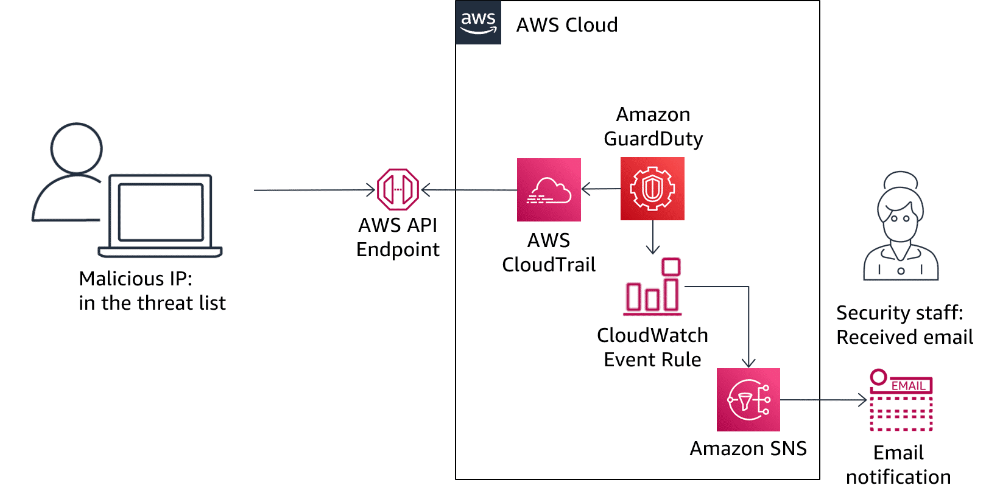

# Overview
+ Amazon GuardDuty is a continuous security monitoring service that analyzes and processes the following [Data sources](https://docs.aws.amazon.com/guardduty/latest/ug/guardduty_data-sources.html#guardduty_data-sources.title): VPC Flow Logs, AWS CloudTrail event logs, Kubernetes audit logs and DNS logs.
+ When GuardDuty discovers a security issue, it **generates a finding**. The finding's details can help you to investigate the issue. The security finding is assigned a severity level, generally based on the context of the activity, which allows for prioritization of response efforts. 
+ Furthermore, **remediation actions can be automated by integrating GuardDuty with other services** such as AWS Security Hub, Amazon EventBridge, AWS Lambda, and AWS Step Functions. Amazon Detective is also tightly integrated with GuardDuty to make forensics and root cause investigation easier.
+ It uses threat intelligence feeds, such as **lists of malicious IP addresses and domains**, and **machine learning** to identify **unexpected and potentially unauthorized and malicious activity within your AWS environment**.
+ GuardDuty informs you of the status of your AWS environment by producing security [findings](https://docs.aws.amazon.com/guardduty/latest/ug/guardduty_findings.html) that you can view in the GuardDuty console or through [Amazon CloudWatch events](https://docs.aws.amazon.com/guardduty/latest/ug/guardduty_findings_cloudwatch.html).
+ GuardDuty is a **Regional service**
+ 
# Concepts and terminology
## **Account**
+ A standard Amazon Web Services (AWS) account that contains your AWS resources. 
+ You can also invite other accounts to enable GuardDuty and become associated with your AWS account in GuardDuty.
+ If your invitations are accepted, your account is designated as the **administrator GuardDuty account**, and the added accounts become your **member accounts**. 
+ Users of the **administrator account** can configure GuardDuty as well as **view and manage GuardDuty findings for their own account and all of their member accounts**.
+ Users of member accounts can configure GuardDuty as well as view and manage GuardDuty findings in their account
+ Users of member accounts **can't view or manage findings in other members' accounts.**
+ An AWS account **can't be a GuardDuty administrator and member account at the same time**.
+ An AWS account can accept **only one membership invitation**. 
+ When you use GuardDuty with an **AWS Organizations** organization, you can designate any account within the organization to be the GuardDuty delegated administrator. Only the **organization management account can designate GuardDuty delegated administrators**.
+ An account that is designated as a **delegated administrator becomes a GuardDuty administrator account**, has GuardDuty automatically enabled in the **designated Region**, and is granted permission to enable and manage GuardDuty for all accounts in the organization within that Region. 
## **Detector**
+ All GuardDuty **findings are associated with a detector**, which is an object that represents the GuardDuty service.
+ The detector is a **regional entity**, and a unique detector is required in each region GuardDuty operates in.
+ When you enable GuardDuty in a region a new detector with a unique 32 alphanumeric detector ID is generated in that region.
+ Some GuardDuty functionality is configured through the detector, such as **configuring CloudWatch Events notification frequency** and the enabling or disabling of optional data sources for GuardDuty to process.
## **Data source**
+ The **origin or location** of a set of data.
## **Finding**
+ A potential **security issue** discovered by GuardDuty. 
## **Suppression rule**
+ Suppression rules allow you to create very specific combinations of attributes to **suppress findings**.
+ Suppression rules defined in the GuardDuty administrator account **apply to the GuardDuty member accounts**.
+ GuardDuty **member accounts can't modify** suppression rules.
## **Trusted IP list**
+ A list of trusted IP addresses for highly secure communication with your AWS environment. GuardDuty does not generate findings based on trusted IP lists. 
## **Threat list**
+ A list of known malicious IP addresses. GuardDuty generates findings based on threat lists. 
# Understanding Amazon GuardDuty findings
+ A GuardDuty finding represents **a potential security issue detected** within your network.
+ Each GuardDuty finding has an assigned **severity level** and value that reflects the potential risk the finding could have to your network as determined by our security engineers. The value of the severity can fall anywhere within the **0.1 to 8.9 range**, with higher values indicating greater security risk.
+ All findings are dynamic, meaning that, if GuardDuty detects **new activity related to the same security issue it will update the original finding** with the new information, instead of generating a new finding.
## Finding details
+ **Finding type** – A formatted string representing the type of activity that triggered the finding. 
+ **Finding ID** – A unique Finding ID for this finding type and set of parameters. New occurrences of activity matching this pattern will be aggregated to the same ID.
+ **Severity** – a finding's assigned severity level of either High, Medium, or Low. 
+ **Region** – the AWS Region in which the finding was generated. 
+ **Count** – The number of times GuardDuty has aggregated an activity matching this pattern to this finding ID.
+ **Account ID** – the ID of the AWS account in which the activity took place that prompted GuardDuty to generate this finding.
+ **Resource ID** – the ID of the AWS resource against which the activity took place that prompted GuardDuty to generate this finding.
+ **Created at** – the time and date when this finding was first created. If this value differs from **Updated at**, it indicates that the activity has occurred multiple times and is an ongoing issue.
+ **Updated at** – The last time this finding was updated with new activity matching the pattern that prompted GuardDuty to generate this finding.
## Resource
+ The **Resource affected** gives details on the AWS resource that was targeted by the trigger activity. 
+ **Resource role** – The role of the AWS resource that triggered the finding. 
    + This value can be **TARGET** or **ACTOR**, and represents **whether your resource was the target of the suspicious activity or the actor that preformed the suspicious activity**.
+ **Resource type** – the type of the affected resource. 
    + A finding can include multiple resources types if multiple resources were involved.
    + The resource types are **AccessKey**, **S3 bucket**, **KubernetesCluster** or **Instance**. 
## Action
+ A finding's **Action** gives details on the type of activity that triggered the finding. The information available varies based on action type.
+ **Action type**
    + **NETWORK_CONNECTION**
    + **PORT_PROBE**
    + **DNS_REQUEST**
    + **AWS_API_CALL**
# Kubernetes protection in Amazon GuardDuty
+ Kubernetes protection **enables Amazon GuardDuty to detect suspicious activities and potential compromises of your Kubernetes clusters** within Amazon Elastic Kubernetes Service (Amazon EKS).
+ Kubernetes protection is **an optional enhancement** that enables GuardDuty to consume Kubernetes data sources.
+ If the feature is **disabled**, the ability of GuardDuty to monitor or generate findings for suspicious activity within your Amazon EKS environment is **limited**.
# Amazon S3 protection in Amazon GuardDuty
+ S3 protection enables Amazon GuardDuty to **monitor object-level API operations** to identify potential security risks for data within your S3 buckets.
+ GuardDuty monitors threats against your Amazon S3 resources by analyzing AWS CloudTrail **management events** and CloudTrail S3 **data events**
+ CloudTrail **management** events for S3 include operations that **list or configure S3 buckets**, such as `ListBuckets`, `DeleteBuckets`, and `PutBucketReplication`
+ **data** events for S3 include **object-level API operations**, such as `GetObject`, `ListObjects`, `DeleteObject`, and `PutObject`.
+ By default, S3 protection is **enabled for new detectors**, for accounts created before the addition of S3 protection this data source must be enabled manually.
# Integration with AWS Security Hub
+ The Amazon GuardDuty integration with Security Hub enables you to **send findings from GuardDuty to Security Hub**.
+ Security Hub can then include those findings in its analysis of your security posture.
# Amazon GuardDuty Malware Protection
+ Amazon GuardDuty now offers Malware protection though scanning, based on Amazon Elastic Compute Cloud (Amazon EC2) instance findings.
+ This means that if a finding is generated which involves an EC2 instance, you can allow GuardDuty to **initiate a malware scan of the instance**.
+ If malware is detected during that scan, **a snapshot will be retained**.
+ This allows for further investigation and forensics to occur, while you take the appropriate response actions to remediate findings.
# What does GuardDuty detect?
+ GuardDuty continuously analyzes the cloud environment and can provide rapid alerts about a number of threats you may face, such as **reconnaissance, instance compromise, account compromise, bucket compromise, and Amazon EKS cluster compromise**. 
# Act on Findings
+ GuardDuty is integrated with both **Amazon CloudWatch and AWS Lambda**.
+ By using these Amazon services, you can **automate your responses to security threats**.
+ This includes taking simple actions such as isolating a compromised EC2 instance or invalidating AWS credentials.
+ 
## Threat Detection Scenario
+ Compromised EC2 Instance 
    + 
+ Compromised AWS Identity and Access Management (IAM) credentials
    + 
# Exporting your findings
+ GuardDuty recommends setting up findings export, which allows you to export your findings to an S3 bucket for storage beyond the GuardDuty 90-day storage limit.
# Alerting on Findings
+ GuardDuty integrates with *8Amazon EventBridge**, which can be used to send findings data to other applications and services for processing.
 With EventBridge, you can use GuardDuty findings to **trigger automatic responses** to your findings by connecting finding events to targets such as **AWS Lambda functions, Amazon EC2 Systems Manager automation, Amazon Simple Notification Service (SNS)**, and more.
# Reference
+ [What is Amazon GuardDuty? - Amazon GuardDuty](https://docs.aws.amazon.com/guardduty/latest/ug/what-is-guardduty.html)
+ [Getting Started with Amazon GuardDuty](https://explore.skillbuilder.aws/learn/course/13518/play/55523/getting-started-with-amazon-guardduty)