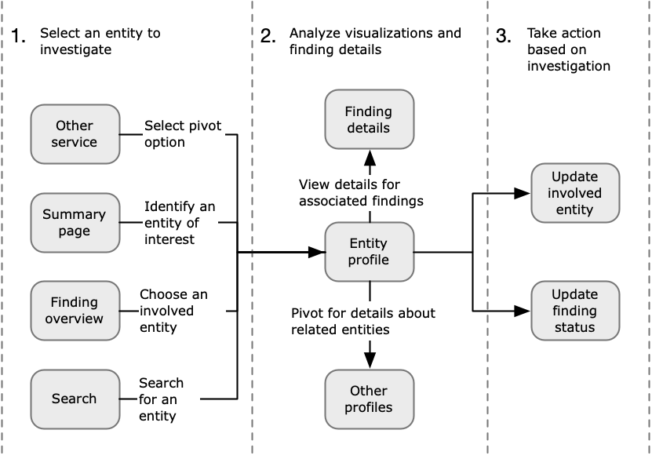
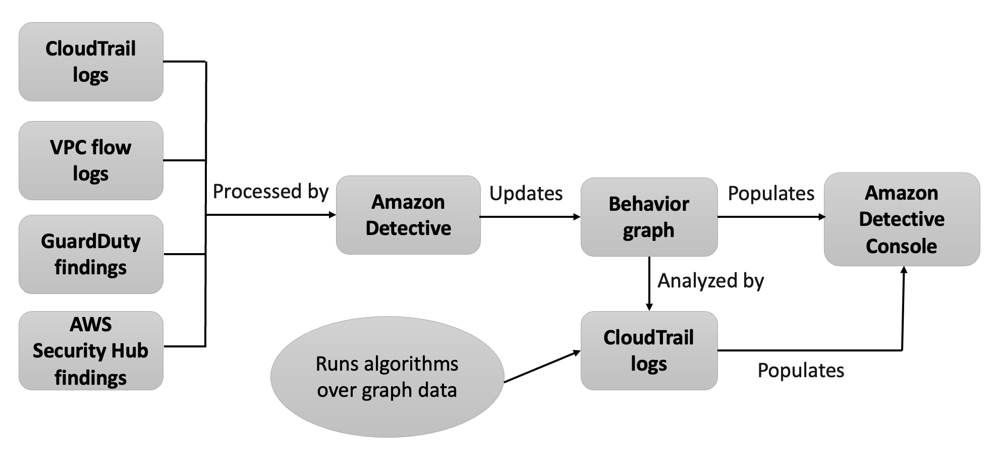

# Overview
+ Amazon Detective helps you analyze, investigate, and **quickly identify the root cause of security findings or suspicious activities**.
+ Detective automatically **collects log data from your AWS resources**.
+ It then uses machine learning, statistical analysis, and graph theory to generate visualizations that help you to **conduct faster and more efficient security investigations**.
# How does Detective work?
+ Detective** automatically extracts time-based events** such as login attempts, API calls, and network traffic **from AWS CloudTrail and Amazon VPC flow logs**.
+ It also ingests **findings detected by GuardDuty**.
# Amazon Detective terms and concepts
## Administrator account
+ The AWS account that owns a behavior graph and that uses the behavior graph for investigation.
+ The administrator account invites member accounts to contribute their data to the behavior graph. 
## Autonomous System Organization (ASO)
+ The titled organization which is assigned an autonomous system.
+ This autonomous system is a heterogenous network or a set of networks using similar routing logic and policies.
## Behavior graph
+ **A linked set of data** generated from incoming source data that is associated with one or more AWS accounts.
+ Each behavior graph uses the same structure of findings, entities, and relationships.
## Delegated administrator account (AWS Organizations)
+ In Organizations, the delegated administrator account for a service is able to manage the use of a service for the organization.
+ In Detective, the Detective administrator account is also the delegated administrator account, unless the Detective administrator account is the organization management account. The organization management account cannot be a delegated administrator account.
+ In Detective, self-delegation is allowed. An organization management account can delegate their own account to be the delegated administrator of Detective but this would be registered or remembered only in the scope of Detective and not organizations.
## Detective administrator account
+ The account designated by the organization management account to be the administrator account for the organization behavior graph in a Region. 
+ Detective recommends that the organization management account chooses an account other than their account.
+ If the account is not the organization management account, then the Detective administrator account is also the delegated administrator account for Detective in Organizations.
## Detective source data
+ Processed, structured versions of information from the following types of feeds:
    + Logs from AWS services, such as AWS CloudTrail logs and Amazon VPC Flow Logs
    + GuardDuty findings
+ Detective uses the Detective source data to populate the behavior graph. Detective also stores copies of the Detective source data to support its analytics.
## Entity
+ An item extracted from the ingested data.
+ Each entity has a type, which identifies the type of object it represents. Examples of entity types include IP addresses, Amazon EC2 instances, and AWS users.
+ Entities can be AWS resources that you manage, or external IP addresses that have interacted with your resources.
+ For each entity, the source data is also used to populate entity properties. Property values can be extracted directly from source records or aggregated across multiple records.
## Finding
+ A security issue detected by Amazon GuardDuty.
## Finding group
+ A collection of related findings, entities, and evidence that may be related to the same event or security issue. Detective generates finding groups based on a built-in machine learning model.
## Detective evidence
+ Detective identifies additional evidence related to a finding group based on data in your behavior graph collected within **the last 45 days**.
+ This evidence is **presented as a finding** with the severity value of Informational.
+ Evidence provides supporting information that highlights an unusual activity or unknown behavior that is potentially suspicious when viewed within a finding group.
+ An example of this might be newly observed geolocations or API calls observed within the scope time of a finding.
+ At this time, these findings are only viewable in Detective and not sent to Security Hub.
## Finding overview
+ A single page that provides a summary of information about a finding.
+ A finding overview **contains the list of involved entities for the findings**. From the list, you can pivot to the profile for an entity.
+ A finding overview also contains a details panel that contains the finding attributes.
## High-volume entity
+ An entity that has connections to or from a large number of other entities during a time interval. For example, an EC2 instance might have connections from millions of IP addresses. The number of connections exceeds the threshold that Detective can accommodate.
+ When the current scope time contains a high-volume time interval, Detective notifies the user.
## Investigation
+ The process of triaging suspicious or interesting activity, determining its scope, getting to its underlying source or cause, and then determining how to proceed.
## Member account
+ An AWS account that an administrator account invited to contribute data to a behavior graph.
+ In the organization behavior graph, a member account can be an organization account that the Detective administrator account enabled as a member account.
+ Member accounts that are invited can respond to the behavior graph invitation and remove their account from the behavior graph. 
+ Organization accounts cannot change their membership in the organization behavior graph.
+ All member accounts can also view usage information for their account across the behavior graphs that they contribute data to.
+ They have no other access to the behavior graph.
+ A behavior graph can have up to 1,200 member accounts.
## Organization behavior graph
+ The behavior graph that is owned by the Detective administrator account.
+ The organization management account designates the Detective administrator account. 
+ In the organization behavior graph, the Detective administrator account controls whether an organization account is a member account. **An organization account cannot remove itself from the organization behavior graph**.
+ The Detective administrator account can also invite other accounts to the organization behavior graph.
## Profile
+ A single page that provides a collection of data visualizations related to activity for an entity.
+ For findings, profiles help analysts to determine whether the finding is of genuine concern or a false positive.
+ Profiles provide information to support an investigation into a finding or for a general hunt for suspicious activity.
## Profile panel
+ A single visualization on a profile. Each profile panel is intended to help answer a specific question or questions to assist an analyst in an investigation.
+ Profile panels can contain key-value pairs, tables, timelines, bar charts, or geolocation charts.
## Relationship
+ Activity that occurs between individual entities. Relationships are also extracted from the incoming source data.
+ Similar to an entity, a relationship has a type, which identifies the types of entities involved and the direction of the connection. An example of a relationship type is an IP address connecting to an Amazon EC2 instance.
## Scope time
+ The time window that is used to scope the data displayed on profiles.
+ The default scope time for a finding reflects the first and last times when the suspicious activity was observed.
+ The default scope time for an entity profile is the previous 24 hours.
# Setting up Amazon Detective
+ When you enable Amazon Detective, Detective creates a **Region-specific behavior graph that has your account as its administrator account**.
+ This is initially the only account in the behavior graph.
+ The administrator account can then invite other AWS accounts to contribute their data to the behavior graph.
# Source data used in a behavior graph
+ To populate a behavior graph, Amazon Detective uses source data from the behavior graph administrator account and member accounts.
+ With Detective, you can access **up to a year of historical event data**. This data is available through a set of visualizations that show changes in the type and volume of activity over a selected time window.
+ Detective links these changes to GuardDuty findings.
# Detective ingests data from these types of AWS logs:
+ AWS CloudTrail logs
+ Amazon Virtual Private Cloud (Amazon VPC) flow logs
+ For accounts that are enrolled in GuardDuty, Detective also ingests GuardDuty findings.
# Types of optional data sources in Detective
+ EKS audit logs
    + This optional data source package allows Detective to ingest detailed information on EKS clusters in your environment and adds that data to your behavior graph.
+ AWS security findings
    + This optional data source package allows Detective to ingest data from Security Hub and adds that data to your behavior graph. 
# Amazon Detective investigation flow
+ 
+ Step 1: Select the entity to investigate
    + When looking at a finding in GuardDuty, analysts can choose to investigate an associated entity in Detective. 
    + You can also use the Detective Summary page to identify an entity to investigate. 
    + From a Detective finding overview, you can choose an involved entity to investigate.
    + You can use the Detective search function to find and select an entity to investigate.
+ Step 2: Analyze visualizations on profiles
    + Each entity profile contains a set of visualizations that are generated from the behavior graph. The behavior graph is created from the log files and other data that are fed into Detective.
    + The visualizations show activity that is related to an entity. You use these visualizations to answer questions to determine whether the entity activity is unusual.
+ Step 3: Take action
    + Based on the results of your investigation, take the appropriate action.
    + For a finding that is a false positive, you can archive the finding. From Detective, you can archive GuardDuty findings
    + Otherwise, you take the appropriate action to address the vulnerability and mitigate damage.
# Data in a behavior graph
+ In Amazon Detective, you conduct investigations using data from a Detective behavior graph.
+ A behavior graph is a linked set of data generated from the Detective source data that is ingested from one or more Amazon Web Services (AWS) accounts.
+ The behavior graph uses the source data to do the following:
    + Generate an overall picture of your systems, users, and the interactions among them over time
    + Perform more detailed analysis of specific activity to help you answer questions that arise as you conduct investigations
    + Correlate collections of findings, entities, and evidence that may be related to the same event or security issue.
# How Detective processes source data
+ 
## Detective extraction
+ Extraction is based on configured mapping rules. A mapping rule basically says, "Whenever you see this piece of data, use it in this specific way to update behavior graph data."
## Detective analytics
+ Analytics are more complex algorithms that analyze the data to provide insight into activity that is associated with entities.
# Types of entities in the behavior graph data structure
+ AWS account
+ AWS role
+ AWS user
+ Federated user
+ EC2 instance
+ Role session
+ Finding
+ IP address
+ S3 bucket
+ User agent
+ EKS Cluster
+ Kubernetes Pod
+ Container Image
+ Kubernetes Subject
# What problems does Detective solve?
+ Rapidly investigate activity that falls outside the norm.
+ Identify patterns that may indicate a security issue.
+ Understand all of the resources affected by a finding.
# What are the benefits of Detective?
+ Faster, more effective investigations
+ Less time and effort with continuous data
+ Helpful visualizations
# How is Detective used to architect a cloud solution?
+ Detective is a vital piece of AWS threat detection and monitoring. Detective provides tools to support the overall investigation process of suspicious activity in an AWS environment by providing visualizations and analytics to help streamline investigation.
+ 
# What are typical use cases for Detective?
+ Front-line analysts can use Detective to triage GuardDuty findings. They can also use Detective to profile AWS resources when responding to any other types of security alerts.
+ Analysts engaging in incident response can use Detective to **quickly scope or determine the root cause of an incident** in both the entity and time dimensions. They can quickly pivot among resources and explore resource behaviors.
+ Analysts or threat intelligence teams can use Detective to answer questions. For example: Were resources communicating with a certain command-and-control IP address 4 months ago? If they were, you will immediately be able to determine which resources were communicating with this IP on what protocols and how much data was exchanged.
# ​​​​​​​Reference
+ [Amazon Detective](https://docs.aws.amazon.com/detective/latest/adminguide/what-is-detective.html)
+ [Amazon Detective](https://docs.aws.amazon.com/detective/latest/userguide/detective-investigation-about.html)
+ [Getting Started with Amazon Detective](https://explore.skillbuilder.aws/learn/course/14077/play/66173/getting-started-with-amazon-detective)
