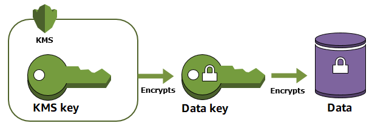

# Overview
+ AWS Key Management Service (AWS KMS) is a managed service that makes it easy for you to **create and control the cryptographic keys** that are used to protect your data.
+ AWS KMS uses **hardware security modules (HSM)** to protect and validate your AWS KMS keys 
+ AWS KMS integrates with most [other AWS services](https://aws.amazon.com/kms/features/#AWS_Service_Integration) that encrypt your data.
+ AWS KMS also integrates with [AWS CloudTrail](https://docs.aws.amazon.com/awscloudtrail/latest/userguide/) to log use of your KMS keys for auditing, regulatory, and compliance needs.
# Manage AWS KMS keys
+ [Create](https://docs.aws.amazon.com/kms/latest/developerguide/create-keys.html), [edit](https://docs.aws.amazon.com/kms/latest/developerguide/editing-keys.html), and [view](https://docs.aws.amazon.com/kms/latest/developerguide/viewing-keys.html) [symmetric and asymmetric KMS keys](https://docs.aws.amazon.com/kms/latest/developerguide/symmetric-asymmetric.html)
+ Control access to your KMS keys by using [key policies](https://docs.aws.amazon.com/kms/latest/developerguide/key-policies.html), [IAM policies](https://docs.aws.amazon.com/kms/latest/developerguide/iam-policies.html), and [grants](https://docs.aws.amazon.com/kms/latest/developerguide/grants.html). AWS KMS supports [attribute-based access control](https://docs.aws.amazon.com/kms/latest/developerguide/abac.html) (ABAC). You can also refine policies by using [condition keys](https://docs.aws.amazon.com/kms/latest/developerguide/policy-conditions.html).
+ [Create, delete, list, and update aliases](https://docs.aws.amazon.com/kms/latest/developerguide/kms-alias.html), friendly names for your KMS keys. You can also [use aliases to control access](https://docs.aws.amazon.com/kms/latest/developerguide/alias-authorization.html) to your KMS keys.
+ [Tag your KMS keys](https://docs.aws.amazon.com/kms/latest/developerguide/tagging-keys.html) for identification, automation, and cost tracking. You can also [use tags to control access](https://docs.aws.amazon.com/kms/latest/developerguide/tag-authorization.html) to your KMS keys
.+ [Enable and disable](https://docs.aws.amazon.com/kms/latest/developerguide/enabling-keys.html) KMS keys.
+ Enable and disable [automatic rotation](https://docs.aws.amazon.com/kms/latest/developerguide/rotate-keys.html) of the cryptographic material in a KMS keys.
+ [Delete KMS keys](https://docs.aws.amazon.com/kms/latest/developerguide/deleting-keys.html) to complete the key lifecycle.
# Features
+ **Encrypt, decrypt, and re-encrypt** data with symmetric or asymmetric KMS keys.
+ **Sign and verify messages** with asymmetric KMS keys.
+ **Generate exportable** symmetric data keys and asymmetric data key pairs.
+ **Generate random numbers** suitable for cryptographic applications.
+ [Import cryptographic material](https://docs.aws.amazon.com/kms/latest/developerguide/importing-keys.html) into a KMS key
+ Create KMS keys in your own [custom key store](https://docs.aws.amazon.com/kms/latest/developerguide/custom-key-store-overview.html) backed by a AWS CloudHSM cluster
+ Connect directly to AWS KMS through a [private endpoint in your VPC](https://docs.aws.amazon.com/kms/latest/developerguide/kms-vpc-endpoint.html)
+ Use [hybrid post-quantum TLS](https://docs.aws.amazon.com/kms/latest/developerguide/pqtls.html) to provide forward-looking encryption in transit for the data that you send to AWS KMS.
# AWS KMS keys
+ Symmetric KMS keys and the private keys of asymmetric KMS key **never leave AWS KMS unencrypted**.
+ AWS KMS also supports [multi-Region keys](https://docs.aws.amazon.com/kms/latest/developerguide/multi-region-keys-overview.html), which let you **encrypt data in one AWS Region and decrypt it in a different AWS Region**.
+ **Customer managed keys**
    + The KMS keys that you create are *customer managed keys*.
    + Customer managed keys are KMS keys in your AWS account that **you create, own, and manage**.
    + You have **full control** over these KMS keys
    + You can use your customer managed key in **cryptographic operations and audit usage** in AWS CloudTrail logs.
+ **AWS managed keys**
    + *AWS managed keys* are KMS keys in your account created, managed, and used **on your behalf by an AWS services integrated with AWS KMS**
    + you **cannot manage** these KMS keys, rotate them, or change their key policies.
    + And, you **cannot** use AWS managed keys in cryptographic operations directly; the service that creates them uses them on your behalf.
+ **AWS owned keys**
    + *AWS owned keys* are a collection of KMS keys that an **AWS service owns and manages** for use in multiple AWS accounts. 
    + You **do not need to create or manage** the AWS owned keys.
    + you **cannot** view, use, track, or audit them.
+ **Symmetric KMS keys**
    + AWS services integrated with AWS KMS use **symmetric KMS keys** to encrypt your data.
    + These services **do not support encryption with asymmetric** KMS keys. 
+ **Asymmetric KMS keys**
    + You can create asymmetric KMS keys in AWS KMS.
    + An *asymmetric KMS key* represents a mathematically related **public key and private key** pair.
    + The **private key never leaves AWS KMS unencrypted**. 
+ **Multi-Region keys**
    + AWS KMS supports *multi-Region keys*, which are AWS KMS keys in different AWS Regions that can be used interchangeably – as though you had the same key in multiple Regions.
    + Each set of *related* multi-Region keys has the same [key material](https://docs.aws.amazon.com/kms/latest/developerguide/concepts.html#key-material) and [key ID](https://docs.aws.amazon.com/kms/latest/developerguide/concepts.html#key-id-key-id), so you can **encrypt data in one AWS Region and decrypt it in a different AWS Region**
+ **Data keys**
    + *Data keys* are **encryption keys** you can use to encrypt data
    + Unlike [KMS keys](https://docs.aws.amazon.com/kms/latest/developerguide/concepts.html#kms_keys), which can't be downloaded,**data keys are returned to you for use outside of AWS KMS**.
    + When AWS KMS generates data keys, it returns a plaintext data key for immediate use (optional) and an **encrypted copy of the data key** that you can safely store with the data. When you are ready to decrypt the data, you first ask AWS KMS to decrypt the encrypted data key.
    + AWS KMS **generates, encrypts, and decrypts data keys**.
    + However, AWS KMS **does not store, manage, or track your data keys or perform cryptographic operations with data keys.** 
+ **Data key pairs**
    + *Data key pairs* are asymmetric data keys consisting of a mathematically-related public key and private key.
    + AWS KMS **protects the private key** in each data key pair **under a symmetric KMS key** in AWS KMS that you specify.
    + However, AWS KMS **does not store, manage, or track your data key pairs or perform cryptographic operations** with data key pairs.
    + You must use and manage data key pairs outside of AWS KMS
+ **Custom key stores**
    + A *custom key store* is an AWS KMS resource associated with FIPS 140-2 Level 3 hardware security modules **(HSMs) in a AWS CloudHSM cluster** that you own and manage
    + This key material **never leaves the HSMs unencrypted**.
    + When you use a KMS key in a custom key store, the **cryptographic operations are performed in the HSMs in the cluster**.
+ **Key material**
    + *Key material* is the **secret string of bits** used in a cryptographic algorithm. Key material must be kept secret to protect the cryptographic operations that use it.
    + Each KMS key includes key material along with metadata
    + By default, each KMS key has unique key material. 
+ **Key material origin**
    + Key material origin is a KMS key property that identifies the source of the key material in the KMS key.
    + You choose the key material origin when you create the KMS key, and you cannot change it.
    + The source of the key material affects the security, durability, availability, latency, and throughput characteristics of the KMS key.
    + KMS keys can have one of the following key material origin values.
        + AWS_KMS：**AWS KMS** creates and manages the key material for the KMS key in its **own key store**.
        + EXTERNAL (Import key material)： + The KMS key has [imported key material](https://docs.aws.amazon.com/kms/latest/developerguide/importing-keys.html). 
        + AWS_CLOUDHSM: AWS KMS creates the key material in the AWS CloudHSM cluster for your AWS CloudHSM key store.
        + EXTERNAL_KEY_STORE: The key material is a cryptographic key in an external key manager outside of AWS. This origin is supported only for KMS keys in an external key store.
+ **Key usage**
    + *Key usage* is a property that determines whether a KMS key is used for **encryption and decryption -or- signing and verification**.
    +  A key cannot support both. 
+ **Envelope encryption**
    + *Envelope encryption* is the practice of **encrypting plaintext data with a data key, and then encrypting the data key under another key**.
    + 
+  **Key policy**
    + When you create a KMS keys, you determine **who can use and manage that KMS keys**.
    + These permissions are contained in a document called the *key policy*.
# Authentication and access control
+ The primary way to manage access to your KMS keys is with *policies*.
+ In AWS KMS, you must attach **resource-based policies** to your KMS keys. These are called **key policies**. All KMS keys have a key policy.
+ You can control access to your KMS keys in these ways: 
    + **Use the key policy** – You must use the key policy to control access to a KMS key. 
    + **Use IAM policies in combination with the key policy** – You can use IAM policies in combination with the key policy to control access to a KMS key. 
    + **Use grants in combination with the key policy**
        + A *grant* is a policy instrument that allows [AWS principals](https://docs.aws.amazon.com/IAM/latest/UserGuide/intro-structure.html#intro-structure-principal) to use KMS keys in cryptographic operations
        + Grants are a very **flexible and useful access control mechanism**.
        + When you create a grant for a KMS key, the grant **allows the grantee principals to call the specified grant operations on the KMS key** provided that all conditions specified in the grant are met.
        + Grants are often used for **temporary permissions** because you can create one, use its permissions, and delete it without changing your key policies or IAM policies.
        + Grants are commonly used by AWS services that integrate with AWS KMS to encrypt your data at rest. The service creates a grant on behalf of a user in the account, uses its permissions, and retires the grant as soon as its task is complete.
+ **VPC endpoint**
    + You can connect directly to AWS KMS through a private endpoint in your VPC instead of connecting over the internet. When you use a VPC endpoint, communication between your VPC and AWS KMS is conducted entirely **within the AWS network**.
    + Each VPC endpoint is **represented by one or more [Elastic Network Interfaces](https://docs.aws.amazon.com/AWSEC2/latest/UserGuide/using-eni.html) (ENIs) with private IP addresses in your VPC subnets**.
    + To control access to your VPC endpoint for AWS KMS, attach a **VPC endpoint policy**to your VPC endpoint. The endpoint policy determines whether principals can use the VPC endpoint to call AWS KMS operations on AWS KMS resources.
+ AWS KMS supports **ABAC** by allowing you to control access to your customer managed keys **based on the tags and aliases** associated with the KMS keys.
# Reference
[AWS Key Management Service - AWS Key Management Service](https://docs.aws.amazon.com/kms/latest/developerguide/overview.html)
