# AWS networking services
+ Network foundations: Amazon VPC(opens in a new tab), AWS Transit Gateway(opens in a new tab), AWS PrivateLink(opens in a new tab)
+ Hybrid connectivity: AWS Direct Connect(opens in a new tab), AWS Site-to-Site VPN(opens in a new tab), AWS Client VPN(opens in a new tab), AWS Cloud WAN(opens in a new tab)
+ Edge networking: Amazon CloudFront(opens in a new tab), Amazon Route 53(opens in a new tab), AWS Global Accelerator(opens in a new tab)
+ Application networking: AWS App Mesh(opens in a new tab), Amazon API Gateway(opens in a new tab), AWS Cloud Map(opens in a new tab)
+ Networking security: AWS Shield(opens in a new tab), AWS WAF(opens in a new tab), AWS Network Firewall(opens in a new tab), AWS Firewall Manager

# Hybrid connectivity
+ point to point
+ bus
+ tree
+ hub and spoke
+ mesh
+ ring
+ hybird

# Network Protocols
+ Network management protocols
    + Network management protocols define the policies and procedures used to monitor, manage, and maintain your network. 
    + SNMP – Simple Network Management Protocol (SNMP)(opens in a new tab) is used to monitor and manage network devices. This TCP-based protocol adds visibility and the ability to modify endpoints which alter behavior of devices across the network. SNMP relies on the use of agents to collect and send data to an overarching SNMP manager, which in turn queries agents and gets their responses.
    + ICMP – Internet Control Message Protocol (ICMP)(opens in a new tab) is primarily used for diagnostic purposes. Managed devices on the network can use this protocol to send error messages, providing information regarding network connectivity issues between devices.
+ Network communication protocols
    + Communication protocols determine the formats and rules used to transfer data over the network.
    + HTTP – Hypertext transfer protocol (HTTP)(opens in a new tab) is an application layer protocol that allows the browser and server to communicate.
    + TCP – Transmission Control Protocol (TCP)(opens in a new tab) separates data into packets that can be shared over a network. These packets can then be sent by devices like switches and routers to the designated targets.
    + UDP – User Datagram Protocol (UDP)(opens in a new tab) works in a similar way to TCP, sending packets of data over the network. The key difference between the two is that TCP ensures that a connection is made between the application and server, but UDP does not.
    + IRC – Internet Relay Chat (IRC)(opens in a new tab) is a text-based communication protocol. Software clients are used to communicate with servers and send messages to other clients. This protocol works well on networks with a large number of distributed machines.
+ Network security protocols
    + Network security protocols ensure that data traffic on your network is secure.These protocols define how the network secures data from malicious attempts. This protects the data from unauthorized users, services, or devices that access your network data.
    + SSL – A Secure Sockets Layer (SSL)(opens in a new tab) is a network security protocol primarily used for ensuring secure internet connections and protecting sensitive data. This protocol can allow for server/client communication as well as server/server communication. Data transferred with SSL is encrypted to prevent it from being readable.
    + SFTP – Secure File Transfer Protocol (SFTP)(opens in a new tab), as its name might suggest, is used to securely transfer files across a network. Data is encrypted and the client and server are authenticated.
    + HTTPS – Secure Hypertext Transfer Protocol(opens in a new tab) is the secure version of HTTP. Data sent between the browser and server are encrypted to ensure protection.
# Internet Protocol (IP)
## IPv4
    + public
        + The first range, Class A starts at 0.0.0.0 and ends at 127.255.255.255, providing over 2.1 billion IP address.
        + Then second range, Class B starts at 128.0.0.0 and ends at 191.255.255.255, providing a little over 1 billion IP address.
        + The third range, Class C, starts at 192.0.0.0 and ends at 223.255.255.255, providing a little over 2 million IP address.
        + There are also Class D and Class E IP ranges.
    + pirvate
        + Class A is 10.0.0.0 + 10.255.255.255 providing one single Class A IP addresses.
        + Class B is 172.16.0.0 + 172.31.255.255 providing 16 Class B IP addresses.
        + Class C is 192.168.0.0 + 192.168.255.255  providing 256 Class C IP addresses.
## IPv6
+ An IPv6 address is represented in hexadecimal rather than the dotted decimal like IPv4 addresses. Instead of 32 bits like an IPv4 IP address, an IPv6 address is 128 bits long. It is called a hextet and can be abbreviated by removing redundant zeros. 

# Classless Inter-Domain Routing (CIDR)
+ CIDR provides a numerical representation of a network that describes its characteristics and mask length which determines the usable addresses, including the start and end addresses. CIDR addresses are represented by the starting IP address of the network, called the network address, and the prefix, which is a forward slash and a number that represents the size of the network. CIDR provides more granular control of the number of addresses you assign to each subnet.
+ The advantages of CIDR over the classful IP addressing are: 
+ CIDR can be used to effectively manage the available IP address space. 
+ CIDR can reduce the number of routing table entries.

# Subnetting
+ Subnetting is the process of dividing a network into smaller network sections. 
+ A subnet is a logical organization of connected network devices. 
+ This helps to isolate groups of hosts together, which can improve routing efficiency, network management control, and network security
+ A subnet, or subnetwork, is a network inside a network. 
+ Subnets make networks more efficient because network traffic can travel a shorter distance without passing through unnecessary routers to reach its destination
+ In subnetting, every device that connects to the internet is assigned a unique IP address. This helps the data sent over the internet to reach the right device out of the billions of devices connected to the internet
+ Networks are categorized into different classes from A to E. Class A networks can connect millions of devices. Class B networks and Class C networks are progressively smaller in size. Class D and Class E networks are not commonly used.
+ Class A network: With a Class A network, everything before the first period indicates the network part of the address. Everything after the first period specifies the device within that network. With 205.0.125.100 as an example, the network part is 205 and the host for the device is 0.125.100.
+ Class B network: With a Class B network, everything before the second period indicates the network part of the address. Again using 205.0.125.100 as an example, 205.0 indicates the network part and 125.100 indicates the host for the device.
+ Class C network: With a Class C network, everything before the third period indicates the network. Using the same example, 205.0.125 indicates the Class C network, and 100 indicates the device.
+ Because an IP address is limited to indicating the network and the device address, IP addresses cannot be used to indicate which subnet an IP packet should go to. Routers within a network use something called a subnet mask to sort data into subnetworks.

# Subnet mask
+ A subnet mask is used for internal usage within a network to determine if a host is on the local subnet or remote network. 
+ You can determine the number and type of IP addresses any given local network requires based on its default subnet mask.
+ Routers use subnet masks to route data packets to the right place. Subnet masks are not indicated within data packets traversing the internet.
# Accessing data
+ Network attached storage (NAS)(opens in a new tab) connects to a shared storage device across the entire network. This is usually kept in a data center and provides file-level access. In AWS, this would be Elastic File System (Amazon EFS)(opens in a new tab) or Amazon FSx(opens in a new tab). 
+ Storage area network (SAN)(opens in a new tab) adds block-level access. In AWS, this is the Amazon Elastic Block Store (Amazon EBS)(opens in a new tab).

# Routing
Routing is how your data moves across your network from device to device and provides the path to deliver network packets from the source to the destination. Routing is also how your data moves across the internet from your local network.

# Open Systems Interconnect (OSI) model
+ The OSI model contains 7 layers: physical layer, data link layer, network layer, transport layer, session layer, presentations layer, and application layer. 
+ These 7 layers are the networking stack, which is the software that completes each function. 
+ Then OSI model can further be grouped as Host layers and Media layers. The Media layer consists of layer 1 to layer 3. The Host layer consists of the layer 4 to layer 7.

# Transmission Control Protocol/Internet Protocol model
+ Transmission Control Protocol/Internet Protocol (TCP/IP)(opens in a new tab) is a suite of communication protocols used to interconnect network devices on the internet.
+ The TCP/IP model and the OSI model are the most used communication networking protocols. The main difference between the two models is that OSI is a conceptual model. It defines how applications can communicate over a network. TCP/IP, on the other hand, is used to describe how the TCP and IP protocols establish links and interact on a network.
+ The TCP/IP protocols lay out standards on which the internet was created, while the OSI model provides guidelines on communication. 

# OSI model in AWS
+ 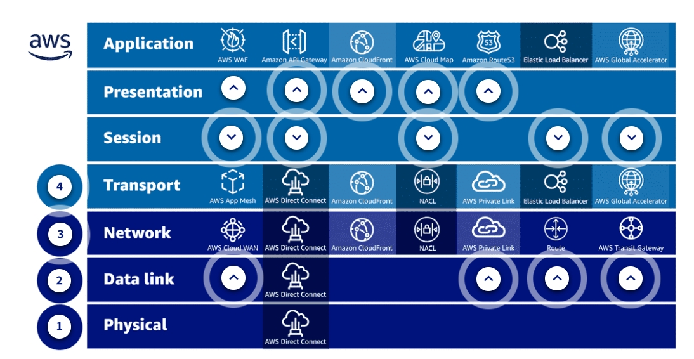
+ Layer 1 in AWS is the physical infrastructure of AWS and it is managed by AWS. Direct Connect allows touch of physical, data link, network, and transport.
+ Layer 2 in AWS is the hypervisor. This is the software that allows the hardware to be used. In AWS, you do not have access to this physical hardware, but can use the CLI that is layered on top for some access at layer 2.
+ Layer 3 in AWS is the management layer or software-defined data center. You can create an AWS account and start building using the AWS Management Console, CLI, and APIs.
    + Cloud WAN creates a network topology at layer 3, the network layer.
    + AWS PrivateLink
        + You can use AWS PrivateLink to make services in your Amazon VPC available to other AWS accounts and Amazon VPCs. 
        + AWS PrivateLink is a highly available, scalable technology that establishes private access to services across VPC boundaries. Other accounts and VPCs can create VPC endpoints to access your endpoint service.
        + Endpoint services can be created on Network Load Balancers and Gateway Load Balancers.
        + A Network Load Balancer functions at the network transport layer 4.
        + A Gateway Load Balancer operates at layer 3 of the OSI model.
    + Routes and route tables sit at layer 3.
    + transit gateway
        + A transit gateway acts as a regional virtual router for traffic flowing between your Amazon VPCs and on-premises networks. 
        + Routing through a transit gateway operates at layer 3, where the packets are sent to a specific next-hop attachment, based on their destination IP addresses.
+ Layer 4 in AWS is the service layer. This layer is where AWS services: Amazon Simple Storage Service (Amazon S3), AWS Lambda, Amazon Relational Database Service (Amazon RDS), or Amazon EC2 sit. You can create an Amazon VPC, set up network access control lists (network ACLs), security groups, and add access with AWS Identity and Access Management (IAM).
    + App Mesh does not currently allow multiple backend destinations modeled as TCP to share the same port due to restrictions in the information provided to the Envoy proxy at OSI layer 4.
    + Direct Connect sits at layers 1 through 4.
    + Network security controls such as security groups and network access control lists (network ACLs) provide you with options to control network traffic. However, these controls operate at network layer 3 and the transport 4 layer of OSI model. Traffic is filtered based on IP addresses, transport protocols, and ports.
    + Elastic load balancers
        + Load balancers manage layer 4 and layer 7, but work at layer 7. From the OSI model, load balancers generally run at layer 4, the transport, or layer 7, the application layer.
        + A layer 4 load balancer works at the network protocol level and does not understand or read the network packets, remaining unaware of the specifics of HTTP and HTTPS.
        + A layer 7 load balancer inspects packets, has access to HTTP and HTTPS headers, and can do a more intelligent job of spreading the load out to the target.
    + The Global Accelerator sits at layers 4 and 7.
+ Layer 7 Application
    + API Gateways sit at layer 7.
    + Layer 7 protects applications at layer 7 and uses HTTP, but CloudFront also runs on layers 3 and 4.
    + AWS Cloud Map sits at layer 7.
    + Route 53 runs from the application layer, layer 7. It is invoked by web browser to convert the host name to an IP address. It is an application using the TCP/IP stack. 
    + AWS WAF manages layer 4 and 7, but works at layer 7. Network security controls such as security groups and network access control lists (network ACLs) provide you with options to control network traffic. 
        + However, these controls operate at network layer 3 and transport layer 4 of the OSI model. WAF filters traffic based on IP addresses, transport protocols, and ports. 
        + You may have additional requirements to have network security controls at the application layer. An example is application protocol detection and filtering based on application protocol properties such as HTTP headers and TLS version. 
        + When you build your web application at layer 7, the AWS WAF helps to protect the application by filtering and monitoring HTTP and HTTPs traffic. 

# Amazon VPC Basics
+ AWS created their global infrastructure as a collection of individual infrastructures located all over the world. Globally, AWS offers Regions, Availability Zones, Local Zones, and edge locations. 
    + An AWS Region(opens in a new tab) is a geographical area that consists of two or more Availability Zones.
        + By designing infrastructure that spans two or more Availability Zones, you are designing your network to withstand global disasters.
        + There is separation between Regions ensuring that each Region is fault tolerant.  
    + An Availability Zone(opens in a new tab) is one or more interconnected data centers with redundant power, networking, connectivity, and so on. 
        + One Availability Zone is one or more data centers with isolated compute, storage, network, and so on. These data centers are housed in separate facilities and sit inside different Regions. AWS also has multiple data centers across the world. You can distribute your infrastructure across multiple Availability Zones in your Region for high availability.  
        + If one Availability Zone fails, then the other Availability Zone should remain operational.
        + The Availability Zones are isolated from each other, but connected with high-speed redundant networking.
    + AWS (opens in a new tab)Local Zones(opens in a new tab) are about getting AWS services closer to end-users.
        + A Local Zone deploys compute, storage, databases, and other AWS services closer to large populations.
        + Each AWS Local Zone location is an extension of a Region where you can run your latency-sensitive applications using AWS services.
    + An (opens in a new tab)edge location(opens in a new tab) is a global service and it is an endpoint for AWS that is used for caching content. The AWS content delivery network (CDN) is Amazon CloudFront.
        + When data is requested, CloudFront takes data and caches that data at the edge location. The next time another user requests that same information, that data is already available and delivered to the user much faster because CloudFront does not have to go all the way back to the database and search for that specific information. There are more edge locations than Regions.
        + The next time another user requests that same information, that data is already available and delivered to the user much faster because CloudFront does not have to go all the way back to the database and search for that specific information. There are more edge locations than Regions.
+ There are three types of resilient services AWS offers: Global, Regional, and Zone specific.
    + Globally-resilient services: A globally-resilient service is a service that operates globally with a single database and that data is then replicated across AWS Regions. If a Region fails, then the service will continue to run because it is replicated to other Regions. 
    + Regional-resilient services: Region-resilient services operate in one Region with one set of that data in that Region. The data is then replicated to multiple Availability Zones in that Region. If you lose one Availability Zone in that Region, the service will continue to operate. However, if the whole Region fails, then so does that service.
    + Zone-resilient services: Availability Zone resilient services are run in a single Availability Zone. If that Availability Zone fails, then so does that service.
## PrivateLink vs VPC endpoint
+ Let's suppose you have an application hosted in your VPC and you would like that to be accessible by other services in other VPCs or other AWS accounts, but you do not want to set up a VPC peering connection or an IGW for that kind of connectivity. This is where you can use PrivateLink.
+ Using PrivateLink, now you can create your own VPC endpoint services which will enable the access of this application from other services. So in essence, the VPC endpoint is a resource that allows access to an application, whereas PrivateLink is just a general technology to allow private access to internal services. 
## on premises to the VPC
+ When it comes to on premises to the VPC customer can use the regular internet up link for accessing the resources running in a public segment of the VPC. They can also use AWS Direct Connect, AWS Managed VPN along with Transit Gateway or a Self-Managed VPN. As for VPC to VPC connectivity, they can use the AWS Backbone for public communications VPC Peering, AWS PrivateLink endpoint and it always managed VPN or self managed VPN along with transit gateway.

# Amazon VPC
+ An Amazon VPC is a software-defined virtual private network. It is a service that you use to create secure private networks in AWS to host your applications and data. 
+ There are two types of Amazon VPCs in AWS, a default and a non-default. You can only have one default Amazon VPC per Region. 
+ And by default your non-default Amazon VPC is isolated and private until you explicitly grant public access, but there is one exception, the default VPC. 
+ Amazon VPC components
    + CIDR
        + There are five IP addresses in each subnet that are reserved and not for your use. 
        + The first four and and the last one
        + The first address is the first address of each network 10.0.0.0.
        + The second address is the Network +1 address, and this is the first IP address after our network address. This IP address would be 10.0.0.1, and + AWS uses this address for the Amazon VPC router.
        + The third IP address is called the Network +2 address, the second IP address after our network address, and AWS uses this IP address for DNS 10.0.0.2.
        + The fourth address is the Network +3 address, and it is reserved in case it is needed, 10.0.0.3.
        + The last address we cannot use is the broadcast address, which is the last IP in our subnet,10.0.255.254
    + Subnets
        + Subnets are how you add structure and functionality to your Amazon VPCs, and they are an Availability Zone resilient feature of AWS.
    + Amazon Elastic Compute Cloud (Amazon EC2)
    + Routing
        + The Amazon VPC router runs in all your Availability Zones that your Amazon VPC uses.
        + The router has a network interface in each subnet in your Amazon VPC and uses the Network +1 address. 
        + You never need to worry about this router, it just works, and it's managed by AWS to route traffic between subnets in your Amazon VPC
        + You can control this router by creating route tables with rules to allow traffic in and out of your subnet
    + Route tables
        + Route tables(opens in a new tab) are created at the Amazon VPC level, but are associated with a subnet. 
        + Each Amazon VPC has a main route table associated with your subnets. 
        + If you do not explicitly associate your new route table with your subnet, then the Amazon VPC will use this main route table.
        + A subnet can only have one route table associated with it at a time, but you can use one route table for many different subnets in your Amazon VPC.
    + Internet gateway
        + An Amazon VPC can have one internet gateway(opens in a new tab) at a time, and it is a regional resilient service ensuring high availability.
        + The internet gateway sits on the edge of your Amazon VPC, the AWS Public Zone, and the internet to manage the traffic between your Amazon VPC, the AWS Public Zone, and the internet.
        + The internet gateway is attached to one Amazon VPC and one internet gateway works across all Availability Zones. 
    + Network access control list
        + A network access control list(opens in a new tab) (network ACL) is a type of security filter like a firewall that can filter traffic as it enters and leaves a subnet.
        + Network ACLs are attached at the subnet level, and by default a default network ACL is created for your default Amazon VPC and is associated with all subnets. 
        + Network ACLs are stateless, which means that if you add a rule for inbound traffic, then you must also add the same rule for outbound traffic. Network ACLs only see the traffic going one way. 
    + Security groups
        + security groups are attached to the elastic network interface(opens in a new tab) of the AWS resources in the subnet.
        + Security groups sit at the boundary of an Amazon EC2 instance instead of the subnet.
        + Security groups are stateful, and have inbound and outbound rules. Stateful firewalls view traffic as one stream. If traffic is allowed in, then that traffic is automatically allowed back out. 

+ 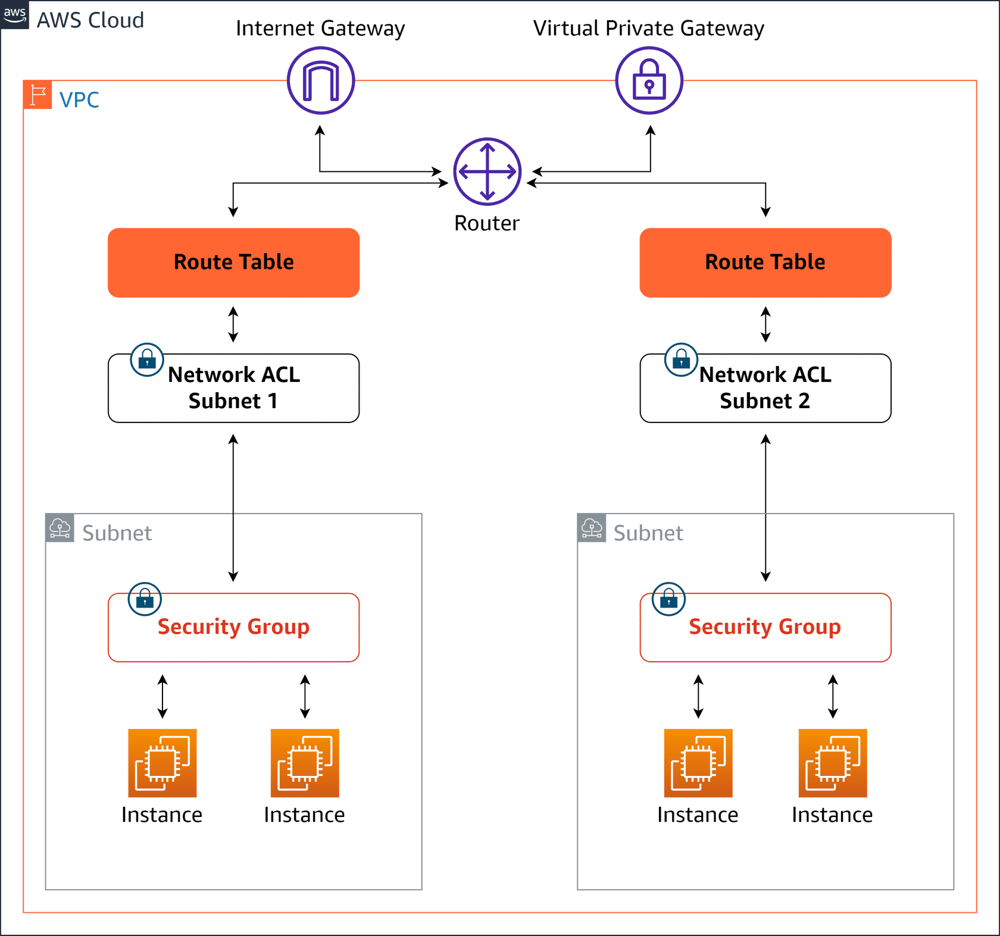

# Network gateways
+ A network gateway(opens in a new tab) is a device or node that connects networks with different transmission protocols and performs protocol conversions to translate communications.
+ The gateway has a network interface card with inputs, outputs, and software for this translation of network protocols.
+ Gateway functions may also be defined, deployed, and controlled through software.
+ All data must pass through or communicate with the gateway prior to being routed through that gateway.
+ Gateways serve as an entry and exit point for a network. 
+ A gateway connects networks, and a router delivers data within a network. 
+ Gateways and routers are usually separate devices. However, it's becoming more common for their functions to be combined in a router. For example, in your home network, your router can also be your default gateway.
+ Gateways serve as an entry or exit point for data, but can also be used for security processes, such as a firewall to scan and filter data or a proxy server to maintain restricted access to certain applications or assets. 
+ Gateways help to route data and add communication.
+ There are seven AWS Networking Gateways.
    + Internet gateway is an Amazon VPC component that allows communication between your computer and the internet. Applications include, Elastic Load Balancers, Amazon EC2 instances, Amazon S3, AWS Lambda and so on.
    + Customer Gateway is a physical or software appliance that you own or manage in your on premises network. Applications include manages routing to and from your environment.
    + VPN Gateway is the gateway on the AWS side of site-to-site VPN connection. Applications include Amazon EC2 instances, Amazon S3, Amazon RDS< Amazon Lambda, and so on.
    + Direct Connect Gateway establishes connectivity that spans Amazon VPCs spread across multiple AWS Regions. Applications include Amazon EC2 instances, Amazon RDS, AWS Lambda, and so on.
    + NAT Gateway is a network address translation service that enables instances in a private subnet to connect to services outside your VPC. Applications include Amazon EC2 instances, Amazon RDS, AWS Lambda, and so on.
    + AWS Transit Gateway connects Amazon VPCs, AWS accounts, and on premises networks to a single gateway. Applications include Amazon VPC connections, AWS VPN connection, AWS Direct Connect.
    + Virtual gateway allows resources that are outside of your mesh network to communicate to resources that are inside. Applications include Amazon EC2, Amazon ECS, and Amazon EKS.
+ 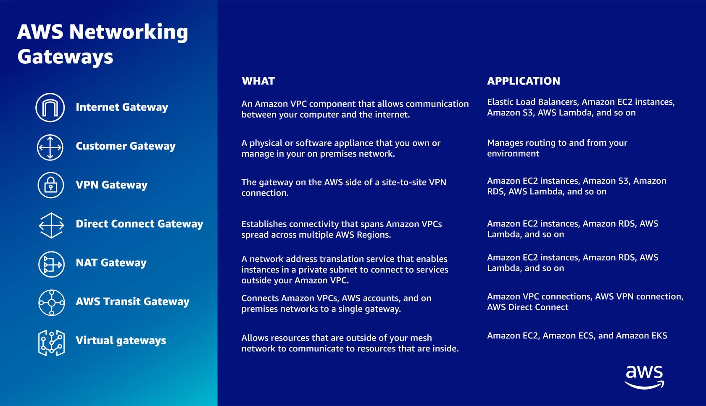

# VPC peering
+  VPC peering(opens in a new tab) is a way to link multiple Amazon VPCs together and allows direct communications between two isolated Amazon VPCs using their private IP addresses.
+ VPC peers can span AWS accounts and also Regions. The data shared is encrypted using the AWS global infrastructure.
+ VPC peering is a link between two Amazon VPCs. VPC peering is a one-to-one connection, no more.
+ However, this design is not scalable. As your environment grows and more Amazon VPCs are added, you will need to consider other options for connecting VPCs. 
+ Cost optimization tip: All data transfer over a VPC peering connection that stays within an Availability Zone is free of charge. All data transfer over a VPC peering connection that crosses Availability Zones will continue to be charged at the standard in-Region data transfer rates.

# AWS Transit Gateway
+ AWS Transit Gateway(opens in a new tab) creates a one-to-many peering connection through a central hub.
+ Inter-Region peering connects AWS Transit Gateways together using the AWS global network. This adds automatic encryption for your data, and your data never travels over the public internet.
+ Transit gateways adds scalability, connectivity, better visibility and control, and improved security over peering connections. 
+ Transit gateways can also be used to connect your AWS environment to your on premises infrastructure creating a hybrid network of AWS and physical networks. 
+ Cost optimization tip: In AWS Transit Gateway, you are charged for the number of connections that you make to the Transit Gateway per hour and the amount of traffic that flows through AWS Transit Gateway.

# AWS PrivateLink
+ AWS PrivateLink(opens in a new tab) provides private connectivity between Amazon VPCs, AWS services, and your on premises networks, without exposing traffic to the public internet. 
+ Interface VPC endpoints, powered by AWS PrivateLink, connect you to services hosted by AWS Partners and supported solutions available in AWS Marketplace. 
+ Gateway Load Balancer endpoints, powered by AWS PrivateLink, brings the same level of security and performance to your virtual network appliances or custom traffic inspection logic.
+ Cost optimization tip: You will be billed for each hour that your VPC endpoint remains provisioned in each Availability Zone, irrespective of the state of its association with the service.

# Multi-tier architecture
+ A multi-tier architecture is a grouping of different software components by function, into tiers or layers. There is no limit to the number of tiers, but the most common models use three:
    + Presentation tier (user interface)
    + Application or logic tier
    + Data tier
+ Multiple tiers provide a shield against threats and increase the availability of your solutions.
+ Using a multi-tier architecture within Amazon VPC, you can introduce extra layers of defense between attackers and your sensitive resources.

# Multi-virtual private cloud (VPC) architecture
+ VPCs are separated and isolated from one another and can optionally be linked through dedicated connections.
+ Multiple VPCs afford your applications greater flexibility for development, increased security features, and more robust analytical views. 
+ Today’s larger applications can be viewed as multiple interlinked applications that capture one or more business functions to meet a business outcome. These larger distributed applications loosely share data between functions to support the business outcomes of related business processes.
+ A multi-VPC architecture can be used to create a connection between applications within the AWS Cloud.

# High availability
+ This is accomplished by reducing or managing failures and minimizing downtime through the implementation of redundant components, deployment of parallel components to distribute traffic load, and elimination of single points of failure.
+ Designing for high availability is commonly referred to as eliminating single points of failure. It is about building redundancy into the network so that failure of a single component does not lead to failure of the entire network.

# Hybrid networks
+ When you configure a hybrid network, at least two independent cloud or on-premises networks communicate with each other. Services can communicate between the two environments as in a traditional network.
+ Examples of a hybrid cloud can be a combination of AWS and on-premises networks, third-party tools and services, and other cloud providers. 

# High performance
+ High-performing networks provide the fastest experience by guiding a packet of data along the shortest path from its point of origin to its destination with minimal delay.

# VPC endpoints
+ A VPC endpoint lets you privately connect your VPC to supported AWS services and VPC endpoint services. With VPC endpoints, resources inside a VPC do not require public IP addresses to communicate with resources outside the VPC. Traffic between Amazon Virtual Private Cloud (Amazon VPC) and a service does not leave the Amazon network.
+ VPC endpoints are a security product first and a connectivity product second.
+ A VPC endpoint does not require an internet gateway, virtual private gateway, network address translation (NAT) device, virtual private network (VPN) connection, or Direct Connect connection. Instances in your VPC do not require a public IP address to connect to services presented through a VPC endpoint.
+ Interface endpoints and Gateway Load Balancer endpoints are charged for each hour the VPC endpoint remains provisioned in each Availability Zone and for each gigabyte processed through the VPC endpoint.
+ There is no additional charge for using gateway endpoints. Standard charges for data transfer and resource usage apply. You might be able to reduce costs by selecting gateway endpoints for traffic destined to DynamoDB or Amazon S3.

## Gateway VPC endpoints
+ A gateway VPC endpoint targets specific IP routes in a VPC route table in the form of a prefix list.
+ Gateway endpoints are destinations that are reachable from within a VPC through prefix-lists within the VPC’s route table.
+ No additional charge beyond standard data transfer and resource usage charges
+ Only used for traffic destined to Amazon DynamoDB or Amazon S3

## Interface endpoints
+ Powered by AWS PrivateLink, an interface endpoint is an elastic network interface with a private IP address from the IP address range of your subnet. It serves as an entry point for traffic destined to a supported AWS service or a VPC endpoint service. 
+ interface endpoints use local IP addresses within the consumer VPC
+ When an interface endpoint is created, endpoint-specific DNS hostnames are generated that can be used to communicate with the service. After creating the endpoint, you can submit requests to the provider’s service through one of the following three methods. 
    + An endpoint-specific DNS hostname is automatically generated and includes all zonal DNS hostnames generated for the interface endpoint. The hostname includes a unique endpoint identifier, service identifier, Region, and vpce.amazonaws.com in its name. For example: vpce-0fe5b17a0707d6abc-29p5708s.ec2.us-east-1.vpce.amazonaws.com
    + You can generate a zonal-specific DNS hostname for each Availability Zone in which the endpoint is available. The hostname includes the Availability Zone in its name. For example: vpce-0fe5b17a0707d6abc-29p5708s-us-east-1a.ec2.us-east-1.vpce.amazonaws.com
        + Zonal DNS hostnames support cross-zone load balancing to distribute traffic across registered targets in all activated Availability Zones. With this configuration, be aware that regional data transfer charges might apply for any data that is transferred between Availability Zones.
    + You can use a private DNS hostname to alias the automatically created zonal-specific or regional-specific DNS hostnames into a friendly hostname such as:myservice.example.com
+ powered by AWS PrivateLink
+ Charged per hour provisioned in each Availability Zone and per GB processed

## Gateway Load Balancer endpoint
+ A Gateway Load Balancer endpoint is an elastic network interface with a private IP address from the IP address range of your subnet. 
+ This type of endpoint serves as an entry point to intercept traffic and route it to a service that you've configured using Gateway Load Balancers, for example, for security inspection.
+ You specify a Gateway Load Balancer endpoint as a target for a route in a route table. Gateway Load Balancer endpoints are supported for endpoint services that are configured for Gateway Load Balancers only. 
+ Like interface endpoints, Gateway Load Balancer endpoints are also powered by AWS PrivateLink.

# AWS PrivateLink
+ AWS PrivateLink provides a private connection between your VPCs and supported AWS services. This AWS service provides secure usage within the AWS network and avoids exposing traffic to the public internet.
+ Before AWS PrivateLink, services within a single VPC were connected to multiple VPCs in two ways:
    + Public IP addresses using the internet gateway of the VPC
    + Private IP addresses using VPC peering
+ With AWS PrivateLink, services establish a Transmission Control Protocol (TCP) connection between the service provider's VPC and the service consumer's VPC. This provides a secure and scalable solution.
+ AWS PrivateLink traffic does not use public IP addresses and does not traverse the internet. AWS PrivateLink uses private IP addresses and security groups within a VPC so that regionally hosted services function as though they were hosted directly within a VPC.
+ AWS PrivateLink gives on-premises networks private access to AWS services through Direct Connect.
+ AWS PrivateLink does not support IPv6.

# VPC Peering
+ A VPC peering connection is a networking connection between two VPCs that lets you route traffic between them privately.
+ A VPC peering connection is highly available. This is because it is neither a gateway nor a VPN connection and does not rely on a separate piece of physical hardware.
+ There is no bandwidth bottleneck or single point of failure for communication.
+ A VPC peering connection helps to facilitate the transfer of data. 
+ You can establish peering relationships between VPCs across different AWS Regions. This is called inter-Region VPC peering. It permits VPC resources that run in different AWS Regions to communicate securely with each other
+ This communication is accomplished using private IP addresses, without requiring gateways, VPN connections, or separate network appliances.
+ Inter-Region VPC peering provides an uncomplicated and cost-effective way to share resources between Regions or replicate data for geographic redundancy.
+ You can also create a VPC connection between VPCs in different AWS accounts.
+ Each VPC must have a one-to-one connection with each VPC it is approved to communicate with. This is because each VPC peering connection is nontransitive in nature and does not allow network traffic to pass from one peering connection to another.
+ You cannot create a VPC peering connection between VPCs with matching or overlapping IPv4 Classless Inter-Domain Routing (CIDR) blocks. 
+ If either VPC in a peering relationship has one of the following connections, you cannot extend the peering relationship to that connection:
    + A VPN connection or a Direct Connect connection to a corporate network
    + An internet connection through an internet gateway
    + An internet connection in a private subnet through a NAT device
    + A gateway VPC endpoint to an AWS service, for example, an endpoint to Amazon S3
+ There is no charge for setting up or running a VPC peering connection. Data transferred across peering connections is charged per gigabyte for send and receive, regardless of the Availability Zones involved.

# Direct Connect
+ Direct Connect provides a private, reliable connection to AWS from your physical facility, such as a data center or office.
+ When choosing to implement a Direct Connect connection, you should first consider bandwidth, connection type, protocol configurations, and other network configuration specifications.
+ First, note that Direct Connect only supports 802.1Q encapsulation. All equipment that will be part of the physical connection linking your location with AWS must support 802.1Q encapsulation.
+ Next, one of the first and possibly most influential decisions you will make is the form you want your connection to take. AWS provides its customers with three choices. A dedicated connection collocated at a Direct Connect location. Contracting with a Direct Connect Partner. Connecting directly to a Direct Connect node.
    + Option one, collocating at a Direct Connect location AWS has partnered with companies around the world to offer physical uplinks to AWS through the Direct Connect service. Typically, you select a Direct Connect location best suited for your needs by talking with the Direct Connect Partners near you. When you have selected the Direct Connect location you want to use, you deploy a router and supporting equipment to that location. The equipment you deploy will be the physical connection between your on-premises location and the AWS router at the Direct Connect location. You are responsible for three things. The deployed equipment, the circuit that will connect your on-premises location to the deployed equipment, and the connection from the deployed equipment to the AWS router.
    + The second option is to contract with a Direct Connect Partner who already has equipment at the Direct Connect location. If you choose this option, the Direct Connect Partner will provide you with the necessary equipment at the Direct Connect location that will connect to the AWS router. In most cases, you will need to provide the physical connection between your on-premises location and the Direct Connect Partner equipment. But the Direct Connect Partner will configure and maintain the physical equipment at the Direct Connect location.
    + The third and final option is to reach an agreement with AWS to make a direct physical connection from your on-premises location to a Direct Connect node. When you do this, you are responsible for all the equipment from the node to your location. Speak with your AWS representative for more information if you are interested in this option. For this scenario, we will use contracting with a Direct Connect Partner.
+ AWS supports three types of Ethernet connections. one gigabit per second, 10 gigabits per second, and 100 gigabits per second.
    + Regardless of the speed of your connection, they must all be single-mode fiber. 
    + Each one gigabit connection will require a 1,310-nanometer 1000BASE-LX transceiver.
    + Each 10-gigabit connection will require a 1,310-nanometer 10-gigabit BASE-LR transceiver.
    + Each 100-gigabit connection will require a 100-gigabit BASE-LR4 transceiver.
+ Next, for this scenario, we will use a single 10-gigabit connection. The router that will connect to the AWS router must support Border Gateway Protocol, or BGP, and Border Gateway Protocol MD5 authentication.
+ BGP requires an Autonomous System Number, or ASN. ASNs can be public or private. Private ASNs can be self-determined. Public ASNs must be purchased and registered. Your choice of private or public ASN will determine which type of virtual interface you can use later. Private virtual interfaces require a private ASN and public virtual interfaces require a public ASN.
+ Direct Connect supports IPv4 and IPv6. You will need to choose which IP protocol your connection requires. IPv4, IPv6, or both. 
+ Direct Connect virtual interfaces support a default Ethernet frame size of 1522 bytes and a jumbo Ethernet frame size of 9023 bytes. Ensure that all the equipment you will use to connect your on-premises location to your AWS environment supports the Ethernet frame size you want to implement. 
+ Next, it's time to create a standalone connection by logging in to the console using your account. Go to the Direct Connect dashboard and begin to configure the Direct Connect connection. When you have configured your connection, AWS will provide you with a Letter of Authorization and Connecting Facility Assignment, or LOA-CFA. You will share your LOA-CFA with your Direct Connect Partner, showing them that AWS has authorized the completion of the last physical step for your Direct Connect connection.
+ After they receive the LOA-CFA, your Direct Connect Partner will physically complete the connection between your router and the AWS router with a cross connect. The next step in the process is to configure the virtual interface for your Direct Connect connection. AWS supports three types of virtual interfaces. Private, public, and transit.
+ The next step in the process is to configure the virtual interface for your Direct Connect connection. AWS supports three types of virtual interfaces. Private, public, and transit.
+ The choices you made earlier for a public or private BGP and ASN will determine which of the three interfaces are available to you at this time. Choosing a private virtual interface lets you connect to all virtual private cloud, or VPC, resources within the private IP space in your AWS environment. Connect a single private virtual interface to multiple VPCs through private gateways within an AWS Region by associating it with your Direct Connect gateway.
+ Choosing a public virtual interface lets you route traffic to all VPC resources with a public IP address or that are connected to an AWS public endpoint. If you connect a public virtual interface to a Direct Connect location, you can connect to all public global AWS IP addresses and access AWS global IP route tables.
+ Choosing a transit virtual interface lets you connect your Direct Connect connection to AWS Transit Gateway. Then you can use the power of the AWS Transit Gateway and the AWS Transit Gateway Network Manager to manage the traffic moving between your AWS environment and your physical location. A transit virtual interface supports connecting three transit gateways to your Direct Connect gateway. Each connected transit gateway can connect to multiple VPCs within the same Region, even if they belong to different accounts
+ Direct Connect offers physical connections of 1, 10, and 100 Gbps to support your private connectivity needs to the cloud. Direct Connect supports the Link Aggregation Control Protocol (LACP), facilitating multiple dedicated physical connections to be grouped into link aggregation groups (LAGs). When you group connections into LAGs, you can stream the multiple connections as a single, managed connection. 
    + All connections in the LAG must use the same bandwidth.
    + You can have a maximum of two 100-Gbps connections in a LAG, or four connections with a port speed less than 100 Gbps. Each connection in the LAG counts toward your overall connection limit for the Region.
    + All connections in the LAG must terminate at the same Direct Connect endpoint.
+ Direct Connect has two billing elements: port hours and outbound data transfer. Port hour pricing is determined by connection type (dedicated connection or hosted connection) and capacity. Data transfer out over Direct Connect is charged per GB. 
+ Co-locating
 
+ Contracting with a Partner
+ 

# AWS Site-to-Site VPN and AWS Client VPN
+ AWS VPN is comprised of two services: 
    + AWS Site-to-Site VPN enables you to securely connect your on-premises network to Amazon VPC, for example your branch office site. 
    + AWS Client VPN enables you to securely connect users to AWS or on-premises networks, for example remote employees. 
## AWS Site-to-Site VPN
+ Based on IPsec technology, AWS Site-to-Site VPN uses a VPN tunnel to pass data from the customer network to or from AWS.
+ One AWS Site-to-Site VPN connection consists of two tunnels. Each tunnel terminates in a different Availability Zone on the AWS side, but it must terminate on the same customer gateway on the customer side. 

+ Customer gateway
    + A resource you create and configure in AWS that represents your on-premise gateway device. The resource contains information about the type of routing used by the Site-to-Site VPN, BGP, ASN and other optional configuration information.
+ Customer gateway device
    + A customer gateway device is a physical device or software application on your side of the AWS Site-to-Site VPN connection. 
+ Virtual private gateway
    + A virtual private gateway is the VPN concentrator on the Amazon side of the AWS Site-to-Site VPN connection. You use a virtual private gateway or a transit gateway as the gateway for the Amazon side of the AWS Site-to-Site VPN connection.
+ Transit gateway
    + A transit gateway is a transit hub that can be used to interconnect your VPCs and on-premises networks. You use a transit gateway or virtual private gateway as the gateway for the Amazon side of the AWS Site-to-Site VPN connection.
+ AWS Site-to-Site VPN limitations
    + IPv6 traffic is partially supported. AWS Site-to-Site VPN supports IPv4/IPv6-Dualstack through separate tunnels for inner traffic. IPv6 for outer tunnel connection not supported.
    + AWS Site-to-Site VPN does not support Path MTU Discovery. The greatest Maximum Transmission Unit (MTU) available on the inside tunnel interface is 1,399 bytes.
    + Throughput of AWS Site-to-Site VPN connections is limited. When terminating on a virtual private gateway, only one tunnel out of the pair can be active and carry a maximum of 1.25 Gbps. However, real-life throughput will be about 1 Gbps. When terminating on AWS Transit Gateway, both tunnels in the pair can be active and carry an aggregate maximum of 2.5 Gbps. However, real-life throughput will be 2 Gbps. Each flow (for example, TCP stream) will still be limited to a maximum of 1.25 Gbps, with a real-life value of about 1 Gbps.
    + Maximum packets per second (PPS) per VPN tunnel is 140,000.
    + AWS Site-to-Site VPN terminating on AWS Transit Gateway supports equal-cost multi-path routing (ECMP) and multi-exit discriminator (MED) across tunnels in the same and different connection. ECMP is only supported for Site-to-Site VPN connections activated on an AWS Transit Gateway. MED is used to identify the primary tunnel for Site-to-Site VPN conncetions that use BGP. Note, BFD is not yet supported on AWS Site-to-Site VPN, though it is supported on Direct Connect. 
    + AWS Site-to-Site VPN endpoints use public IPv4 addresses and therefore require a public virtual interface to transport traffic over Direct Connect. Support for AWS Site-to-Site VPN over private Direct Connect is not yet available. 
    + For globally distributed applications, the accelerated Site-to-Site VPN option provides a connection to the global AWS backbone through AWS Global Accelerator. Because the Global Accelerator IP space is not announced over a Direct Connect public virtual interface, you cannot use accelerated Site-to-Site VPN with a Direct Connect public virtual interface.
+ AWS Site-to-Site VPN pricing
    + AWS Site-to-Site VPN connection per hour (varies by Region)
    + Data transfer out charges (see Amazon EC2 On-Demand pricing)
    + Hourly charges for two AWS Global Accelerators per VPN connection
    + Data Transfer Out Premium (DT-Premium) fees

## Client VPN 
+ Based on OpenVPN technology, Client VPN is a managed client-based VPN service that lets you securely access your AWS resources and resources in your on-premises network. With Client VPN, you can access your resources from any location using an OpenVPN-based VPN client. 
+ Client VPN endpoint
    + Your Client VPN administrator creates and configures a Client VPN endpoint in AWS. Your administrator controls which networks and resources you can access when you establish a VPN connection. 
+ VPN client application
    + This is the software application that you use to connect to the Client VPN endpoint and establish a secure VPN connection.
+ Client VPN endpoint configuration file
    + This is a configuration file that is provided to you by your Client VPN administrator. The file includes information about the Client VPN endpoint and the certificates required to establish a VPN connection. You load this file into your chosen VPN client application. 
+ Client VPN limitations
    + Client VPN supports IPv4 traffic only. IPv6 is not supported.
    + Security Assertion Markup Language (SAML) 2.0-based federated authentication only works with an AWS provided client v1.2.0 or later. 
    + SAML integration with AWS Single Sign-On requires a workaround. Better integration is being worked on. 
    + Client CIDR ranges must have a block size of at least /22 and must not be greater than /12. 
    + A Client VPN endpoint does not support subnet associations in a dedicated tenancy VPC. 
    + Client VPN is not compliant with Federal Information Processing Standards (FIPS).
    + Client CIDR ranges cannot overlap with the local CIDR of the VPC in which the associated subnet is located. It also cannot overlap any routes manually added to the Client VPN endpoint's route table.
    + A portion of the addresses in the client CIDR range is used to support the availability model of the Client VPN endpoint and cannot be assigned to clients. Therefore, we recommend that you assign a CIDR block that contains twice the number of required IP addresses. This will ensure the maximum number of concurrent connections that you plan to support on the Client VPN endpoint. 
    + The client CIDR range cannot be changed after you create the Client VPN endpoint. 
    + The subnets associated with a Client VPN endpoint must be in the same VPC.
    + You cannot associate multiple subnets from the same Availability Zone with a Client VPN endpoint. 
    + AWS Certificate Manager (ACM) certificates are not supported with mutual authentication because you cannot extract the private key. You can use an ACM server as the server-side certificate. But, to add a client certificate to your customer configuration, you cannot use a general ACM certificate because you can't extract the required private key details. So you must access the keys in one of two ways. Either generate your own certificate where you have the key or use AWS Certificate Manager Private Certificate Authority (ACM PCA), which gives the private keys. If the customer is authenticating based on Active Directory or SAML, they can use a general ACM-generated certificate because only the server certificate is required.

# AWS Transit Gateway
+ AWS Transit Gateway is a highly available and scalable service that provides interconnectivity between VPCs and your on-premises network.
+ Within a Region, AWS Transit Gateway provides a method for consolidating and centrally managing routing between VPCs with a hub-and-spoke network architecture.
+ Between Regions, AWS Transit Gateway supports inter-regional peering with other transit gateways. It does this to facilitate routing network traffic between VPCs of different Regions over the AWS global backbone. This removes the need to route traffic over the internet.
+ AWS Transit Gateway also integrates with hybrid network configurations when a Direct Connect or AWS Site-to-Site VPN connection is connected to the transit gateway.
+ Transit gateways are a regional service and support a hub-and-spoke network design within the Region in which they are deployed. 
+ AWS Transit Gateway concepts
    + Attachments
        + One or more VPCs
        + A compatible Software-Defined Wide Area Network (SD-WAN) appliance
        + A Direct Connect gateway
        + A peering connection with another transit gateway
        + A VPN connection to a transit gateway
    + AWS Transit Gateway MTU
        + AWS Transit Gateway supports an MTU of 8,500 bytes for:
            + VPC connections
            + Direct Connect connections
            + Connections to other transit gateways
            + Peering connections
        + AWS Transit Gateway supports an MTU of 1,500 bytes for VPN connections.
    + AWS Transit Gateway route table
        + A transit gateway has a default route table and can optionally have additional route tables.
        + A route table includes dynamic and static routes that decide the next hop based on the destination IP address of the packet.
        + The target of these routes can be any transit gateway attachment. 
    + Associations
        + Each attachment is associated with exactly one route table. Each route table can be associated with zero to many attachments.
    + Route propagation
        + A VPC, VPN connection, or Direct Connect gateway can dynamically propagate routes to a transit gateway route table. With a Direct Connect attachment, the routes are propagated to a transit gateway route table by default.
        + With a VPC, you must create static routes to send traffic to the transit gateway.
        + With a VPN connection or a Direct Connect gateway, routes are propagated from the transit gateway to your on-premises router using BGP.
        + With a peering attachment, you must create a static route in the transit gateway route table to point to the peering attachment.
+ AWS Transit Gateway inter-regional peering
    + AWS offers two types of peering connections for routing traffic between VPCs in different Regions: VPC peering and transit gateway peering.
    + Both peering types are one-to-one, but transit gateway peering connections have a simpler network design and more consolidated management.
    + As with VPC peering connections, transit gateway inter-Region peering is a one-to-one connection between two transit gateways. Transitive peering is not supported. There is no peering relationship with a transit gateway that your transit gateway is not directly peered with.
    + Suppose a customer has multiple VPCs in three different Regions. As the following diagram illustrates, to permit network traffic to route between each VPC requires creating 72 VPC peering connections. Each VPC needs 8 different routing configurations and security policies. 
    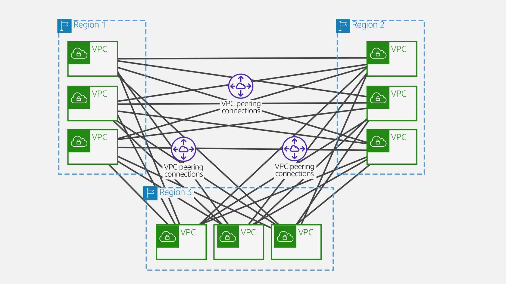
    + With AWS Transit Gateway, the same environment only needs three peering connections. The transit gateway in each Region facilitates routing network traffic to all the VPCs in its Region. Because all routing can be managed by the transit gateway, the customer only needs to maintain three routing configurations, simplifying management.
    
+ AWS Transit Gateway charges for the number of connections per hour and per GB of data processed.

# Understanding AWS Networking Gateways
## internet gateway
+ attach to vpc
+ regional resource
## natway gateway
+ resides in the public subnet of a vpc
+ regional resource, IPV4only
+ allow private subnet to connect internet, but revents the internet fro initiating a connection with those instances
+ is highly available, implemented with redundance inside an availability zone
+ cannot route traffix to a nat gateway throught a vpc peering connection, site to site vpn connection or direct connect
## virtual private gateway
+ can only attach one virtual private gateway to one vpc, one to one relationship
+ virtual private gateway is the router on the amazone side of the vpn tunel
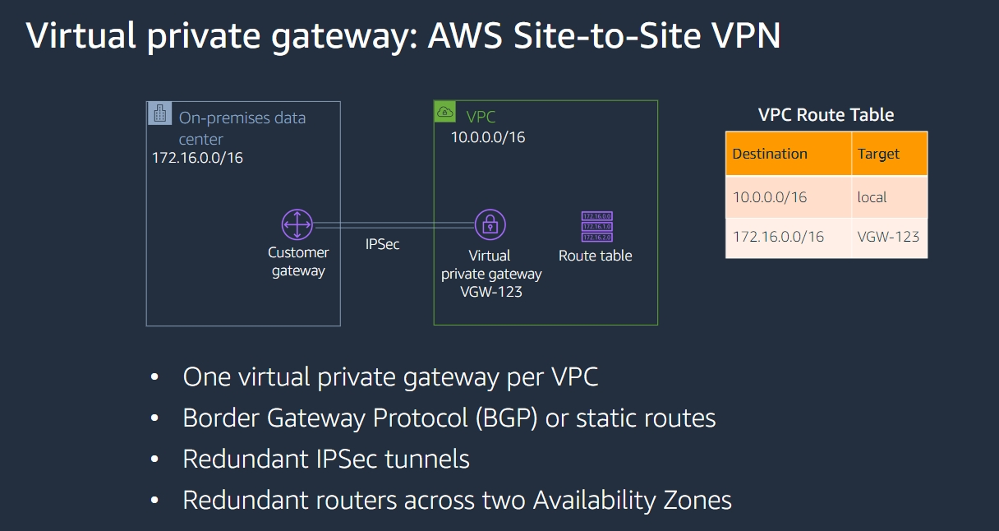
+ multi vpn connections to the same virtual private gateway are possible
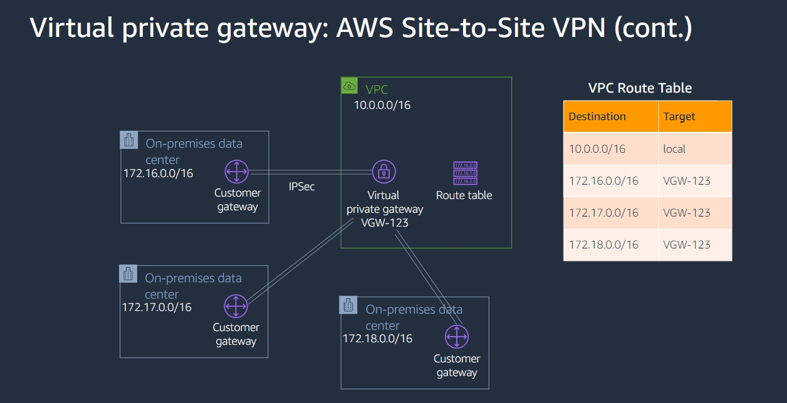
+ the cirtual private gateway is the router on the amazone side of the direct connect connection
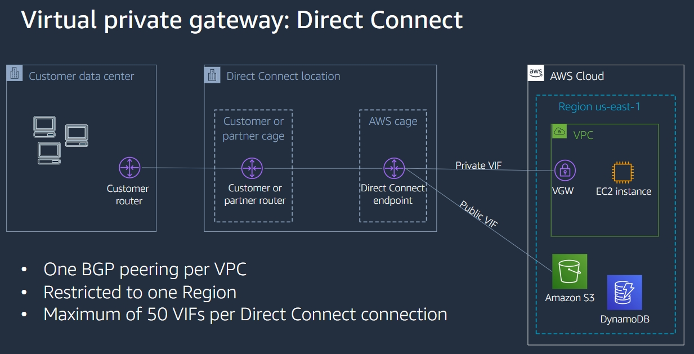
## customer gateway
+ a customer gate way is a physical or software appliance on the customer side of a site-to-site vpn connection
+ the same customer gateways can be reused for multiple site-to-site vpn connections, but you must consider high availability
## aws direct connect gateway
+  is a global resource
+ connect up to 10 virtual private gateways globally and cross account
+ has one BGP peering direct connect gateway per direct connect connection
+ can be associated with a virtual private gateway or transit gateway
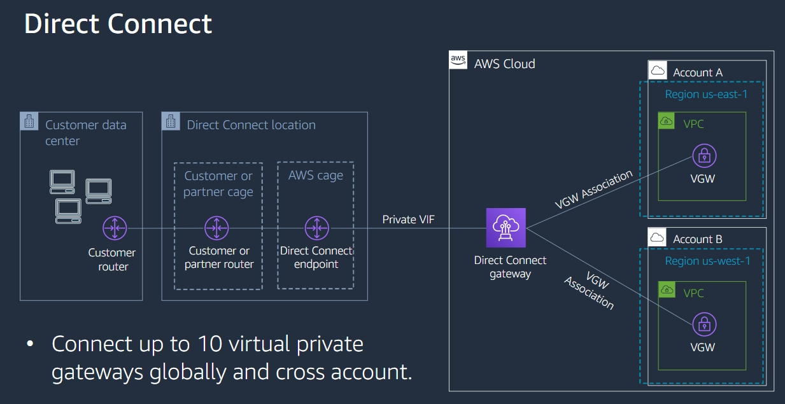
## aws transit gateway
+ resides outside of a vpc
+ connect vpcs and on-premises networks through a central hub
+ simplifies networking by actiong as a regional virtual router
+ regional resource
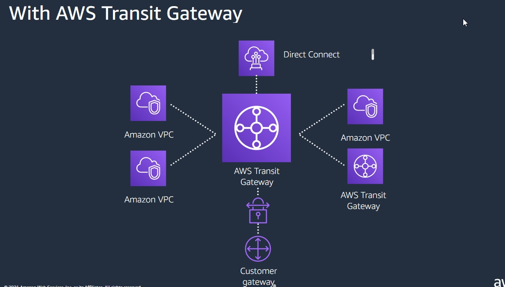
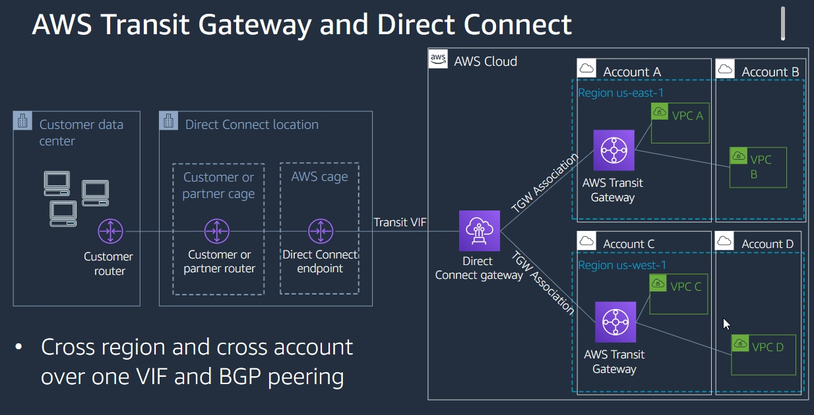
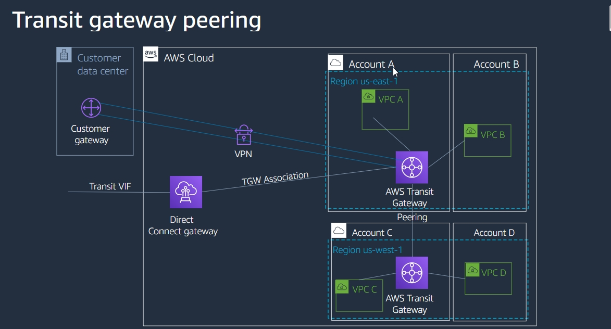
+ key concept
    + attachment
        + vpcs
        + cpn connection
        + direct connect gateways
        + transit gateway connect attachemnts
        + transit gateway peering connections
    + assiciaction
        + the route table used to route packets coming from an attachment
    + propagation
        + the route table item
        + how to send packet
        + the route table where the attachment's routes are installed,
        + 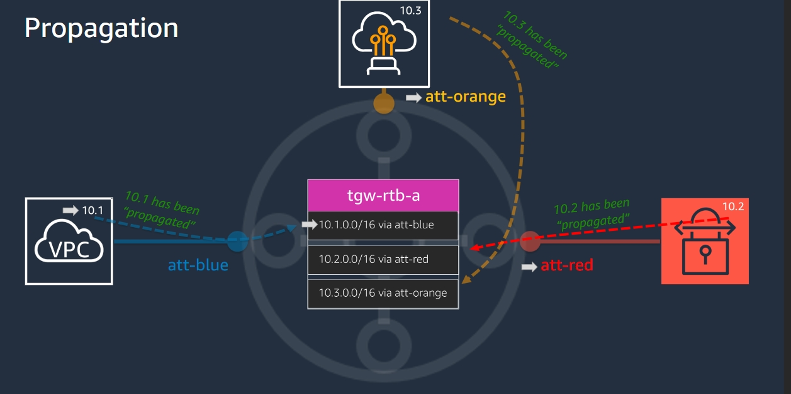
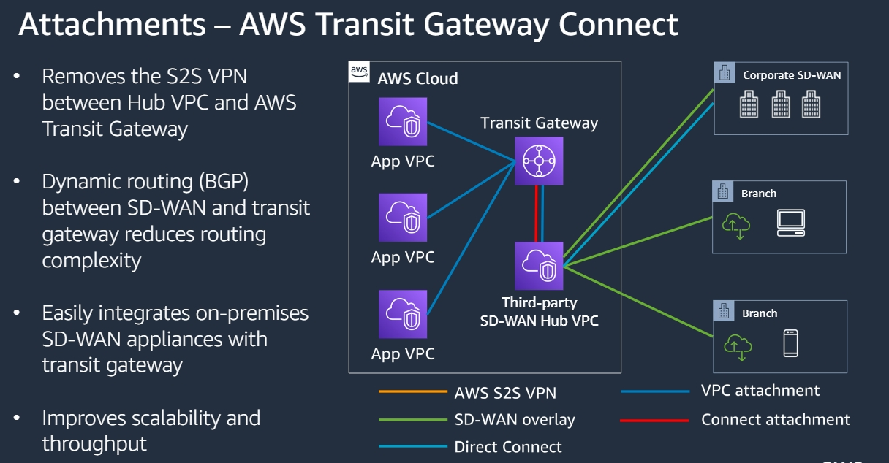

## local gateway(AWS Outpost)
+ one local gateway per outpost
+ provides a target in your vpc route tables for on-premises destined traffic
+ performs nat for instances that have been assigned addressed from your customer-owned ip pool
+ Components
    + route tables
        + aws creates a local gateway for your outpost and a local gateway route table as part of the installation prcess.
        + you can only associate the local gateway route table with subnets that resides in the outpost
    + virtual interface
        + aws creates on vif for each link aggregation froup, and then associates the vif with the default local gateway route table
+ 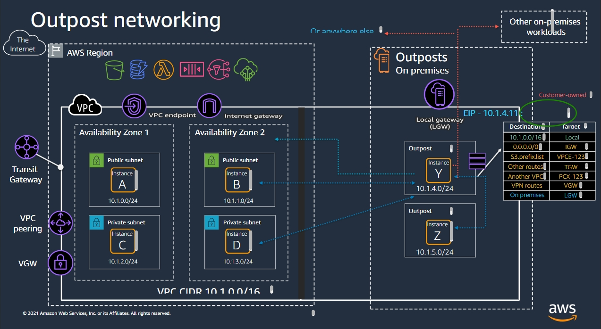

# AWS Network + Monitoring and Troubleshooting
+ What are some common use cases for network monitoring?
    + Network performance monitoring: At the core, the function of network monitoring is to observe your network for performance issues. 
    + Network security monitoring is crucial, and tools can add more security along with focusing on the performance of your network.
    + Capacity monitoring: You can also monitor the users on your network to see if one or many are draining the network.
    + Application performance optimization: Application performance optimization and network monitoring facilitates monitoring and troubleshooting of performance issues with your applications. 
+ Top metrics to track for operational health of your network
    + Bandwidth capacity: Bandwidth usage is the maximum data transmission rate possible on a network.
        + For optimal network operations, you want to get as close to your maximum bandwidth as possible without reaching critical levels.
        + This indicates that your network is sending as much data as it can within a period of time, but isn’t being overloaded.
    + Throughput
        + Throughput measures your network’s actual data transmission rate, which can vary wildly through different areas of your network.
        + A low throughput means there are a lot of failed or dropped packets that need to be sent again.
        + If you have a high bandwidth connection but low throughput,  that's an indicator of an underlying problem.
    + Latency
        + Latency is the delay that happens between a node or device requesting data and when that data is finished being delivered. 
    + Packet loss
        + Packet loss examines how many data packets are dropped during data transmissions on your network. The more data packets that are lost, the longer it takes for a data request to be fulfilled. 
    + Retransmission rate 
        + Retransmission is when packets are lost. The network needs to retransmit them to complete a data request. 
        + This retransmission rate lets your enterprise know how often packets are being dropped, which is an indication of congestion on your network. 
    + Availability
        + Network availability, also known as uptime, measures whether the network is currently operational.
        + Uptime is a measurement of availability, the percentage of time the network is available. 
    + Connectivity
        + Connectivity refers to whether the connections between the nodes on your network are working properly.
        + One metric to track for connectivity is jitter, which is important when using real-time applications, such as video conferencing and virtual desktop infrastructure. 
        + Jitter is a variation in delay or disruption that occurs while data packets travel across the network.
        + There are many factors that can cause jitter, and one difficult thing about jitter is that it doesn’t affect all network traffic in the same way.
    + Network and server response time
        + Many applications today utilize the TCP protocol and are based on a client/server model.
        + The application response time metric measures the time it takes for a server to respond to a data request with application data.
        + This metric can tell us how quickly the application is responding to requests.
    + CloudWatch metrics
+ How to implement network security
    + Firewalls
    + Packet Sniffers
    + Penetration testing
+ Active network attacks are often aggressive and people are immediately aware of the attack. Examples of active attacks are:
    + Masquerade attacks
    + Message replay 
    + Message modification
    + Denial-of-service attacks 
    + With active attacks, instead of prevention, it is important to focus more on detective controls, detecting the attacks, and restoring the system afterward.
+ Passive network attacks are when an attacker analyzes traffic and the content of packets. 
    + From the packet collection, information can be obtained regarding your network design, protocols used, information on hosts, and more. When reassembling packets, encryption can be compromised over time and confidential data can be collected.
    + An example of a passive attack is a Man-in-the-middle attack.

# Top metrics to track for operational health of your network
+ Top metrics to track for operational health of your network
    + Bandwidth capacity: Bandwidth usage is the maximum data transmission rate possible on a network
    + Throughput: Throughput measures your network’s actual data transmission rate, which can vary wildly through different areas of your network.
    + Latency: Latency is the delay that happens between a node or device requesting data and when that data is finished being delivered. 
    + Packet loss: Packet loss examines how many data packets are dropped during data transmissions on your network.
    + Retransmission: Retransmission is when packets are lost. The network needs to retransmit them to complete a data request. This retransmission rate lets your enterprise know how often packets are being dropped, which is an indication of congestion on your network. 
    + Availability: Network availability, also known as uptime, measures whether the network is currently operational. Uptime is a measurement of availability, the percentage of time the network is available. 
    + Connectivity: Connectivity refers to whether the connections between the nodes on your network are working properly. 
    + Network and server response time: Many applications today utilize the TCP protocol and are based on a client/server model. The application response time metric measures the time it takes for a server to respond to a data request with application data. This metric can tell us how quickly the application is responding to requests.
    + CloudWatch metrics:Metrics tracked in AWS compared to on-premises have different considerations.

# security monitoring
+ Security monitoring refers to security information monitoring (SIM) and security event monitoring (SEM)
+ For the security perspective, you can also use four kinds of controls. 
    + Directive controls establish the governance, risk, and compliance models within which the environment operates. 
    + Detective controls are intended to identify and characterize an incident in progress and provide assistance during investigations and audits after the event has occurred.
    + Preventive controls are designed to prevent an incident from occurring. 
    + Responsive controls are intended to limit the extent of any damage caused by the incident. 

# How to implement network security
+ Firewalls
    + Firewalls are a system designed to prevent unauthorized access to or from a private network. 
    + You can implement a firewall in either hardware or software form, or a combination of both. 
    + Firewalls prevent unauthorized internet users from accessing private networks connected to the internet, especially intranets.
+ Packet Sniffers
    + Packet sniffers, also known as a packet analyzer, protocol analyzer or network analyzer, are pieces of hardware or software used to monitor network traffic. 
    + Sniffers work by examining streams of data packets that flow between computers on a network and also flow between networked computers and the larger internet. 
    + These packets are addressed to specific machines. Using a packet sniffer in promiscuous mode lets engineers, end users, or malicious intruders to examine any packet, regardless of destination. 
    + You can configure sniffers in two ways.
    + The first is unfiltered, meaning they will capture all packets possible and write them to a local hard drive for later examination. 
    + Next is filtered, mode, meaning analyzers will only capture packets that contain specific data elements. 
+ Penetration testing
    + Penetration testing software or penetration tools help in identifying security weaknesses in a network, server, or web application. 
    + These tools are useful to identify the unknown vulnerabilities in the software and networking applications that can cause a security breach. 
    + Using penetration testing:
        + The pentester will simulate an attack against the organization’s security infrastructure (network, applications, and users) to detect the exploitable weaknesses in the system. 
        + The assessment results will then be documented for  management and the technical team. 
        + Penetration testing helps to determine the efficacy of the security policies, strategies, and controls in an organization.

# Attacks
+ Active network attacks are often aggressive and people are immediately aware of the attack. 
    + Examples of active attacks are:
        + Masquerade attacks
        + Message replay 
        + Message modification
        + Denial-of-service attacks 
    + With active attacks, instead of prevention, it is important to focus more on detective controls, detecting the attacks, and restoring the system afterward. Active attacks typically require more effort and generally have more difficult implications.
+ Passive network attacks are when an attacker analyzes traffic and the content of packets. 
    + From the packet collection, information can be obtained regarding your network design, protocols used, information on hosts, and more. When reassembling packets, encryption can be compromised over time and confidential data can be collected.
    + An example of a passive attack is a Man-in-the-middle attack.
    + Unlike active attacks, passive attacks are difficult to detect because they do not involve alteration in data or information. Although they can be prevented using encryption techniques, more emphasis is given to prevention controls compared to the detection controls. 

# Tools for monitoring and troubleshooting 
+ Amazon CloudWatch: Amazon CloudWatch is a core supporting service within AWS that provides metrics, logs, and event management services. It is used through other AWS services for health and performance monitoring, log management, and architectures.
+ VPC Flow Logs: VPC Flow Logs is a feature that lets you to capture information about the IP traffic going to and from network interfaces in your VPC.
+ Traffic Mirroring:You can use Traffic Mirroring to copy network traffic from an elastic network interface of an Amazon EC2 instance. In addition, you can send the traffic to out-of-band security and monitoring appliances for:
    + Content inspection
    + Threat monitoring
    + Troubleshooting
+ VPC Reachability Analyzer: The VPC Reachability Analyzer is a network diagnostics tool that troubleshoots reachability between two endpoints in an Amazon VPC, or within multiple Amazon VPCs.
+ AWS Transit Gateway Network Manager: The AWS Transit Gateway Network Manager lets you to centrally manage your networks that are built around transit gateways. You can visualize and monitor your global network across Regions and on-premises locations.
+ AWS CloudTrail：AWS CloudTrail is an AWS service that logs all API actions in your account. CloudTrail maintains the audit logs of changes to the AWS account.There are two types of CloudTrail Events that CloudTrail logs.
    + Management Events: By default, CloudTrail only logs management events such as creating an Amazon EC2 instance and an Amazon VPC. It provides information about management operations.
    + Data Events:  By default, CloudTrail only logs management events because data events occur more often. Data events are the resource operations in a resource such as AWS Lambda functions or objects uploaded to Amazon S3. 
    + CloudTrail does not log in real time. There is a delay, but you can create a CloudTrail and store that data in Amazon S3 or CloudWatch logs.

# Tools to monitor throughput and bandwidth:
+ iPerf/iPerf3 are tools for active measurements of the maximum achievable bandwidth on IP networks. It supports tuning of various parameters related to timing, buffers, and protocols (TCP, UDP, SCTP with IPv4 and IPv6). For each test, they report the bandwidth, loss, and other parameters. 
+ ExtraHop is a monitoring solution for security, network performance, and the cloud. It gives detailed metrics on average bandwidth utilization, average throughput, and more.
+ Netperf is a CLI tool similar to iPerf that measures throughput and benchmarking speeds.

# Managing collected metrics
+ CloudWatch uses namespaces. Each namespace contains data and each different namespace holds different data.
+ The namespace starting with AWS/service is reserved for AWS only. You can create custom namespaces to collect data on your applications and systems
+ CloudWatch pricing
    + You pay for what you use, and you will be charged at the end of the month for that usage.
    + When you exceed three dashboards with up to 50 metrics.
    + By ingesting and storing logs, as well as the amount of ingested logs scanned for each CloudWatch Insights query.
    + Based on the number of custom events.
+ Recommendations to cost optimize your account:
    + Only use detailed monitoring when needed.
    + Remove any unnecessary alarms.
    + Disable monitoring of custom metrics.
    + Delete unnecessary dashboards.
    + Stop ingesting logs that are not needed.
    + Run queries for shorter durations.  

# AWS Systems Manager Agent
+ AWS Systems Manager Agent (SSM Agent) is Amazon software that can be installed and configured on an Amazon Elastic Compute Cloud (Amazon EC2) instance, an on-premises server, or a virtual machine (VM). SSM Agent makes it possible for Systems Manager to update, manage, and configure these resources.
+ AWS Systems Manager (formerly known as SSM) is an AWS service that you can use to view and control your infrastructure on AWS. 
+ Using the Systems Manager console, you can view operational data from multiple AWS services and automate operational tasks across your AWS resources. 
+ Systems Manager helps you maintain security and compliance by scanning your managed instances and reporting on (or taking corrective action on) any policy violations it detects
+ If you monitor traffic, you will see your Amazon Elastic Compute Cloud (Amazon EC2) instances, any on-premises servers, or virtual machines in your hybrid environment, communicating with ec2messages.* endpoints. 
+ AWS Systems Manager Agent (SSM Agent):
    + Writes information about executions, commands, scheduled actions, errors, and health statuses to log files on each instance. 
    + Logs files by manually connecting to an instance or automatically send logs to CloudWatch Logs.
+  SSM Agent sends status and execution information back to the Systems Manager service by using the Amazon Message Delivery Service (service prefix: ec2messages).
+ You can improve the security posture of your managed instances (including managed instances in your hybrid environment) by configuring Systems Manager to use an interface VPC endpoint in Amazon VPC. An interface VPC endpoint (interface endpoint) helps to connect to services powered by AWS PrivateLink, a technology that enables you to privately access Amazon Elastic Compute Cloud (Amazon EC2) and Systems Manager APIs by using private IP addresses. 
+ Other uses for the SSM Agent:
    + Use SSM to connect to your hosts, not exposing port 22.
    + Log SSM API calls with CloudTrail.
    + Sending instance logs to CloudWatch Logs.
    + Configure CloudWatch Logs for Run command.
    + Monitor Run Command metrics using CloudWatch.

+ CloudWatch Agent
+ Manually connecting to an instance to view log files and troubleshoot an issue with SSM Agent is time consuming.
+ A best practice is to configure the SSM Agent to automatically send its log data to a log group in CloudWatch Logs for analysis.
+ You can configure and use the CloudWatch Agent to collect metrics and logs from your instances instead of using Systems Manager Agent (SSM Agent) for these tasks. 
+ For more efficient monitoring, the CloudWatch Agent gathers more metrics on EC2 instances and on-premises servers than are available using SSM Agent. Using CloudWatch Logs, you can monitor log data in real time, search and filter log data by creating one or more metric filters, and archive and retrieve historical data when you need it. 
+ CloudWatch Logs provides the following benefits:
    + Centralized log file storage for all SSM Agent log files
    + Quicker access to files to investigate errors
    + Indefinite log file retention (configurable)
    + Ability to maintain and access logs regardless of the status of the instance
    + Access to other CloudWatch features such as metrics and alarms
+ If you use Amazon VPC to host your AWS resources, you can establish a private connection between your VPC and CloudWatch Logs. You can use this connection to send logs to CloudWatch Logs without sending them through the internet. 
# Working with log groups and log streams
+ Log events： Log events are a record of some activity recorded by the application or resource being monitored. The log event record that CloudWatch Logs understands contains two properties: the timestamp of when the event occurred, and the raw event message. Event messages must be UTF-8 encoded.
+ Log streams： Log streams are a sequence of log events that share the same source. More specifically, a log stream is generally intended to represent the sequence of events coming from the application instance or resource being monitored. 
+ Log groups： Log groups define groups of log streams that share the same retention, monitoring, and access control settings. Each log stream has to belong to one log group. For example, if you have a separate log stream for the Apache access logs from each host, you can group those log streams into a single log group called MyWebsite.com/Apache/access_log.
There is no limit on the number of log streams that can belong to one log group.
+ Metric filters：Metric filters can extract metric observations from ingested events and transform them to data points in a CloudWatch metric. Metric filters are assigned to log groups and all of the filters assigned to a log group are applied to their log streams.
+ Retention settings： Retention settings can be used to specify how long log events are kept in CloudWatch Logs. Expired log events get deleted automatically. Just like metric filters, retention settings are also assigned to log groups, and the retention assigned to a log group is applied to its log streams.

# CloudWatch Logs Insights 
+ CloudWatch Logs Insights helps you efficiently identify patterns, interactively search, and analyze your log data with bar charts, line charts, and stacked area charts. You can perform queries to efficiently and effectively respond to operational or network issues. If an issue occurs, you can use CloudWatch Logs Insights to identify potential causes and validate deployed fixes. 
+ After you have created a query, you can save:
    + Queries and run them again later. 
    + Queries in a folder structure to help you keep them organized. 
    + 1,000 CloudWatch Logs Insights queries, per Region per account.

# VPC Flow Logs
+ VPC Flow Logs is a service that provides visibility in your Amazon VPC by capturing information about the internet protocol (IP) traffic going to and from network interfaces.
+ You can use VPC Flow Logs as a centralized source to monitor different network aspects and to provide a history of network traffic flows within entire Amazon VPCs, subnets, or specific elastic network interfaces (ENIs). 
+ VPC Flow Logs collect metadata for all Amazon VPC networks that are used by your workload. Flow log data can be published to Amazon CloudWatch Logs or Amazon Simple Storage Service (Amazon S3). After you've created a flow log, you can retrieve and view its data in the chosen destination.
    +  Each network interface has a unique log stream in the log group.
+ Flow logs can help you with a number of tasks, such as:
    + Diagnosing overly restrictive security group rules.
    + Monitoring the traffic that is reaching your instance.
    + Determining the direction of the traffic to and from the network interfaces.
+  monitor all activity at three different levels:
    + VPC level monitors all the activity of your operations within your cloud environment.
    + Subnet level monitors all activity for a specific subnet. 
    + Network interface level monitors specific interfaces on Amazon Elastic Compute Cloud (Amazon EC2) instances and capture flow logs from that interface.
+ Flow log limitations
+ Changes cannot be made to the configuration of a flow log or the format of a flow log record after they have been created.
+ Flow logs can only be configured for VPC peering connections deployed by your account. VPC peering connections deployed by another account cannot be monitored using VPC flow logs even if they have been authorized to link to VPCs within your account.
+ Network interfaces for EC2-Classic instances are not supported. This includes instances linked to your VPC through ClassicLink.

# Traffic Mirroring with AWS
+ Packet sniffing, also known as traffic sniffing, is a practice of collecting and analyzing some or all of the data packets that pass through the point in a physical network that is being monitored.
+ Packet sniffing requires either access to the hardware of a network or the ability to configure a network adapter on a network for promiscuous mode.
+ This makes traffic sniffing a passive mode of monitoring or even an attack. This is a security risk and not supported in AWS.
+ AWS only allows packets addressed for the network interface to reach it, all other traffic is filtered out, including protocols such as address resolution protocol (ARP) and broadcast traffic. 
+ VPC Traffic Mirroring:
    + Copies each IP packet, sent or received, by an elastic network interface (ENI) on an Amazon EC2 instance to a traffic mirror target. A traffic mirror target is an out-of-band security appliance, monitoring appliance, or Network Load balancer.
    + Captures and inspects network traffic at scale and provides data for troubleshooting and intrusion detection, along with other types of threat monitoring and content inspection. 
+ VPC Traffic Mirroring gives you direct access to the network packets flowing through your VPC to help analyze network traffic and compare it to VPC Flow Logs to ensure the right technique for a given operations task is chosen.
+ Traffic Mirroring key concepts
    + VPC Traffic Mirroring creates a copy of traffic on an Amazon VPC network interfaces associated with Amazon EC2 instances to capture inbound and outbound network traffic.
    + The traffic mirror source is the network interface of an Amazon EC2 instance where AWS copies the network traffic from. VPC Traffic Mirroring supports the use of Elastic Network Interfaces (ENIs) as mirror sources.
    + A traffic mirror target is the destination for mirrored traffic. The traffic mirror target can be:
        + A network interface or a network load balancer.
        + Used in more than one traffic mirror session.
    + A traffic mirror filter  is a set of rules that defines the traffic that is copied in a traffic mirror session. By default, no traffic is mirrored. To mirror traffic, add traffic mirror rules to the filter. Traffic mirror filter rules define what traffic gets mirrored.
    + A traffic mirror session establishes a relationship between a traffic mirror source and a traffic mirror target that makes use of a traffic mirror filter.  
        + A given packet is only mirrored one time. 
    + Connectivity：Mirrored network traffic is subject to connectivity considerations. The source and target can share an Amazon VPC, or exist in different ones with an intra-Region VPC peering connection or a transit gateway. The traffic target does not have to share an AWS account with the source. Thus, users must know the AWS rules that govern routing before they implement VPC Traffic Mirroring.
+ How Traffic Mirroring works
    + Traffic Mirroring copies inbound and outbound traffic from the network interfaces that are attached to your Amazon EC2 instances. You can send the mirrored traffic to the network interface of another EC2 instance, or a Network Load Balancer that has a User Datagram Protocol (UDP) listener. If the traffic mirror source and the traffic mirror target is owned by:
        + The same AWS account, it can be in the same Amazon VPC or in a different Amazon VPC connected through an intra-Region VPC peering or a transit gateway.
        + A different AWS account from the traffic mirror source, this is a cross-account traffic mirror target design. The traffic mirror target owner must share the target with you using the Amazon Resource Access Manager (Amazon RAM). 
+ VPC Traffic Mirroring and VPC Flow Logs can be used together for a deeper understanding of your Amazon VPC traffic. 
+ VPC Flow Logs are easier to implement and use, but they provide little context. VPC Flow Logs help to troubleshoot connectivity and security issues, and collects, stores, and analyzes network flow logs about the following:
    + Allowed and denied traffic
    + Source and destination IP addresses
    + Ports
    + Protocol number
    + Packet and byte counts
    + Action taken (accept or reject)
+ Traffic Mirroring provides deeper insight and gives more context into the network traffic to analyze actual traffic content, including payload. All traffic is combined into log files and shows pivot points, which are a technical analysis indicator used to determine the overall trend, such as certificate hashes, protocol version, and authentication status. 
+ The following tools work with VPC Traffic Mirroring:
    + Zeek — Zeek Network Security Monitor is a comprehensive open-source platform for intrusion detection and other security monitoring features, as well as network traffic analysis. 
    + Suricata — Suricata, an open-source network threat detection engine, enables real-time intrusion detection and prevention and network security monitoring, driven by the Open Information Security Foundation. 

# VPC Reachability Analyzer
+ As a solution, AWS offers the VPC Reachability Analyzer, which can be integrated into your network design process. It aids in troubleshooting network issues by verifying connectivity using automated reasoning. All resource configurations (security groups, routes, firewalls, and so on) that can affect the connectivity of your network are inspected to determine if the network flow is possible. 
+ It can only be used for endpoints within the same Amazon VPC as a:
    + Configuration analysis tool that helps to perform connectivity testing between a source resource and a destination resource. 
    + Network diagnostics tool that troubleshoots reachability between two endpoints.
+ You can run a reachability analysis between:
    + VPN gateways
    + Network interfaces
    + Internet gateways
    + VPC endpoints
    + VPC peering connections
    + Transit gateways
+ How VPC Reachability Analyzer works
    + Create a path.
        + The first step is to specify the path of communication for the traffic from a source to a destination for any of the following endpoint types: VPN Gateways, Instances, Network Interfaces, Internet Gateways, VPC Endpoints, VPC Peering Connections, and Transit Gateways.
        + The source and destination resources must be:
            + Owned by the same AWS account.
            + In the same AWS Region.
            + In the same Amazon VPC or in Amazon VPCs that are connected through a VPC peering connection. In the case of a shared Amazon VPC, the resources must be owned by the same AWS account.
    + Analyze the path.
        + After you create the path, Reachability Analyzer analyzes the path once. You can analyze a path at any time to determine whether your intended connectivity is supported, even as your network configuration changes.
    + View the results of the path analysis .Once the path analysis completes, you can view the results. When the destination is:
        + Reachable, the Reachability Analyzer produces hop-by-hop details of the virtual network path between the source and the destination. 
        + Not reachable, the Reachability Analyzer identifies the blocking component. Paths can be blocked by configuration issues in a security group, network ACL, route table, or load balancer. 
    + Change the network configuration and analyze the path . If the reachability status does not match your intent, you can change your network configuration. Then you can analyze the path again to confirm that the reachability status matches your intent.
+ With VPC Reachability Analyzer, you are charged per analysis run between a source and a destination. It is best practice to run analysis during networking configuration changes and to troubleshoot connectivity issues that arise.

# AWS Transit Gateway Network Manager
+ AWS Transit Gateway Network Manager helps to centrally manage your networks that are built around transit gateways.
+ As you migrate workloads to AWS Regions, you need to maintain connectivity between their offices, AWS Regions, and existing on-premises data centers.
+ You can visualize and monitor your global network across Regions and on-premises locations. 
+ Network Manager:
    + Uses the AWS Global Network for inter-Region peering and accelerated VPN to improve application performance.  In this way, you can reduce the number of leased lines required to operate your network, optimizing your cost and improving agility. 
    + Reduces the operational complexity of managing a global network across AWS and on premises. With Network Manager, you set up a global view of your private network by registering your transit gateways and on premises resources. Your global network can then be visualized and monitored through a centralized operational dashboard.
    + Helps to optimize connectivity and centrally manage your network. It monitors traffic routed through transit gateways and across the AWS Global Network:
        + From on-premises sites to AWS
        + Between on-premises sites
+ Transit Gateway Network Manager adds simplified visibility and network control to monitor your Amazon VPCs and edge connections from a central console.
    + Create a global network
    + Register your transit gateways
        + When you register a transit gateway, the following transit gateway attachments are automatically included in your global network:
            + VPCs
            + Site-to-Site VPN connections
            + AWS Direct Connect gateways
            + Transit Gateway Connect
            + Transit gateway peering connections
            + When you register a transit gateway that has a peering attachment, you can view the peer transit gateway in your global network, but you cannot view its attachments. If you own the peer transit gateway, you can register it in your global network to view its attachments.
    + Define and add resources
    + Analyze your network
    + Monitor your network
    + Once you have completed the steps your private network will have a single global view using Network Manager.