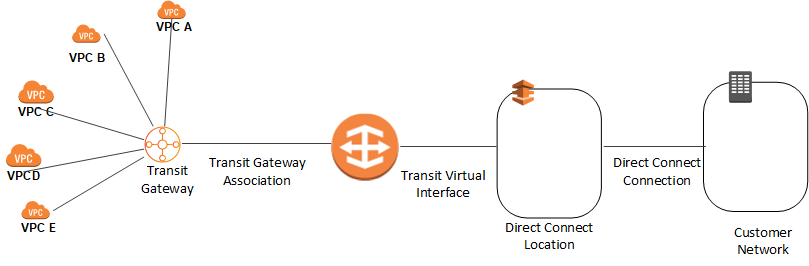

# Overview
+ A *transit gateway* is a **network transit hub** that you can use to interconnect your virtual private clouds (VPCs) and on-premises networks.
+ A *transit gateway* acts as a **Regional virtual router** for traffic flowing between your virtual private clouds (VPCs) and on-premises networks.
+ As your cloud infrastructure expands globally, inter-Region peering connects transit gateways together using the AWS Global Infrastructure.
+ Your data is automatically encrypted and never travels over the public internet.
+ A transit gateway **scales elastically** based on the volume of network traffic.
+ Routing through a transit gateway operates at **layer 3**, where the packets are sent to a specific next-hop attachment, based on their destination IP addresses.
+ AWS Transit Gateway is a highly available and scalable service that provides interconnectivity between VPCs and your on-premises network.
+ Within a Region, AWS Transit Gateway provides a method for consolidating and centrally managing routing between VPCs with a hub-and-spoke network architecture.
+ Between Regions, AWS Transit Gateway supports inter-regional peering with other transit gateways. It does this to facilitate routing network traffic between VPCs of different Regions over the AWS global backbone. This removes the need to route traffic over the internet.
+ AWS Transit Gateway also integrates with hybrid network configurations when a Direct Connect or AWS Site-to-Site VPN connection is connected to the transit gateway.
+ Transit gateways are a regional service and support a hub-and-spoke network design within the Region in which they are deployed. 
+ AWS Transit Gateway concepts
    + Attachments
        + One or more VPCs
        + A compatible Software-Defined Wide Area Network (SD-WAN) appliance
        + A Direct Connect gateway
        + A peering connection with another transit gateway
        + A VPN connection to a transit gateway
    + AWS Transit Gateway MTU
        + AWS Transit Gateway supports an MTU of 8,500 bytes for:
            + VPC connections
            + Direct Connect connections
            + Connections to other transit gateways
            + Peering connections
        + AWS Transit Gateway supports an MTU of 1,500 bytes for VPN connections.
    + AWS Transit Gateway route table
        + A transit gateway has a default route table and can optionally have additional route tables.
        + A route table includes dynamic and static routes that decide the next hop based on the destination IP address of the packet.
        + The target of these routes can be any transit gateway attachment. 
    + Associations
        + Each attachment is associated with exactly one route table. Each route table can be associated with zero to many attachments.
    + Route propagation
        + A VPC, VPN connection, or Direct Connect gateway can dynamically propagate routes to a transit gateway route table. With a Direct Connect attachment, the routes are propagated to a transit gateway route table by default.
        + With a VPC, you must create static routes to send traffic to the transit gateway.
        + With a VPN connection or a Direct Connect gateway, routes are propagated from the transit gateway to your on-premises router using BGP.
        + With a peering attachment, you must create a static route in the transit gateway route table to point to the peering attachment.
+ AWS Transit Gateway inter-regional peering
    + AWS offers two types of peering connections for routing traffic between VPCs in different Regions: VPC peering and transit gateway peering.
    + Both peering types are one-to-one, but transit gateway peering connections have a simpler network design and more consolidated management.
    + As with VPC peering connections, transit gateway inter-Region peering is a one-to-one connection between two transit gateways. Transitive peering is not supported. There is no peering relationship with a transit gateway that your transit gateway is not directly peered with.
    + Suppose a customer has multiple VPCs in three different Regions. As the following diagram illustrates, to permit network traffic to route between each VPC requires creating 72 VPC peering connections. Each VPC needs 8 different routing configurations and security policies. 
    
    + With AWS Transit Gateway, the same environment only needs three peering connections. The transit gateway in each Region facilitates routing network traffic to all the VPCs in its Region. Because all routing can be managed by the transit gateway, the customer only needs to maintain three routing configurations, simplifying management.
    
+ AWS Transit Gateway charges for the number of connections per hour and per GB of data processed.

# Transit gateway concepts
+ **Attachments** — You can attach the following: 
    + One or more VPCs
    + A Connect SD-WAN/third-party network appliance
    + An AWS Direct Connect gateway
    + A peering connection with another transit gateway
    + A VPN connection to a transit gateway
+ **Transit gateway Maximum Transmission Unit (MTU)** — The maximum transmission unit (MTU) of a network connection is the size, in bytes, of the largest permissible packet that can be passed over the connection. 
    + A transit gateway supports an MTU of 8500 bytes for traffic between VPCs, AWS Direct Connect, Transit Gateway Connect, and peering attachments.
    + Traffic over VPN connections can have an MTU of 1500 bytes.
+ **Transit gateway route table** — 
    + A transit gateway has **a default route table** and can optionally have additional route tables.
    + A route table includes **dynamic and static routes** that **decide the next hop based on the destination IP address of the packet**. 
    + The target of these routes could be any transit gateway attachment.
    + By default, transit gateway attachments are associated with the default transit gateway route table.
    + Transit gateway **peering attachments support static routing** only.
+ **Associations** — Each attachment is associated with exactly one route table. Each route table can be associated with zero to many attachments.
+ **Route propagation** — A VPC, VPN connection, or Direct Connect gateway can **dynamically propagate routes to a transit gateway route table**. With a Connect attachment, the routes are propagated to a transit gateway route table by default. 
+ With a VPC, you must create static routes to send traffic to the transit gateway.
+ With a VPN connection or a Direct Connect gateway, routes are propagated from the transit gateway to your on-premises router using **Border Gateway Protocol (BGP)**.
+ With a peering attachment, you must create a static route in the transit gateway route table to point to the peering attachment.
# Availability Zones
+ When you attach a VPC to a transit gateway, you must **enable one or more Availability Zones** to be used by the transit gateway to route traffic to resources in the VPC subnets.
+ To enable each Availability Zone, you **specify exactly one subnet**. 
+ The transit gateway places a network interface in that subnet using one IP address from the subnet.
+ After you enable an Availability Zone, traffic can be **routed to all subnets in that zone, not just the specified subnet**.
+ Resources that reside in Availability Zones where there is no transit gateway attachment cannot reach the transit gateway.
+ If you plan to configure a stateful network appliance in your VPC, you can enable appliance mode support for the VPC attachment in which the appliance is located. This ensures that **the transit gateway uses the same Availability Zone for that VPC attachment for the lifetime of a flow of traffic between source and destination**.
# Use  Cases
## Centralized router
+ You can configure your transit gateway as **a centralized router** that connects all of your VPCs, AWS Direct Connect, and Site-to-Site VPN connections.
+ In this scenario, all attachments are associated with the transit gateway default route table and propagate to the transit gateway default route table.
+ Therefore, **all attachments can route packets to each other**, with the transit gateway serving as a simple layer 3 IP router.
    
+ VPC route tables
+ Each VPC has a route table with 2 entries. The first entry is the default entry for local IPv4 routing in the VPC. This entry enables the **instances in this VPC to communicate with each other**. The second entry routes all other IPv4 subnet traffic to the transit gateway. The following table shows the VPC A routes.
    | Destination | Target |
    |------|------|
    | 10.1.0.0/16 | local |
    | 0.0.0.0/0 | *tgw-id* | 
+ Transit gateway route table
    | Destination| Target| Route type | 
    |------|------|------|
    | 10.1.0.0/16 | `Attachment for VPC A` | propagated |  
    | 10.2.0.0/16 | `Attachment for VPC B` | propagated | 
    | 10.3.0.0/16 | `Attachment for VPC C` | propagated | 
    | 10.99.99.0/24 | `Attachment for VPN connection` | propagated | 
+ Customer gateway BGP table: The customer gateway BGP table contains the following VPC CIDRs. 
    + 10.1.0.0/16
    + 10.2.0.0/16
    + 10.3.0.0/16
## Isolated VPCs
+ You can configure your transit gateway as **multiple isolated routers**.
+ This is similar to using multiple transit gateways, but provides more flexibility in cases where the routes and attachments might change.
+ In this scenario, **each isolated router has a single route table**.
+ All attachments **associated with an isolated router** propagate and associate with its route table.
+ Attachments associated with **same isolated router can route packets to each other**, but **cannot route packets to or receive packets from the attachments for another isolated router**.
+ VPC A, VPC B, and VPC C route tables
    
+ Each VPC has a route table with 2 entries. The first entry is the default entry for local IPv4 routing in the VPC. This entry enables the instances in this VPC to communicate with each other. The second entry routes all other IPv4 subnet traffic to the transit gateway. The following table shows the VPC A routes.
    | Destination | Target |
    |------|------|
    | 10.1.0.0/16 | local |
    | 0.0.0.0/0 | *tgw-id* |

+ Transit gateway route tables 
    + This scenario uses one route table for the VPCs and one route table for the VPN connection.
    + The **VPC attachments** are associated with the following route table, which has a propagated route for the VPN attachment.
    | Destination | Target | Route type | 
    | 10.99.99.0/24 | `Attachment for VPN connection` | propagated | 

+ The** VPN attachment** is associated with the following route table, which has propagated routes for each of the VPC attachments.
    | Destination | Target | Route type 
    | 10.1.0.0/16 | `Attachment for VPC A` | propagated |  
    | 10.2.0.0/16 | `Attachment for VPC B` | propagated |  
    | 10.3.0.0/16 | `Attachment for VPC C` | propagated | 
+ Customer gateway BGP table: The customer gateway BGP table contains the following VPC CIDRs. 
    + 10.1.0.0/16
    + 10.2.0.0/16
    + 10.3.0.0/16
# Transit gateway attachments
## VPC
+ When you attach a VPC to a transit gateway, you must **specify one subnet from each Availability Zone** to be used by the transit gateway to route traffic.
+ Specifying one subnet from an Availability Zone enables traffic to **reach resources in every subnet in that Availability Zone**.
+ The resources in a VPC attached to a transit gateway **cannot access the security groups of a different VPC** that is also attached to the same transit gateway.
## Direct Connect gateway
+ Attach a transit gateway to a Direct Connect gateway using a transit virtual interface. This configuration offers the following benefits. You can: 
    + Manage a single connection for multiple VPCs or VPNs that are in the same Region.
    + Advertise prefixes from on-premises to AWS and from AWS to on-premises.

## peering
+ You can peer two transit gateways and route traffic between them, which includes IPv4 and IPv6 traffic.
+ To do this, create a peering attachment on your transit gateway, and specify a transit gateway in another Region. 
+ To route traffic between the transit gateways, **add a static route** to the transit gateway route table that points to the transit gateway peering attachment.
# Multicast on transit gateways
+ Multicast is a communication protocol used for **delivering a single stream of data to multiple receiving computers simultaneously**.
+ Transit Gateway supports routing multicast traffic **between subnets of attached VPCs**, and it serves as a multicast router for instances sending traffic destined for multiple receiving instances.
# Transit Gateway Network Manager
+ Transit Gateway Network Manager (Network Manager) enables you to **centrally manage your networks** that are built around transit gateways.
+ You can visualize and monitor your global network across Regions and on-premises locations.
## Network Manager concepts
+ **global network** — A single, private network that acts as the high-level **container** for your network objects.
+ **device** — Represents **a physical or a virtual appliance** in an on-premises network, data center, AWS Cloud, or other cloud providers.
+ **connection** — Represents **connectivity between two devices**. The connection can be between a physical or virtual appliance and a third-party virtual appliance inside a VPC, or it can be between physical appliances in an on-premises network.
+ **link** — Represents a single internet connection from a site.
+ **site** — Represents a physical on-premises location. It could be a branch, office, store, campus, or a data center.
## How Transit Gateway Network Manager works
+ To use Transit Gateway Network Manager (Network Manager), you **create a global network** to represent your network.
+ Initially, the global network is empty. You then **register your existing transit gateways and define your on-premises resources** in the global network. 
+ When you register a transit gateway, the following transit gateway attachments are automatically included in your global network: 
    + VPCs
    + Site-to-Site VPN connections
    + AWS Direct Connect gateways
    + Transit Gateway Connect
    + Transit gateway peering connections
+ When you register a transit gateway that has a peering attachment, you can view the peer transit gateway in your global network, but you cannot view its attachments. 
+ This enables you to **visualize and monitor** your AWS resources and your on-premises networks.
+ After you create your global network, you can monitor your networks through a dashboard on the Network Manager console. 
# Reference
[What is a transit gateway?](https://docs.aws.amazon.com/vpc/latest/tgw/what-is-transit-gateway.html)
