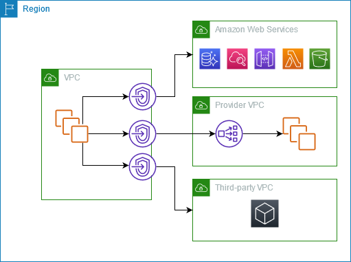
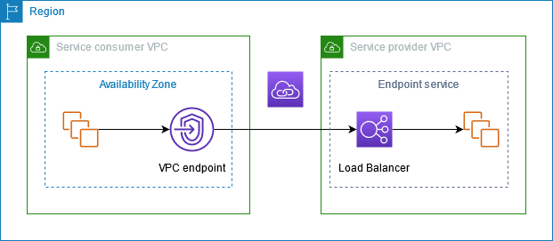
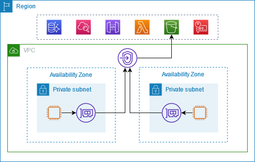
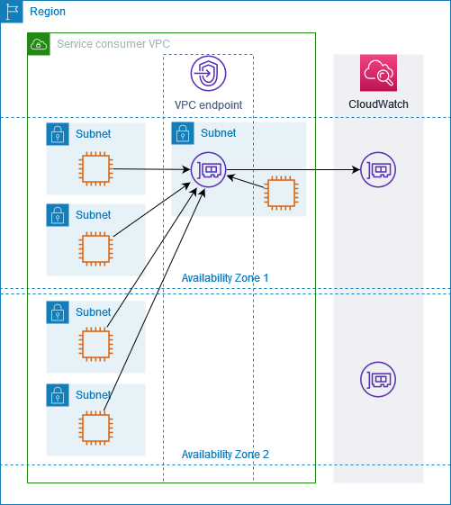
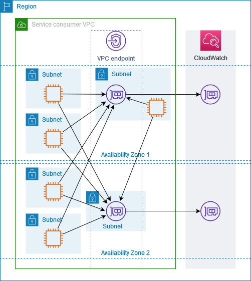
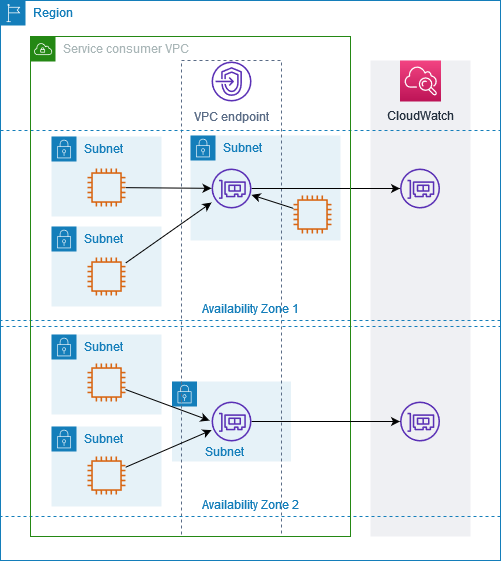
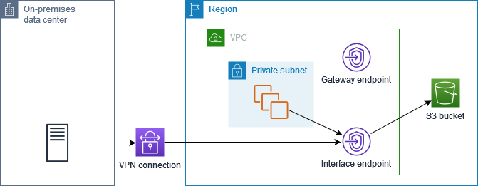
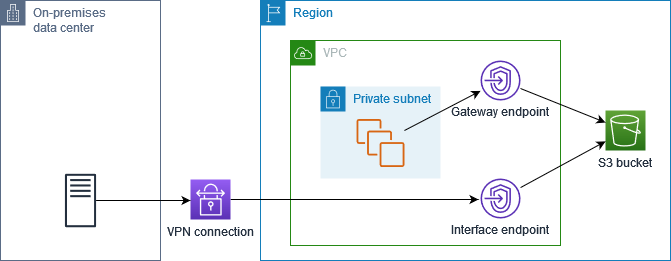
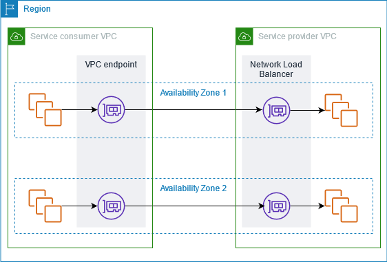
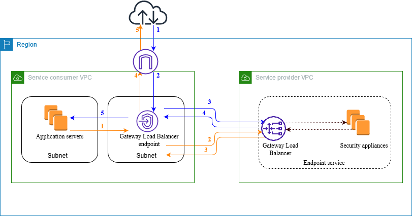

# Overview
+ AWS PrivateLink is a highly available, scalable technology that you can use to **privately connect your VPC to services as if they were in your VPC**.
+ You do not need to use an internet gateway, NAT device, public IP address, AWS Direct Connect connection, or AWS Site-to-Site VPN connection to allow communication with the service from your private subnets. 
+ Therefore, you control the specific API endpoints, sites, and services that are reachable from your VPC.
# Use cases
+ You can create VPC endpoints to connect resources in your VPC to services that integrate with AWS PrivateLink. You can create your own VPC endpoint service and make it available to other AWS customers.
+ In the following diagram, the VPC on the left has several EC2 instances in a private subnet and three interface VPC endpoints. The top-most VPC endpoint connects to an AWS service. The middle VPC endpoint connects to a service hosted by another AWS account (a VPC endpoint service). The bottom VPC endpoint connects to an AWS Marketplace partner service.

# AWS PrivateLink concepts
+ use AWS PrivateLink to allow the resources in your VPC to connect to services in other VPCs **using private IP addresses**, as if those services were hosted directly in your VPC.
## Architecture diagram
+ The following diagram provides a high-level overview of how AWS PrivateLink works. Service consumers create interface VPC endpoints to connect to endpoint services that are hosted by service providers.

## Service providers
+ The **owner of a service** is the service provider.
+ Service providers include **AWS, AWS Partners, and other AWS accounts**.
+ Service providers can host their services **using AWS resources**, such as EC2 instances, **or using on-premises servers**.
+ **Endpoint services**
    + A service provider creates an endpoint service to make their service available in a Region.
    + A service provider **must specify a load balancer** when creating an endpoint service.
    + The load balancer **receives requests from service consumers and routes them to your service**.
    + By default, your endpoint service is not available to service consumers. You must **add permissions that allow specific AWS principals to connect to your endpoint service**.
+ **Service names**
    + Each endpoint service is **identified by a service name**.
    + A service consumer must **specify the name of the service** when creating a VPC endpoint.
    + Service consumers can query the service names for AWS services.
    + Service providers must share the names of their services with service consumers.
+ **Service states**
    + The following are the possible states for an endpoint service:
    + Pending - The endpoint service is being created.
    + Available - The endpoint service is available.
    + Failed - The endpoint service could not be created.
    + Deleting - The service provider deleted the endpoint service and deletion is in progress.
    + Deleted - The endpoint service is deleted.
## Service consumers
+ The user of a service is a service consumer.
+ Service consumers can access endpoint services from AWS resources, such as EC2 instances, or from on-premises servers.
+ **VPC endpoints**
    + A service consumer **creates a VPC endpoint** to connect their VPC to an endpoint service.
    + A service consumer **must specify the service name of the endpoint service** when creating a VPC endpoint.
    + There are multiple types of VPC endpoints. You must create the type of VPC endpoint that's required by the endpoint service.
    + **Interface** - Create an interface endpoint to **send TCP traffic** to an endpoint service. Traffic destined for the endpoint service is resolved using **DNS**.
    + **GatewayLoadBalancer** - Create a Gateway Load Balancer endpoint to **send traffic to a fleet of virtual appliances using private IP addresses**. You route traffic from your VPC to the Gateway Load Balancer endpoint using route tables. The Gateway Load Balancer distributes traffic to the virtual appliances and can scale with demand.
    + There is another type of VPC endpoint, **Gateway**, which creates a **gateway endpoint to send traffic to Amazon S3 or DynamoDB**. Gateway endpoints **do not use AWS PrivateLink**, unlike the other types of VPC endpoints. 
+ **Endpoint network interfaces**
    + An endpoint network interface is a **requester-managed network interface that serves as an entry point** for traffic destined to an endpoint service. **For each subnet that you specify when you create a VPC endpoint, we create an endpoint network interface in the subnet**.
    + If a VPC endpoint supports IPv4, its endpoint network interfaces have IPv4 addresses. If a VPC endpoint supports IPv6, its endpoint network interfaces have IPv6 addresses. The IPv6 address for an endpoint network interface is unreachable from the internet. When you describe an endpoint network interface with an IPv6 address, notice that denyAllIgwTraffic is enabled.
    + The **IP addresses** of an endpoint network interface will **not change during the lifetime of its VPC endpoint**.
+ **Endpoint policies**
    + A VPC endpoint policy is an **IAM resource policy** that you attach to a VPC endpoint.
    + It determines **which principals can use the VPC endpoint** to access the endpoint service.
    + The default VPC endpoint policy **allows all actions by all principals on all resources** over the VPC endpoint.
+ **Endpoint states**
    + When you create a VPC endpoint, the endpoint service receives a connection request.
    + The service provider can accept or reject the request.
    + If the service provider accepts the request, the service consumer can use the VPC endpoint after it enters the Available state.
    + The following are the possible states for a VPC endpoint:
        + PendingAcceptance - The connection request is pending. This is the initial state if requests are manually accepted.
        + Pending - The service provider accepted the connection request. This is the initial state if requests are automatically accepted. The VPC endpoint returns to this state if the service consumer modifies the VPC endpoint.
        + Available - The VPC endpoint is available for use.
        + Rejected - The service provider rejected the connection request. The service provider can also reject a connection after it is available for use.
        + Expired - The connection request expired.
        + Failed - The VPC endpoint could not be made available.
        + Deleting - The service consumer deleted the VPC endpoint and deletion is in progress.
        + Deleted - The VPC endpoint is deleted.
## AWS PrivateLink connections
+ Traffic from your VPC is sent to an endpoint service using a connection between the VPC endpoint and the endpoint service.
+ Traffic between a VPC endpoint and an endpoint service **stays within the AWS network**, without traversing the public internet.
+ A service provider adds permissions so that service consumers can access the endpoint service. The **service consumer initiates the connection** and the service provider accepts or rejects the connection request.
+ With interface VPC endpoints, service consumers can use **endpoint polices** to control which IAM principals can use a VPC endpoint to access an endpoint service.
## Private hosted zones
+ A hosted zone is a container for DNS records that define how to route traffic for a domain or subdomain. 
+ With a public hosted zone, the records specify how to route traffic on the internet.
+ With a private hosted zone, the records specify how to route traffic in your VPCs.
+ You can configure Amazon Route 53 to route domain traffic to a VPC endpoint. 
+ You can use Route 53 to configure split-horizon DNS, where you use the same domain name for both a public website and an endpoint service powered by AWS PrivateLink. DNS requests for the public hostname from the consumer VPC resolve to the private IP addresses of the endpoint network interfaces, but requests from outside the VPC continue to resolve to the public endpoints. 
# Access AWS services through AWS PrivateLink
+ You can privately access the AWS services that **integrate with AWS PrivateLink using VPC endpoints**.
+ You can build and manage all layers of your application stack **without using an internet gateway**.
## Connect through AWS PrivateLink
+ The following diagram shows how instances access AWS services through AWS PrivateLink.
+ First, you create an interface VPC endpoint, which establishes connections between the subnets in your VPC and an AWS service using network interfaces.
+ Traffic destined for the AWS service is **resolved to the private IP addresses of the endpoint network interfaces using DNS**, and then sent to the AWS service using the connection between the VPC endpoint and the AWS service.

## DNS hostnames
+ With AWS PrivateLink, you send traffic to the service **using private endpoints**.
+ When you create an interface VPC endpoint, we **create Regional and zonal DNS names** that you can use to communicate with the AWS service from your VPC.
+ The Regional DNS name for your interface VPC endpoint has the following syntax:
    + endpoint_id.service_id.region.vpce.amazonaws.com
+ The zonal DNS names have the following syntax:
    + endpoint_id-az_name.service_id.region.vpce.amazonaws.com
+ When you create an interface VPC endpoint for an AWS service, you can **enable private DNS**. With private DNS, you can **continue to make requests to a service using the DNS name for its public endpoint, while leveraging private connectivity through the interface VPC endpoint**.
## DNS resolution
+ The **DNS records** that we create for your interface VPC endpoint are **public**.
+ Therefore, these DNS names are **publicly resolvable**. However, DNS requests from outside the VPC still **return the private IP addresses** of the endpoint network interfaces, so these IP addresses can't be used to access the endpoint service unless you have access to the VPC.
## Private DNS
+ If you **enable private DNS** for your interface VPC endpoint, and your VPC **has both DNS hostnames and DNS resolution enabled**, we create a **hidden, AWS-managed private hosted zone for you**.
+ The hosted zone contains a record set for **the default DNS name for the service that resolves it to the private IP addresses of the endpoint network interfaces in your VPC**.
+ Therefore, if you have existing applications that send requests to the AWS service using a public Regional endpoint, those requests now go through the endpoint network interfaces, without requiring that you make any changes to those applications.
+ Amazon provides a DNS server for your VPC, called the **Route 53 Resolver**. The Route 53 Resolver automatically resolves local VPC domain names and record in private hosted zones. However, you can't use the Route 53 Resolver from outside your VPC. If you'd like to access your VPC endpoint from your on-premises network, you can use Route 53 Resolver endpoints and Resolver rules. 
## Subnets and Availability Zones
+ You can configure your VPC endpoint with **one subnet per Availability Zone**.
+ We create an endpoint network interface for the VPC endpoint in your subnet. We assign IP addresses to each endpoint network interface from its subnet, based on the IP address type of the VPC endpoint.
+ The **IP addresses** of an endpoint network interface will **not change during the lifetime** of its VPC endpoint. 
+ In a production environment, for high availability and resiliency, we recommend the following:
    + Configure at least two Availability Zones per VPC endpoint and deploy your AWS resources that must access the AWS service in these Availability Zones.
    + Configure private DNS names for the VPC endpoint.
    + Access the AWS service by using its Regional DNS name, also known as the public endpoint.
+ endpoint network interface in a single Availability Zone
    + When any resource in any subnet in the VPC accesses Amazon CloudWatch using its public endpoint, we resolve the traffic to the IP address of the endpoint network interface.
    + This includes traffic from subnets in other Availability Zones.
    + However, if Availability Zone 1 is impaired, the resources in Availability Zone 2 lose access to Amazon CloudWatch.

    
 + endpoint network interfaces in two Availability Zones
    + When any resource in any subnet in the VPC accesses Amazon CloudWatch by using its public endpoint, we select **a healthy endpoint network interface, using the round robin algorithm** to alternate between them.
    + We then resolve the traffic to the IP address of the selected endpoint network interface.

    
+ If it's better for your use case, you can send traffic from your resources to the AWS service by using the endpoint network interface in the same Availability Zone. To do so, use the private zonal endpoint or IP address of the endpoint network interface.
    
# Gateway endpoints
+ Gateway VPC endpoints provide reliable connectivity to **Amazon S3 and DynamoDB** without requiring an internet gateway or a NAT device for your VPC. Gateway endpoints **do not use AWS PrivateLink**, unlike other types of VPC endpoints.
+ You can access Amazon S3 and DynamoDB through their public service endpoints or through gateway endpoints. This overview compares these methods.
+ There is no additional charge for using gateway endpoints.
+ A gateway endpoint is **available only in the Region where you created it**.
+ Gateway endpoints support **only IPv4 traffic**.
+ If you're using the Amazon DNS servers, you must **enable both DNS hostnames and DNS resolution for your VPC**. If you're using your own DNS server, ensure that requests to Amazon S3 resolve correctly to the IP addresses maintained by AWS.
+ The **rules for the security groups** for your instances that access Amazon S3 through a gateway endpoint must allow traffic to and from Amazon S3. You can reference the ID of the prefix list for Amazon S3 in security group rules.
+ **The network ACL** for the subnet for your instances that access Amazon S3 through a gateway endpoint must allow traffic to and from Amazon S3. You can't reference prefix lists in network ACL rules, but you can get the IP address range for Amazon S3 from the prefix list for Amazon S3.
+ Your account has a default quota of 20 gateway endpoints per Region, which is adjustable. There is also a limit of 255 gateway endpoints per VPC.
## Private DNS
+ You can configure private DNS to optimize costs when you create both a gateway endpoint and an interface endpoint for Amazon S3.
+ Route 53 Resolver
    + Amazon provides a DNS server, called the Route 53 Resolver, for your VPC. The Route 53 Resolver **automatically resolves local VPC domain names and records in private hosted zones**.
    + However, you **can't use** the Route 53 Resolver **from outside your VPC**.
    + Route 53 provides Resolver endpoints and Resolver rules so that you can use the Route 53 Resolver from outside your VPC.
    + An inbound Resolver endpoint forwards DNS queries **from the on-premises network to Route 53 Resolver**. 
    + An outbound Resolver endpoint forwards DNS queries **from the Route 53 Resolver to the on-premises network**.
    + When you configure your interface endpoint for Amazon S3 to use **private DNS only for the inbound Resolver endpoint**, we create an inbound Resolver endpoint. The inbound Resolver endpoint resolves DNS queries to Amazon S3 **from on-premises to the private IP addresses of the interface endpoint**.
    + We also add ALIAS records for the Route 53 Resolver to the public hosted zone for Amazon S3, so that DNS queries **from your VPC resolve to the Amazon S3 public IP addresses, which routes traffic to the gateway endpoint**.
+ Private DNS
    + If you configure private DNS for your interface endpoint for Amazon S3 but **do not configure private DNS only for the inbound Resolver endpoint**, requests from **both your on-premises network and your VPC use the interface endpoint to access Amazon S3**. Therefore, you pay to use the interface endpoint for traffic from the VPC, instead of using the gateway endpoint for no additional charge.

    
+ Private DNS only for the inbound Resolver endpoint
    + If you configure private DNS **only for the inbound Resolver endpoint**, requests from your **on-premises network use the interface endpoint to access Amazon S3, and requests from your VPC use the gateway endpoint to access Amazon S3**. Therefore, you optimize your costs, because you pay to use the interface endpoint only for traffic that can't use the gateway endpoint. 

    
## Gateway endpoints for Amazon S3
+ compare  Amazon S3 Gateway endpoints and Interface Endpoint
    | Gateway endpoints for Amazon S3 | Interface endpoints for Amazon S3 |
    |-----|-----|
    | In both cases, your network traffic remains on the AWS network. | |
    | Use Amazon S3 public IP addresses | Use private IP addresses from your VPC to access Amazon S3 |
    | Use the same Amazon S3 DNS names | Require endpoint-specific Amazon S3 DNS names |
    | Do not allow access from on premises | Allow access from on premises |
    | Do not allow access from another AWS Region | Allow access from a VPC in another AWS Region by using VPC peering or AWS Transit Gateway |
    | Not billed | Billed |
+ You can access Amazon S3 from your VPC using gateway VPC endpoints. After you create the gateway endpoint, you can **add it as a target in your route table for traffic destined from your VPC to Amazon S3**.
+ gateway endpoints **do not allow access** from on-premises networks, from peered VPCs in other AWS Regions, or through a transit gateway. For those scenarios, you must use an interface endpoint, which is available for an additional cost
# Access SaaS products through AWS PrivateLink
+ Using AWS PrivateLink, you can access SaaS products privately, as if they were running in your own VPC.
+ You can discover, purchase, and provision SaaS products powered by AWS PrivateLink through AWS Marketplace
+ You can also find SaaS products powered by AWS PrivateLink from AWS Partners

# Access virtual appliances through AWS PrivateLink
+ You can use a Gateway Load Balancer to distribute traffic to a fleet of network virtual appliances.
+ The appliances can be used for security inspection, compliance, policy controls, and other networking services.
+ You specify the Gateway Load Balancer when you create a VPC endpoint service. Other AWS principals access the endpoint service by creating a Gateway Load Balancer endpoint.

+ The application servers run in a subnet of the service consumer VPC.
+ You create a Gateway Load Balancer endpoint in another subnet of the same VPC.
+ All traffic entering the service consumer VPC through the internet gateway is first routed to the Gateway Load Balancer endpoint for inspection and then routed to the destination subnet.
+ Similarly, all traffic leaving the application servers is routed to the Gateway Load Balancer endpoint for inspection before it is routed back through the internet gateway.
+ Traffic from the internet to the application servers (blue arrows):
    + Traffic enters the service consumer VPC through the internet gateway.
    + Traffic is sent to the Gateway Load Balancer endpoint, based on route table configuration.
    + Traffic is sent to the Gateway Load Balancer for inspection through the security appliance.
    + Traffic is sent back to the Gateway Load Balancer endpoint after inspection.
    + Traffic is sent to the application servers, based on route table configuration.
+ Traffic from the application servers to the internet (orange arrows):
    + Traffic is sent to the Gateway Load Balancer endpoint, based on route table configuration.
    + Traffic is sent to the Gateway Load Balancer for inspection through the security appliance.
    + Traffic is sent back to the Gateway Load Balancer endpoint after inspection.
    + Traffic is sent to the internet gateway based on the route table configuration.
    + Traffic is routed back to the internet.
## Create an inspection system as a Gateway Load Balancer endpoint service
### Considerations
+ An endpoint service is available in the Region where you created it.
+ When service consumers retrieve information about an endpoint service, they can see only the Availability Zones that they have in common with the service provider. 
### Prerequisites
+ Create a service provider VPC with **at least two subnets in the Availability Zone** in which the service should be available. **One subnet is for the security appliance instances and the other is for the Gateway Load Balancer**.
+ **Create a Gateway Load Balancer** in your service provider VPC. If you plan to enable IPv6 support on your endpoint service, you must enable dualstack support on your Gateway Load Balancer.
+ **Launch security appliances** in the service provider VPC and register them with a load balancer target group.
### Make your endpoint service available
+ Service providers must do the following to make their services available to service consumers.
    + Add permissions that allow each service consumer to connect to your endpoint service.
    + Provide the service consumer with the name of your service and the supported Availability Zones so that they can create an interface endpoint to connect to your service.
    + Accept the endpoint connection request from the service consumer.
+ AWS principals can connect to your endpoint service privately by creating a Gateway Load Balancer endpoint.
## Access an inspection system using a Gateway Load Balancer endpoint
+ You can create a Gateway Load Balancer endpoint to connect to endpoint services powered by AWS PrivateLink.
+ For each subnet that you specify from your VPC, we **create an endpoint network interface in the subnet** and assign it a private IP address from the subnet address range. An endpoint network interface **is a requester-managed network interface**; you can view it in your AWS account, but you can't manage it yourself.
+ You are billed for hourly usage and data processing charges.
### Considerations
+ You can choose only one Availability Zone in the service consumer VPC. You can't change this subnet later on. To use a Gateway Load Balancer endpoint in a different subnet, you must create a new Gateway Load Balancer endpoint.
+ You can create a single Gateway Load Balancer endpoint per Availability Zone per service, and you must select the Availability Zone that the Gateway Load Balancer supports. 
+ Before you can use the endpoint service the service provider must accept the connection requests.
+ Each Gateway Load Balancer endpoint can support a bandwidth of up to 10 Gbps per Availability Zone and automatically scales up to 100 Gbps.
+ To keep traffic within the same Availability Zone, we recommend that you create a Gateway Load Balancer endpoint in each Availability Zone to which you'll send traffic.
### Prerequisites
+ Create a service consumer VPC with **at least two subnets in the Availability Zone** from which you'll access the service. **One subnet is for the application servers and the other is for the Gateway Load Balancer endpoint**.
+ To verify which Availability Zones are supported by the endpoint service, describe the endpoint service using the console or the describe-vpc-endpoint-services command.
+ If your resources are in a subnet with a network ACL, verify that the network ACL allows traffic between the endpoint network interfaces and the resources in the VPC.

# Create a service powered by AWS PrivateLink
+ You can create your own service powered by AWS PrivateLink, known as an endpoint service.
+ You are the service provider, and the AWS principals that create connections to your service are the service consumers.
+ Endpoint services require either a **Network Load Balancer or a Gateway Load Balancer**. The load balancer receives requests from service consumers and routes them to your service.
## Considerations
+ An endpoint service supports traffic only over TCP.
+ When service consumers retrieve information about an endpoint service, they can see only the Availability Zones that they have in common with the service provider. 
+ When service consumers send traffic to a service through an interface endpoint, the **source IP addresses provided to the application are the private IP addresses of the load balancer nodes, not the IP addresses of the service consumers**. If you **enable proxy protocol on the load balancer**, you can obtain the addresses of the service consumers and the IDs of the interface endpoints from the proxy protocol header.
+ If an endpoint service is associated with **multiple Network Load Balancers**, **each endpoint network interface is associated with one load balancer**.
    +  When the first connection from an endpoint network interface is initiated, we select one of the Network Load Balancers **in the same Availability Zone as the endpoint network interface at random**. 
    + All subsequent connection requests from this endpoint network interface use the selected load balancer.
    + We recommend that you **use the same listener and target group configuration for all load balancers for an endpoint service**, so that consumers can use the endpoint service successfully no matter which load balancer is chosen.
## Prerequisites
+ Create a VPC for your endpoint service with **at least one subnet in each Availability Zone** in which the service should be available.
+ To enable service consumers to create IPv6 interface VPC endpoints for your endpoint service, the VPC and subnets must have **associated IPv6 CIDR blocks**.
+ Create a Network Load Balancer in your VPC. Select **one subnet per Availability Zone** in which the service should be available to service consumers. For low latency and fault tolerance, we recommend that you make your service **available in at least two Availability Zones in the Region**.
+ To enable your endpoint service to **accept IPv6 requests**, its Network Load Balancers must **use the dualstack IP address type**. 
+ Launch instances in each Availability Zone in which the service should be available and register them with a load balancer target group.
# Reference
[AWS PrivateLink](https://docs.aws.amazon.com/vpc/latest/privatelink/what-is-privatelink.html)