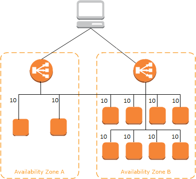

# Overview
+ Elastic Load Balancing **automatically distributes** your incoming traffic across multiple targets, such as EC2 instances, containers, and IP addresses, **in one or more Availability Zones**.
+ Using a load balancer **increases the availability and fault tolerance** of your applications.
+ Elastic Load Balancing supports the following load balancers: **Application** Load Balancers, **Network** Load Balancers, **Gateway** Load Balancers, and **Classic** Load Balancers.
+ The load balancer also **monitors the health** of its registered targets and ensures that it **routes traffic only to healthy targets**. 
# How Elastic Load Balancing works
## Listener
+ You configure your load balancer to accept incoming traffic by specifying one or more *listeners*.  
+ A listener is **a process that checks for connection requests.**
+ It is configured with a protocol and port number for **connections from clients to the load balancer**. Likewise, it is configured with a protocol and port number for **connections from the load balancer to the targets**.
### TCP/SSL protocol
+ When you use TCP (layer 4) for both front-end and back-end connections, your load balancer forwards the request to the back-end instances **without modifying the headers**.
+ After your load balancer receives the request, it **attempts to open a TCP connection to the back-end instance** on the port specified in the listener configuration.
+ Because load balancers intercept traffic between clients and your back-end instances, **the access logs for your back-end instance contain the IP address of the load balancer instead of the originating client.**
+ You can **enable proxy protocol**, which adds a header with the connection information of the client, such as the source IP address, destination IP address, and port numbers. The header is then sent to the back-end instance as a part of the request.
+ Using this configuration, you **do not receive cookies for session stickiness or X-Forwarded headers**.
### HTTP/HTTPS protocol
+ When you use HTTP (layer 7) for both front-end and back-end connections, your load balancer **parses the headers in the request** and **terminates the connection** before sending the request to the back-end instances.
+ For every registered and healthy instance behind an HTTP/HTTPS load balancer, Elastic Load Balancing **opens and maintains one or more TCP connections**. These connections ensure that there is always an established connection ready to receive HTTP/HTTPS requests.
+ Because load balancers intercept traffic between clients and servers, your **server access logs contain only the IP address of the load balancer**. To see the IP address of the client, use the **X-Forwarded-For** request header. 
+ When you use HTTP/HTTPS, you can **enable sticky sessions** on your load balancer. 
    + A sticky session binds a user's session to a specific back-end instance.
    + This ensures that **all requests coming from the user during the session are sent to the same back-end instance**.
+ Elastic Load Balancing **does not support Server Name Indication (SNI)** on your load balancer.
### HTTPS/SSL listeners
+ SSL server certificates 
    + If you use HTTPS or SSL for your front-end connections, you must **deploy an X.509 certificate (SSL server certificate) on your load balancer.** The load balancer decrypts requests from clients before sending them to the back-end instances (known as **SSL termination**).
     + If you don't want the load balancer to handle the SSL termination (known as *SSL offloading*), you can use TCP for both the front-end and back-end connections, and **deploy certificates on the registered instances** handling requests.
+ Elastic Load Balancing provides **predefined SSL negotiation configurations** that are used for SSL negotiation when a connection is established between a client and your load balancer. 
+ The SSL negotiation configurations provide compatibility with a broad range of clients and use high-strength cryptographic algorithms called *ciphers*.
+ Elastic Load Balancing uses a Secure Socket Layer (SSL) negotiation configuration, known as a *security policy*, to negotiate SSL connections between a client and the load balancer.
+ A security policy is a combination of **SSL protocols, SSL ciphers, and the Server Order Preference** option
+ Back-end server authentication 
    + If you use HTTPS or SSL for your back-end connections, you can **enable authentication** of your registered instances.
    + You can then use the authentication process to ensure that the instances accept only encrypted communication, and to ensure that each registered instance has the correct public key.
## Availability Zones and load balancer nodes
+ When you **enable an Availability Zone** for your load balancer, Elastic Load Balancing **creates a load balancer node** in the Availability Zone. If you **register targets in an Availability Zone but do not enable** the Availability Zone, these registered targets **do not receive** traffic
+ Your load balancer is **most effective** when you ensure that **each enabled Availability Zone has at least one registered target**.
+ After you **disable** an Availability Zone, the targets in that Availability Zone **remain registered** with the load balancer. However, even though they remain registered, the load balancer **does not route traffic** to them.
+ To ensure that your load balancer can scale properly, verify that each Availability Zone subnet for your load balancer has a CIDR block with **at least a `/27` bitmask** (for example, `10.0.0.0/27`) and at least 8 free IP addresses per subnet. 
+ When **cross-zone load balancing is enabled**, each load balancer node distributes traffic **across the registered targets in all enabled Availability Zones**. 
    
+ When **cross-zone load balancing is disabled**, each load balancer node distributes traffic only across the registered targets **in its Availability Zone**.   
    + Each of the two targets in Availability Zone A receives 25% of the traffic.
    + Each of the eight targets in Availability Zone B receives 6.25% of the traffic.
    + This is because each load balancer node can route its 50% of the client traffic only to targets in its Availability Zone.

    
## Request routing
+ Before a client sends a request to your load balancer, it **resolves the load balancer's domain name** using a Domain Name System (DNS) server. 
+ The DNS entry is controlled by Amazon, because your load balancers are in the `amazonaws.com` domain.
+ The Amazon DNS servers return **one or more IP addresses** to the client. 
+ These are the **IP addresses of the load balancer nodes** for your load balancer. 
+ As traffic to your application changes over time, Elastic Load Balancing **scales your load balancer** and updates the DNS entry. 
+ The DNS entry also specifies the **time-to-live (TTL) of 60 seconds**.
+ With **Application Load Balancers**, the load balancer node that receives the request uses the following process: 
    + **Evaluates the listener rules** in priority order to determine which rule to apply.
    + Selects a target from the target group for the rule action, using the routing algorithm configured for the target group. 
    + The default routing algorithm is round robin; alternatively, you can specify the least outstanding requests routing algorithm.
+ With **Network Load Balancers**, the load balancer node that receives the connection uses the following process: 
    + Selects a target from the target group for the default rule using a **flow hash algorithm**
    + **Routes each individual TCP connection to a single target** for the life of the connection
+ With **Classic Load Balancers**, the load balancer node that receives the request selects a registered instance as follows: 
    + Uses the **round robin** routing algorithm for **TCP listeners**
    + Uses the **least outstanding requests** routing algorithm for **HTTP and HTTPS listeners**
## Load balancer scheme
+ When you create a load balancer, you must choose whether to make it an **internal load balancer or an internet-facing load balancer**. 
+ Note that when you create a Classic Load Balancer in EC2-Classic, it must be an internet-facing load balancer.
+ **internet-facing load balancer**
    + The nodes of an internet-facing load balancer have **public IP addresses**.
    + The DNS name of an internet-facing load balancer is publicly resolvable to the **public IP addresses** of the nodes.
    + Therefore, internet-facing load balancers can **route requests from clients over the internet.**
+ **internal load balancer**
    + The nodes of an internal load balancer have only **private IP addresses**.
    + The DNS name of an internal load balancer is publicly resolvable to the **private IP addresses** of the nodes.
    + Therefore, internal load balancers can only **route requests from clients with access to the VPC** for the load balancer.
+ Both internet-facing and internal load balancers **route requests to your targets using private IP addresses**. 
## Network MTU for your load balancer
+ The maximum transmission unit (MTU) of a network connection is **the size, in bytes, of the largest permissible packet** that can be passed over the connection. The larger the MTU of a connection, the more data that can be passed in a single packet.
+ The MTU size on an Application Load Balancer, Network Load Balancer, or Classic Load Balancer node is **not configurable**.
+ **Jumbo frames** (MTU 9001) are standard across all load balancer nodes. 
## interface VPC endpoints
+ You can establish **a private connection** between your virtual private cloud (VPC) and the Elastic Load Balancing API by **creating an interface VPC endpoint**.
+ You can use this connection to call the Elastic Load Balancing API from your VPC **without sending traffic over the internet**. 
# Configure your Load Balancer
## idle connection timeout
+ or each request that a client makes through a Classic Load Balancer, the load balancer maintains two connections.
+ The front-end connection is between the client and the load balancer.
+ The back-end connection is between the load balancer and a registered EC2 instance.
+ The load balancer has a configured **idle timeout period** that applies to its connections. If **no data has been sent or received by the time that the idle timeout period elapses**, the load balancer **closes the connection**.
+ If you use **HTTP and HTTPS listeners**, we recommend that you **enable the HTTP keep-alive** option for your instances.  
    + Keep-alive, when enabled, enables the load balancer to **reuse back-end connections until the keep-alive timeout expires**.
    + To ensure that the load balancer is responsible for closing the connections to your instance, make sure that **the value you set for the HTTP keep-alive time is greater than the idle timeout setting** configured for your load balancer.
## connection draining 
+  *Connection draining* enables the load balancer to **complete in-flight requests** made to instances that are de-registering or unhealthy.
+ When you enable connection draining, you can **specify a maximum time** for the load balancer to keep connections alive before reporting the instance as de-registered.
+ The maximum timeout value can be set between **1 and 3,600 seconds (the default is 300 seconds).**
## cross-zone load balancing
+ With *cross-zone load balancing*, each load balancer node for your Classic Load Balancer distributes requests evenly across the registered instances **in all enabled Availability Zones.**
+ If cross-zone load balancing is disabled, each load balancer node distributes requests evenly across the registered instances **in its Availability Zone only**.
## proxy protocol support
+ If you enable proxy protocol, **a human-readable header is added to the request header** with connection information such as the source IP address, destination IP address, and port numbers.
+ The **header is then sent to the instance** as part of the request.
+ If your application has its own session cookie, then you can configure Elastic Load Balancing so that the session cookie **follows the duration specified by the application's session cookie**.
+ If your application does not have its own session cookie, then you can configure Elastic Load Balancing to create a session cookie by specifying your own stickiness duration.
## sticky sessions
+ sticky sessions enables the load balancer to bind a user's session to a specific instance. 
+ This ensures that all requests from the user during the session are sent to the same instance.
## Access logs
+ Elastic Load Balancing provides access logs that capture detailed information about requests sent to your load balancer.
+ Each log contains information such as the time the request was received, the client's IP address, latencies, request paths, and server responses.
+ You can use these access logs to analyze traffic patterns and to troubleshoot issues.
+ After you enable access logging for your load balancer, Elastic Load Balancing captures the logs and **stores them in the Amazon S3 bucket** that you specify.
## Deletion protection
+ To prevent your load balancer from being deleted accidentally, you can enable deletion protection.
+ By default, deletion protection is disabled for your load balancer.
# Classic Load Balancer
+ Using a Classic Load Balancer instead of an Application Load Balancer has the following benefits: 
    + Support for EC2-Classic
    + Support for TCP and SSL listeners
    + Support for sticky sessions using application-generated cookies
## Listener configurations for Classic Load Balancers
+ HTTP/HTTPS load balancer 
    | Use case | Front-end protocol | Front-end options | Back-end protocol | Back-end options | Notes |
    |----|----|----|----|----|----|
    | Basic HTTP load balancer| HTTP | NA | HTTP | NA |  Supports the [X-Forwarded headers](https://docs.aws.amazon.com/elasticloadbalancing/latest/classic/x-forwarded-headers.html#x-forwarded-for) |
    | Secure website or application using Elastic Load Balancing to offload SSL decryption | HTTPS | [SSL negotiation](https://docs.aws.amazon.com/elasticloadbalancing/latest/classic/elb-ssl-security-policy.html) | HTTP | NA | Supports the X-Forwarded headers, Requires an SSL certificate deployed on the load balancer | 
    | Secure website or application using end-to-end encryption | HTTPS | SSL negotiation | HTTPS | Back-end authentication | Supports the X-Forwarded headers, Requires SSL certificates deployed on the load balancer and the registered instances | 
+ TCP/SSL load balancer 
    | Use case | Front-end protocol | Front-end options | Back-end protocol | Back-end options | Notes |
    |----|----|----|----|----|----|
    | Basic TCP load balancer | TCP | NA | TCP | NA | Supports the proxy protocol header | 
    | Secure website or application using Elastic Load Balancing to offload SSL decryption | SSL | SSL negotiation | TCP | NA | Requires an SSL certificate deployed on the load balancer,  Supports the proxy protocol header | 
    | Secure website or application using end-to-end encryption with Elastic Load Balancing | SSL | SSL negotiation | SSL | Back-end authentication | Requires SSL certificates deployed on the load balancer and the registered instances, Does not insert SNI headers on back-end SSL connections, Does not support the proxy protocol header | 
# Application Load Balancer
+ An Application Load Balancer functions at the application layer, the **seventh layer** of the Open Systems Interconnection (OSI) model.
+ You can configure listener rules to route requests to different target groups **based on the content of the application traffic**. 
+ Using an Application Load Balancer instead of a Classic Load Balancer has the following benefits: 
    + Support for [Path conditions](https://docs.aws.amazon.com/elasticloadbalancing/latest/application/load-balancer-listeners.html#path-conditions). You can configure rules for your listener that **forward requests based on the URL in the request**. This enables you to **structure your application as smaller services**, and route requests to the correct service based on the content of the URL.
    + Support for [Host conditions](https://docs.aws.amazon.com/elasticloadbalancing/latest/application/load-balancer-listeners.html#host-conditions). You can configure rules for your listener that forward requests **based on the host field in the HTTP header**. This enables you to **route requests to multiple domains** using a single load balancer.
    + Support for routing **based on fields in the request**, such as [HTTP header conditions](https://docs.aws.amazon.com/elasticloadbalancing/latest/application/load-balancer-listeners.html#http-header-conditions) and methods, query parameters, and source IP addresses.
    + Support for routing requests to **multiple applications on a single EC2 instance**. You can **register an instance or IP address with multiple target groups**, each on a different port.
    + Support for **redirecting requests** from one URL to another.
    + Support for **returning a custom HTTP response**.
    + Support for **registering targets by IP address**, including targets outside the VPC for the load balancer.
    + Support for **registering Lambda functions** as targets.
    + Support for the load balancer to **authenticate users** of your applications through their corporate or social identities before routing requests.
    + Support for **containerized applications**. Amazon Elastic Container Service (Amazon ECS) can select an unused port when scheduling a task and register the task with a target group using this port. This enables you to make efficient use of your clusters.
    + Support for **monitoring the health of each service independently**, as health checks are defined at the target group level and many CloudWatch metrics are reported at the target group level. Attaching a target group to an Auto Scaling group enables you to **scale each service dynamically** based on demand.
    + Access logs contain additional information and are stored in compressed format.
    + **Improved** load balancer **performance**.
    + You can use **AWS WAF** with your Application Load Balancer to allow or block requests based on the rules in a web access control list (web ACL)
    + You can use **request tracing** to track HTTP requests from clients to targets or other services. When the load balancer receives a request from a client, it adds or updates the **X-Amzn-Trace-Id** header before sending the request to the target.
+ The following are the possible target types: 
    + `instance: `The targets are specified by instance ID.
    + `ip:` The targets are IP addresses.
    + `lambda`: The target is a Lambda function.
# Network Load Balancer
+ A Network Load Balancer functions at the **fourth layer** of the Open Systems Interconnection (OSI) model.
+ It can handle **millions of requests per second**
+ Using a Network Load Balancer instead of a Classic Load Balancer has the following benefits: 
    + Ability to handle volatile workloads and **scale to millions of requests per second**.
    + Support for **static IP addresses for the load balancer**. You can also assign one Elastic IP address per subnet enabled for the load balancer.
    + Support for **registering targets by IP address**, including targets outside the VPC for the load balancer.
    + Support for **routing requests to multiple applications on a single EC2 instance**. You can register each instance or IP address with the same target group using multiple ports.
    + Support for **containerized applications**. 
    + Support for **monitoring the health of each service independently**, as health checks are defined at the target group level and many Amazon CloudWatch metrics are reported at the target group level. Attaching a target group to an Auto Scaling group enables you to **scale each service dynamically based on demand**.
+ The following are the possible target types: 
    + `instance: `The targets are specified by instance ID.
    + `ip:` The targets are IP addresses.
# Gateway Load Balancer
+ Gateway Load Balancers enable you to **deploy, scale, and manage virtual appliances**, such as firewalls, intrusion detection and prevention systems, and deep packet inspection systems.
+ It **combines a transparent network gateway** (that is, a single entry and exit point for all traffic) and **distributes traffic while scaling your virtual appliances with the demand**.
+ A Gateway Load Balancer operates at the **third layer** of the Open Systems Interconnection (OSI) model, the **network layer.**
+  It **listens for all IP packets across all ports** and forwards traffic to the target group that's specified in the listener rule.
+ The following are the possible target types: 
    + `instance: `The targets are specified by instance ID.
    + `ip:` The targets are IP addresses.
## Gateway Load Balancer endpoint
+ Gateway Load Balancers use **Gateway Load Balancer endpoints** to securely exchange traffic across VPC boundaries.
+ A Gateway Load Balancer endpoint is a VPC endpoint that **provides private connectivity between virtual appliances** in the service provider VPC and **application servers** in the service consumer VPC.
+ You deploy the Gateway Load Balancer **in the same VPC as the virtual appliances**.
+ You **register the virtual appliances with a target group** for the Gateway Load Balancer.
+ Traffic to and from a Gateway Load Balancer endpoint is configured using **route tables**.
+ Traffic flows from the service consumer VPC over the Gateway Load Balancer endpoint to the Gateway Load Balancer in the service provider VPC, and then returns to the service consumer VPC.
+ You must create the Gateway Load Balancer endpoint and the application servers **in different subnets**. This enables you to configure the Gateway Load Balancer endpoint as the next hop in the route table for the application subnet.
## Gateway Load Balancer Workflow
+ The application servers run in one subnet (destination subnet) in the service consumer VPC, while the Gateway Load Balancer endpoint is in another subnet of the same VPC. All traffic entering the service consumer VPC through the internet gateway is **first routed to the Gateway Load Balancer endpoint for inspection and then routed to the destination subnet**.
+ Similarly, all traffic leaving the application servers (destination subnet) is **routed to the Gateway Load Balancer endpoint for inspection before it is routed back to the internet**.
+ The following network diagram is a visual representation of how a Gateway Load Balancer endpoint is used to access an endpoint service:+  
    
## Routing
+ The route table for the **internet gateway** must have an entry that **routes traffic destined for the application servers to the Gateway Load Balancer endpoint**. 
    | Destination | Target | 
    | ------ | ------ | 
    | 10.0.0.0/16 | Local |
    | 10.0.1.0/24 | `vpc-endpoint-id` | 
+ The route table for the **subnet with the application servers** must have an entry that **routes all traffic (0.0.0.0/0) from the application servers to the Gateway Load Balancer endpoint**.
    | Destination | Target | 
    | ------ | ------ | 
    | 10.0.0.0/16 | Local |
    | 0.0.0.0/0 | `vpc-endpoint-id` | 
+ The route table for the **subnet with the Gateway Load Balancer endpoint** must **route traffic that returns from inspection to its final destination**. For traffic that originated from the internet, the local route ensures that it reaches the application servers. For traffic that originated from the application servers, add an entry that routes all traffic (0.0.0.0/0) to the internet gateway.
    | Destination | Target | 
    | ------ | ------ | 
    | 10.0.0.0/16 | Local |
    | 0.0.0.0/0 | `internet-gateway-id` | 
# Reference
+ [what-is-load-balancing](https://docs.aws.amazon.com/elasticloadbalancing/latest/userguide/what-is-load-balancing.html)
+ [classic load balancing](https://docs.aws.amazon.com/elasticloadbalancing/latest/classic/introduction.html)
+ [application load balancing](https://docs.aws.amazon.com/elasticloadbalancing/latest/application/introduction.html)
+ [network load balancing](https://docs.aws.amazon.com/elasticloadbalancing/latest/network/introduction.html)
+ [gateway load balancing](https://docs.aws.amazon.com/elasticloadbalancing/latest/gateway/introduction.html)
